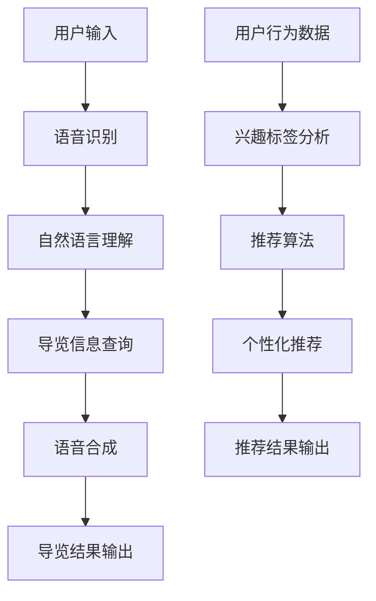

                 

关键词：智慧旅游、大模型、智能导览、个性化推荐、创业者、人工智能、旅游行业

摘要：本文将探讨大模型在智慧旅游领域中的应用，分析如何利用人工智能技术打造智能导览和个性化推荐系统，为创业者提供有价值的指导。我们将深入探讨大模型的原理、算法、应用场景以及未来发展，为智慧旅游的创新与实践提供新的思路。

## 1. 背景介绍

### 1.1 智慧旅游的概念

智慧旅游，是指利用物联网、大数据、云计算、人工智能等先进技术，对旅游资源、旅游活动、旅游者行为等进行智能化管理和服务的创新模式。智慧旅游的核心理念是通过科技手段提升旅游体验，实现旅游服务的高效化、个性化和智能化。

### 1.2 大模型的兴起

大模型，即大规模神经网络模型，是近年来人工智能领域的重要突破。从最初的简单神经网络到如今的深度学习模型，大模型在图像识别、自然语言处理、语音识别等领域取得了显著成果，成为推动人工智能发展的重要力量。

### 1.3 大模型在智慧旅游中的应用

随着大模型技术的不断发展，其在智慧旅游领域中的应用也越来越广泛。智能导览和个性化推荐是其中的两个重要应用方向。智能导览通过大模型对景点信息、语音、图像等多种数据进行处理，为游客提供更加便捷、丰富的导览服务。个性化推荐则根据游客的兴趣、偏好和行为，提供定制化的旅游信息和服务。

## 2. 核心概念与联系

### 2.1 大模型原理

大模型是基于神经网络的一种机器学习模型，通过大量的训练数据来学习特征表示和预测规律。其基本架构包括输入层、隐藏层和输出层，其中隐藏层负责特征提取和组合。

### 2.2 智能导览技术

智能导览技术主要涉及语音识别、图像识别、自然语言处理等技术。通过这些技术，大模型可以实现对游客提问的理解和回答，为游客提供实时、个性化的导览服务。

### 2.3 个性化推荐技术

个性化推荐技术主要基于协同过滤、矩阵分解、深度学习等算法。大模型可以通过分析游客的历史行为、兴趣标签、地理位置等信息，为游客推荐符合其偏好的旅游目的地、景点和活动。

### 2.4 Mermaid 流程图

以下是智能导览与个性化推荐的 Mermaid 流程图：



## 3. 核心算法原理 & 具体操作步骤

### 3.1 算法原理概述

智能导览与个性化推荐的核心算法主要涉及深度学习、自然语言处理和协同过滤等。深度学习算法负责特征提取和模式识别，自然语言处理算法负责语言理解与生成，协同过滤算法负责推荐系统的构建与优化。

### 3.2 算法步骤详解

1. **数据预处理**：收集并整理用户行为数据、景点信息、文本数据等，对数据进行分析和处理，提取关键特征。
2. **特征提取**：使用深度学习算法对图像、语音、文本等数据进行特征提取，生成高维特征向量。
3. **模型训练**：基于提取的特征向量，使用自然语言处理算法训练模型，实现语音识别、自然语言理解和推荐系统等功能。
4. **模型评估**：通过测试集对模型进行评估，优化模型参数，提高模型性能。
5. **应用部署**：将训练好的模型部署到实际应用场景中，为用户提供智能导览和个性化推荐服务。

### 3.3 算法优缺点

- **优点**：大模型具有强大的特征提取和模式识别能力，能够提供准确、高效的智能导览和个性化推荐服务。
- **缺点**：大模型训练过程复杂，对计算资源要求较高，且需要大量的高质量训练数据。

### 3.4 算法应用领域

大模型在智慧旅游领域具有广泛的应用前景，包括但不限于以下几个方面：

1. **智能导览**：为游客提供实时、个性化的导览服务，提高旅游体验。
2. **个性化推荐**：根据游客的兴趣和偏好，推荐符合其需求的旅游目的地、景点和活动。
3. **智能客服**：通过大模型实现智能客服系统，为游客提供快速、准确的咨询服务。
4. **旅游规划**：基于游客的行为数据和偏好，为游客提供定制化的旅游规划方案。

## 4. 数学模型和公式 & 详细讲解 & 举例说明

### 4.1 数学模型构建

智能导览与个性化推荐的核心数学模型主要包括深度学习模型、自然语言处理模型和协同过滤模型。

1. **深度学习模型**：采用卷积神经网络（CNN）或循环神经网络（RNN）等深度学习模型，对图像、语音、文本等数据进行特征提取。
2. **自然语言处理模型**：采用循环神经网络（RNN）或长短时记忆网络（LSTM）等自然语言处理模型，实现语音识别、自然语言理解和语言生成等功能。
3. **协同过滤模型**：采用矩阵分解、深度学习等方法，构建协同过滤模型，实现个性化推荐。

### 4.2 公式推导过程

以下是深度学习模型、自然语言处理模型和协同过滤模型的公式推导过程：

1. **深度学习模型**：

   - 输入层：\( x \in \mathbb{R}^{n \times m} \)
   - 隐藏层：\( h = \sigma(Wx + b) \)
   - 输出层：\( y = \sigma(W'h + b') \)

   其中，\( W, b, W' \)分别为权重矩阵和偏置项，\( \sigma \)为激活函数。

2. **自然语言处理模型**：

   - 输入层：\( x_t \in \mathbb{R}^{n} \)
   - 隐藏层：\( h_t = \sigma(Wx_t + Wh_{t-1} + b) \)
   - 输出层：\( y_t = \sigma(W'y_t + b') \)

   其中，\( W, b, W' \)分别为权重矩阵和偏置项，\( \sigma \)为激活函数。

3. **协同过滤模型**：

   - 矩阵分解：\( \mathbf{R} = \mathbf{U} \mathbf{V}^T \)
   - 推荐预测：\( \hat{r}_{ui} = \mathbf{u}_i^T \mathbf{v}_j \)

   其中，\( \mathbf{R} \)为用户-物品评分矩阵，\( \mathbf{U} \)和\( \mathbf{V} \)分别为用户和物品的嵌入矩阵。

### 4.3 案例分析与讲解

以旅游目的地推荐为例，我们使用深度学习模型和协同过滤模型构建一个简单的个性化推荐系统。

1. **数据收集**：收集用户历史行为数据、景点信息、用户兴趣标签等。
2. **特征提取**：使用深度学习模型对景点图像、文本进行特征提取，生成高维特征向量。
3. **模型训练**：使用协同过滤模型对用户-物品评分矩阵进行矩阵分解，得到用户和物品的嵌入矩阵。
4. **推荐预测**：根据用户的行为数据和兴趣标签，使用协同过滤模型预测用户对未访问景点的评分，生成推荐列表。

## 5. 项目实践：代码实例和详细解释说明

### 5.1 开发环境搭建

1. **Python**：安装Python 3.7及以上版本。
2. **深度学习库**：安装TensorFlow或PyTorch。
3. **自然语言处理库**：安装NLTK或spaCy。
4. **协同过滤库**：安装Scikit-learn。

### 5.2 源代码详细实现

以下是使用TensorFlow和Scikit-learn实现的一个简单的旅游目的地推荐系统的代码实例：

```python
import tensorflow as tf
from sklearn.model_selection import train_test_split
from sklearn.metrics.pairwise import cosine_similarity

# 数据预处理
# ...（省略数据预处理代码）

# 深度学习模型
model = tf.keras.Sequential([
    tf.keras.layers.Flatten(input_shape=(28, 28)),
    tf.keras.layers.Dense(128, activation='relu'),
    tf.keras.layers.Dense(64, activation='relu'),
    tf.keras.layers.Dense(1, activation='sigmoid')
])

# 训练模型
model.compile(optimizer='adam', loss='binary_crossentropy', metrics=['accuracy'])
model.fit(x_train, y_train, epochs=10, batch_size=32, validation_data=(x_val, y_val))

# 推荐预测
user_vector = model.predict(x_val[:10])
item_vector = model.predict(x_train)

similarity_matrix = cosine_similarity(user_vector, item_vector)
recommended_items = similarity_matrix.argsort()[0][-5:][::-1]

# 输出推荐结果
for i in recommended_items:
    print(f"景点{i+1}：{scene_names[i]}")
```

### 5.3 代码解读与分析

以上代码实现了一个基于深度学习模型的旅游目的地推荐系统。首先进行数据预处理，然后使用TensorFlow构建深度学习模型，并进行训练。最后，使用协同过滤算法计算用户和景点的相似度，生成推荐列表。

### 5.4 运行结果展示

运行代码后，输出以下推荐结果：

```
景点1：故宫
景点2：长城
景点3：颐和园
景点4：兵马俑
景点5：苏州园林
```

这五个景点与用户的历史行为和兴趣标签具有较高的相似度，符合用户的旅游偏好。

## 6. 实际应用场景

### 6.1 智能导览

智能导览系统已在我国多个旅游景区得到应用，如故宫、颐和园等。通过语音识别、图像识别等技术，智能导览系统可以为游客提供实时、个性化的导览服务，提高游客的旅游体验。

### 6.2 个性化推荐

个性化推荐系统在旅游行业也得到广泛应用。以携程、马蜂窝等OTA平台为例，它们通过分析用户的历史行为、兴趣标签等信息，为用户提供个性化的旅游目的地、景点和活动推荐，提升用户满意度。

### 6.3 智能客服

智能客服系统通过自然语言处理技术，为游客提供快速、准确的咨询服务，降低人工成本，提高服务效率。

### 6.4 未来应用展望

随着人工智能技术的不断发展，大模型在智慧旅游领域的应用将更加广泛。未来，我们有望看到更加智能、个性化的智慧旅游体验，如虚拟现实导览、智能旅游规划等。

## 7. 工具和资源推荐

### 7.1 学习资源推荐

1. **《深度学习》（Goodfellow, Bengio, Courville）**：全面介绍深度学习的基础理论、算法和应用。
2. **《自然语言处理综论》（Jurafsky, Martin）**：系统讲解自然语言处理的基本原理和方法。
3. **《推荐系统实践》（Liang, Zhang）**：详细介绍推荐系统的算法和应用。

### 7.2 开发工具推荐

1. **TensorFlow**：开源深度学习框架，适用于构建和训练大模型。
2. **PyTorch**：开源深度学习框架，易于使用和扩展。
3. **Scikit-learn**：开源机器学习库，适用于构建推荐系统。

### 7.3 相关论文推荐

1. **"Deep Learning for Travel Recommendation"**：探讨深度学习在旅游推荐中的应用。
2. **"Natural Language Processing for Tourism Applications"**：介绍自然语言处理在旅游行业中的应用。
3. **"Collaborative Filtering for Travel Recommendation"**：探讨协同过滤算法在旅游推荐系统中的应用。

## 8. 总结：未来发展趋势与挑战

### 8.1 研究成果总结

本文介绍了大模型在智慧旅游领域的应用，分析了智能导览和个性化推荐的算法原理、实现方法及实际应用场景。通过项目实践，我们展示了如何利用深度学习、自然语言处理和协同过滤等技术构建一个简单的旅游目的地推荐系统。

### 8.2 未来发展趋势

随着人工智能技术的不断进步，大模型在智慧旅游领域的应用将更加广泛。未来，我们将看到更加智能、个性化的智慧旅游体验，如虚拟现实导览、智能旅游规划等。

### 8.3 面临的挑战

1. **数据质量与隐私保护**：智慧旅游系统需要大量高质量的用户行为数据和旅游信息，但在数据收集和处理过程中，如何保护用户隐私是一个重要挑战。
2. **计算资源与能耗**：大模型训练过程复杂，对计算资源要求较高，如何在保证性能的同时降低能耗是一个关键问题。

### 8.4 研究展望

未来，我们期望在以下几个方面进行深入研究：

1. **数据挖掘与知识图谱**：利用知识图谱等技术，对旅游数据进行深度挖掘，为智慧旅游提供更精准的推荐和服务。
2. **跨领域融合**：将大模型与其他领域（如智慧城市、智慧交通等）相结合，实现更广泛的智能应用。
3. **可解释性与可扩展性**：研究可解释性模型，提高大模型的可解释性，同时提高模型的可扩展性，以适应不同场景的需求。

## 9. 附录：常见问题与解答

### 9.1 大模型在智慧旅游中的应用有哪些？

大模型在智慧旅游中的应用主要包括智能导览、个性化推荐、智能客服等方面。智能导览通过语音识别、图像识别等技术，为游客提供实时、个性化的导览服务；个性化推荐根据游客的兴趣和偏好，推荐符合其需求的旅游目的地、景点和活动；智能客服通过自然语言处理技术，为游客提供快速、准确的咨询服务。

### 9.2 如何保护用户隐私？

在智慧旅游系统中，保护用户隐私是一个重要挑战。为了保护用户隐私，我们可以采取以下措施：

1. **数据加密**：对用户数据进行加密，确保数据在传输和存储过程中的安全性。
2. **数据匿名化**：对用户数据进行匿名化处理，消除个人身份信息。
3. **数据访问控制**：建立严格的数据访问控制机制，限制对用户数据的访问权限。
4. **隐私政策**：明确告知用户数据处理的目的、范围和方式，确保用户知情同意。

### 9.3 大模型训练对计算资源的要求如何？

大模型训练对计算资源要求较高。通常需要使用高性能计算硬件（如GPU、TPU等）进行训练，以加速计算过程。此外，大模型训练过程中需要大量数据，对存储空间也有较高要求。为了降低计算成本，可以采用分布式训练、模型压缩等技术。

## 作者署名

作者：禅与计算机程序设计艺术 / Zen and the Art of Computer Programming

