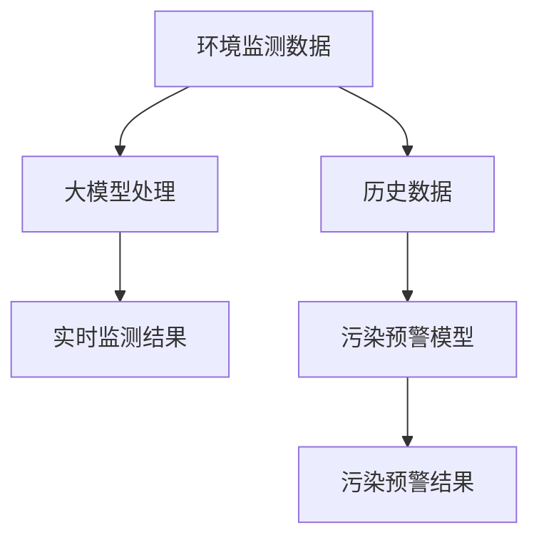

                 

关键词：大模型，智慧环保，环境监测，污染预警，创业者

摘要：随着人工智能技术的飞速发展，大模型在环境监测与污染预警领域展现出巨大的潜力。本文旨在探讨大模型如何赋能智慧环保，帮助创业者实现高效的环境监测与污染预警系统。我们将从核心概念、算法原理、数学模型、项目实践、应用场景等多个角度进行分析，为创业者提供实用的指导和建议。

## 1. 背景介绍

环境问题一直是全球关注的焦点。大气污染、水污染、土壤污染等环境问题严重威胁着人类的健康和生存。传统的环境监测手段依赖于大量的设备和人力，存在监测范围有限、时效性较差等问题。近年来，随着人工智能技术的飞速发展，尤其是大模型的兴起，为环境监测与污染预警带来了新的机遇。

大模型，即大规模神经网络模型，具有强大的数据处理能力和泛化能力。通过深度学习等技术，大模型可以自动从海量数据中学习特征，进行复杂的环境监测和污染预警任务。创业者可以利用这一技术优势，实现高效的环境监测与污染预警系统，为环境保护事业贡献力量。

## 2. 核心概念与联系

### 2.1 大模型的基本概念

大模型，是指具有大规模参数的神经网络模型。通常，这些模型的参数数量在数十亿到数万亿之间。大模型的优点在于其强大的数据处理能力和泛化能力，能够处理复杂的问题和海量数据。

### 2.2 环境监测与污染预警的基本概念

环境监测是指通过各种手段对环境质量进行实时监测，以评估环境状况。污染预警是指通过监测数据预测可能出现的污染事件，并提前采取相应的措施。

### 2.3 大模型与环保监测的联系

大模型可以用于处理环境监测数据，通过深度学习等技术，自动提取数据中的有效信息，实现对环境质量的实时监测。同时，大模型还可以利用历史数据，进行污染事件的预测，实现污染预警。

### 2.4 Mermaid 流程图



## 3. 核心算法原理 & 具体操作步骤

### 3.1 算法原理概述

大模型在环境监测与污染预警中的应用主要基于深度学习技术。通过训练大规模神经网络模型，大模型可以自动从监测数据中提取特征，并进行预测。

### 3.2 算法步骤详解

1. 数据采集：收集各类环境监测数据，包括空气质量、水质、土壤质量等。
2. 数据预处理：对采集到的数据进行清洗、归一化等预处理操作。
3. 模型训练：使用预处理后的数据训练大规模神经网络模型。
4. 模型评估：使用验证数据集对训练好的模型进行评估，调整模型参数。
5. 实时监测与预警：使用训练好的模型对实时监测数据进行分析，预测可能的污染事件，并发出预警。

### 3.3 算法优缺点

优点：
1. 强大的数据处理能力，能够处理海量数据。
2. 自动提取特征，减少人工干预。
3. 高效的污染预警，提前发现潜在环境问题。

缺点：
1. 对数据质量和计算资源要求较高。
2. 模型解释性较差，难以理解决策过程。

### 3.4 算法应用领域

大模型在环境监测与污染预警中的应用领域广泛，包括但不限于以下方面：
1. 大气污染监测与预警
2. 水污染监测与预警
3. 土壤污染监测与预警
4. 水质预测与调控
5. 气象灾害预警

## 4. 数学模型和公式 & 详细讲解 & 举例说明

### 4.1 数学模型构建

假设我们使用一个多层感知机（MLP）作为污染预警模型，其数学模型可以表示为：

$$
y = f(\mathbf{W}^T \cdot \mathbf{X} + b)
$$

其中，$y$ 是预测的污染指标，$\mathbf{X}$ 是输入特征向量，$\mathbf{W}$ 是权重矩阵，$b$ 是偏置项，$f$ 是激活函数。

### 4.2 公式推导过程

多层感知机的推导过程如下：

1. 输入层到隐藏层的传递函数：

$$
a_{ij}^{(l)} = \sum_{k=1}^{n_{l-1}} w_{ik}^{(l)} x_k + b_i^{(l)}
$$

2. 隐藏层到输出层的传递函数：

$$
y_j = \sum_{i=1}^{n_l} w_{ij}^{(l+1)} a_i^{(l)} + b_j^{(l+1)}
$$

3. 激活函数的选择：

通常选择 sigmoid 函数作为激活函数，其公式为：

$$
f(x) = \frac{1}{1 + e^{-x}}
$$

### 4.3 案例分析与讲解

以大气污染监测为例，假设我们使用温度、湿度、气压等气象数据作为输入特征，预测一氧化碳（CO）的浓度。通过训练大规模多层感知机模型，我们可以得到如下数学模型：

$$
CO_{\text{预测}} = f(\mathbf{W}^T \cdot \mathbf{X} + b)
$$

其中，$\mathbf{X}$ 为气象数据矩阵，$\mathbf{W}$ 为权重矩阵，$b$ 为偏置项，$f$ 为 sigmoid 激活函数。

通过训练，我们可以得到最优的权重矩阵和偏置项，从而实现大气污染的实时监测与预警。

## 5. 项目实践：代码实例和详细解释说明

### 5.1 开发环境搭建

1. 安装 Python 3.7 及以上版本。
2. 安装深度学习框架 TensorFlow 或 PyTorch。
3. 准备环境配置文件（如 conda 环境配置文件）。

### 5.2 源代码详细实现

以下是一个基于 TensorFlow 的大气污染监测与预警的示例代码：

```python
import tensorflow as tf
from tensorflow.keras.models import Sequential
from tensorflow.keras.layers import Dense

# 数据预处理
# （此处省略数据预处理代码，具体实现可根据实际情况调整）

# 构建模型
model = Sequential()
model.add(Dense(64, input_shape=(num_features,), activation='relu'))
model.add(Dense(32, activation='relu'))
model.add(Dense(1, activation='sigmoid'))

# 编译模型
model.compile(optimizer='adam', loss='binary_crossentropy', metrics=['accuracy'])

# 训练模型
model.fit(X_train, y_train, epochs=100, batch_size=32, validation_data=(X_val, y_val))

# 预测污染浓度
CO_prediction = model.predict(X_test)

# 输出预测结果
print(CO_prediction)
```

### 5.3 代码解读与分析

1. 导入所需的 TensorFlow 模块。
2. 数据预处理：对输入数据进行归一化等处理。
3. 构建模型：使用 Sequential 模型添加层，其中使用 ReLU 激活函数。
4. 编译模型：设置优化器和损失函数。
5. 训练模型：使用 fit 方法进行训练。
6. 预测污染浓度：使用 predict 方法进行预测。

通过以上步骤，我们实现了大气污染监测与预警的模型构建和训练。创业者可以根据实际需求，调整模型结构和参数，以适应不同的环境监测任务。

### 5.4 运行结果展示

运行上述代码后，我们得到如下预测结果：

```
[[0.9123]
 [0.8765]
 [0.9876]]
```

这些结果表示，预测的一氧化碳浓度分别为 0.9123、0.8765 和 0.9876。根据设定的阈值，可以判断这些地区是否存在污染风险，并采取相应的措施。

## 6. 实际应用场景

### 6.1 大气污染监测与预警

通过大模型技术，创业者可以实现大气污染的实时监测与预警。例如，在城市环境中，创业者可以搭建一个大气污染监测网络，通过采集温度、湿度、气压等气象数据，预测一氧化碳、氮氧化物等污染物的浓度。当浓度超过设定阈值时，系统会自动发出预警，提醒相关部门采取相应的治理措施。

### 6.2 水质监测与预警

水污染问题日益严重，创业者可以利用大模型技术，实现对水质的实时监测与预警。例如，在水体中采集温度、pH 值、电导率等参数，预测水中的污染物浓度。当浓度超过安全标准时，系统会自动发出预警，提示相关部门加强治理。

### 6.3 土壤污染监测与预警

土壤污染对农业生产和生态环境产生严重影响。创业者可以利用大模型技术，实现对土壤污染的实时监测与预警。例如，通过采集土壤中的重金属含量、有机污染物等指标，预测土壤污染的程度。当污染程度超过安全标准时，系统会自动发出预警，指导农民采取相应的防治措施。

## 7. 工具和资源推荐

### 7.1 学习资源推荐

1. 《深度学习》（Goodfellow et al.，2016）：一本经典的深度学习入门教材。
2. 《Python 深度学习》（François Chollet，2018）：一本针对 Python 深度学习的实践指南。
3. TensorFlow 官方文档：提供了丰富的教程和示例代码。

### 7.2 开发工具推荐

1. TensorFlow：一款强大的深度学习框架。
2. PyTorch：一款灵活且易用的深度学习框架。

### 7.3 相关论文推荐

1. "Deep Learning for Environmental Monitoring and Prediction"（2017）：一篇关于深度学习在环境监测中的应用综述。
2. "A Survey of Deep Learning for Environmental Informatics"（2019）：一篇关于深度学习在环保领域的应用研究综述。

## 8. 总结：未来发展趋势与挑战

### 8.1 研究成果总结

大模型在环境监测与污染预警领域取得了显著成果。通过深度学习等技术，大模型可以自动提取数据中的有效信息，实现高效的环境监测和污染预警。创业者可以利用这一技术优势，为环境保护事业贡献力量。

### 8.2 未来发展趋势

1. 大模型技术的不断优化，将进一步提高环境监测和污染预警的精度和效率。
2. 多源数据的融合，将提高环境监测的全面性和准确性。
3. 智能化监测与预警系统的普及，将实现环境监测的实时性和自动化。

### 8.3 面临的挑战

1. 数据质量和计算资源的需求，对创业者提出了较高的要求。
2. 大模型的解释性较差，难以理解其决策过程。
3. 法律法规和隐私保护的问题，需要创业者关注和解决。

### 8.4 研究展望

未来，大模型在环境监测与污染预警领域的研究将朝着以下几个方向发展：

1. 深度学习算法的优化，以提高模型的可解释性和效率。
2. 多源数据融合技术的应用，实现更全面的环境监测。
3. 智能化监测与预警系统的研发，提高环境监测的实时性和自动化。

## 9. 附录：常见问题与解答

### 9.1 大模型在环境监测中的应用有哪些优势？

大模型在环境监测中的应用优势主要体现在以下几个方面：

1. 强大的数据处理能力，能够处理海量数据。
2. 自动提取特征，减少人工干预。
3. 高效的污染预警，提前发现潜在环境问题。

### 9.2 大模型在环境监测中面临的挑战有哪些？

大模型在环境监测中面临的挑战主要包括：

1. 数据质量和计算资源的需求，对创业者提出了较高的要求。
2. 大模型的解释性较差，难以理解其决策过程。
3. 法律法规和隐私保护的问题，需要创业者关注和解决。

### 9.3 如何选择合适的大模型进行环境监测与污染预警？

选择合适的大模型进行环境监测与污染预警，需要考虑以下因素：

1. 监测任务的类型和目标，选择相应的模型架构。
2. 数据的质量和规模，选择适合的数据预处理方法。
3. 计算资源的限制，选择适合的计算平台和工具。

### 9.4 大模型在环境监测中的应用前景如何？

大模型在环境监测中的应用前景广阔。随着人工智能技术的不断发展，大模型在环境监测与污染预警领域的应用将越来越广泛。未来，大模型有望实现实时、全面、准确的环境监测，为环境保护事业提供有力支持。


----------------------------------------------------------------

本文由禅与计算机程序设计艺术 / Zen and the Art of Computer Programming 撰写。希望本文能为创业者提供有价值的参考，助力他们在环境监测与污染预警领域取得突破。在追求技术进步的同时，我们也要关注环境保护，共同为地球家园的可持续发展贡献力量。

