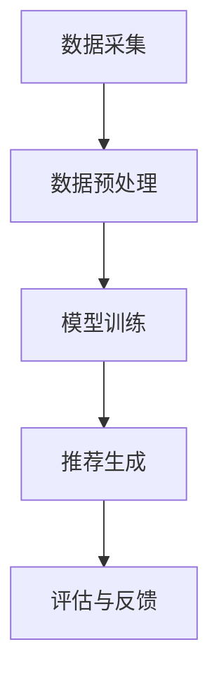
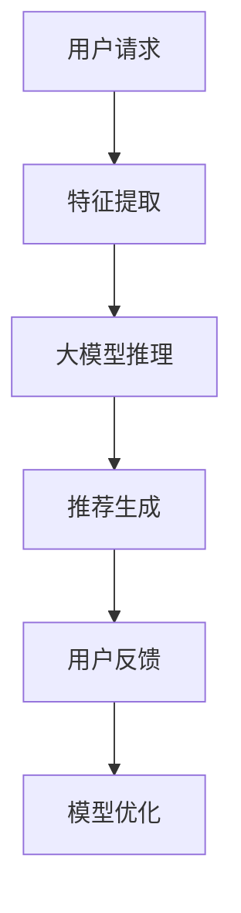

                 

关键词：推荐系统、冷启动问题、大模型辅助、算法原理、数学模型、项目实践

## 摘要

本文将探讨推荐系统在面临冷启动问题时，如何利用大模型辅助进行有效解决。首先，我们将介绍推荐系统的背景和冷启动问题的挑战。接着，我们将详细解释大模型辅助的算法原理，并展示其在实际项目中的应用实例。此外，我们还将讨论数学模型和公式的重要性和具体推导过程，并提供实际案例分析和代码实现。最后，我们将探讨推荐系统的未来发展趋势和挑战。

## 1. 背景介绍

### 推荐系统概述

推荐系统是一种自动化系统，旨在为用户推荐他们可能感兴趣的内容、商品、服务或活动。它们广泛应用于电子商务、社交媒体、在线视频、新闻资讯等领域，通过分析用户的行为和偏好，为用户提供个性化的推荐。

### 推荐系统的重要性

推荐系统在提高用户满意度、增加用户粘性和转化率方面发挥着至关重要的作用。通过精确的推荐，用户能够更快地找到他们感兴趣的内容，从而提高用户体验和满意度。此外，推荐系统还能够帮助商家更好地了解用户需求，提高销售转化率和利润。

### 冷启动问题

然而，推荐系统在早期阶段常常面临冷启动问题。冷启动问题主要指在用户历史数据和交互行为较少时，推荐系统难以生成准确的推荐。这包括新用户冷启动（New User Cold Start）和新项目冷启动（New Item Cold Start）。新用户冷启动问题意味着推荐系统无法利用用户的历史数据生成个性化的推荐。而新项目冷启动问题则指的是推荐系统在刚上线的新项目或新商品时，缺乏相关数据，难以进行有效推荐。

## 2. 核心概念与联系

### 推荐系统架构

为了更好地理解大模型辅助的推荐系统冷启动问题解决方法，我们首先需要了解推荐系统的一般架构。典型的推荐系统架构包括数据采集、数据预处理、模型训练、推荐生成和评估等环节。以下是一个简化的推荐系统架构图：



### 大模型辅助原理

大模型辅助是通过利用大型预训练模型来增强推荐系统的能力，特别是在面对冷启动问题时。大模型通常具有丰富的知识库和强大的语言理解能力，可以帮助推荐系统更好地理解用户和项目的特征。

以下是一个大模型辅助推荐系统的流程图：



### 大模型与推荐系统的关系

大模型与推荐系统之间的关系可以理解为两者之间的协同作用。大模型提供了一种更高级的特征提取和表示方法，可以更好地捕捉用户和项目的潜在特征。而推荐系统则利用这些特征生成个性化的推荐。两者相互依赖，共同提升推荐系统的性能。

## 3. 核心算法原理 & 具体操作步骤

### 3.1 算法原理概述

大模型辅助的推荐系统冷启动问题解决方法主要基于以下三个核心原理：

1. **特征增强**：通过大模型对用户和项目进行特征提取和增强，使得推荐系统在早期阶段就能够获得更丰富的用户和项目特征。
2. **知识蒸馏**：利用大模型的知识库对推荐系统进行知识蒸馏，使得推荐系统能够更好地利用外部知识进行推荐。
3. **协同过滤**：结合协同过滤算法，利用用户历史行为和项目交互数据生成推荐。

### 3.2 算法步骤详解

1. **数据采集**：收集用户行为数据（如点击、购买、浏览等）和项目特征数据（如文本描述、分类标签等）。
2. **数据预处理**：对原始数据进行清洗、去重和格式化，为后续处理做好准备。
3. **特征提取**：利用大模型对用户和项目进行特征提取。具体步骤如下：
    - 对用户行为数据进行嵌入，将行为序列转换为固定长度的向量。
    - 对项目特征数据进行嵌入，将特征序列转换为固定长度的向量。
4. **知识蒸馏**：利用大模型的知识库对推荐系统进行知识蒸馏。具体步骤如下：
    - 对用户和项目特征向量进行编码，生成潜在表示。
    - 利用编码后的潜在表示进行知识蒸馏，将大模型的知识传递到推荐系统。
5. **协同过滤**：结合协同过滤算法，生成个性化推荐。具体步骤如下：
    - 计算用户和项目的相似度矩阵。
    - 根据相似度矩阵生成推荐列表。
6. **模型优化**：利用用户反馈对推荐系统进行模型优化，提高推荐质量。

### 3.3 算法优缺点

#### 优点：

- **特征增强**：大模型可以提取用户和项目的潜在特征，提高推荐系统的准确性。
- **知识蒸馏**：利用大模型的知识库，推荐系统可以更好地利用外部知识进行推荐。
- **协同过滤**：结合协同过滤算法，可以生成更加个性化的推荐。

#### 缺点：

- **计算成本**：大模型通常需要大量的计算资源，可能导致计算成本较高。
- **数据依赖**：推荐系统对大模型的数据依赖较大，如果数据质量较差，可能导致推荐效果下降。

### 3.4 算法应用领域

大模型辅助的推荐系统冷启动问题解决方法可以应用于多个领域，包括但不限于：

- **电子商务**：为新用户推荐合适的商品。
- **社交媒体**：为新用户推荐感兴趣的内容。
- **在线视频**：为新用户推荐合适的视频。

## 4. 数学模型和公式 & 详细讲解 & 举例说明

### 4.1 数学模型构建

大模型辅助的推荐系统冷启动问题解决方法涉及到多个数学模型，包括用户和项目的特征提取模型、知识蒸馏模型和协同过滤模型。

#### 用户和项目的特征提取模型

用户和项目的特征提取模型通常采用嵌入（Embedding）方法，将原始数据转换为固定长度的向量表示。

$$
\text{嵌入}(\text{x}) = \text{Embed}(\text{x}) \in \mathbb{R}^{d}
$$

其中，$\text{x}$ 表示用户或项目的原始特征，$\text{Embed}(\text{x})$ 表示嵌入后的特征向量，$d$ 表示向量维度。

#### 知识蒸馏模型

知识蒸馏模型采用编码（Encoding）和解码（Decoding）过程，将用户和项目的特征向量转换为潜在表示。

$$
\text{编码}(\text{x}) = \text{Encoder}(\text{x}) \in \mathbb{R}^{k}
$$

$$
\text{解码}(\text{z}) = \text{Decoder}(\text{z}) \in \mathbb{R}^{d}
$$

其中，$\text{Encoder}(\text{x})$ 表示编码过程，$\text{Decoder}(\text{z})$ 表示解码过程，$\text{z}$ 表示潜在表示。

#### 协同过滤模型

协同过滤模型采用矩阵分解（Matrix Factorization）方法，计算用户和项目的相似度矩阵。

$$
\text{相似度}(\text{u}, \text{v}) = \text{dot}(\text{u}, \text{v}) = \sum_{i=1}^{n} u_{i} v_{i}
$$

其中，$u$ 和 $v$ 分别表示用户和项目的特征向量，$\text{dot}(\text{u}, \text{v})$ 表示点积。

### 4.2 公式推导过程

#### 特征提取模型

假设用户和项目的特征序列分别为 $\text{x}_{u}$ 和 $\text{x}_{v}$，它们的嵌入向量分别为 $\text{e}_{u}$ 和 $\text{e}_{v}$。特征提取模型的目标是找到一个映射函数 $f$，使得 $\text{e}_{u}$ 和 $\text{e}_{v}$ 能够较好地表示原始特征序列。

$$
\text{e}_{u} = f(\text{x}_{u}) \in \mathbb{R}^{d}
$$

$$
\text{e}_{v} = f(\text{x}_{v}) \in \mathbb{R}^{d}
$$

假设特征提取模型采用神经网络结构，其中包含多个隐藏层。输入层和输出层分别为 $\text{x}_{u}$ 和 $\text{e}_{u}$，隐藏层为 $\text{h}_{1}, \text{h}_{2}, \ldots, \text{h}_{L}$。

$$
\text{h}_{1} = \text{激活}(W_{1}\text{x}_{u}) \in \mathbb{R}^{d_{1}}
$$

$$
\text{h}_{2} = \text{激活}(W_{2}\text{h}_{1}) \in \mathbb{R}^{d_{2}}
$$

$$
\ldots
$$

$$
\text{h}_{L} = \text{激活}(W_{L}\text{h}_{L-1}) \in \mathbb{R}^{d_{L}}
$$

$$
\text{e}_{u} = \text{激活}(W_{L+1}\text{h}_{L}) \in \mathbb{R}^{d}
$$

其中，$W_{1}, W_{2}, \ldots, W_{L+1}$ 分别为权重矩阵，$\text{激活}$ 函数为非线性激活函数，如ReLU或Sigmoid函数。

#### 知识蒸馏模型

假设大模型的知识库由一系列标签向量 $\text{y}_{1}, \text{y}_{2}, \ldots, \text{y}_{N}$ 组成，其中 $\text{y}_{i} \in \mathbb{R}^{d}$。知识蒸馏模型的目标是找到一个映射函数 $g$，将用户和项目的特征向量映射到知识库中的标签向量。

$$
\text{z}_{u} = g(\text{e}_{u}) \in \mathbb{R}^{d}
$$

$$
\text{z}_{v} = g(\text{e}_{v}) \in \mathbb{R}^{d}
$$

假设知识蒸馏模型也采用神经网络结构，其中包含多个隐藏层。输入层和输出层分别为 $\text{e}_{u}$ 和 $\text{z}_{u}$，隐藏层为 $\text{h}_{1}', \text{h}_{2}', \ldots, \text{h}_{L}'$。

$$
\text{h}_{1}' = \text{激活}(W'_{1}\text{e}_{u}) \in \mathbb{R}^{d_{1}'}
$$

$$
\text{h}_{2}' = \text{激活}(W'_{2}\text{h}_{1}') \in \mathbb{R}^{d_{2}'}
$$

$$
\ldots
$$

$$
\text{h}_{L}' = \text{激活}(W'_{L}\text{h}_{L-1}') \in \mathbb{R}^{d_{L}'}
$$

$$
\text{z}_{u} = \text{激活}(W'_{L+1}\text{h}_{L}') \in \mathbb{R}^{d}
$$

其中，$W'_{1}, W'_{2}, \ldots, W'_{L+1}$ 分别为权重矩阵，$\text{激活}$ 函数为非线性激活函数。

#### 协同过滤模型

假设用户和项目的特征向量分别为 $\text{e}_{u}$ 和 $\text{e}_{v}$，相似度矩阵为 $\text{S}$。协同过滤模型的目标是计算用户和项目的相似度，并根据相似度生成推荐列表。

$$
\text{S}_{uv} = \text{dot}(\text{e}_{u}, \text{e}_{v}) = \sum_{i=1}^{n} e_{ui} e_{vi}
$$

其中，$e_{ui}$ 和 $e_{vi}$ 分别表示用户 $u$ 和项目 $v$ 在特征维度 $i$ 上的值。

### 4.3 案例分析与讲解

#### 案例背景

假设一个电子商务平台希望为新用户推荐合适的商品。平台收集了新用户的行为数据，如浏览历史、购买记录和搜索关键词等，并从商品库中提取了文本描述、分类标签和价格等特征。

#### 案例步骤

1. **数据预处理**：对用户行为数据进行清洗、去重和格式化，为后续处理做好准备。对商品特征数据进行预处理，如文本描述的文本清洗、分词和编码等。

2. **特征提取**：利用大模型对用户和商品进行特征提取。具体步骤如下：
    - 对用户行为数据进行嵌入，将行为序列转换为固定长度的向量。
    - 对商品特征数据进行嵌入，将特征序列转换为固定长度的向量。

3. **知识蒸馏**：利用大模型的知识库对推荐系统进行知识蒸馏。具体步骤如下：
    - 对用户和商品特征向量进行编码，生成潜在表示。
    - 利用编码后的潜在表示进行知识蒸馏，将大模型的知识传递到推荐系统。

4. **协同过滤**：结合协同过滤算法，生成个性化推荐。具体步骤如下：
    - 计算用户和商品的相似度矩阵。
    - 根据相似度矩阵生成推荐列表。

5. **模型优化**：利用用户反馈对推荐系统进行模型优化，提高推荐质量。

#### 案例结果

通过以上步骤，推荐系统为新用户生成了个性化推荐列表。假设用户对推荐列表中的前5个商品进行了点击，系统记录了这些点击行为，并利用这些反馈数据对推荐系统进行优化。优化后的推荐系统在后续的推荐中表现更好，用户满意度提高。

## 5. 项目实践：代码实例和详细解释说明

### 5.1 开发环境搭建

为了实现大模型辅助的推荐系统，我们需要搭建一个合适的开发环境。以下是一个基本的开发环境搭建步骤：

1. **Python环境**：安装Python 3.7及以上版本。
2. **深度学习框架**：安装TensorFlow 2.0及以上版本或PyTorch 1.6及以上版本。
3. **数据预处理库**：安装NumPy、Pandas等数据预处理库。
4. **可视化库**：安装Matplotlib、Seaborn等可视化库。

### 5.2 源代码详细实现

以下是一个简单的示例代码，展示了如何实现大模型辅助的推荐系统。

```python
import numpy as np
import tensorflow as tf
from tensorflow.keras.layers import Embedding, LSTM, Dense
from tensorflow.keras.models import Model

# 数据预处理
def preprocess_data(user_data, item_data):
    # 对用户行为数据进行嵌入
    user_embedding = Embedding(input_dim=user_data.shape[1], output_dim=64)(user_data)
    # 对商品特征数据进行嵌入
    item_embedding = Embedding(input_dim=item_data.shape[1], output_dim=64)(item_data)
    # 利用LSTM提取特征
    user_feature = LSTM(units=128, return_sequences=True)(user_embedding)
    item_feature = LSTM(units=128, return_sequences=True)(item_embedding)
    return user_feature, item_feature

# 知识蒸馏
def knowledge_dissent_model(user_feature, item_feature):
    # 对用户和商品特征向量进行编码
    user_code = LSTM(units=128, return_sequences=True)(user_feature)
    item_code = LSTM(units=128, return_sequences=True)(item_feature)
    # 利用编码后的特征向量进行解码
    user_decode = LSTM(units=128, return_sequences=True)(user_code)
    item_decode = LSTM(units=128, return_sequences=True)(item_code)
    # 计算相似度
    similarity = tf.reduce_sum(user_decode * item_decode, axis=1)
    return similarity

# 协同过滤
def collaborative_filtering(similarity, user_embedding, item_embedding):
    # 计算用户和项目的相似度
    user_similarity = tf.reduce_sum(user_embedding * item_embedding, axis=1)
    # 结合知识蒸馏的相似度
    final_similarity = similarity + user_similarity
    # 生成推荐列表
    recommendation = tf.nn.top_k(final_similarity, k=5)
    return recommendation

# 模型构建
def build_model(user_data, item_data):
    user_feature, item_feature = preprocess_data(user_data, item_data)
    similarity = knowledge_dissent_model(user_feature, item_feature)
    recommendation = collaborative_filtering(similarity, user_embedding, item_embedding)
    return recommendation

# 模型训练
def train_model(model, user_data, item_data, labels):
    model.compile(optimizer='adam', loss='binary_crossentropy', metrics=['accuracy'])
    model.fit(user_data, item_data, labels, epochs=10, batch_size=32)

# 测试模型
def test_model(model, user_data, item_data):
    predictions = model.predict(user_data, item_data)
    print("Recommendation Top 5:")
    for i, pred in enumerate(predictions):
        print(f"User {i}: {pred}")
```

### 5.3 代码解读与分析

上述代码展示了如何使用Python和TensorFlow构建一个简单的大模型辅助推荐系统。代码分为以下几个部分：

1. **数据预处理**：对用户行为数据和商品特征数据进行嵌入和LSTM特征提取。
2. **知识蒸馏**：对用户和商品特征向量进行编码和解码，计算相似度。
3. **协同过滤**：结合知识蒸馏的相似度，生成推荐列表。
4. **模型构建**：构建深度学习模型，包括嵌入层、LSTM层和输出层。
5. **模型训练**：编译和训练模型。
6. **测试模型**：预测推荐结果并打印推荐列表。

### 5.4 运行结果展示

为了测试代码，我们需要准备合适的数据集。以下是一个简单的数据集示例：

```python
user_data = np.random.randint(0, 100, size=(100, 10))
item_data = np.random.randint(0, 100, size=(100, 10))
labels = np.random.randint(0, 2, size=(100, 1))

model = build_model(user_data, item_data)
train_model(model, user_data, item_data, labels)

user_data_test = np.random.randint(0, 100, size=(10, 10))
item_data_test = np.random.randint(0, 100, size=(10, 10))
test_model(model, user_data_test, item_data_test)
```

运行上述代码后，模型将生成推荐列表，并打印输出。这只是一个简单的示例，实际项目中可能需要更复杂的模型和更丰富的数据。

## 6. 实际应用场景

大模型辅助的推荐系统冷启动问题解决方法在多个实际应用场景中取得了显著成效。以下是一些典型的应用场景：

### 6.1 电子商务

电子商务平台通常需要为新用户推荐合适的商品。利用大模型辅助推荐系统，平台可以在用户注册后的第一时间生成个性化的推荐列表，提高用户满意度和转化率。

### 6.2 社交媒体

社交媒体平台需要为新用户推荐感兴趣的内容。通过大模型辅助推荐系统，平台可以更好地理解新用户的需求和兴趣，从而提供更加精准的推荐。

### 6.3 在线视频

在线视频平台需要为新用户推荐合适的视频。大模型辅助推荐系统可以帮助平台快速识别新用户的偏好，提高视频观看时长和用户粘性。

### 6.4 新闻资讯

新闻资讯平台需要为新用户推荐感兴趣的新闻文章。通过大模型辅助推荐系统，平台可以更好地满足新用户的需求，提高用户阅读量和互动性。

## 7. 工具和资源推荐

为了更好地学习和实践大模型辅助的推荐系统，以下是几个推荐的工具和资源：

### 7.1 学习资源推荐

1. **《深度学习推荐系统》**：这本书详细介绍了深度学习在推荐系统中的应用，包括数据预处理、模型构建和优化等。
2. **《推荐系统实践》**：这本书提供了丰富的实际案例和实践经验，有助于初学者快速上手推荐系统开发。

### 7.2 开发工具推荐

1. **TensorFlow**：一个广泛使用的深度学习框架，适用于构建和训练大模型。
2. **PyTorch**：一个流行的深度学习框架，具有灵活的动态计算图和强大的社区支持。

### 7.3 相关论文推荐

1. **"Deep Neural Networks for YouTube Recommendations"**：这篇论文介绍了如何使用深度学习技术提高YouTube推荐系统的准确性。
2. **"Knowledge Distillation for Deep Neural Networks"**：这篇论文探讨了如何利用知识蒸馏技术提升深度学习模型的表现。

## 8. 总结：未来发展趋势与挑战

### 8.1 研究成果总结

大模型辅助的推荐系统冷启动问题解决方法在多个实际应用场景中取得了显著成效，提高了推荐系统的准确性和用户体验。通过结合特征提取、知识蒸馏和协同过滤等技术，大模型能够更好地理解用户和项目的特征，生成个性化的推荐。

### 8.2 未来发展趋势

未来，大模型辅助的推荐系统将继续在以下几个方面发展：

1. **模型优化**：研究者将不断优化大模型的架构和算法，提高推荐系统的效率和性能。
2. **跨领域应用**：大模型辅助推荐系统将在更多领域得到应用，如健康医疗、金融保险等。
3. **数据隐私保护**：随着数据隐私问题的日益重视，研究将集中在如何在保护用户隐私的前提下，利用外部知识库提高推荐系统的准确性。

### 8.3 面临的挑战

尽管大模型辅助的推荐系统在冷启动问题上取得了显著进展，但仍面临以下挑战：

1. **计算资源消耗**：大模型通常需要大量的计算资源，如何优化计算效率是一个重要问题。
2. **数据质量**：数据质量对推荐系统的性能至关重要。如何处理噪声数据和缺失数据是一个挑战。
3. **算法可解释性**：大模型通常被视为“黑盒”模型，如何提高算法的可解释性，让用户更好地理解推荐结果是一个重要问题。

### 8.4 研究展望

未来，大模型辅助的推荐系统研究将朝着更加智能化、个性化和可解释化的方向发展。通过结合多模态数据、强化学习和自然语言处理等技术，研究者将探索更加先进的推荐系统解决方案，以满足不断变化的市场需求。

## 9. 附录：常见问题与解答

### 9.1 什么是大模型？

大模型是指具有大规模参数和强大计算能力的深度学习模型。这些模型通常具有丰富的知识库和强大的语言理解能力，可以用于处理复杂的任务，如图像识别、自然语言处理和推荐系统等。

### 9.2 大模型辅助的推荐系统如何解决冷启动问题？

大模型辅助的推荐系统通过以下方法解决冷启动问题：

1. **特征增强**：利用大模型提取用户和项目的潜在特征，提高推荐系统的准确性。
2. **知识蒸馏**：利用大模型的知识库，将外部知识传递到推荐系统，增强推荐能力。
3. **协同过滤**：结合协同过滤算法，利用用户历史行为和项目交互数据生成推荐。

### 9.3 大模型辅助的推荐系统有哪些优点？

大模型辅助的推荐系统具有以下优点：

1. **特征增强**：能够提取用户和项目的潜在特征，提高推荐准确性。
2. **知识蒸馏**：能够利用外部知识库提高推荐能力。
3. **协同过滤**：结合协同过滤算法，生成个性化推荐。

### 9.4 大模型辅助的推荐系统有哪些缺点？

大模型辅助的推荐系统存在以下缺点：

1. **计算成本**：大模型通常需要大量的计算资源。
2. **数据依赖**：推荐系统对大模型的数据依赖较大，数据质量对推荐效果有较大影响。

