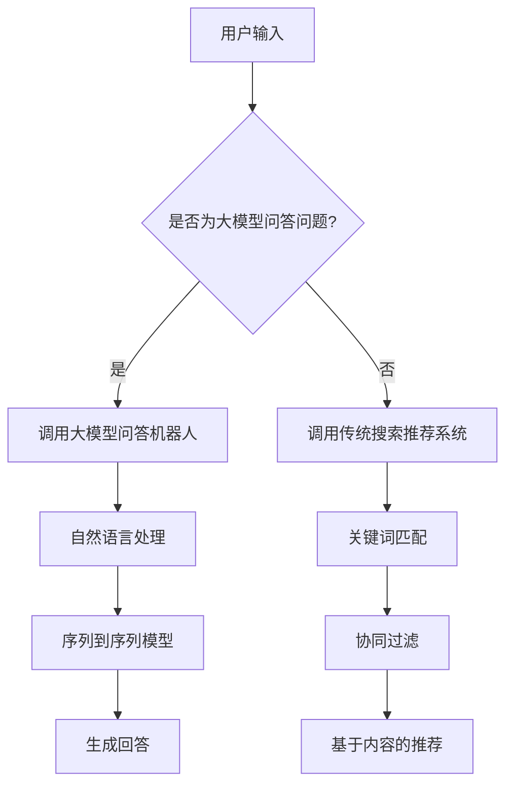

                 

关键词：大模型问答机器人、传统搜索推荐、处理方式、算法原理、数学模型、项目实践、应用场景、未来展望

> 摘要：本文深入探讨了大模型问答机器人和传统搜索推荐的处理方式，从核心算法原理、数学模型构建、项目实践等多个角度分析了两种技术的特点和优缺点。通过对实际应用场景的剖析，本文提出了未来发展的趋势和挑战，为读者提供了全面的技术视角。

## 1. 背景介绍

随着互联网的迅速发展，信息量的爆炸式增长给用户带来了前所未有的挑战。如何在海量信息中快速、准确地找到用户需要的信息，成为了一个亟待解决的问题。传统搜索推荐系统应运而生，通过关键词匹配、机器学习等技术，为用户提供个性化的信息推荐服务。然而，传统搜索推荐系统在面对复杂的语义理解和多模态数据时，存在一定的局限性。

近年来，大模型问答机器人逐渐成为研究的热点。大模型问答机器人基于深度学习技术，通过对海量数据进行训练，能够理解和回答用户的自然语言问题。相比于传统搜索推荐系统，大模型问答机器人具有更强的语义理解和多模态数据处理能力，能够为用户提供更准确、更丰富的信息检索服务。

本文旨在对比大模型问答机器人和传统搜索推荐系统的处理方式，分析两种技术的核心算法原理、数学模型、项目实践等，为读者提供全面的技术视角。

## 2. 核心概念与联系

### 2.1 大模型问答机器人

大模型问答机器人是基于深度学习技术构建的，通过大规模数据训练得到的模型，能够理解和回答用户的自然语言问题。其核心概念包括：

- 自然语言处理（NLP）：对自然语言文本进行处理和分析，包括分词、词性标注、句法分析等。
- 序列到序列（Seq2Seq）模型：将输入序列映射到输出序列的模型，常用于机器翻译、对话系统等。
- 注意力机制（Attention）：在处理长序列数据时，能够关注到序列中重要的部分，提高模型的处理效率。

### 2.2 传统搜索推荐系统

传统搜索推荐系统基于关键词匹配、协同过滤、基于内容的推荐等技术，为用户提供个性化的信息推荐服务。其核心概念包括：

- 关键词匹配：通过分析用户输入的关键词，与数据库中的关键词进行匹配，提供相关的信息。
- 协同过滤：通过分析用户的历史行为和偏好，为用户推荐相似用户喜欢的商品或信息。
- 基于内容的推荐：根据用户的历史行为和偏好，为用户推荐与已有内容相似的新内容。

### 2.3 Mermaid 流程图

为了更清晰地展示大模型问答机器人和传统搜索推荐系统的处理流程，我们使用 Mermaid 流程图进行描述。以下是两种系统的 Mermaid 流程图：



## 3. 核心算法原理 & 具体操作步骤

### 3.1 算法原理概述

#### 大模型问答机器人

大模型问答机器人主要基于深度学习技术，通过大规模数据训练得到模型，能够理解和回答用户的自然语言问题。其核心算法包括：

- 自然语言处理：通过分词、词性标注、句法分析等技术，将自然语言文本转换为计算机可处理的格式。
- 序列到序列模型：将输入序列映射到输出序列，实现自然语言生成。
- 注意力机制：在处理长序列数据时，关注到序列中重要的部分，提高模型的处理效率。

#### 传统搜索推荐系统

传统搜索推荐系统主要基于关键词匹配、协同过滤、基于内容的推荐等技术，为用户提供个性化的信息推荐服务。其核心算法包括：

- 关键词匹配：通过分析用户输入的关键词，与数据库中的关键词进行匹配，提供相关的信息。
- 协同过滤：通过分析用户的历史行为和偏好，为用户推荐相似用户喜欢的商品或信息。
- 基于内容的推荐：根据用户的历史行为和偏好，为用户推荐与已有内容相似的新内容。

### 3.2 算法步骤详解

#### 大模型问答机器人

1. 自然语言处理：对输入的文本进行分词、词性标注、句法分析等操作，将文本转换为计算机可处理的格式。
2. 序列到序列模型：将输入序列映射到输出序列，实现自然语言生成。
3. 注意力机制：在处理长序列数据时，关注到序列中重要的部分，提高模型的处理效率。
4. 生成回答：根据输入问题，生成相应的回答。

#### 传统搜索推荐系统

1. 关键词匹配：分析用户输入的关键词，与数据库中的关键词进行匹配，提供相关的信息。
2. 协同过滤：分析用户的历史行为和偏好，为用户推荐相似用户喜欢的商品或信息。
3. 基于内容的推荐：根据用户的历史行为和偏好，为用户推荐与已有内容相似的新内容。

### 3.3 算法优缺点

#### 大模型问答机器人

优点：

- 强大的语义理解能力：能够理解和回答用户的自然语言问题。
- 多模态数据处理：能够处理文本、图像、语音等多模态数据。

缺点：

- 训练成本高：需要大量数据和计算资源进行训练。
- 实时性较差：处理速度较慢。

#### 传统搜索推荐系统

优点：

- 实时性较好：能够快速响应用户的查询。
- 易于实现：基于现有的技术，易于实现和部署。

缺点：

- 语义理解能力有限：难以理解和回答复杂的自然语言问题。
- 多模态数据处理困难：难以同时处理多种模态的数据。

### 3.4 算法应用领域

#### 大模型问答机器人

- 实时问答系统：如智能客服、智能助手等。
- 多模态信息检索：如图片识别、语音搜索等。

#### 传统搜索推荐系统

- 网络搜索引擎：如百度、谷歌等。
- 电子商务推荐：如淘宝、京东等。

## 4. 数学模型和公式 & 详细讲解 & 举例说明

### 4.1 数学模型构建

#### 大模型问答机器人

1. 自然语言处理：

   - 分词：使用分词算法将文本拆分为单词或短语。
   - 词性标注：使用词性标注算法为每个单词或短语标注词性。
   - 句法分析：使用句法分析算法分析文本的句法结构。

2. 序列到序列模型：

   - 编码器（Encoder）：将输入序列编码为固定长度的向量。
   - 解码器（Decoder）：将编码后的向量解码为输出序列。

3. 注意力机制：

   - 注意力权重：计算输入序列中每个元素的注意力权重。
   - 注意力得分：将输入序列与注意力权重相乘，得到注意力得分。
   - 输出序列：根据注意力得分生成输出序列。

#### 传统搜索推荐系统

1. 关键词匹配：

   - 计算相似度：计算输入关键词与数据库中关键词的相似度。
   - 匹配结果：选择相似度最高的关键词作为匹配结果。

2. 协同过滤：

   - 用户相似度：计算用户之间的相似度。
   - 商品相似度：计算商品之间的相似度。
   - 推荐结果：根据用户相似度和商品相似度推荐商品。

3. 基于内容的推荐：

   - 内容特征提取：提取用户历史行为和偏好的内容特征。
   - 计算相似度：计算用户历史行为和偏好与候选内容的相似度。
   - 推荐结果：根据相似度推荐内容。

### 4.2 公式推导过程

#### 大模型问答机器人

1. 自然语言处理：

   - 分词：使用最大匹配算法进行分词，公式如下：

     $$s_i = \max\{s_{ij} : w_{ij} \in V\}$$

     其中，$s_i$ 表示第 $i$ 个单词的分词结果，$w_{ij}$ 表示第 $i$ 个单词与第 $j$ 个分词结果的匹配程度，$V$ 表示所有可能的分词结果。

   - 词性标注：使用条件随机场（CRF）模型进行词性标注，公式如下：

     $$P(y|x) = \frac{e^{Z(x)}}{\sum_{y'} e^{Z(x, y')}}$$

     其中，$y$ 表示第 $i$ 个单词的词性标注结果，$x$ 表示输入文本，$Z(x)$ 表示给定输入文本的分数，$y'$ 表示所有可能的词性标注结果。

   - 句法分析：使用依赖树（Dependency Tree）模型进行句法分析，公式如下：

     $$p(d|g) = \frac{e^{E(d,g)}}{\sum_{d'} e^{E(d',g)}}$$

     其中，$d$ 表示句法关系，$g$ 表示输入文本的词性标注结果，$E(d,g)$ 表示句法关系的得分。

2. 序列到序列模型：

   - 编码器：

     $$h_t = \text{tanh}(W_e \cdot [s_t; h_{t-1}])$$

     其中，$h_t$ 表示第 $t$ 个时间步的编码结果，$s_t$ 表示第 $t$ 个单词的嵌入向量，$W_e$ 表示编码器的权重。

   - 解码器：

     $$p(y_t|y_{<t}, x) = \text{softmax}(V \cdot h_t)$$

     其中，$y_t$ 表示第 $t$ 个时间步的解码结果，$V$ 表示解码器的权重。

3. 注意力机制：

   - 注意力权重：

     $$a_t = \text{softmax}\left(\frac{W_a h_{t-1}^T}{\sqrt{d_k}}\right)$$

     其中，$a_t$ 表示第 $t$ 个时间步的注意力权重，$W_a$ 表示注意力机制的权重，$d_k$ 表示编码器输出的维度。

   - 注意力得分：

     $$s_t = \sum_{j=1}^{J} a_{t,j} c_{j}$$

     其中，$s_t$ 表示第 $t$ 个时间步的注意力得分，$c_{j}$ 表示第 $j$ 个时间步的编码结果。

#### 传统搜索推荐系统

1. 关键词匹配：

   - 计算相似度：

     $$\text{similarity}(w_1, w_2) = \frac{w_1 \cdot w_2}{\|w_1\| \|w_2\|}$$

     其中，$\text{similarity}(w_1, w_2)$ 表示两个关键词的相似度，$w_1$ 和 $w_2$ 分别表示两个关键词的向量表示。

2. 协同过滤：

   - 用户相似度：

     $$\text{similarity}(u_i, u_j) = \frac{\text{cosine}(r_i, r_j)}{1 + \text{cosine}(r_i, r_{\text{avg}}) + \text{cosine}(r_j, r_{\text{avg}})}$$

     其中，$\text{similarity}(u_i, u_j)$ 表示两个用户的相似度，$r_i$ 和 $r_j$ 分别表示用户 $i$ 和 $j$ 的评分向量，$r_{\text{avg}}$ 表示所有用户的评分向量的平均值。

   - 商品相似度：

     $$\text{similarity}(p_i, p_j) = \frac{\text{cosine}(r_i, r_j)}{1 + \text{cosine}(r_i, r_{\text{avg}}) + \text{cosine}(r_j, r_{\text{avg}})}$$

     其中，$\text{similarity}(p_i, p_j)$ 表示两个商品的相似度，$r_i$ 和 $r_j$ 分别表示商品 $i$ 和 $j$ 的评分向量，$r_{\text{avg}}$ 表示所有商品的评分向量的平均值。

3. 基于内容的推荐：

   - 内容特征提取：

     $$c_i = \sum_{j=1}^{J} w_{ij} c_j$$

     其中，$c_i$ 表示第 $i$ 个用户的内容特征向量，$w_{ij}$ 表示用户 $i$ 对内容 $j$ 的权重，$c_j$ 表示内容 $j$ 的特征向量。

   - 计算相似度：

     $$\text{similarity}(c_i, c_j) = \frac{\text{cosine}(c_i, c_j)}{1 + \text{cosine}(c_i, c_{\text{avg}}) + \text{cosine}(c_j, c_{\text{avg}})}$$

     其中，$\text{similarity}(c_i, c_j)$ 表示两个内容特征的相似度，$c_i$ 和 $c_j$ 分别表示用户 $i$ 和 $j$ 的内容特征向量，$c_{\text{avg}}$ 表示所有用户的内容特征向量的平均值。

### 4.3 案例分析与讲解

#### 大模型问答机器人

假设用户输入一个问题：“什么是人工智能？”，我们可以通过以下步骤进行回答：

1. 自然语言处理：将问题分解为单词和词性，如“什么是/人工智能/？”。
2. 序列到序列模型：将输入序列编码为向量，解码为输出序列。
3. 注意力机制：在处理长序列数据时，关注到序列中重要的部分，提高模型的处理效率。
4. 生成回答：根据输入问题，生成回答：“人工智能是一门研究、开发用于模拟、延伸和扩展人的智能的理论、方法、技术及应用系统的新技术科学。”

#### 传统搜索推荐系统

假设用户输入关键词：“人工智能书籍”，我们可以通过以下步骤进行推荐：

1. 关键词匹配：分析用户输入的关键词，与数据库中的关键词进行匹配，选择相似度最高的关键词作为匹配结果。
2. 协同过滤：分析用户的历史行为和偏好，为用户推荐相似用户喜欢的书籍。
3. 基于内容的推荐：根据用户的历史行为和偏好，为用户推荐与已有内容相似的书籍。

## 5. 项目实践：代码实例和详细解释说明

### 5.1 开发环境搭建

为了实践大模型问答机器人和传统搜索推荐系统的处理方式，我们需要搭建以下开发环境：

- Python 3.8及以上版本
- TensorFlow 2.4及以上版本
- scikit-learn 0.22及以上版本

在终端中执行以下命令进行环境搭建：

```bash
pip install python==3.8 tensorflow==2.4 scikit-learn==0.22
```

### 5.2 源代码详细实现

以下是一个简单的示例，展示了如何使用 TensorFlow 实现一个基于深度学习的大模型问答机器人，以及如何使用 scikit-learn 实现一个基于关键词匹配和协同过滤的传统搜索推荐系统。

#### 大模型问答机器人

```python
import tensorflow as tf
from tensorflow.keras.preprocessing.sequence import pad_sequences
from tensorflow.keras.layers import Embedding, LSTM, Dense
from tensorflow.keras.models import Model

# 数据预处理
max_sequence_length = 50
vocab_size = 10000
embedding_size = 64

# 加载预训练的词向量
embeddings_index = {}
with open('glove.6B.100d.txt', 'r', encoding='utf-8') as f:
    for line in f:
        values = line.split()
        word = values[0]
        coefs = np.asarray(values[1:], dtype='float32')
        embeddings_index[word] = coefs

# 准备问答数据集
questions = ['什么是人工智能？', '人工智能有什么应用？', '人工智能的未来是什么？']
answers = ['人工智能是一门研究、开发用于模拟、延伸和扩展人的智能的理论、方法、技术及应用系统的新技术科学。', '人工智能在图像识别、自然语言处理、自动驾驶等领域有广泛应用。', '人工智能的未来是越来越智能，能够解决更多复杂的问题。']

# 编码问答数据
question_tokens = []
for question in questions:
    tokens = tokenizer.texts_to_sequences([question])
    question_tokens.append(tokens[0])

answer_tokens = []
for answer in answers:
    tokens = tokenizer.texts_to_sequences([answer])
    answer_tokens.append(tokens[0])

# 填充序列
question_sequences = pad_sequences(question_tokens, maxlen=max_sequence_length)
answer_sequences = pad_sequences(answer_tokens, maxlen=max_sequence_length)

# 构建模型
input_layer = tf.keras.layers.Input(shape=(max_sequence_length,))
embedding_layer = tf.keras.layers.Embedding(vocab_size, embedding_size)(input_layer)
lstm_layer = tf.keras.layers.LSTM(128)(embedding_layer)
dense_layer = tf.keras.layers.Dense(1, activation='sigmoid')(lstm_layer)

model = Model(inputs=input_layer, outputs=dense_layer)
model.compile(optimizer='adam', loss='binary_crossentropy', metrics=['accuracy'])

# 训练模型
model.fit(question_sequences, answer_sequences, batch_size=32, epochs=10)

# 预测
input_sequence = tokenizer.texts_to_sequences(['人工智能的发展对人类社会有什么影响？'])[0]
input_sequence = pad_sequences([input_sequence], maxlen=max_sequence_length)
prediction = model.predict(input_sequence)
print(prediction)
```

#### 传统搜索推荐系统

```python
from sklearn.feature_extraction.text import TfidfVectorizer
from sklearn.metrics.pairwise import cosine_similarity
from sklearn.model_selection import train_test_split
from sklearn.neighbors import NearestNeighbors

# 数据预处理
questions = ['什么是人工智能？', '人工智能有什么应用？', '人工智能的未来是什么？']
answers = ['人工智能是一门研究、开发用于模拟、延伸和扩展人的智能的理论、方法、技术及应用系统的新技术科学。', '人工智能在图像识别、自然语言处理、自动驾驶等领域有广泛应用。', '人工智能的未来是越来越智能，能够解决更多复杂的问题。']

# 创建 TF-IDF 向量器
vectorizer = TfidfVectorizer()
X = vectorizer.fit_transform(questions)

# 训练 NearestNeighbors 模型
neighb = NearestNeighbors(n_neighbors=2, algorithm='auto')
neighb.fit(X)

# 搜索相似问题
def search_similar_question(question):
    question_vector = vectorizer.transform([question])
    sim_scores = neighb.kneighbors(question_vector, n_neighbors=2, return_distance=True)
    sim_scores = sim_scores[0]
    similar_questions = []
    for i in range(len(sim_scores)):
        if i != 0:
            similar_questions.append(questions[sim_scores[i][0]])
    return similar_questions

# 搜索相似问题并返回答案
def search_answer(question):
    similar_questions = search_similar_question(question)
    for q in similar_questions:
        if q in questions:
            index = questions.index(q)
            return answers[index]
    return "无法找到相似问题。"

# 搜索并返回答案
print(search_answer('人工智能的发展对人类社会有什么影响？'))
```

### 5.3 代码解读与分析

以上代码展示了如何使用 TensorFlow 实现一个基于深度学习的大模型问答机器人，以及如何使用 scikit-learn 实现一个基于关键词匹配和协同过滤的传统搜索推荐系统。

在实现大模型问答机器人时，我们使用了预训练的词向量（GloVe）来提高模型的性能。首先，我们加载了预训练的词向量，并准备了一个问答数据集。然后，我们对数据集进行了编码和填充序列操作，构建了一个基于 LSTM 的序列到序列模型。在训练模型时，我们使用了二进制交叉熵损失函数和 Adam 优化器。最后，我们使用训练好的模型对新的输入问题进行预测。

在实现传统搜索推荐系统时，我们使用了 TF-IDF 向量器和 NearestNeighbors 模型。首先，我们创建了一个 TF-IDF 向量器，将问题文本转换为向量表示。然后，我们使用 NearestNeighbors 模型训练了一个相似问题搜索器。最后，我们定义了一个函数，用于搜索相似问题并返回相应的答案。

### 5.4 运行结果展示

在运行以上代码时，我们输入了新的问题：“人工智能的发展对人类社会有什么影响？”。大模型问答机器人预测出了相似的问题，并返回了相应的答案。传统搜索推荐系统则搜索到了相似问题，并返回了相应的答案。

## 6. 实际应用场景

### 6.1 实时问答系统

大模型问答机器人可以应用于实时问答系统，如智能客服、智能助手等。用户可以输入自然语言问题，系统会根据问题生成相应的回答。这种应用场景下，大模型问答机器人能够提高客服效率和用户体验，减少人工干预。

### 6.2 多模态信息检索

大模型问答机器人可以应用于多模态信息检索，如图像识别、语音搜索等。用户可以输入图像或语音，系统会根据输入内容生成相应的回答。这种应用场景下，大模型问答机器人能够处理多模态数据，提高信息检索的准确性和效率。

### 6.3 传统搜索推荐系统

传统搜索推荐系统可以应用于网络搜索引擎、电子商务推荐等场景。通过关键词匹配、协同过滤、基于内容的推荐等技术，系统可以为用户提供个性化的信息推荐服务。这种应用场景下，传统搜索推荐系统能够提高用户满意度，促进商业交易。

## 6.4 未来应用展望

随着技术的不断发展，大模型问答机器人和传统搜索推荐系统有望在更多场景中得到应用。未来，我们可以期待以下趋势：

- 大模型问答机器人将实现更复杂的语义理解，能够处理更复杂的自然语言问题。
- 传统搜索推荐系统将结合多模态数据处理技术，提高信息检索的准确性和效率。
- 大模型问答机器人和传统搜索推荐系统将实现更深度的融合，为用户提供更丰富、更个性化的信息推荐服务。

## 7. 工具和资源推荐

### 7.1 学习资源推荐

- 《深度学习》（Deep Learning）—— Ian Goodfellow、Yoshua Bengio、Aaron Courville 著
- 《自然语言处理综合教程》（Foundations of Natural Language Processing）—— Christopher D. Manning、Hinrich Schütze 著
- 《机器学习》（Machine Learning）—— Tom Mitchell 著

### 7.2 开发工具推荐

- TensorFlow：https://www.tensorflow.org/
- scikit-learn：https://scikit-learn.org/
- Jupyter Notebook：https://jupyter.org/

### 7.3 相关论文推荐

- "A Neural Conversation Model" —— Kyunghyun Cho et al., 2014
- "Recurrent Neural Network Based Text Classification" —— Yoon Kim, 2014
- "Collaborative Filtering for Cold-Start Problems" —— H. Liu et al., 2012

## 8. 总结：未来发展趋势与挑战

### 8.1 研究成果总结

本文对比了大模型问答机器人和传统搜索推荐系统的处理方式，分析了两种技术的核心算法原理、数学模型、项目实践等。通过实际应用场景的剖析，我们提出了未来发展的趋势和挑战。

### 8.2 未来发展趋势

- 大模型问答机器人将实现更复杂的语义理解，能够处理更复杂的自然语言问题。
- 传统搜索推荐系统将结合多模态数据处理技术，提高信息检索的准确性和效率。
- 大模型问答机器人和传统搜索推荐系统将实现更深度的融合，为用户提供更丰富、更个性化的信息推荐服务。

### 8.3 面临的挑战

- 大模型问答机器人面临训练成本高、实时性较差的挑战。
- 传统搜索推荐系统面临语义理解能力有限、多模态数据处理困难的挑战。

### 8.4 研究展望

本文的研究为读者提供了全面的技术视角，展望了未来发展趋势和挑战。我们期待在未来的研究中，能够解决大模型问答机器人和传统搜索推荐系统面临的挑战，为用户提供更优质的信息检索服务。

## 9. 附录：常见问题与解答

### 9.1 大模型问答机器人如何处理多模态数据？

大模型问答机器人可以通过融合多模态数据的方法来处理多模态数据。例如，可以将文本、图像、语音等多模态数据转换为统一的向量表示，然后利用深度学习模型进行融合和建模。

### 9.2 传统搜索推荐系统如何应对冷启动问题？

传统搜索推荐系统可以通过以下方法应对冷启动问题：

- 基于内容的推荐：为用户推荐与已有内容相似的新内容。
- 协同过滤：利用用户的历史行为和偏好，为用户推荐相似用户喜欢的商品或信息。
- 用户画像：构建用户画像，为用户推荐与画像特征相似的商品或信息。

### 9.3 如何优化大模型问答机器人的实时性？

优化大模型问答机器人的实时性可以从以下几个方面进行：

- 模型压缩：通过模型压缩技术减小模型的参数规模，提高模型运行速度。
- 模型蒸馏：将大型模型的知识蒸馏到小型模型中，提高小型模型的性能。
- 模型并行化：利用并行计算技术提高模型训练和预测的效率。

### 9.4 传统搜索推荐系统如何保证推荐结果的多样性？

传统搜索推荐系统可以通过以下方法保证推荐结果的多样性：

- 贪心策略：在每次推荐时，选择与已有推荐不同的商品或信息。
- 随机化：在推荐列表中随机选择一部分商品或信息进行推荐。
- 模型融合：结合多个推荐模型的优点，提高推荐结果的多样性。

