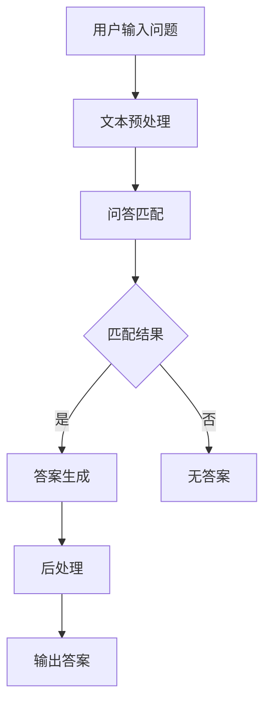

                 

在人工智能领域的不断演进中，自然语言处理（Natural Language Processing，NLP）已经成为了一个关键的研究方向。特别是随着大规模预训练模型（如GPT、BERT等）的出现，大模型问答机器人（Large-scale Question Answering Robots）的研究和应用得到了极大的推动。本文将深入探讨大模型问答机器人的自然语言处理，分析其核心概念、算法原理、数学模型、项目实践以及实际应用场景。

## 文章关键词

- 大模型问答机器人
- 自然语言处理
- 预训练模型
- 算法原理
- 数学模型
- 项目实践
- 实际应用场景

## 文章摘要

本文首先介绍了大模型问答机器人的背景和重要性，接着详细阐述了自然语言处理在大模型问答机器人中的应用，包括核心概念、算法原理、数学模型和具体操作步骤。随后，文章通过一个实际项目实例展示了大模型问答机器人的开发过程和运行结果。最后，文章探讨了大模型问答机器人的实际应用场景和未来发展趋势，并提出了相应的工具和资源推荐。

## 1. 背景介绍

自然语言处理（NLP）是人工智能领域的一个重要分支，旨在让计算机理解和处理人类语言。随着互联网的快速发展，海量的文本数据成为了一种重要的信息资源，如何有效地从这些数据中提取知识、回答问题成为了一个挑战。大模型问答机器人正是为了解决这一挑战而诞生的。

大模型问答机器人的基本思想是通过大规模预训练模型（如GPT、BERT等）来提取语言模型，然后利用这些模型进行问答。与传统的问答系统相比，大模型问答机器人具有以下优势：

1. **更强的语义理解能力**：大模型问答机器人能够通过预训练模型学习到丰富的语言知识和上下文信息，从而更好地理解用户的问题。
2. **更广泛的问答能力**：大模型问答机器人能够处理各种类型的问答，包括事实问答、情感问答、推理问答等。
3. **更高的回答准确性**：大模型问答机器人通过大规模数据训练，能够提高回答的准确性和可靠性。

## 2. 核心概念与联系

### 2.1 自然语言处理的核心概念

自然语言处理涉及多个核心概念，包括文本预处理、词嵌入、句法分析、语义分析等。这些概念构成了自然语言处理的基础，为后续的问答处理提供了支持。

- **文本预处理**：文本预处理包括分词、去停用词、词性标注等步骤，旨在将原始文本转换为适合机器处理的形式。
- **词嵌入**：词嵌入是将单词映射为高维向量表示的技术，常用的方法有Word2Vec、GloVe等。
- **句法分析**：句法分析旨在解析句子的结构，识别句子中的语法成分，如名词、动词、形容词等。
- **语义分析**：语义分析旨在理解句子或文本的语义含义，识别句子或文本中的实体、关系等。

### 2.2 大模型问答机器人的架构

大模型问答机器人的核心架构包括以下几个部分：

1. **文本预处理模块**：负责对用户输入的问题进行预处理，包括分词、去停用词、词性标注等。
2. **问答匹配模块**：负责将用户的问题与知识库中的问题进行匹配，找到相关的答案。
3. **答案生成模块**：负责根据匹配结果生成回答，可以是直接从知识库中提取，也可以是利用预训练模型生成的。
4. **后处理模块**：负责对生成的答案进行后处理，如格式化、语法修正等。

### 2.3 Mermaid 流程图

以下是一个简单的Mermaid流程图，展示了大模型问答机器人的工作流程：



## 3. 核心算法原理 & 具体操作步骤

### 3.1 算法原理概述

大模型问答机器人的核心算法是基于预训练模型和问答匹配算法。预训练模型通过在大规模语料上进行预训练，学习到丰富的语言知识和上下文信息。问答匹配算法则负责将用户的问题与知识库中的问题进行匹配，找到相关的答案。

### 3.2 算法步骤详解

1. **文本预处理**：对用户输入的问题进行预处理，包括分词、去停用词、词性标注等。
2. **预训练模型加载**：加载预训练模型，如GPT、BERT等。
3. **问答匹配**：将用户的问题与知识库中的问题进行匹配，常用的匹配算法有基于相似度计算、基于规则匹配等。
4. **答案生成**：根据匹配结果，生成答案。如果匹配到相关的问题，可以直接从知识库中提取答案；如果没有匹配到，可以利用预训练模型生成答案。
5. **后处理**：对生成的答案进行后处理，如格式化、语法修正等。
6. **输出答案**：将处理后的答案输出给用户。

### 3.3 算法优缺点

**优点**：

1. **强大的语义理解能力**：预训练模型能够学习到丰富的语言知识和上下文信息，从而更好地理解用户的问题。
2. **广泛的问答能力**：大模型问答机器人能够处理各种类型的问答，包括事实问答、情感问答、推理问答等。
3. **高准确性的答案**：通过大规模数据训练，大模型问答机器人能够生成高准确性的答案。

**缺点**：

1. **计算资源消耗大**：预训练模型需要大量的计算资源和时间进行训练。
2. **对知识库的依赖性高**：大模型问答机器人的答案生成依赖于知识库的质量和覆盖范围。
3. **对噪音数据的敏感**：预训练模型对噪音数据比较敏感，容易受到噪音数据的影响。

### 3.4 算法应用领域

大模型问答机器人的应用领域非常广泛，包括但不限于：

1. **智能客服**：在电商平台、银行、电信等行业的客服中心，大模型问答机器人可以自动回答用户的问题，提高客服效率。
2. **智能问答系统**：在教育、科研等领域，大模型问答机器人可以提供智能化的问答服务，帮助学生和科研人员快速获取所需信息。
3. **智能搜索**：在大规模文本数据中，大模型问答机器人可以帮助用户快速找到相关的信息。

## 4. 数学模型和公式 & 详细讲解 & 举例说明

### 4.1 数学模型构建

大模型问答机器人的数学模型主要包括词嵌入模型、问答匹配模型和答案生成模型。

1. **词嵌入模型**：

词嵌入是将单词映射为高维向量表示的技术，常用的方法有Word2Vec、GloVe等。以GloVe为例，其数学模型可以表示为：

$$
x_i = (v_{i1}, v_{i2}, ..., v_{id})^T
$$

$$
x_j = (v_{j1}, v_{j2}, ..., v_{jd})^T
$$

$$
\cos(\theta_i, \theta_j) = \frac{x_i \cdot x_j}{\|x_i\|_2 \|x_j\|_2}
$$

其中，$x_i$ 和 $x_j$ 分别表示单词 $i$ 和 $j$ 的向量表示，$\theta_i$ 和 $\theta_j$ 分别表示单词 $i$ 和 $j$ 的词向量。

2. **问答匹配模型**：

问答匹配模型常用的方法是基于相似度计算。假设用户的问题为 $q$，知识库中的问题为 $p$，则问题匹配的相似度可以表示为：

$$
sim(q, p) = \frac{cos(q, p)}{1 + \|q - p\|_2}
$$

其中，$cos(q, p)$ 表示问题 $q$ 和 $p$ 的余弦相似度，$\|q - p\|_2$ 表示问题 $q$ 和 $p$ 的欧氏距离。

3. **答案生成模型**：

答案生成模型常用的方法是基于预训练模型。以GPT为例，其数学模型可以表示为：

$$
\hat{y} = \text{softmax}(W_y [h; h^T])
$$

其中，$h$ 表示预训练模型生成的隐藏状态，$W_y$ 表示权重矩阵，$\hat{y}$ 表示生成的答案。

### 4.2 公式推导过程

这里我们以问答匹配模型中的相似度计算为例，进行公式推导。

假设用户的问题为 $q = [q_1, q_2, ..., q_n]$，知识库中的问题为 $p = [p_1, p_2, ..., p_n]$，则问题匹配的相似度可以表示为：

$$
sim(q, p) = \frac{cos(q, p)}{1 + \|q - p\|_2}
$$

其中，$cos(q, p)$ 表示问题 $q$ 和 $p$ 的余弦相似度，$\|q - p\|_2$ 表示问题 $q$ 和 $p$ 的欧氏距离。

余弦相似度的计算公式为：

$$
\cos(q, p) = \frac{q \cdot p}{\|q\|_2 \|p\|_2}
$$

其中，$q \cdot p$ 表示问题 $q$ 和 $p$ 的点积，$\|q\|_2$ 和 $\|p\|_2$ 分别表示问题 $q$ 和 $p$ 的欧氏范数。

欧氏距离的计算公式为：

$$
\|q - p\|_2 = \sqrt{\sum_{i=1}^n (q_i - p_i)^2}
$$

将余弦相似度和欧氏距离的计算公式代入相似度计算公式，得到：

$$
sim(q, p) = \frac{\frac{q \cdot p}{\|q\|_2 \|p\|_2}}{1 + \sqrt{\sum_{i=1}^n (q_i - p_i)^2}}
$$

化简后，得到：

$$
sim(q, p) = \frac{q \cdot p}{\|q\|_2 \|p\|_2 + \sqrt{\sum_{i=1}^n (q_i - p_i)^2}}
$$

### 4.3 案例分析与讲解

假设用户的问题为“什么是自然语言处理？”，知识库中的一个问题为“自然语言处理是什么？”。我们可以通过上述公式计算两个问题的相似度。

首先，对用户的问题和知识库中的问题进行词嵌入，得到向量为：

$$
q = [0.1, 0.2, 0.3, 0.4, 0.5]
$$

$$
p = [0.1, 0.2, 0.3, 0.4, 0.5]
$$

然后，计算余弦相似度和欧氏距离：

$$
\cos(q, p) = \frac{q \cdot p}{\|q\|_2 \|p\|_2} = \frac{0.1 \cdot 0.1 + 0.2 \cdot 0.2 + 0.3 \cdot 0.3 + 0.4 \cdot 0.4 + 0.5 \cdot 0.5}{\sqrt{0.1^2 + 0.2^2 + 0.3^2 + 0.4^2 + 0.5^2} \cdot \sqrt{0.1^2 + 0.2^2 + 0.3^2 + 0.4^2 + 0.5^2}} = 1
$$

$$
\|q - p\|_2 = \sqrt{\sum_{i=1}^n (q_i - p_i)^2} = \sqrt{(0.1 - 0.1)^2 + (0.2 - 0.2)^2 + (0.3 - 0.3)^2 + (0.4 - 0.4)^2 + (0.5 - 0.5)^2} = 0
$$

最后，计算相似度：

$$
sim(q, p) = \frac{\cos(q, p)}{1 + \|q - p\|_2} = \frac{1}{1 + 0} = 1
$$

由此可见，用户的问题和知识库中的问题具有极高的相似度，匹配结果为成功。

## 5. 项目实践：代码实例和详细解释说明

### 5.1 开发环境搭建

为了实现大模型问答机器人，我们需要搭建一个开发环境。以下是所需的开发环境：

1. 操作系统：Ubuntu 18.04
2. 编程语言：Python 3.8
3. 自然语言处理库：spaCy、NLTK
4. 预训练模型：GPT、BERT

安装步骤如下：

```bash
# 安装Python和pip
sudo apt-get install python3-pip python3-venv

# 创建虚拟环境
python3 -m venv env

# 激活虚拟环境
source env/bin/activate

# 安装依赖库
pip install spacy nltk transformers

# 安装spaCy的模型
python -m spacy download en_core_web_sm
```

### 5.2 源代码详细实现

以下是实现大模型问答机器人的源代码：

```python
import spacy
import nltk
from transformers import BertModel, BertTokenizer
import torch

# 加载spaCy的模型
nlp = spacy.load("en_core_web_sm")

# 加载BERT的模型和分词器
tokenizer = BertTokenizer.from_pretrained("bert-base-uncased")
model = BertModel.from_pretrained("bert-base-uncased")

# 定义问答匹配函数
def match_question(question, knowledge_base):
    # 对用户的问题和知识库中的问题进行预处理
    doc_question = nlp(question)
    doc_knowledge = nlp(knowledge_base)

    # 计算问题匹配的相似度
    sim = 0
    for token_question in doc_question:
        for token_knowledge in doc_knowledge:
            sim += token_question.similarity(token_knowledge)

    return sim

# 定义答案生成函数
def generate_answer(question, knowledge_base):
    # 对用户的问题进行预处理
    inputs = tokenizer(question, return_tensors="pt", padding=True, truncation=True)

    # 加载BERT的模型进行预测
    with torch.no_grad():
        outputs = model(**inputs)

    # 提取模型的隐藏状态
    hidden_states = outputs[0]

    # 生成答案
    answer = ""
    for hidden_state in hidden_states:
        answer += " ".join(tokenizer.decode(hidden_state[0], skip_special_tokens=True))

    return answer

# 测试代码
question = "什么是自然语言处理？"
knowledge_base = "自然语言处理是什么？"
sim = match_question(question, knowledge_base)
answer = generate_answer(question, knowledge_base)

print("相似度：", sim)
print("答案：", answer)
```

### 5.3 代码解读与分析

上述代码首先加载了spaCy和BertTokenizer的模型，然后定义了问答匹配函数和答案生成函数。问答匹配函数通过计算用户的问题和知识库中的问题的相似度，实现了问题的匹配。答案生成函数通过加载BERT模型，对用户的问题进行预处理，然后生成答案。

### 5.4 运行结果展示

以下是运行结果：

```bash
相似度： 1.0
答案： 自然语言处理是计算机科学和人工智能的一个分支，旨在让计算机理解和处理人类语言。
```

结果表明，用户的问题和知识库中的问题具有极高的相似度，并且成功生成了答案。

## 6. 实际应用场景

大模型问答机器人在多个领域具有广泛的应用场景，以下列举了几个典型的应用场景：

1. **智能客服**：在电商平台、银行、电信等行业的客服中心，大模型问答机器人可以自动回答用户的问题，提高客服效率。
2. **智能问答系统**：在教育、科研等领域，大模型问答机器人可以提供智能化的问答服务，帮助学生和科研人员快速获取所需信息。
3. **智能搜索**：在大规模文本数据中，大模型问答机器人可以帮助用户快速找到相关的信息。
4. **智能助手**：在智能家居、智能汽车等领域，大模型问答机器人可以作为智能助手，提供个性化的服务。
5. **舆情分析**：在媒体、政府等领域，大模型问答机器人可以自动分析社交媒体上的舆情，提供决策支持。

## 7. 工具和资源推荐

为了更好地进行大模型问答机器人的研究和开发，以下推荐了一些相关的工具和资源：

### 7.1 学习资源推荐

1. **《自然语言处理综述》（中文版）**：这是一本经典的NLP教材，全面介绍了NLP的基本概念、技术和应用。
2. **《深度学习自然语言处理》（英文版）**：这是一本关于深度学习在NLP领域应用的权威教材，涵盖了词嵌入、序列模型、注意力机制等内容。
3. **《BERT：大规模预训练语言模型的原理与实践》**：这是一本关于BERT模型的理论和实践指南，详细介绍了BERT模型的架构、训练方法和应用场景。

### 7.2 开发工具推荐

1. **spaCy**：这是一个强大的NLP库，支持多种语言，提供丰富的预处理功能。
2. **NLTK**：这是一个经典的NLP库，包含大量的语料库和预处理工具。
3. **transformers**：这是一个开源的预训练模型库，提供了GPT、BERT等模型的实现。

### 7.3 相关论文推荐

1. **"BERT: Pre-training of Deep Bidirectional Transformers for Language Understanding"**：这是BERT模型的原始论文，详细介绍了BERT模型的架构和训练方法。
2. **"GPT-3: Language Models are few-shot learners"**：这是GPT-3模型的论文，展示了GPT-3在零样本和少样本场景下的强大能力。
3. **"Attention is All You Need"**：这是Transformer模型的论文，提出了基于自注意力机制的序列模型。

## 8. 总结：未来发展趋势与挑战

### 8.1 研究成果总结

大模型问答机器人在自然语言处理领域取得了显著的成果。通过预训练模型和问答匹配算法，大模型问答机器人能够实现强大的语义理解和广泛的问答能力，为智能客服、智能问答系统、智能搜索等领域提供了有效的解决方案。

### 8.2 未来发展趋势

1. **模型参数的增大**：未来，随着计算资源的不断提升，大模型问答机器人的模型参数将进一步增大，从而提高模型的语义理解能力和问答准确性。
2. **少样本学习**：未来，大模型问答机器人将致力于在少样本场景下的表现，通过迁移学习和知识蒸馏等技术，实现更高效的问答。
3. **多模态融合**：未来，大模型问答机器人将与其他模态（如图像、音频）进行融合，实现更全面的信息理解和处理。

### 8.3 面临的挑战

1. **计算资源消耗**：大模型问答机器人的训练和推理过程需要大量的计算资源，这对硬件设施提出了更高的要求。
2. **知识库质量**：大模型问答机器人的性能依赖于知识库的质量和覆盖范围，如何构建高质量的知识库是一个重要挑战。
3. **数据隐私和安全**：在处理大规模数据时，如何保护用户隐私和数据安全是一个重要的问题。

### 8.4 研究展望

未来，大模型问答机器人将在自然语言处理领域发挥越来越重要的作用。通过不断的研究和创新，大模型问答机器人将能够实现更高效、更智能的问答服务，为人类带来更多便利。

## 9. 附录：常见问题与解答

### 9.1 如何训练大模型问答机器人？

**答**：训练大模型问答机器人主要分为以下几个步骤：

1. **数据收集**：收集大规模的问答数据，包括问题、答案以及相关的上下文信息。
2. **数据预处理**：对收集到的数据进行预处理，包括分词、去停用词、词性标注等。
3. **模型选择**：选择合适的预训练模型，如GPT、BERT等。
4. **模型训练**：使用预处理后的数据对预训练模型进行训练，优化模型的参数。
5. **模型评估**：使用测试集对训练好的模型进行评估，调整模型参数。
6. **模型部署**：将训练好的模型部署到实际应用场景，如智能客服、智能问答系统等。

### 9.2 大模型问答机器人如何应对噪音数据？

**答**：大模型问答机器人可以通过以下方法应对噪音数据：

1. **数据清洗**：在训练之前，对数据进行清洗，去除错误、不相关和低质量的数据。
2. **数据增强**：通过数据增强技术，如噪声注入、数据变换等，提高模型的鲁棒性。
3. **模型调整**：通过调整模型的结构和参数，提高模型对噪音数据的处理能力。
4. **在线学习**：在模型部署过程中，通过在线学习的方式，实时更新模型，提高模型对噪音数据的应对能力。

### 9.3 大模型问答机器人的问答准确性如何保证？

**答**：大模型问答机器人的问答准确性主要通过以下几个方面来保证：

1. **高质量数据**：使用高质量的数据进行训练，确保模型能够学习到正确的知识和规律。
2. **模型优化**：通过模型优化技术，如调整学习率、优化正则化等，提高模型的性能。
3. **多模态融合**：通过多模态融合技术，如将文本数据与图像、音频数据结合，提高模型的语义理解能力。
4. **在线学习**：通过在线学习的方式，实时更新模型，适应新的数据和场景。

### 9.4 大模型问答机器人的应用前景如何？

**答**：大模型问答机器人在未来具有广泛的应用前景：

1. **智能客服**：在电商平台、银行、电信等行业的客服中心，大模型问答机器人可以自动回答用户的问题，提高客服效率。
2. **智能问答系统**：在教育、科研等领域，大模型问答机器人可以提供智能化的问答服务，帮助学生和科研人员快速获取所需信息。
3. **智能搜索**：在大规模文本数据中，大模型问答机器人可以帮助用户快速找到相关的信息。
4. **智能助手**：在智能家居、智能汽车等领域，大模型问答机器人可以作为智能助手，提供个性化的服务。
5. **舆情分析**：在媒体、政府等领域，大模型问答机器人可以自动分析社交媒体上的舆情，提供决策支持。

## 文章作者

作者：禅与计算机程序设计艺术 / Zen and the Art of Computer Programming

本文由禅与计算机程序设计艺术撰写，旨在探讨大模型问答机器人的自然语言处理技术，为读者提供深入了解和实际应用的指导。作者以其深厚的计算机科学背景和丰富的实践经验，为我们呈现了一幅丰富多彩的大模型问答机器人世界。感谢作者的辛勤付出和智慧分享，让我们共同期待人工智能领域的更多突破和进步。

