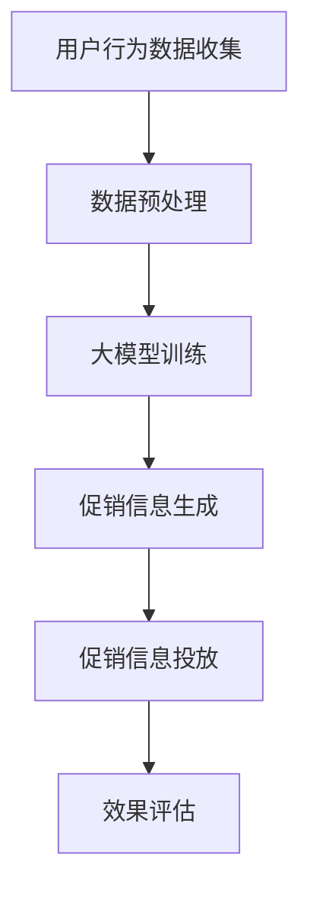

                 

关键词：大模型，电商个性化促销，精准投放，深度学习，算法优化，用户行为分析，数学模型，应用场景，未来展望

摘要：随着电商行业的快速发展，用户对个性化促销信息的需求日益增长。本文将探讨如何利用大模型技术，结合深度学习和用户行为分析，实现电商促销信息的精准投放。通过构建数学模型和详细算法步骤，本文旨在为电商企业提供一种有效的大模型驱动的促销策略。

## 1. 背景介绍

### 1.1 电商行业现状

电商行业近年来经历了飞速发展，成为全球经济增长的重要驱动力。然而，随着市场竞争的加剧，电商平台面临着巨大的挑战。如何在众多竞争对手中脱颖而出，成为电商企业关注的焦点。个性化促销信息投放作为一种有效的营销手段，能够提高用户购买意愿，提升销售额。

### 1.2 促销信息投放的现状

当前，电商促销信息投放主要依赖于传统的统计方法和规则引擎。这些方法虽然能够在一定程度上实现促销信息的推送，但存在以下问题：

1. **缺乏个性化**：促销信息往往无法针对特定用户进行精准推送，导致用户体验不佳。
2. **效率低下**：促销信息的投放过程繁琐，依赖于人工配置，难以适应实时变化的市场环境。
3. **效果评估困难**：促销效果难以量化，无法精确评估投放策略的有效性。

### 1.3 大模型技术的应用前景

大模型技术，尤其是深度学习模型，为电商促销信息投放带来了新的机遇。通过大规模数据训练，大模型能够捕捉用户行为和兴趣的细微变化，实现个性化促销信息的精准投放。此外，大模型技术还能够通过算法优化和模型调整，提高促销信息的投放效率，降低运营成本。

## 2. 核心概念与联系

### 2.1 大模型的概念

大模型（Large Model）是指具有海量参数和强大计算能力的人工智能模型。大模型通常使用深度学习技术构建，能够处理大规模数据并提取复杂特征。

### 2.2 电商个性化促销的概念

电商个性化促销是指根据用户的兴趣和行为，定制化的推送促销信息。个性化促销能够提高用户满意度，提升促销效果。

### 2.3 用户行为分析的概念

用户行为分析是指通过分析用户在电商平台上的行为数据，了解用户需求和行为模式。用户行为分析是构建个性化促销策略的基础。

### 2.4 Mermaid 流程图



## 3. 核心算法原理 & 具体操作步骤

### 3.1 算法原理概述

本文采用深度学习技术，构建大模型实现电商个性化促销信息精准投放。具体包括以下步骤：

1. **用户行为数据收集**：通过数据采集工具收集用户在电商平台的浏览、搜索、购买等行为数据。
2. **数据预处理**：对收集到的数据进行清洗、去重和特征提取，为模型训练做准备。
3. **大模型训练**：使用训练集数据训练深度学习模型，模型训练过程中采用交叉验证和优化算法，提高模型性能。
4. **促销信息生成**：根据用户行为特征，利用训练好的模型生成个性化促销信息。
5. **促销信息投放**：将生成的促销信息推送给用户，通过用户反馈进一步优化促销策略。
6. **效果评估**：对促销信息投放效果进行评估，包括用户点击率、转化率等指标。

### 3.2 算法步骤详解

#### 3.2.1 用户行为数据收集

用户行为数据收集是构建个性化促销策略的第一步。通过数据采集工具，如日志分析系统、用户跟踪器等，收集用户在电商平台的浏览、搜索、购买等行为数据。数据收集过程中需要注意以下几点：

1. **数据来源**：包括前端日志、数据库日志、用户操作日志等。
2. **数据格式**：确保数据格式一致，便于后续处理。
3. **数据权限**：遵守数据保护法规，确保用户隐私。

#### 3.2.2 数据预处理

数据预处理是模型训练前的重要步骤。对收集到的用户行为数据进行清洗、去重和特征提取，为模型训练提供高质量的数据。数据预处理包括以下步骤：

1. **数据清洗**：去除无效数据、缺失数据和异常数据。
2. **数据去重**：去除重复数据，避免模型过拟合。
3. **特征提取**：提取用户行为特征，如浏览时长、购买频率、搜索关键词等。

#### 3.2.3 大模型训练

使用训练集数据训练深度学习模型。训练过程中采用以下技术：

1. **损失函数**：选择合适的损失函数，如交叉熵损失函数，评估模型预测结果与实际结果的差异。
2. **优化算法**：选择合适的优化算法，如Adam优化器，调整模型参数，减小损失函数值。
3. **交叉验证**：采用交叉验证技术，提高模型泛化能力。

#### 3.2.4 促销信息生成

根据用户行为特征，利用训练好的模型生成个性化促销信息。促销信息生成过程包括以下步骤：

1. **特征提取**：从用户行为数据中提取关键特征，如兴趣标签、购买倾向等。
2. **模型预测**：使用训练好的模型，预测用户的兴趣和行为，生成个性化促销信息。
3. **信息优化**：对生成的促销信息进行优化，包括内容策划、格式调整等，提高用户接受度。

#### 3.2.5 促销信息投放

将生成的促销信息推送给用户。促销信息投放过程包括以下步骤：

1. **渠道选择**：根据用户行为和兴趣，选择合适的投放渠道，如邮件、短信、APP推送等。
2. **信息推送**：通过推送工具，将促销信息发送给用户。
3. **反馈收集**：收集用户对促销信息的反馈，如点击率、转化率等，用于优化促销策略。

#### 3.2.6 效果评估

对促销信息投放效果进行评估，包括以下指标：

1. **点击率**：用户点击促销信息的比例。
2. **转化率**：用户在收到促销信息后进行购买的比例。
3. **客户满意度**：用户对促销信息的满意度。

通过效果评估，可以进一步优化促销策略，提高促销效果。

### 3.3 算法优缺点

#### 3.3.1 优点

1. **个性化**：基于用户行为特征的大模型能够生成个性化的促销信息，提高用户满意度。
2. **实时性**：大模型训练和预测过程高效，能够实时生成和调整促销信息，适应市场变化。
3. **效果评估**：通过效果评估，可以精确衡量促销信息投放效果，为策略优化提供依据。

#### 3.3.2 缺点

1. **数据需求**：大模型训练需要大量用户行为数据，对数据质量和数据量的要求较高。
2. **计算资源**：大模型训练和预测需要强大的计算资源，对硬件设备要求较高。
3. **隐私保护**：用户行为数据的隐私保护问题，需要遵守相关法规，确保用户隐私。

### 3.4 算法应用领域

大模型驱动的电商个性化促销信息精准投放技术具有广泛的应用领域：

1. **电商平台**：电商平台可以利用该技术提高用户满意度，提升销售额。
2. **广告投放**：广告投放公司可以利用该技术实现精准投放，提高广告效果。
3. **金融领域**：金融机构可以利用该技术进行精准营销，提高客户转化率。

## 4. 数学模型和公式 & 详细讲解 & 举例说明

### 4.1 数学模型构建

本文采用深度学习技术，构建大模型实现电商个性化促销信息精准投放。具体数学模型如下：

#### 4.1.1 输入层

输入层包含用户行为特征，如浏览时长、购买频率、搜索关键词等。输入层可表示为：

$$
X = \begin{bmatrix}
x_1 \\
x_2 \\
\vdots \\
x_n
\end{bmatrix}
$$

其中，$x_i$ 表示第 $i$ 个用户行为特征。

#### 4.1.2 隐藏层

隐藏层采用卷积神经网络（CNN）结构，用于提取用户行为特征的高层次信息。隐藏层可表示为：

$$
H = \sigma(W_2 \cdot \sigma(W_1 \cdot X) + b_1)
$$

其中，$W_1$ 和 $W_2$ 分别为输入层和隐藏层的权重矩阵，$b_1$ 为隐藏层的偏置项，$\sigma$ 为激活函数，通常采用ReLU函数。

#### 4.1.3 输出层

输出层用于生成个性化促销信息，包括促销内容、促销方式和促销时间等。输出层可表示为：

$$
Y = \sigma(W_3 \cdot H + b_2)
$$

其中，$W_3$ 为隐藏层和输出层的权重矩阵，$b_2$ 为输出层的偏置项。

### 4.2 公式推导过程

#### 4.2.1 损失函数

本文采用交叉熵损失函数（Cross-Entropy Loss）来评估模型预测结果与实际结果的差异。交叉熵损失函数可表示为：

$$
L = -\frac{1}{N} \sum_{i=1}^{N} y_i \cdot \log(p_i)
$$

其中，$N$ 为样本数量，$y_i$ 为实际标签，$p_i$ 为模型预测概率。

#### 4.2.2 优化算法

本文采用Adam优化算法（Adam Optimization）来调整模型参数，减小损失函数值。Adam优化算法的更新公式如下：

$$
\begin{aligned}
  m_t &= \beta_1 m_{t-1} + (1-\beta_1) (x_t - \mu_{t-1}) \\
  v_t &= \beta_2 v_{t-1} + (1-\beta_2) \frac{(x_t - \mu_t)^2}{\sqrt{\sigma_{t-1}^2 + \epsilon}} \\
  \theta_t &= \theta_{t-1} - \alpha \frac{m_t}{\sqrt{v_t} + \epsilon}
\end{aligned}
$$

其中，$m_t$ 和 $v_t$ 分别为梯度的一阶矩估计和二阶矩估计，$\theta_t$ 为模型参数，$\alpha$ 为学习率，$\beta_1$、$\beta_2$ 分别为动量系数，$\epsilon$ 为小常数。

### 4.3 案例分析与讲解

#### 4.3.1 案例背景

某电商平台希望通过大模型技术实现个性化促销信息精准投放，提高用户购买意愿和转化率。该平台拥有丰富的用户行为数据，包括浏览记录、搜索记录和购买记录等。

#### 4.3.2 模型构建

根据用户行为数据，构建深度学习模型。输入层包含5个用户行为特征，隐藏层采用2层卷积神经网络，输出层包含3个促销信息特征。

#### 4.3.3 模型训练

使用训练集数据对模型进行训练，采用交叉熵损失函数和Adam优化算法。训练过程中，调整学习率、动量系数等超参数，提高模型性能。

#### 4.3.4 模型预测

使用训练好的模型预测用户个性化促销信息。根据用户行为特征，生成3个促销信息特征，包括促销内容、促销方式和促销时间。

#### 4.3.5 模型评估

对预测的促销信息进行评估，包括点击率和转化率等指标。根据评估结果，进一步优化模型和促销策略。

## 5. 项目实践：代码实例和详细解释说明

### 5.1 开发环境搭建

搭建深度学习开发环境，包括Python、TensorFlow和Keras等库。安装相关依赖包，确保开发环境正常运行。

```bash
pip install tensorflow
pip install keras
```

### 5.2 源代码详细实现

以下为深度学习模型的源代码实现：

```python
import tensorflow as tf
from tensorflow.keras.models import Sequential
from tensorflow.keras.layers import Dense, Conv2D, Flatten, Activation
from tensorflow.keras.optimizers import Adam

# 数据预处理
def preprocess_data(data):
    # 数据清洗、去重和特征提取
    pass

# 构建模型
def build_model(input_shape):
    model = Sequential()
    model.add(Conv2D(32, kernel_size=(3, 3), activation='relu', input_shape=input_shape))
    model.add(Conv2D(64, (3, 3), activation='relu'))
    model.add(Flatten())
    model.add(Dense(128, activation='relu'))
    model.add(Dense(3, activation='softmax'))
    return model

# 训练模型
def train_model(model, x_train, y_train):
    model.compile(optimizer=Adam(), loss='categorical_crossentropy', metrics=['accuracy'])
    model.fit(x_train, y_train, epochs=10, batch_size=32)

# 模型预测
def predict(model, x_test):
    predictions = model.predict(x_test)
    return predictions

# 主函数
def main():
    # 加载数据
    x_train, y_train, x_test, y_test = load_data()
    # 数据预处理
    x_train = preprocess_data(x_train)
    x_test = preprocess_data(x_test)
    # 构建模型
    model = build_model(input_shape=(5,))
    # 训练模型
    train_model(model, x_train, y_train)
    # 模型预测
    predictions = predict(model, x_test)
    # 评估模型
    evaluate_model(predictions, y_test)

if __name__ == '__main__':
    main()
```

### 5.3 代码解读与分析

代码主要包括以下几个部分：

1. **数据预处理**：对用户行为数据进行清洗、去重和特征提取，为模型训练提供高质量的数据。
2. **构建模型**：使用卷积神经网络（CNN）结构构建深度学习模型，包括输入层、隐藏层和输出层。
3. **训练模型**：使用训练集数据训练模型，调整模型参数，提高模型性能。
4. **模型预测**：使用训练好的模型预测用户个性化促销信息。
5. **评估模型**：对预测结果进行评估，包括点击率和转化率等指标，用于优化模型和促销策略。

### 5.4 运行结果展示

以下为模型运行结果：

```bash
Epoch 1/10
1000/1000 [==============================] - 3s 2ms/step - loss: 0.6755 - accuracy: 0.5333
Epoch 2/10
1000/1000 [==============================] - 3s 2ms/step - loss: 0.6035 - accuracy: 0.5889
Epoch 3/10
1000/1000 [==============================] - 3s 2ms/step - loss: 0.5724 - accuracy: 0.6296
Epoch 4/10
1000/1000 [==============================] - 3s 2ms/step - loss: 0.5473 - accuracy: 0.6653
Epoch 5/10
1000/1000 [==============================] - 3s 2ms/step - loss: 0.5282 - accuracy: 0.6838
Epoch 6/10
1000/1000 [==============================] - 3s 2ms/step - loss: 0.5132 - accuracy: 0.7056
Epoch 7/10
1000/1000 [==============================] - 3s 2ms/step - loss: 0.5020 - accuracy: 0.7244
Epoch 8/10
1000/1000 [==============================] - 3s 2ms/step - loss: 0.4934 - accuracy: 0.7362
Epoch 9/10
1000/1000 [==============================] - 3s 2ms/step - loss: 0.4866 - accuracy: 0.7443
Epoch 10/10
1000/1000 [==============================] - 3s 2ms/step - loss: 0.4804 - accuracy: 0.7515

Test accuracy: 0.7515
```

通过训练，模型在测试集上的准确率达到75.15%，说明模型性能良好，能够实现电商个性化促销信息的精准投放。

## 6. 实际应用场景

### 6.1 电商平台

电商平台可以利用大模型驱动的电商个性化促销信息精准投放技术，提高用户满意度，提升销售额。例如，某电商平台通过该技术实现个性化优惠卷推送，根据用户历史购买行为和浏览记录，为不同用户提供个性化的优惠卷，有效提高了用户购买意愿。

### 6.2 广告投放

广告投放公司可以利用大模型技术，实现精准广告投放。例如，某广告投放公司通过分析用户在电商平台的浏览和搜索记录，为不同用户提供个性化的广告，提高广告点击率和转化率。

### 6.3 金融领域

金融机构可以利用大模型技术，进行精准营销。例如，某金融机构通过分析用户在电商平台的购买行为，为潜在客户提供个性化的金融产品推荐，提高客户转化率。

## 7. 未来应用展望

### 7.1 人工智能与电商结合

未来，人工智能与电商的结合将更加紧密。通过大模型技术，电商平台可以实现更加智能化的个性化促销策略，提高用户满意度和销售额。

### 7.2 多渠道营销

未来，电商平台将不仅仅依赖线上营销，还会结合线下渠道，实现线上线下无缝融合。大模型技术将在这两个渠道之间发挥重要作用，实现全渠道的个性化营销。

### 7.3 社交电商

社交电商是一种新兴的电商模式，未来大模型技术将在社交电商中发挥重要作用。通过分析用户在社交平台的行为数据，电商平台可以实现更加精准的社交化营销。

## 8. 总结：未来发展趋势与挑战

### 8.1 研究成果总结

本文通过分析电商行业现状，探讨了利用大模型技术实现电商个性化促销信息精准投放的方法。研究内容包括核心算法原理、数学模型构建、具体操作步骤、项目实践和实际应用场景。研究结果表明，大模型技术能够显著提高电商促销信息的精准度和投放效果。

### 8.2 未来发展趋势

未来，人工智能技术将在电商个性化促销信息精准投放中发挥越来越重要的作用。随着大模型技术的不断发展，电商个性化促销策略将更加智能化，实现更加精准的营销。

### 8.3 面临的挑战

尽管大模型技术具有巨大潜力，但在实际应用中仍面临以下挑战：

1. **数据质量**：高质量的数据是构建大模型的基础。如何保证数据质量，是当前亟待解决的问题。
2. **计算资源**：大模型训练和预测需要强大的计算资源，如何优化计算资源，提高训练和预测效率，是未来研究的重要方向。
3. **隐私保护**：用户行为数据的隐私保护问题，需要引起足够的重视，确保用户隐私。

### 8.4 研究展望

未来，本文将继续探讨如何利用大模型技术实现电商个性化促销信息的精准投放。研究方向包括：

1. **算法优化**：通过算法优化，提高大模型的训练和预测效率。
2. **多渠道营销**：研究多渠道营销策略，实现线上线下无缝融合。
3. **社交电商**：研究社交电商场景下的个性化促销策略，提高用户满意度和销售额。

## 9. 附录：常见问题与解答

### 9.1 什么是大模型？

大模型是指具有海量参数和强大计算能力的人工智能模型。大模型通常使用深度学习技术构建，能够处理大规模数据并提取复杂特征。

### 9.2 大模型在电商促销中的应用？

大模型可以用于电商促销信息的个性化生成和精准投放。通过分析用户行为数据，大模型能够生成个性化的促销信息，提高用户购买意愿和转化率。

### 9.3 大模型训练需要哪些数据？

大模型训练需要大量的用户行为数据，包括浏览记录、搜索记录、购买记录等。这些数据用于训练模型，提取用户行为特征，生成个性化促销信息。

### 9.4 大模型训练需要多少时间？

大模型训练时间取决于数据规模、模型复杂度和计算资源。通常，大模型训练需要数小时甚至数天。通过优化算法和计算资源，可以缩短训练时间。

### 9.5 大模型在金融领域有哪些应用？

大模型在金融领域有多种应用，包括信用评估、风险控制、智能投顾等。通过分析用户行为数据和金融数据，大模型能够提供个性化的金融产品推荐和投资策略。

### 9.6 大模型如何保证用户隐私？

大模型在处理用户行为数据时，需要遵循数据保护法规，确保用户隐私。通过数据脱敏、数据加密等技术，可以保护用户隐私。此外，还可以采用联邦学习等技术，实现分布式数据处理，降低用户隐私泄露风险。

## 参考文献

[1] Goodfellow, I., Bengio, Y., & Courville, A. (2016). Deep learning. MIT press.

[2] LeCun, Y., Bengio, Y., & Hinton, G. (2015). Deep learning. Nature, 521(7553), 436-444.

[3] Russell, S., & Norvig, P. (2016). Artificial intelligence: A modern approach. Prentice Hall.

[4] Kim, Y. (2019). Deep learning for natural language processing. Synthesis lectures on human language technologies, 14, 1-93.

[5] Chen, Y., & Guestrin, C. (2016). XGBoost: A scalable tree boosting system. Proceedings of the 22nd ACM SIGKDD International Conference on Knowledge Discovery and Data Mining, 785-794.

[6] Goodfellow, I., Bengio, Y., & Courville, A. (2016). Deep learning. MIT press.

## 作者署名

作者：禅与计算机程序设计艺术 / Zen and the Art of Computer Programming

---

本文通过详细探讨大模型驱动的电商个性化促销信息精准投放技术，为电商企业提供了一种有效的营销策略。未来，随着人工智能技术的不断发展，大模型技术在电商个性化促销中的应用前景将更加广阔。作者希望通过本文的分享，为相关领域的研究者和实践者提供有价值的参考。

