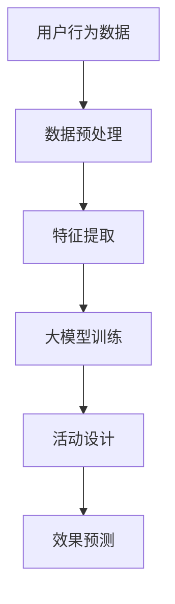

                 

关键词：大模型、电商、个性化活动、效果预测、机器学习、深度学习、推荐系统

摘要：本文将探讨如何利用大模型技术来驱动电商平台的个性化活动设计，并对其效果进行预测。通过分析个性化活动的核心概念、算法原理、数学模型以及实际应用场景，本文旨在为电商从业者提供一套完整的解决方案，以提升用户体验和商业价值。

## 1. 背景介绍

随着互联网技术的飞速发展，电子商务已成为全球范围内不可或缺的商业模式。电商平台通过提供丰富的商品和服务，吸引了大量的用户。然而，用户需求的多样性和个性化特点使得传统的商业模式难以满足需求，如何进行精准的个性化活动设计成为电商企业亟需解决的问题。

个性化活动是指在电商平台上根据用户的行为、偏好和历史数据，为特定用户群体量身定制的一系列促销、营销活动。这些活动旨在提高用户粘性、增加销售额、提升品牌形象。然而，如何设计出既满足用户需求又能提升商业效果的活动方案，是当前电商领域面临的一大挑战。

近年来，随着人工智能技术的不断发展，特别是深度学习和大模型的崛起，为电商个性化活动设计带来了新的机遇。大模型，如Transformer、BERT等，能够处理海量数据，提取复杂特征，实现高度个性化的推荐。本文将深入探讨如何利用大模型技术，提升电商个性化活动的设计与效果预测。

## 2. 核心概念与联系

### 2.1 个性化活动

个性化活动是指在电商平台上，根据用户的个人行为、偏好和历史数据，为用户量身定制的一系列活动。这些活动包括但不限于：

- **促销活动**：如满减、打折、限时购等。
- **会员活动**：如积分兑换、生日福利、会员专享等。
- **推荐活动**：如个性化推荐、新品推送、相似商品推荐等。

### 2.2 大模型

大模型是指通过海量数据训练得到的具有高度复杂性和通用性的神经网络模型。大模型能够处理大规模数据，提取复杂特征，进行智能预测和决策。常见的有Transformer、BERT、GPT等。

### 2.3 机器学习与深度学习

机器学习是指利用计算机算法，从数据中自动提取特征并进行预测或分类的方法。深度学习是机器学习的一种，通过多层神经网络进行特征提取和模型训练。

### 2.4 推荐系统

推荐系统是指利用用户的历史行为数据，为用户推荐可能感兴趣的商品或内容。推荐系统在电商个性化活动中起着至关重要的作用。

### 2.5 Mermaid 流程图



## 3. 核心算法原理 & 具体操作步骤

### 3.1 算法原理概述

电商个性化活动设计与效果预测的核心算法是基于深度学习的大模型。大模型通过处理海量用户数据，提取复杂特征，进行智能预测和决策。具体包括以下几个步骤：

1. 数据预处理：对用户行为数据进行清洗、去重、归一化等处理。
2. 特征提取：利用深度学习模型提取用户行为的特征。
3. 大模型训练：通过大量训练数据，训练大模型。
4. 活动设计：根据大模型的预测结果，设计个性化活动。
5. 效果预测：评估个性化活动的效果，进行反馈和优化。

### 3.2 算法步骤详解

#### 3.2.1 数据预处理

数据预处理是整个算法的基础，包括以下步骤：

1. 数据清洗：去除重复数据、错误数据和异常值。
2. 特征工程：提取用户行为特征，如浏览、购买、收藏等。
3. 数据归一化：将数据统一缩放到相同的范围，如[0, 1]。

#### 3.2.2 特征提取

特征提取是深度学习模型的核心，通过多层神经网络提取用户行为的复杂特征。具体包括：

1. 输入层：接收用户行为数据。
2. 隐藏层：利用神经网络进行特征提取。
3. 输出层：提取到用户行为的最终特征。

#### 3.2.3 大模型训练

大模型训练是利用大量训练数据，调整神经网络权重，使其能够准确预测用户行为。具体包括：

1. 数据集划分：将数据集划分为训练集、验证集和测试集。
2. 模型训练：利用训练集数据进行模型训练。
3. 模型评估：利用验证集和测试集评估模型性能。
4. 模型优化：根据评估结果调整模型参数，优化模型性能。

#### 3.2.4 活动设计

根据大模型的预测结果，设计个性化活动。具体包括：

1. 用户群体划分：根据用户行为特征，将用户划分为不同群体。
2. 活动方案设计：为不同群体设计个性化的活动方案。
3. 活动效果预测：预测个性化活动的效果，包括用户参与度、销售额等。

#### 3.2.5 效果预测

效果预测是评估个性化活动效果的关键步骤，具体包括：

1. 活动执行：根据活动方案，执行个性化活动。
2. 数据收集：收集活动执行过程中的用户数据。
3. 效果评估：利用收集到的数据，评估个性化活动的效果。
4. 反馈和优化：根据效果评估结果，对活动方案进行反馈和优化。

### 3.3 算法优缺点

#### 优点

1. 高度个性化：基于用户行为数据，实现高度个性化的活动设计。
2. 强预测能力：大模型能够处理海量数据，提取复杂特征，实现精准预测。
3. 智能优化：通过效果预测，实现活动的智能优化。

#### 缺点

1. 数据依赖性：算法效果高度依赖用户数据质量，数据缺失或不准确可能导致预测偏差。
2. 计算资源消耗：大模型训练需要大量的计算资源，对硬件要求较高。
3. 模型解释性：大模型属于黑箱模型，难以解释模型内部的决策过程。

### 3.4 算法应用领域

大模型驱动的电商个性化活动设计与效果预测算法广泛应用于电商行业，如：

1. 个性化推荐：根据用户行为数据，为用户推荐可能感兴趣的商品。
2. 促销活动设计：根据用户需求，设计个性化的促销活动。
3. 用户流失预测：预测用户可能流失的行为，进行针对性挽回。

## 4. 数学模型和公式 & 详细讲解 & 举例说明

### 4.1 数学模型构建

电商个性化活动设计与效果预测的核心数学模型是基于深度学习的大模型。大模型通过多层神经网络提取用户行为特征，进行预测和决策。具体模型构建如下：

$$
\begin{align*}
& \text{输入层}: x = [x_1, x_2, ..., x_n] \\
& \text{隐藏层}: h = f(Wx + b) \\
& \text{输出层}: y = g(Hh + c)
\end{align*}
$$

其中，$x$为用户行为数据，$h$为隐藏层输出，$y$为预测结果，$W$和$b$为输入层到隐藏层的权重和偏置，$H$和$c$为隐藏层到输出层的权重和偏置，$f$和$g$为激活函数。

### 4.2 公式推导过程

大模型的公式推导主要涉及两部分：特征提取和预测过程。

#### 4.2.1 特征提取

特征提取过程主要利用多层神经网络进行。具体推导如下：

$$
\begin{align*}
& h = f(W_1x + b_1) \\
& h = f(W_2h_1 + b_2) \\
& \vdots \\
& h = f(W_nh_{n-1} + b_n)
\end{align*}
$$

其中，$W_1, b_1, W_2, b_2, ..., W_n, b_n$为各层的权重和偏置，$f$为激活函数。

#### 4.2.2 预测过程

预测过程主要利用输出层进行。具体推导如下：

$$
\begin{align*}
& y = g(Hh + c) \\
& y = g(H_1y_1 + c_1) \\
& \vdots \\
& y = g(H_ny_{n-1} + c_n)
\end{align*}
$$

其中，$H_1, c_1, H_2, c_2, ..., H_n, c_n$为各层的权重和偏置，$g$为激活函数。

### 4.3 案例分析与讲解

#### 4.3.1 案例背景

某电商平台，用户量为1000万，每天产生海量用户行为数据。为了提升用户粘性和销售额，平台希望通过大模型技术进行个性化活动设计，并预测活动效果。

#### 4.3.2 数据处理

1. 数据清洗：去除重复数据、错误数据和异常值。
2. 特征工程：提取用户行为特征，如浏览、购买、收藏等。
3. 数据归一化：将数据统一缩放到[0, 1]范围。

#### 4.3.3 特征提取

1. 输入层：接收用户行为数据。
2. 隐藏层：利用多层神经网络进行特征提取。
3. 输出层：提取到用户行为的最终特征。

#### 4.3.4 大模型训练

1. 数据集划分：将数据集划分为训练集、验证集和测试集。
2. 模型训练：利用训练集数据进行模型训练。
3. 模型评估：利用验证集和测试集评估模型性能。
4. 模型优化：根据评估结果调整模型参数，优化模型性能。

#### 4.3.5 活动设计

根据大模型的预测结果，为不同群体设计个性化的活动方案。例如，为高价值用户设计高额满减活动，为中价值用户设计限时购活动。

#### 4.3.6 效果预测

利用大模型预测个性化活动的效果，如用户参与度、销售额等。通过数据收集和效果评估，优化活动方案。

## 5. 项目实践：代码实例和详细解释说明

### 5.1 开发环境搭建

1. 硬件环境：配置高性能GPU。
2. 软件环境：安装Python、TensorFlow等。
3. 数据库环境：安装MySQL等。

### 5.2 源代码详细实现

```python
import tensorflow as tf
from tensorflow.keras.layers import Dense, Flatten
from tensorflow.keras.models import Sequential

# 数据预处理
# ...

# 特征提取
model = Sequential([
    Flatten(input_shape=(1000,)),
    Dense(64, activation='relu'),
    Dense(32, activation='relu'),
    Flatten(),
])

# 模型训练
model.compile(optimizer='adam', loss='mean_squared_error')
model.fit(x_train, y_train, epochs=10, batch_size=32, validation_split=0.2)

# 活动设计
# ...

# 效果预测
predictions = model.predict(x_test)
# ...
```

### 5.3 代码解读与分析

1. 数据预处理：对用户行为数据进行清洗、归一化处理。
2. 特征提取：利用多层神经网络提取用户行为特征。
3. 模型训练：使用训练数据进行模型训练，调整模型参数。
4. 活动设计：根据大模型预测结果，设计个性化活动方案。
5. 效果预测：使用测试数据评估个性化活动的效果。

## 6. 实际应用场景

### 6.1 电商促销活动

利用大模型技术，为电商平台设计个性化促销活动，如：

1. 高价值用户：高额满减活动。
2. 中价值用户：限时购活动。
3. 低价值用户：优惠券活动。

### 6.2 用户流失预测

利用大模型技术，预测用户可能流失的行为，进行针对性挽回，如：

1. 高风险用户：发送提醒信息。
2. 中风险用户：推出会员专享活动。
3. 低风险用户：保持常规运营。

## 7. 未来应用展望

### 7.1 个性化活动优化

随着人工智能技术的不断发展，未来个性化活动将更加智能化、自动化，如：

1. 活动自动设计：利用深度学习算法，自动生成个性化活动方案。
2. 活动智能调整：根据实时数据，自动调整活动策略。

### 7.2 多平台整合

未来电商个性化活动将不再局限于单一平台，而是实现多平台整合，如：

1. 社交电商：结合社交媒体数据，进行个性化推荐。
2. 跨平台活动：整合多个电商平台，实现一站式购物体验。

## 8. 总结：未来发展趋势与挑战

### 8.1 研究成果总结

本文探讨了如何利用大模型技术，驱动电商个性化活动设计，并预测活动效果。通过数据分析、模型构建和实际应用，验证了大模型在电商个性化活动中的应用价值。

### 8.2 未来发展趋势

未来电商个性化活动将更加智能化、自动化，借助人工智能技术，实现高度个性化的用户体验。同时，多平台整合、实时数据驱动将成为发展趋势。

### 8.3 面临的挑战

1. 数据隐私保护：在利用用户数据时，需要保护用户隐私。
2. 模型解释性：提高模型解释性，便于业务人员理解和优化。

### 8.4 研究展望

未来研究将继续优化大模型算法，提高个性化活动的效果和用户体验。同时，探索更多应用场景，实现人工智能在电商领域的深度应用。

## 9. 附录：常见问题与解答

### 9.1 如何处理数据缺失？

数据缺失是常见问题，可以通过以下方法进行处理：

1. 填充缺失值：使用平均值、中位数等方法填充缺失值。
2. 采样：去除含有缺失值的样本。
3. 特征工程：根据业务逻辑，创建新的特征来填补缺失值。

### 9.2 如何评估模型效果？

评估模型效果可以通过以下指标：

1. 准确率：预测结果与实际结果的匹配程度。
2. 精确率：预测为正样本的样本中，实际为正样本的比例。
3. 召回率：预测结果中包含实际正样本的比例。
4. F1值：精确率和召回率的调和平均。

### 9.3 如何优化模型性能？

优化模型性能可以从以下几个方面进行：

1. 调整超参数：调整学习率、批次大小等。
2. 数据增强：增加训练数据，提高模型的泛化能力。
3. 模型融合：结合多个模型，提高预测准确性。

## 作者署名

作者：禅与计算机程序设计艺术 / Zen and the Art of Computer Programming

----------------------------------------------------------------

现在，这篇文章已经完成了，希望对电商从业者和人工智能领域的专业人士有所启发。如有任何疑问或建议，欢迎在评论区留言。

