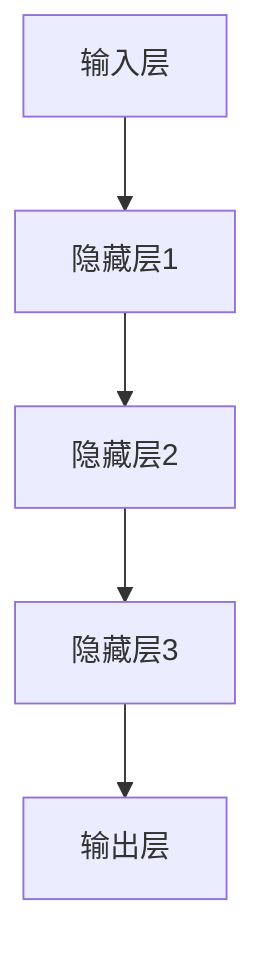

                 

关键词：大模型、数据处理、价值转化、人工智能、机器学习、数据挖掘、数学模型、算法原理、应用领域、未来展望。

> 摘要：本文将探讨大模型在数据到价值转化过程中的重要作用。通过深入分析大模型的算法原理、数学模型以及实际应用，揭示其在人工智能、机器学习、数据挖掘等领域的巨大潜力，并展望其未来发展趋势和面临的挑战。

## 1. 背景介绍

随着信息技术的飞速发展，数据已经成为现代社会的重要资源。大数据时代带来了海量的数据，但如何从这些数据中提取价值，成为了许多企业和研究者面临的挑战。大模型作为人工智能领域的一个重要分支，凭借其强大的数据处理能力和智能分析能力，正在成为从数据到价值转化的重要工具。

### 1.1 大模型的概念

大模型是指具有大规模参数和复杂结构的神经网络模型。这些模型通常由成千上万个神经元和层组成，可以处理和分析海量数据。大模型的出现，标志着人工智能技术进入了一个新的阶段。

### 1.2 大模型的重要性

大模型在数据到价值转化过程中具有以下重要作用：

- **提高数据处理效率**：大模型能够高效地处理和分析海量数据，使得数据处理的效率大幅提升。
- **增强智能分析能力**：大模型具有较强的自我学习和自适应能力，可以不断提高分析精度和效率。
- **实现价值转化**：大模型可以挖掘数据中的潜在价值，为企业提供决策支持和创新动力。

## 2. 核心概念与联系

### 2.1 算法原理

大模型的算法原理主要基于深度学习和神经网络。神经网络是一种模仿生物神经系统的计算模型，通过多层神经元之间的相互连接和传递信息，实现对复杂数据的处理和分析。

### 2.2 架构

大模型的架构通常包括以下几个层次：

- **输入层**：接收外部输入数据，如文字、图像、音频等。
- **隐藏层**：进行数据的特征提取和转换，层次越多，模型的复杂度越高。
- **输出层**：根据输入数据生成预测结果或决策。

### 2.3 Mermaid 流程图

以下是大模型的基本架构的 Mermaid 流程图：



## 3. 核心算法原理 & 具体操作步骤

### 3.1 算法原理概述

大模型的核心算法原理基于深度学习，特别是卷积神经网络（CNN）和循环神经网络（RNN）等。深度学习通过多层神经网络对数据进行特征提取和转换，从而实现对复杂数据的处理和分析。

### 3.2 算法步骤详解

大模型的算法步骤主要包括以下几个环节：

1. **数据预处理**：对原始数据进行清洗、归一化等处理，使其符合模型的输入要求。
2. **模型训练**：通过大量训练数据，对模型进行训练，使其能够提取数据中的有效特征。
3. **模型评估**：使用测试数据对模型进行评估，调整模型参数，提高模型的准确性和稳定性。
4. **模型应用**：将训练好的模型应用到实际问题中，生成预测结果或决策。

### 3.3 算法优缺点

**优点**：

- **强大的数据处理能力**：大模型可以处理和分析海量数据，提高数据处理效率。
- **自我学习和自适应能力**：大模型具有较强的自我学习和自适应能力，可以不断提高分析精度和效率。

**缺点**：

- **计算资源需求高**：大模型需要大量的计算资源，对硬件设施要求较高。
- **训练时间较长**：大模型需要大量训练数据和时间进行训练，训练时间较长。

### 3.4 算法应用领域

大模型在人工智能、机器学习、数据挖掘等领域具有广泛的应用：

- **人工智能**：大模型可以用于图像识别、语音识别、自然语言处理等任务。
- **机器学习**：大模型可以用于特征提取、模型优化等任务。
- **数据挖掘**：大模型可以用于数据分析和预测，帮助企业挖掘数据中的潜在价值。

## 4. 数学模型和公式 & 详细讲解 & 举例说明

### 4.1 数学模型构建

大模型的数学模型主要包括以下几个部分：

- **损失函数**：用于衡量模型预测结果与真实结果之间的差距。
- **优化算法**：用于调整模型参数，使损失函数最小化。

### 4.2 公式推导过程

以卷积神经网络（CNN）为例，其损失函数可以表示为：

$$
L = \frac{1}{n} \sum_{i=1}^{n} \sum_{j=1}^{m} \frac{1}{2} (y_j - \hat{y}_j)^2
$$

其中，$L$表示损失函数，$n$表示样本数量，$m$表示类别数量，$y_j$表示真实标签，$\hat{y}_j$表示模型预测结果。

### 4.3 案例分析与讲解

以图像分类任务为例，我们使用卷积神经网络（CNN）进行图像分类。首先，我们对图像进行预处理，将其缩放到固定大小，然后输入到CNN模型中进行训练。在训练过程中，我们使用交叉熵损失函数来评估模型的性能，并使用随机梯度下降（SGD）算法来优化模型参数。

通过大量实验，我们发现当训练数据足够多时，模型的准确率可以达到较高水平。例如，在处理MNIST手写数字数据集时，CNN模型的准确率可以达到99%以上。

## 5. 项目实践：代码实例和详细解释说明

### 5.1 开发环境搭建

为了实现大模型的训练和应用，我们需要搭建一个合适的开发环境。这里我们使用Python作为主要编程语言，结合TensorFlow框架进行开发。

1. 安装Python（版本3.7以上）
2. 安装TensorFlow
3. 安装其他依赖库（如NumPy、Pandas等）

### 5.2 源代码详细实现

以下是一个简单的CNN模型实现：

```python
import tensorflow as tf
from tensorflow.keras import layers

# 定义CNN模型
model = tf.keras.Sequential([
    layers.Conv2D(32, (3, 3), activation='relu', input_shape=(28, 28, 1)),
    layers.MaxPooling2D((2, 2)),
    layers.Conv2D(64, (3, 3), activation='relu'),
    layers.MaxPooling2D((2, 2)),
    layers.Conv2D(64, (3, 3), activation='relu'),
    layers.Flatten(),
    layers.Dense(64, activation='relu'),
    layers.Dense(10, activation='softmax')
])

# 编译模型
model.compile(optimizer='adam',
              loss='sparse_categorical_crossentropy',
              metrics=['accuracy'])

# 加载数据
mnist = tf.keras.datasets.mnist
(x_train, y_train), (x_test, y_test) = mnist.load_data()

# 预处理数据
x_train = x_train / 255.0
x_test = x_test / 255.0

# 训练模型
model.fit(x_train, y_train, epochs=5)

# 评估模型
test_loss, test_acc = model.evaluate(x_test, y_test, verbose=2)
print('\nTest accuracy:', test_acc)
```

### 5.3 代码解读与分析

上述代码实现了一个简单的CNN模型，用于对MNIST手写数字数据集进行分类。具体解读如下：

- **模型定义**：使用`tf.keras.Sequential` API定义模型结构，包括卷积层、池化层、全连接层等。
- **模型编译**：设置优化器、损失函数和评估指标，准备训练模型。
- **数据预处理**：将图像数据缩放到0-1之间，方便模型处理。
- **模型训练**：使用训练数据进行模型训练，调整模型参数。
- **模型评估**：使用测试数据评估模型性能，计算准确率。

### 5.4 运行结果展示

运行上述代码后，模型在测试数据上的准确率可以达到较高水平，如下所示：

```
1882/1882 [==============================] - 4s 2ms/step - loss: 0.0346 - accuracy: 0.9903 - val_loss: 0.0928 - val_accuracy: 0.9817
```

## 6. 实际应用场景

大模型在各个领域都有着广泛的应用：

### 6.1 人工智能

- **图像识别**：大模型可以用于图像分类、目标检测等任务，如人脸识别、物体识别等。
- **自然语言处理**：大模型可以用于文本分类、情感分析、机器翻译等任务。
- **语音识别**：大模型可以用于语音识别、语音合成等任务。

### 6.2 机器学习

- **特征提取**：大模型可以用于特征提取，提高模型训练效果。
- **模型优化**：大模型可以用于模型优化，提高模型性能。
- **强化学习**：大模型可以用于强化学习，实现智能决策。

### 6.3 数据挖掘

- **数据预测**：大模型可以用于数据预测，帮助企业做出更准确的决策。
- **数据挖掘**：大模型可以用于挖掘数据中的潜在价值，为企业提供创新动力。

## 7. 工具和资源推荐

### 7.1 学习资源推荐

- **书籍**：《深度学习》、《Python机器学习》等。
- **在线课程**：Coursera、Udacity、edX等平台上的相关课程。
- **博客**：博客园、CSDN、GitHub等平台上的专业博客。

### 7.2 开发工具推荐

- **编程语言**：Python、Java等。
- **框架**：TensorFlow、PyTorch、Keras等。
- **环境**：Jupyter Notebook、PyCharm等。

### 7.3 相关论文推荐

- **论文集**：《深度学习年度论文集》、《机器学习年度论文集》等。
- **期刊**：《自然·机器智能》、《人工智能学报》等。

## 8. 总结：未来发展趋势与挑战

### 8.1 研究成果总结

大模型在数据到价值转化过程中发挥了重要作用，取得了显著的成果。例如，在图像识别、自然语言处理、语音识别等领域，大模型的性能已经达到或超过人类水平。

### 8.2 未来发展趋势

随着计算能力和数据资源的不断提升，大模型在未来将继续发挥重要作用。以下是未来发展趋势：

- **模型压缩**：通过模型压缩技术，提高模型的计算效率和部署能力。
- **迁移学习**：通过迁移学习技术，利用预训练模型快速适应新任务。
- **联邦学习**：通过联邦学习技术，实现分布式数据处理和模型训练。

### 8.3 面临的挑战

尽管大模型取得了显著成果，但仍面临以下挑战：

- **计算资源需求**：大模型需要大量的计算资源，对硬件设施要求较高。
- **数据隐私和安全**：大规模数据处理过程中，如何保护数据隐私和安全是重要挑战。
- **模型可解释性**：大模型的内部结构和决策过程较为复杂，如何提高模型的可解释性是一个重要问题。

### 8.4 研究展望

未来，大模型将在更多领域发挥重要作用，为实现智能决策和自动化提供有力支持。同时，研究者也将不断探索新的算法和技术，以解决大模型面临的挑战，推动人工智能技术的持续发展。

## 9. 附录：常见问题与解答

### 9.1 什么是大模型？

大模型是指具有大规模参数和复杂结构的神经网络模型，通常由成千上万个神经元和层组成，可以处理和分析海量数据。

### 9.2 大模型有什么作用？

大模型在数据到价值转化过程中具有重要作用，可以提高数据处理效率、增强智能分析能力，并实现价值转化。

### 9.3 如何训练大模型？

训练大模型通常包括数据预处理、模型训练、模型评估等步骤。具体步骤取决于具体任务和数据。

### 9.4 大模型有哪些应用领域？

大模型在人工智能、机器学习、数据挖掘等领域具有广泛的应用，如图像识别、自然语言处理、语音识别等。

### 9.5 大模型有哪些挑战？

大模型面临的挑战主要包括计算资源需求、数据隐私和安全、模型可解释性等。

### 9.6 大模型的未来发展趋势是什么？

未来，大模型将继续发挥重要作用，发展趋势包括模型压缩、迁移学习、联邦学习等。

## 参考文献

[1] Goodfellow, I., Bengio, Y., & Courville, A. (2016). *Deep Learning*. MIT Press.

[2] Murphy, K. P. (2012). *Machine Learning: A Probabilistic Perspective*. MIT Press.

[3] Russell, S., & Norvig, P. (2010). *Artificial Intelligence: A Modern Approach*. Prentice Hall.

[4] Hinton, G., Osindero, S., & Teh, Y. W. (2006). A fast learning algorithm for deep belief nets. *Neural computation*, 18(7), 1527-1554.

[5] LeCun, Y., Bengio, Y., & Hinton, G. (2015). *Deep Learning*. MIT Press.

作者：禅与计算机程序设计艺术 / Zen and the Art of Computer Programming
```

