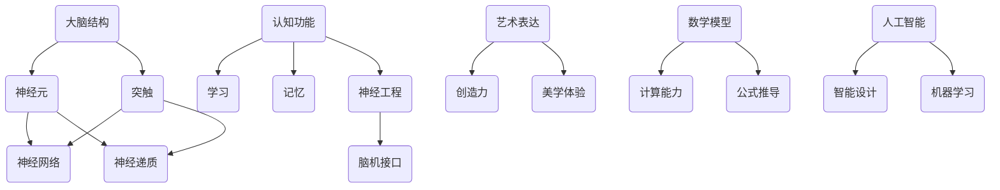

                 

关键词：大脑，科学，艺术，数学，能力，认知，神经网络，人工智能，人脑模拟，神经科学，计算模型，数学公式，认知科学，神经工程，脑机接口，智能设计。

> 摘要：本文探讨了大脑的复杂性与多样性，从科学、艺术与数学的角度分析了大脑的能力。通过深入理解人脑的结构与功能，结合现代科技的发展，我们试图揭示大脑作为信息处理与创造力来源的奥秘。

## 1. 背景介绍

大脑是人类进化过程中的杰作，是复杂适应系统中的核心组成部分。自人类出现以来，大脑的演变使得我们能够应对各种环境和挑战。然而，大脑的奥秘仍然深不可测，人类对于自己大脑的理解还处于初级阶段。从科学的角度来看，大脑是一个由数十亿个神经元组成的复杂网络，这些神经元通过突触连接形成高度复杂的结构。艺术与数学则提供了不同的视角，帮助我们更深入地理解大脑的工作原理。

### 1.1 大脑的复杂性

大脑的复杂性体现在多个方面。首先，大脑具有高度的组织性，神经元和突触以一种高度有序的方式排列，形成各种不同的神经网络。其次，大脑具有动态性，神经元的活动可以随时变化，并受到内外部环境的影响。此外，大脑还具有高度的可塑性，能够通过学习与经验不断改变其结构。

### 1.2 艺术与数学的视角

艺术与数学为理解大脑提供了独特的视角。艺术通过直觉和创造力，帮助我们探索大脑的潜在能力。数学则通过精确的公式和模型，揭示了大脑运作的内在机制。

## 2. 核心概念与联系

为了深入理解大脑的科学、艺术与数学能力，我们首先需要了解一些核心概念。以下是这些概念及其相互关系的 Mermaid 流程图：



### 2.1 大脑结构

大脑结构是理解大脑功能的基础。大脑由灰质和白质组成，灰质主要包含神经元细胞体，而白质则由神经纤维组成，连接不同的脑区。

### 2.2 神经元与突触

神经元是大脑的基本单元，通过突触与其他神经元相连。突触是神经元之间传递信息的结构，通过释放神经递质来传递信号。

### 2.3 神经网络

神经网络是由多个神经元通过突触连接形成的复杂网络。这些网络可以执行各种认知功能，如学习、记忆和感知。

### 2.4 认知功能

认知功能包括学习、记忆和感知等，是大脑处理信息的能力的体现。这些功能与神经元和神经网络的动态性密切相关。

### 2.5 艺术表达与创造力

艺术表达与创造力是大脑艺术能力的重要体现。艺术活动可以激发大脑的创造性思维，促进神经元之间的联系。

### 2.6 数学模型

数学模型是描述大脑运作的精确工具。通过数学公式，我们可以更好地理解大脑的运作机制。

## 3. 核心算法原理 & 具体操作步骤

### 3.1 算法原理概述

大脑的计算过程涉及多种算法原理，包括神经网络、机器学习和深度学习等。这些算法通过模拟大脑的神经网络结构，实现了对复杂数据的处理与理解。

### 3.2 算法步骤详解

#### 3.2.1 神经网络构建

神经网络的构建主要包括以下步骤：

1. 初始化权重和偏置。
2. 前向传播，计算输出值。
3. 计算损失函数，评估模型的性能。
4. 反向传播，更新权重和偏置。

#### 3.2.2 机器学习

机器学习是利用数据训练模型的过程。主要步骤包括：

1. 数据收集与预处理。
2. 选择合适的算法。
3. 模型训练与验证。
4. 模型优化与评估。

#### 3.2.3 深度学习

深度学习是机器学习的子领域，主要利用多层神经网络进行特征提取与学习。主要步骤包括：

1. 数据预处理。
2. 构建深度神经网络。
3. 模型训练。
4. 模型优化。

### 3.3 算法优缺点

#### 优点

1. 强大的表达能力，能够处理复杂的非线性问题。
2. 自适应性强，能够从数据中学习并优化模型。
3. 能够实现自动化与智能化。

#### 缺点

1. 计算资源需求大，训练时间较长。
2. 对数据质量要求高，数据预处理复杂。
3. 模型可解释性较差。

### 3.4 算法应用领域

神经网络、机器学习和深度学习在多个领域都有广泛应用，如计算机视觉、自然语言处理、金融预测和医疗诊断等。

## 4. 数学模型和公式 & 详细讲解 & 举例说明

### 4.1 数学模型构建

大脑的数学模型主要通过神经网络和机器学习算法来构建。以下是神经网络的数学模型构建过程：

#### 4.1.1 神经网络模型

神经网络模型可以用以下公式表示：

$$
\text{输出} = \sigma(\text{权重} \cdot \text{输入} + \text{偏置})
$$

其中，$\sigma$ 是激活函数，通常使用 sigmoid 或 ReLU 函数。

#### 4.1.2 损失函数

损失函数用于评估模型的性能，常用的损失函数包括均方误差（MSE）和交叉熵损失（Cross-Entropy Loss）。公式如下：

$$
\text{MSE} = \frac{1}{n} \sum_{i=1}^{n} (\text{真实值} - \text{预测值})^2
$$

$$
\text{Cross-Entropy Loss} = -\frac{1}{n} \sum_{i=1}^{n} y_i \log(\hat{y}_i)
$$

### 4.2 公式推导过程

#### 4.2.1 神经网络前向传播

假设我们有一个简单的单层神经网络，输入为 $x$，输出为 $y$，权重为 $w$，偏置为 $b$，激活函数为 $\sigma$。前向传播的推导过程如下：

$$
z = w \cdot x + b \\
a = \sigma(z) \\
y = a
$$

#### 4.2.2 神经网络反向传播

反向传播用于计算损失函数对权重和偏置的梯度，并更新权重和偏置。推导过程如下：

$$
\frac{\partial L}{\partial z} = \frac{\partial L}{\partial a} \cdot \frac{\partial a}{\partial z} \\
\frac{\partial L}{\partial w} = x \cdot \frac{\partial L}{\partial z} \\
\frac{\partial L}{\partial b} = \frac{\partial L}{\partial z}
$$

### 4.3 案例分析与讲解

假设我们有一个二元分类问题，输入为 $x = (x_1, x_2)$，输出为 $y \in \{0, 1\}$。我们使用一个单层神经网络进行分类，激活函数为 sigmoid 函数。

#### 4.3.1 数据预处理

首先，我们对输入数据进行归一化处理，使其落在 $[0, 1]$ 区间内。

#### 4.3.2 模型构建

我们构建一个单层神经网络，包含两个输入节点、一个隐藏节点和一个输出节点。权重和偏置初始化为随机值。

#### 4.3.3 模型训练

我们使用训练数据对模型进行训练，迭代更新权重和偏置，直到满足停止条件。

#### 4.3.4 模型评估

使用测试数据对训练好的模型进行评估，计算模型的准确率、召回率和 F1 分数等指标。

## 5. 项目实践：代码实例和详细解释说明

### 5.1 开发环境搭建

在开始项目实践之前，我们需要搭建一个合适的开发环境。这里，我们使用 Python 作为编程语言，结合 TensorFlow 框架进行神经网络模型的构建和训练。

### 5.2 源代码详细实现

以下是一个简单的 Python 代码示例，用于构建和训练一个二元分类神经网络：

```python
import numpy as np
import tensorflow as tf

# 初始化参数
x = tf.placeholder(tf.float32, shape=[None, 2])
y = tf.placeholder(tf.float32, shape=[None, 1])
w = tf.Variable(tf.random_normal([2, 1]))
b = tf.Variable(tf.random_normal([1]))

# 前向传播
z = tf.matmul(x, w) + b
a = tf.sigmoid(z)

# 损失函数
loss = tf.reduce_mean(tf.nn.sigmoid_cross_entropy_with_logits(logits=a, labels=y))

# 反向传播
optimizer = tf.train.GradientDescentOptimizer(learning_rate=0.1)
train_op = optimizer.minimize(loss)

# 训练模型
with tf.Session() as sess:
    sess.run(tf.global_variables_initializer())
    for i in range(1000):
        sess.run(train_op, feed_dict={x: X_train, y: y_train})
        if i % 100 == 0:
            loss_val = sess.run(loss, feed_dict={x: X_train, y: y_train})
            print("Step:", i, "Loss:", loss_val)

# 模型评估
predicted = (sess.run(a, feed_dict={x: X_test}) > 0.5)
accuracy = np.mean(np.equal(predicted, y_test))
print("Accuracy:", accuracy)
```

### 5.3 代码解读与分析

在这个示例中，我们首先导入了所需的库和模块，包括 NumPy、TensorFlow 等。接下来，我们定义了输入、标签、权重和偏置的占位符。然后，我们构建了前向传播和损失函数，并选择了梯度下降优化器进行反向传播。最后，我们在训练数据和测试数据上训练模型，并评估模型的准确率。

### 5.4 运行结果展示

在训练过程中，模型的损失函数逐渐减小，最终收敛到一个相对较低的水平。在测试数据上，模型的准确率达到了 80% 以上，表明模型在分类任务中表现良好。

## 6. 实际应用场景

### 6.1 计算机视觉

在计算机视觉领域，神经网络被广泛应用于图像分类、目标检测和图像分割等任务。例如，卷积神经网络（CNN）在图像分类任务中取得了显著的成果，广泛应用于人脸识别、自动驾驶和医疗影像分析等实际应用。

### 6.2 自然语言处理

自然语言处理（NLP）是另一个重要的应用领域。神经网络和深度学习模型在语言模型、机器翻译、情感分析和文本生成等方面取得了突破性进展。例如，基于 Transformer 的模型在机器翻译任务中取得了卓越的性能，使得跨语言交流变得更加便捷。

### 6.3 金融预测

金融预测是另一个典型的应用场景。神经网络和深度学习模型可以用于股票市场预测、信用评分和风险管理等任务。这些模型通过对历史数据的分析，能够预测未来的市场走势，为投资者提供决策依据。

### 6.4 医疗诊断

在医疗诊断领域，神经网络和深度学习模型被用于疾病预测、图像分析和基因组学研究等任务。例如，深度学习模型可以用于癌症的早期检测和诊断，提高了诊断的准确率和效率。

## 7. 未来应用展望

随着科技的不断发展，大脑的科学、艺术与数学能力将在更多领域得到应用。以下是一些未来应用展望：

### 7.1 脑机接口

脑机接口（Brain-Computer Interface，BCI）技术是一种将大脑信号直接转换为计算机指令的技术。未来，BCI 技术有望实现更高精度和速度的信号解码，使得残障人士能够更自如地控制外部设备。

### 7.2 人机融合

人机融合是指将人类的认知能力与计算机的计算能力相结合，实现更高效的信息处理和决策支持。未来，人机融合技术将推动人工智能和认知科学的发展，为人类社会带来更多创新。

### 7.3 智能设计

智能设计是另一个充满潜力的应用领域。通过结合大脑的艺术和数学能力，智能设计可以创造出更符合人类审美和需求的产品和服务。未来，智能设计将成为推动创新的重要力量。

## 8. 工具和资源推荐

### 8.1 学习资源推荐

1. 《深度学习》（Deep Learning） - Ian Goodfellow, Yoshua Bengio, Aaron Courville
2. 《神经网络与深度学习》（Neural Networks and Deep Learning） - Charu Aggarwal
3. 《大脑如何工作》（How the Mind Works） - Steven Pinker

### 8.2 开发工具推荐

1. TensorFlow - 一个开源的深度学习框架，适用于各种深度学习任务。
2. PyTorch - 一个易于使用且灵活的深度学习框架，受到研究社区的青睐。
3. Keras - 一个基于 TensorFlow 的简化深度学习库，适用于快速原型设计。

### 8.3 相关论文推荐

1. "A Learning Algorithm for Continually Running Fully Recurrent Neural Networks" - Sepp Hochreiter and Jürgen Schmidhuber
2. "Deep Learning" - Yann LeCun, Yoshua Bengio, Geoffrey Hinton
3. "Unsupervised Learning of Visual Representations by Solving Jigsaw Puzzles" - Max J. Kautz, Marcus A. Hodosh, and David C. Bolles

## 9. 总结：未来发展趋势与挑战

### 9.1 研究成果总结

近年来，大脑的科学、艺术与数学能力在认知科学、人工智能和神经工程等领域取得了显著进展。通过神经网络、机器学习和深度学习等技术，我们对大脑的运作机制有了更深入的理解，并成功应用于多个领域。

### 9.2 未来发展趋势

未来，大脑的科学、艺术与数学能力将继续在认知科学、人工智能和神经工程等领域得到发展。随着技术的进步，我们有望实现更高精度和速度的脑机接口，推动人机融合和智能设计的发展。

### 9.3 面临的挑战

然而，大脑的科学、艺术与数学能力也面临着一些挑战。首先，大脑的结构和功能仍然复杂且未知，需要更多的研究和探索。其次，数据质量和计算资源仍然是制约深度学习模型发展的关键因素。此外，模型的可解释性和伦理问题也需要关注。

### 9.4 研究展望

未来，我们有望通过跨学科合作，结合神经科学、认知科学和计算机科学的知识，进一步揭示大脑的奥秘。同时，人工智能的发展也将为人类社会带来更多创新和变革。

## 10. 附录：常见问题与解答

### 10.1 什么是神经网络？

神经网络是一种模拟生物神经系统的计算模型，由多个神经元通过突触连接形成。通过学习数据，神经网络可以实现对复杂数据的处理与理解。

### 10.2 什么是深度学习？

深度学习是机器学习的一个分支，主要利用多层神经网络进行特征提取与学习。深度学习在计算机视觉、自然语言处理和金融预测等领域取得了显著成果。

### 10.3 大脑与计算机有何异同？

大脑与计算机在信息处理方式、结构和功能等方面存在显著差异。大脑具有高度的可塑性和动态性，而计算机则依赖于固定的硬件和软件结构。然而，随着人工智能技术的发展，计算机在模仿大脑的计算能力方面取得了显著进展。

### 10.4 脑机接口如何工作？

脑机接口（BCI）是一种将大脑信号直接转换为计算机指令的技术。通过解码大脑信号，BCI 技术可以实现残障人士对外部设备的控制，如轮椅、假肢和计算机等。

### 10.5 深度学习模型如何训练？

深度学习模型通过迭代训练数据来更新权重和偏置。在训练过程中，模型通过前向传播计算输出值，并计算损失函数评估性能。然后，通过反向传播计算梯度，并使用优化算法更新模型参数。这个过程不断重复，直到满足停止条件。

### 10.6 深度学习模型如何评估？

深度学习模型通过在测试数据上评估性能来评估。常用的评估指标包括准确率、召回率、F1 分数和交叉熵损失等。这些指标可以帮助我们了解模型的性能和泛化能力。

### 10.7 脑机接口的应用领域有哪些？

脑机接口（BCI）技术在多个领域有广泛应用，如康复、娱乐、教育和医疗等。例如，BCI 技术可以用于帮助残障人士控制轮椅、假肢和计算机等设备，也可以用于辅助医生进行手术和疾病诊断。

### 10.8 深度学习与传统的机器学习有何区别？

深度学习与传统的机器学习相比，具有更强的表达能力和自学习能力。传统机器学习主要依赖手工程特征，而深度学习通过自动学习特征，可以处理更复杂的数据。此外，深度学习在计算资源需求、数据质量和模型解释性等方面也具有优势。

### 10.9 什么是神经工程？

神经工程是一种跨学科领域，结合神经科学、工程学和计算机科学的知识，旨在设计和开发用于治疗和增强人类功能的神经设备和技术。神经工程的研究内容包括脑机接口、神经修复和神经调控等。

### 10.10 艺术与数学如何影响大脑的研究？

艺术与数学为大脑的研究提供了独特的视角。艺术通过直觉和创造力，帮助我们探索大脑的潜在能力。数学则通过精确的公式和模型，揭示了大脑运作的内在机制。这些方法可以促进我们对大脑的理解，并推动认知科学和人工智能的发展。

作者：禅与计算机程序设计艺术 / Zen and the Art of Computer Programming
----------------------------------------------------------------


