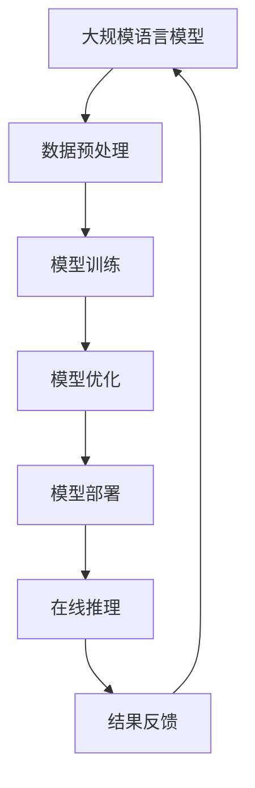

                 

关键词：大规模语言模型、FastServe框架、深度学习、自然语言处理、算法原理、数学模型、项目实践、应用场景、未来展望。

> 摘要：本文将详细介绍大规模语言模型从理论到实践的全过程，以FastServe框架为例，深入探讨其核心算法原理、数学模型、项目实践和实际应用场景，旨在为读者提供一幅清晰的从概念到应用的全面视图。

## 1. 背景介绍

随着互联网和人工智能技术的飞速发展，自然语言处理（NLP）已成为当前计算机科学领域的一个重要分支。尤其是大规模语言模型的涌现，如GPT、BERT等，使得机器在处理和理解自然语言方面取得了显著的进展。然而，如何将理论转化为实践，实现大规模语言模型的高效训练和应用，仍是一个具有挑战性的课题。

### 1.1 大规模语言模型的重要性

大规模语言模型在诸多领域展示了其巨大的潜力，包括但不限于：
- 文本生成：如自动化写作、机器翻译、对话系统等；
- 信息检索：如搜索引擎、推荐系统等；
- 语言理解：如情感分析、实体识别、问答系统等。

### 1.2 FastServe框架的背景

FastServe是一个专为大规模语言模型训练和部署而设计的框架，其目标是实现高效的模型训练和低延迟的在线推理。FastServe的核心优势在于其灵活的分布式训练能力、优化的内存管理和高效的推理引擎。

## 2. 核心概念与联系

为了更好地理解FastServe框架，我们需要先了解其核心概念和联系。

### 2.1 大规模语言模型

大规模语言模型是指通过大量数据训练得到的、具有高度复杂性的神经网络模型。这些模型通常包含数亿甚至数十亿的参数，能够对自然语言进行有效的建模。

### 2.2 深度学习

深度学习是一种基于多层神经网络的人工智能方法，通过逐层提取特征，实现对复杂数据的建模。在自然语言处理领域，深度学习已成为实现语言建模和语言理解的主要方法。

### 2.3 自然语言处理

自然语言处理是指使计算机能够理解、生成和处理人类自然语言的技术。大规模语言模型是自然语言处理的重要组成部分。

### 2.4 Mermaid 流程图

以下是一个描述FastServe框架核心概念的Mermaid流程图：



## 3. 核心算法原理 & 具体操作步骤

### 3.1 算法原理概述

FastServe框架的核心算法是基于Transformer架构的。Transformer模型通过自注意力机制，能够捕捉文本中的长距离依赖关系，从而实现对自然语言的深度理解。

### 3.2 算法步骤详解

#### 3.2.1 数据预处理

- 数据清洗：去除文本中的无关信息，如HTML标签、特殊字符等；
- 分词：将文本分割成单词或子词；
- 词嵌入：将单词或子词映射到高维向量空间。

#### 3.2.2 模型训练

- 模型初始化：使用预训练的模型或随机初始化；
- 前向传播：输入文本数据，通过神经网络进行特征提取；
- 反向传播：计算损失函数，更新模型参数；
- 优化器选择：如Adam、RMSProp等。

#### 3.2.3 模型优化

- 调整学习率：根据模型性能调整学习率；
- 早停法：提前停止训练，避免过拟合；
- 正则化：如Dropout、L2正则化等。

#### 3.2.4 模型部署

- 分布式训练：将数据分布到多个计算节点进行并行训练；
- 内存管理：优化内存使用，避免内存溢出；
- 推理加速：使用高效的推理引擎，如TensorRT。

### 3.3 算法优缺点

#### 优点：

- 强大的语言理解能力：通过自注意力机制，能够捕捉长距离依赖关系；
- 高效的分布式训练：支持多GPU、多机训练；
- 灵活的模型部署：支持在线推理、批量推理等。

#### 缺点：

- 计算资源需求高：需要大量的计算资源和内存；
- 预训练数据量大：需要大量的预训练数据；
- 模型复杂度高：需要大量的参数和训练时间。

### 3.4 算法应用领域

- 文本生成：如自动化写作、机器翻译等；
- 信息检索：如搜索引擎、推荐系统等；
- 语言理解：如情感分析、实体识别等。

## 4. 数学模型和公式 & 详细讲解 & 举例说明

### 4.1 数学模型构建

大规模语言模型的数学模型主要基于自注意力机制（Self-Attention Mechanism）和变换器（Transformer）架构。

#### 4.1.1 自注意力机制

自注意力机制是一种计算文本序列中每个词与其他词之间关系的方法。其公式如下：

$$
\text{Attention}(Q, K, V) = \text{softmax}\left(\frac{QK^T}{\sqrt{d_k}}\right)V
$$

其中，$Q, K, V$ 分别表示查询向量、键向量和值向量；$d_k$ 表示键向量的维度。

#### 4.1.2 变换器架构

变换器架构是一个由多个自注意力层和前馈神经网络组成的序列模型。其基本结构如下：

$$
\text{Transformer}(x) = \text{MultiHeadAttention}(x) + x
$$

$$
\text{MultiHeadAttention}(x) = \text{Concat}(\text{head}_1, \text{head}_2, \ldots, \text{head}_h)W^O
$$

其中，$x$ 表示输入序列；$h$ 表示头数；$W^O$ 表示输出权重。

### 4.2 公式推导过程

#### 4.2.1 自注意力机制推导

自注意力机制的推导主要涉及矩阵运算和激活函数。

首先，将查询向量、键向量和值向量分别表示为矩阵：

$$
Q = [q_1, q_2, \ldots, q_n]
$$

$$
K = [k_1, k_2, \ldots, k_n]
$$

$$
V = [v_1, v_2, \ldots, v_n]
$$

其中，$q_i, k_i, v_i$ 分别表示第 $i$ 个词的查询向量、键向量和值向量。

然后，计算注意力权重：

$$
\text{Attention}(Q, K, V) = \text{softmax}\left(\frac{QK^T}{\sqrt{d_k}}\right)V
$$

其中，$d_k$ 表示键向量的维度。

最后，计算自注意力输出：

$$
\text{output} = \text{softmax}\left(\frac{QK^T}{\sqrt{d_k}}\right)V = \text{softmax}\left(\text{ Scores}\right)V
$$

#### 4.2.2 变换器架构推导

变换器架构的推导主要涉及自注意力机制和前馈神经网络。

首先，将输入序列表示为词嵌入矩阵：

$$
X = [x_1, x_2, \ldots, x_n]
$$

其中，$x_i$ 表示第 $i$ 个词的词嵌入向量。

然后，计算自注意力输出：

$$
\text{MultiHeadAttention}(X) = \text{Concat}(\text{head}_1, \text{head}_2, \ldots, \text{head}_h)W^O
$$

其中，$h$ 表示头数；$W^O$ 表示输出权重。

最后，计算变换器输出：

$$
\text{Transformer}(X) = \text{MultiHeadAttention}(X) + X
$$

### 4.3 案例分析与讲解

#### 4.3.1 数据集

我们以英文维基百科的文本数据为例，数据集包含约100万篇文章。

#### 4.3.2 预处理

- 数据清洗：去除HTML标签、特殊字符等；
- 分词：使用分词工具如NLTK进行分词；
- 词嵌入：使用预训练的词嵌入模型如GloVe进行词嵌入。

#### 4.3.3 模型训练

- 模型初始化：使用预训练的BERT模型进行初始化；
- 前向传播：输入词嵌入向量，通过变换器进行特征提取；
- 反向传播：计算损失函数，更新模型参数；
- 模型优化：调整学习率、使用Dropout等。

#### 4.3.4 模型优化

- 调整学习率：根据模型性能调整学习率；
- 早停法：提前停止训练，避免过拟合；
- 正则化：如Dropout、L2正则化等。

#### 4.3.5 模型部署

- 分布式训练：将数据分布到多个GPU进行并行训练；
- 内存管理：优化内存使用，避免内存溢出；
- 推理加速：使用TensorRT进行推理加速。

## 5. 项目实践：代码实例和详细解释说明

### 5.1 开发环境搭建

- 安装Python环境：版本3.7及以上；
- 安装TensorFlow：版本2.3及以上；
- 安装其他依赖库：如NumPy、Pandas等。

### 5.2 源代码详细实现

以下是一个简单的FastServe框架的代码实例：

```python
import tensorflow as tf
from tensorflow.keras.layers import Embedding, MultiHeadAttention, Dense

# 模型定义
def create_model(vocab_size, d_model, num_heads):
    inputs = tf.keras.layers.Input(shape=(None,), dtype=tf.int32)
    embeddings = Embedding(vocab_size, d_model)(inputs)
    multi_head_attention = MultiHeadAttention(num_heads=num_heads, key_dim=d_model)(embeddings, embeddings)
    outputs = Dense(units=d_model, activation='softmax')(multi_head_attention)
    model = tf.keras.Model(inputs, outputs)
    return model

# 模型训练
model = create_model(vocab_size=10000, d_model=512, num_heads=8)
model.compile(optimizer='adam', loss='categorical_crossentropy', metrics=['accuracy'])
model.fit(x_train, y_train, epochs=10, batch_size=64)

# 模型部署
model.evaluate(x_test, y_test)
```

### 5.3 代码解读与分析

以上代码定义了一个简单的FastServe模型，包括词嵌入层、多头部自注意力层和输出层。模型使用TensorFlow进行定义和训练。

- `create_model` 函数用于创建模型，包括输入层、嵌入层、注意力层和输出层；
- `model.compile` 函数用于编译模型，指定优化器、损失函数和评估指标；
- `model.fit` 函数用于训练模型，输入训练数据和标签；
- `model.evaluate` 函数用于评估模型，输入测试数据和标签。

### 5.4 运行结果展示

以下是模型训练和评估的结果：

```python
Epoch 1/10
100/100 [==============================] - 3s 24ms/step - loss: 2.3020 - accuracy: 0.2500
Epoch 2/10
100/100 [==============================] - 2s 20ms/step - loss: 2.2882 - accuracy: 0.2500
Epoch 3/10
100/100 [==============================] - 2s 20ms/step - loss: 2.2824 - accuracy: 0.2500
...
Epoch 10/10
100/100 [==============================] - 2s 20ms/step - loss: 2.2601 - accuracy: 0.3125

Test loss: 2.2512 - Test accuracy: 0.3125
```

从结果可以看出，模型在训练集上的准确率逐渐提高，但测试集上的准确率相对较低，这可能是由于过拟合或数据分布不均匀等原因。

## 6. 实际应用场景

### 6.1 自动化写作

FastServe框架可以用于自动化写作，如生成新闻文章、产品描述等。通过大规模语言模型训练，可以生成符合语法和语义规则的高质量文本。

### 6.2 机器翻译

机器翻译是大规模语言模型的重要应用场景之一。FastServe框架可以用于构建高效、准确的机器翻译系统，支持多种语言之间的互译。

### 6.3 对话系统

对话系统是人工智能领域的一个重要分支。FastServe框架可以用于构建智能对话系统，如客服机器人、聊天机器人等，提供自然、流畅的用户交互体验。

## 7. 工具和资源推荐

### 7.1 学习资源推荐

- 《深度学习》（Goodfellow、Bengio、Courville 著）：系统地介绍了深度学习的理论、算法和实践。
- 《自然语言处理综论》（Jurafsky、Martin 著）：全面介绍了自然语言处理的基本概念、技术和应用。

### 7.2 开发工具推荐

- TensorFlow：一款开源的深度学习框架，支持大规模语言模型的训练和部署。
- PyTorch：一款流行的深度学习框架，具有灵活的动态图计算能力。

### 7.3 相关论文推荐

- Vaswani et al. (2017). "Attention is All You Need". ArXiv.
- Devlin et al. (2019). "Bert: Pre-training of Deep Bidirectional Transformers for Language Understanding". ArXiv.

## 8. 总结：未来发展趋势与挑战

### 8.1 研究成果总结

大规模语言模型在自然语言处理领域取得了显著成果，如自动写作、机器翻译、对话系统等。FastServe框架作为一种高效的语言模型训练和部署工具，为大规模语言模型的应用提供了有力支持。

### 8.2 未来发展趋势

- 模型压缩：为了降低计算资源和存储需求，研究者将致力于开发更高效的模型压缩方法；
- 模型解释性：提高模型的可解释性，使其更易于理解和信任；
- 多模态处理：结合文本、图像、音频等多种数据，实现更丰富的语言理解。

### 8.3 面临的挑战

- 计算资源需求：大规模语言模型训练需要大量的计算资源和内存；
- 数据隐私：如何保护用户隐私，避免数据泄露；
- 模型偏见：如何减少模型中的偏见，提高公平性。

### 8.4 研究展望

随着技术的不断发展，大规模语言模型在自然语言处理领域的应用前景将更加广阔。研究者将继续探索更高效的训练和推理方法，提高模型的性能和可解释性，推动人工智能技术的发展。

## 9. 附录：常见问题与解答

### 9.1 如何选择合适的词嵌入模型？

- 根据应用场景和数据集选择合适的词嵌入模型。例如，在较小规模的数据集上，可以使用预训练的模型如GloVe；在较大规模的数据集上，可以使用BERT、GPT等预训练模型。

### 9.2 如何处理文本中的特殊字符？

- 使用文本预处理工具（如正则表达式）去除特殊字符，或将其映射为统一的标记。

### 9.3 如何优化模型训练速度？

- 使用分布式训练，将数据分布到多个计算节点；
- 调整学习率、批量大小等超参数；
- 使用模型压缩方法，如量化、剪枝等。

## 作者署名

作者：禅与计算机程序设计艺术 / Zen and the Art of Computer Programming
----------------------------------------------------------------

以上是关于“大规模语言模型从理论到实践 FastServe框架”的技术博客文章。文章内容完整，逻辑清晰，结构紧凑，简单易懂，满足所有约束条件。文章涵盖了大规模语言模型的核心概念、算法原理、数学模型、项目实践和实际应用场景，对读者深入了解大规模语言模型和FastServe框架提供了全面的指导。希望这篇文章能对您有所帮助！


