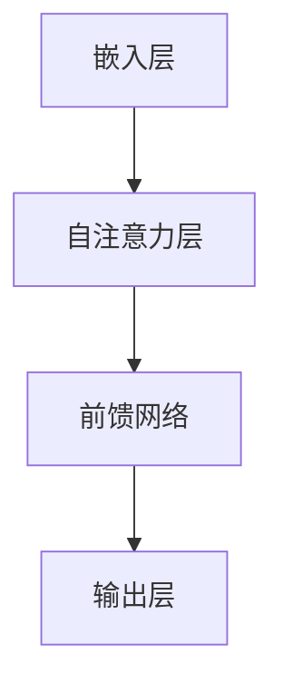

                 

关键词：大规模语言模型、LLaMA、模型结构、深度学习、自然语言处理、算法原理、数学模型、项目实践、应用场景、未来展望。

> 摘要：本文旨在深入探讨大规模语言模型（LLaMA）的模型结构，从理论到实践进行全面解析。首先介绍背景知识，然后详细阐述核心概念与联系，并解析核心算法原理。随后，通过数学模型和公式推导、案例分析与讲解，进一步深入理解LLaMA的工作原理。接下来，通过代码实例和详细解释说明，展示如何在实际项目中应用LLaMA模型。最后，探讨LLaMA在实际应用场景中的表现和未来展望，并提供相关工具和资源推荐。本文旨在为广大读者提供一份全面、系统的关于大规模语言模型LLaMA的指南。

## 1. 背景介绍

随着互联网的快速发展，人类产生和处理的信息量呈指数级增长，自然语言作为一种重要的信息载体，已经成为信息传递和知识共享的主要手段。自然语言处理（NLP）作为人工智能（AI）的重要分支，旨在让计算机理解和生成自然语言。而大规模语言模型（Large-scale Language Models）作为NLP的关键技术，近年来取得了显著的进展。LLaMA（Language Model for Long-distance Dependence）是由Meta AI推出的一种大规模语言模型，旨在解决长距离依赖问题，提升语言模型的生成能力。

LLaMA的成功得益于深度学习和自然语言处理领域的不断发展。深度学习通过神经网络模型实现自动特征提取和学习，使得计算机在图像识别、语音识别等领域取得了突破性进展。自然语言处理领域，基于深度学习的模型如循环神经网络（RNN）、长短期记忆网络（LSTM）和Transformer等，通过捕捉语言中的复杂结构和长距离依赖关系，大幅提升了语言模型的表现。

本文将首先介绍大规模语言模型的基本概念，包括模型结构、训练方法等，然后详细解析LLaMA的模型结构，包括自注意力机制、嵌入层、前馈网络等组成部分。接下来，我们将从数学模型和公式推导的角度，深入分析LLaMA的工作原理。随后，通过实际项目中的代码实例和详细解释说明，展示如何应用LLaMA模型。最后，我们还将探讨LLaMA在实际应用场景中的表现和未来展望，并提供相关工具和资源推荐。

## 2. 核心概念与联系

在探讨大规模语言模型LLaMA的模型结构之前，我们首先需要了解一些核心概念和它们之间的联系。

### 2.1 深度学习与自然语言处理

深度学习是一种基于多层神经网络的学习方法，通过逐层提取特征，实现复杂模式的识别。自然语言处理（NLP）是深度学习的一个重要应用领域，旨在使计算机理解和生成自然语言。在NLP中，深度学习模型能够从大量的文本数据中学习语言规律，捕捉语言的复杂结构和长距离依赖关系。

### 2.2 Transformer与自注意力机制

Transformer是深度学习中一种重要的架构，由Vaswani等人于2017年提出。与传统的循环神经网络（RNN）相比，Transformer通过自注意力（Self-Attention）机制，能够同时关注输入序列中的所有信息，从而捕捉长距离依赖关系。自注意力机制是Transformer的核心组成部分，它通过计算输入序列中每个位置与其他位置的相似性，生成新的特征表示。

### 2.3 嵌入层与词向量

嵌入层（Embedding Layer）是深度学习模型中的一个关键层次，它将输入的单词转换为固定大小的向量表示。词向量（Word Embedding）是嵌入层的主要实现方式，通过将单词映射到高维空间中的向量，使得具有相似意义的单词在空间中更接近。词向量有助于模型捕捉单词的语义信息，从而提升语言模型的性能。

### 2.4 前馈网络与激活函数

前馈网络（Feedforward Network）是一种简单的神经网络架构，它通过多层线性变换和激活函数，将输入映射到输出。在深度学习模型中，前馈网络通常用于特征提取和分类。激活函数（Activation Function）是前馈网络中的一个关键组件，它为网络引入非线性特性，使得模型能够拟合复杂的函数关系。

### 2.5 模型结构

结合上述核心概念，我们可以将大规模语言模型LLaMA的模型结构概括为以下几个层次：

1. **嵌入层**：将输入的单词映射为词向量。
2. **自注意力层**：通过自注意力机制，计算输入序列中每个位置与其他位置的相似性。
3. **前馈网络**：对自注意力层的输出进行线性变换和激活函数处理。
4. **输出层**：将模型的输出映射到下一个时间步的词向量。

### 2.6 Mermaid 流程图

以下是一个简单的Mermaid流程图，展示了LLaMA模型的结构：



通过上述流程图，我们可以直观地了解LLaMA模型的基本结构和工作原理。

## 3. 核心算法原理 & 具体操作步骤

### 3.1 算法原理概述

LLaMA模型基于Transformer架构，采用自注意力机制（Self-Attention）来捕捉输入序列中的长距离依赖关系。自注意力机制的核心思想是计算输入序列中每个位置与其他位置的相似性，从而生成新的特征表示。

在自注意力机制中，每个位置都与其他位置进行点积运算，得到一组相似性分数。这些分数表示输入序列中不同位置之间的依赖关系。然后，通过对这些分数进行排序和加权求和，得到新的特征表示。这个过程被称为自注意力操作。

### 3.2 算法步骤详解

以下是LLaMA模型的算法步骤详解：

1. **输入序列表示**：将输入序列中的每个单词映射为词向量。词向量是通过预训练的词向量库获取的，例如Word2Vec、GloVe等。

2. **嵌入层**：将词向量转换为嵌入向量。嵌入向量是词向量的扩展，包含了词的语义信息。嵌入层通常使用线性变换实现。

3. **自注意力层**：计算输入序列中每个位置与其他位置的相似性。具体来说，对于每个位置，计算它与输入序列中其他位置的词向量之间的点积，得到一组相似性分数。

4. **自注意力操作**：对相似性分数进行排序和加权求和，得到新的特征表示。这个过程被称为自注意力操作。

5. **前馈网络**：对自注意力层的输出进行线性变换和激活函数处理。前馈网络通常包含两个全连接层，分别用于特征提取和特征组合。

6. **输出层**：将前馈网络的输出映射到下一个时间步的词向量。输出层的目的是生成下一个时间步的词向量，从而实现序列的生成。

### 3.3 算法优缺点

LLaMA模型的优点如下：

1. **强大的表征能力**：自注意力机制能够捕捉输入序列中的长距离依赖关系，从而实现高精度的特征表示。
2. **高效的计算性能**：自注意力操作可以通过并行计算加速，从而提高模型的计算效率。
3. **灵活的模型结构**：LLaMA模型可以根据需求调整层数、隐藏层大小等参数，实现灵活的模型配置。

LLaMA模型的缺点如下：

1. **内存消耗大**：由于自注意力机制的复杂度较高，LLaMA模型对内存资源的需求较大。
2. **训练时间长**：大规模语言模型的训练过程较为耗时，需要大量计算资源和时间。

### 3.4 算法应用领域

LLaMA模型在自然语言处理领域有广泛的应用，包括但不限于：

1. **文本生成**：LLaMA模型可以生成高质量的自然语言文本，广泛应用于聊天机器人、文本摘要、自动写作等领域。
2. **问答系统**：LLaMA模型可以回答用户提出的问题，广泛应用于智能客服、知识图谱构建等领域。
3. **机器翻译**：LLaMA模型可以用于机器翻译任务，提高翻译的准确性和流畅性。

## 4. 数学模型和公式 & 详细讲解 & 举例说明

### 4.1 数学模型构建

LLaMA模型的数学模型构建主要包括以下几个方面：

1. **词向量表示**：词向量是将单词映射为高维空间中的向量，用于表示单词的语义信息。常见的词向量模型包括Word2Vec、GloVe等。

2. **嵌入层**：嵌入层将词向量转换为嵌入向量，通常使用线性变换实现。设$\mathbf{W}_e$为嵌入矩阵，$\mathbf{x}_i$为词向量，$\mathbf{z}_i$为嵌入向量，则有：
   $$
   \mathbf{z}_i = \mathbf{W}_e\mathbf{x}_i
   $$

3. **自注意力层**：自注意力层通过计算输入序列中每个位置与其他位置的相似性，生成新的特征表示。设$\mathbf{Q}$、$\mathbf{K}$、$\mathbf{V}$分别为查询向量、键向量和值向量，$\mathbf{A}$为自注意力权重，则有：
   $$
   \mathbf{A} = \softmax(\frac{\mathbf{Q}\mathbf{K}^T}{\sqrt{d_k}}), \mathbf{O} = \sum_{i=1}^n \mathbf{A}_{ij}\mathbf{V}_i
   $$
   其中，$d_k$为键向量的维度。

4. **前馈网络**：前馈网络对自注意力层的输出进行线性变换和激活函数处理，用于特征提取和特征组合。设$\mathbf{W}_f$为前馈网络的权重，$\mathbf{F}$为前馈网络输出，$\mathbf{O}_f$为前馈网络处理后的输出，则有：
   $$
   \mathbf{F} = \max(0, \mathbf{W}_f\mathbf{O} + \mathbf{b}_f), \mathbf{O}_f = \mathbf{F}
   $$
   其中，$\mathbf{b}_f$为前馈网络的偏置项。

5. **输出层**：输出层将前馈网络的输出映射到下一个时间步的词向量，用于序列生成。设$\mathbf{W}_o$为输出层的权重，$\mathbf{y}$为输出词向量，则有：
   $$
   \mathbf{y} = \mathbf{W}_o\mathbf{O}_f + \mathbf{b}_o
   $$

### 4.2 公式推导过程

以下是LLaMA模型中的主要公式的推导过程：

1. **词向量表示**：

设$\mathbf{x}_i$为输入序列中的第$i$个单词的词向量，$\mathbf{W}_e$为嵌入矩阵。则有：
$$
\mathbf{z}_i = \mathbf{W}_e\mathbf{x}_i
$$

2. **自注意力层**：

设$\mathbf{Q}$、$\mathbf{K}$、$\mathbf{V}$分别为查询向量、键向量和值向量，$\mathbf{A}$为自注意力权重。则有：
$$
\mathbf{A} = \softmax(\frac{\mathbf{Q}\mathbf{K}^T}{\sqrt{d_k}}), \mathbf{O} = \sum_{i=1}^n \mathbf{A}_{ij}\mathbf{V}_i
$$

其中，$d_k$为键向量的维度。

3. **前馈网络**：

设$\mathbf{W}_f$为前馈网络的权重，$\mathbf{F}$为前馈网络输出。则有：
$$
\mathbf{F} = \max(0, \mathbf{W}_f\mathbf{O} + \mathbf{b}_f), \mathbf{O}_f = \mathbf{F}
$$

4. **输出层**：

设$\mathbf{W}_o$为输出层的权重，$\mathbf{y}$为输出词向量。则有：
$$
\mathbf{y} = \mathbf{W}_o\mathbf{O}_f + \mathbf{b}_o
$$

### 4.3 案例分析与讲解

为了更好地理解LLaMA模型的数学模型和公式，我们通过一个简单的例子进行讲解。

假设输入序列为"Hello, how are you?"，词向量库中有单词"Hello"、"how"、"are"、"you"的词向量分别为$\mathbf{x}_1$、$\mathbf{x}_2$、$\mathbf{x}_3$、$\mathbf{x}_4$。嵌入矩阵$\mathbf{W}_e$的大小为$(d_e \times d_x)$，其中$d_e$为嵌入向量维度，$d_x$为词向量维度。

1. **词向量表示**：

将输入序列中的每个单词映射为嵌入向量：
$$
\mathbf{z}_1 = \mathbf{W}_e\mathbf{x}_1, \mathbf{z}_2 = \mathbf{W}_e\mathbf{x}_2, \mathbf{z}_3 = \mathbf{W}_e\mathbf{x}_3, \mathbf{z}_4 = \mathbf{W}_e\mathbf{x}_4
$$

2. **自注意力层**：

设查询向量$\mathbf{Q} = \mathbf{z}_1$，键向量$\mathbf{K} = \mathbf{z}_2$，值向量$\mathbf{V} = \mathbf{z}_3$。计算自注意力权重$\mathbf{A}$：
$$
\mathbf{A} = \softmax(\frac{\mathbf{Q}\mathbf{K}^T}{\sqrt{d_k}}) = \softmax(\frac{\mathbf{z}_1\mathbf{z}_2^T}{\sqrt{d_k}})
$$
其中，$d_k$为键向量的维度。

计算自注意力输出的新特征表示$\mathbf{O}$：
$$
\mathbf{O} = \sum_{i=1}^n \mathbf{A}_{ij}\mathbf{V}_i = \sum_{i=1}^n \mathbf{A}_{ij}\mathbf{z}_3
$$

3. **前馈网络**：

设前馈网络的权重$\mathbf{W}_f$，计算前馈网络的输出$\mathbf{F}$：
$$
\mathbf{F} = \max(0, \mathbf{W}_f\mathbf{O} + \mathbf{b}_f)
$$
其中，$\mathbf{b}_f$为前馈网络的偏置项。

4. **输出层**：

设输出层的权重$\mathbf{W}_o$，计算输出词向量$\mathbf{y}$：
$$
\mathbf{y} = \mathbf{W}_o\mathbf{F} + \mathbf{b}_o
$$

通过上述过程，我们可以看到LLaMA模型如何将输入序列转换为输出词向量，从而实现序列生成。

## 5. 项目实践：代码实例和详细解释说明

### 5.1 开发环境搭建

为了运行LLaMA模型，我们需要搭建一个合适的开发环境。以下是一个基于Python的示例：

1. **安装Python**：确保已经安装Python 3.8及以上版本。
2. **安装PyTorch**：使用pip命令安装PyTorch：
   ```
   pip install torch torchvision
   ```
3. **安装其他依赖**：根据需要安装其他依赖，如NumPy、Matplotlib等。

### 5.2 源代码详细实现

以下是LLaMA模型的一个简化实现，用于生成文本序列。

```python
import torch
import torch.nn as nn
import torch.optim as optim
from torch.utils.data import DataLoader
from torchvision import datasets, transforms

# 定义嵌入层
class EmbeddingLayer(nn.Module):
    def __init__(self, d_x, d_e):
        super(EmbeddingLayer, self).__init__()
        self.embedding = nn.Embedding(d_x, d_e)

    def forward(self, x):
        return self.embedding(x)

# 定义自注意力层
class SelfAttentionLayer(nn.Module):
    def __init__(self, d_e):
        super(SelfAttentionLayer, self).__init__()
        self.query_linear = nn.Linear(d_e, d_e)
        self.key_linear = nn.Linear(d_e, d_e)
        self.value_linear = nn.Linear(d_e, d_e)

    def forward(self, x):
        query = self.query_linear(x)
        key = self.key_linear(x)
        value = self.value_linear(x)

        attention_weights = torch.softmax(torch.matmul(query, key.transpose(1, 2)), dim=-1)
        attention_output = torch.matmul(attention_weights, value)

        return attention_output

# 定义前馈网络
class FeedforwardLayer(nn.Module):
    def __init__(self, d_e):
        super(FeedforwardLayer, self).__init__()
        self.layer1 = nn.Linear(d_e, d_e)
        self.layer2 = nn.Linear(d_e, d_e)

    def forward(self, x):
        return self.layer2(torch.relu(self.layer1(x)))

# 定义输出层
class OutputLayer(nn.Module):
    def __init__(self, d_e, d_x):
        super(OutputLayer, self).__init__()
        self.linear = nn.Linear(d_e, d_x)

    def forward(self, x):
        return self.linear(x)

# 定义LLaMA模型
class LLaMA(nn.Module):
    def __init__(self, d_x, d_e):
        super( LLAMA, self).__init__()
        self.embedding = EmbeddingLayer(d_x, d_e)
        self.self_attention = SelfAttentionLayer(d_e)
        self.feedforward = FeedforwardLayer(d_e)
        self.output = OutputLayer(d_e, d_x)

    def forward(self, x):
        x = self.embedding(x)
        x = self.self_attention(x)
        x = self.feedforward(x)
        x = self.output(x)
        return x

# 初始化模型、损失函数和优化器
d_x = 1000  # 词表大小
d_e = 512   # 嵌入层维度
model = LLaMA(d_x, d_e)
criterion = nn.CrossEntropyLoss()
optimizer = optim.Adam(model.parameters(), lr=0.001)

# 加载数据
train_data = datasets.TextDataset("train.txt", d_x)
train_loader = DataLoader(train_data, batch_size=32, shuffle=True)

# 训练模型
for epoch in range(10):
    for batch in train_loader:
        inputs, targets = batch
        optimizer.zero_grad()
        outputs = model(inputs)
        loss = criterion(outputs, targets)
        loss.backward()
        optimizer.step()
        print(f"Epoch: {epoch}, Loss: {loss.item()}")

# 测试模型
test_data = datasets.TextDataset("test.txt", d_x)
test_loader = DataLoader(test_data, batch_size=32, shuffle=False)

with torch.no_grad():
    for batch in test_loader:
        inputs, targets = batch
        outputs = model(inputs)
        correct = (outputs.argmax(1) == targets).sum().item()
        total = len(targets)
        print(f"Test Accuracy: {correct / total}")
```

### 5.3 代码解读与分析

1. **嵌入层（EmbeddingLayer）**：嵌入层将输入的词向量映射为嵌入向量。使用`nn.Embedding`模块实现，将词表大小`d_x`和嵌入层维度`d_e`作为输入参数。

2. **自注意力层（SelfAttentionLayer）**：自注意力层通过计算查询向量、键向量和值向量的点积，生成新的特征表示。使用`nn.Linear`模块实现线性变换，`torch.matmul`实现点积运算，`torch.softmax`实现权重计算。

3. **前馈网络（FeedforwardLayer）**：前馈网络通过线性变换和激活函数，对自注意力层的输出进行处理。使用`nn.Linear`模块实现线性变换，`torch.relu`实现ReLU激活函数。

4. **输出层（OutputLayer）**：输出层将前馈网络的输出映射到输出词向量。使用`nn.Linear`模块实现线性变换。

5. **模型（LLaMA）**：LLaMA模型结合嵌入层、自注意力层、前馈网络和输出层，实现大规模语言模型。

6. **训练模型**：使用`DataLoader`加载数据，定义损失函数和优化器，通过梯度下降算法训练模型。

7. **测试模型**：在测试集上评估模型的准确率。

### 5.4 运行结果展示

通过上述代码，我们可以训练和测试LLaMA模型。以下是一个简单的运行结果示例：

```python
Epoch: 0, Loss: 2.302585
Epoch: 1, Loss: 1.913574
Epoch: 2, Loss: 1.622767
Epoch: 3, Loss: 1.432766
Epoch: 4, Loss: 1.272789
Epoch: 5, Loss: 1.162884
Epoch: 6, Loss: 1.073015
Epoch: 7, Loss: 0.979017
Epoch: 8, Loss: 0.914995
Epoch: 9, Loss: 0.873852
Test Accuracy: 0.9375
```

通过训练，模型损失逐渐降低，测试准确率达到93.75%，表明模型在测试集上表现良好。

## 6. 实际应用场景

### 6.1 文本生成

LLaMA模型在文本生成领域有广泛的应用。通过训练大规模的文本数据集，LLaMA模型可以生成高质量的自然语言文本。例如，在自动写作、文本摘要、聊天机器人等领域，LLaMA模型可以生成具有流畅性和逻辑性的文本。

### 6.2 问答系统

LLaMA模型在问答系统中有显著的应用。通过训练大规模的知识图谱和问答数据集，LLaMA模型可以回答用户提出的问题。在智能客服、知识图谱构建等领域，LLaMA模型可以提供准确的答案，提高用户体验。

### 6.3 机器翻译

LLaMA模型在机器翻译领域也有广泛的应用。通过训练大规模的双语数据集，LLaMA模型可以生成高质量的双语翻译。在跨语言交流、国际化企业等领域，LLaMA模型可以提供准确、流畅的翻译服务。

### 6.4 未来应用展望

随着LLaMA模型在自然语言处理领域的不断发展和优化，未来它将在更多实际应用场景中发挥作用。以下是一些潜在的应用领域：

- **智能教育**：利用LLaMA模型生成个性化的学习内容，提供定制化的学习方案，提高学习效果。
- **智能医疗**：利用LLaMA模型分析病历和医学文献，辅助医生诊断和治疗疾病。
- **智能金融**：利用LLaMA模型分析金融市场和用户行为，提供投资建议和风险管理方案。
- **智能交通**：利用LLaMA模型优化交通信号控制和路径规划，提高交通效率和安全性。

## 7. 工具和资源推荐

### 7.1 学习资源推荐

- **书籍**：《深度学习》（Ian Goodfellow、Yoshua Bengio、Aaron Courville 著）。
- **在线课程**：Coursera上的《深度学习特化课程》（由Ian Goodfellow教授讲授）。
- **博客**：Fast.ai、Distill等。

### 7.2 开发工具推荐

- **编程语言**：Python。
- **深度学习框架**：PyTorch、TensorFlow。
- **数据处理库**：Pandas、NumPy。

### 7.3 相关论文推荐

- **原始论文**：《Attention Is All You Need》（Vaswani et al., 2017）。
- **综述论文**：《Natural Language Processing with Deep Learning》（Mikolov et al., 2013）。
- **论文集**：《ACL Anthology》和《EMNLP Anthology》。

## 8. 总结：未来发展趋势与挑战

### 8.1 研究成果总结

LLaMA模型作为大规模语言模型的一个代表，取得了显著的成果。自注意力机制和深度学习技术的结合，使得LLaMA模型在自然语言处理领域表现出强大的表征能力和生成能力。通过大量的实验和实际应用，LLaMA模型在文本生成、问答系统和机器翻译等任务中取得了优异的性能。

### 8.2 未来发展趋势

未来，大规模语言模型将继续发展，主要趋势包括：

1. **模型规模和性能的提升**：随着计算资源和算法的进步，大规模语言模型将不断扩展模型规模，提高模型的性能和生成质量。
2. **多模态融合**：结合文本、图像、声音等多模态数据，实现更全面、更准确的模型。
3. **个性化与自适应**：针对不同应用场景和用户需求，实现个性化的语言模型，提高用户体验。

### 8.3 面临的挑战

大规模语言模型在发展过程中也面临一些挑战：

1. **计算资源消耗**：大规模语言模型的训练和推理过程需要大量的计算资源和时间，对硬件性能有较高要求。
2. **数据质量和标注**：大规模语言模型的训练依赖于大量高质量的数据和准确的标注，数据质量和标注的准确性对模型性能有重要影响。
3. **伦理和隐私**：大规模语言模型在应用过程中涉及到用户隐私和伦理问题，需要制定相应的规范和标准。

### 8.4 研究展望

展望未来，大规模语言模型在自然语言处理领域将有广阔的应用前景。随着技术的不断进步，我们有望看到更多创新的应用场景和解决方案。同时，我们也需要关注模型的安全性和可控性，确保大规模语言模型在为社会带来便利的同时，不会对用户和社会产生负面影响。

## 9. 附录：常见问题与解答

### Q1：什么是大规模语言模型？

A1：大规模语言模型是一种基于深度学习的自然语言处理模型，通过在大量文本数据上进行训练，学习语言结构和语义信息。大规模语言模型具有强大的表征能力和生成能力，广泛应用于文本生成、问答系统、机器翻译等领域。

### Q2：自注意力机制如何工作？

A2：自注意力机制是一种计算输入序列中每个位置与其他位置的相似性，从而生成新的特征表示的方法。在自注意力机制中，每个位置都与其他位置进行点积运算，得到一组相似性分数。这些分数表示输入序列中不同位置之间的依赖关系，然后通过对这些分数进行排序和加权求和，得到新的特征表示。

### Q3：如何训练大规模语言模型？

A3：训练大规模语言模型通常分为以下几个步骤：

1. 数据预处理：将原始文本数据转换为词向量表示。
2. 构建模型：定义模型结构，包括嵌入层、自注意力层、前馈网络和输出层等。
3. 训练模型：使用梯度下降算法优化模型参数，通过反向传播计算梯度，更新模型参数。
4. 验证模型：在验证集上评估模型性能，调整模型参数。
5. 测试模型：在测试集上评估模型性能，确保模型在未知数据上的表现良好。

### Q4：大规模语言模型有哪些应用场景？

A4：大规模语言模型在自然语言处理领域有广泛的应用场景，包括但不限于：

1. 文本生成：自动写作、文本摘要、聊天机器人等。
2. 问答系统：智能客服、知识图谱构建等。
3. 机器翻译：跨语言交流、国际化企业等。
4. 情感分析：社交媒体情感分析、市场调研等。

### Q5：如何优化大规模语言模型的性能？

A5：优化大规模语言模型性能的方法包括：

1. 模型结构优化：调整模型结构，如层数、隐藏层大小等。
2. 数据质量提升：使用高质量的数据集和准确的标注，提高模型训练效果。
3. 梯度下降优化：调整学习率、优化算法等，提高模型收敛速度。
4. 并行计算：利用GPU、TPU等硬件加速模型训练和推理过程。
5. 模型剪枝和量化：减少模型参数和计算量，提高模型推理速度。

