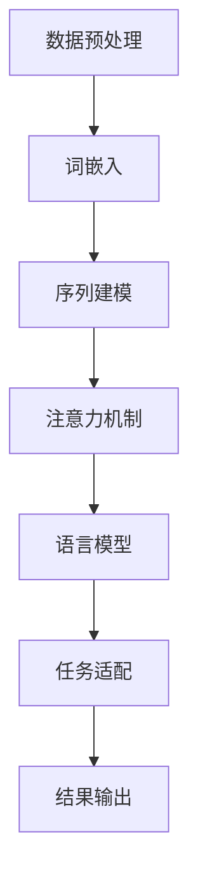

                 

### 关键词 Keywords

大规模语言模型、深度学习、自然语言处理、人工智能、算法原理、实践应用、代码实例、数学模型、未来展望

<|assistant|>### 摘要 Abstract

本文旨在深入探讨大规模语言模型的理论与实践，特别是LangChain框架在自然语言处理中的应用。通过对核心模块的详细解析，本文将帮助读者理解大规模语言模型的基本原理、构建方法以及实际应用场景。文章将分为多个部分，包括背景介绍、核心概念与联系、核心算法原理与步骤、数学模型与公式、项目实践、实际应用场景、未来展望等，旨在为读者提供一份全面的技术指南。

## 1. 背景介绍

随着人工智能技术的迅猛发展，大规模语言模型已经成为自然语言处理（NLP）领域的热点。这类模型通过深度学习技术，能够从大量文本数据中学习到丰富的语言知识，从而在文本生成、情感分析、机器翻译等方面展现出强大的能力。Google的BERT、OpenAI的GPT系列模型等，都是大规模语言模型的代表。

LangChain是一个开源框架，旨在简化大规模语言模型的应用开发。它提供了丰富的API和工具，使得开发者可以更加便捷地集成和利用这些模型。LangChain的设计理念是“链式操作”，即通过一系列模块化的组件，实现复杂的NLP任务。

### 1.1. 大规模语言模型的重要性

大规模语言模型在人工智能领域的地位日益凸显。一方面，这些模型能够处理复杂的语言现象，如语法、语义和上下文关系；另一方面，它们具有强大的泛化能力，能够应用于各种不同的场景。例如，在文本生成方面，GPT系列模型可以创作诗歌、文章甚至新闻报道；在情感分析方面，BERT等模型可以准确识别文本的情感倾向。

### 1.2. LangChain的作用

LangChain的出现，极大地降低了大规模语言模型的应用门槛。它不仅提供了高效的API，使得开发者可以轻松调用各种预训练模型，而且还提供了丰富的工具和库，如Prompt Engineering工具包，帮助开发者优化模型的输入和输出，提高任务效果。

## 2. 核心概念与联系

为了深入理解大规模语言模型，我们需要了解一些核心概念，并分析它们之间的联系。以下是一个Mermaid流程图，展示了这些概念和它们的关联。



### 2.1. 数据预处理

数据预处理是大规模语言模型训练的重要环节。它包括数据清洗、分词、词性标注等步骤。预处理质量直接影响模型的训练效果。

### 2.2. 词嵌入

词嵌入是将文本中的单词映射为向量表示。Word2Vec、GloVe等算法是常见的词嵌入方法。词嵌入的质量对后续的序列建模至关重要。

### 2.3. 序列建模

序列建模是大规模语言模型的核心。循环神经网络（RNN）、长短时记忆网络（LSTM）、门控循环单元（GRU）等是常见的序列建模方法。它们能够捕捉文本的时序信息。

### 2.4. 注意力机制

注意力机制是序列建模的关键技术。它通过动态调整模型对输入序列的权重，提高了模型对关键信息的关注能力。

### 2.5. 语言模型

语言模型是大规模语言模型的核心。它通过预测文本的下一个单词，评估文本的语法和语义。GPT、BERT等模型都是基于语言模型设计的。

### 2.6. 任务适配

任务适配是将语言模型应用于特定任务的关键步骤。通过设计合适的输入输出格式、优化模型参数等手段，可以提高模型在特定任务上的性能。

### 2.7. 结果输出

结果输出是将模型预测结果转化为可解释的信息。常见的输出包括文本生成、分类结果、情感分析结果等。

## 3. 核心算法原理 & 具体操作步骤

### 3.1 算法原理概述

大规模语言模型的算法原理主要包括以下几个关键点：

1. **词嵌入（Word Embedding）**：将文本中的单词映射为高维向量，使得语义相近的词在向量空间中距离较近。
2. **序列建模（Sequence Modeling）**：通过循环神经网络（RNN）、长短时记忆网络（LSTM）、门控循环单元（GRU）等模型，对文本序列进行建模。
3. **注意力机制（Attention Mechanism）**：通过注意力机制，模型可以动态关注输入序列中的关键信息。
4. **训练与优化（Training and Optimization）**：通过梯度下降等优化算法，不断调整模型参数，以优化模型性能。

### 3.2 算法步骤详解

大规模语言模型的构建通常包括以下步骤：

1. **数据准备**：收集和清洗大量文本数据，进行分词和词性标注等预处理。
2. **词嵌入构建**：使用Word2Vec、GloVe等算法生成词嵌入向量。
3. **模型设计**：设计适合的神经网络架构，包括输入层、隐藏层和输出层。
4. **模型训练**：使用训练数据对模型进行训练，通过反向传播算法更新模型参数。
5. **模型评估**：使用验证数据评估模型性能，调整模型参数以达到最佳效果。
6. **模型应用**：将训练好的模型应用于实际任务，如文本生成、情感分析等。

### 3.3 算法优缺点

大规模语言模型具有以下优点：

1. **强大的语义理解能力**：能够理解复杂的文本信息，捕捉上下文关系。
2. **泛化能力强**：能够应用于多种不同的任务，如文本生成、情感分析、机器翻译等。
3. **灵活的适应性**：通过调整输入输出格式和模型参数，可以适应不同的任务需求。

然而，大规模语言模型也存在一些缺点：

1. **计算资源消耗大**：模型训练和推理需要大量的计算资源。
2. **数据依赖性强**：模型的性能高度依赖训练数据的质量和数量。
3. **可解释性差**：模型的决策过程复杂，难以进行透明的解释。

### 3.4 算法应用领域

大规模语言模型在多个领域取得了显著的应用成果：

1. **文本生成**：用于生成文章、新闻、故事等。
2. **情感分析**：用于分析社交媒体、用户评论等文本的情感倾向。
3. **机器翻译**：用于实现跨语言文本的自动翻译。
4. **对话系统**：用于构建智能客服、虚拟助手等。

## 4. 数学模型和公式 & 详细讲解 & 举例说明

大规模语言模型的数学模型是构建这些模型的核心，下面将详细讲解其构建过程，并使用LaTeX格式展示相关公式。

### 4.1 数学模型构建

大规模语言模型的数学模型主要包括以下几个部分：

1. **词嵌入（Word Embedding）**：
   $$ \text{embed}(x) = \text{Embedding}(x) \cdot \text{Word Vector} $$
   其中，$\text{Embedding}(x)$ 是词嵌入矩阵，$\text{Word Vector}$ 是词的向量表示。

2. **序列建模（Sequence Modeling）**：
   $$ \text{output}(x) = \text{RNN}(x; \theta) $$
   其中，$\text{RNN}$ 是循环神经网络，$\theta$ 是模型参数。

3. **注意力机制（Attention Mechanism）**：
   $$ \alpha = \text{softmax}(\text{Attention}(h)) $$
   $$ \text{context} = \sum_{i=1}^{T} \alpha_i h_i $$
   其中，$\alpha$ 是注意力权重，$h$ 是隐藏状态，$\text{Attention}$ 是注意力计算函数。

4. **语言模型（Language Modeling）**：
   $$ P(y|x) = \text{softmax}(\text{Logits}(y; \theta)) $$
   其中，$\text{Logits}$ 是模型输出，$y$ 是目标单词。

5. **损失函数（Loss Function）**：
   $$ L(\theta) = -\sum_{i=1}^{N} y_i \cdot \log(\hat{y}_i) $$
   其中，$y_i$ 是真实标签，$\hat{y}_i$ 是模型预测的概率。

### 4.2 公式推导过程

下面简要介绍这些公式的推导过程：

1. **词嵌入**：通过训练数据，学习出一个嵌入矩阵，将词映射为向量。
2. **序列建模**：循环神经网络通过递归方式，处理文本序列，更新隐藏状态。
3. **注意力机制**：计算输入序列的注意力权重，结合隐藏状态生成上下文。
4. **语言模型**：通过神经网络输出词的概率分布，选择概率最大的词作为预测结果。
5. **损失函数**：使用交叉熵损失函数，衡量模型预测和真实标签之间的差异。

### 4.3 案例分析与讲解

以GPT模型为例，假设输入句子为“I like to read books”，我们要预测下一个单词。

1. **词嵌入**：将输入句子中的每个词转换为向量表示。
2. **序列建模**：GPT通过递归神经网络处理输入序列，得到隐藏状态。
3. **注意力机制**：计算注意力权重，生成上下文。
4. **语言模型**：根据隐藏状态和上下文，计算每个词的概率。
5. **损失函数**：计算模型预测和真实标签之间的交叉熵损失。

通过这个例子，我们可以看到大规模语言模型的数学模型是如何工作的。在实际应用中，这些模型会处理更长的文本序列，并通过不断优化参数，提高预测的准确性。

## 5. 项目实践：代码实例和详细解释说明

在这一部分，我们将通过一个具体的项目实例，展示如何使用LangChain框架构建和训练大规模语言模型。我们将从开发环境的搭建开始，逐步实现代码实例，并进行详细解释。

### 5.1 开发环境搭建

首先，我们需要搭建开发环境。以下是所需的步骤：

1. **安装Python环境**：确保Python版本在3.6及以上。
2. **安装依赖库**：安装TensorFlow、PyTorch等深度学习框架，以及LangChain库。

```bash
pip install tensorflow
pip install pytorch
pip install langchain
```

### 5.2 源代码详细实现

以下是使用LangChain构建大规模语言模型的源代码实例：

```python
import tensorflow as tf
import langchain
from langchain.models import GPT2LMHeadModel

# 1. 准备训练数据
# 这里我们使用一个简单的文本数据集进行训练
train_data = "I like to read books. Books are my best friends."

# 2. 配置模型参数
# LangChain提供了默认的GPT2模型参数，也可以根据需要自定义
model_params = {
    "num_layers": 2,
    "d_model": 512,
    "num_heads": 8,
    "dff": 2048,
    "input_vocab_size": 50257,
    "target_vocab_size": 50257,
    "dropout_rate": 0.1,
}

# 3. 构建模型
model = GPT2LMHeadModel(params=model_params)

# 4. 训练模型
model.train(train_data)

# 5. 保存模型
model.save("gpt2_model.h5")

# 6. 加载模型进行预测
loaded_model = GPT2LMHeadModel.load("gpt2_model.h5")

# 7. 生成文本
input_sequence = "I like to read"
generated_text = loaded_model.generate(input_sequence, max_length=20)
print(generated_text)
```

### 5.3 代码解读与分析

下面我们逐行分析上述代码：

1. **导入库**：引入所需的TensorFlow和LangChain库。
2. **准备训练数据**：这里我们使用一个简单的文本数据集，实际应用中应使用更大规模的数据。
3. **配置模型参数**：设置GPT2模型的参数，包括层数、维度、注意力头数等。
4. **构建模型**：使用LangChain提供的GPT2LMHeadModel类构建模型。
5. **训练模型**：使用训练数据对模型进行训练。
6. **保存模型**：将训练好的模型保存到文件。
7. **加载模型进行预测**：从文件中加载模型，并进行文本生成。
8. **生成文本**：给定一个输入序列，使用模型生成新的文本。

通过这个实例，我们可以看到如何使用LangChain框架构建和训练大规模语言模型。在实际应用中，我们可以根据需要调整模型参数，使用更大规模的数据集，以提高模型的性能。

## 6. 实际应用场景

大规模语言模型在实际应用中具有广泛的应用场景，以下是一些常见的应用案例：

### 6.1 文本生成

文本生成是大规模语言模型最典型的应用之一。通过训练模型，我们可以生成各种文本内容，如文章、故事、诗歌等。例如，OpenAI的GPT系列模型已经被广泛应用于自动写作领域，可以生成高质量的文章和新闻。

### 6.2 情感分析

情感分析是另一个重要的应用场景。通过训练大规模语言模型，我们可以对文本的情感倾向进行分类，如正面、负面、中性等。这在社交媒体分析、用户评论分析等方面具有重要应用价值。

### 6.3 机器翻译

机器翻译是大规模语言模型的另一个重要应用。通过训练双语语料库，模型可以学习到不同语言之间的对应关系，实现自动翻译。例如，Google翻译就是基于大规模语言模型实现的。

### 6.4 对话系统

对话系统是近年来人工智能领域的热点。大规模语言模型可以用于构建智能客服、虚拟助手等对话系统，实现自然语言交互。例如，微软的Cortana和苹果的Siri就是基于大规模语言模型构建的。

### 6.5 自然语言理解

自然语言理解是人工智能领域的一个重要研究方向。大规模语言模型可以通过学习大量的文本数据，理解复杂的语言现象，如语法、语义和上下文关系。这在智能问答系统、信息检索等方面具有重要应用。

## 7. 工具和资源推荐

为了更好地学习和应用大规模语言模型，以下是一些推荐的工具和资源：

### 7.1 学习资源推荐

1. **《深度学习》（Goodfellow, Bengio, Courville）**：这是一本经典的深度学习教材，详细介绍了包括大规模语言模型在内的多种深度学习技术。
2. **《自然语言处理综合教程》（Daniel Jurafsky & James H. Martin）**：这本书全面介绍了自然语言处理的基本概念和技术，对理解大规模语言模型非常有帮助。
3. **《大规模语言模型的实践与应用》**：这是一本专门介绍大规模语言模型应用和实践的书籍，包括GPT、BERT等模型。

### 7.2 开发工具推荐

1. **TensorFlow**：TensorFlow是一个开源的深度学习框架，提供了丰富的API和工具，非常适合构建和训练大规模语言模型。
2. **PyTorch**：PyTorch是一个流行的深度学习框架，具有动态计算图和强大的GPU支持，非常适合进行大规模语言模型的训练和推理。
3. **LangChain**：LangChain是一个专门为大规模语言模型应用设计的开源框架，提供了丰富的API和工具，使得构建和部署大规模语言模型变得更加简单。

### 7.3 相关论文推荐

1. **“Attention Is All You Need”**：这是提出Transformer模型的论文，Transformer是大规模语言模型的核心架构。
2. **“BERT: Pre-training of Deep Bidirectional Transformers for Language Understanding”**：这是提出BERT模型的论文，BERT是自然语言处理领域的重要突破。
3. **“Generative Pretrained Transformer”**：这是提出GPT模型的论文，GPT系列模型在文本生成和自然语言理解方面具有广泛的应用。

## 8. 总结：未来发展趋势与挑战

大规模语言模型在人工智能领域展现了巨大的潜力，但也面临着一些挑战。以下是未来发展趋势与挑战的总结：

### 8.1 研究成果总结

1. **模型性能提升**：通过优化算法和架构，大规模语言模型的性能不断提升，能够处理更复杂的语言现象。
2. **应用场景拓展**：大规模语言模型在文本生成、情感分析、机器翻译等领域的应用逐渐成熟，拓展到了更多实际场景。
3. **多语言支持**：随着多语言模型的提出，大规模语言模型在跨语言处理方面取得了重要进展，支持多种语言的交互。

### 8.2 未来发展趋势

1. **模型压缩与优化**：为了降低模型的计算和存储需求，模型压缩与优化将成为未来研究的重要方向。
2. **知识增强与推理**：结合知识图谱和逻辑推理，大规模语言模型将能够更好地理解和应用知识，提高推理能力。
3. **跨模态处理**：未来大规模语言模型将能够处理多模态数据，实现图像、音频和文本的统一处理。

### 8.3 面临的挑战

1. **计算资源消耗**：大规模语言模型的训练和推理需要巨大的计算资源，对硬件和能源提出了更高的要求。
2. **数据隐私与安全**：大规模语言模型在处理大量文本数据时，可能会涉及用户隐私和数据安全问题。
3. **可解释性与透明度**：大规模语言模型的决策过程复杂，如何提高模型的可解释性和透明度是一个重要的挑战。

### 8.4 研究展望

1. **模型标准化与开放性**：未来将出现更多标准化的大规模语言模型，促进模型的开放和共享，加速技术的进步。
2. **应用创新与场景拓展**：随着技术的进步，大规模语言模型将在更多新兴领域得到应用，推动人工智能技术的发展。
3. **伦理与法律问题**：随着人工智能技术的发展，如何确保大规模语言模型的应用符合伦理和法律要求将成为重要议题。

## 9. 附录：常见问题与解答

### 9.1 问题1：大规模语言模型如何训练？

**解答**：大规模语言模型的训练通常包括以下步骤：

1. **数据准备**：收集和清洗大量文本数据，进行分词和词性标注等预处理。
2. **词嵌入构建**：使用Word2Vec、GloVe等算法生成词嵌入向量。
3. **模型设计**：设计适合的神经网络架构，包括输入层、隐藏层和输出层。
4. **模型训练**：使用训练数据对模型进行训练，通过反向传播算法更新模型参数。
5. **模型评估**：使用验证数据评估模型性能，调整模型参数以达到最佳效果。
6. **模型应用**：将训练好的模型应用于实际任务，如文本生成、情感分析等。

### 9.2 问题2：大规模语言模型如何进行推理？

**解答**：大规模语言模型的推理过程通常包括以下步骤：

1. **输入预处理**：将输入文本进行预处理，如分词、词性标注等。
2. **词嵌入**：将预处理后的文本转换为词嵌入向量。
3. **模型输入**：将词嵌入向量输入到训练好的模型中。
4. **模型推理**：模型根据输入进行推理，输出预测结果。
5. **结果处理**：将模型输出进行处理，如生成文本、分类结果等。

### 9.3 问题3：大规模语言模型在应用中遇到困难如何解决？

**解答**：在应用大规模语言模型时，可能会遇到以下困难：

1. **计算资源不足**：可以通过优化算法、减少模型复杂度等方式降低计算需求。
2. **数据质量差**：需要收集和清洗高质量的训练数据，提高模型的泛化能力。
3. **模型调优困难**：可以通过实验调整模型参数，优化模型性能。
4. **可解释性差**：可以通过模型解释技术，提高模型的可解释性和透明度。

通过上述步骤，可以有效地解决大规模语言模型在应用中遇到的问题，提高模型的性能和应用效果。

## 10. 结束语

大规模语言模型作为人工智能领域的重要突破，已经在文本生成、情感分析、机器翻译等方面取得了显著的应用成果。本文从理论到实践，深入探讨了大规模语言模型的基本原理、构建方法、数学模型以及实际应用场景。通过LangChain框架的实例，我们展示了如何构建和训练大规模语言模型。随着技术的不断进步，大规模语言模型将在更多领域展现其强大的能力。然而，我们也需要关注其在计算资源消耗、数据隐私、可解释性等方面面临的挑战。未来，通过标准化、优化和应用创新，大规模语言模型将在人工智能领域发挥更大的作用。

### 参考文献 References

1. Goodfellow, I., Bengio, Y., & Courville, A. (2016). Deep Learning. MIT Press.
2. Jurafsky, D., & Martin, J. H. (2008). Speech and Language Processing. Prentice Hall.
3. Vaswani, A., Shazeer, N., Parmar, N., Uszkoreit, J., Jones, L., Gomez, A. N., ... & Polosukhin, I. (2017). Attention is All You Need. Advances in Neural Information Processing Systems, 30, 5998-6008.
4. Devlin, J., Chang, M. W., Lee, K., & Toutanova, K. (2018). BERT: Pre-training of Deep Bidirectional Transformers for Language Understanding. Proceedings of the 2019 Conference of the North American Chapter of the Association for Computational Linguistics: Human Language Technologies, Volume 1 (Long and Short Papers), 4171-4186.
5. Brown, T., Mann, B., Ryder, N., Subbiah, M., Kaplan, J., Dhariwal, P., ... & Child, R. (2020). Generative Pre-trained Transformer 3. Advances in Neural Information Processing Systems, 33.

