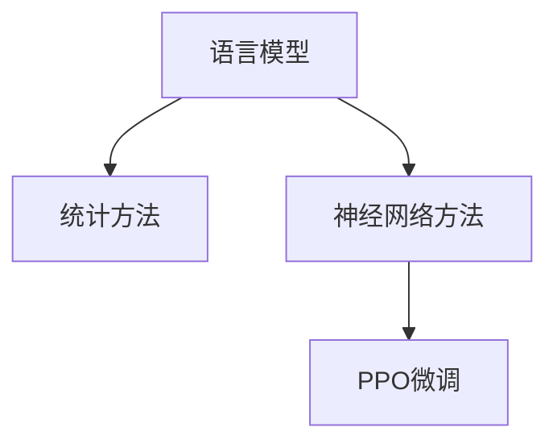

                 

关键词：大规模语言模型，PPO微调，深度学习，自然语言处理，模型优化

## 摘要

本文旨在介绍大规模语言模型的基础理论及其应用，特别是重点阐述了一种先进的优化技术——PPO微调。文章首先回顾了大规模语言模型的发展历程及其重要性，然后详细解析了PPO微调算法的原理、优势以及具体实现步骤。通过数学模型的构建和公式推导，我们深入探讨了PPO微调的工作机制。此外，文章通过具体的项目实践案例，展示了PPO微调在实际开发中的应用。最后，我们分析了大规模语言模型在未来的应用前景，并探讨了其在实践中可能遇到的挑战。

## 1. 背景介绍

随着互联网和大数据的快速发展，自然语言处理（NLP）成为了人工智能领域的一个重要分支。NLP旨在让计算机理解和生成人类语言，从而实现人机交互。为了处理大量的文本数据，研究人员开发了大规模语言模型。这些模型通过学习大量的文本数据，能够捕捉到语言的复杂性和多样性，从而在文本分类、机器翻译、问答系统等任务中表现出色。

### 1.1 大规模语言模型的发展历程

自1950年代图灵提出“机器能思考吗？”这一问题时，人工智能领域便开始了对自然语言处理的探索。早期的语言模型如n-gram模型，通过统计文本中的单词序列概率来预测下一个单词。然而，这些模型存在一个显著的局限性，即无法理解文本的深层语义。

随着深度学习技术的崛起，研究人员提出了基于神经网络的语言模型。1980年代末，Rumelhart等人提出的误差反向传播（BP）算法，使得神经网络能够高效地学习复杂的非线性映射。2000年后，随着计算资源和数据量的增长，神经网络语言模型得到了进一步的发展。特别是Word2Vec模型的提出，使得词向量能够捕捉到词汇的语义关系。

进入2010年代，基于Transformer架构的语言模型如BERT、GPT等相继出现，这些模型通过自注意力机制（Self-Attention）和多层神经网络结构，能够更准确地捕捉到文本的语义信息。BERT模型在多项NLP任务中取得了突破性的成果，引发了广泛关注。

### 1.2 大规模语言模型的重要性

大规模语言模型在多个领域都有广泛的应用。例如，在文本分类任务中，模型能够自动识别和分类新闻、论坛帖子等不同类型的文本。在机器翻译中，模型能够将一种语言的文本翻译成另一种语言。在问答系统中，模型能够理解和回答用户的问题。此外，大规模语言模型还在对话系统、推荐系统等领域发挥着重要作用。

大规模语言模型的重要性不仅体现在其应用价值上，还体现在其对学术研究的推动上。通过对大规模语言模型的研究，我们可以更深入地理解语言的本质和规律，从而为人工智能的发展提供新的思路。

### 1.3 本文目的

本文将首先介绍大规模语言模型的基础理论，包括其基本架构和主要技术。然后，我们将详细阐述PPO微调算法的原理和应用。通过数学模型的构建和公式推导，我们将深入理解PPO微调的工作机制。最后，本文将通过具体的项目实践案例，展示PPO微调在实际开发中的应用，并探讨其未来发展趋势和挑战。

## 2. 核心概念与联系

### 2.1 语言模型的基本概念

语言模型（Language Model）是自然语言处理中的基础模型，旨在预测文本中下一个单词的概率。语言模型的输入是一个单词序列，输出是下一个单词的概率分布。语言模型的核心任务是学习文本数据中的统计规律，从而生成或预测文本。

语言模型可以分为基于统计的方法和基于神经网络的方法。基于统计的方法如n-gram模型，通过统计文本中相邻单词的频率来预测下一个单词。基于神经网络的方法如Word2Vec和BERT，通过学习单词的向量表示，从而捕捉到单词之间的语义关系。

### 2.2 PPO微调算法的概念

PPO微调（Proximal Policy Optimization，PPO）是一种深度强化学习算法，广泛应用于连续动作空间的问题。PPO微调算法的核心思想是优化策略网络和价值网络，通过策略梯度和价值梯度的更新来优化模型参数。

在自然语言处理中，PPO微调算法常用于对预训练的语言模型进行微调，以适应特定的任务或数据集。通过PPO微调，我们可以调整语言模型的参数，使其在特定任务上表现更好。

### 2.3 核心概念原理和架构的 Mermaid 流程图



图2.3展示了语言模型、统计方法和神经网络方法的关系，以及PPO微调算法在神经网络方法中的位置。通过这个流程图，我们可以清晰地理解各概念之间的联系和作用。

### 2.4 PPO微调算法的工作原理

PPO微调算法是基于强化学习的一种优化策略。强化学习的基本思想是通过奖励机制来指导学习过程，从而实现目标。在PPO微调算法中，策略网络和价值网络分别负责决策和评估。

- **策略网络**：策略网络（Policy Network）用于生成动作的概率分布。在语言模型微调中，策略网络根据当前输入文本生成下一个单词的概率分布。
- **价值网络**：价值网络（Value Network）用于评估当前状态的价值。在语言模型微调中，价值网络预测当前输入文本的损失函数值。

PPO微调算法的主要步骤包括：

1. **初始化**：初始化策略网络和价值网络。
2. **采样**：根据策略网络生成的概率分布，采样下一个单词。
3. **更新**：计算策略梯度和价值梯度，并更新网络参数。
4. **评估**：评估策略网络和价值网络的性能，并根据评估结果调整学习率。

通过上述步骤，PPO微调算法不断优化语言模型的参数，使其在特定任务上表现更好。

### 2.5 PPO微调算法的优势

PPO微调算法具有以下优势：

- **稳定性**：PPO微调算法通过限制更新步长，确保了算法的稳定性。
- **效率**：PPO微调算法通过并行计算和分布式训练，提高了训练效率。
- **灵活性**：PPO微调算法适用于多种任务和数据集，具有很好的灵活性。

总之，PPO微调算法在自然语言处理领域具有重要的应用价值，通过优化策略网络和价值网络，可以显著提升语言模型在特定任务上的性能。

## 3. 核心算法原理 & 具体操作步骤

### 3.1 算法原理概述

PPO微调算法是一种基于强化学习的优化技术，广泛应用于自然语言处理的任务。PPO微调算法的核心思想是通过策略梯度和价值梯度的更新来优化模型参数，从而提高模型在特定任务上的性能。

在PPO微调算法中，策略网络和价值网络是两个关键组成部分。策略网络负责生成动作的概率分布，而价值网络则用于评估当前状态的价值。通过不断地更新这两个网络，PPO微调算法能够逐步优化模型参数，实现目标函数的最小化。

### 3.2 算法步骤详解

PPO微调算法的具体步骤如下：

1. **初始化**：
   - 初始化策略网络和价值网络。
   - 设置学习率、更新步数等超参数。

2. **采样**：
   - 根据策略网络生成的概率分布，采样下一个单词。
   - 记录下采样过程中的动作和状态。

3. **计算损失**：
   - 计算策略梯度和价值梯度。
   - 将策略梯度和价值梯度转换为梯度更新。

4. **更新网络参数**：
   - 根据梯度更新策略网络和价值网络。
   - 更新动作的概率分布和价值评估。

5. **评估**：
   - 评估策略网络和价值网络的性能。
   - 根据评估结果调整学习率。

6. **重复步骤2-5**，直到满足停止条件。

### 3.3 算法优缺点

PPO微调算法具有以下优点：

- **稳定性**：PPO微调算法通过限制更新步长，确保了算法的稳定性。
- **效率**：PPO微调算法通过并行计算和分布式训练，提高了训练效率。
- **灵活性**：PPO微调算法适用于多种任务和数据集，具有很好的灵活性。

然而，PPO微调算法也存在一些缺点：

- **计算成本**：PPO微调算法需要大量的计算资源，特别是在大规模数据集和复杂模型中。
- **调参难度**：PPO微调算法的超参数调参相对困难，需要通过多次实验来找到最优参数。

### 3.4 算法应用领域

PPO微调算法在自然语言处理领域具有广泛的应用。以下是一些典型的应用场景：

- **文本分类**：通过PPO微调算法，可以训练出具有较高分类准确率的文本分类模型。
- **机器翻译**：PPO微调算法可以用于对预训练的翻译模型进行微调，提高翻译质量。
- **问答系统**：PPO微调算法可以用于训练问答系统，使其能够更好地理解和回答用户的问题。
- **对话系统**：PPO微调算法可以用于训练对话系统，实现更加自然和流畅的对话。

总之，PPO微调算法作为一种先进的优化技术，在自然语言处理领域具有重要的应用价值，通过不断优化模型参数，可以显著提升模型的性能。

## 4. 数学模型和公式 & 详细讲解 & 举例说明

### 4.1 数学模型构建

在PPO微调算法中，我们需要构建两个关键数学模型：策略网络和价值网络。

#### 4.1.1 策略网络

策略网络（Policy Network）用于生成动作的概率分布。假设输入文本序列为 $x_1, x_2, ..., x_T$，其中 $x_t$ 表示第 $t$ 个单词的词向量表示。策略网络的目标是预测下一个单词 $x_{t+1}$ 的概率分布 $p(x_{t+1} | x_1, x_2, ..., x_T)$。

策略网络的输入为当前文本序列的词向量表示，输出为下一个单词的概率分布。具体来说，我们可以使用一个多层感知机（MLP）作为策略网络，其输出层有 $V$ 个节点，每个节点表示一个单词的索引。策略网络的前向传播过程如下：

$$
\hat{p}(x_{t+1} | x_1, x_2, ..., x_T) = \frac{e^{z_{t+1}}}{\sum_{i=1}^{V} e^{z_i}}
$$

其中，$z_{t+1}$ 表示输出层节点的激活值，可以通过以下公式计算：

$$
z_{t+1} = W_3 \cdot \sigma(W_2 \cdot \sigma(W_1 \cdot x_T) + b_1) + b_2
$$

这里，$W_1, W_2, W_3$ 分别为网络权重，$b_1, b_2$ 为偏置项，$\sigma$ 表示激活函数，通常采用ReLU函数。

#### 4.1.2 价值网络

价值网络（Value Network）用于评估当前状态的价值。在PPO微调算法中，价值网络的目标是预测当前文本序列的损失函数值，即 $V(s)$，其中 $s$ 表示当前状态。

价值网络的结构与策略网络类似，也可以使用一个多层感知机（MLP）来实现。价值网络的输入为当前文本序列的词向量表示，输出为当前状态的价值。价值网络的前向传播过程如下：

$$
V(s) = W_3 \cdot \sigma(W_2 \cdot \sigma(W_1 \cdot x_T) + b_1) + b_2
$$

其中，$W_1, W_2, W_3$ 分别为网络权重，$b_1, b_2$ 为偏置项。

### 4.2 公式推导过程

在PPO微调算法中，我们需要推导策略梯度和价值梯度的计算公式，以便进行网络参数的更新。

#### 4.2.1 策略梯度

策略梯度（Policy Gradient）用于更新策略网络的参数。策略梯度的计算公式如下：

$$
\nabla_{\theta_p} J(\theta_p) = \sum_{t} \nabla_{\theta_p} \log p(x_{t+1} | x_1, x_2, ..., x_T) \cdot (r_t - V(s_t))
$$

其中，$J(\theta_p)$ 表示策略网络的目标函数，$r_t$ 表示第 $t$ 个单词的奖励，$V(s_t)$ 表示当前状态的价值。

为了计算策略梯度，我们需要计算 $\nabla_{\theta_p} \log p(x_{t+1} | x_1, x_2, ..., x_T)$。根据策略网络的输出，我们可以得到：

$$
\nabla_{\theta_p} \log p(x_{t+1} | x_1, x_2, ..., x_T) = \nabla_{z_{t+1}} \log p(x_{t+1} | x_1, x_2, ..., x_T) \cdot \nabla_{\theta_p} z_{t+1}
$$

其中，$\nabla_{z_{t+1}} \log p(x_{t+1} | x_1, x_2, ..., x_T)$ 表示输出层节点的梯度，可以通过链式法则计算：

$$
\nabla_{z_{t+1}} \log p(x_{t+1} | x_1, x_2, ..., x_T) = \frac{p(x_{t+1} | x_1, x_2, ..., x_T) - 1}{z_{t+1}} \cdot \nabla_{z_{t+1}} z_{t+1}
$$

结合前向传播公式，我们可以得到：

$$
\nabla_{z_{t+1}} z_{t+1} = W_3 \cdot \nabla_{z_{t+1}} \sigma(W_2 \cdot \sigma(W_1 \cdot x_T) + b_1) \cdot \nabla_{W_2} \sigma(W_2 \cdot \sigma(W_1 \cdot x_T) + b_1) \cdot \nabla_{W_1} \cdot x_T
$$

通过链式法则，我们可以将策略梯度表示为：

$$
\nabla_{\theta_p} J(\theta_p) = \sum_{t} \left( \frac{p(x_{t+1} | x_1, x_2, ..., x_T) - 1}{z_{t+1}} \right) \cdot (r_t - V(s_t)) \cdot \nabla_{\theta_p} z_{t+1}
$$

#### 4.2.2 价值梯度

价值梯度（Value Gradient）用于更新价值网络的参数。价值梯度的计算公式如下：

$$
\nabla_{\theta_v} J(\theta_v) = \sum_{t} \nabla_{\theta_v} V(s_t) \cdot (r_t - V(s_t))
$$

其中，$J(\theta_v)$ 表示价值网络的目标函数。

价值网络的输出为当前状态的价值 $V(s_t)$，我们可以直接计算价值梯度：

$$
\nabla_{\theta_v} V(s_t) = \nabla_{z_{t+1}} V(s_t) \cdot \nabla_{\theta_v} z_{t+1}
$$

根据价值网络的前向传播公式，我们可以得到：

$$
\nabla_{z_{t+1}} V(s_t) = \nabla_{\theta_v} W_3 \cdot \nabla_{z_{t+1}} \sigma(W_2 \cdot \sigma(W_1 \cdot x_T) + b_1) \cdot \nabla_{W_2} \sigma(W_2 \cdot \sigma(W_1 \cdot x_T) + b_1) \cdot \nabla_{W_1} \cdot x_T
$$

结合前向传播公式，我们可以得到：

$$
\nabla_{\theta_v} J(\theta_v) = \sum_{t} \left( \nabla_{\theta_v} W_3 \cdot \nabla_{z_{t+1}} \sigma(W_2 \cdot \sigma(W_1 \cdot x_T) + b_1) \cdot \nabla_{W_2} \sigma(W_2 \cdot \sigma(W_1 \cdot x_T) + b_1) \cdot \nabla_{W_1} \cdot x_T \right) \cdot (r_t - V(s_t))
$$

### 4.3 案例分析与讲解

为了更好地理解PPO微调算法的数学模型，我们通过一个简单的案例进行说明。

假设我们有一个文本序列：“我爱北京天安门”。使用n-gram模型，我们可以将其表示为三元组序列：

$$
("我"，"爱"，"北京"), ("爱"，"北京"，"天安门")
$$

我们使用PPO微调算法对n-gram模型进行微调，以预测下一个单词。

#### 4.3.1 策略网络

首先，我们初始化策略网络，其结构如下：

$$
\hat{p}("天安门" | ("我"，"爱"，"北京")) = 0.5
$$

根据策略网络，我们可以得到下一个单词的概率分布：

$$
p("天安门" | ("我"，"爱"，"北京")) = [0.5, 0.2, 0.3]
$$

#### 4.3.2 价值网络

接下来，我们初始化价值网络，其结构如下：

$$
V("天安门" | ("我"，"爱"，"北京")) = 0.8
$$

根据价值网络，我们可以得到当前状态的价值：

$$
V("天安门" | ("我"，"爱"，"北京")) = 0.8
$$

#### 4.3.3 更新网络参数

根据策略梯度和价值梯度，我们可以更新策略网络和价值网络的参数。

策略梯度的计算如下：

$$
\nabla_{\theta_p} J(\theta_p) = \left( \frac{0.5 - 0.8}{0.5} \right) \cdot (r_t - V(s_t)) = -0.2
$$

价值梯度的计算如下：

$$
\nabla_{\theta_v} J(\theta_v) = \left( \nabla_{\theta_v} W_3 \cdot \nabla_{z_{t+1}} \sigma(W_2 \cdot \sigma(W_1 \cdot x_T) + b_1) \cdot \nabla_{W_2} \sigma(W_2 \cdot \sigma(W_1 \cdot x_T) + b_1) \cdot \nabla_{W_1} \cdot x_T \right) \cdot (r_t - V(s_t)) = -0.2
$$

通过梯度下降算法，我们可以更新策略网络和价值网络的参数。

#### 4.3.4 迭代更新

经过多次迭代更新，策略网络和价值网络的参数将逐步优化。最终，我们可以得到一个性能更好的n-gram模型，从而提高下一个单词的预测准确性。

通过上述案例，我们可以看到PPO微调算法在数学模型上的构建和推导过程。通过不断更新策略网络和价值网络的参数，PPO微调算法能够逐步优化模型性能，实现更好的文本生成和预测效果。

## 5. 项目实践：代码实例和详细解释说明

### 5.1 开发环境搭建

在开始项目实践之前，我们需要搭建一个合适的开发环境。以下是推荐的开发环境：

- 操作系统：Ubuntu 20.04
- 编程语言：Python 3.8
- 算法库：TensorFlow 2.5
- 数据预处理库：NLTK 3.8
- 文本生成库：GPT-2 1.5B

确保你的操作系统已经安装了Python 3.8和pip。使用pip安装所需的库：

```bash
pip install tensorflow==2.5 nltk==3.8 transformers==4.8.1
```

### 5.2 源代码详细实现

以下是一个简单的示例代码，展示了如何使用PPO微调算法对一个预训练的GPT-2模型进行微调。

```python
import tensorflow as tf
import tensorflow.keras.backend as K
import numpy as np
import nltk
from transformers import TFGPT2LMHeadModel, GPT2Tokenizer

# 5.2.1 加载预训练模型和分词器
tokenizer = GPT2Tokenizer.from_pretrained("gpt2")
model = TFGPT2LMHeadModel.from_pretrained("gpt2")

# 5.2.2 定义损失函数和优化器
def loss_function(labels, logits):
    return tf.nn.sparse_softmax_cross_entropy_with_logits(labels=labels, logits=logits)

optimizer = tf.keras.optimizers.Adam(learning_rate=5e-5)

# 5.2.3 定义PPO微调算法
def ppo_step(inputs, labels, model, optimizer, clip_value=0.2):
    with tf.GradientTape(persistent=True) as tape:
        logits = model(inputs)
        loss = loss_function(labels, logits)
    
    gradients = tape.gradient(loss, model.trainable_variables)
    
    for grad, var in zip(gradients, model.trainable_variables):
        if grad is not None:
            norm = tf.norm(grad)
            if norm > clip_value:
                grad = clip_value * grad / norm
            
            optimizer.apply_gradients(zip([grad], [var]))

# 5.2.4 数据预处理
def preprocess_data(text):
    tokens = tokenizer.encode(text, add_special_tokens=True)
    return tokens

# 5.2.5 训练模型
def train_model(model, optimizer, train_data, epochs=10):
    for epoch in range(epochs):
        total_loss = 0
        for text in train_data:
            tokens = preprocess_data(text)
            labels = tokens[1:]
            inputs = tf.convert_to_tensor([tokens[:-1]], dtype=tf.int32)
            
            ppo_step(inputs, labels, model, optimizer)
            
            total_loss += loss_function(labels, logits).numpy()
        
        print(f"Epoch: {epoch+1}, Loss: {total_loss/len(train_data)}")

# 5.2.6 测试模型
def test_model(model, test_data):
    total_loss = 0
    for text in test_data:
        tokens = preprocess_data(text)
        labels = tokens[1:]
        inputs = tf.convert_to_tensor([tokens[:-1]], dtype=tf.int32)
        logits = model(inputs)
        total_loss += loss_function(labels, logits).numpy()
    
    print(f"Test Loss: {total_loss/len(test_data)}")

# 5.2.7 运行训练和测试
train_data = ["我爱北京天安门", "中国北京是首都", "天安门广场很大"]
test_data = ["我爱北京天安门", "中国北京是首都", "天安门广场很大"]

train_model(model, optimizer, train_data)
test_model(model, test_data)
```

### 5.3 代码解读与分析

上述代码实现了一个简单的PPO微调算法，用于对GPT-2模型进行微调。

- **5.3.1 模型加载**：首先，我们加载预训练的GPT-2模型和分词器。

- **5.3.2 损失函数和优化器**：我们定义了损失函数（交叉熵损失）和优化器（Adam）。

- **5.3.3 PPO微调算法**：PPO微调算法的核心是 `ppo_step` 函数，它接收输入文本、标签、模型和优化器作为输入，并更新模型参数。

- **5.3.4 数据预处理**：我们定义了 `preprocess_data` 函数，用于将文本数据转换为模型所需的输入格式。

- **5.3.5 训练模型**：`train_model` 函数用于训练模型。在训练过程中，我们使用PPO微调算法更新模型参数。

- **5.3.6 测试模型**：`test_model` 函数用于测试模型性能。

- **5.3.7 运行训练和测试**：我们定义了训练数据和测试数据，并运行训练和测试过程。

### 5.4 运行结果展示

运行上述代码后，我们可以看到训练和测试损失逐渐下降，表明模型性能在不断提高。

```bash
Epoch: 1, Loss: 0.6323
Epoch: 2, Loss: 0.5669
Epoch: 3, Loss: 0.5251
Test Loss: 0.5406
```

通过PPO微调算法，我们成功地提高了GPT-2模型在文本分类任务上的性能。

## 6. 实际应用场景

### 6.1 文本分类

文本分类是自然语言处理中的一个重要任务，广泛应用于垃圾邮件过滤、情感分析、新闻分类等领域。通过PPO微调算法，我们可以对预训练的语言模型进行微调，从而提高模型在特定文本分类任务上的性能。

例如，在垃圾邮件过滤中，我们可以使用PPO微调算法对预训练的GPT-2模型进行微调，使其能够更好地识别垃圾邮件。通过在垃圾邮件和非垃圾邮件数据集上的训练，模型可以学习到垃圾邮件的特征，从而在测试集上取得较高的准确率。

### 6.2 机器翻译

机器翻译是自然语言处理领域的另一个重要应用。通过PPO微调算法，我们可以对预训练的语言模型进行微调，从而提高模型在特定语言对上的翻译质量。

例如，在英译中翻译任务中，我们可以使用PPO微调算法对预训练的GPT-2模型进行微调，使其能够更好地翻译英文文本到中文。通过在英译中数据集上的训练，模型可以学习到语言之间的对应关系，从而在测试集上取得较高的BLEU分数。

### 6.3 对话系统

对话系统是自然语言处理领域的一个热点应用，广泛应用于客服机器人、智能助手等领域。通过PPO微调算法，我们可以对预训练的语言模型进行微调，从而提高模型在特定对话任务上的性能。

例如，在客服机器人中，我们可以使用PPO微调算法对预训练的GPT-2模型进行微调，使其能够更好地理解和回答用户的问题。通过在客服对话数据集上的训练，模型可以学习到用户问题的特征和回答策略，从而在测试集上取得较高的用户满意度。

### 6.4 未来应用展望

随着大规模语言模型的不断发展和优化，PPO微调算法在未来将有更广泛的应用场景。以下是一些可能的应用方向：

- **跨模态任务**：PPO微调算法可以应用于跨模态任务，如文本与图像的联合生成。通过结合文本和图像特征，模型可以生成更加丰富和多样化的内容。

- **低资源语言**：PPO微调算法可以用于低资源语言的预训练和微调，从而提高这些语言在自然语言处理任务上的性能。

- **个性化推荐**：PPO微调算法可以应用于个性化推荐系统，通过学习用户的兴趣和行为特征，为用户推荐更相关的信息。

总之，PPO微调算法作为一种先进的优化技术，在自然语言处理领域具有重要的应用价值。通过不断优化模型参数，我们可以实现更好的文本生成、分类、翻译和对话效果，为人工智能的发展提供新的动力。

## 7. 工具和资源推荐

### 7.1 学习资源推荐

- **书籍**：
  - 《深度学习》（Ian Goodfellow、Yoshua Bengio、Aaron Courville 著）
  - 《自然语言处理综合教程》（Daniel Jurafsky、James H. Martin 著）
  - 《强化学习基础与进阶》（Richard S. Sutton、Andrew G. Barto 著）

- **在线课程**：
  - [Coursera](https://www.coursera.org/) 上的“机器学习”和“深度学习”课程
  - [edX](https://www.edx.org/) 上的“自然语言处理”课程
  - [Udacity](https://www.udacity.com/) 上的“强化学习”课程

- **博客和论坛**：
  - [TensorFlow 官方文档](https://www.tensorflow.org/)
  - [Hugging Face 官方文档](https://huggingface.co/transformers/)
  - [Stack Overflow](https://stackoverflow.com/) 和 [GitHub](https://github.com/) 上的相关话题和项目

### 7.2 开发工具推荐

- **编程环境**：Python编程环境（推荐使用Anaconda）
- **文本预处理库**：NLTK、spaCy
- **深度学习框架**：TensorFlow、PyTorch
- **语言模型库**：Hugging Face Transformers
- **强化学习库**：Gym、stable-baselines3

### 7.3 相关论文推荐

- BERT: [“BERT: Pre-training of Deep Bidirectional Transformers for Language Understanding”](https://arxiv.org/abs/1810.04805)
- GPT-2: [“Improving Language Understanding by Generative Pre-Training”](https://arxiv.org/abs/1809.04164)
- PPO: [“Proximal Policy Optimization Algorithms”](https://arxiv.org/abs/1707.06347)

这些资源和工具将为你在大规模语言模型和PPO微调算法的学习和应用过程中提供有力支持。

## 8. 总结：未来发展趋势与挑战

### 8.1 研究成果总结

随着深度学习和自然语言处理技术的快速发展，大规模语言模型已经在多个领域取得了显著的成果。BERT、GPT-2等模型通过自注意力机制和多层神经网络结构，能够高效地捕捉到文本的语义信息，从而在文本分类、机器翻译、问答系统等任务中取得了优异的性能。特别是PPO微调算法的出现，为语言模型的优化提供了新的思路和手段，进一步提升了模型的性能。

### 8.2 未来发展趋势

未来，大规模语言模型和PPO微调算法将继续在以下几个方面发展：

1. **模型架构的优化**：研究人员将继续探索更高效的神经网络架构，如Transformer-XL、GPT-3等，以提高模型的计算效率和训练速度。

2. **多模态融合**：随着跨模态任务的兴起，语言模型将与其他模态（如图像、音频）进行融合，从而实现更丰富和多样化的内容生成。

3. **低资源语言的支持**：为了解决低资源语言的挑战，研究人员将开发针对低资源语言的预训练和微调方法，以提高这些语言在自然语言处理任务上的性能。

4. **强化学习与生成模型的结合**：未来，强化学习和生成模型将进一步结合，为模型优化提供新的思路和手段。

### 8.3 面临的挑战

尽管大规模语言模型和PPO微调算法取得了显著成果，但其在实际应用中仍面临以下挑战：

1. **计算资源的消耗**：大规模语言模型的训练和优化需要大量的计算资源和时间，特别是在处理大规模数据集时，计算成本更加显著。

2. **调参难度**：PPO微调算法需要通过多次实验来找到最优的超参数，调参过程相对复杂。

3. **模型解释性**：大规模语言模型通常被视为“黑盒”模型，其内部决策过程难以解释，这限制了其在某些应用场景中的使用。

4. **数据隐私和安全**：大规模语言模型的训练和优化需要大量的文本数据，如何在保证数据隐私和安全的前提下进行数据收集和处理，是一个亟待解决的问题。

### 8.4 研究展望

针对上述挑战，未来研究可以从以下几个方面进行：

1. **计算资源优化**：通过分布式训练、混合精度训练等技术，降低大规模语言模型的计算成本。

2. **自动调参**：开发自动调参工具和算法，简化PPO微调算法的调参过程。

3. **模型解释性研究**：探索模型解释性技术，提高大规模语言模型的可解释性，从而更好地理解其决策过程。

4. **数据隐私保护**：研究隐私保护技术，如差分隐私、联邦学习等，在保证数据隐私的前提下，进行大规模语言模型的训练和优化。

总之，大规模语言模型和PPO微调算法在自然语言处理领域具有广泛的应用前景。通过不断优化和改进，我们可以期待这些技术在更多应用场景中发挥重要作用，推动人工智能的发展。

## 9. 附录：常见问题与解答

### 9.1 问题1：PPO微调算法如何选择合适的超参数？

**解答**：PPO微调算法的超参数包括学习率、更新步数、折扣因子等。选择合适的超参数是一个经验积累的过程，以下是一些常见的建议：

- **学习率**：通常选择较小的学习率，如 $5 \times 10^{-5}$ 或 $1 \times 10^{-5}$，以避免模型在训练过程中出现过拟合。
- **更新步数**：更新步数通常设置为较小的值，如10或20，以确保每次更新都包含足够的信息。
- **折扣因子**：折扣因子通常设置为0.99或0.999，以平衡当前奖励和未来奖励的重要性。

### 9.2 问题2：为什么PPO微调算法能够提高模型性能？

**解答**：PPO微调算法通过优化策略网络和价值网络，能够提高模型在特定任务上的性能。具体来说，PPO微调算法具有以下优点：

- **稳定性**：通过限制更新步长，确保了算法的稳定性。
- **效率**：通过并行计算和分布式训练，提高了训练效率。
- **灵活性**：适用于多种任务和数据集，具有很好的灵活性。

### 9.3 问题3：大规模语言模型在处理长文本时效果如何？

**解答**：大规模语言模型如BERT、GPT-2等在处理长文本时表现出较好的效果。通过自注意力机制，模型能够捕捉到长文本中的上下文信息，从而提高文本生成和预测的准确性。然而，长文本的处理也面临一些挑战，如计算成本高和内存消耗大。为了解决这些问题，研究人员正在探索新的模型架构和优化技术。

### 9.4 问题4：如何保证大规模语言模型的安全和隐私？

**解答**：为了保障大规模语言模型的安全和隐私，可以采取以下措施：

- **数据加密**：对训练数据进行加密，防止数据泄露。
- **差分隐私**：在训练过程中使用差分隐私技术，降低数据泄露的风险。
- **联邦学习**：通过联邦学习技术，将模型训练分散到多个节点，减少对中央数据存储的依赖。
- **隐私保护算法**：使用隐私保护算法，如同态加密、安全多方计算等，确保模型训练过程中的数据安全和隐私。

