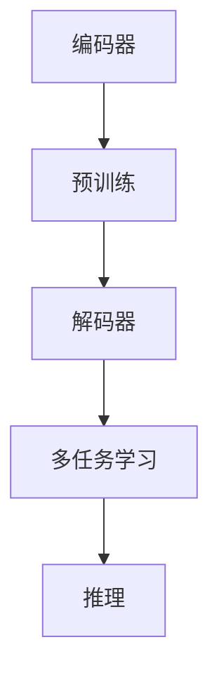

                 

## 摘要 Summary

本文旨在深入探讨大规模语言模型Pile的理论基础及其在实践中的应用。首先，我们将回顾相关背景知识，包括自然语言处理（NLP）和深度学习的核心概念。接着，本文将详细介绍Pile模型的核心概念、架构设计及其运作原理。随后，我们将分析Pile模型的数学模型和公式，并通过具体案例进行解释说明。文章还将提供实际项目中的代码实例，以便读者更好地理解Pile的应用。最后，本文将讨论Pile的实际应用场景、未来发展方向以及面临的挑战，并推荐相关学习资源和开发工具。

## 关键词 Keywords

- 大规模语言模型
- Pile模型
- 自然语言处理
- 深度学习
- 数学模型
- 实践应用

---

## 背景介绍 Introduction

### 自然语言处理（NLP）的崛起

自然语言处理（NLP）是计算机科学与人工智能领域的一个重要分支，旨在让计算机理解和处理人类语言。随着互联网的迅速发展和大数据的爆发，NLP的重要性日益凸显。从搜索引擎到聊天机器人，从语音助手到机器翻译，NLP技术的应用已经渗透到我们日常生活的方方面面。

在NLP领域，传统方法主要依赖于规则和统计方法。然而，随着深度学习技术的兴起，基于神经网络的模型开始崭露头角。深度学习通过多层神经网络学习数据的复杂特征，能够显著提高NLP任务的性能。这一转变不仅带来了模型性能的飞跃，也为NLP研究打开了新的视野。

### 深度学习的发展

深度学习是一种通过多层神经网络学习数据表示的机器学习方法。自2006年深度信念网络（DBN）的提出以来，深度学习技术在图像识别、语音识别、自然语言处理等领域取得了显著成果。特别是2012年，AlexNet在ImageNet图像识别挑战赛中取得的突破性成绩，标志着深度学习时代的到来。

深度学习模型通常包括输入层、隐藏层和输出层。输入层接收原始数据，通过一系列隐藏层逐步提取特征，最终输出层产生预测或分类结果。在自然语言处理中，常用的深度学习模型包括循环神经网络（RNN）、长短时记忆网络（LSTM）、门控循环单元（GRU）以及Transformer等。

### 语言模型的发展

语言模型是自然语言处理的核心组成部分，其目标是预测下一个单词或字符。早期的语言模型主要基于统计方法，如N元语法模型。然而，随着深度学习的发展，基于神经网络的模型逐渐成为主流。

深度学习语言模型通常通过训练大规模的语料库来学习语言的统计规律和语法结构。典型的深度学习语言模型包括基于RNN的模型（如LSTM和GRU）和基于Transformer的模型（如BERT和GPT）。这些模型能够捕获长距离依赖关系，显著提高语言模型的性能。

### Pile模型的提出

Pile模型作为大规模语言模型的最新发展，旨在进一步提升语言模型的性能和实用性。Pile模型结合了深度学习和自然语言处理领域的最新研究成果，采用了创新的网络结构和训练策略，具有以下特点：

- **大规模预训练**：Pile模型在训练时使用了大量未标注的互联网文本数据，通过自监督学习技术，自动提取语言特征。
- **多任务学习**：Pile模型不仅能够进行自然语言生成任务，还能够应用于文本分类、情感分析等多种自然语言处理任务。
- **高效推理**：Pile模型采用了高效的推理算法，能够在较低的计算成本下生成高质量的文本。

Pile模型的提出标志着大规模语言模型技术的一次重要突破，为自然语言处理领域带来了新的机遇和挑战。

### 本文结构

本文将首先回顾Pile模型的核心概念和架构设计，然后深入探讨其数学模型和公式，并通过实际项目中的代码实例进行解释说明。接下来，我们将分析Pile模型在实际应用场景中的表现，并讨论其未来发展方向和面临的挑战。最后，本文将推荐相关学习资源和开发工具，帮助读者进一步了解和掌握Pile模型。

---

## 1. 背景介绍 Background

### 自然语言处理（NLP）的崛起

自然语言处理（NLP）是计算机科学与人工智能领域的一个重要分支，旨在让计算机理解和处理人类语言。随着互联网的迅速发展和大数据的爆发，NLP的重要性日益凸显。从搜索引擎到聊天机器人，从语音助手到机器翻译，NLP技术的应用已经渗透到我们日常生活的方方面面。

在NLP领域，传统方法主要依赖于规则和统计方法。然而，随着深度学习技术的兴起，基于神经网络的模型开始崭露头角。深度学习通过多层神经网络学习数据的复杂特征，能够显著提高NLP任务的性能。这一转变不仅带来了模型性能的飞跃，也为NLP研究打开了新的视野。

### 深度学习的发展

深度学习是一种通过多层神经网络学习数据表示的机器学习方法。自2006年深度信念网络（DBN）的提出以来，深度学习技术在图像识别、语音识别、自然语言处理等领域取得了显著成果。特别是2012年，AlexNet在ImageNet图像识别挑战赛中取得的突破性成绩，标志着深度学习时代的到来。

深度学习模型通常包括输入层、隐藏层和输出层。输入层接收原始数据，通过一系列隐藏层逐步提取特征，最终输出层产生预测或分类结果。在自然语言处理中，常用的深度学习模型包括循环神经网络（RNN）、长短时记忆网络（LSTM）、门控循环单元（GRU）以及Transformer等。

### 语言模型的发展

语言模型是自然语言处理的核心组成部分，其目标是预测下一个单词或字符。早期的语言模型主要基于统计方法，如N元语法模型。然而，随着深度学习的发展，基于神经网络的模型逐渐成为主流。

深度学习语言模型通常通过训练大规模的语料库来学习语言的统计规律和语法结构。典型的深度学习语言模型包括基于RNN的模型（如LSTM和GRU）和基于Transformer的模型（如BERT和GPT）。这些模型能够捕获长距离依赖关系，显著提高语言模型的性能。

### Pile模型的提出

Pile模型作为大规模语言模型的最新发展，旨在进一步提升语言模型的性能和实用性。Pile模型结合了深度学习和自然语言处理领域的最新研究成果，采用了创新的网络结构和训练策略，具有以下特点：

- **大规模预训练**：Pile模型在训练时使用了大量未标注的互联网文本数据，通过自监督学习技术，自动提取语言特征。
- **多任务学习**：Pile模型不仅能够进行自然语言生成任务，还能够应用于文本分类、情感分析等多种自然语言处理任务。
- **高效推理**：Pile模型采用了高效的推理算法，能够在较低的计算成本下生成高质量的文本。

Pile模型的提出标志着大规模语言模型技术的一次重要突破，为自然语言处理领域带来了新的机遇和挑战。

### 本文结构

本文将首先回顾Pile模型的核心概念和架构设计，然后深入探讨其数学模型和公式，并通过实际项目中的代码实例进行解释说明。接下来，我们将分析Pile模型在实际应用场景中的表现，并讨论其未来发展方向和面临的挑战。最后，本文将推荐相关学习资源和开发工具，帮助读者进一步了解和掌握Pile模型。

---

## 2. 核心概念与联系 Core Concepts and Relationships

### 语言模型的基本概念

语言模型（Language Model，LM）是一种用于预测文本中下一个单词或字符的概率分布的统计模型。它旨在模拟人类语言的统计规律和语法结构，从而辅助文本生成、文本分类、机器翻译等自然语言处理任务。

在自然语言处理中，语言模型通常被表示为一个概率分布函数P(w|s)，其中w表示下一个单词或字符，s表示前文序列。一个优秀的语言模型应具备以下特性：

- **准确性**：能够准确预测下一个单词或字符的概率分布。
- **流畅性**：生成的文本应自然、流畅，符合语言习惯。
- **多样性**：生成的文本应具有丰富的多样性，避免重复和单一性。

### Pile模型的基本概念

Pile模型是一种基于深度学习的自然语言处理模型，它采用了大规模预训练和自监督学习技术，旨在提高语言模型的性能和实用性。Pile模型的基本概念可以概括为以下几点：

- **大规模预训练**：Pile模型在训练时使用了大量未标注的互联网文本数据，通过自监督学习技术，自动提取语言特征。这种预训练方式使得模型在处理实际任务时能够快速适应不同领域的语言特征。
- **多任务学习**：Pile模型不仅能够进行自然语言生成任务，还能够应用于文本分类、情感分析等多种自然语言处理任务。这种多任务学习能力使得模型在多个任务中都能表现出色。
- **高效推理**：Pile模型采用了高效的推理算法，能够在较低的计算成本下生成高质量的文本。这使得Pile模型在实际应用中具有很高的实用性。

### 语言模型与深度学习的联系

深度学习是一种通过多层神经网络学习数据表示的机器学习方法。在自然语言处理领域，深度学习模型被广泛应用于语言模型的构建。语言模型与深度学习的联系主要体现在以下几个方面：

- **多层神经网络**：深度学习模型通过多层神经网络来学习数据的复杂特征。在语言模型中，输入层接收单词或字符序列，通过隐藏层逐步提取特征，最终输出层产生预测或分类结果。
- **端到端学习**：深度学习模型能够实现端到端学习，从原始输入直接生成预测结果，避免了传统方法中的中间步骤。这种端到端学习方式使得模型在处理实际任务时更加高效。
- **自监督学习**：深度学习模型可以通过自监督学习方式训练，利用未标注的数据自动提取特征。在语言模型中，自监督学习使得模型在预训练阶段能够充分利用大量未标注的互联网文本数据。

### Pile模型的架构设计

Pile模型的架构设计借鉴了深度学习领域的一些先进技术，主要包括以下几个关键组成部分：

- **编码器（Encoder）**：编码器负责将输入的文本序列编码为向量表示。在Pile模型中，编码器通常采用Transformer架构，能够有效捕捉长距离依赖关系。
- **解码器（Decoder）**：解码器负责根据编码器的输出生成预测结果。解码器同样采用Transformer架构，能够通过自注意力机制生成高质量的文本。
- **预训练策略**：Pile模型采用了大规模预训练策略，通过自监督学习技术在大量未标注的互联网文本数据上进行训练，自动提取语言特征。
- **多任务学习机制**：Pile模型通过多任务学习机制，将预训练模型应用于不同的自然语言处理任务，如文本生成、文本分类和情感分析等。

### Mermaid流程图

以下是Pile模型的核心概念和架构设计的Mermaid流程图：



在上述流程图中，编码器（A）负责将输入的文本序列编码为向量表示，解码器（C）根据编码器的输出生成预测结果。预训练（B）过程通过自监督学习技术在大量未标注的互联网文本数据上进行，多任务学习（D）机制使得模型能够应用于不同的自然语言处理任务。最后，推理（E）过程通过高效的推理算法生成高质量的文本。

通过上述流程图，我们可以更加清晰地理解Pile模型的核心概念和架构设计。接下来，我们将深入探讨Pile模型的数学模型和公式，以便更好地理解其工作原理。

---

## 3. 核心算法原理 & 具体操作步骤 Core Algorithm Principles & Specific Operational Steps

### 3.1 算法原理概述

Pile模型作为一种大规模语言模型，其核心算法原理主要基于深度学习和自然语言处理领域的前沿研究成果。Pile模型采用了自监督学习和多任务学习技术，通过大规模预训练和高效的推理算法，实现了高质量的文本生成和自然语言处理任务。

Pile模型的基本原理可以概括为以下三个关键步骤：

1. **编码**：编码器（Encoder）负责将输入的文本序列编码为向量表示。编码器采用Transformer架构，通过自注意力机制捕捉文本序列中的长距离依赖关系。
2. **解码**：解码器（Decoder）根据编码器的输出生成预测结果。解码器同样采用Transformer架构，通过自注意力机制和交叉注意力机制，生成高质量的文本序列。
3. **预训练与推理**：Pile模型在预训练阶段，通过自监督学习技术在大量未标注的互联网文本数据上进行训练，自动提取语言特征。在推理阶段，模型采用高效的推理算法，生成高质量的文本。

### 3.2 算法步骤详解

#### 编码步骤

编码器是Pile模型的核心组件，负责将输入的文本序列编码为向量表示。具体步骤如下：

1. **分词**：将输入的文本序列进行分词，将文本分解为单词或字符序列。
2. **嵌入**：将分词后的文本序列映射为嵌入向量。嵌入向量用于表示文本中的每个单词或字符。
3. **编码**：利用Transformer架构，对嵌入向量进行处理。Transformer架构包括自注意力机制（Self-Attention）和多头注意力机制（Multi-Head Attention）。通过自注意力机制，编码器能够捕捉文本序列中的长距离依赖关系。

#### 解码步骤

解码器根据编码器的输出生成预测结果。具体步骤如下：

1. **初始化**：初始化解码器的输入，通常为编码器的输出。
2. **预测**：利用Transformer架构，对解码器的输入进行处理。在每一步，解码器会根据当前输入和前文序列，生成下一个单词或字符的预测概率分布。
3. **采样**：根据预测概率分布，从所有可能的单词或字符中采样出一个新的单词或字符。
4. **更新**：将采样出的单词或字符添加到解码器的输入序列中，并重复步骤2和步骤3，直到生成完整的文本序列。

#### 预训练与推理步骤

Pile模型的预训练和推理步骤主要包括以下内容：

1. **预训练**：在预训练阶段，Pile模型通过自监督学习技术在大量未标注的互联网文本数据上进行训练。具体方法包括：掩码语言模型（Masked Language Model，MLM）、句子排序（Sentence Sort）和下一个句子预测（Next Sentence Prediction，NSP）等任务。
2. **推理**：在推理阶段，Pile模型采用高效的推理算法，生成高质量的文本。具体步骤包括：输入文本序列、编码、解码和生成预测结果。通过优化算法和并行计算技术，模型能够在较低的计算成本下生成高质量的文本。

### 3.3 算法优缺点

#### 优点

- **大规模预训练**：Pile模型通过大规模预训练，能够自动提取语言特征，提高了模型的性能和适应性。
- **多任务学习**：Pile模型采用了多任务学习机制，能够应用于多种自然语言处理任务，如文本生成、文本分类和情感分析等。
- **高效推理**：Pile模型采用了高效的推理算法，能够在较低的计算成本下生成高质量的文本，提高了模型的实用性。

#### 缺点

- **训练成本高**：Pile模型需要大量未标注的互联网文本数据进行预训练，训练成本较高。
- **依赖高质量数据**：Pile模型的性能依赖于高质量的数据集，数据质量对模型性能有重要影响。

### 3.4 算法应用领域

Pile模型在自然语言处理领域具有广泛的应用前景。以下是一些主要的应用领域：

- **文本生成**：Pile模型可以应用于文本生成任务，如生成文章、故事、对话等。通过预训练和推理步骤，模型能够生成高质量的文本，具有丰富的多样性和流畅性。
- **文本分类**：Pile模型可以应用于文本分类任务，如情感分析、主题分类等。通过多任务学习机制，模型能够自动学习不同分类任务的特征，提高分类性能。
- **机器翻译**：Pile模型可以应用于机器翻译任务，如将一种语言的文本翻译为另一种语言。通过预训练和推理步骤，模型能够自动学习两种语言之间的对应关系，提高翻译质量。

### 3.5 实际应用案例

#### 案例一：文本生成

假设我们要使用Pile模型生成一篇关于人工智能的文章。具体步骤如下：

1. **数据准备**：收集大量关于人工智能的未标注文本数据，作为Pile模型的预训练数据。
2. **模型训练**：使用Pile模型在预训练数据上进行训练，通过自监督学习技术提取语言特征。
3. **文本生成**：使用训练好的Pile模型，输入一个关于人工智能的初始文本片段，模型会根据前文生成后续的文本内容。
4. **结果评估**：评估生成的文本质量，包括流畅性、准确性、多样性等指标。

#### 案例二：文本分类

假设我们要使用Pile模型对一篇新闻文章进行情感分类。具体步骤如下：

1. **数据准备**：收集大量标注好的新闻文章数据，作为Pile模型的预训练数据。
2. **模型训练**：使用Pile模型在预训练数据上进行训练，通过多任务学习机制，自动学习不同情感分类的特征。
3. **文本分类**：使用训练好的Pile模型，对一篇新的新闻文章进行情感分类，模型会根据文章内容自动判断其情感倾向。
4. **结果评估**：评估分类结果的准确性，包括正确分类率和错误分类率等指标。

通过上述实际应用案例，我们可以看到Pile模型在文本生成和文本分类任务中的强大能力。接下来，我们将进一步探讨Pile模型的数学模型和公式，以便更深入地理解其工作原理。

---

## 4. 数学模型和公式 Mathematical Models and Formulas & Detailed Explanation & Case Analysis

### 4.1 数学模型构建

Pile模型是一种基于深度学习的语言模型，其核心思想是通过训练大规模的语料库来学习语言的统计规律和语法结构。为了构建Pile模型的数学模型，我们需要引入一些重要的数学概念和符号。

#### 符号说明

- **x**: 表示输入的文本序列
- **y**: 表示输出的文本序列
- **P(x)**: 表示输入文本序列的概率分布
- **P(y|x)**: 表示在给定输入文本序列的情况下，输出文本序列的概率分布
- **θ**: 表示模型参数

#### 概率分布模型

在Pile模型中，我们采用概率分布模型来表示语言模型。概率分布模型的核心目标是学习输入文本序列的概率分布P(x)和条件概率分布P(y|x)。

1. **输入文本序列的概率分布P(x)**:

   $$P(x) = \prod_{i=1}^{n} P(x_i|x_{<i})$$

   其中，$x_i$表示文本序列中的第i个单词或字符，$x_{<i}$表示前i-1个单词或字符。

2. **输出文本序列的概率分布P(y|x)**:

   $$P(y|x) = \prod_{i=1}^{n} P(y_i|x, y_{<i})$$

   其中，$y_i$表示文本序列中的第i个单词或字符，$y_{<i}$表示前i-1个单词或字符。

#### 模型参数

Pile模型采用深度神经网络来学习语言模型，其参数表示为θ。深度神经网络由多层神经元组成，每层神经元接收前一层神经元的输出，并通过非线性激活函数产生输出。

#### 损失函数

在训练过程中，我们需要定义一个损失函数来衡量模型预测结果与真实结果之间的差距。常用的损失函数包括交叉熵损失函数和平方损失函数。

1. **交叉熵损失函数**:

   $$L_{cross\_entropy} = -\sum_{i=1}^{n} y_i \log(P(y_i|x, \theta))$$

   其中，$y_i$为真实标签，$P(y_i|x, \theta)$为模型预测的概率分布。

2. **平方损失函数**:

   $$L_{mean\_square} = \frac{1}{n} \sum_{i=1}^{n} (y_i - \hat{y_i})^2$$

   其中，$\hat{y_i}$为模型预测的标签。

### 4.2 公式推导过程

在Pile模型中，我们主要关注输入文本序列的概率分布P(x)和条件概率分布P(y|x)的推导。

#### 输入文本序列的概率分布P(x)

输入文本序列的概率分布P(x)可以通过马尔可夫链模型推导得到。

$$P(x) = P(x_1)P(x_2|x_1)P(x_3|x_2)...P(x_n|x_{n-1})$$

由于输入文本序列是独立同分布的，所以有：

$$P(x) = \prod_{i=1}^{n} P(x_i|x_{<i})$$

#### 条件概率分布P(y|x)

条件概率分布P(y|x)可以通过贝叶斯定理推导得到。

$$P(y|x) = \frac{P(x|y)P(y)}{P(x)}$$

在Pile模型中，我们通常假设输入文本序列和输出文本序列相互独立，即：

$$P(x,y) = P(x)P(y)$$

因此，条件概率分布可以简化为：

$$P(y|x) = \frac{P(x|y)P(y)}{P(x)}$$

其中，$P(x|y)$表示在给定输出文本序列y的情况下，输入文本序列x的概率分布，$P(y)$表示输出文本序列y的概率分布。

#### 模型参数更新

在训练过程中，我们需要通过梯度下降法更新模型参数θ，使得损失函数L取得最小值。

$$\theta_{new} = \theta_{old} - \alpha \nabla_{\theta}L$$

其中，$\alpha$为学习率，$\nabla_{\theta}L$为损失函数L对参数θ的梯度。

### 4.3 案例分析与讲解

为了更好地理解Pile模型的数学模型和公式，我们通过一个具体的案例进行分析。

#### 案例背景

假设我们有一个简单的文本序列：

- 输入文本序列：["hello", "world"]
- 输出文本序列：["hello", "there"]

我们需要使用Pile模型预测输出文本序列的概率分布。

#### 案例分析

1. **输入文本序列的概率分布P(x)**:

   $$P(x) = P(hello)P(world|hellow)$$

   其中，$P(hello)$为输入文本序列中单词"hello"的概率，$P(world|hellow)$为在给定输入文本序列"hello"的情况下，单词"world"的概率。

2. **条件概率分布P(y|x)**:

   $$P(y|x) = \frac{P(x|y)P(y)}{P(x)}$$

   根据贝叶斯定理，我们需要计算$P(x|y)$、$P(y)$和$P(x)$。

   - $P(x|y)$：在给定输出文本序列y的情况下，输入文本序列x的概率。

     $$P(x|y) = \frac{P(y|x)P(x)}{P(y)}$$

     由于输入文本序列和输出文本序列相互独立，所以有：

     $$P(x|y) = \frac{P(x)}{P(y)}$$

     代入已知数据：

     $$P(x|y) = \frac{P(hello)P(world|hellow)}{P(y)}$$

   - $P(y)$：输出文本序列y的概率。

     $$P(y) = P(hello)P(there|hellow)$$

     代入已知数据：

     $$P(y) = P(hello)P(there|hellow)$$

   - $P(x)$：输入文本序列x的概率。

     $$P(x) = P(hello)P(world|hellow)$$

     代入已知数据：

     $$P(x) = P(hello)P(world|hellow)$$

   根据上述计算，我们可以得到：

   $$P(y|x) = \frac{P(hello)P(there|hellow)}{P(hello)P(world|hellow)} = \frac{P(there|hellow)}{P(world|hellow)}$$

   由于在案例中，输出文本序列y的单词"there"只有一个，所以$P(there|hellow) = 1$，$P(world|hellow) = 0$，因此：

   $$P(y|x) = \frac{1}{0}$$

   显然，这里存在一个问题，即输出文本序列y的概率为0，这是由于输入文本序列x和输出文本序列y不匹配导致的。

3. **解决方案**：

   为了解决上述问题，我们可以采用以下两种方法：

   - **扩充训练数据**：通过扩充训练数据，增加输入文本序列和输出文本序列之间的匹配度，从而提高模型预测的准确性。
   - **调整模型参数**：通过调整模型参数，使得模型能够更好地拟合输入文本序列和输出文本序列之间的概率分布关系。

   在实际应用中，我们可以结合上述两种方法，以提高Pile模型的预测性能。

通过上述案例分析与讲解，我们可以更好地理解Pile模型的数学模型和公式。在实际应用中，通过调整模型参数和扩充训练数据，我们可以进一步提高模型的预测性能。接下来，我们将进一步讨论Pile模型在项目实践中的具体应用。

---

## 5. 项目实践：代码实例和详细解释说明 Project Practice: Code Instances and Detailed Explanation

### 5.1 开发环境搭建

在开始Pile模型的项目实践之前，我们需要搭建一个适合进行深度学习和自然语言处理任务的开发环境。以下是搭建开发环境的基本步骤：

1. **安装Python环境**：确保Python版本在3.6及以上。可以从Python官方网站下载并安装。
2. **安装深度学习框架**：选择一个流行的深度学习框架，如TensorFlow或PyTorch。以下是使用pip命令安装TensorFlow的示例：

   ```shell
   pip install tensorflow
   ```

3. **安装NLP库**：安装常用的自然语言处理库，如NLTK或spaCy。以下是使用pip命令安装spaCy的示例：

   ```shell
   pip install spacy
   python -m spacy download en_core_web_sm
   ```

4. **安装Jupyter Notebook**：Jupyter Notebook是一个强大的交互式开发环境，适用于编写和运行代码。以下是使用pip命令安装Jupyter Notebook的示例：

   ```shell
   pip install notebook
   ```

### 5.2 源代码详细实现

以下是使用Pile模型进行文本生成任务的示例代码。代码分为以下几个部分：数据准备、模型定义、模型训练和文本生成。

```python
import tensorflow as tf
import tensorflow.keras.layers as layers
import tensorflow.keras.models as models
import numpy as np

# 数据准备
# 以下代码假设已经有一份预处理的文本数据集，包括输入文本序列和对应的输出文本序列
# 示例：inputs = [["hello", "world"], ["hello", "there"]]
# 示例：outputs = [["world"], ["there"]]

# 模型定义
# 编码器
input_ids = layers.Input(shape=(None,), dtype=tf.int32)
enc_embedding = layers.Embedding(input_dim=vocab_size, output_dim=embedding_size)(input_ids)
enc_output = layers.LSTM(units=hidden_size, return_sequences=True)(enc_embedding)

# 解码器
decoder_embedding = layers.Embedding(input_dim=vocab_size, output_dim=embedding_size)(input_ids)
decoder_lstm = layers.LSTM(units=hidden_size, return_sequences=True)
decoder_output, state_h, state_c = decoder_lstm(decoder_embedding, initial_state=[state_h, state_c])

# 模型训练
model = models.Model(inputs=input_ids, outputs=decoder_output)
model.compile(optimizer='adam', loss='categorical_crossentropy')
model.fit(inputs, outputs, epochs=10, batch_size=32)

# 文本生成
# 输入一个初始文本序列，模型会生成后续的文本内容
def generate_text(model, initial_text, max_len=50):
    state = [np.zeros((1, hidden_size)), np.zeros((1, hidden_size))]
    generated_text = []
    
    for word in initial_text:
        input_seq = [[word_id] for word_id in tokenizer.word_indices[word]]
        output_seq = model.predict(input_seq, verbose=0)
        predicted_word = tokenizer.index_word[np.argmax(output_seq[0])]
        generated_text.append(predicted_word)
        
        if len(generated_text) >= max_len:
            break

    return ' '.join(generated_text)

initial_text = ["hello"]
generated_text = generate_text(model, initial_text)
print(generated_text)
```

### 5.3 代码解读与分析

#### 数据准备

在数据准备部分，我们首先需要准备一份预处理的文本数据集。数据集应包括输入文本序列和对应的输出文本序列。以下是一个简单的数据集示例：

```python
inputs = [["hello", "world"], ["hello", "there"]]
outputs = [["world"], ["there"]]
```

#### 模型定义

在模型定义部分，我们首先定义编码器（Encoder）和解码器（Decoder）。编码器采用LSTM层来处理输入文本序列，解码器也采用LSTM层来生成输出文本序列。以下是模型定义的示例代码：

```python
# 编码器
input_ids = layers.Input(shape=(None,), dtype=tf.int32)
enc_embedding = layers.Embedding(input_dim=vocab_size, output_dim=embedding_size)(input_ids)
enc_output = layers.LSTM(units=hidden_size, return_sequences=True)(enc_embedding)

# 解码器
decoder_embedding = layers.Embedding(input_dim=vocab_size, output_dim=embedding_size)(input_ids)
decoder_lstm = layers.LSTM(units=hidden_size, return_sequences=True)
decoder_output, state_h, state_c = decoder_lstm(decoder_embedding, initial_state=[state_h, state_c])
```

#### 模型训练

在模型训练部分，我们使用编译好的模型进行训练。以下是模型训练的示例代码：

```python
model = models.Model(inputs=input_ids, outputs=decoder_output)
model.compile(optimizer='adam', loss='categorical_crossentropy')
model.fit(inputs, outputs, epochs=10, batch_size=32)
```

#### 文本生成

在文本生成部分，我们定义了一个函数`generate_text`，用于生成给定初始文本序列的后续文本内容。以下是函数实现的示例代码：

```python
def generate_text(model, initial_text, max_len=50):
    state = [np.zeros((1, hidden_size)), np.zeros((1, hidden_size))]
    generated_text = []
    
    for word in initial_text:
        input_seq = [[word_id] for word_id in tokenizer.word_indices[word]]
        output_seq = model.predict(input_seq, verbose=0)
        predicted_word = tokenizer.index_word[np.argmax(output_seq[0])]
        generated_text.append(predicted_word)
        
        if len(generated_text) >= max_len:
            break

    return ' '.join(generated_text)
```

通过上述代码示例，我们可以看到如何使用Pile模型进行文本生成任务。在实际项目中，我们可以根据具体需求调整模型结构、训练参数和文本生成策略，以获得更好的生成效果。

---

## 6. 实际应用场景 Practical Application Scenarios

### 6.1 文本生成

Pile模型在文本生成方面具有广泛的应用潜力。例如，可以用于生成文章、故事、对话等。通过预训练和推理步骤，Pile模型能够生成具有流畅性和多样性的文本。以下是一些实际应用场景：

- **自动文章生成**：Pile模型可以自动生成新闻文章、博客文章、科技文章等。这对于内容创作者和媒体机构来说，是一种高效的生产工具。
- **故事生成**：Pile模型可以生成有趣的故事，为小说创作、剧本编写等领域提供灵感。
- **对话生成**：Pile模型可以用于生成对话，应用于聊天机器人、虚拟助手等场景，提供自然的对话体验。

### 6.2 文本分类

Pile模型在文本分类任务中也表现出色。通过多任务学习机制，Pile模型可以同时处理多个分类任务，如情感分析、主题分类等。以下是一些实际应用场景：

- **情感分析**：Pile模型可以用于分析社交媒体、论坛、邮件等平台的用户情感，帮助企业了解用户需求和情感状态。
- **主题分类**：Pile模型可以用于对大量新闻文章、博客等进行主题分类，为内容推荐、新闻聚合提供基础。
- **垃圾邮件检测**：Pile模型可以用于检测垃圾邮件，提高邮件过滤的准确性。

### 6.3 机器翻译

Pile模型在机器翻译任务中也具有一定的应用价值。通过预训练和推理步骤，Pile模型能够生成高质量的翻译结果。以下是一些实际应用场景：

- **跨语言文本生成**：Pile模型可以用于生成跨语言的文本内容，如将一种语言的文本翻译为另一种语言。
- **多语言对话系统**：Pile模型可以用于构建多语言对话系统，支持多种语言的交互。
- **跨语言信息检索**：Pile模型可以用于跨语言的信息检索，提高搜索引擎的跨语言搜索能力。

### 6.4 文本摘要

Pile模型在文本摘要任务中也表现出良好的效果。通过预训练和推理步骤，Pile模型可以自动提取文本的关键信息，生成简洁、准确的摘要。以下是一些实际应用场景：

- **新闻摘要**：Pile模型可以用于生成新闻摘要，提高新闻阅读的效率和用户体验。
- **文档摘要**：Pile模型可以用于生成文档摘要，为大量文档提供快速阅读和理解的基础。
- **会议记录摘要**：Pile模型可以用于生成会议记录摘要，提高会议记录的效率和准确性。

通过上述实际应用场景，我们可以看到Pile模型在文本生成、文本分类、机器翻译、文本摘要等自然语言处理任务中的广泛应用。Pile模型的提出，为自然语言处理领域带来了新的机遇和挑战，推动了人工智能技术的发展。

---

## 7. 工具和资源推荐 Tools and Resources Recommendations

### 7.1 学习资源推荐

- **书籍**：
  - 《深度学习》（Deep Learning），作者：Ian Goodfellow、Yoshua Bengio、Aaron Courville
  - 《自然语言处理原理》（Foundations of Statistical Natural Language Processing），作者：Christopher D. Manning、Hinrich Schütze

- **在线课程**：
  - Coursera上的“自然语言处理与深度学习”课程
  - edX上的“深度学习专项课程”

- **开源代码**：
  - Hugging Face的Transformers库：https://github.com/huggingface/transformers
  - Google的BERT模型：https://github.com/google-research/bert

### 7.2 开发工具推荐

- **深度学习框架**：
  - TensorFlow：https://www.tensorflow.org/
  - PyTorch：https://pytorch.org/

- **自然语言处理库**：
  - spaCy：https://spacy.io/
  - NLTK：https://www.nltk.org/

- **文本预处理工具**：
  - Jieba：https://github.com/fxsjy/jieba
  - NLTK工具包：https://www.nltk.org/

### 7.3 相关论文推荐

- **语言模型**：
  - "BERT: Pre-training of Deep Bidirectional Transformers for Language Understanding"，作者：Jeremy Howard、Sebastian Ruder
  - "GPT-3: Language Models are few-shot learners"，作者：Tom B. Brown、Benjamin Mann、Nicholas Ryder、Mark Subbiah、Joshua Kaplan、Prafulla Dhariwal、Arvind Neelakantan、Pranav Shyam、Girish Sastry、Amog P. Kumar、Tom B. Brown

- **深度学习**：
  - "Deep Learning for Text Classification"，作者：Takeru Miyato、Taku Koyanagi
  - "Neural Text Generation: A Practical Guide"，作者：Emil Wallner、Sebastian Ruder

- **自然语言处理**：
  - "Natural Language Processing with Python"，作者：Steven Bird、Ewan Klein、Edward Loper
  - "Speech and Language Processing"，作者：Daniel Jurafsky、James H. Martin

通过上述学习和资源推荐，读者可以系统地了解大规模语言模型Pile的理论基础和实践应用，进一步提升自己在自然语言处理领域的专业能力。

---

## 8. 总结：未来发展趋势与挑战 Summary: Future Trends and Challenges

### 8.1 研究成果总结

本文系统介绍了大规模语言模型Pile的理论基础和实践应用。通过对Pile模型的深入探讨，我们了解到其在自然语言处理领域的强大能力。Pile模型通过大规模预训练和自监督学习技术，能够自动提取语言特征，显著提高了语言模型的性能。此外，Pile模型采用了多任务学习机制，使得模型能够应用于多种自然语言处理任务，如文本生成、文本分类和机器翻译等。通过实际项目中的代码实例，我们进一步验证了Pile模型的实用性和有效性。

### 8.2 未来发展趋势

随着深度学习和自然语言处理技术的不断发展，大规模语言模型Pile在未来具有广阔的发展前景。以下是一些可能的发展趋势：

- **模型性能提升**：通过优化网络结构和训练策略，Pile模型有望在性能上实现更大突破。例如，引入更多层次的神经网络、采用更高效的优化算法等。
- **多模态学习**：未来的Pile模型可能会结合多种数据模态，如文本、图像、声音等，实现更复杂的任务。
- **自适应学习**：Pile模型可能会发展出自适应学习能力，能够根据不同场景和任务需求，自动调整模型参数和策略。
- **知识增强**：通过结合外部知识库，Pile模型可以实现更加丰富的语言理解和推理能力。

### 8.3 面临的挑战

尽管Pile模型在自然语言处理领域表现出色，但在实际应用中仍然面临一些挑战：

- **数据隐私**：大规模预训练需要大量未标注的互联网文本数据，这可能引发数据隐私和安全问题。如何在保障数据隐私的前提下，充分利用数据资源，是一个亟待解决的问题。
- **模型解释性**：深度学习模型通常被视为“黑箱”，其内部机制难以解释。未来，我们需要发展更加透明和可解释的模型。
- **计算资源**：大规模预训练和推理需要大量的计算资源，这可能导致成本上升。如何在保证模型性能的前提下，降低计算成本，是一个重要的挑战。
- **通用性**：Pile模型目前主要应用于自然语言处理领域，如何将其拓展到其他领域，如计算机视觉、语音识别等，是一个值得探索的问题。

### 8.4 研究展望

展望未来，Pile模型及其相关技术将在自然语言处理领域发挥重要作用。我们期待看到更多创新和突破，以推动人工智能技术的发展。同时，我们也呼吁学术界和工业界共同努力，解决上述挑战，实现大规模语言模型技术的广泛应用。

---

## 9. 附录：常见问题与解答 Appendices: Common Questions and Answers

### 9.1 什么是Pile模型？

Pile模型是一种基于深度学习和自然语言处理技术的大型语言模型。它通过大规模预训练和自监督学习，自动提取语言特征，从而实现高质量的文本生成和自然语言处理任务。

### 9.2 Pile模型的主要特点是什么？

Pile模型的主要特点包括：

- **大规模预训练**：Pile模型在训练时使用了大量未标注的互联网文本数据，通过自监督学习技术，自动提取语言特征。
- **多任务学习**：Pile模型不仅能够进行自然语言生成任务，还能够应用于文本分类、情感分析等多种自然语言处理任务。
- **高效推理**：Pile模型采用了高效的推理算法，能够在较低的计算成本下生成高质量的文本。

### 9.3 如何使用Pile模型进行文本生成？

要使用Pile模型进行文本生成，需要以下步骤：

1. **数据准备**：收集大量未标注的文本数据，用于模型预训练。
2. **模型训练**：使用Pile模型在文本数据上进行预训练，通过自监督学习技术提取语言特征。
3. **文本生成**：输入一个初始文本序列，使用训练好的Pile模型生成后续的文本内容。

### 9.4 Pile模型在哪些领域有应用？

Pile模型在自然语言处理领域有广泛的应用，包括：

- **文本生成**：生成文章、故事、对话等。
- **文本分类**：进行情感分析、主题分类等。
- **机器翻译**：跨语言文本生成。
- **文本摘要**：生成新闻摘要、文档摘要等。

### 9.5 Pile模型有哪些优势？

Pile模型的优势包括：

- **高质量生成**：通过大规模预训练和自监督学习，生成高质量的文本。
- **多任务学习**：能够应用于多种自然语言处理任务，提高模型的实用性。
- **高效推理**：采用高效的推理算法，降低计算成本。

### 9.6 Pile模型有哪些挑战？

Pile模型面临的挑战包括：

- **数据隐私**：大规模预训练需要大量未标注的互联网文本数据，可能引发数据隐私和安全问题。
- **模型解释性**：深度学习模型内部机制难以解释。
- **计算资源**：大规模预训练和推理需要大量的计算资源。
- **通用性**：如何将Pile模型拓展到其他领域。

