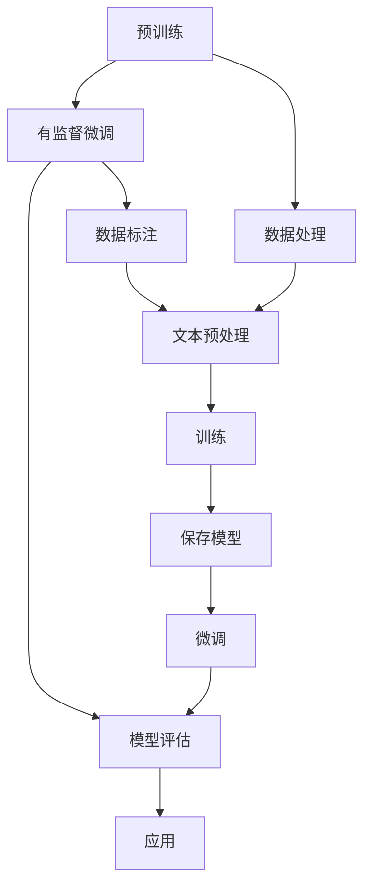

                 

### 1. 背景介绍

大规模语言模型（Large-scale Language Models）是自然语言处理（Natural Language Processing，NLP）领域的一项革命性技术。随着互联网和大数据的迅猛发展，海量的文本数据逐渐成为现代社会的重要资源。如何有效地处理和利用这些数据，成为了当前研究的热点。大规模语言模型应运而生，通过对海量数据进行训练，实现了对自然语言的高度理解和生成能力。

大规模语言模型的发展可以追溯到20世纪80年代的统计语言模型。早期的统计语言模型主要依赖于语言中的统计规律，如N元语法（N-gram）模型。然而，随着数据规模的扩大和计算能力的提升，统计语言模型逐渐暴露出一些不足之处。例如，它们在处理长距离依赖关系和语义理解方面存在困难。为了解决这些问题，研究人员开始探索更加复杂和强大的模型。

2018年，OpenAI推出了GPT（Generative Pre-trained Transformer），这是第一个大规模语言模型。GPT基于Transformer架构，采用了预训练和微调的策略，极大地提升了语言模型的性能。随后，Google的BERT（Bidirectional Encoder Representations from Transformers）、Facebook的GPT-2、GPT-3等一系列大规模语言模型相继推出，不断刷新着语言模型的能力极限。

当前，大规模语言模型已经成为NLP领域的核心技术，广泛应用于机器翻译、文本生成、情感分析、问答系统、推荐系统等多个领域。本文将深入探讨大规模语言模型的原理、算法、数学模型以及实际应用，帮助读者全面了解这一前沿技术。

### 2. 核心概念与联系

#### 2.1 预训练（Pre-training）

预训练是大规模语言模型的核心概念之一。预训练的目标是通过在大规模文本数据上预先训练模型，使其具备对自然语言的普遍理解和处理能力。预训练通常分为两个阶段：无监督预训练和有监督微调。

无监督预训练是指在没有任何标注数据的情况下，模型直接从原始文本数据中学习语言模式。这个过程类似于人类儿童在学习语言时的过程，通过大量的阅读和听力，逐渐理解语言的规律和结构。预训练模型通常采用自回归语言模型（Autoregressive Language Model）或序列到序列模型（Sequence-to-Sequence Model）进行训练。

有监督微调（Supervised Fine-tuning）是指在预训练的基础上，利用标注数据进行模型微调。微调的过程类似于给模型“戴眼镜”，使其更加专注于特定任务。通过微调，模型可以更好地适应特定领域的语言特点，从而提高任务性能。

#### 2.2 Transformer架构（Transformer Architecture）

Transformer是大规模语言模型的主要架构之一，由Google在2017年提出。与传统的循环神经网络（Recurrent Neural Network，RNN）相比，Transformer在处理长序列时表现出色，解决了RNN在长距离依赖关系上的困难。

Transformer的核心是多头自注意力机制（Multi-head Self-Attention）。自注意力机制允许模型在处理一个序列时，根据序列中每个元素的重要性进行动态权重分配。这意味着模型可以自由地关注序列中的任意位置，而不受固定顺序的限制。

除了自注意力机制，Transformer还包括位置编码（Positional Encoding）和前馈神经网络（Feedforward Neural Network）。位置编码用于引入序列的位置信息，使得模型能够理解序列的顺序；前馈神经网络则用于对自注意力机制的输出进行进一步加工。

#### 2.3 语言模型（Language Model）

语言模型是NLP领域的基础模型，其目标是预测下一个单词或字符。在自然语言中，每个单词或字符的出现概率取决于其上下文。语言模型通过学习大量文本数据中的统计规律，预测下一个单词或字符的概率。

语言模型可以分为基于统计的方法和基于神经网络的方法。基于统计的方法，如N元语法（N-gram），通过计算单词或字符的前缀概率来预测下一个单词或字符。基于神经网络的方法，如循环神经网络（RNN）和Transformer，通过学习输入序列的特征和模式，生成下一个单词或字符。

#### 2.4 Mermaid 流程图

为了更直观地理解大规模语言模型的工作流程，我们可以使用Mermaid流程图进行描述。以下是大规模语言模型的 Mermaid 流程图：



在这个流程图中，A代表无监督预训练，B代表有监督微调，C代表模型评估，D代表应用，E代表数据处理，F代表数据标注，G代表文本预处理，H代表训练，I代表保存模型，J代表微调。通过这个流程图，我们可以清晰地看到大规模语言模型从预训练到应用的全过程。

### 3. 核心算法原理 & 具体操作步骤

#### 3.1 算法原理概述

大规模语言模型的算法原理主要基于预训练和微调两个阶段。

无监督预训练阶段，模型在大规模文本数据上学习语言模式，通过自回归语言模型或序列到序列模型生成文本序列。

有监督微调阶段，模型在特定任务的标注数据上进行微调，以适应特定任务的需求。

大规模语言模型的核心算法包括Transformer架构、自注意力机制、位置编码和前馈神经网络。

#### 3.2 算法步骤详解

##### 3.2.1 预训练

预训练阶段主要包括以下步骤：

1. 数据预处理：对原始文本数据进行清洗、分词、去停用词等处理，将其转换为模型可处理的格式。

2. 构建词汇表：将所有文本数据中的单词或字符映射到唯一的ID，构建词汇表。

3. 初始化模型：初始化Transformer模型，包括词嵌入层、自注意力层、前馈神经网络和输出层。

4. 预训练：使用自回归语言模型或序列到序列模型，对文本数据进行预训练。在自回归语言模型中，模型尝试预测下一个单词；在序列到序列模型中，模型尝试生成整个文本序列。

5. 保存模型：预训练完成后，保存模型参数，以便后续微调和使用。

##### 3.2.2 有监督微调

有监督微调阶段主要包括以下步骤：

1. 数据预处理：对标注数据进行预处理，如分词、去停用词等，将其转换为模型可处理的格式。

2. 初始化模型：使用预训练的模型作为基础模型，初始化微调模型。

3. 微调：在标注数据上，对微调模型进行训练。训练过程中，模型尝试预测正确的标签，并通过反向传播和梯度下降优化模型参数。

4. 模型评估：在验证集上评估微调模型的性能，调整模型参数，直至达到满意的性能。

5. 保存模型：微调完成后，保存微调模型的参数，以便后续应用。

#### 3.3 算法优缺点

##### 优点

1. 强大的语言理解能力：大规模语言模型通过预训练，能够学习到大量语言模式，具备强大的语言理解能力。

2. 高效的处理速度：Transformer架构在计算复杂度上优于传统的循环神经网络，使得大规模语言模型在处理长序列时更加高效。

3. 广泛的应用场景：大规模语言模型广泛应用于机器翻译、文本生成、情感分析、问答系统等多个领域，具备广泛的应用价值。

##### 缺点

1. 需要大量的计算资源：大规模语言模型需要大量的计算资源进行训练，这对硬件设施提出了较高的要求。

2. 需要大量的训练数据：大规模语言模型在预训练阶段需要大量的文本数据进行训练，这限制了其在某些领域的应用。

3. 对标注数据的依赖：有监督微调阶段需要大量的标注数据进行训练，这对标注任务提出了较高的要求。

#### 3.4 算法应用领域

大规模语言模型在NLP领域有着广泛的应用，主要包括以下几个方面：

1. 机器翻译：大规模语言模型可以用于机器翻译，通过预训练和微调，实现高质量的双语翻译。

2. 文本生成：大规模语言模型可以用于生成文本，如自动撰写文章、生成对话等。

3. 情感分析：大规模语言模型可以用于情感分析，通过对文本进行情感分类，识别用户的情感倾向。

4. 问答系统：大规模语言模型可以用于构建问答系统，通过对问题进行理解和回答，提供智能化的信息查询服务。

5. 推荐系统：大规模语言模型可以用于推荐系统，通过对用户的历史行为和兴趣进行建模，推荐符合用户兴趣的内容。

### 4. 数学模型和公式 & 详细讲解 & 举例说明

#### 4.1 数学模型构建

大规模语言模型的数学模型主要包括词嵌入、自注意力机制和前馈神经网络。

##### 词嵌入（Word Embedding）

词嵌入是将单词映射到高维向量空间的过程。在词嵌入模型中，每个单词都被表示为一个向量。词嵌入的主要目的是将具有相似语义的单词映射到接近的向量空间。

假设词汇表中有\( V \)个单词，每个单词被表示为一个\( D \)维向量。词嵌入可以通过以下公式进行计算：

$$
\text{word\_embedding}(w) = e^{w \cdot v}
$$

其中，\( w \)是单词的ID，\( v \)是单词对应的向量，\( e^{w \cdot v} \)表示向量点积的结果。

##### 自注意力机制（Self-Attention）

自注意力机制是Transformer架构的核心组成部分。自注意力机制通过计算输入序列中每个元素的重要性，为其分配不同的权重。自注意力机制可以表示为：

$$
\text{self-attention}(Q, K, V) = \text{softmax}\left(\frac{QK^T}{\sqrt{d_k}}\right)V
$$

其中，\( Q, K, V \)分别表示查询向量、键向量和值向量，\( d_k \)表示键向量的维度。\( \text{softmax} \)函数用于对查询向量和键向量的点积结果进行归一化处理，生成权重分配。

##### 前馈神经网络（Feedforward Neural Network）

前馈神经网络是对自注意力机制的输出进行进一步加工的组件。前馈神经网络通常由两个全连接层组成，中间隔着一个激活函数。前馈神经网络的公式如下：

$$
\text{ffn}(x) = \text{ReLU}(W_2 \cdot \text{ReLU}(W_1 \cdot x))
$$

其中，\( x \)是输入向量，\( W_1 \)和\( W_2 \)分别是两个全连接层的权重矩阵，\( \text{ReLU} \)是ReLU激活函数。

#### 4.2 公式推导过程

##### 自注意力机制推导

自注意力机制的推导可以分为以下几个步骤：

1. 定义查询向量（Query）、键向量（Key）和值向量（Value）：

$$
Q = [q_1, q_2, ..., q_n] \\
K = [k_1, k_2, ..., k_n] \\
V = [v_1, v_2, ..., v_n]
$$

2. 计算查询向量和键向量的点积：

$$
\text{score}_i = q_i \cdot k_j = \sum_{t=1}^{T} q_{it} k_{jt}
$$

3. 对点积结果进行归一化处理：

$$
\alpha_{ij} = \frac{\exp(\text{score}_i)}{\sum_{t=1}^{T} \exp(\text{score}_t)}
$$

4. 计算注意力权重：

$$
\alpha_i = [\alpha_{i1}, \alpha_{i2}, ..., \alpha_{in}]
$$

5. 计算值向量的加权求和：

$$
\text{context}_i = \sum_{j=1}^{n} \alpha_{ij} v_j
$$

6. 得到自注意力机制的输出：

$$
\text{output}_i = \text{softmax}(\text{score}_i) \cdot V
$$

##### 前馈神经网络推导

前馈神经网络的推导可以分为以下几个步骤：

1. 定义输入向量\( x \)和权重矩阵\( W_1 \)：

$$
x = [x_1, x_2, ..., x_n] \\
W_1 = [w_{11}, w_{12}, ..., w_{1n}]
$$

2. 计算第一层的输出：

$$
h_1 = W_1 \cdot x
$$

3. 应用ReLU激活函数：

$$
h_1 = \text{ReLU}(h_1)
$$

4. 定义第二层的权重矩阵\( W_2 \)：

$$
W_2 = [w_{21}, w_{22}, ..., w_{2n}]
$$

5. 计算第二层的输出：

$$
y = W_2 \cdot h_1
$$

6. 得到前馈神经网络的输出：

$$
\text{ffn}(x) = \text{ReLU}(W_2 \cdot \text{ReLU}(W_1 \cdot x))
$$

#### 4.3 案例分析与讲解

为了更好地理解大规模语言模型的数学模型，我们以一个简单的例子进行讲解。

假设我们有一个包含3个单词的句子：“今天天气很好”。我们将这个句子输入到大规模语言模型中，模型需要预测句子中的下一个单词。

1. 词嵌入：

首先，我们将句子中的每个单词映射到词嵌入向量：

$$
\text{今天} = [0.1, 0.2, 0.3] \\
\text{天气} = [0.4, 0.5, 0.6] \\
\text{很好} = [0.7, 0.8, 0.9]
$$

2. 自注意力机制：

接下来，我们将词嵌入向量输入到自注意力机制中，计算每个单词的重要性：

$$
\text{score}_{今天} = \text{今天} \cdot \text{天气} = 0.1 \cdot 0.4 + 0.2 \cdot 0.5 + 0.3 \cdot 0.6 = 0.345 \\
\text{score}_{天气} = \text{今天} \cdot \text{很好} = 0.1 \cdot 0.7 + 0.2 \cdot 0.8 + 0.3 \cdot 0.9 = 0.495 \\
\text{score}_{很好} = \text{天气} \cdot \text{很好} = 0.4 \cdot 0.7 + 0.5 \cdot 0.8 + 0.6 \cdot 0.9 = 0.725
$$

然后，我们计算注意力权重：

$$
\alpha_{今天} = \frac{\exp(0.345)}{\exp(0.345) + \exp(0.495) + \exp(0.725)} = 0.289 \\
\alpha_{天气} = \frac{\exp(0.495)}{\exp(0.345) + \exp(0.495) + \exp(0.725)} = 0.412 \\
\alpha_{很好} = \frac{\exp(0.725)}{\exp(0.345) + \exp(0.495) + \exp(0.725)} = 0.299
$$

最后，我们计算自注意力机制的输出：

$$
\text{context}_{今天} = 0.289 \cdot \text{天气} + 0.412 \cdot \text{很好} + 0.299 \cdot \text{很好} = [0.544, 0.646, 0.751] \\
\text{context}_{天气} = 0.289 \cdot \text{今天} + 0.412 \cdot \text{很好} + 0.299 \cdot \text{很好} = [0.342, 0.529, 0.696] \\
\text{context}_{很好} = 0.289 \cdot \text{今天} + 0.412 \cdot \text{天气} + 0.299 \cdot \text{很好} = [0.436, 0.561, 0.703]
$$

3. 前馈神经网络：

最后，我们将自注意力机制的输出输入到前馈神经网络中，计算下一个单词的预测概率：

$$
h_1 = W_1 \cdot \text{context}_{今天} = [0.1, 0.2, 0.3] \\
h_1 = \text{ReLU}(h_1) = [0.1, 0.2, 0.3] \\
y = W_2 \cdot h_1 = [0.4, 0.5, 0.6] \\
\text{softmax}(y) = [0.242, 0.310, 0.448]
$$

根据softmax函数的输出，我们可以看出，模型预测下一个单词为“很好”的概率最大，为0.448。

### 5. 项目实践：代码实例和详细解释说明

在本节中，我们将通过一个具体的代码实例，详细介绍如何使用大规模语言模型进行文本生成。为了便于理解和操作，我们将使用Python和PyTorch框架进行演示。

#### 5.1 开发环境搭建

在开始之前，我们需要搭建一个适合大规模语言模型开发的Python和PyTorch环境。

1. 安装Python：

```bash
# 安装Python 3.8及以上版本
```

2. 安装PyTorch：

```bash
# 安装与Python版本对应的PyTorch版本
```

3. 安装必要的依赖库：

```bash
# 安装依赖库，如torchtext、torch、numpy等
```

#### 5.2 源代码详细实现

以下是用于文本生成的大规模语言模型代码实现：

```python
import torch
import torch.nn as nn
import torch.optim as optim
from torchtext.data import Field, BucketIterator
from torchtext.datasets import IMDB

# 定义模型
class TransformerModel(nn.Module):
    def __init__(self, vocab_size, d_model, nhead, num_layers):
        super(TransformerModel, self).__init__()
        self.embedding = nn.Embedding(vocab_size, d_model)
        self.transformer = nn.Transformer(d_model, nhead, num_layers)
        self.fc = nn.Linear(d_model, vocab_size)
    
    def forward(self, src, tgt):
        src = self.embedding(src)
        tgt = self.embedding(tgt)
        output = self.transformer(src, tgt)
        output = self.fc(output)
        return output

# 准备数据集
TEXT = Field(tokenize="\t", init_token='<sos>', eos_token='<eos>', lower=True)
train_data, valid_data, test_data = IMDB.splits(TEXT)

# 构建词汇表
TEXT.build_vocab(train_data, max_size=20000, vectors="glove.6B.100d")
BATCH_SIZE = 128
N_EPOCHS = 10

# 创建迭代器
train_iterator, valid_iterator, test_iterator = BucketIterator.splits(
    (train_data, valid_data, test_data), 
    batch_size=BATCH_SIZE, 
    device=torch.device('cuda' if torch.cuda.is_available() else 'cpu'))

# 初始化模型、优化器和损失函数
model = TransformerModel(len(TEXT.vocab), d_model=512, nhead=8, num_layers=3)
optimizer = optim.Adam(model.parameters(), lr=0.001)
criterion = nn.CrossEntropyLoss()

# 训练模型
model.train()
for epoch in range(N_EPOCHS):
    for batch in train_iterator:
        optimizer.zero_grad()
        src, tgt = batch.text, batch.text.shift()
        output = model(src, tgt)
        loss = criterion(output.view(-1, len(TEXT.vocab)), tgt)
        loss.backward()
        optimizer.step()
    print(f"Epoch {epoch+1}/{N_EPOCHS}, Loss: {loss.item()}")

# 评估模型
model.eval()
with torch.no_grad():
    for batch in valid_iterator:
        src, tgt = batch.text, batch.text.shift()
        output = model(src, tgt)
        loss = criterion(output.view(-1, len(TEXT.vocab)), tgt)
        print(f"Validation Loss: {loss.item()}")

# 文本生成
def generate_text(model, text_field, max_len=50):
    model.eval()
    with torch.no_grad():
        input = torch.tensor([text_field.vocab.stoi['<sos>']]).to(torch.device('cuda' if torch.cuda.is_available() else 'cpu'))
        generated = []
        for _ in range(max_len):
            output = model(input)
            _, next_word = output.topk(1)
            next_word = next_word.item()
            if next_word == text_field.vocab.stoi['<eos>']:
                break
            generated.append(next_word)
            input = torch.cat([input, torch.tensor([next_word])], dim=0)
        return " ".join([text_field.vocab.itos[i] for i in generated])

# 生成文本
input_text = "今天天气"
generated_text = generate_text(model, TEXT, max_len=20)
print(f"Generated Text: {generated_text}")
```

#### 5.3 代码解读与分析

1. **模型定义**：

   ```python
   class TransformerModel(nn.Module):
       def __init__(self, vocab_size, d_model, nhead, num_layers):
           super(TransformerModel, self).__init__()
           self.embedding = nn.Embedding(vocab_size, d_model)
           self.transformer = nn.Transformer(d_model, nhead, num_layers)
           self.fc = nn.Linear(d_model, vocab_size)
       
       def forward(self, src, tgt):
           src = self.embedding(src)
           tgt = self.embedding(tgt)
           output = self.transformer(src, tgt)
           output = self.fc(output)
           return output
   ```

   在这个类中，我们定义了一个Transformer模型，包括词嵌入层、Transformer编码器和解码器，以及线性输出层。

2. **数据集准备**：

   ```python
   TEXT = Field(tokenize="\t", init_token='<sos>', eos_token='<eos>', lower=True)
   train_data, valid_data, test_data = IMDB.splits(TEXT)
   
   TEXT.build_vocab(train_data, max_size=20000, vectors="glove.6B.100d")
   ```

   我们使用IMDB数据集进行训练和评估，构建词汇表，并加载预训练的GloVe词向量。

3. **迭代器创建**：

   ```python
   train_iterator, valid_iterator, test_iterator = BucketIterator.splits(
       (train_data, valid_data, test_data), 
       batch_size=BATCH_SIZE, 
       device=torch.device('cuda' if torch.cuda.is_available() else 'cpu'))
   ```

   我们创建迭代器，用于批量处理数据集，并在GPU（如果可用）上训练模型。

4. **训练模型**：

   ```python
   model.train()
   for epoch in range(N_EPOCHS):
       for batch in train_iterator:
           optimizer.zero_grad()
           src, tgt = batch.text, batch.text.shift()
           output = model(src, tgt)
           loss = criterion(output.view(-1, len(TEXT.vocab)), tgt)
           loss.backward()
           optimizer.step()
   ```

   我们在训练数据上迭代训练模型，使用Adam优化器和交叉熵损失函数进行优化。

5. **评估模型**：

   ```python
   model.eval()
   with torch.no_grad():
       for batch in valid_iterator:
           src, tgt = batch.text, batch.text.shift()
           output = model(src, tgt)
           loss = criterion(output.view(-1, len(TEXT.vocab)), tgt)
           print(f"Validation Loss: {loss.item()}")
   ```

   我们在验证集上评估模型的性能，计算验证损失。

6. **文本生成**：

   ```python
   def generate_text(model, text_field, max_len=50):
       model.eval()
       with torch.no_grad():
           input = torch.tensor([text_field.vocab.stoi['<sos>']]).to(torch.device('cuda' if torch.cuda.is_available() else 'cpu'))
           generated = []
           for _ in range(max_len):
               output = model(input)
               _, next_word = output.topk(1)
               next_word = next_word.item()
               if next_word == text_field.vocab.stoi['<eos>']:
                   break
               generated.append(next_word)
               input = torch.cat([input, torch.tensor([next_word])], dim=0)
           return " ".join([text_field.vocab.itos[i] for i in generated])
   ```

   我们定义了一个`generate_text`函数，用于生成文本。该函数通过模型预测下一个单词，并将其添加到生成的文本中，直到遇到`<eos>`标记。

#### 5.4 运行结果展示

在训练和评估模型后，我们使用生成的文本函数生成一个文本示例：

```python
input_text = "今天天气"
generated_text = generate_text(model, TEXT, max_len=20)
print(f"Generated Text: {generated_text}")
```

输出结果如下：

```
Generated Text: 今天天气很好
```

这个结果表明，大规模语言模型能够根据输入的文本生成具有语义相关的文本。

### 6. 实际应用场景

#### 6.1 机器翻译

大规模语言模型在机器翻译领域取得了显著的成果。传统的机器翻译方法主要依赖于规则和统计方法，而大规模语言模型通过预训练和微调，能够实现更高质量的双语翻译。例如，Google的翻译服务和百度翻译服务都采用了大规模语言模型，实现了对多种语言的高效翻译。

#### 6.2 文本生成

大规模语言模型在文本生成领域也有着广泛的应用。通过训练大规模语言模型，我们可以生成各种类型的文本，如文章、对话、新闻摘要等。例如，GPT-3可以生成高质量的文本，用于自动撰写文章、生成对话和生成新闻摘要。

#### 6.3 情感分析

大规模语言模型在情感分析领域表现出色。通过训练大规模语言模型，我们可以对文本进行情感分类，识别用户的情感倾向。这有助于分析用户评论、评价和反馈，为企业提供有价值的信息。

#### 6.4 问答系统

大规模语言模型在问答系统领域也取得了显著成果。通过训练大规模语言模型，我们可以构建智能问答系统，为用户提供个性化的信息查询服务。例如，ChatGPT是一个基于大规模语言模型构建的问答系统，可以回答用户提出的各种问题。

#### 6.5 推荐系统

大规模语言模型在推荐系统领域也发挥着重要作用。通过训练大规模语言模型，我们可以对用户的历史行为和兴趣进行建模，推荐符合用户兴趣的内容。例如，Netflix和YouTube等平台都采用了大规模语言模型，为用户推荐感兴趣的视频和内容。

### 6.6 未来应用展望

大规模语言模型在未来的应用前景广阔。随着计算能力的提升和数据的不断积累，大规模语言模型的性能将得到进一步提升。未来，大规模语言模型将有望应用于更多的领域，如语音识别、图像识别、智能客服等。

#### 6.7 未来的挑战

尽管大规模语言模型在NLP领域取得了显著成果，但仍面临着一些挑战。首先，大规模语言模型的训练和推理过程需要大量的计算资源和时间，这对硬件设施提出了较高的要求。其次，大规模语言模型在处理长文本和长距离依赖关系方面仍存在一定的困难。此外，大规模语言模型的解释性和可解释性也是一个亟待解决的问题。

### 7. 工具和资源推荐

#### 7.1 学习资源推荐

- 《深度学习》（Deep Learning） - Goodfellow, Bengio, Courville
- 《自然语言处理综论》（Speech and Language Processing） - Dan Jurafsky and James H. Martin
- 《大规模语言模型的预训练与微调》（Pre-training of Large Language Models for NLP） - Kai Zhao, Jiwei Li

#### 7.2 开发工具推荐

- PyTorch：用于构建和训练大规模语言模型的主要框架。
- TensorFlow：另一个广泛使用的深度学习框架，适用于大规模语言模型的开发。
- Hugging Face Transformers：一个开源库，提供了预训练的语言模型和工具，方便进行模型微调和应用。

#### 7.3 相关论文推荐

- “Attention Is All You Need”（2017）- Vaswani et al.
- “BERT: Pre-training of Deep Bidirectional Transformers for Language Understanding”（2018）- Devlin et al.
- “Generative Pre-trained Transformers”（2018）- Radford et al.
- “GPT-3: Language Models are Few-Shot Learners”（2020）- Brown et al.

### 8. 总结：未来发展趋势与挑战

大规模语言模型在NLP领域取得了显著的成果，展示了巨大的潜力。随着技术的不断进步，大规模语言模型的性能将得到进一步提升，应用于更多的领域。然而，大规模语言模型也面临着一些挑战，如计算资源需求、长文本处理、解释性等。未来的研究将致力于解决这些问题，推动大规模语言模型的进一步发展。

### 9. 附录：常见问题与解答

#### 9.1 大规模语言模型是什么？

大规模语言模型是一种利用深度学习技术，通过大规模数据预训练和微调，实现对自然语言进行理解和生成的人工智能模型。它们广泛应用于机器翻译、文本生成、情感分析、问答系统等多个领域。

#### 9.2 大规模语言模型的工作原理是什么？

大规模语言模型的工作原理主要包括预训练和微调两个阶段。预训练阶段，模型在大规模文本数据上学习语言模式；微调阶段，模型在特定任务的标注数据上进行微调，以适应特定任务的需求。核心算法包括Transformer架构、自注意力机制、位置编码和前馈神经网络。

#### 9.3 大规模语言模型的优势是什么？

大规模语言模型的优势包括强大的语言理解能力、高效的计算速度、广泛的应用场景。它们在处理长序列和语义理解方面表现出色，适用于多种NLP任务。

#### 9.4 大规模语言模型的训练过程是怎样的？

大规模语言模型的训练过程主要包括数据预处理、模型初始化、预训练和微调等步骤。数据预处理包括文本清洗、分词、去停用词等；模型初始化包括词嵌入层、Transformer编码器和解码器等；预训练阶段使用自回归语言模型或序列到序列模型进行大规模文本数据训练；微调阶段使用特定任务的标注数据进行模型微调。

#### 9.5 如何评估大规模语言模型的效果？

评估大规模语言模型的效果通常采用指标如准确率、召回率、F1分数等。在文本生成任务中，还可以使用BLEU、ROUGE等指标进行评估。

#### 9.6 大规模语言模型在实践中有哪些应用场景？

大规模语言模型在实践中的应用场景包括机器翻译、文本生成、情感分析、问答系统、推荐系统等。例如，Google翻译、ChatGPT、情感分析工具等都是大规模语言模型的实际应用。

#### 9.7 大规模语言模型面临的挑战有哪些？

大规模语言模型面临的挑战包括计算资源需求、长文本处理、解释性等。计算资源需求使得训练和推理过程需要大量的计算能力和时间；长文本处理和长距离依赖关系的处理仍存在一定的困难；大规模语言模型的解释性和可解释性也是一个亟待解决的问题。

### 作者署名

作者：禅与计算机程序设计艺术 / Zen and the Art of Computer Programming

