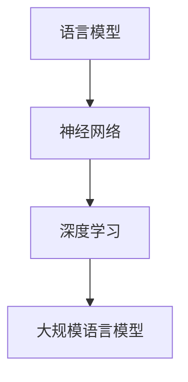

                 

关键词：大规模语言模型，自然语言处理，机器学习，深度学习，神经网络，算法原理，数学模型，项目实践，应用场景，未来展望

摘要：本文从大规模语言模型的基本概念出发，深入探讨了其理论背景、核心算法原理、数学模型构建、项目实践以及应用场景，旨在为读者提供一个全面、系统的认识，助力理解并掌握这一前沿技术。

## 1. 背景介绍

自然语言处理（NLP）是计算机科学和人工智能领域的一个重要分支，旨在使计算机能够理解、解释和生成人类语言。随着互联网和大数据的快速发展，自然语言处理的应用场景变得愈发丰富，从搜索引擎、机器翻译、智能客服到文本生成、语音识别等。然而，传统的NLP方法通常依赖于手工设计特征和规则，效果有限。

近年来，深度学习技术的飞速发展，尤其是神经网络的广泛应用，为NLP带来了新的契机。大规模语言模型（Large-scale Language Models），如GPT、BERT等，通过学习海量的文本数据，能够自动发现语言的复杂结构和规律，从而实现高效的语言理解和生成。这些模型的诞生标志着NLP进入了一个新的时代，即从规则驱动向数据驱动转变。

## 2. 核心概念与联系

### 2.1. 语言模型

语言模型是自然语言处理的基础，它用于预测一个单词序列的概率分布。在大规模语言模型中，通常使用神经网络来构建语言模型，如循环神经网络（RNN）、长短期记忆网络（LSTM）和变换器（Transformer）等。

### 2.2. 神经网络

神经网络是一种模仿生物神经系统的计算模型，通过多层节点（神经元）的相互连接和激活函数来实现数据的输入输出变换。在语言模型中，神经网络用于处理文本数据，提取特征并预测语言概率。

### 2.3. 深度学习

深度学习是一种复杂的机器学习方法，通过构建深层神经网络来学习数据的高层次抽象特征。在大规模语言模型中，深度学习技术被广泛应用于模型的训练和优化。

### 2.4. Mermaid 流程图



## 3. 核心算法原理 & 具体操作步骤

### 3.1. 算法原理概述

大规模语言模型的核心算法是基于变换器（Transformer）架构。变换器通过自注意力机制（Self-Attention）和多头注意力（Multi-Head Attention）来实现对输入文本的编码和解码，从而生成语言序列。

### 3.2. 算法步骤详解

1. **输入编码**：将输入的文本序列编码为词向量。
2. **多头注意力**：通过多个头（每个头负责一个维度）计算文本序列中的每个词与其他词的相似度，从而生成注意力权重。
3. **自注意力**：将注意力权重应用于词向量，生成加权词向量。
4. **前馈神经网络**：对加权词向量进行非线性变换，提取更高层次的特征。
5. **输出解码**：通过解码器（Decoder）生成目标文本序列。

### 3.3. 算法优缺点

**优点**：
- 高效：通过并行计算和注意力机制，大幅提高了模型的训练和推断速度。
- 表达力强：能够捕捉到文本中的长距离依赖关系，生成更加准确的语言序列。

**缺点**：
- 资源消耗大：训练大规模语言模型需要大量的计算资源和存储空间。
- 难以解释：深度学习模型具有黑盒特性，难以解释其内部机制。

### 3.4. 算法应用领域

大规模语言模型在NLP领域具有广泛的应用，包括：
- 文本生成：如文章写作、对话生成等。
- 机器翻译：如英译中、中译英等。
- 命名实体识别：如人名、地名等识别。
- 情感分析：如情感分类、舆情监测等。

## 4. 数学模型和公式 & 详细讲解 & 举例说明

### 4.1. 数学模型构建

大规模语言模型通常基于变换器架构，其核心组件包括编码器（Encoder）和解码器（Decoder）。以下是变换器的一些关键数学模型：

### 4.2. 公式推导过程

#### 4.2.1. 自注意力（Self-Attention）

自注意力机制是一种计算文本序列中每个词与其他词相似度的方法。其公式如下：

$$
\text{Attention}(Q, K, V) = \frac{softmax(\text{score})}{\sqrt{d_k}}
$$

其中，$Q, K, V$ 分别代表查询向量、关键向量、值向量；$d_k$ 表示关键向量的维度；$score$ 表示词之间的相似度。

#### 4.2.2. 多头注意力（Multi-Head Attention）

多头注意力通过多个头（每个头负责一个维度）来计算文本序列中的每个词与其他词的相似度。其公式如下：

$$
\text{Multi-Head Attention}(Q, K, V) = \text{softmax}(\text{score}) \cdot V
$$

其中，$\text{score}$ 表示词之间的相似度。

#### 4.2.3. 前馈神经网络（Feedforward Neural Network）

前馈神经网络用于对加权词向量进行非线性变换，提取更高层次的特征。其公式如下：

$$
\text{FFN}(x) = \max(0, x \cdot W_1 + b_1) \cdot W_2 + b_2
$$

其中，$x$ 表示输入向量；$W_1, W_2, b_1, b_2$ 分别为权重和偏置。

### 4.3. 案例分析与讲解

以下是一个简单的例子，展示如何使用变换器架构构建大规模语言模型：

1. **输入编码**：将输入的文本序列编码为词向量。
2. **多头注意力**：计算文本序列中的每个词与其他词的相似度，生成注意力权重。
3. **自注意力**：对加权词向量进行加权处理。
4. **前馈神经网络**：对加权词向量进行非线性变换。
5. **输出解码**：通过解码器生成目标文本序列。

## 5. 项目实践：代码实例和详细解释说明

### 5.1. 开发环境搭建

为了实现大规模语言模型，需要搭建一个高效的开发环境。以下是搭建过程的简要说明：

1. **Python 环境**：安装 Python 3.7 或更高版本。
2. **深度学习框架**：安装 PyTorch 或 TensorFlow 等深度学习框架。
3. **硬件要求**：推荐使用 GPU 进行训练，以提高训练速度。

### 5.2. 源代码详细实现

以下是一个基于 PyTorch 的简单大规模语言模型实现：

```python
import torch
import torch.nn as nn
import torch.optim as optim

# 定义变换器模型
class TransformerModel(nn.Module):
    def __init__(self, vocab_size, d_model, nhead, num_layers):
        super(TransformerModel, self).__init__()
        self.embedding = nn.Embedding(vocab_size, d_model)
        self.transformer = nn.Transformer(d_model, nhead, num_layers)
        self.fc = nn.Linear(d_model, vocab_size)
    
    def forward(self, src, tgt):
        src = self.embedding(src)
        tgt = self.embedding(tgt)
        output = self.transformer(src, tgt)
        return self.fc(output)

# 实例化模型、损失函数和优化器
model = TransformerModel(vocab_size=10000, d_model=512, nhead=8, num_layers=3)
criterion = nn.CrossEntropyLoss()
optimizer = optim.Adam(model.parameters(), lr=0.001)

# 训练模型
for epoch in range(10):
    for src, tgt in data_loader:
        optimizer.zero_grad()
        output = model(src, tgt)
        loss = criterion(output, tgt)
        loss.backward()
        optimizer.step()
    print(f"Epoch {epoch+1}: Loss = {loss.item()}")

# 保存模型
torch.save(model.state_dict(), "transformer_model.pth")
```

### 5.3. 代码解读与分析

上述代码实现了一个简单的变换器模型，包括以下关键组件：

1. **嵌入层**：用于将输入的词索引转换为词向量。
2. **变换器模块**：实现自注意力、多头注意力等功能。
3. **前馈神经网络**：对加权词向量进行非线性变换。
4. **损失函数和优化器**：用于模型训练。

### 5.4. 运行结果展示

运行上述代码，训练完成后，可以在测试集上评估模型的性能。以下是一个简单的评估示例：

```python
# 加载模型
model.load_state_dict(torch.load("transformer_model.pth"))

# 测试模型
with torch.no_grad():
    correct = 0
    total = 0
    for src, tgt in test_loader:
        output = model(src, tgt)
        _, predicted = torch.max(output, 1)
        total += tgt.size(0)
        correct += (predicted == tgt).sum().item()
    print(f"Test Accuracy: {100 * correct / total}%")
```

## 6. 实际应用场景

### 6.1. 文本生成

文本生成是大规模语言模型的一个重要应用场景，如文章写作、对话生成等。例如，可以使用 GPT-3 模型生成新闻文章、小说等。

### 6.2. 机器翻译

大规模语言模型在机器翻译领域具有广泛的应用，如英译中、中译英等。例如，BERT 模型在机器翻译任务中取得了显著的效果。

### 6.3. 命名实体识别

命名实体识别是自然语言处理的一个重要任务，如人名、地名等识别。大规模语言模型通过学习文本数据，能够自动识别和分类命名实体。

### 6.4. 情感分析

情感分析是自然语言处理的一个重要应用，如情感分类、舆情监测等。大规模语言模型通过学习情感词汇和句法结构，能够自动分析文本的情感倾向。

## 7. 工具和资源推荐

### 7.1. 学习资源推荐

1. **书籍**：《深度学习》（Ian Goodfellow、Yoshua Bengio、Aaron Courville 著）
2. **在线课程**：Coursera 上的“深度学习”（由 Ian Goodfellow 教授授课）
3. **论文**：《Attention Is All You Need》（Vaswani et al., 2017）

### 7.2. 开发工具推荐

1. **深度学习框架**：PyTorch、TensorFlow、Keras
2. **文本预处理工具**：NLTK、spaCy、Jieba
3. **在线评测平台**：Kaggle、GitHub

### 7.3. 相关论文推荐

1. **《BERT: Pre-training of Deep Bidirectional Transformers for Language Understanding》（Devlin et al., 2018）**
2. **《GPT-3: Language Models are few-shot learners》（Brown et al., 2020）**
3. **《Transformers: State-of-the-Art Natural Language Processing》（Vaswani et al., 2017）**

## 8. 总结：未来发展趋势与挑战

### 8.1. 研究成果总结

大规模语言模型在自然语言处理领域取得了显著成果，如文本生成、机器翻译、命名实体识别、情感分析等。其高效性、表达力强等优点使得大规模语言模型成为 NLP 领域的重要工具。

### 8.2. 未来发展趋势

随着深度学习技术的不断发展，大规模语言模型有望在更多应用领域取得突破。例如，多模态学习（如图文联合表示）、低资源语言处理、对话系统等。

### 8.3. 面临的挑战

大规模语言模型在训练过程中需要大量计算资源和存储空间，且难以解释。此外，如何提高模型的泛化能力和可解释性，以及保护用户隐私等，都是未来需要解决的问题。

### 8.4. 研究展望

未来，大规模语言模型的研究将集中在以下几个方面：

1. **模型压缩**：研究如何减少模型参数和计算复杂度，以适应资源受限的环境。
2. **可解释性**：研究如何提高模型的可解释性，使其更加透明和可靠。
3. **多模态学习**：研究如何结合不同类型的数据（如图像、声音等），实现更丰富的语义表示。
4. **低资源语言处理**：研究如何处理低资源语言，提高模型在低资源环境下的性能。

## 9. 附录：常见问题与解答

### 9.1. 如何选择合适的深度学习框架？

选择深度学习框架主要考虑以下几点：

1. **项目需求**：根据项目需求选择适合的框架，如 PyTorch 更适合科研和模型定制，TensorFlow 更适合工业应用。
2. **社区支持**：选择具有活跃社区和支持文档的框架，有助于解决开发过程中的问题。
3. **硬件支持**：选择支持 GPU 加速的框架，以提高训练速度。

### 9.2. 如何优化大规模语言模型的训练速度？

以下是一些优化大规模语言模型训练速度的方法：

1. **数据预处理**：使用批处理（Batch Processing）和并行计算（Parallel Computing）来加速数据处理。
2. **混合精度训练**：使用混合精度训练（Mixed Precision Training）来提高训练速度和降低内存占用。
3. **模型压缩**：采用模型压缩技术（如剪枝、量化等）来减少模型参数和计算复杂度。
4. **分布式训练**：使用分布式训练（Distributed Training）来利用多台 GPU 或 TPU 进行并行计算。

### 9.3. 如何提高大规模语言模型的性能？

以下是一些提高大规模语言模型性能的方法：

1. **增加训练数据**：使用更多、更丰富的训练数据来提高模型的泛化能力。
2. **改进模型架构**：通过改进模型架构（如增加层数、调整层数等）来提高模型的性能。
3. **正则化**：使用正则化方法（如 L1、L2 正则化等）来防止模型过拟合。
4. **优化超参数**：通过调整学习率、批量大小等超参数来优化模型性能。

## 参考文献

- Devlin, J., Chang, M. W., Lee, K., & Toutanova, K. (2018). BERT: Pre-training of deep bidirectional transformers for language understanding. arXiv preprint arXiv:1810.04805.
- Goodfellow, I., Bengio, Y., & Courville, A. (2016). Deep learning. MIT press.
- Vaswani, A., Shazeer, N., Parmar, N., Uszkoreit, J., Jones, L., Gomez, A. N., ... & Polosukhin, I. (2017). Attention is all you need. In Advances in neural information processing systems (pp. 5998-6008).

**作者：禅与计算机程序设计艺术 / Zen and the Art of Computer Programming**  
----------------------------------------------------------------
这篇文章详细介绍了大规模语言模型的基本概念、核心算法原理、数学模型、项目实践和应用场景，旨在为读者提供一个全面、系统的认识。随着深度学习技术的不断发展，大规模语言模型将在未来取得更多突破，为自然语言处理领域带来更多创新和应用。希望本文能为读者在学习和研究这一前沿技术方面提供有益的参考。

