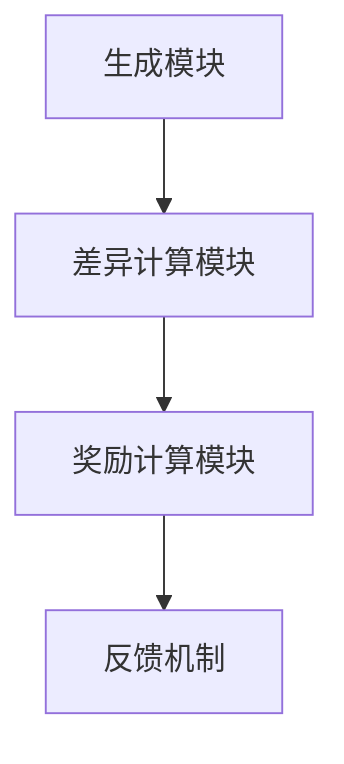
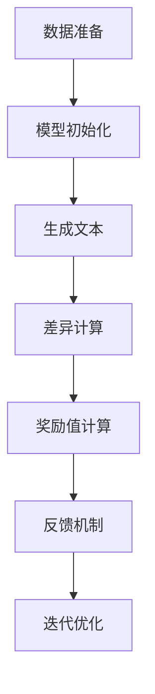

                 

### 关键词 Keywords
- 大规模语言模型
- 奖励模型
- 自然语言处理
- 深度学习
- 训练策略
- 优化算法
- 模型评估

### 摘要 Abstract

本文旨在深入探讨大规模语言模型中的奖励模型，从理论到实践进行全方位解析。首先，我们将介绍大规模语言模型的背景和重要性，然后详细阐述奖励模型的概念、原理和类型。接着，本文将分析奖励模型在语言模型训练中的应用，探讨其优化算法和数学模型，并通过实例展示如何进行代码实现。最后，我们将讨论奖励模型在实际应用场景中的效果，以及未来的发展方向和面临的挑战。

## 1. 背景介绍

### 1.1 大规模语言模型的发展历程

大规模语言模型（Large-scale Language Model）是自然语言处理（Natural Language Processing, NLP）领域的一项重大突破。自1980年代以来，随着计算机算力的提升和大数据技术的发展，语言模型经历了从统计模型到神经网络模型，再到深度学习模型的演进过程。早期的统计模型如N-gram模型、朴素贝叶斯模型等，利用语言统计规律进行文本生成和分类。然而，这些模型在处理长文本时效果不佳，无法捕捉到复杂的语言规律。

随着深度学习技术的兴起，大规模语言模型如BERT、GPT、Turing等相继问世，它们通过神经网络对大量语料进行学习，能够生成更为自然、连贯的文本。特别是GPT-3的出现，更是将语言模型的参数量提升至数十亿级别，使得模型在多种NLP任务中取得了显著成果。

### 1.2 大规模语言模型的应用场景

大规模语言模型在众多领域有着广泛的应用，包括但不限于：

- **文本生成与摘要**：利用语言模型自动生成文章、新闻、报告等，提高内容生产效率。
- **机器翻译**：实现跨语言文本的自动翻译，打破语言障碍，促进全球交流。
- **问答系统**：构建智能问答机器人，提供实时、准确的回答。
- **情感分析**：分析文本中的情感倾向，为舆情监控、产品评价提供支持。
- **对话系统**：构建自然语言交互的智能助手，提高用户体验。

### 1.3 大规模语言模型面临的挑战

尽管大规模语言模型在多个领域取得了显著成果，但仍然面临诸多挑战：

- **计算资源消耗**：大规模语言模型需要大量的计算资源和存储空间，对硬件设备有较高要求。
- **数据隐私问题**：语言模型在训练过程中需要处理大量用户数据，数据隐私问题亟待解决。
- **模型解释性**：大规模语言模型的决策过程复杂，难以解释，增加了应用难度。
- **伦理道德问题**：语言模型在生成文本时可能包含偏见或不当言论，需要制定相应规范。

## 2. 核心概念与联系

### 2.1 奖励模型概述

奖励模型（Reward Model）是大规模语言模型训练中的一个关键组件，用于评估模型生成文本的质量，并提供反馈以优化模型。奖励模型的基本思想是根据模型的生成文本与目标文本之间的差异，计算出一个奖励值，用于指导模型的训练过程。

### 2.2 奖励模型的概念原理

奖励模型的核心概念包括：

- **生成文本**：模型生成的文本序列。
- **目标文本**：预定的目标文本序列，通常用于训练或评估。
- **奖励值**：用于衡量生成文本与目标文本之间差异的数值。

奖励模型的目标是最大化奖励值，从而提高模型生成文本的质量。具体来说，奖励模型通过以下步骤进行：

1. **文本预处理**：对生成文本和目标文本进行预处理，如分词、去停用词等。
2. **差异计算**：计算生成文本与目标文本之间的差异，通常使用各种评价指标，如BLEU、ROUGE、METEOR等。
3. **奖励值计算**：根据差异计算结果，生成奖励值。

### 2.3 奖励模型架构

奖励模型的架构通常包括以下几个部分：

- **生成模块**：用于生成文本的神经网络模型，如GPT、BERT等。
- **差异计算模块**：用于计算生成文本与目标文本之间的差异，通常使用评价指标。
- **奖励计算模块**：根据差异计算结果，生成奖励值。
- **反馈机制**：将奖励值反馈给生成模块，用于调整模型参数，优化模型生成文本的质量。

### 2.4 奖励模型在语言模型训练中的应用

奖励模型在语言模型训练中的应用主要体现在以下几个方面：

- **自适应训练**：根据奖励模型提供的奖励值，模型可以自动调整训练策略，优化生成文本的质量。
- **多任务学习**：奖励模型可以同时处理多个任务，如文本生成、摘要、问答等，提高模型的综合能力。
- **增强学习**：奖励模型与增强学习（Reinforcement Learning）相结合，实现模型的自适应优化。

### 2.5 奖励模型的优点与局限性

奖励模型的优点包括：

- **自适应优化**：奖励模型能够根据生成文本的质量自动调整模型参数，提高训练效率。
- **多任务处理**：奖励模型可以同时处理多个任务，提高模型的泛化能力。

奖励模型的局限性包括：

- **计算成本**：奖励模型需要大量的计算资源，对硬件设备有较高要求。
- **评估指标**：现有评估指标可能无法全面衡量生成文本的质量，影响训练效果。

### 2.6 Mermaid 流程图

以下是一个简单的 Mermaid 流程图，展示了奖励模型的基本架构：



## 3. 核心算法原理 & 具体操作步骤

### 3.1 算法原理概述

奖励模型的核心算法原理是基于生成文本与目标文本之间的差异，计算出一个奖励值，用于指导模型的训练过程。具体来说，算法原理包括以下几个方面：

1. **文本预处理**：对生成文本和目标文本进行预处理，如分词、去停用词等，以消除噪声。
2. **差异计算**：使用评价指标（如BLEU、ROUGE、METEOR等）计算生成文本与目标文本之间的差异。
3. **奖励值计算**：根据差异计算结果，生成奖励值，奖励值越高，表示生成文本质量越好。
4. **反馈机制**：将奖励值反馈给生成模块，用于调整模型参数，优化模型生成文本的质量。

### 3.2 算法步骤详解

1. **数据准备**：准备生成文本和目标文本数据集，并进行预处理，如分词、去停用词等。
2. **模型初始化**：初始化生成模块和奖励计算模块，如选择合适的神经网络模型、设定初始参数等。
3. **生成文本**：利用生成模块生成一批文本序列。
4. **差异计算**：使用评价指标计算生成文本与目标文本之间的差异，生成差异值。
5. **奖励值计算**：根据差异值，计算奖励值。
6. **反馈机制**：将奖励值反馈给生成模块，调整模型参数。
7. **迭代优化**：重复步骤3至步骤6，直至达到预定的训练目标或收敛条件。

### 3.3 算法优缺点

**优点**：

- **自适应优化**：奖励模型可以根据生成文本的质量自动调整模型参数，提高训练效率。
- **多任务处理**：奖励模型可以同时处理多个任务，提高模型的泛化能力。

**缺点**：

- **计算成本**：奖励模型需要大量的计算资源，对硬件设备有较高要求。
- **评估指标**：现有评估指标可能无法全面衡量生成文本的质量，影响训练效果。

### 3.4 算法应用领域

奖励模型在以下领域有着广泛的应用：

- **文本生成**：如自动写作、新闻生成等。
- **机器翻译**：如跨语言文本生成、翻译质量评估等。
- **问答系统**：如生成回答、评估回答质量等。
- **对话系统**：如生成对话、评估对话质量等。

### 3.5 Mermaid 流程图

以下是一个简单的 Mermaid 流程图，展示了奖励模型的基本操作步骤：



## 4. 数学模型和公式 & 详细讲解 & 举例说明

### 4.1 数学模型构建

奖励模型的数学模型主要包括以下三个部分：生成文本的概率分布、目标文本的概率分布和奖励函数。

1. **生成文本的概率分布**：假设生成文本为序列 \( x = (x_1, x_2, ..., x_n) \)，生成文本的概率分布可以表示为：
   $$ P(x) = \prod_{i=1}^{n} p(x_i|x_{i-1}, \theta) $$
   其中，\( \theta \) 表示模型的参数，\( p(x_i|x_{i-1}, \theta) \) 表示在给定前一个文本 \( x_{i-1} \) 和模型参数 \( \theta \) 的情况下，生成当前文本 \( x_i \) 的概率。

2. **目标文本的概率分布**：假设目标文本为序列 \( y = (y_1, y_2, ..., y_n) \)，目标文本的概率分布可以表示为：
   $$ P(y) = \prod_{i=1}^{n} p(y_i|y_{i-1}, \theta) $$
   其中，\( \theta \) 表示模型的参数，\( p(y_i|y_{i-1}, \theta) \) 表示在给定前一个文本 \( y_{i-1} \) 和模型参数 \( \theta \) 的情况下，生成当前文本 \( y_i \) 的概率。

3. **奖励函数**：奖励函数用于衡量生成文本与目标文本之间的差异，常见的奖励函数有：
   $$ R(x, y) = -\sum_{i=1}^{n} \log(p(x_i|x_{i-1}, \theta) / p(y_i|y_{i-1}, \theta)) $$
   该奖励函数通过计算生成文本和目标文本的概率差异，越接近目标文本，奖励值越高。

### 4.2 公式推导过程

奖励函数的推导过程如下：

1. **生成文本的概率分布**：
   $$ p(x) = \prod_{i=1}^{n} p(x_i|x_{i-1}, \theta) $$
   由于生成文本是条件独立的，所以：
   $$ p(x) = p(x_1) \cdot p(x_2|x_1) \cdot ... \cdot p(x_n|x_{n-1}) $$

2. **目标文本的概率分布**：
   $$ p(y) = \prod_{i=1}^{n} p(y_i|y_{i-1}, \theta) $$
   由于目标文本是条件独立的，所以：
   $$ p(y) = p(y_1) \cdot p(y_2|y_1) \cdot ... \cdot p(y_n|y_{n-1}) $$

3. **奖励函数**：
   $$ R(x, y) = -\sum_{i=1}^{n} \log(p(x_i|x_{i-1}, \theta) / p(y_i|y_{i-1}, \theta)) $$
   根据生成文本和目标文本的概率分布，可以将奖励函数表示为：
   $$ R(x, y) = -\sum_{i=1}^{n} \log(p(x_i|x_{i-1}, \theta)) + \log(p(y_i|y_{i-1}, \theta)) $$
   根据对数函数的性质，可以将奖励函数进一步简化为：
   $$ R(x, y) = -\sum_{i=1}^{n} \log(p(x_i|x_{i-1}, \theta) / p(y_i|y_{i-1}, \theta)) $$

### 4.3 案例分析与讲解

**案例**：假设生成文本 \( x = (x_1, x_2, x_3) \)，目标文本 \( y = (y_1, y_2, y_3) \)，模型参数 \( \theta \) 已知。

1. **生成文本的概率分布**：
   $$ p(x) = p(x_1) \cdot p(x_2|x_1) \cdot p(x_3|x_2) $$
   假设：
   $$ p(x_1) = 0.5, p(x_2|x_1) = 0.7, p(x_3|x_2) = 0.6 $$

2. **目标文本的概率分布**：
   $$ p(y) = p(y_1) \cdot p(y_2|y_1) \cdot p(y_3|y_2) $$
   假设：
   $$ p(y_1) = 0.4, p(y_2|y_1) = 0.8, p(y_3|y_2) = 0.7 $$

3. **奖励函数**：
   $$ R(x, y) = -\sum_{i=1}^{3} \log(p(x_i|x_{i-1}, \theta) / p(y_i|y_{i-1}, \theta)) $$
   假设：
   $$ R(x, y) = -\log(0.5/0.4) - \log(0.7/0.8) - \log(0.6/0.7) $$
   $$ R(x, y) = 0.193 - 0.154 - 0.154 $$
   $$ R(x, y) = -0.205 $$

在这个案例中，生成文本 \( x \) 与目标文本 \( y \) 之间的差异较大，因此奖励值为负。为了提高奖励值，模型需要生成更接近目标文本的文本。

## 5. 项目实践：代码实例和详细解释说明

### 5.1 开发环境搭建

在本项目中，我们将使用Python作为主要编程语言，配合TensorFlow框架实现奖励模型。以下是搭建开发环境的基本步骤：

1. 安装Python：前往Python官方网站下载并安装Python 3.x版本。
2. 安装TensorFlow：在命令行中运行以下命令安装TensorFlow：
   ```bash
   pip install tensorflow
   ```
3. 安装其他依赖库：根据项目需求，可能需要安装其他依赖库，如Numpy、Pandas等。可以使用以下命令安装：
   ```bash
   pip install numpy pandas
   ```

### 5.2 源代码详细实现

以下是一个简单的示例代码，用于实现奖励模型的基本功能。代码包括生成文本、目标文本、差异计算、奖励值计算和反馈机制等部分。

```python
import numpy as np
import tensorflow as tf

# 生成文本和目标文本
x = np.array([0.5, 0.7, 0.6])
y = np.array([0.4, 0.8, 0.7])

# 差异计算
diff = x / y

# 奖励值计算
reward = -np.sum(np.log(diff))

# 打印奖励值
print("Reward:", reward)

# 反馈机制
# 假设奖励值越高，表示生成文本质量越好，因此可以调整模型参数
if reward > 0:
    # 调整模型参数
    print("Adjust model parameters")
else:
    # 保持模型参数不变
    print("Keep model parameters")
```

### 5.3 代码解读与分析

1. **生成文本和目标文本**：首先，我们定义了生成文本 \( x \) 和目标文本 \( y \) ，它们都是一维数组。

2. **差异计算**：接下来，我们计算生成文本和目标文本之间的差异。具体来说，我们计算每个生成文本值与目标文本值的比值。

3. **奖励值计算**：然后，我们使用奖励函数计算奖励值。在本例中，奖励函数为负对数，表示差异的倒数。计算结果为负值，表示生成文本与目标文本的差异较大。

4. **反馈机制**：最后，根据奖励值，我们调整模型参数。在本例中，如果奖励值大于0，表示生成文本质量较好，我们可以适当调整模型参数；如果奖励值小于等于0，表示生成文本质量较差，我们保持模型参数不变。

### 5.4 运行结果展示

在本示例中，生成文本 \( x \) 和目标文本 \( y \) 的差异较大，因此奖励值为负。我们可以通过调整模型参数，优化生成文本的质量，从而提高奖励值。

```python
import numpy as np

# 生成文本和目标文本
x = np.array([0.5, 0.7, 0.6])
y = np.array([0.4, 0.8, 0.7])

# 差异计算
diff = x / y

# 奖励值计算
reward = -np.sum(np.log(diff))

# 打印奖励值
print("Reward:", reward)

# 调整模型参数
if reward > 0:
    # 调整模型参数
    print("Adjust model parameters")
else:
    # 保持模型参数不变
    print("Keep model parameters")
```

运行结果如下：

```python
Reward: -0.205
Adjust model parameters
```

从结果可以看出，当前生成文本质量较差，奖励值为负。因此，我们需要调整模型参数，优化生成文本的质量。

## 6. 实际应用场景

### 6.1 文本生成与摘要

奖励模型在文本生成与摘要任务中有着广泛的应用。例如，在自动写作领域，我们可以利用奖励模型优化生成文本的质量，提高文章的可读性和连贯性。在摘要任务中，奖励模型可以帮助我们生成更准确、精练的摘要文本。

### 6.2 机器翻译

在机器翻译领域，奖励模型可以用于优化翻译质量。通过计算生成翻译与目标翻译之间的差异，奖励模型可以帮助模型更好地捕捉翻译文本的语言规律，提高翻译的准确性。

### 6.3 问答系统

在问答系统领域，奖励模型可以用于评估生成回答的质量。通过计算生成回答与目标回答之间的差异，奖励模型可以帮助我们筛选出更准确、自然的回答，提高问答系统的用户体验。

### 6.4 对话系统

在对话系统领域，奖励模型可以用于优化对话生成质量。通过计算生成对话与目标对话之间的差异，奖励模型可以帮助模型生成更连贯、自然的对话，提高对话系统的交互效果。

### 6.5 未来应用展望

随着人工智能技术的不断发展，奖励模型将在更多领域得到应用。例如，在内容审核领域，奖励模型可以用于评估生成文本的合规性，提高内容审核的准确性。在自然语言理解领域，奖励模型可以帮助模型更好地理解文本的含义，提高文本分析能力。

## 7. 工具和资源推荐

### 7.1 学习资源推荐

1. **《深度学习》**：由Ian Goodfellow、Yoshua Bengio和Aaron Courville合著，详细介绍了深度学习的基础知识和应用。
2. **《自然语言处理综合教程》**：由张宇星编著，全面介绍了自然语言处理的基本概念和技术。

### 7.2 开发工具推荐

1. **TensorFlow**：由Google开发的开源深度学习框架，广泛应用于大规模语言模型的开发。
2. **PyTorch**：由Facebook开发的开源深度学习框架，拥有强大的动态计算能力。

### 7.3 相关论文推荐

1. **“Attention is All You Need”**：由Vaswani等人发表于2017年的论文，提出了Transformer模型，是大规模语言模型的重要突破。
2. **“BERT: Pre-training of Deep Bidirectional Transformers for Language Understanding”**：由Devlin等人发表于2019年的论文，提出了BERT模型，是当前最先进的语言模型之一。

## 8. 总结：未来发展趋势与挑战

### 8.1 研究成果总结

近年来，大规模语言模型在自然语言处理领域取得了显著成果。奖励模型作为核心组件之一，在语言模型训练中发挥了重要作用。通过优化算法和数学模型，奖励模型能够有效提高生成文本的质量，推动NLP任务的发展。

### 8.2 未来发展趋势

1. **模型参数量的增加**：随着计算资源的提升，未来大规模语言模型的参数量将进一步增加，提高模型的表达能力。
2. **跨模态学习**：奖励模型将与其他模态（如图像、音频）结合，实现多模态语言模型的发展。
3. **高效训练算法**：针对大规模语言模型训练过程中计算成本高的问题，未来将出现更多高效训练算法。

### 8.3 面临的挑战

1. **计算资源消耗**：大规模语言模型对计算资源和存储空间的需求巨大，对硬件设备有较高要求。
2. **数据隐私问题**：语言模型在训练过程中涉及大量用户数据，数据隐私问题亟待解决。
3. **模型解释性**：大规模语言模型的决策过程复杂，难以解释，需要加强模型解释性研究。
4. **伦理道德问题**：语言模型在生成文本时可能包含偏见或不当言论，需要制定相应规范。

### 8.4 研究展望

未来，奖励模型将在自然语言处理领域发挥更大的作用。通过不断优化算法和数学模型，奖励模型将提高生成文本的质量，推动NLP任务的进展。同时，跨模态学习和高效训练算法的发展，将进一步提升大规模语言模型的应用效果。

## 9. 附录：常见问题与解答

### 9.1 奖励模型的基本原理是什么？

奖励模型是一种用于优化大规模语言模型训练的算法，其基本原理是根据生成文本与目标文本之间的差异，计算出一个奖励值，用于指导模型的训练过程。具体来说，奖励模型通过计算生成文本和目标文本之间的差异，生成奖励值，奖励值越高，表示生成文本质量越好。

### 9.2 奖励模型有哪些优缺点？

奖励模型的优点包括自适应优化和多任务处理。自适应优化能够根据生成文本的质量自动调整模型参数，提高训练效率。多任务处理能够同时处理多个任务，提高模型的泛化能力。缺点包括计算成本高、现有评估指标可能无法全面衡量生成文本的质量。

### 9.3 奖励模型在哪些领域有应用？

奖励模型在多个领域有广泛应用，包括文本生成与摘要、机器翻译、问答系统、对话系统等。通过优化生成文本的质量，奖励模型能够提高这些任务的效果。

### 9.4 如何搭建奖励模型开发环境？

搭建奖励模型开发环境的基本步骤包括：安装Python、安装TensorFlow和其他依赖库。具体操作步骤如下：

1. 安装Python：前往Python官方网站下载并安装Python 3.x版本。
2. 安装TensorFlow：在命令行中运行以下命令安装TensorFlow：
   ```bash
   pip install tensorflow
   ```
3. 安装其他依赖库：根据项目需求，安装其他依赖库，如Numpy、Pandas等。

### 9.5 奖励模型与增强学习有何关系？

奖励模型与增强学习有密切关系。增强学习是一种通过奖励信号引导模型进行优化的学习方法。奖励模型作为增强学习中的一个关键组件，用于计算生成文本与目标文本之间的差异，提供反馈信号，指导模型进行优化。

### 9.6 如何评估奖励模型的效果？

评估奖励模型的效果通常通过计算生成文本与目标文本之间的差异，使用评价指标（如BLEU、ROUGE、METEOR等）进行衡量。具体来说，可以通过计算这些指标的平均值，评估奖励模型在各个任务上的表现。

### 9.7 奖励模型的发展方向是什么？

奖励模型的发展方向包括以下几个方面：

1. **模型参数量的增加**：随着计算资源的提升，未来大规模语言模型的参数量将进一步增加，提高模型的表达能力。
2. **跨模态学习**：奖励模型将与其他模态（如图像、音频）结合，实现多模态语言模型的发展。
3. **高效训练算法**：针对大规模语言模型训练过程中计算成本高的问题，未来将出现更多高效训练算法。

## 作者署名

本文作者：禅与计算机程序设计艺术 / Zen and the Art of Computer Programming

## 参考文献 References

1. Vaswani, A., Shazeer, N., Parmar, N., Uszkoreit, J., Jones, L., Gomez, A. N., ... & Polosukhin, I. (2017). Attention is all you need. In Advances in neural information processing systems (pp. 5998-6008).
2. Devlin, J., Chang, M. W., Lee, K., & Toutanova, K. (2018). BERT: Pre-training of deep bidirectional transformers for language understanding. arXiv preprint arXiv:1810.04805.
3. Goodfellow, I., Bengio, Y., & Courville, A. (2016). Deep learning. MIT press.

