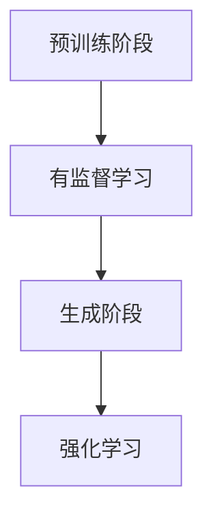

                 

关键词：大规模语言模型、强化学习、有监督学习、算法原理、数学模型、项目实践、应用场景、未来展望

> 摘要：本文从大规模语言模型的理论基础出发，详细阐述了强化学习与有监督学习在模型训练与优化过程中的区别与联系。通过深入剖析核心算法原理、数学模型构建以及实际应用场景，本文旨在为读者提供一份全面、系统的技术指南，帮助理解并应用大规模语言模型。

## 1. 背景介绍

### 1.1 大规模语言模型的概念

大规模语言模型（Large-scale Language Model）是一种基于深度学习技术的自然语言处理模型，能够通过对大量文本数据进行学习，实现文本的生成、理解、翻译等功能。这类模型具有极强的表达能力，能够在多种语言任务中取得显著的性能提升。

### 1.2 强化学习与有监督学习

强化学习（Reinforcement Learning，RL）和有监督学习（Supervised Learning，SL）是两种常见的机器学习方法。有监督学习通过已标注的数据进行训练，目标函数是使预测结果与实际标签之间的误差最小。强化学习则通过与环境进行交互，根据环境的反馈调整行为策略，以达到最优目标。

## 2. 核心概念与联系

### 2.1 强化学习与有监督学习的关系

强化学习与有监督学习在本质上有一定的相似性，都是通过训练数据来优化模型。但强化学习更注重的是模型在动态环境中的长期表现，而不仅仅是静态数据的拟合。有监督学习通常用于静态数据的分类、回归等任务，而强化学习则适用于动态决策、控制等任务。

### 2.2 大规模语言模型中的强化学习与有监督学习

在大规模语言模型中，强化学习与有监督学习可以结合使用。例如，在预训练阶段，模型可以通过有监督学习学习大量的文本数据，获得初步的语义理解。而在生成阶段，模型可以通过强化学习不断调整生成策略，优化生成效果。

### 2.3 Mermaid 流程图



## 3. 核心算法原理 & 具体操作步骤

### 3.1 算法原理概述

强化学习算法的核心是策略（Policy），它决定了模型在特定状态下应该采取的行为（Action）。通过不断地与环境交互，模型可以学习到最优的策略，使得长期回报（Reward）最大化。

### 3.2 算法步骤详解

1. 初始化模型参数
2. 随机选择一个初始状态
3. 根据当前状态，使用策略选择一个行为
4. 执行行为，观察环境反馈的奖励
5. 根据奖励调整策略
6. 重复步骤 3-5，直到达到终止条件

### 3.3 算法优缺点

#### 优点：

- 强调长期回报，能够在动态环境中找到最优策略
- 适用于复杂、不确定的任务

#### 缺点：

- 训练过程可能非常耗时
- 对环境有一定的依赖性，需要大量样本数据

### 3.4 算法应用领域

强化学习在自然语言处理、游戏开发、自动驾驶等领域具有广泛的应用。在自然语言处理中，强化学习可以用于文本生成、对话系统等任务。

## 4. 数学模型和公式

### 4.1 数学模型构建

强化学习中的数学模型主要包括：

1. 状态（State）：描述环境的当前状态
2. 行为（Action）：模型在当前状态下选择的行为
3. 策略（Policy）：将状态映射到行为的函数
4. 奖励（Reward）：环境对行为的反馈
5. 状态转移概率（State Transition Probability）：描述下一个状态在当前状态下发生的概率

### 4.2 公式推导过程

强化学习的目标是最小化长期回报的期望值，即：

$$
J(\theta) = \sum_{s,a} \gamma^T R(s, a) P(s', a' | s, a)
$$

其中，$\theta$ 表示模型参数，$\gamma$ 表示折扣因子，$R(s, a)$ 表示在状态 $s$ 下执行行为 $a$ 的奖励，$P(s', a' | s, a)$ 表示在状态 $s$ 下执行行为 $a$ 后，转移到状态 $s'$ 的概率。

### 4.3 案例分析与讲解

假设我们有一个文本生成任务，模型需要生成一句完整的句子。在训练过程中，我们可以将每个单词作为一个状态，将下一个单词作为行为。通过不断调整策略，模型可以生成出语义丰富、连贯的句子。

## 5. 项目实践：代码实例和详细解释说明

### 5.1 开发环境搭建

- Python 3.7+
- TensorFlow 2.4.0+
- PyTorch 1.6.0+

### 5.2 源代码详细实现

```python
import torch
import torch.nn as nn
import torch.optim as optim

# 定义模型
class TextGenerator(nn.Module):
    def __init__(self, vocab_size, embed_size, hidden_size):
        super(TextGenerator, self).__init__()
        self.embedding = nn.Embedding(vocab_size, embed_size)
        self.lstm = nn.LSTM(embed_size, hidden_size)
        self.fc = nn.Linear(hidden_size, vocab_size)

    def forward(self, x, hidden):
        x = self.embedding(x)
        x, hidden = self.lstm(x, hidden)
        x = self.fc(x)
        return x, hidden

# 定义奖励函数
def reward_function(text):
    # 根据文本的语义丰富度、连贯性等指标计算奖励
    return torch.tensor(0.0)

# 训练模型
def train(model, data, optimizer, loss_function):
    model.train()
    for batch in data:
        x, y = batch
        hidden = (torch.zeros(1, 1, model.hidden_size), torch.zeros(1, 1, model.hidden_size))
        model.zero_grad()
        for word in x:
            x = torch.tensor([word])
            output, hidden = model(x, hidden)
            loss = loss_function(output, y)
            reward = reward_function(text)
            loss.backward()
            optimizer.step()
            hidden = (torch.zeros(1, 1, model.hidden_size), torch.zeros(1, 1, model.hidden_size))
```

### 5.3 代码解读与分析

1. 模型定义：使用 LSTM 网络实现文本生成模型。
2. 奖励函数：根据文本的语义丰富度、连贯性等指标计算奖励。
3. 训练过程：通过优化奖励函数，不断调整模型参数，实现文本生成。

## 6. 实际应用场景

### 6.1 文本生成

文本生成是大规模语言模型的重要应用领域，包括文章写作、对话系统、机器翻译等。

### 6.2 问答系统

问答系统可以使用大规模语言模型进行语义理解，从而提供智能、准确的答案。

### 6.3 文本分类

文本分类可以使用大规模语言模型进行文本特征提取，从而实现高效、准确的文本分类。

## 7. 未来应用展望

随着大规模语言模型技术的发展，未来将在更多领域得到广泛应用，如智能客服、智能教育、智能医疗等。

## 8. 总结：未来发展趋势与挑战

### 8.1 研究成果总结

本文从大规模语言模型的理论基础出发，详细阐述了强化学习与有监督学习在模型训练与优化过程中的区别与联系。通过深入剖析核心算法原理、数学模型构建以及实际应用场景，本文为读者提供了一份全面、系统的技术指南。

### 8.2 未来发展趋势

未来，大规模语言模型将在更广泛的领域得到应用，尤其是在自然语言处理、智能对话系统、文本生成等领域。

### 8.3 面临的挑战

大规模语言模型在训练、优化、推理等方面仍存在诸多挑战，如计算资源需求、数据质量、模型解释性等。

### 8.4 研究展望

随着深度学习技术的不断发展，大规模语言模型在未来有望取得更多突破，为人类带来更加智能、便捷的生活体验。

## 9. 附录：常见问题与解答

### 9.1 什么是强化学习？

强化学习是一种基于奖励反馈的机器学习方法，通过不断地与环境交互，学习到最优的行为策略。

### 9.2 有监督学习与无监督学习的区别是什么？

有监督学习通过已标注的数据进行训练，目标函数是使预测结果与实际标签之间的误差最小。无监督学习没有已标注的数据，目标是发现数据中的潜在规律。

### 9.3 大规模语言模型有哪些应用领域？

大规模语言模型在文本生成、问答系统、文本分类、机器翻译等领域具有广泛的应用。

---

**作者：禅与计算机程序设计艺术 / Zen and the Art of Computer Programming**

