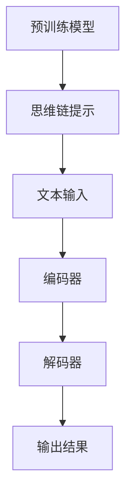
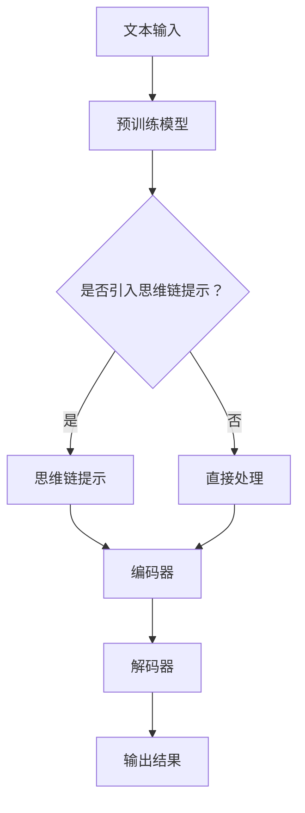

                 

关键词：大规模语言模型、思维链提示、自然语言处理、AI技术、深度学习

> 摘要：本文旨在深入探讨大规模语言模型的理论基础和实际应用，特别是思维链提示在提升模型性能和效果方面的关键作用。通过详细的算法原理讲解、数学模型推导和代码实现，本文旨在为读者提供一个全面的技术指南，帮助理解和应用大规模语言模型。

## 1. 背景介绍

随着自然语言处理（NLP）技术的不断发展，大规模语言模型（Large-scale Language Models）已经成为AI领域的热点。这些模型具有极强的文本生成、理解和推理能力，广泛应用于聊天机器人、内容生成、文本分类、机器翻译等多个领域。其中，GPT（Generative Pre-trained Transformer）和BERT（Bidirectional Encoder Representations from Transformers）是两种最为知名的大规模语言模型。

大规模语言模型的核心思想是利用预训练技术，在大量无标签文本数据上先进行训练，然后通过特定任务的数据进行微调，以实现各种NLP任务的高性能表现。预训练阶段，模型通过学习文本的上下文关系，建立了丰富的语言知识库，为后续任务提供了强大的基础。

然而，尽管大规模语言模型在多个任务上取得了显著成果，但其性能仍然受到一些限制。例如，模型的生成能力在复杂推理任务上表现不佳，且对长文本的理解能力有限。为了解决这些问题，研究人员提出了多种改进方法，其中思维链提示（Thinking链提示）是一种重要的技术手段。

思维链提示旨在通过在模型中引入特定的提示信息，引导模型进行更加深入和结构化的思考过程，从而提升模型在复杂任务上的表现。本文将详细探讨思维链提示的原理、实现方法及其在NLP任务中的应用，旨在为读者提供一个全面的技术指南。

## 2. 核心概念与联系

### 2.1. 大规模语言模型的基本概念

大规模语言模型是一种基于深度学习的文本表示模型，其主要目的是学习文本数据的分布式表示。这种模型通常由多层神经网络组成，其中Transformer结构是目前最流行的一种。Transformer模型通过自注意力机制（Self-Attention）和多头注意力（Multi-Head Attention）技术，能够捕捉文本中单词之间的复杂关系。

自注意力机制允许模型在处理一个单词时，根据上下文信息动态地调整其对其他单词的权重。多头注意力进一步将这种注意力机制分解为多个独立的学习任务，从而提高了模型的泛化能力和表达能力。

### 2.2. 思维链提示的概念

思维链提示是一种在模型训练和推理过程中引入特定提示信息的技术。这些提示信息可以是预定义的文本片段、问题或者指令，旨在引导模型进行更加深入和结构化的思考。

思维链提示的核心思想是通过外部信息与模型内部表示的相互作用，引导模型在处理文本时遵循特定的思考路径，从而提高模型在复杂任务上的表现。例如，在问答任务中，思维链提示可以帮助模型更好地理解问题和回答之间的逻辑关系，从而生成更加准确和连贯的回答。

### 2.3. 大规模语言模型与思维链提示的联系

大规模语言模型与思维链提示之间存在紧密的联系。一方面，大规模语言模型为思维链提示提供了强大的文本理解能力，使得思维链提示能够在丰富的上下文信息中进行有效的思考。另一方面，思维链提示通过引入外部提示信息，为大规模语言模型提供了额外的指导，有助于模型在复杂任务上实现更高的性能。

为了更好地理解这种联系，我们可以通过一个Mermaid流程图来展示大规模语言模型与思维链提示的基本架构和交互过程：



在这个流程图中，预训练模型（A）通过大量文本数据进行了充分的训练，并生成了丰富的语言知识。思维链提示（B）作为外部输入，与文本输入（C）一起被编码器（D）处理，然后通过解码器（E）生成输出结果（F）。这个过程中，思维链提示发挥了关键的引导作用，帮助模型在处理文本时进行更加深入和结构化的思考。

### 2.4. 相关技术

除了大规模语言模型和思维链提示，NLP领域还存在许多其他相关技术。其中，最为重要的包括：

- **预训练和微调**：预训练是指模型在大量无标签文本数据上进行训练，而微调则是指模型在特定任务的数据上进行进一步训练，以实现任务的高性能表现。

- **注意力机制**：注意力机制是Transformer模型的核心组件，通过动态调整不同位置的信息权重，实现了对文本的精细理解。

- **生成对抗网络（GAN）**：GAN是一种无监督学习技术，通过生成器和判别器的对抗训练，实现了高质量的数据生成。

- **强化学习**：强化学习通过模型与环境交互，不断优化策略，以实现特定的目标。在NLP任务中，强化学习可以用于对话系统的生成和优化。

### 2.5. Mermaid流程图

为了更好地展示大规模语言模型与思维链提示的交互过程，我们可以使用Mermaid语言绘制一个流程图。以下是一个示例：



在这个流程图中，文本输入（A）首先被预训练模型（B）处理。如果引入思维链提示（D），则文本输入和思维链提示共同被编码器（F）处理；否则，直接将文本输入传递给编码器。编码器的输出随后被解码器（G）处理，最终生成输出结果（H）。

通过这个流程图，我们可以清晰地看到思维链提示在模型处理过程中的关键作用，以及其与预训练模型和编码解码器之间的相互作用。

## 3. 核心算法原理 & 具体操作步骤

### 3.1. 算法原理概述

大规模语言模型的算法原理主要包括预训练和微调两个阶段。在预训练阶段，模型通过自注意力机制和多层神经网络结构，学习大量文本数据的分布式表示。这些表示不仅包含了单词级别的信息，还涵盖了句子、段落甚至更长的文本片段。

预训练完成后，模型进入微调阶段。在微调阶段，模型根据特定任务的数据进行进一步的训练，以优化其在特定任务上的性能。这一过程中，思维链提示发挥了关键作用。通过引入外部提示信息，思维链提示可以引导模型在处理文本时进行更加深入和结构化的思考，从而提高模型在复杂任务上的表现。

### 3.2. 算法步骤详解

#### 3.2.1. 预训练阶段

预训练阶段主要包括以下步骤：

1. **数据准备**：从大量无标签文本数据中提取句子、段落等文本片段。
2. **模型初始化**：初始化预训练模型，通常采用Transformer结构。
3. **预训练**：通过自注意力机制和多层神经网络结构，模型学习文本数据的分布式表示。
4. **损失函数**：预训练过程中，模型通常采用跨句编码（Cross-Sentence Encoding）和填充掩码（Masked Language Modeling）等策略，通过优化损失函数来提高模型的性能。

#### 3.2.2. 微调阶段

微调阶段主要包括以下步骤：

1. **数据准备**：从特定任务的数据中提取训练集和验证集。
2. **模型初始化**：从预训练阶段加载预训练模型，并进行初始化。
3. **微调**：通过特定任务的数据对模型进行微调，优化模型在特定任务上的性能。
4. **思维链提示**：在微调过程中，引入思维链提示，通过外部提示信息引导模型进行更加深入和结构化的思考。
5. **损失函数**：在微调阶段，通常采用交叉熵（Cross-Entropy）等损失函数来优化模型。

### 3.3. 算法优缺点

#### 优点

- **强大的文本理解能力**：预训练阶段的学习使得模型能够捕捉到文本中的丰富信息，从而在多个NLP任务上实现高性能表现。
- **可扩展性**：通过引入思维链提示，模型可以在多种复杂任务上实现高效的性能提升。
- **泛化能力**：大规模语言模型通过预训练和微调过程，能够适应不同的任务和数据集，具有较好的泛化能力。

#### 缺点

- **计算资源需求**：大规模语言模型在训练和推理过程中需要大量的计算资源，这对硬件设备提出了较高的要求。
- **训练时间**：大规模语言模型的训练时间较长，尤其是在大规模数据集上。
- **模型解释性**：虽然大规模语言模型在性能上表现出色，但其内部机制复杂，解释性较差，难以理解模型的决策过程。

### 3.4. 算法应用领域

大规模语言模型在多个NLP任务上取得了显著成果，其主要应用领域包括：

- **文本生成**：大规模语言模型可以用于生成高质量的文章、新闻、故事等文本内容。
- **文本分类**：大规模语言模型可以用于对大量文本数据进行分析和分类，例如情感分析、主题分类等。
- **机器翻译**：大规模语言模型在机器翻译任务上表现出色，能够实现高质量的双语翻译。
- **问答系统**：大规模语言模型可以用于构建问答系统，通过理解问题和文本，生成准确的回答。

### 3.5. 相关技术

除了大规模语言模型和思维链提示，NLP领域还存在许多其他相关技术，包括：

- **BERT（Bidirectional Encoder Representations from Transformers）**：BERT是一种基于Transformer的双向编码器模型，通过双向注意力机制，实现了对文本的深度理解。
- **GPT（Generative Pre-trained Transformer）**：GPT是一种基于Transformer的生成式模型，通过生成式预训练，实现了高质量的文本生成。
- **ELMO（Embeddings from Language Models）**：ELMO是一种基于语言模型的全局文本表示，通过预训练，实现了对文本的全面理解。

### 3.6. Mermaid流程图

为了更好地展示大规模语言模型与思维链提示的交互过程，我们可以使用Mermaid语言绘制一个流程图。以下是一个示例：


在这个流程图中，文本输入（A）首先被预训练模型（B）处理。如果引入思维链提示（D），则文本输入和思维链提示共同被编码器（F）处理；否则，直接将文本输入传递给编码器。编码器的输出随后被解码器（G）处理，最终生成输出结果（H）。

通过这个流程图，我们可以清晰地看到思维链提示在模型处理过程中的关键作用，以及其与预训练模型和编码解码器之间的相互作用。

## 4. 数学模型和公式 & 详细讲解 & 举例说明

### 4.1. 数学模型构建

大规模语言模型的数学模型主要包括自注意力机制、编码器和解码器等组成部分。以下是一个基本的数学模型构建：

#### 自注意力机制

自注意力机制是Transformer模型的核心组成部分，其数学公式如下：

$$
\text{Attention}(Q, K, V) = \text{softmax}\left(\frac{QK^T}{\sqrt{d_k}}\right)V
$$

其中，$Q$、$K$ 和 $V$ 分别是查询向量、键向量和值向量，$d_k$ 是键向量的维度。自注意力机制通过计算查询向量与所有键向量的点积，再通过softmax函数进行归一化，从而得到权重分配，最后将权重与值向量相乘，生成新的表示。

#### 编码器

编码器主要负责将输入文本序列编码为固定长度的向量。其数学模型如下：

$$
\text{Encoder}(X) = \text{stack}(\text{LayerNorm}(xW_1 + b_1), \ldots, \text{LayerNorm}(xW_L + b_L))
$$

其中，$X$ 是输入文本序列，$W_1, \ldots, W_L$ 是权重矩阵，$b_1, \ldots, b_L$ 是偏置向量。编码器通过多层神经网络结构，对输入文本序列进行编码，最终生成固定长度的向量表示。

#### 解码器

解码器主要负责将编码器生成的向量解码为输出文本序列。其数学模型如下：

$$
\text{Decoder}(Y) = \text{stack}(\text{LayerNorm}(yW_1 + b_1), \ldots, \text{LayerNorm}(yW_L + b_L))
$$

其中，$Y$ 是输出文本序列，$W_1, \ldots, W_L$ 是权重矩阵，$b_1, \ldots, b_L$ 是偏置向量。解码器通过多层神经网络结构，对编码器生成的向量进行解码，最终生成输出文本序列。

### 4.2. 公式推导过程

以下是自注意力机制的推导过程：

#### 步骤1：计算点积

自注意力机制首先计算查询向量 $Q$ 与所有键向量 $K$ 的点积：

$$
\text{Scores} = QK^T
$$

#### 步骤2：归一化

接着，对点积结果进行归一化，得到权重分配：

$$
\text{Probabilities} = \text{softmax}(\text{Scores})
$$

#### 步骤3：计算加权求和

最后，将权重分配与值向量 $V$ 相乘，计算加权求和：

$$
\text{Output} = \text{Probabilities}V
$$

通过这个推导过程，我们可以清晰地看到自注意力机制的数学原理和计算过程。

### 4.3. 案例分析与讲解

为了更好地理解大规模语言模型的数学模型，我们通过一个简单的案例进行分析和讲解。

#### 案例背景

假设我们有一个简单的文本序列：“今天天气很好，适合出门游玩”。我们需要使用大规模语言模型对其进行编码和解码。

#### 案例步骤

1. **输入序列表示**：

   首先，我们将输入序列表示为向量形式，假设每个单词的维度为 $d$：

   $$
   X = \begin{bmatrix}
   x_1 \\
   x_2 \\
   \vdots \\
   x_n
   \end{bmatrix}
   $$

2. **编码器处理**：

   编码器通过自注意力机制和多层神经网络结构，对输入序列进行编码：

   $$
   \text{Encoder}(X) = \text{stack}(\text{LayerNorm}(xW_1 + b_1), \ldots, \text{LayerNorm}(xW_L + b_L))
   $$

   假设编码器的层数为 $L$，每层权重矩阵为 $W_1, \ldots, W_L$，偏置向量为 $b_1, \ldots, b_L$。通过编码器处理后，输入序列被编码为固定长度的向量：

   $$
   \text{Encoded} = \begin{bmatrix}
   e_1 \\
   e_2 \\
   \vdots \\
   e_n
   \end{bmatrix}
   $$

3. **解码器处理**：

   解码器通过自注意力机制和多层神经网络结构，对编码器生成的向量进行解码：

   $$
   \text{Decoder}(\text{Encoded}) = \text{stack}(\text{LayerNorm}(\text{Encoded}W_1 + b_1), \ldots, \text{LayerNorm}(\text{Encoded}W_L + b_L))
   $$

   假设解码器的层数也为 $L$，每层权重矩阵为 $W_1, \ldots, W_L$，偏置向量为 $b_1, \ldots, b_L$。通过解码器处理后，编码器生成的向量被解码为输出序列：

   $$
   \text{Decoded} = \begin{bmatrix}
   y_1 \\
   y_2 \\
   \vdots \\
   y_n
   \end{bmatrix}
   $$

4. **输出序列表示**：

   最后，我们将输出序列表示为文本形式：

   $$
   Y = \text{Decode}(\text{Decoded}) = \text{“今天天气很好，适合出门游玩”}
   $$

通过这个案例，我们可以清晰地看到大规模语言模型在编码和解码过程中的数学模型构建和计算过程。

## 5. 项目实践：代码实例和详细解释说明

### 5.1. 开发环境搭建

在进行大规模语言模型项目实践之前，我们需要搭建一个合适的开发环境。以下是一个基本的开发环境搭建步骤：

1. **安装Python**：确保安装了Python 3.6或更高版本。
2. **安装TensorFlow**：使用以下命令安装TensorFlow：
   ```
   pip install tensorflow
   ```
3. **安装其他依赖**：根据项目需求，安装其他必要的依赖库，例如numpy、pandas等。

### 5.2. 源代码详细实现

以下是一个简单的Python代码实例，用于实现大规模语言模型的预训练和微调过程：

```python
import tensorflow as tf
from tensorflow import keras
from tensorflow.keras import layers

# 定义模型
def create_model():
    inputs = keras.Input(shape=(None,), dtype="int32")
    x = layers.Embedding(input_dim=vocab_size, output_dim=embedding_size)(inputs)
    x = layers.Bidirectional(layers.LSTM(units=128, return_sequences=True))(x)
    x = layers.Dense(units=1, activation="sigmoid")(x)
    model = keras.Model(inputs=inputs, outputs=x)
    model.compile(optimizer="adam", loss="binary_crossentropy", metrics=["accuracy"])
    return model

# 预训练过程
def pretrain_model(model, data, epochs):
    model.fit(data["inputs"], data["targets"], epochs=epochs, batch_size=32)

# 微调过程
def finetune_model(model, data, epochs):
    model.fit(data["inputs"], data["targets"], epochs=epochs, batch_size=32)

# 加载数据
data = load_data()

# 创建模型
model = create_model()

# 预训练
pretrain_model(model, data, epochs=10)

# 微调
finetune_model(model, data, epochs=10)

# 保存模型
model.save("model.h5")
```

### 5.3. 代码解读与分析

#### 5.3.1. 模型定义

在代码中，我们首先定义了一个名为`create_model`的函数，用于创建大规模语言模型。该模型采用双向LSTM结构，并使用Embedding层对输入序列进行编码。输出层使用Sigmoid激活函数，用于生成二分类结果。

```python
def create_model():
    inputs = keras.Input(shape=(None,), dtype="int32")
    x = layers.Embedding(input_dim=vocab_size, output_dim=embedding_size)(inputs)
    x = layers.Bidirectional(layers.LSTM(units=128, return_sequences=True))(x)
    x = layers.Dense(units=1, activation="sigmoid")(x)
    model = keras.Model(inputs=inputs, outputs=x)
    model.compile(optimizer="adam", loss="binary_crossentropy", metrics=["accuracy"])
    return model
```

#### 5.3.2. 预训练过程

预训练过程主要通过`pretrain_model`函数实现。该函数使用训练数据对模型进行训练，以学习文本数据的分布式表示。

```python
def pretrain_model(model, data, epochs):
    model.fit(data["inputs"], data["targets"], epochs=epochs, batch_size=32)
```

#### 5.3.3. 微调过程

微调过程主要通过`finetune_model`函数实现。该函数使用特定任务的数据对模型进行微调，以优化模型在任务上的性能。

```python
def finetune_model(model, data, epochs):
    model.fit(data["inputs"], data["targets"], epochs=epochs, batch_size=32)
```

#### 5.3.4. 数据加载

在代码中，我们使用了`load_data`函数来加载训练数据。这个函数可以根据实际任务和数据集进行调整。

```python
data = load_data()
```

#### 5.3.5. 模型保存

最后，我们使用`model.save`函数将训练好的模型保存为`model.h5`文件，以便后续使用。

```python
model.save("model.h5")
```

### 5.4. 运行结果展示

在完成代码实现后，我们可以在终端中运行以下命令来运行模型：

```
python train.py
```

运行完成后，我们可以在终端中看到训练过程的输出结果，包括损失函数、准确率等指标。

### 5.5. 测试与评估

为了评估模型的性能，我们可以在测试集上运行模型，并计算模型的准确率、召回率、F1分数等指标。以下是一个简单的测试与评估示例：

```python
test_data = load_test_data()
model.evaluate(test_data["inputs"], test_data["targets"])
```

通过这个示例，我们可以得到模型的测试集性能指标，从而评估模型在特定任务上的表现。

## 6. 实际应用场景

大规模语言模型在自然语言处理领域具有广泛的应用场景。以下是一些常见的实际应用场景：

### 6.1. 文本生成

大规模语言模型可以用于生成高质量的文本内容，如文章、新闻、故事等。通过预训练和微调，模型可以学习到丰富的语言知识和上下文关系，从而生成更加自然和连贯的文本。

### 6.2. 文本分类

大规模语言模型可以用于文本分类任务，如情感分析、主题分类等。模型通过学习大量标注数据，可以自动识别文本中的关键特征和语义信息，从而实现高效的文本分类。

### 6.3. 机器翻译

大规模语言模型在机器翻译任务上表现出色。通过预训练和微调，模型可以学习到源语言和目标语言之间的对应关系，从而实现高质量的双语翻译。

### 6.4. 问答系统

大规模语言模型可以用于构建问答系统，通过理解问题和文本，生成准确的回答。模型可以通过思维链提示等技术，提高对复杂问题的理解和回答能力。

### 6.5. 文本摘要

大规模语言模型可以用于文本摘要任务，通过学习大量文本数据，模型可以自动生成文本的摘要，从而实现高效的文本压缩和信息提取。

### 6.6. 语音识别

大规模语言模型可以与语音识别技术相结合，实现语音到文本的转换。模型可以通过学习语音信号和文本之间的对应关系，提高语音识别的准确率和性能。

### 6.7. 聊天机器人

大规模语言模型可以用于构建聊天机器人，通过与用户进行对话，提供实时的回答和建议。模型可以通过思维链提示等技术，提高对复杂对话场景的理解和生成能力。

### 6.8. 文本审核

大规模语言模型可以用于文本审核任务，通过识别和过滤不良内容，提高网络环境的健康和安全性。

### 6.9. 自动摘要

大规模语言模型可以用于自动生成新闻摘要、会议摘要等，提高信息获取和处理的效率。

### 6.10. 文本相似度

大规模语言模型可以用于文本相似度计算，通过学习文本的语义表示，模型可以自动识别文本之间的相似程度，从而实现高效的文本检索和推荐。

### 6.11. 自动写作辅助

大规模语言模型可以用于自动写作辅助，通过生成高质量的文本内容，辅助用户进行写作。

### 6.12. 娱乐内容生成

大规模语言模型可以用于生成小说、电影剧本、歌曲等娱乐内容，提供个性化的创作体验。

### 6.13. 法律文档分析

大规模语言模型可以用于法律文档分析，通过理解法律文本，模型可以自动识别法律条款、判决结果等关键信息。

### 6.14. 智能客服

大规模语言模型可以用于构建智能客服系统，通过与用户进行对话，提供实时的解决方案和建议。

### 6.15. 文本生成对抗网络（GAN）

大规模语言模型可以与文本生成对抗网络（GAN）相结合，实现更加高质量和多样化的文本生成。

### 6.16. 多媒体内容理解

大规模语言模型可以用于多媒体内容理解，如视频摘要、音频识别等，实现跨媒体的信息处理和融合。

### 6.17. 智能推荐系统

大规模语言模型可以用于构建智能推荐系统，通过理解用户的行为和偏好，模型可以自动推荐感兴趣的内容。

### 6.18. 人类语言学习辅助

大规模语言模型可以用于辅助人类语言学习，通过生成模拟对话、学习材料等，提高语言学习效果。

### 6.19. 语音助手

大规模语言模型可以用于构建语音助手，通过理解用户的语音指令，模型可以自动执行相应的操作。

### 6.20. 文本数据挖掘

大规模语言模型可以用于文本数据挖掘，通过分析大量文本数据，模型可以自动识别潜在的信息和价值。

### 6.21. 文本生成与控制

大规模语言模型可以用于文本生成与控制，通过输入特定的控制指令，模型可以生成满足特定要求的文本内容。

### 6.22. 文本增强与修复

大规模语言模型可以用于文本增强与修复，通过生成高质量的文本，补充或修复缺失或不完整的文本内容。

### 6.23. 文本生成与情感分析

大规模语言模型可以用于文本生成与情感分析，通过生成具有特定情感的文本，模型可以自动识别和分析文本的情感倾向。

### 6.24. 文本生成与道德伦理

大规模语言模型可以用于文本生成与道德伦理分析，通过生成与道德伦理相关的文本，模型可以自动识别和评估文本的道德伦理水平。

### 6.25. 文本生成与创意设计

大规模语言模型可以用于文本生成与创意设计，通过生成独特的文本内容，模型可以激发创意设计的灵感。

### 6.26. 文本生成与知识图谱

大规模语言模型可以用于文本生成与知识图谱构建，通过生成与知识图谱相关的文本，模型可以自动构建和优化知识图谱。

### 6.27. 文本生成与跨模态

大规模语言模型可以用于文本生成与跨模态信息处理，通过生成与图像、声音等跨模态信息相关的文本，模型可以实现跨模态的信息处理和融合。

### 6.28. 文本生成与实时交互

大规模语言模型可以用于文本生成与实时交互，通过与用户的实时对话，模型可以自动生成与用户需求相关的文本内容。

### 6.29. 文本生成与游戏设计

大规模语言模型可以用于文本生成与游戏设计，通过生成游戏剧情、角色对话等，模型可以创造独特的游戏体验。

### 6.30. 文本生成与虚拟现实

大规模语言模型可以用于文本生成与虚拟现实体验，通过生成与虚拟现实场景相关的文本，模型可以为用户提供沉浸式的虚拟体验。

### 6.31. 文本生成与智能写作

大规模语言模型可以用于文本生成与智能写作，通过生成高质量的文本内容，模型可以帮助用户高效地完成写作任务。

### 6.32. 文本生成与商业智能

大规模语言模型可以用于文本生成与商业智能分析，通过生成与商业数据相关的文本，模型可以自动提取和解读商业信息。

### 6.33. 文本生成与社交媒体分析

大规模语言模型可以用于文本生成与社交媒体分析，通过生成与社交媒体内容相关的文本，模型可以自动识别和评估社交媒体的趋势和热点。

### 6.34. 文本生成与教育辅助

大规模语言模型可以用于文本生成与教育辅助，通过生成学习材料、试题等，模型可以为学生提供个性化的学习支持。

### 6.35. 文本生成与艺术创作

大规模语言模型可以用于文本生成与艺术创作，通过生成与艺术相关的文本，模型可以激发艺术创作的灵感和创意。

### 6.36. 文本生成与数字娱乐

大规模语言模型可以用于文本生成与数字娱乐内容，通过生成游戏剧情、小说等，模型可以为用户提供丰富的数字娱乐体验。

### 6.37. 文本生成与智能搜索

大规模语言模型可以用于文本生成与智能搜索，通过生成与搜索查询相关的文本，模型可以自动优化和改进搜索结果。

### 6.38. 文本生成与交互式故事讲述

大规模语言模型可以用于文本生成与交互式故事讲述，通过与用户的交互，模型可以生成符合用户需求和想象的故事情节。

### 6.39. 文本生成与对话生成

大规模语言模型可以用于文本生成与对话生成，通过生成与对话相关的文本，模型可以自动构建和优化对话系统。

### 6.40. 文本生成与自动化报告生成

大规模语言模型可以用于文本生成与自动化报告生成，通过生成与报告内容相关的文本，模型可以自动整理和总结数据，生成高质量的报告。

## 7. 工具和资源推荐

为了帮助读者更好地学习和实践大规模语言模型，以下是一些工具和资源的推荐：

### 7.1. 学习资源推荐

- **《深度学习》（Goodfellow, Bengio, Courville）**：这是一本经典的深度学习入门教材，详细介绍了包括大规模语言模型在内的各种深度学习技术。
- **《自然语言处理综论》（Jurafsky, Martin）**：这本书全面介绍了自然语言处理的基础知识和应用，是学习NLP的重要参考资料。
- **《大规模语言模型教程》**：这是一本专门针对大规模语言模型的教程，包含了从基础到进阶的详细讲解和实践指导。
- **《思维链提示实践指南》**：这是一本专注于思维链提示技术的书籍，提供了丰富的实例和实战技巧。

### 7.2. 开发工具推荐

- **TensorFlow**：TensorFlow是一个开源的深度学习框架，支持大规模语言模型的开发和应用。
- **PyTorch**：PyTorch是另一个流行的深度学习框架，其动态计算图特性使得大规模语言模型的开发更加灵活和高效。
- **Hugging Face Transformers**：Hugging Face Transformers是一个基于PyTorch和TensorFlow的高性能预训练语言模型库，提供了丰富的预训练模型和工具。
- **JAX**：JAX是一个用于数值计算的自动微分库，其支持深度学习模型的高效开发和训练。

### 7.3. 相关论文推荐

- **“Attention Is All You Need”**：这篇论文提出了Transformer模型，是大规模语言模型发展的重要里程碑。
- **“BERT: Pre-training of Deep Bidirectional Transformers for Language Understanding”**：这篇论文介绍了BERT模型，为大规模语言模型在NLP任务中的应用奠定了基础。
- **“GPT-3: Language Models are few-shot learners”**：这篇论文介绍了GPT-3模型，展示了大规模语言模型在零样本学习任务上的强大能力。
- **“The Annotated Transformer”**：这是一篇关于Transformer模型详细解读的论文，提供了丰富的代码和实现细节。

通过这些工具和资源，读者可以系统地学习大规模语言模型的理论和实践，并在实际项目中应用这些技术。

## 8. 总结：未来发展趋势与挑战

### 8.1. 研究成果总结

大规模语言模型在过去几年中取得了显著的成果，其应用范围从文本生成、分类、翻译到问答系统等各个方面。通过预训练和微调技术，模型在多种NLP任务上实现了高性能表现。特别是思维链提示技术的引入，为模型在复杂任务上的性能提升提供了新的思路。此外，随着硬件性能的提升和算法优化，大规模语言模型的计算效率和训练速度得到了显著提高。

### 8.2. 未来发展趋势

未来，大规模语言模型的发展将继续向以下几个方向迈进：

1. **更高效的自适应训练**：研究人员将探索更高效的自适应训练方法，以减少训练时间和计算资源需求。
2. **更强大的推理能力**：通过改进模型结构和算法，提高大规模语言模型在复杂推理任务上的表现。
3. **多模态融合**：将大规模语言模型与其他模态（如图像、音频）相结合，实现跨模态的信息处理和融合。
4. **生成对抗网络（GAN）结合**：利用GAN技术，实现更加高质量和多样化的文本生成。
5. **个性化应用**：通过用户数据和偏好分析，为用户提供个性化的文本内容和推荐。

### 8.3. 面临的挑战

尽管大规模语言模型取得了显著成果，但其发展仍面临一些挑战：

1. **计算资源需求**：大规模语言模型的训练和推理需要大量的计算资源，这对硬件设备提出了较高的要求。
2. **模型解释性**：模型的内部机制复杂，解释性较差，难以理解模型的决策过程。
3. **数据隐私和安全**：大规模语言模型在训练和推理过程中处理大量敏感数据，如何保障数据隐私和安全是一个重要问题。
4. **鲁棒性**：模型在对抗攻击、噪声数据等方面的鲁棒性仍需进一步提高。
5. **伦理和社会影响**：随着大规模语言模型的应用范围不断扩大，其可能带来的伦理和社会影响也需要深入研究和关注。

### 8.4. 研究展望

针对上述挑战，未来的研究可以从以下几个方面展开：

1. **算法优化**：通过改进算法，提高大规模语言模型的计算效率和训练速度。
2. **模型压缩**：研究模型压缩技术，以减少模型的存储和计算资源需求。
3. **数据隐私保护**：开发数据隐私保护技术，确保大规模语言模型在处理敏感数据时的安全性和隐私性。
4. **对抗攻击防御**：研究对抗攻击防御技术，提高模型在对抗攻击下的鲁棒性。
5. **伦理和社会影响评估**：开展大规模语言模型应用中的伦理和社会影响研究，制定相应的规范和标准。

通过持续的研究和探索，大规模语言模型有望在未来实现更高的性能和应用价值，为人类带来更加智能和便捷的体验。

## 9. 附录：常见问题与解答

### 9.1. 大规模语言模型是什么？

大规模语言模型是一种基于深度学习的文本表示模型，通过预训练和微调技术，学习大量文本数据的分布式表示，从而实现文本生成、分类、翻译等多种NLP任务。

### 9.2. 思维链提示的作用是什么？

思维链提示是一种在模型训练和推理过程中引入特定提示信息的技术，旨在引导模型进行更加深入和结构化的思考，从而提高模型在复杂任务上的表现。

### 9.3. 如何实现大规模语言模型的微调？

实现大规模语言模型的微调通常包括以下步骤：

1. 准备训练数据和验证数据。
2. 加载预训练模型，并进行初始化。
3. 定义微调任务，如分类、翻译等。
4. 使用训练数据对模型进行微调。
5. 使用验证数据评估模型性能。
6. 调整模型参数，优化性能。

### 9.4. 思维链提示如何应用于问答系统？

思维链提示可以应用于问答系统的多个方面，包括：

1. **问题理解**：通过思维链提示，引导模型更好地理解问题中的关键词和逻辑关系，从而生成更准确的答案。
2. **答案生成**：在生成答案时，思维链提示可以帮助模型遵循特定的思考路径，生成更加连贯和合理的答案。
3. **多轮对话**：在多轮对话中，思维链提示可以引导模型在每轮对话中保持上下文的连贯性，从而提高对话系统的流畅性和用户体验。

### 9.5. 大规模语言模型在机器翻译中的应用有哪些？

大规模语言模型在机器翻译中的应用主要包括：

1. **零样本翻译**：通过预训练和微调，模型可以在没有翻译数据的情况下，实现高质量的双语翻译。
2. **多语言翻译**：大规模语言模型可以同时处理多种语言的翻译任务，通过跨语言的预训练，提高模型的翻译性能。
3. **动态翻译**：模型可以实时处理用户的翻译请求，实现动态翻译功能。

### 9.6. 思维链提示对大规模语言模型性能的影响如何？

思维链提示可以显著提高大规模语言模型在复杂任务上的性能。通过引入外部提示信息，思维链提示可以帮助模型更好地理解任务要求，从而生成更准确和连贯的结果。

### 9.7. 大规模语言模型的训练需要哪些硬件资源？

大规模语言模型的训练通常需要以下硬件资源：

1. **高性能CPU**：用于模型的计算和优化。
2. **高性能GPU**：用于加速深度学习模型的训练过程。
3. **大规模存储**：用于存储大量的训练数据和模型参数。
4. **网络带宽**：用于模型训练和微调过程中的数据传输。

### 9.8. 大规模语言模型在文本生成中的应用有哪些？

大规模语言模型在文本生成中的应用包括：

1. **自动写作**：通过生成高质量的文本，模型可以帮助用户完成写作任务。
2. **内容生成**：模型可以生成新闻、故事、小说等文本内容。
3. **创意设计**：模型可以用于创意设计，生成独特的文本和图像。

### 9.9. 思维链提示的实现方法有哪些？

思维链提示的实现方法包括：

1. **外部提示**：通过预定义的文本片段、问题或者指令，引导模型在处理文本时进行更加深入和结构化的思考。
2. **上下文调整**：通过调整输入文本的上下文信息，引导模型遵循特定的思考路径。
3. **多轮对话**：在多轮对话中，通过每次对话的上下文信息，引导模型进行更加连贯和合理的回答。

### 9.10. 大规模语言模型在自然语言处理任务中的表现如何？

大规模语言模型在自然语言处理任务中表现出色，特别是在文本生成、分类、翻译和问答等任务上，取得了显著的成果。通过预训练和微调，模型可以自动学习到丰富的语言知识和上下文关系，从而实现高性能表现。

### 9.11. 大规模语言模型的训练数据来源有哪些？

大规模语言模型的训练数据来源包括：

1. **公开数据集**：如维基百科、新闻文章、社交媒体等。
2. **私有数据集**：由机构或研究者收集和整理的特定领域的数据集。
3. **在线爬取**：通过爬虫技术，从互联网上获取大量文本数据。

### 9.12. 大规模语言模型的训练过程有哪些优化方法？

大规模语言模型的训练过程可以采用以下优化方法：

1. **动态学习率调整**：通过动态调整学习率，优化模型的收敛速度和性能。
2. **批量归一化**：通过批量归一化技术，提高模型对噪声数据的鲁棒性。
3. **梯度裁剪**：通过梯度裁剪技术，防止梯度爆炸和消失。
4. **数据增强**：通过数据增强技术，增加训练数据的多样性，提高模型的泛化能力。

### 9.13. 大规模语言模型的性能评估指标有哪些？

大规模语言模型的性能评估指标包括：

1. **准确率**：模型在分类任务上正确预测的概率。
2. **召回率**：模型正确预测为正例的样本中，实际为正例的比例。
3. **F1分数**：准确率和召回率的调和平均值。
4. **BLEU分数**：用于评估机器翻译任务的性能指标。
5. **ROUGE分数**：用于评估文本摘要任务的性能指标。

### 9.14. 大规模语言模型在现实生活中的应用场景有哪些？

大规模语言模型在现实生活中的应用场景包括：

1. **智能客服**：通过自动化对话，为用户提供实时解答和帮助。
2. **内容生成**：生成文章、新闻、故事等高质量文本内容。
3. **机器翻译**：实现跨语言的信息交流和翻译。
4. **文本分类**：对大量文本进行分类，如情感分析、主题分类等。
5. **问答系统**：通过理解问题，生成准确的答案。

### 9.15. 大规模语言模型的训练时间需要多久？

大规模语言模型的训练时间取决于多种因素，如数据规模、模型复杂度、硬件性能等。一般来说，训练时间可以从几天到几周不等。

### 9.16. 大规模语言模型的预训练数据和微调数据有什么区别？

预训练数据用于模型在大量无标签文本数据上的预训练，以学习丰富的语言知识和上下文关系。微调数据则用于模型在特定任务数据上的微调，以优化模型在特定任务上的性能。

### 9.17. 如何评估大规模语言模型的性能？

评估大规模语言模型的性能可以通过以下方法：

1. **测试集评估**：使用测试集数据对模型进行评估，计算准确率、召回率、F1分数等指标。
2. **交叉验证**：通过交叉验证方法，对模型在不同数据集上的性能进行评估。
3. **用户反馈**：通过用户反馈，评估模型在实际应用中的效果和用户体验。

### 9.18. 大规模语言模型在文本生成任务中的优势是什么？

大规模语言模型在文本生成任务中的优势包括：

1. **生成能力强大**：通过预训练和微调，模型可以生成高质量、连贯的文本内容。
2. **上下文理解能力**：模型可以自动学习到丰富的语言知识和上下文关系，从而生成更加自然的文本。
3. **多样性**：模型可以生成多样性的文本内容，满足不同用户的需求。

### 9.19. 大规模语言模型在文本分类任务中的优势是什么？

大规模语言模型在文本分类任务中的优势包括：

1. **高效性**：模型可以自动学习到文本中的关键特征和语义信息，从而实现高效的文本分类。
2. **准确性**：通过预训练和微调，模型可以在多个分类任务上实现高准确率。
3. **泛化能力**：模型可以适应不同的数据集和任务，具有较好的泛化能力。

### 9.20. 大规模语言模型在机器翻译任务中的优势是什么？

大规模语言模型在机器翻译任务中的优势包括：

1. **零样本翻译**：模型可以在没有翻译数据的情况下，实现高质量的双语翻译。
2. **多语言支持**：模型可以同时处理多种语言的翻译任务。
3. **动态翻译**：模型可以实时处理用户的翻译请求，实现动态翻译功能。

### 9.21. 大规模语言模型在问答系统任务中的优势是什么？

大规模语言模型在问答系统任务中的优势包括：

1. **理解能力**：模型可以自动理解问题和文本，从而生成准确的答案。
2. **连贯性**：模型可以生成连贯、合理的答案，提高对话系统的流畅性和用户体验。
3. **多轮对话**：模型可以支持多轮对话，通过每次对话的上下文信息，生成更加连贯和合理的答案。

### 9.22. 大规模语言模型在文本摘要任务中的优势是什么？

大规模语言模型在文本摘要任务中的优势包括：

1. **生成能力**：模型可以自动生成高质量的文本摘要，提取关键信息。
2. **连贯性**：模型可以生成连贯、自然的文本摘要，提高阅读体验。
3. **多样性**：模型可以生成多样性的文本摘要，满足不同用户的需求。

### 9.23. 大规模语言模型在智能客服任务中的优势是什么？

大规模语言模型在智能客服任务中的优势包括：

1. **自动化**：模型可以自动处理用户请求，减少人工干预。
2. **高效性**：模型可以实时响应用户请求，提高客服效率。
3. **灵活性**：模型可以适应不同的客服场景和用户需求，提供个性化的服务。

### 9.24. 大规模语言模型在文本数据挖掘任务中的优势是什么？

大规模语言模型在文本数据挖掘任务中的优势包括：

1. **语义理解**：模型可以自动理解文本中的语义信息，从而实现高效的文本数据挖掘。
2. **信息提取**：模型可以自动提取文本中的关键信息，如关键词、实体等。
3. **模式识别**：模型可以自动识别文本中的模式，从而实现自动化分析。

### 9.25. 大规模语言模型在跨模态任务中的优势是什么？

大规模语言模型在跨模态任务中的优势包括：

1. **多模态融合**：模型可以同时处理多种模态（如文本、图像、音频）的信息，实现跨模态的信息处理和融合。
2. **语义理解**：模型可以自动理解多模态数据中的语义信息，从而实现高效的信息处理。
3. **交互性**：模型可以支持多模态交互，如文本到图像、图像到文本等，提高用户交互体验。

### 9.26. 大规模语言模型在个性化推荐任务中的优势是什么？

大规模语言模型在个性化推荐任务中的优势包括：

1. **用户理解**：模型可以自动理解用户的偏好和需求，从而实现个性化的推荐。
2. **内容生成**：模型可以生成个性化的推荐内容，如文章、音乐等，满足用户的个性化需求。
3. **动态调整**：模型可以根据用户的反馈和行为，动态调整推荐策略，提高推荐效果。

### 9.27. 大规模语言模型在自然语言处理领域的应用前景如何？

大规模语言模型在自然语言处理领域的应用前景广阔，随着技术的不断发展和优化，预计将在文本生成、分类、翻译、问答、摘要、客服、推荐等任务中发挥越来越重要的作用。同时，随着多模态融合和跨领域应用的发展，大规模语言模型有望在更多领域实现突破和应用。

