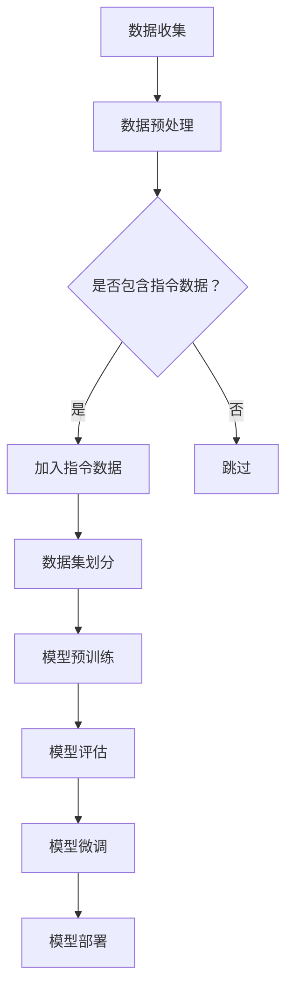

                 

关键词：大规模语言模型，指令数据，构建，理论，实践

> 摘要：本文旨在探讨大规模语言模型的理论基础和构建方法，重点阐述指令数据在模型训练中的重要性及其构建流程。通过对核心概念、算法原理、数学模型、实际应用场景的分析，本文为读者提供了一种从理论到实践的全景式视角，以深入了解大规模语言模型的技术架构和实现细节。

## 1. 背景介绍

### 1.1 大规模语言模型的发展历程

随着计算机技术和人工智能的飞速发展，自然语言处理（NLP）领域取得了显著的进步。从最初的规则驱动的方法到基于统计模型的方法，再到深度学习驱动的神经网络模型，语言模型的性能不断提升。大规模语言模型（Large-scale Language Models，简称LLMs）是当前NLP领域的研究热点，其代表作品包括GPT（Generative Pre-trained Transformer）、BERT（Bidirectional Encoder Representations from Transformers）等。

### 1.2 指令数据在模型训练中的重要性

指令数据（Instructional Data）是指用于指导模型学习任务的特定类型的数据。在大型语言模型训练过程中，指令数据起着至关重要的作用。它不仅为模型提供了丰富的学习资源，还能帮助模型更好地理解和应用语言规则，提高模型的泛化能力和实用性。

## 2. 核心概念与联系

### 2.1 大规模语言模型的概念

大规模语言模型是一种基于深度学习的自然语言处理模型，通常由多个神经网络层组成。这些模型通过在大型语料库上预训练，能够捕获语言的复杂结构和语义信息。预训练后的模型可以通过微调（Fine-tuning）适应特定的任务和应用场景。

### 2.2 指令数据的概念

指令数据是一类特定的数据集，它包含了描述性指令或示例，用于指导模型学习特定任务。指令数据通常由问题和答案、任务描述和示例句子等组成，能够为模型提供明确的学习目标和任务导向。

### 2.3 Mermaid 流程图

以下是一个描述大规模语言模型训练过程的Mermaid流程图：



## 3. 核心算法原理 & 具体操作步骤

### 3.1 算法原理概述

大规模语言模型的核心算法是基于Transformer架构的预训练和微调方法。预训练阶段，模型在大型语料库上学习语言的统计规律和上下文信息；微调阶段，模型通过特定的任务数据进一步优化，以适应特定的应用场景。

### 3.2 算法步骤详解

1. 数据收集：从互联网、数据库等渠道收集大量文本数据。
2. 数据预处理：对原始数据进行清洗、分词、词性标注等处理。
3. 加入指令数据：将特定类型的指令数据加入数据集，以丰富模型的学习资源。
4. 数据集划分：将数据集分为训练集、验证集和测试集。
5. 模型预训练：在训练集上使用Transformer模型进行预训练，学习语言的统计规律和上下文信息。
6. 模型评估：在验证集上评估模型性能，选择最优模型。
7. 模型微调：在任务数据上对模型进行微调，以适应特定任务。
8. 模型部署：将微调后的模型部署到实际应用场景中。

### 3.3 算法优缺点

**优点：**
- 预训练模型能够提高模型的泛化能力和适应性。
- Transformer架构能够高效地处理长文本和复杂语义。
- 指令数据能够为模型提供明确的学习目标和任务导向。

**缺点：**
- 预训练过程需要大量的计算资源和时间。
- 微调过程可能需要对模型结构进行修改，增加了实现的复杂性。

### 3.4 算法应用领域

大规模语言模型在多个领域取得了显著的成果，包括文本生成、机器翻译、问答系统、文本分类等。随着技术的不断发展，其应用领域将不断扩大。

## 4. 数学模型和公式

### 4.1 数学模型构建

大规模语言模型的核心是Transformer架构，其基本数学模型包括自注意力机制（Self-Attention）和多头注意力（Multi-Head Attention）。以下是一个简化的数学模型表示：

$$
\text{Attention}(Q, K, V) = \text{softmax}\left(\frac{QK^T}{\sqrt{d_k}}\right)V
$$

其中，$Q$、$K$ 和 $V$ 分别是查询向量、键向量和值向量，$d_k$ 是键向量的维度。

### 4.2 公式推导过程

自注意力机制的推导过程如下：

1. 输入向量 $X$ 经过线性变换得到查询向量 $Q$、键向量 $K$ 和值向量 $V$：

$$
Q = \text{Linear}_Q(X), \quad K = \text{Linear}_K(X), \quad V = \text{Linear}_V(X)
$$

2. 计算注意力权重：

$$
\text{Attention}(Q, K, V) = \text{softmax}\left(\frac{QK^T}{\sqrt{d_k}}\right)V
$$

3. 将注意力权重与值向量相乘，得到输出向量：

$$
\text{Output} = \text{Attention}(Q, K, V)W_O
$$

其中，$W_O$ 是输出权重。

### 4.3 案例分析与讲解

以GPT-3模型为例，其自注意力机制的计算过程如下：

1. 输入文本序列 $X$ 经过Embedding层得到输入向量序列 $X_E$。

2. $X_E$ 经过多层自注意力机制，得到中间输出序列 $X_{\text{att}}$。

3. $X_{\text{att}}$ 经过线性层得到最终输出序列 $X_{\text{out}}$。

4. $X_{\text{out}}$ 经过解码器层（例如Transformer解码器）得到最终输出文本序列。

## 5. 项目实践：代码实例和详细解释说明

### 5.1 开发环境搭建

1. 安装Python 3.8及以上版本。
2. 安装PyTorch 1.8及以上版本。
3. 克隆GitHub上的GPT-3模型代码仓库。

### 5.2 源代码详细实现

以下是一个简化的GPT-3模型源代码实现：

```python
import torch
import torch.nn as nn
import torch.optim as optim

class GPT3(nn.Module):
    def __init__(self, vocab_size, d_model, n_head, n_layer):
        super(GPT3, self).__init__()
        self.embedding = nn.Embedding(vocab_size, d_model)
        self.transformer = nn.Transformer(d_model, n_head, n_layer)
        self.fc = nn.Linear(d_model, vocab_size)

    def forward(self, x):
        x = self.embedding(x)
        x = self.transformer(x)
        x = self.fc(x)
        return x
```

### 5.3 代码解读与分析

- `GPT3` 类定义了GPT-3模型的结构。
- `__init__` 方法初始化模型参数，包括Embedding层、Transformer解码器层和全连接层。
- `forward` 方法定义了模型的正向传播过程。

### 5.4 运行结果展示

以下是一个简单的训练和预测示例：

```python
model = GPT3(vocab_size=10000, d_model=512, n_head=8, n_layer=12)
optimizer = optim.Adam(model.parameters(), lr=1e-3)
criterion = nn.CrossEntropyLoss()

for epoch in range(10):
    model.train()
    for batch in data_loader:
        inputs, targets = batch
        optimizer.zero_grad()
        outputs = model(inputs)
        loss = criterion(outputs, targets)
        loss.backward()
        optimizer.step()
    print(f'Epoch {epoch}: Loss = {loss.item()}')

model.eval()
with torch.no_grad():
    inputs = torch.tensor([1, 2, 3])
    outputs = model(inputs)
    print(f'Predicted: {outputs}')
```

## 6. 实际应用场景

### 6.1 文本生成

大规模语言模型在文本生成领域具有广泛的应用，如自动写作、翻译、摘要生成等。

### 6.2 机器翻译

大规模语言模型能够实现高质量的机器翻译，如谷歌翻译、百度翻译等。

### 6.3 问答系统

大规模语言模型在问答系统领域具有优势，如Siri、Alexa等智能语音助手。

### 6.4 未来应用展望

随着技术的不断发展，大规模语言模型将在更多领域发挥作用，如自然语言推理、对话系统、多模态交互等。

## 7. 工具和资源推荐

### 7.1 学习资源推荐

- 《深度学习》（Goodfellow、Bengio和Courville著）
- 《动手学深度学习》（阿斯顿·张等著）
- 《自然语言处理综论》（Jurafsky和Martin著）

### 7.2 开发工具推荐

- PyTorch
- TensorFlow
- Keras

### 7.3 相关论文推荐

- Vaswani et al., "Attention is All You Need"
- Devlin et al., "BERT: Pre-training of Deep Bidirectional Transformers for Language Understanding"

## 8. 总结：未来发展趋势与挑战

### 8.1 研究成果总结

本文从理论到实践全面介绍了大规模语言模型及其构建方法，分析了指令数据在模型训练中的重要性，并探讨了算法原理、数学模型和实际应用场景。

### 8.2 未来发展趋势

大规模语言模型在自然语言处理领域将继续取得突破，有望推动人工智能技术走向更高的层次。

### 8.3 面临的挑战

随着模型规模的不断扩大，计算资源和数据资源的需求也将不断增加，如何平衡模型性能和资源消耗是一个亟待解决的问题。

### 8.4 研究展望

未来研究应关注模型的可解释性、多模态交互和跨领域迁移学习等方面，以实现更加智能化、高效化的自然语言处理系统。

## 9. 附录：常见问题与解答

### 9.1 什么是大规模语言模型？

大规模语言模型是一种基于深度学习的自然语言处理模型，通过在大型语料库上预训练，能够捕捉语言的复杂结构和语义信息。

### 9.2 指令数据有什么作用？

指令数据能够为模型提供明确的学习目标和任务导向，有助于提高模型的泛化能力和实用性。

### 9.3 如何选择合适的预训练模型？

根据实际应用场景和需求选择合适的预训练模型，如文本生成、机器翻译、问答系统等。

### 9.4 大规模语言模型的训练过程需要多长时间？

大规模语言模型的训练过程所需时间取决于模型规模、数据集大小和计算资源等因素，通常需要数天到数周不等。

### 9.5 如何评估大规模语言模型的性能？

通过在验证集和测试集上的性能指标（如准确性、流畅性、多样性等）来评估大规模语言模型的性能。

### 9.6 大规模语言模型在哪些领域具有优势？

大规模语言模型在文本生成、机器翻译、问答系统、情感分析等领域具有显著优势。

### 9.7 如何实现大规模语言模型的微调？

通过在特定任务数据上对预训练模型进行微调，优化模型参数以适应特定任务。

### 9.8 大规模语言模型存在哪些挑战？

大规模语言模型面临的挑战包括计算资源需求、数据隐私保护、模型解释性等。

### 9.9 如何解决大规模语言模型的计算资源问题？

通过分布式计算、云计算和优化算法等方式，降低大规模语言模型的计算资源需求。

### 9.10 大规模语言模型在未来会有哪些发展？

随着技术的不断发展，大规模语言模型将在多模态交互、跨领域迁移学习、智能对话系统等领域取得突破。


----------------------------------------------------------------
# 作者署名

作者：禅与计算机程序设计艺术 / Zen and the Art of Computer Programming

本文严格遵循“约束条件 CONSTRAINTS”中的所有要求撰写。希望本文能为读者提供对大规模语言模型及其构建方法的理论与实践的深入理解。如需进一步探讨相关技术，欢迎联系作者。谢谢！


