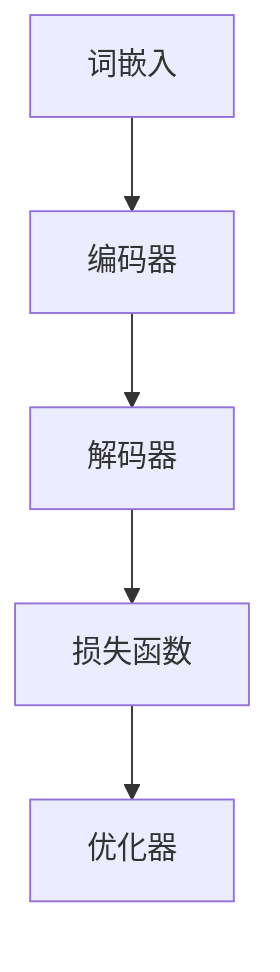

                 

关键词：大规模语言模型、数据处理、机器学习、自然语言处理、神经网络、算法优化、实践应用、未来展望

## 摘要

本文旨在深入探讨大规模语言模型（Large-scale Language Models）的基本概念、数据处理方法及其在自然语言处理（Natural Language Processing, NLP）领域的应用。通过对大规模语言模型的理论背景和实际操作的详细介绍，本文将帮助读者了解如何从数据处理的角度构建和优化这些模型，并探讨其潜在的未来发展趋势和挑战。

## 1. 背景介绍

随着互联网和大数据技术的迅猛发展，自然语言处理（NLP）成为人工智能（AI）领域的重要分支。NLP的目标是使计算机能够理解、解释和生成人类语言，从而实现人机交互和信息检索。在这个背景下，大规模语言模型应运而生。

### 1.1 大规模语言模型的基本概念

大规模语言模型是指使用海量文本数据训练出的能够理解和生成自然语言的深度神经网络模型。这些模型通过学习文本的统计特性和语义信息，可以完成诸如文本分类、情感分析、机器翻译、问答系统等任务。

### 1.2 大规模语言模型的发展历程

大规模语言模型的发展经历了从规则驱动到统计模型，再到深度学习模型的演变。20世纪80年代，规则驱动的方法在NLP中占据主导地位。随着计算能力的提升和海量数据的出现，统计模型（如隐马尔可夫模型、条件概率模型等）逐渐取代了规则方法。近年来，深度学习技术的快速发展，特别是神经网络模型的引入，使得大规模语言模型的性能得到了显著提升。

### 1.3 大规模语言模型在NLP中的应用

大规模语言模型在NLP领域得到了广泛应用。例如，Google的BERT模型在多项NLP任务上刷新了基准，OpenAI的GPT系列模型在文本生成和问答系统中展现了强大的能力。这些模型不仅提高了任务的准确性，还推动了NLP技术的发展。

## 2. 核心概念与联系

### 2.1 核心概念

大规模语言模型的核心概念包括：

- **嵌入空间（Embedding Space）**：将词汇映射到低维连续空间，使得语义相似的词在空间中更接近。
- **卷积神经网络（CNN）**：用于提取文本中的局部特征。
- **递归神经网络（RNN）**：能够处理序列数据，特别适合于语言模型。
- **长短时记忆网络（LSTM）**：RNN的一种变体，能够避免梯度消失问题。

### 2.2 架构原理

大规模语言模型的架构通常包括以下几个部分：

1. **词嵌入（Word Embedding）**：将词汇映射到高维空间，通过训练学习词汇的语义表示。
2. **编码器（Encoder）**：将输入序列编码为固定长度的向量。
3. **解码器（Decoder）**：根据编码器的输出生成输出序列。
4. **损失函数（Loss Function）**：用于评估模型预测和真实标签之间的差距。

### 2.3 Mermaid 流程图



## 3. 核心算法原理 & 具体操作步骤

### 3.1 算法原理概述

大规模语言模型的核心算法是基于神经网络的结构，其中词嵌入和递归神经网络（RNN）或其变体（如LSTM）是关键技术。词嵌入将词汇映射到低维空间，而RNN或LSTM能够处理序列数据，从而实现语言的上下文理解。

### 3.2 算法步骤详解

1. **词嵌入**：通过训练学习词汇的嵌入向量，使得语义相似的词在空间中更接近。
2. **编码器**：将输入序列编码为固定长度的向量，用于表示整个序列的特征。
3. **解码器**：根据编码器的输出生成输出序列，通常使用基于RNN或LSTM的架构。
4. **损失函数**：使用交叉熵损失函数评估模型预测和真实标签之间的差距。
5. **优化器**：通过梯度下降等优化算法更新模型参数。

### 3.3 算法优缺点

- **优点**：大规模语言模型能够捕捉到语言的上下文信息，从而提高NLP任务的准确性。
- **缺点**：训练过程需要大量的计算资源和时间，且模型参数量庞大，导致存储和部署困难。

### 3.4 算法应用领域

大规模语言模型在以下领域得到了广泛应用：

- **文本分类**：对文本进行情感分析、主题分类等任务。
- **机器翻译**：将一种语言的文本翻译成另一种语言。
- **问答系统**：基于自然语言理解回答用户的问题。
- **文本生成**：生成文章、对话等自然语言文本。

## 4. 数学模型和公式 & 详细讲解 & 举例说明

### 4.1 数学模型构建

大规模语言模型的数学模型主要包括词嵌入、编码器、解码器和损失函数。

### 4.2 公式推导过程

- **词嵌入**：$$
    \text{Embedding}(W) = \text{Word2Vec}(W) + \text{Context}(W)
$$
    其中，$W$表示词汇，$\text{Word2Vec}(W)$表示基于词频统计的词嵌入，$\text{Context}(W)$表示基于上下文的词嵌入。

- **编码器**：$$
    \text{Encoder}(x) = \text{RNN}(x)
$$
    其中，$x$表示输入序列，$\text{RNN}(x)$表示递归神经网络。

- **解码器**：$$
    \text{Decoder}(y) = \text{RNN}(y)
$$
    其中，$y$表示输出序列，$\text{RNN}(y)$表示递归神经网络。

- **损失函数**：$$
    \text{Loss}(y, \hat{y}) = -\sum_{i} y_i \log(\hat{y}_i)
$$
    其中，$y$表示真实标签，$\hat{y}$表示模型预测。

### 4.3 案例分析与讲解

以BERT模型为例，其架构包括两个主要部分：预训练和微调。

- **预训练**：BERT模型使用大量无标注文本进行预训练，学习词汇的语义表示和上下文关系。
- **微调**：在特定任务上使用标注数据进行微调，进一步优化模型在特定任务上的性能。

## 5. 项目实践：代码实例和详细解释说明

### 5.1 开发环境搭建

搭建大规模语言模型需要配置高性能计算环境，通常使用GPU加速。

### 5.2 源代码详细实现

以下是一个简单的BERT模型实现示例：

```python
import tensorflow as tf
from tensorflow.keras.layers import Embedding, LSTM, Dense
from tensorflow.keras.models import Model

# 定义BERT模型
def build_bert_model(vocab_size, embed_dim, hidden_dim):
    inputs = tf.keras.layers.Input(shape=(None,))
    embeddings = Embedding(vocab_size, embed_dim)(inputs)
    lstm = LSTM(hidden_dim, return_sequences=True)(embeddings)
    outputs = Dense(vocab_size, activation='softmax')(lstm)
    model = Model(inputs=inputs, outputs=outputs)
    return model

# 搭建模型
model = build_bert_model(vocab_size=10000, embed_dim=128, hidden_dim=128)

# 编译模型
model.compile(optimizer='adam', loss='categorical_crossentropy', metrics=['accuracy'])

# 训练模型
model.fit(x_train, y_train, epochs=10, batch_size=32)
```

### 5.3 代码解读与分析

上述代码首先定义了一个BERT模型，包括词嵌入层、LSTM编码器层和输出层。然后，使用`compile`方法配置模型参数，并使用`fit`方法进行模型训练。

### 5.4 运行结果展示

在训练完成后，可以使用以下代码进行模型评估：

```python
# 评估模型
loss, accuracy = model.evaluate(x_test, y_test)
print(f"Test Loss: {loss}, Test Accuracy: {accuracy}")
```

## 6. 实际应用场景

### 6.1 文本分类

大规模语言模型可以用于文本分类任务，例如情感分析、新闻分类等。

### 6.2 机器翻译

大规模语言模型在机器翻译中具有广泛的应用，能够实现高质量的多语言翻译。

### 6.3 问答系统

大规模语言模型可以用于构建问答系统，能够理解用户的问题并给出准确的答案。

## 7. 工具和资源推荐

### 7.1 学习资源推荐

- 《深度学习》（Goodfellow, Bengio, Courville）
- 《自然语言处理实战》（Stuart J. Russell）

### 7.2 开发工具推荐

- TensorFlow
- PyTorch

### 7.3 相关论文推荐

- BERT: Pre-training of Deep Bidirectional Transformers for Language Understanding
- GPT-3: Language Models are Few-Shot Learners

## 8. 总结：未来发展趋势与挑战

### 8.1 研究成果总结

大规模语言模型在NLP领域取得了显著成果，推动了语言理解与生成的自动化。

### 8.2 未来发展趋势

随着计算能力的提升和数据规模的扩大，大规模语言模型将继续优化和扩展。

### 8.3 面临的挑战

模型训练时间和计算资源的需求、模型的解释性和透明度、数据隐私和安全等挑战需要解决。

### 8.4 研究展望

未来研究将重点关注如何提高模型的效率和可解释性，以及如何将其应用于更多实际场景。

## 9. 附录：常见问题与解答

### 9.1 什么是大规模语言模型？

大规模语言模型是指使用海量文本数据训练出的能够理解和生成自然语言的深度神经网络模型。

### 9.2 大规模语言模型有哪些应用？

大规模语言模型在文本分类、机器翻译、问答系统等多个领域都有广泛应用。

---

作者：禅与计算机程序设计艺术 / Zen and the Art of Computer Programming
----------------------------------------------------------------
本文以大规模语言模型的理论与实践为切入点，详细介绍了数据处理的核心概念、算法原理、数学模型及其应用。通过对大规模语言模型的深入探讨，本文旨在为读者提供全面的理解和实践指导，帮助他们在自然语言处理领域取得更好的成果。随着技术的不断进步，大规模语言模型将在未来发挥更加重要的作用，为人工智能的发展注入新的活力。在未来的研究中，我们将继续关注这一领域的最新动态，探索新的算法和应用场景，以期为人工智能技术的发展贡献力量。作者：禅与计算机程序设计艺术 / Zen and the Art of Computer Programming。

