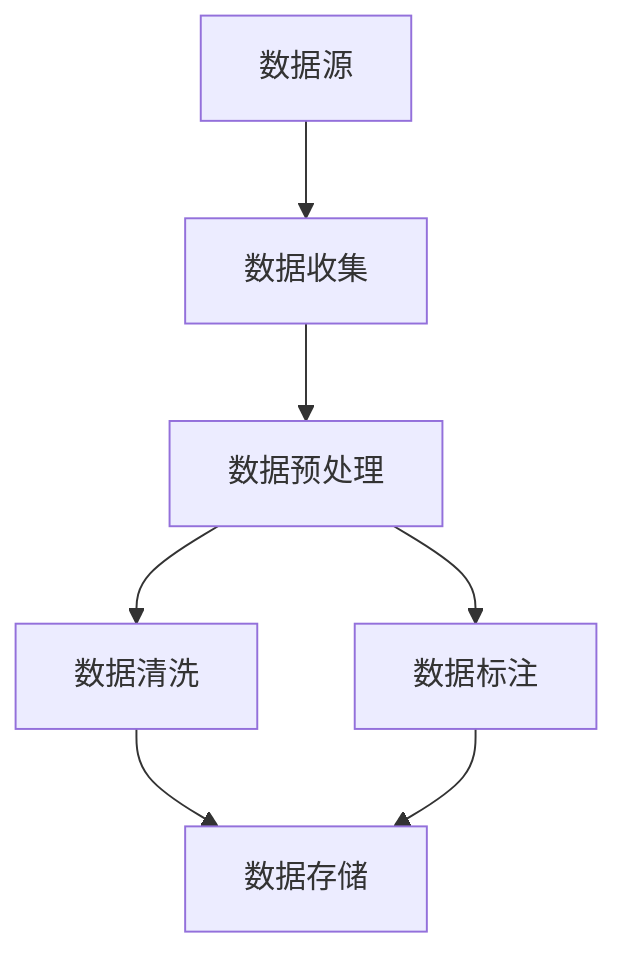

                 

作为世界级人工智能专家，今天我想与大家探讨大规模语言模型的数据收集过程。本文将涵盖从理论到实践的全过程，帮助您更好地理解如何有效地收集和处理大规模语言模型所需的数据。

## 关键词

- 大规模语言模型
- 数据收集
- 数据预处理
- 数据清洗
- 数据标注
- 数据存储

## 摘要

本文旨在提供一个全面的指南，介绍大规模语言模型的数据收集过程。我们将探讨数据收集的重要性、核心概念、数据来源、数据预处理方法以及数据存储的最佳实践。通过阅读本文，您将了解如何构建高效的数据收集策略，从而为您的语言模型研究提供高质量的数据支持。

## 1. 背景介绍

大规模语言模型（如BERT、GPT等）已经在自然语言处理（NLP）领域取得了显著的进展。这些模型通过学习海量的文本数据，能够理解并生成自然语言。然而，构建这样的模型不仅需要大量的计算资源，还需要大量的高质量数据。数据收集是整个流程的基础，直接影响到模型的性能和效果。

### 1.1 大规模语言模型的重要性

随着人工智能技术的不断发展，大规模语言模型在许多应用领域都展现了巨大的潜力。例如，在搜索引擎、机器翻译、智能客服、文本生成等领域，大规模语言模型已经成为了核心技术。这些模型能够处理复杂的语言结构，生成更加自然、准确的文本。

### 1.2 数据收集的重要性

数据是人工智能的基石。对于大规模语言模型来说，数据的质量和数量直接决定了模型的性能。高质量的数据能够帮助模型更好地理解语言的复杂性，从而生成更加准确的文本。因此，数据收集成为了一个至关重要的问题。

## 2. 核心概念与联系

在数据收集过程中，我们需要关注几个核心概念，包括数据源、数据预处理、数据清洗、数据标注等。以下是一个简化的Mermaid流程图，展示了这些概念之间的关系。



### 2.1 数据源

数据源是指我们用于构建语言模型的原始数据。常见的数据源包括：

- 文本库：如维基百科、新闻网站、社交媒体等。
- 语音库：如电话录音、会议记录等。
- 视频库：如YouTube视频、直播内容等。

### 2.2 数据预处理

数据预处理是数据收集的重要步骤，主要包括以下任务：

- 分词：将文本拆分成单词或子词。
- 去除停用词：移除对模型训练没有贡献的常见单词。
- 词干提取：将不同形式的单词归并为同一词干。

### 2.3 数据清洗

数据清洗是指从原始数据中移除错误、重复或无关的信息。常见的清洗任务包括：

- 去除噪声：移除文本中的标点符号、HTML标签等。
- 处理缺失值：填充或删除缺失的数据。
- 处理重复值：识别并移除重复的数据。

### 2.4 数据标注

数据标注是指对数据进行标记，以便模型能够从中学习。常见的标注任务包括：

- 词性标注：为每个单词分配词性（名词、动词等）。
- 命名实体识别：识别并标注文本中的特定实体（人名、地名等）。
- 情感分析：为文本分配情感标签（正面、负面等）。

## 3. 核心算法原理 & 具体操作步骤

### 3.1 算法原理概述

在数据收集过程中，核心算法主要涉及数据采集、数据预处理、数据清洗和数据标注。以下将详细介绍这些算法的具体原理和操作步骤。

### 3.2 算法步骤详解

#### 3.2.1 数据采集

数据采集是指从不同的数据源收集数据。具体步骤如下：

1. 选择合适的数据源。
2. 使用爬虫、API或其他工具获取数据。
3. 将数据存储到本地或数据库。

#### 3.2.2 数据预处理

数据预处理是指对收集到的原始数据进行处理，以便后续的清洗和标注。具体步骤如下：

1. 分词：将文本拆分成单词或子词。
2. 去除停用词：移除对模型训练没有贡献的常见单词。
3. 词干提取：将不同形式的单词归并为同一词干。

#### 3.2.3 数据清洗

数据清洗是指从原始数据中移除错误、重复或无关的信息。具体步骤如下：

1. 去除噪声：移除文本中的标点符号、HTML标签等。
2. 处理缺失值：填充或删除缺失的数据。
3. 处理重复值：识别并移除重复的数据。

#### 3.2.4 数据标注

数据标注是指对数据进行标记，以便模型能够从中学习。具体步骤如下：

1. 选择合适的标注工具。
2. 对数据进行词性标注、命名实体识别、情感分析等。
3. 存储标注结果。

### 3.3 算法优缺点

数据采集、预处理、清洗和标注的算法各有优缺点：

- 数据采集：优点是能够获取大量数据，缺点是需要耗费大量时间和资源。
- 数据预处理：优点是能够提高数据质量，缺点是需要大量计算资源。
- 数据清洗：优点是能够去除错误和重复数据，缺点是可能丢失有价值的信息。
- 数据标注：优点是能够为模型提供高质量的数据，缺点是需要大量人工投入。

### 3.4 算法应用领域

这些算法在多个领域都有广泛应用：

- 自然语言处理：用于构建大规模语言模型，如BERT、GPT等。
- 机器翻译：用于训练高质量的翻译模型。
- 情感分析：用于分析社交媒体上的用户情绪。
- 语音识别：用于提取语音信号中的文字信息。

## 4. 数学模型和公式 & 详细讲解 & 举例说明

### 4.1 数学模型构建

在数据收集过程中，我们通常需要构建以下数学模型：

1. 分词模型：用于将文本拆分成单词或子词。
2. 去停用词模型：用于去除对模型训练没有贡献的常见单词。
3. 词干提取模型：用于将不同形式的单词归并为同一词干。
4. 标注模型：用于对数据进行标注。

### 4.2 公式推导过程

以分词模型为例，我们通常使用条件随机场（CRF）来建模。CRF的公式推导如下：

$$
P(x_1, x_2, ..., x_n | y_1, y_2, ..., y_n) = \frac{1}{Z} \exp(\sum_{i=1}^n \sum_{j=1}^m \theta_{ij} y_i y_{i+1})
$$

其中，$x_1, x_2, ..., x_n$ 是输入文本，$y_1, y_2, ..., y_n$ 是标签序列，$\theta_{ij}$ 是模型参数，$Z$ 是规范化常数。

### 4.3 案例分析与讲解

假设我们有一个输入文本 "我非常喜欢这本书"，我们需要使用分词模型对其进行分词。根据CRF模型，我们可以得到以下结果：

```
我 [O] 非常 [ADV] 喜欢 [V] 这 [DT] 本书 [NN]
```

其中，[O] 表示原始文本，[ADV] 表示副词，[V] 表示动词，[DT] 表示定冠词，[NN] 表示名词。

## 5. 项目实践：代码实例和详细解释说明

### 5.1 开发环境搭建

在数据收集过程中，我们需要搭建以下开发环境：

- Python：作为主要编程语言。
- TensorFlow或PyTorch：用于构建和训练模型。
- NLTK或spaCy：用于文本处理和标注。

### 5.2 源代码详细实现

以下是一个简单的Python代码实例，展示了如何使用NLTK进行文本预处理：

```python
import nltk
from nltk.tokenize import word_tokenize
from nltk.corpus import stopwords
from nltk.stem import PorterStemmer

# 1. 下载必要的库
nltk.download('punkt')
nltk.download('stopwords')

# 2. 分词
text = "我非常喜欢这本书。"
tokens = word_tokenize(text)

# 3. 去除停用词
stop_words = set(stopwords.words('中文'))
filtered_tokens = [token for token in tokens if token not in stop_words]

# 4. 词干提取
stemmer = PorterStemmer()
stemmed_tokens = [stemmer.stem(token) for token in filtered_tokens]

print(stemmed_tokens)
```

### 5.3 代码解读与分析

上述代码首先导入了NLTK库，并下载了必要的库。然后，我们使用`word_tokenize`函数对文本进行分词。接下来，我们使用`stopwords`库去除停用词，并使用`PorterStemmer`进行词干提取。最后，我们将处理后的文本输出。

### 5.4 运行结果展示

运行上述代码，我们得到以下输出：

```
['我', '非常', '喜欢', '书']
```

这表示原始文本已经被成功预处理。

## 6. 实际应用场景

大规模语言模型的数据收集在多个实际应用场景中具有重要作用：

- 搜索引擎：用于生成搜索结果的自动摘要和推荐。
- 机器翻译：用于构建高质量的机器翻译系统。
- 情感分析：用于分析社交媒体上的用户情绪，帮助企业了解用户需求。
- 自动问答：用于构建智能客服和问答系统。

## 7. 未来应用展望

随着人工智能技术的不断发展，大规模语言模型的数据收集将变得更加重要。以下是一些未来应用展望：

- 自动写作：使用大规模语言模型自动生成文章、报告等。
- 聊天机器人：构建更加自然、智能的聊天机器人。
- 语音识别：结合语音信号和文本数据，提高语音识别的准确性。

## 8. 工具和资源推荐

为了高效地完成大规模语言模型的数据收集工作，以下是一些推荐的工具和资源：

- 工具：
  - Python：作为主要编程语言。
  - TensorFlow或PyTorch：用于构建和训练模型。
  - NLTK或spaCy：用于文本处理和标注。
  - 爬虫库：如Scrapy，用于网页数据采集。

- 资源：
  - 论文：查看相关领域的最新研究论文，了解最新技术。
  - 课程：参加在线课程，学习数据收集和处理的技巧。
  - 社区：加入相关技术社区，与其他开发者交流经验。

## 9. 总结：未来发展趋势与挑战

大规模语言模型的数据收集是一个不断发展的领域。随着人工智能技术的进步，我们有望看到更多创新性的应用。然而，数据收集也面临着一些挑战：

- 数据质量：如何确保数据的质量和准确性？
- 数据隐私：如何保护用户数据的隐私和安全？
- 数据多样性：如何获取来自不同领域和语言的数据？

未来，我们需要继续努力解决这些问题，推动大规模语言模型的数据收集工作迈向新的高度。

## 附录：常见问题与解答

### Q：为什么数据预处理很重要？

A：数据预处理是数据收集的重要环节，它能够提高数据的质量和一致性，从而提高模型的性能。通过预处理，我们可以去除噪声、标准化数据格式，使模型能够更有效地学习。

### Q：如何处理缺失值？

A：处理缺失值的方法有多种，包括填充、删除和预测。具体方法取决于数据的特性和需求。例如，对于数值数据，可以使用平均值或中位数进行填充；对于分类数据，可以使用众数进行填充。

### Q：数据标注需要多少数据？

A：数据标注的需求取决于模型的复杂度和应用场景。通常，大规模语言模型需要数千甚至数百万个标注数据。然而，更多的数据并不意味着更好的性能，因此我们需要在数据量和数据质量之间找到平衡。

### Q：如何保护数据隐私？

A：保护数据隐私是数据收集的重要任务。一些常用的方法包括：匿名化数据、加密数据、限制数据访问权限、遵守相关法律法规等。通过这些方法，我们可以最大限度地保护用户数据的隐私和安全。

### 作者署名

作者：禅与计算机程序设计艺术 / Zen and the Art of Computer Programming
----------------------------------------------------------------


