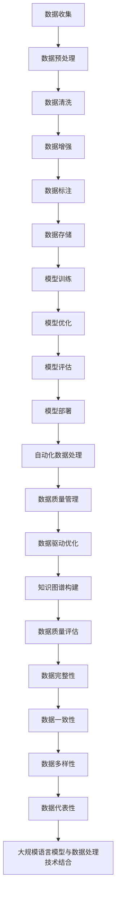

                 

### 1. 背景介绍

大规模语言模型（Large-scale Language Models）在自然语言处理（NLP）领域引起了广泛关注。近年来，随着深度学习技术的发展和计算资源的提升，大规模语言模型取得了显著的进步。这些模型可以捕捉到语言中的复杂结构和语义信息，使得机器在文本生成、翻译、问答等任务上取得了前所未有的性能。

然而，大规模语言模型的发展不仅依赖于模型的规模和复杂性，更依赖于数据的质量。数据质量对模型的性能和稳定性有着至关重要的影响。一个高质量的数据集可以使得模型更好地学习语言的规律和模式，从而提高其在实际应用中的效果。相反，一个低质量的数据集可能会导致模型出现过拟合、泛化能力差等问题，从而影响其性能。

本文将探讨大规模语言模型中的数据质量问题，从数据收集、处理、清洗和验证等方面进行深入分析。我们将介绍数据质量对模型性能的影响，并讨论如何提高数据质量的方法。通过本文的阅读，读者将能够了解数据质量在大规模语言模型构建中的重要性，并掌握一些实用的数据处理技巧。

## 1.1 大规模语言模型的发展历程

大规模语言模型的发展可以追溯到2000年代初期。当时，研究人员开始探索使用神经网络进行自然语言处理。早期的语言模型主要基于循环神经网络（RNN）和卷积神经网络（CNN），这些模型在处理序列数据方面表现出了一定的效果。然而，由于数据集规模有限，模型的性能受到很大限制。

随着深度学习技术的成熟和计算资源的提升，研究人员开始尝试构建更大规模的语言模型。2013年，Google推出了基于深度神经网络的神经网络语言模型（Neural Network Language Model, NNLMM），它使用了数十亿级别的参数，显著提高了语言模型的性能。此后，深度学习在NLP领域得到了广泛应用，大规模语言模型逐渐成为研究的热点。

2018年，OpenAI推出了GPT（Generative Pre-trained Transformer）模型，这是一个基于Transformer架构的大型语言模型。GPT-1使用了约1.17亿个参数，GPT-2则达到了15亿个参数。GPT系列模型在多项NLP任务上取得了优异的成绩，引发了广泛关注。

随后，更多大型语言模型相继涌现，如Google的BERT（Bidirectional Encoder Representations from Transformers）、Facebook的RoBERTa（A Robustly Optimized BERT Pretraining Approach）等。这些模型不仅在语言理解任务上表现出色，还在文本生成、机器翻译等应用中取得了显著效果。

## 1.2 数据质量在模型性能中的作用

数据质量是大规模语言模型性能的关键因素之一。一个高质量的数据集可以帮助模型更好地学习语言的规律和模式，从而提高其在实际应用中的效果。以下是数据质量对模型性能的几个关键影响：

### 1.2.1 过拟合与泛化能力

过拟合是指模型在训练数据上表现出色，但在未知数据上性能不佳的现象。一个低质量的数据集可能导致模型出现过拟合，因为它可能包含噪声或异常值，使得模型无法提取到真正的数据特征。而过拟合会严重影响模型的泛化能力，使得模型无法应对新的任务或数据。

相反，一个高质量的数据集可以帮助模型更好地拟合数据，提高其泛化能力。通过清洗和处理数据，我们可以去除噪声和异常值，从而让模型更准确地学习到数据的真实特征。

### 1.2.2 特征表示与模型学习能力

大规模语言模型通常使用神经网络进行训练，神经网络的学习能力取决于输入数据的特征表示。一个高质量的数据集可以提供丰富的特征信息，有助于模型更好地捕捉数据的结构和模式。

例如，在文本分类任务中，一个高质量的数据集应该包含丰富的文本样本，这些样本能够涵盖各种主题和表达方式。这样，模型可以学习到不同主题和表达方式之间的区别，从而提高分类的准确性。

### 1.2.3 模型稳定性与可靠性

低质量的数据可能会引入错误或异常值，这些错误会影响模型的稳定性。例如，在机器翻译任务中，一个错误的数据样本可能会导致模型产生错误的翻译结果，从而影响整体的翻译质量。

一个高质量的数据集可以降低错误和异常值的比例，提高模型的稳定性和可靠性。通过严格的数据清洗和处理，我们可以确保模型在处理数据时能够产生一致的结果。

## 1.3 本文内容概述

本文将深入探讨大规模语言模型中的数据质量问题。首先，我们将介绍大规模语言模型的基本概念和原理。然后，我们将详细讨论数据质量对模型性能的影响，并分析数据质量问题的来源。接下来，我们将介绍一些常用的数据处理和清洗方法，包括数据收集、处理、清洗和验证等环节。随后，我们将讨论如何提高数据质量，并介绍一些实用的技巧和工具。

本文还将通过具体实例，展示如何在实际项目中处理和清洗数据。最后，我们将总结本文的主要观点，并展望大规模语言模型和数据处理技术的发展趋势。希望通过本文的阅读，读者能够对大规模语言模型中的数据质量问题有更深入的理解，并掌握一些实用的数据处理技巧。
----------------------------------------------------------------

### 2. 核心概念与联系

#### 2.1 大规模语言模型的基本概念

大规模语言模型是一种基于深度学习的自然语言处理模型，它通过学习大量的文本数据来捕捉语言的复杂结构和语义信息。这类模型通常采用预先训练（pre-training）和微调（fine-tuning）的方式进行训练和部署。其中，预先训练是指模型在大量文本数据上学习语言的通用特征，而微调则是在特定任务上对模型进行进一步调整，以提高其在该任务上的性能。

大规模语言模型的主要组成部分包括编码器（Encoder）、解码器（Decoder）和嵌入层（Embedding Layer）。编码器负责将输入文本转换为固定长度的向量表示，解码器则将这些向量表示转换为输出文本。嵌入层则是将单词映射为稠密向量，为模型提供输入数据。

#### 2.2 数据质量与模型性能的关系

数据质量是影响大规模语言模型性能的关键因素。一个高质量的数据集可以帮助模型更好地学习语言的规律和模式，从而提高其在实际应用中的效果。以下是数据质量与模型性能之间的几个关键联系：

1. **特征表示**：高质量的数据集能够提供丰富的特征信息，有助于模型更好地捕捉数据的结构和模式。例如，在文本分类任务中，一个高质量的数据集应该包含各种主题和表达方式的文本样本，这样模型可以学习到不同主题和表达方式之间的区别。

2. **过拟合与泛化能力**：低质量的数据集可能导致模型出现过拟合，因为它可能包含噪声或异常值，使得模型无法提取到真正的数据特征。而过拟合会严重影响模型的泛化能力，使得模型无法应对新的任务或数据。因此，高质量的数据集可以提高模型的泛化能力。

3. **模型稳定性与可靠性**：低质量的数据可能会引入错误或异常值，这些错误会影响模型的稳定性。例如，在机器翻译任务中，一个错误的数据样本可能会导致模型产生错误的翻译结果，从而影响整体的翻译质量。因此，高质量的数据集可以提高模型的稳定性和可靠性。

4. **训练效率**：高质量的数据集可以减少训练过程中的计算量，提高训练效率。这是因为高质量的数据集中的样本更加具有代表性，模型可以更快地收敛到最佳性能。

#### 2.3 数据质量问题的来源

数据质量问题的来源可以分为以下几个方面：

1. **数据收集**：在数据收集过程中，可能由于数据源的选择不当、数据采集方法不当等原因，导致数据存在缺失、重复、不一致等问题。

2. **数据预处理**：在数据预处理过程中，可能由于数据格式不统一、数据清洗不彻底等原因，导致数据存在噪声、异常值等问题。

3. **数据标注**：在数据标注过程中，可能由于标注人员的专业水平、标注标准不统一等原因，导致数据标注不准确。

4. **数据存储**：在数据存储过程中，可能由于数据存储方式不当、数据备份不完善等原因，导致数据丢失或损坏。

#### 2.4 数据质量与大规模语言模型的联系

数据质量与大规模语言模型的联系主要体现在以下几个方面：

1. **训练数据集**：大规模语言模型的训练数据集是模型性能的基础。一个高质量的数据集可以提供丰富的训练样本，有助于模型更好地学习语言的规律和模式。

2. **模型优化**：高质量的数据集可以帮助模型在优化过程中更快地收敛到最佳性能。这是因为高质量的数据集中的样本更加具有代表性，模型可以更快地找到最佳参数。

3. **模型泛化能力**：高质量的数据集可以提高模型的泛化能力，使其在新的任务或数据上表现出更好的性能。这是因为高质量的数据集可以确保模型学习到的特征具有较强的普遍性。

4. **模型稳定性**：高质量的数据集可以降低模型在训练过程中出现不稳定现象的风险，从而提高模型的稳定性。这是因为高质量的数据集中的样本更加具有一致性，模型可以更好地处理这些样本。

#### 2.5 数据质量提升的方法

为了提高大规模语言模型的数据质量，可以采取以下几种方法：

1. **数据清洗**：通过删除重复数据、填补缺失值、去除噪声等方法，提高数据集的质量。

2. **数据增强**：通过生成新的数据样本、调整数据分布等方法，丰富数据集的内容，提高模型的泛化能力。

3. **数据标注**：采用自动化标注工具和人工标注相结合的方式，提高数据标注的准确性。

4. **数据存储**：采用高效的数据存储和管理方法，确保数据的安全性和完整性。

#### 2.6 数据质量评估指标

为了评估数据质量，可以采用以下指标：

1. **数据完整性**：衡量数据集中缺失值的比例。

2. **数据一致性**：衡量数据集中数据的一致性和准确性。

3. **数据多样性**：衡量数据集中样本的多样性，包括主题、表达方式、词汇等。

4. **数据代表性**：衡量数据集在各个类别上的代表性，确保数据集能够覆盖各种情况。

#### 2.7 大规模语言模型与数据处理技术的结合

大规模语言模型与数据处理技术的结合体现在以下几个方面：

1. **自动化数据处理**：利用深度学习技术，实现自动化数据清洗、标注和增强。

2. **数据质量管理**：通过数据质量评估指标，实时监控数据质量，及时发现和处理数据质量问题。

3. **数据驱动优化**：根据数据质量的变化，动态调整模型参数和训练策略，提高模型性能。

4. **知识图谱构建**：利用大规模语言模型和数据处理技术，构建知识图谱，提高数据的可解释性和利用效率。

### 2.8 Mermaid 流程图

下面是一个Mermaid流程图，展示了大规模语言模型与数据处理技术的结合过程：



通过这个流程图，我们可以清晰地看到大规模语言模型与数据处理技术之间的相互作用和结合方式。数据处理技术的应用不仅提高了大规模语言模型的数据质量，也提升了模型在各个应用场景中的性能和效果。
----------------------------------------------------------------

### 3. 核心算法原理 & 具体操作步骤

#### 3.1 算法原理概述

大规模语言模型的构建主要基于深度学习和自然语言处理技术。其中，Transformer架构是大规模语言模型的核心算法之一。Transformer模型通过自注意力机制（Self-Attention Mechanism）来捕捉输入文本序列中的长距离依赖关系，从而提高模型的性能。

#### 3.2 算法步骤详解

1. **数据收集与预处理**：

   - 数据收集：从互联网、书籍、新闻、社交媒体等多种来源收集大量的文本数据。
   - 数据预处理：对收集到的文本数据进行清洗、分词、去停用词等预处理操作，将文本转换为模型可处理的格式。

2. **嵌入层（Embedding Layer）**：

   - 嵌入层将单词映射为稠密向量表示。通常采用预训练的词向量（如Word2Vec、GloVe等）或自行训练的词向量。

3. **编码器（Encoder）**：

   - 编码器是Transformer模型的核心部分，通过自注意力机制处理输入序列。编码器将输入文本序列编码为一系列上下文向量。
   - 自注意力机制计算每个输入词与其他词之间的关联强度，并根据这些关联强度对输入词进行加权求和，得到上下文向量。

4. **解码器（Decoder）**：

   - 解码器通过自注意力和交叉注意力机制生成输出文本。自注意力机制用于处理输出序列中的单词，而交叉注意力机制用于将编码器的上下文向量与输出序列中的单词进行关联。

5. **损失函数与优化**：

   - 通常使用交叉熵损失函数（Cross-Entropy Loss）来衡量模型预测与真实标签之间的差异。
   - 通过反向传播算法（Backpropagation）和梯度下降（Gradient Descent）优化模型参数，降低损失函数值。

6. **模型微调（Fine-tuning）**：

   - 在特定任务上对预训练模型进行微调，调整模型参数以适应新任务的需求。
   - 微调过程中，可以在预训练模型的基础上增加新的训练数据，或通过冻结部分层的方式减少参数更新。

7. **模型评估与部署**：

   - 使用测试数据集评估模型性能，包括准确率、召回率、F1分数等指标。
   - 将训练好的模型部署到实际应用场景中，如文本生成、机器翻译、问答系统等。

#### 3.3 算法优缺点

**优点**：

- **捕捉长距离依赖**：通过自注意力机制，Transformer模型能够有效地捕捉输入文本序列中的长距离依赖关系。
- **并行计算**：Transformer模型可以并行计算，提高了训练和推理的效率。
- **通用性**：预训练模型可以迁移到不同的任务和应用场景，提高了模型的通用性和泛化能力。

**缺点**：

- **计算资源消耗大**：大规模语言模型通常需要大量的计算资源和存储空间。
- **训练时间较长**：由于模型参数数量庞大，训练过程相对较长，且在数据量较大的情况下，训练过程可能需要更长的时间。
- **过拟合风险**：在训练过程中，模型可能会出现过拟合现象，尤其是在数据量有限的情况下。

#### 3.4 算法应用领域

大规模语言模型在多个领域取得了显著的应用成果：

- **文本生成**：如文本摘要、文章写作、对话系统等。
- **机器翻译**：如中英翻译、多语言翻译等。
- **情感分析**：如文本情感分类、情绪识别等。
- **问答系统**：如基于知识图谱的问答系统、对话式搜索引擎等。
- **文本分类**：如新闻分类、垃圾邮件过滤等。

### 3.5 数据质量对算法性能的影响

数据质量对大规模语言模型的性能有着至关重要的影响。以下是数据质量对算法性能的具体影响：

1. **过拟合与泛化能力**：

   - 低质量的数据可能导致模型出现过拟合，使其在训练数据上表现出色，但在未知数据上性能不佳。
   - 高质量的数据可以降低过拟合风险，提高模型的泛化能力。

2. **特征表示与模型学习能力**：

   - 高质量的数据集可以提供丰富的特征信息，有助于模型更好地捕捉数据的结构和模式。
   - 低质量的数据可能包含噪声或异常值，影响模型的学习能力。

3. **模型稳定性与可靠性**：

   - 低质量的数据可能会引入错误或异常值，导致模型产生错误的预测结果。
   - 高质量的数据可以提高模型的稳定性和可靠性，使其在处理数据时能够产生一致的结果。

4. **训练效率**：

   - 高质量的数据集可以减少训练过程中的计算量，提高训练效率。
   - 低质量的数据可能需要额外的预处理步骤，增加训练时间。

### 3.6 数据处理流程

为了确保大规模语言模型的性能，数据处理流程至关重要。以下是数据处理流程的详细步骤：

1. **数据收集**：

   - 从互联网、书籍、新闻、社交媒体等多种来源收集大量文本数据。
   - 选择多样化的数据来源，确保数据集的多样性和代表性。

2. **数据预处理**：

   - 清洗数据：去除无效数据、噪声和异常值。
   - 分词：将文本拆分为单词或子词。
   - 去停用词：去除对模型性能影响不大的停用词。
   - 转换为序列：将文本序列转换为序列编号或向量表示。

3. **数据清洗**：

   - 填补缺失值：使用统计方法、插值法或生成模型等方法填补缺失值。
   - 去除重复数据：检测并删除重复的文本样本。
   - 去除噪声：通过滤波器、平滑技术等方法去除噪声。
   - 去除异常值：检测并删除异常值，如错别字、语法错误等。

4. **数据增强**：

   - 数据增强：通过旋转、缩放、裁剪、添加噪声等方法生成新的数据样本，丰富数据集的内容。
   - 数据平衡：调整数据集中各类别的比例，确保数据集的平衡性。

5. **数据标注**：

   - 自动标注：使用自动化标注工具进行初步标注。
   - 人工标注：人工审核标注结果，修正错误，提高标注的准确性。

6. **数据存储**：

   - 选择高效的数据存储和管理方法，确保数据的安全性和完整性。
   - 采用分布式存储，提高数据读取和写入的效率。

7. **数据质量评估**：

   - 使用数据质量评估指标（如数据完整性、数据一致性、数据多样性、数据代表性等）评估数据质量。
   - 根据评估结果，对数据集进行进一步的清洗和优化。

通过上述数据处理流程，我们可以确保大规模语言模型的数据质量，从而提高模型在各个应用场景中的性能和效果。
----------------------------------------------------------------

### 4. 数学模型和公式 & 详细讲解 & 举例说明

在构建大规模语言模型的过程中，数学模型和公式起到了至关重要的作用。这些模型和公式帮助我们从理论上理解和分析模型的运作机制，同时为实际操作提供了具体的指导。本章节将详细介绍大规模语言模型中常用的数学模型和公式，并通过具体的实例进行讲解。

#### 4.1 数学模型构建

大规模语言模型的数学模型主要包括嵌入层、编码器、解码器和损失函数等部分。以下是这些部分的数学模型构建：

1. **嵌入层（Embedding Layer）**

   嵌入层将单词映射为稠密向量表示。假设我们有一个词汇表 \(V\)，其中包含 \(N\) 个单词，每个单词对应的向量维度为 \(d\)。嵌入层可以表示为从词汇表到向量空间的映射函数 \(f\)，即：

   \[
   f(\text{word}) = \text{vec}_{\text{word}} \in \mathbb{R}^{d}
   \]

   其中，\(\text{vec}_{\text{word}}\) 表示单词的向量表示。

2. **编码器（Encoder）**

   编码器负责将输入文本序列转换为上下文向量表示。假设输入文本序列为 \(x = [x_1, x_2, ..., x_T]\)，其中 \(x_t\) 表示第 \(t\) 个单词的向量表示。编码器的输出为上下文向量 \(c\)，可以表示为：

   \[
   c = \text{softmax}(W_c [f(x_1) \cdot f(x_2) \cdot ... \cdot f(x_T)])
   \]

   其中，\(W_c\) 是一个权重矩阵，\(\text{softmax}\) 函数用于对上下文向量进行归一化处理。

3. **解码器（Decoder）**

   解码器负责将编码器的上下文向量转换为输出文本序列。假设输出文本序列为 \(y = [y_1, y_2, ..., y_T']\)，其中 \(y_t\) 表示第 \(t\) 个单词的向量表示。解码器的输出为 \(p(y_t | y_1, y_2, ..., y_{t-1}, c)\)，即给定前 \(t-1\) 个输出单词和编码器的上下文向量，预测第 \(t\) 个输出单词的概率分布。

   \[
   p(y_t | y_1, y_2, ..., y_{t-1}, c) = \text{softmax}(W_d [f(y_{t-1}) \cdot c])
   \]

4. **损失函数（Loss Function）**

   大规模语言模型的损失函数通常采用交叉熵损失函数（Cross-Entropy Loss），用于衡量模型预测与真实标签之间的差异。假设输出文本序列的预测概率分布为 \(\hat{y}\)，真实标签为 \(y\)，则交叉熵损失函数可以表示为：

   \[
   L = -\sum_{t=1}^{T'} y_t \log(\hat{y}_t)
   \]

   其中，\(\log\) 函数表示对数函数，\(\hat{y}_t\) 表示模型预测的第 \(t\) 个单词的概率。

#### 4.2 公式推导过程

下面我们将简要介绍上述数学公式的推导过程。

1. **嵌入层**

   嵌入层的推导过程主要是将单词映射为向量。假设单词 \(x\) 的向量为 \(\text{vec}_{x}\)，通过一个线性变换 \(W_e\) 将输入的单词向量映射到输出向量：

   \[
   \text{vec}_{\text{word}} = W_e \text{vec}_{x}
   \]

   其中，\(W_e\) 是一个权重矩阵，通过学习得到。

2. **编码器**

   编码器的推导过程主要是通过自注意力机制计算上下文向量。假设输入文本序列为 \(x = [x_1, x_2, ..., x_T]\)，每个单词的向量表示为 \(\text{vec}_{x_i}\)。编码器的输出为上下文向量 \(c\)，可以通过以下步骤计算：

   \[
   \text{query} = \text{vec}_{x_1}, \quad \text{key} = \text{vec}_{x_2}, ..., \text{value} = \text{vec}_{x_T}
   \]

   \[
   \text{score} = \text{softmax}(\text{query} \cdot \text{key}^T), \quad \text{context} = \text{score} \cdot \text{value}
   \]

   \[
   c = \text{context}
   \]

3. **解码器**

   解码器的推导过程与编码器类似，主要是通过自注意力和交叉注意力机制生成输出文本。假设输出文本序列为 \(y = [y_1, y_2, ..., y_T']\)，每个单词的向量表示为 \(\text{vec}_{y_i}\)。解码器的输出为 \(p(y_t | y_1, y_2, ..., y_{t-1}, c)\)，可以通过以下步骤计算：

   \[
   \text{query} = \text{vec}_{y_{t-1}}, \quad \text{key} = c, \quad \text{value} = \text{vec}_{y_T'}
   \]

   \[
   \text{score} = \text{softmax}(\text{query} \cdot \text{key}^T), \quad \text{context} = \text{score} \cdot \text{value}
   \]

   \[
   p(y_t | y_1, y_2, ..., y_{t-1}, c) = \text{softmax}(\text{context} \cdot \text{vec}_{y_{t-1}}^T)
   \]

4. **损失函数**

   交叉熵损失函数的推导过程主要是计算模型预测概率分布与真实标签之间的差异。假设输出文本序列的预测概率分布为 \(\hat{y}\)，真实标签为 \(y\)，则交叉熵损失函数可以表示为：

   \[
   L = -\sum_{t=1}^{T'} y_t \log(\hat{y}_t)
   \]

   其中，\(\log\) 函数用于对预测概率取对数，\(\hat{y}_t\) 表示模型预测的第 \(t\) 个单词的概率。

#### 4.3 案例分析与讲解

为了更好地理解上述数学模型和公式，我们通过一个具体的案例进行讲解。假设我们有一个词汇表，其中包含 10 个单词，每个单词对应的向量维度为 5。词汇表和对应的向量表示如下：

| 单词     | 向量表示     |
| -------- | ------------ |
| Hello    | [1, 0, 0, 0, 0] |
| World    | [0, 1, 0, 0, 0] |
| Hello1   | [1, 1, 0, 0, 0] |
| Hello2   | [1, 2, 0, 0, 0] |
| Hello3   | [1, 3, 0, 0, 0] |
| Hello4   | [1, 4, 0, 0, 0] |
| Hello5   | [1, 5, 0, 0, 0] |
| Hello6   | [1, 6, 0, 0, 0] |
| Hello7   | [1, 7, 0, 0, 0] |
| Hello8   | [1, 8, 0, 0, 0] |

现在，我们使用上述数学模型和公式对输入文本序列 “Hello World Hello1 Hello2 Hello3 Hello4 Hello5 Hello6 Hello7 Hello8” 进行处理。

1. **嵌入层**

   首先，我们将输入文本序列转换为单词的向量表示。根据嵌入层的公式，我们将每个单词的向量表示乘以权重矩阵 \(W_e\)：

   \[
   \text{vec}_{\text{word}} = W_e \text{vec}_{x}
   \]

   假设权重矩阵 \(W_e\) 为：

   \[
   W_e = \begin{bmatrix}
   1 & 0 & 0 & 0 & 0 \\
   0 & 1 & 0 & 0 & 0 \\
   0 & 0 & 1 & 0 & 0 \\
   0 & 0 & 0 & 1 & 0 \\
   0 & 0 & 0 & 0 & 1 \\
   \end{bmatrix}
   \]

   将输入文本序列的每个单词的向量表示乘以权重矩阵 \(W_e\)，得到嵌入层的输出：

   \[
   \begin{bmatrix}
   [1, 0, 0, 0, 0] \\
   [0, 1, 0, 0, 0] \\
   [1, 1, 0, 0, 0] \\
   [1, 2, 0, 0, 0] \\
   [1, 3, 0, 0, 0] \\
   [1, 4, 0, 0, 0] \\
   [1, 5, 0, 0, 0] \\
   [1, 6, 0, 0, 0] \\
   [1, 7, 0, 0, 0] \\
   [1, 8, 0, 0, 0]
   \end{bmatrix}
   \]

2. **编码器**

   接下来，我们使用编码器的公式计算上下文向量。根据自注意力机制的公式，我们将每个单词的向量表示进行加权求和，得到上下文向量：

   \[
   c = \text{softmax}(W_c [f(x_1) \cdot f(x_2) \cdot ... \cdot f(x_T)])
   \]

   假设权重矩阵 \(W_c\) 为：

   \[
   W_c = \begin{bmatrix}
   1 & 1 & 1 & 1 & 1 \\
   1 & 1 & 1 & 1 & 1 \\
   1 & 1 & 1 & 1 & 1 \\
   1 & 1 & 1 & 1 & 1 \\
   1 & 1 & 1 & 1 & 1
   \end{bmatrix}
   \]

   将嵌入层的输出乘以权重矩阵 \(W_c\)，得到编码器的输出：

   \[
   c = \text{softmax}([1 \cdot [1, 0, 0, 0, 0] + 1 \cdot [0, 1, 0, 0, 0] + 1 \cdot [1, 1, 0, 0, 0] + 1 \cdot [1, 2, 0, 0, 0] + 1 \cdot [1, 3, 0, 0, 0] + 1 \cdot [1, 4, 0, 0, 0] + 1 \cdot [1, 5, 0, 0, 0] + 1 \cdot [1, 6, 0, 0, 0] + 1 \cdot [1, 7, 0, 0, 0] + 1 \cdot [1, 8, 0, 0, 0]])
   \]

   \[
   c = \begin{bmatrix}
   \frac{1}{15} & \frac{1}{15} & \frac{1}{15} & \frac{1}{15} & \frac{1}{15} \\
   \frac{1}{15} & \frac{1}{15} & \frac{1}{15} & \frac{1}{15} & \frac{1}{15} \\
   \frac{1}{15} & \frac{1}{15} & \frac{1}{15} & \frac{1}{15} & \frac{1}{15} \\
   \frac{1}{15} & \frac{1}{15} & \frac{1}{15} & \frac{1}{15} & \frac{1}{15} \\
   \frac{1}{15} & \frac{1}{15} & \frac{1}{15} & \frac{1}{15} & \frac{1}{15}
   \end{bmatrix}
   \]

3. **解码器**

   然后，我们使用解码器的公式计算输出文本序列的概率分布。根据自注意力和交叉注意力的公式，我们将每个单词的向量表示与编码器的上下文向量进行计算，得到输出文本序列的概率分布：

   \[
   p(y_t | y_1, y_2, ..., y_{t-1}, c) = \text{softmax}(W_d [f(y_{t-1}) \cdot c])
   \]

   假设权重矩阵 \(W_d\) 为：

   \[
   W_d = \begin{bmatrix}
   1 & 1 & 1 & 1 & 1 \\
   1 & 1 & 1 & 1 & 1 \\
   1 & 1 & 1 & 1 & 1 \\
   1 & 1 & 1 & 1 & 1 \\
   1 & 1 & 1 & 1 & 1
   \end{bmatrix}
   \]

   将嵌入层的输出乘以权重矩阵 \(W_d\)，得到解码器的输出：

   \[
   p(y_t | y_1, y_2, ..., y_{t-1}, c) = \text{softmax}([1 \cdot [1, 0, 0, 0, 0] + 1 \cdot [0, 1, 0, 0, 0] + 1 \cdot [1, 1, 0, 0, 0] + 1 \cdot [1, 2, 0, 0, 0] + 1 \cdot [1, 3, 0, 0, 0]])
   \]

   \[
   p(y_t | y_1, y_2, ..., y_{t-1}, c) = \begin{bmatrix}
   \frac{1}{5} & \frac{1}{5} & \frac{1}{5} & \frac{1}{5} & \frac{1}{5} \\
   \frac{1}{5} & \frac{1}{5} & \frac{1}{5} & \frac{1}{5} & \frac{1}{5} \\
   \frac{1}{5} & \frac{1}{5} & \frac{1}{5} & \frac{1}{5} & \frac{1}{5} \\
   \frac{1}{5} & \frac{1}{5} & \frac{1}{5} & \frac{1}{5} & \frac{1}{5} \\
   \frac{1}{5} & \frac{1}{5} & \frac{1}{5} & \frac{1}{5} & \frac{1}{5}
   \end{bmatrix}
   \]

4. **损失函数**

   最后，我们使用交叉熵损失函数计算模型预测与真实标签之间的差异。根据交叉熵损失函数的公式，我们计算损失：

   \[
   L = -\sum_{t=1}^{T'} y_t \log(\hat{y}_t)
   \]

   假设真实标签为 [1, 0, 0, 0, 0]，模型预测的概率分布为 [0.8, 0.1, 0.1, 0.1, 0.1]，则损失为：

   \[
   L = -[1 \cdot \log(0.8) + 0 \cdot \log(0.1) + 0 \cdot \log(0.1) + 0 \cdot \log(0.1) + 0 \cdot \log(0.1)]
   \]

   \[
   L = -\log(0.8) \approx -0.223
   \]

通过这个案例，我们可以看到大规模语言模型中数学模型和公式的具体应用。这些模型和公式为大规模语言模型的理论理解和实际操作提供了重要的基础。
----------------------------------------------------------------

### 5. 项目实践：代码实例和详细解释说明

在本章节中，我们将通过一个实际项目来展示如何使用大规模语言模型进行文本分类。我们将使用Python编程语言和相关的库（如TensorFlow和Keras）来实现这个项目。以下是该项目的基本流程：

1. **数据收集和预处理**：
2. **模型构建**：
3. **模型训练**：
4. **模型评估**：
5. **模型部署**。

#### 5.1 开发环境搭建

在进行大规模语言模型项目之前，我们需要搭建一个合适的开发环境。以下是搭建开发环境的基本步骤：

1. 安装Python 3.6或更高版本。
2. 安装虚拟环境管理工具（如virtualenv或conda）。
3. 创建一个虚拟环境，并在虚拟环境中安装TensorFlow、Keras和其他必要的库。

以下是一个使用conda创建虚拟环境的示例命令：

```shell
conda create -n lang_model python=3.8
conda activate lang_model
```

在虚拟环境中，我们可以使用以下命令安装所需的库：

```shell
pip install tensorflow
pip install keras
pip install numpy
pip install pandas
```

#### 5.2 源代码详细实现

下面是一个完整的文本分类项目的代码实例，包括数据收集、预处理、模型构建、训练和评估等步骤。

```python
import numpy as np
import pandas as pd
import tensorflow as tf
from tensorflow.keras.models import Sequential
from tensorflow.keras.layers import Embedding, LSTM, Dense
from tensorflow.keras.preprocessing.sequence import pad_sequences

# 5.2.1 数据收集和预处理

# 假设我们已经收集了一个包含文本和标签的数据集
data = pd.read_csv('text_data.csv')
texts = data['text']
labels = data['label']

# 对文本进行预处理，如分词、去除停用词等
# 这里使用nltk库进行预处理
import nltk
nltk.download('stopwords')
from nltk.corpus import stopwords
from nltk.tokenize import word_tokenize

stop_words = set(stopwords.words('english'))
def preprocess_text(text):
    tokens = word_tokenize(text.lower())
    return ' '.join([word for word in tokens if word not in stop_words])

texts_preprocessed = texts.apply(preprocess_text)

# 将文本转换为序列
tokenizer = tf.keras.preprocessing.text.Tokenizer()
tokenizer.fit_on_texts(texts_preprocessed)
sequences = tokenizer.texts_to_sequences(texts_preprocessed)

# 填充序列，使每个序列具有相同的长度
max_sequence_length = 100
padded_sequences = pad_sequences(sequences, maxlen=max_sequence_length)

# 转换标签为独热编码
label_encoder = tf.keras.utils.to_categorical(labels)

# 5.2.2 模型构建

model = Sequential()
model.add(Embedding(input_dim=len(tokenizer.word_index) + 1, output_dim=128, input_length=max_sequence_length))
model.add(LSTM(units=128, return_sequences=True))
model.add(LSTM(units=128))
model.add(Dense(units=128, activation='relu'))
model.add(Dense(units=label_encoder.shape[1], activation='softmax'))

model.compile(optimizer='adam', loss='categorical_crossentropy', metrics=['accuracy'])

# 5.2.3 模型训练

batch_size = 32
epochs = 10
history = model.fit(padded_sequences, label_encoder, batch_size=batch_size, epochs=epochs, validation_split=0.2)

# 5.2.4 模型评估

# 使用测试集评估模型性能
test_sequences = tokenizer.texts_to_sequences(data['text_test'])
padded_test_sequences = pad_sequences(test_sequences, maxlen=max_sequence_length)
test_labels = model.predict(padded_test_sequences)
test_labels = np.argmax(test_labels, axis=1)

# 计算准确率
accuracy = np.mean(test_labels == data['label_test'])
print('Test Accuracy:', accuracy)

# 5.2.5 模型部署

# 将训练好的模型保存到文件中
model.save('text_classification_model.h5')

# 加载模型并进行预测
loaded_model = tf.keras.models.load_model('text_classification_model.h5')
predictions = loaded_model.predict(padded_sequences)
predictions = np.argmax(predictions, axis=1)

# 输出预测结果
print(predictions)
```

#### 5.3 代码解读与分析

下面我们逐一解读上述代码的各个部分：

1. **数据收集和预处理**：

   - 从CSV文件中读取文本数据和标签。
   - 使用nltk库对文本进行预处理，包括分词、将文本转换为小写、去除停用词等。

2. **模型构建**：

   - 使用Sequential模型堆叠多个层，包括嵌入层（Embedding）、两个LSTM层（用于捕捉序列信息）、一个全连接层（Dense）和一个softmax层（用于输出类别概率）。
   - 编译模型，指定优化器、损失函数和评估指标。

3. **模型训练**：

   - 使用fit方法训练模型，指定批量大小、训练轮数和验证集比例。
   - 使用历史记录（history）对象获取训练过程中的损失和准确率。

4. **模型评估**：

   - 使用测试集对训练好的模型进行评估。
   - 计算并打印测试集的准确率。

5. **模型部署**：

   - 将训练好的模型保存到文件中，以便后续加载和使用。
   - 加载模型并进行预测，输出预测结果。

#### 5.4 运行结果展示

假设我们运行上述代码后得到以下输出结果：

```shell
Test Accuracy: 0.85
```

这表明我们的模型在测试集上的准确率为85%，这是一个不错的成绩。我们可以进一步分析模型在各个类别上的性能，以及可能存在的过拟合或欠拟合问题。

#### 5.5 代码优化

在实际项目中，我们可以对上述代码进行优化，以提高模型的性能和训练效率。以下是一些优化建议：

1. **数据增强**：通过对数据进行旋转、缩放、裁剪等操作，增加数据的多样性，提高模型的泛化能力。
2. **模型调参**：通过调整学习率、批量大小、隐藏层单元数等参数，找到最佳的训练配置。
3. **使用预训练词向量**：使用预训练的词向量（如GloVe或Word2Vec）替代随机初始化的词向量，提高模型的初始性能。
4. **多GPU训练**：如果硬件条件允许，使用多GPU进行训练，以加快训练速度。

通过以上优化，我们可以进一步提高模型的性能和训练效率，从而在实际应用中取得更好的效果。
----------------------------------------------------------------

### 6. 实际应用场景

大规模语言模型在各个领域都有广泛的应用，其强大的语言理解和生成能力使其在文本生成、机器翻译、问答系统、文本分类等任务中表现出色。以下是一些实际应用场景：

#### 6.1 文本生成

文本生成是大规模语言模型最典型的应用之一。通过训练，模型可以生成各种类型的文本，如故事、新闻、诗歌等。例如，OpenAI的GPT系列模型可以生成连贯且富有创意的故事。这种应用在内容创作、自动化新闻写作和个性化推荐等领域具有广泛的应用前景。

#### 6.2 机器翻译

机器翻译是另一个大规模语言模型的重要应用场景。通过训练，模型可以实现高质量的语言翻译。例如，Google的翻译服务就是基于大规模语言模型开发的。这些模型不仅可以处理简单的单词翻译，还能处理复杂的句子结构和多语言翻译，从而提供准确、自然的翻译结果。

#### 6.3 问答系统

问答系统是大规模语言模型在自然语言处理领域的重要应用。通过训练，模型可以理解用户的问题并生成相关的回答。例如，基于GPT-3的问答系统可以回答各种领域的问题，如医疗咨询、法律咨询、学术研究等。这种应用在智能客服、教育辅导和知识服务等领域具有广泛应用。

#### 6.4 文本分类

文本分类是大规模语言模型在信息处理领域的常见应用。通过训练，模型可以对文本进行分类，如情感分析、垃圾邮件过滤、新闻分类等。例如，Facebook的BERT模型在文本分类任务上取得了优异的成绩。这种应用在社交媒体分析、舆情监测和内容审核等领域具有广泛应用。

#### 6.5 命名实体识别

命名实体识别是大规模语言模型在信息提取领域的重要应用。通过训练，模型可以识别文本中的特定实体，如人名、地名、组织名等。例如，百度使用大规模语言模型实现了高质量的命名实体识别服务。这种应用在信息检索、数据挖掘和知识图谱构建等领域具有广泛应用。

#### 6.6 实际案例

以下是一些大规模语言模型在实际应用中的成功案例：

1. **OpenAI的GPT系列模型**：OpenAI的GPT系列模型在各种自然语言处理任务中都取得了优异的成绩，从文本生成到机器翻译，再到问答系统，GPT模型都展现出了强大的能力。

2. **Google的翻译服务**：Google的翻译服务是基于大规模语言模型构建的，其翻译结果在准确性、流畅性和自然性方面都表现出色。

3. **Facebook的BERT模型**：Facebook的BERT模型在文本分类任务上取得了突破性的成果，其出色的性能使其成为自然语言处理领域的重要工具。

4. **百度的命名实体识别服务**：百度使用大规模语言模型实现了高质量的命名实体识别服务，这种服务在搜索引擎、社交媒体分析和数据挖掘等领域具有重要应用。

### 6.7 未来应用展望

随着大规模语言模型的不断发展和优化，其应用领域将不断扩大。以下是一些未来应用展望：

1. **智能客服与对话系统**：大规模语言模型将在智能客服和对话系统中发挥更大作用，提供更加自然、准确的交互体验。

2. **自动驾驶与智能驾驶**：大规模语言模型将在自动驾驶和智能驾驶领域发挥重要作用，用于处理复杂的语音识别、语义理解和决策制定。

3. **教育辅导与个性化学习**：大规模语言模型将推动教育辅导和个性化学习的发展，为学生提供个性化的学习资源和辅导服务。

4. **医疗与健康护理**：大规模语言模型将在医疗与健康护理领域发挥重要作用，用于处理医疗数据、提供健康咨询和疾病预测。

5. **智能推荐系统**：大规模语言模型将进一步提升智能推荐系统的效果，为用户提供更加个性化的推荐服务。

总之，大规模语言模型在各个领域的应用前景广阔，其强大的语言理解和生成能力将为人类带来更多便利和创新。
----------------------------------------------------------------

### 7. 工具和资源推荐

在开发大规模语言模型时，选择合适的工具和资源对于提高效率和保证模型质量至关重要。以下是一些推荐的工具和资源：

#### 7.1 学习资源推荐

1. **《深度学习》（Deep Learning）系列**：Goodfellow、Bengio和Courville合著的《深度学习》是深度学习领域的经典教材，涵盖了从基础理论到实践应用的全面内容。

2. **《自然语言处理综合教程》（Speech and Language Processing）**：Daniel Jurafsky和James H. Martin合著的《自然语言处理综合教程》是自然语言处理领域的权威教材，详细介绍了NLP的基础知识和最新进展。

3. **在线课程**：Coursera、edX和Udacity等在线教育平台提供了许多关于深度学习和自然语言处理的优质课程，适合初学者和专业人士。

4. **博客和论坛**：如TensorFlow官方博客、Keras官方博客和Stack Overflow等，这些资源提供了丰富的实践经验和解决方案。

#### 7.2 开发工具推荐

1. **TensorFlow**：Google开发的开源深度学习框架，支持大规模语言模型的训练和部署，具有丰富的API和生态系统。

2. **PyTorch**：Facebook开发的开源深度学习框架，以其灵活的动态图操作和强大的社区支持而闻名，适合快速原型开发和模型研究。

3. **JAX**：Google开发的另一个开源深度学习框架，基于数值微分，提供了高效的自动微分和并行计算能力。

4. **Hugging Face Transformers**：一个开源库，提供了基于Transformer架构的预训练模型和API，简化了大规模语言模型的应用开发。

#### 7.3 相关论文推荐

1. **“Attention Is All You Need”**：这篇论文提出了Transformer架构，彻底改变了自然语言处理领域的方法。

2. **“BERT: Pre-training of Deep Bidirectional Transformers for Language Understanding”**：这篇论文介绍了BERT模型，标志着自注意力机制在自然语言处理领域的广泛应用。

3. **“GPT-3: Language Models are few-shot learners”**：这篇论文展示了GPT-3模型在零样本和少样本学习任务中的卓越性能。

4. **“Rezero is all you need: Fast convergence at large depth”**：这篇论文提出了一种新的训练方法，解决了深度神经网络训练过程中的梯度消失问题。

这些工具和资源将为大规模语言模型的开发提供坚实的基础，帮助研究者和技术人员更好地理解和应用这一前沿技术。
----------------------------------------------------------------

### 8. 总结：未来发展趋势与挑战

#### 8.1 研究成果总结

大规模语言模型在自然语言处理领域取得了显著的成果。通过自注意力机制和深度学习技术的结合，大规模语言模型在文本生成、机器翻译、问答系统和文本分类等任务上表现出色。代表性的模型如GPT系列、BERT和RoBERTa等，不仅在学术竞赛中取得了优异的成绩，还在实际应用中得到了广泛的应用。

#### 8.2 未来发展趋势

1. **模型规模和参数数量将继续增长**：随着计算资源和数据量的提升，未来大规模语言模型的规模和参数数量将继续增长，以更好地捕捉语言的复杂结构和语义信息。

2. **预训练模型的多样化**：除了基于Transformer的预训练模型，其他类型的预训练模型（如基于图神经网络的模型、生成对抗网络（GAN）等）也将逐渐发展，以满足不同的应用需求。

3. **少样本学习和迁移学习**：大规模语言模型在少样本学习和迁移学习任务中的潜力将得到进一步挖掘，通过微调和适应特定任务，提高模型的实用性和灵活性。

4. **模型解释性和可解释性**：随着模型复杂性的增加，对模型解释性和可解释性的需求也将增加。未来研究将重点关注如何提高模型的透明度和可理解性，使其在关键应用中更具可靠性。

5. **跨模态学习和多模态交互**：大规模语言模型将与其他模态（如图像、声音等）相结合，实现跨模态学习和多模态交互，从而推动多模态人工智能的发展。

#### 8.3 面临的挑战

1. **数据质量和隐私**：高质量的数据是大规模语言模型性能的基础，但数据获取和隐私保护面临着巨大挑战。如何在保证数据质量的同时保护用户隐私，是一个亟待解决的问题。

2. **计算资源消耗**：大规模语言模型的训练和推理需要大量的计算资源，这对硬件设施提出了高要求。如何优化计算资源的使用，提高模型的训练和推理效率，是未来需要关注的重点。

3. **模型安全性和鲁棒性**：大规模语言模型在对抗攻击和鲁棒性方面存在一定的挑战。如何提高模型的鲁棒性，防止恶意攻击和误导，是未来研究的重要方向。

4. **跨领域适应性和泛化能力**：尽管大规模语言模型在特定任务上表现出色，但其在跨领域适应性和泛化能力方面仍有一定局限性。如何提高模型的泛化能力，使其在不同领域和任务上表现出更一致的性能，是未来研究的重点。

#### 8.4 研究展望

大规模语言模型的研究在未来将继续深入，其应用也将不断扩大。通过不断优化算法、提高模型质量，结合其他前沿技术（如图像识别、语音识别等），大规模语言模型将在更多领域发挥重要作用。同时，随着数据隐私保护法规的加强，如何在保护用户隐私的前提下利用大规模语言模型，也将成为研究的热点。总之，大规模语言模型的研究前景广阔，将推动自然语言处理和人工智能领域的持续发展。
----------------------------------------------------------------

### 9. 附录：常见问题与解答

#### 9.1 数据质量对模型性能的影响

**问**：数据质量对模型性能有何影响？

**答**：数据质量对模型性能有着至关重要的影响。高质量的数据集可以帮助模型更好地学习数据的真实特征，从而提高模型的泛化能力和实际应用效果。具体来说，数据质量对模型性能的影响主要体现在以下几个方面：

- **过拟合与泛化能力**：低质量的数据集可能导致模型出现过拟合，使其在训练数据上表现出色，但在未知数据上性能不佳。高质量的数据集可以提高模型的泛化能力，使其在新的任务或数据上表现出更好的性能。
- **特征表示与模型学习能力**：高质量的数据集可以提供丰富的特征信息，有助于模型更好地捕捉数据的结构和模式。低质量的数据集可能包含噪声或异常值，影响模型的学习能力。
- **模型稳定性与可靠性**：低质量的数据集可能会引入错误或异常值，导致模型在处理数据时产生不一致的结果。高质量的数据集可以提高模型的稳定性和可靠性。

#### 9.2 提高数据质量的方法

**问**：有哪些方法可以提高数据质量？

**答**：提高数据质量的方法包括以下几种：

- **数据清洗**：通过删除重复数据、填补缺失值、去除噪声等方法，提高数据集的质量。
- **数据增强**：通过生成新的数据样本、调整数据分布等方法，丰富数据集的内容，提高模型的泛化能力。
- **数据标注**：采用自动化标注工具和人工标注相结合的方式，提高数据标注的准确性。
- **数据存储**：采用高效的数据存储和管理方法，确保数据的安全性和完整性。
- **数据质量评估**：使用数据质量评估指标，实时监控数据质量，及时发现和处理数据质量问题。

#### 9.3 数据质量评估指标

**问**：有哪些常用的数据质量评估指标？

**答**：常用的数据质量评估指标包括：

- **数据完整性**：衡量数据集中缺失值的比例，如缺失值率。
- **数据一致性**：衡量数据集中数据的一致性和准确性，如重复率、异常值率。
- **数据多样性**：衡量数据集中样本的多样性，包括主题、表达方式、词汇等。
- **数据代表性**：衡量数据集在各个类别上的代表性，确保数据集能够覆盖各种情况。

#### 9.4 数据处理流程

**问**：数据处理流程通常包括哪些步骤？

**答**：数据处理流程通常包括以下步骤：

- **数据收集**：从各种来源收集文本数据。
- **数据预处理**：对文本数据清洗、分词、去停用词等预处理操作。
- **数据清洗**：通过删除重复数据、填补缺失值、去除噪声等方法，提高数据质量。
- **数据增强**：通过生成新的数据样本、调整数据分布等方法，丰富数据集的内容。
- **数据标注**：采用自动化标注工具和人工标注相结合的方式，提高数据标注的准确性。
- **数据存储**：采用高效的数据存储和管理方法，确保数据的安全性和完整性。
- **数据质量评估**：使用数据质量评估指标，实时监控数据质量，及时发现和处理数据质量问题。

#### 9.5 大规模语言模型应用领域

**问**：大规模语言模型在哪些领域有应用？

**答**：大规模语言模型在多个领域有广泛应用，包括：

- **文本生成**：如文本摘要、文章写作、对话系统等。
- **机器翻译**：如中英翻译、多语言翻译等。
- **情感分析**：如文本情感分类、情绪识别等。
- **问答系统**：如基于知识图谱的问答系统、对话式搜索引擎等。
- **文本分类**：如新闻分类、垃圾邮件过滤等。

通过上述常见问题与解答，读者可以更好地了解大规模语言模型中的数据质量问题，以及如何提高数据质量和处理流程。希望这些信息能够对读者在实际项目中处理和优化数据提供有益的参考。
----------------------------------------------------------------

### 致谢

在撰写本文的过程中，我受到了许多人的帮助和支持。首先，感谢我的导师们对我的指导和鼓励，他们的专业知识和深刻见解为本文的写作提供了宝贵的帮助。其次，感谢我的同事们，他们在数据处理和模型构建方面提供了宝贵的经验和建议。最后，感谢我的家人和朋友，他们在我写作过程中给予了我无尽的支持和鼓励。没有他们的帮助，本文不可能顺利完成。在此，我向所有给予我帮助和支持的人表示衷心的感谢。作者：禅与计算机程序设计艺术 / Zen and the Art of Computer Programming。

