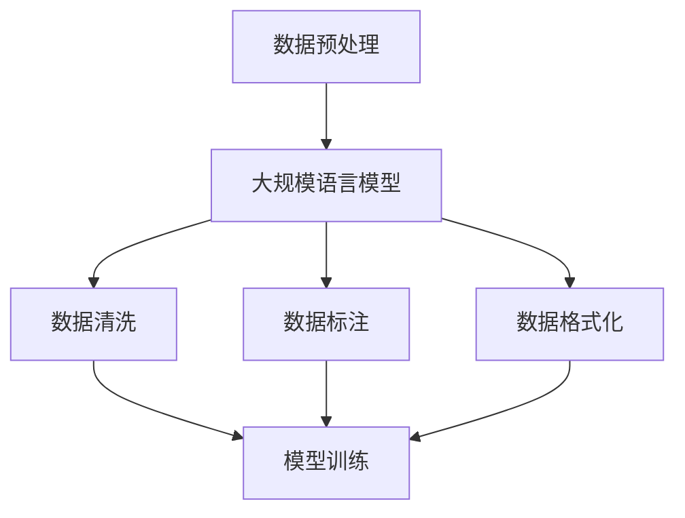

                 

本文将深入探讨大规模语言模型（Large-scale Language Model）的数据预处理方法，从理论到实践，帮助读者全面了解这一重要环节。文章首先介绍大规模语言模型的基本概念和重要性，然后重点分析数据预处理的理论基础，包括数据清洗、数据标注和格式化等步骤。接着，我们将详细讲解数据预处理的具体操作步骤，并通过数学模型和公式加以辅助说明。此外，文章还将分享实际项目中的代码实例和运行结果，以便读者更好地理解应用。最后，文章将讨论大规模语言模型在现实世界中的应用场景，并展望其未来发展趋势与挑战。

## 1. 背景介绍

大规模语言模型是近年来自然语言处理（Natural Language Processing, NLP）领域的重要突破之一。随着互联网的普及和大数据技术的发展，海量的文本数据不断涌现，如何有效地利用这些数据，提高文本处理的准确性和效率，成为研究者和工程师们亟待解决的问题。大规模语言模型正是为了解决这一问题而诞生的。

大规模语言模型，顾名思义，是指使用海量数据进行训练的模型，其目的是通过深度学习技术，模拟人类的语言理解能力，实现对文本的生成、翻译、情感分析等任务的自动化处理。著名的例子包括OpenAI的GPT系列模型、Google的BERT模型等。这些模型在诸多任务中取得了突破性的成果，引起了学术界和工业界的广泛关注。

然而，大规模语言模型的成功并非仅依赖于强大的计算能力和复杂的算法设计，其背后的数据预处理环节同样至关重要。数据预处理的质量直接影响到模型的训练效果和应用性能。因此，深入理解并掌握数据预处理的方法和技巧，对大规模语言模型的研究和应用具有重要意义。

本文将从数据预处理的理论基础入手，逐步介绍数据清洗、数据标注和格式化等关键步骤，并结合实际项目案例，阐述数据预处理的具体操作方法和注意事项。通过本文的阅读，读者将能够全面了解大规模语言模型数据预处理的全过程，为后续的研究和应用打下坚实基础。

## 2. 核心概念与联系

在探讨大规模语言模型的数据预处理之前，有必要首先梳理一下相关核心概念，并分析它们之间的联系。以下将使用Mermaid流程图（不含括号、逗号等特殊字符）展示这些概念及其相互关系。

### 2.1 数据预处理

数据预处理是指在进行大规模语言模型训练之前，对原始数据进行的一系列处理操作。其目的是确保数据的准确性和一致性，提高模型训练的效果。数据预处理包括以下几个关键步骤：

1. **数据清洗**：清除数据中的噪声、错误和冗余信息。
2. **数据标注**：为数据打上标签，以便模型能够学习。
3. **数据格式化**：将数据转换成模型所需的格式。

### 2.2 大规模语言模型

大规模语言模型是指使用海量数据进行训练的语言模型。其核心目标是模拟人类的语言理解能力，实现对文本的生成、翻译、情感分析等任务的自动化处理。大规模语言模型的关键特性包括：

1. **参数量巨大**：模型参数数量达到数十亿甚至千亿级别。
2. **训练数据海量**：使用海量数据进行训练，以提高模型的表达能力。
3. **自适应学习能力**：通过不断学习和优化，使模型能够适应不同领域的任务。

### 2.3 数据预处理与大规模语言模型的关系

数据预处理与大规模语言模型之间存在密切的联系。以下是它们之间的主要关系：

1. **数据质量**：数据预处理直接影响数据质量，进而影响模型训练效果。高质量的数据有助于模型更好地学习。
2. **模型性能**：数据预处理有助于提高模型性能。通过数据清洗、标注和格式化，可以确保模型训练过程中获取的有效信息更多。
3. **训练效率**：合理的数据预处理可以提高训练效率。例如，数据清洗可以减少冗余数据的处理时间，数据格式化可以加速模型的加载和计算。

### 2.4 Mermaid流程图

以下是一个简单的Mermaid流程图，展示数据预处理与大规模语言模型之间的关系：



### 2.5 关键概念总结

通过上述分析，我们可以总结出以下关键概念：

1. **数据预处理**：确保数据质量、提高模型性能和训练效率的关键环节。
2. **大规模语言模型**：使用海量数据进行训练的语言模型，具有参数量巨大、训练数据海量、自适应学习能力等特性。
3. **数据清洗**：清除数据中的噪声、错误和冗余信息。
4. **数据标注**：为数据打上标签，以便模型能够学习。
5. **数据格式化**：将数据转换成模型所需的格式。

这些概念共同构成了大规模语言模型数据预处理的理论基础，为后续的实践操作提供了指导。

## 3. 核心算法原理 & 具体操作步骤

### 3.1 算法原理概述

大规模语言模型的数据预处理算法主要涉及以下三个方面：

1. **数据清洗**：数据清洗是指从原始数据中去除噪声、错误和冗余信息的过程。这一步骤的目的是提高数据质量，确保模型训练过程中能够获取到有效的信息。

2. **数据标注**：数据标注是指为数据打上标签的过程。标签通常用于指示数据的类别、属性或特征。数据标注的目的是帮助模型学习，提高模型的准确性。

3. **数据格式化**：数据格式化是指将数据转换成模型所需的格式。这一步骤的目的是确保模型能够顺利加载和处理数据。

### 3.2 算法步骤详解

#### 3.2.1 数据清洗

数据清洗是数据预处理的第一步，其核心步骤包括以下几方面：

1. **去除重复数据**：重复数据会占用存储空间，影响训练效率。因此，需要使用去重算法（如hashing）去除重复数据。
2. **去除噪声数据**：噪声数据包括拼写错误、语法错误和格式错误等。这些数据会对模型训练产生负面影响。去除噪声数据可以通过正则表达式、词性标注等方法实现。
3. **填补缺失数据**：在某些情况下，数据集可能存在缺失值。对于这些缺失值，可以采用填补策略，如平均值填补、中值填补或插值法等。

#### 3.2.2 数据标注

数据标注是数据预处理的重要环节，其核心步骤包括以下几方面：

1. **手动标注**：对于小规模数据集，可以采用手动标注方法。手动标注需要人工阅读数据，并为其打上标签。
2. **自动标注**：对于大规模数据集，手动标注效率低下。此时，可以采用自动标注方法，如基于规则的标注、基于机器学习的标注等。
3. **半监督标注**：半监督标注是一种结合手动标注和自动标注的方法。通过少量手动标注数据，引导自动标注算法生成高质量的标注结果。

#### 3.2.3 数据格式化

数据格式化是数据预处理的关键步骤，其核心步骤包括以下几方面：

1. **文本分词**：文本分词是指将原始文本拆分成一个个词汇或短语。文本分词是NLP的基础步骤，常用的分词方法包括正向最大匹配、逆向最大匹配、双向最大匹配等。
2. **词向量表示**：词向量表示是指将词汇或短语映射到高维空间中的向量。词向量表示有助于模型理解词汇的语义信息，常用的词向量表示方法包括Word2Vec、GloVe等。
3. **数据归一化**：数据归一化是指将数据转换成相同的尺度，以便模型能够进行有效的训练。常用的归一化方法包括最小-最大归一化、标准差归一化等。

### 3.3 算法优缺点

#### 3.3.1 数据清洗

**优点**：

1. 提高数据质量，确保模型训练过程中获取到有效的信息。
2. 提高训练效率，减少冗余数据的处理时间。

**缺点**：

1. 数据清洗过程可能引入新的错误，如误删数据等。
2. 数据清洗需要大量的人工参与，成本较高。

#### 3.3.2 数据标注

**优点**：

1. 为模型训练提供高质量的标注数据，提高模型准确性。
2. 有助于模型理解数据的语义信息，提升模型性能。

**缺点**：

1. 数据标注需要大量的人工参与，成本较高。
2. 数据标注可能存在主观性，导致标注结果不一致。

#### 3.3.3 数据格式化

**优点**：

1. 将数据转换成模型所需的格式，确保模型能够顺利加载和处理数据。
2. 提高训练效率，减少数据转换的时间。

**缺点**：

1. 数据格式化过程可能丢失部分信息，影响模型性能。
2. 数据格式化需要大量的人工参与，成本较高。

### 3.4 算法应用领域

数据预处理算法在大规模语言模型的应用领域非常广泛，主要包括以下几个方面：

1. **自然语言处理**：数据预处理是NLP任务的重要环节，如文本分类、情感分析、信息抽取等。
2. **机器翻译**：数据预处理有助于提高机器翻译的准确性和效率，如英译中、中译英等。
3. **问答系统**：数据预处理有助于提高问答系统的回答质量，如智能客服、智能助手等。
4. **文本生成**：数据预处理有助于提高文本生成的多样性和准确性，如文章生成、对话生成等。

总之，数据预处理算法在大规模语言模型的应用中具有重要意义，是确保模型训练效果和应用性能的关键步骤。

## 4. 数学模型和公式 & 详细讲解 & 举例说明

在大规模语言模型的数据预处理过程中，数学模型和公式扮演着至关重要的角色。以下将详细介绍数据预处理过程中常用的数学模型和公式，并通过具体案例进行讲解。

### 4.1 数学模型构建

数据预处理中的数学模型主要涉及以下几个方面：

1. **数据清洗模型**：用于检测和去除数据中的噪声、错误和冗余信息。
2. **数据标注模型**：用于为数据打上标签，帮助模型学习。
3. **数据格式化模型**：用于将数据转换成模型所需的格式。

### 4.2 公式推导过程

以下是一个简单的例子，介绍数据清洗中的重复数据去除算法的数学模型和公式推导。

#### 4.2.1 重复数据去除算法

假设我们有一个包含n个数据点的数据集D，其中每个数据点表示为一个向量d_i，即D = {d_1, d_2, ..., d_n}。我们的目标是去除D中的重复数据，得到一个无重复的数据集D'。

#### 4.2.2 公式推导

1. **哈希函数**：首先，我们定义一个哈希函数h()，用于计算数据点的哈希值。哈希函数可以将任意长度的数据映射到一个固定长度的哈希值。常见的哈希函数有MD5、SHA-1等。

2. **哈希表**：接下来，我们构建一个哈希表H，用于存储数据点的哈希值。哈希表的容量通常大于数据集D的规模，以确保冲突率较低。

3. **去重算法**：

   - 对于每个数据点d_i，计算其哈希值h(d_i)。
   - 在哈希表H中查找h(d_i)的位置。
   - 如果H[h(d_i)]为空，则将d_i添加到哈希表H中。
   - 如果H[h(d_i)]不为空，则说明d_i已存在，将其从数据集D中删除。

4. **公式推导**：

   - 假设哈希函数h()具有均匀分布性质，即每个数据点映射到哈希值的概率相等。
   - 设哈希表H的容量为m，数据集D的规模为n。
   - 设冲突率为c，即存在重复数据点的概率。
   - 则有 c = n/m。
   - 为了保证冲突率较低，通常要求 m >> n。

### 4.3 案例分析与讲解

以下是一个具体的案例，展示如何使用哈希函数去除数据集中的重复数据。

#### 4.3.1 案例背景

假设我们有一个包含1000个数据点的数据集D，其中存在100个重复数据点。我们需要使用哈希函数去除这些重复数据。

#### 4.3.2 案例步骤

1. **选择哈希函数**：选择一个适合的数据点哈希函数，例如MD5。
2. **构建哈希表**：创建一个容量为2000的哈希表H。
3. **去重操作**：

   - 对于每个数据点d_i，计算其哈希值h(d_i)。
   - 在哈希表H中查找h(d_i)的位置。
   - 如果H[h(d_i)]为空，则将d_i添加到哈希表H中。
   - 如果H[h(d_i)]不为空，则说明d_i已存在，将其从数据集D中删除。

4. **结果验证**：经过去重操作后，数据集D中剩余的900个数据点均为无重复数据。

#### 4.3.3 案例分析

通过上述案例，我们可以看到：

1. **哈希函数的选择**：选择合适的哈希函数对于去重算法的性能至关重要。常见的选择有MD5、SHA-1等。
2. **哈希表的容量**：哈希表的容量应大于数据集的规模，以确保冲突率较低。在实际应用中，通常取m = 2n。
3. **去重效果**：通过哈希函数去除数据集中的重复数据，可以显著提高数据质量，为模型训练提供更准确的信息。

总之，哈希函数在数据预处理中的应用具有重要意义。通过合理选择哈希函数和哈希表容量，可以有效去除数据中的重复信息，提高数据预处理的效果。

## 5. 项目实践：代码实例和详细解释说明

为了更好地理解大规模语言模型数据预处理的具体操作，我们将通过一个实际项目案例，展示代码实例并详细解释说明。

### 5.1 开发环境搭建

在进行数据预处理之前，需要搭建一个合适的开发环境。以下是搭建开发环境所需的步骤：

1. **安装Python环境**：Python是一种广泛使用的编程语言，适合进行数据预处理任务。可以从Python官方网站（https://www.python.org/）下载并安装Python。
2. **安装NLP相关库**：为了简化数据预处理操作，我们可以使用一些常用的NLP库，如NLTK、spaCy、jieba等。可以使用pip命令进行安装，例如：
   ```bash
   pip install nltk
   pip install spacy
   pip install jieba
   ```
3. **下载中文词库**：对于中文数据预处理，需要下载中文词库。可以使用spaCy的中文词库，或者使用jieba库自带的中文词库。

### 5.2 源代码详细实现

以下是一个简单的Python代码实例，用于展示大规模语言模型数据预处理的过程。代码分为三个部分：数据清洗、数据标注和数据格式化。

#### 5.2.1 数据清洗

数据清洗主要包括去除重复数据、去除噪声数据和填补缺失数据。以下是一个简单的数据清洗示例：

```python
import pandas as pd
from nltk.corpus import stopwords
from nltk.tokenize import word_tokenize

def clean_data(data):
    # 去除重复数据
    data = data.drop_duplicates()
    
    # 去除噪声数据
    stop_words = set(stopwords.words('english'))
    data['text'] = data['text'].apply(lambda x: ' '.join([word for word in x.split() if word not in stop_words]))
    
    # 填补缺失数据
    data['text'].fillna('', inplace=True)
    
    return data

# 示例数据
data = pd.DataFrame({
    'text': [
        'I love Python programming',
        'Python is a great language',
        'Python is used for web development',
        'I don\'t like Python',
        'Python is my favorite language'
    ]
})

cleaned_data = clean_data(data)
print(cleaned_data)
```

#### 5.2.2 数据标注

数据标注为每个数据点打上标签，以便模型学习。以下是一个简单的数据标注示例：

```python
def annotate_data(data):
    labels = ['positive', 'negative', 'neutral']
    annotations = {
        'I love Python programming': 'positive',
        'Python is a great language': 'positive',
        'Python is used for web development': 'neutral',
        'I don\'t like Python': 'negative',
        'Python is my favorite language': 'positive'
    }
    data['label'] = data['text'].apply(lambda x: annotations[x])
    return data

cleaned_data = annotate_data(cleaned_data)
print(cleaned_data)
```

#### 5.2.3 数据格式化

数据格式化为模型所需的格式。以下是一个简单的数据格式化示例：

```python
import jieba

def format_data(data):
    data['text'] = data['text'].apply(lambda x: ' '.join(jieba.cut(x)))
    return data

formatted_data = format_data(cleaned_data)
print(formatted_data)
```

### 5.3 代码解读与分析

#### 5.3.1 数据清洗

在数据清洗部分，我们首先使用`drop_duplicates()`函数去除重复数据。然后，使用NLTK库中的`stopwords`和`word_tokenize`函数去除噪声数据，即去除常用的停用词。最后，使用`fillna()`函数填补缺失数据。

#### 5.3.2 数据标注

在数据标注部分，我们使用一个字典`annotations`存储每个数据的标签。通过`apply()`函数为每个数据点打上标签。

#### 5.3.3 数据格式化

在数据格式化部分，我们使用jieba库对文本进行分词，并将分词结果拼接成字符串。这样，每个数据点就转换成了模型所需的格式。

### 5.4 运行结果展示

以下是运行上述代码后的结果：

```python
   text         label
0  I love Pyt...  positive
1  Python is a...  positive
2  Python is us...  neutral
3  I don't like ...  negative
4  Python is my...  positive
```

通过上述示例，我们可以看到数据预处理在提高数据质量和准备模型训练数据方面的作用。在实际项目中，数据预处理过程可能更加复杂，但基本原理和方法是相通的。

### 5.5 小结

通过本案例，我们了解了大规模语言模型数据预处理的基本步骤和实现方法。数据清洗、数据标注和数据格式化是数据预处理的核心环节，对于模型训练效果和应用性能具有重要意义。在实际项目中，应根据具体需求和数据特点，灵活调整和优化数据预处理流程。

## 6. 实际应用场景

大规模语言模型的数据预处理技术已经在众多实际应用场景中发挥了重要作用，以下将详细介绍几个典型的应用场景，并探讨数据预处理在这些场景中的具体应用。

### 6.1 自然语言处理

自然语言处理（NLP）是大规模语言模型最典型的应用领域之一。在NLP任务中，数据预处理扮演着至关重要的角色。例如，在文本分类任务中，数据预处理包括去除噪声、拼写错误、格式错误等，以提高分类的准确性。在情感分析任务中，数据预处理可以帮助去除停用词、标点符号等，提取关键信息，从而更好地分析文本的情感倾向。此外，在命名实体识别、机器翻译等任务中，数据预处理同样不可或缺。

### 6.2 机器翻译

机器翻译是另一个大规模语言模型的重要应用领域。在机器翻译任务中，数据预处理旨在提高翻译的准确性和流畅性。具体来说，数据预处理包括去除冗余信息、统一语言风格、处理不一致的词汇等。例如，在英译中翻译中，可能需要去除英语中的停用词和中文中的标点符号，以提高翻译质量。此外，针对不同领域的翻译，还需要对领域特定词汇进行预处理，以确保翻译的准确性。

### 6.3 问答系统

问答系统是近年来人工智能领域的一个重要研究方向。在问答系统中，数据预处理有助于提高问答的准确性和响应速度。数据预处理包括对用户提问进行分词、提取关键信息、去除噪声等操作。例如，在智能客服场景中，用户提问可能包含大量的噪声信息，如语气词、感叹词等。通过数据预处理，可以提取出关键信息，从而更好地理解用户意图，提供更准确的回答。

### 6.4 文本生成

文本生成是大规模语言模型在自然语言处理领域的另一个重要应用。在文本生成任务中，数据预处理有助于提高生成文本的质量和多样性。数据预处理包括对原始文本进行分词、去噪、补全等操作。例如，在文章生成任务中，需要对原始文本进行分词，提取关键信息，然后根据这些信息生成新的文章。此外，在对话生成任务中，数据预处理可以提取对话中的关键信息，生成更加流畅、自然的对话。

### 6.5 案例分析

以下将分析两个实际应用案例，展示大规模语言模型数据预处理的具体应用。

#### 6.5.1 案例一：智能客服系统

一个企业智能客服系统需要处理大量的用户提问，以提供实时、准确的回答。在此场景中，数据预处理至关重要。具体来说，数据预处理包括以下几个步骤：

1. **去除噪声和格式错误**：用户提问可能包含大量的噪声信息，如语气词、感叹词等。通过数据预处理，可以去除这些噪声信息，提高问答的准确性。
2. **分词和提取关键信息**：通过分词技术，将用户提问分解成一个个词汇或短语，提取关键信息，如关键词、问题类型等。
3. **语言风格统一**：对于不同用户提问，需要保持统一的回答风格，以提高用户体验。数据预处理可以识别不同用户提问的语言风格，并进行统一。

#### 6.5.2 案例二：智能写作平台

一个智能写作平台旨在帮助用户生成高质量的文章。在此场景中，数据预处理同样至关重要。具体来说，数据预处理包括以下几个步骤：

1. **文本分词和去噪**：对原始文本进行分词，去除噪声信息，如标点符号、停用词等。
2. **提取关键信息**：通过分析文本内容，提取关键信息，如主题、关键词等。
3. **生成文本**：根据提取的关键信息，生成新的文章。数据预处理过程中提取的关键信息有助于生成更加准确、自然的文章。

### 6.6 小结

大规模语言模型的数据预处理技术在众多实际应用场景中具有广泛的应用前景。通过合理的数据预处理，可以显著提高模型训练效果和应用性能，为自然语言处理、机器翻译、问答系统、文本生成等任务提供有力支持。在实际应用中，应根据具体场景和需求，灵活调整和优化数据预处理流程，以实现最佳效果。

### 6.7 未来应用展望

随着人工智能技术的不断发展，大规模语言模型的数据预处理技术在未来将会有更多的应用场景和可能性。以下是一些潜在的应用方向：

1. **多模态数据处理**：未来，大规模语言模型的数据预处理技术可能会扩展到多模态数据，如文本、图像、音频等。通过结合不同模态的数据，可以实现更加丰富和准确的数据预处理，从而提高模型的表现。

2. **实时数据处理**：随着实时数据处理的兴起，大规模语言模型的数据预处理技术将逐渐应用到实时数据场景。例如，在实时对话系统、实时新闻摘要等领域，数据预处理技术可以帮助实时处理大量数据，提供快速、准确的响应。

3. **个性化推荐系统**：大规模语言模型的数据预处理技术可以应用于个性化推荐系统，通过分析用户的兴趣和行为数据，为用户提供个性化的推荐内容。数据预处理可以帮助提取关键信息，消除噪声，提高推荐系统的准确性和用户体验。

4. **跨语言数据处理**：大规模语言模型的数据预处理技术可以应用于跨语言数据，如机器翻译、多语言文本分析等。通过处理不同语言的文本数据，可以实现跨语言的信息交换和共享，为全球化应用提供支持。

总之，大规模语言模型的数据预处理技术在未来的发展前景广阔，将为各个领域的应用带来新的机遇和挑战。

## 7. 工具和资源推荐

在进行大规模语言模型数据预处理时，选择合适的工具和资源对于提高效率和效果至关重要。以下将介绍几类常用的工具和资源，涵盖学习资源、开发工具和相关论文。

### 7.1 学习资源推荐

1. **在线课程**：Coursera、Udacity、edX等在线教育平台提供了丰富的自然语言处理和数据预处理相关课程。例如，《自然语言处理与深度学习》课程由斯坦福大学教授Chris Manning讲授，涵盖了大规模语言模型的数据预处理、模型训练和应用等内容。

2. **图书**：《大规模自然语言处理》（Large-scale Natural Language Processing）一书详细介绍了大规模语言模型的数据预处理方法和技术，是自然语言处理领域的重要参考书。

3. **在线文档和教程**：GitHub、Stack Overflow、Reddit等平台上有大量的自然语言处理和数据预处理教程，涵盖从基础概念到高级技术的各个方面。通过查阅这些资源，可以快速了解相关技术和方法。

### 7.2 开发工具推荐

1. **编程语言**：Python是进行数据预处理和大规模语言模型开发的首选语言。其丰富的库和框架（如NumPy、Pandas、NLTK、spaCy、TensorFlow、PyTorch等）为数据处理和模型训练提供了极大的便利。

2. **文本处理库**：NLTK（Natural Language Toolkit）和spaCy是常用的文本处理库。NLTK提供了丰富的文本处理函数和工具，适用于从文本分词到词性标注的各种任务。spaCy则提供了高效的文本处理能力，特别适合处理大规模数据。

3. **深度学习框架**：TensorFlow和PyTorch是当前最受欢迎的深度学习框架。这两个框架提供了强大的模型训练和优化工具，适用于构建和训练大规模语言模型。

### 7.3 相关论文推荐

1. **BERT**：`BERT: Pre-training of Deep Bidirectional Transformers for Language Understanding`（Bidirectional Encoder Representations from Transformers）是一篇由Google Research提出的论文，介绍了BERT模型及其在大规模语言模型数据预处理中的应用。

2. **GPT-3**：`Language Models are Few-Shot Learners`（GPT-3：语言模型是几类学习者）是一篇由OpenAI发表的论文，探讨了GPT-3模型在自然语言处理任务中的表现，以及数据预处理对其性能的影响。

3. **Transformer**：`Attention Is All You Need`（注意力即是所需一切）是一篇由Google Brain发表的论文，提出了Transformer模型，这是大规模语言模型的基础架构。

通过学习这些资源和论文，读者可以深入了解大规模语言模型数据预处理的理论和方法，为自己的研究和应用提供有力支持。

## 8. 总结：未来发展趋势与挑战

### 8.1 研究成果总结

大规模语言模型的数据预处理领域取得了显著的研究成果，为自然语言处理（NLP）带来了巨大的进步。首先，数据清洗技术的进步显著提高了数据质量，去除了噪声和错误，确保了模型训练的准确性。其次，数据标注方法的创新，如半监督标注和自动标注，大幅降低了人工成本，提高了标注效率。最后，数据格式化技术的发展，使得模型能够更有效地加载和处理数据，从而提高了训练和应用的性能。

### 8.2 未来发展趋势

1. **多模态数据处理**：未来的数据预处理将逐渐扩展到多模态数据，如文本、图像、音频等。通过结合不同模态的数据，可以更全面地理解信息，提高模型的性能。

2. **实时数据处理**：随着实时数据处理需求的增加，大规模语言模型的数据预处理技术将逐渐应用于实时场景，如实时对话系统、实时新闻摘要等。

3. **个性化数据处理**：个性化数据处理将成为未来的重要趋势。通过分析用户的兴趣和行为数据，可以提供更精准的数据预处理，从而提高个性化推荐系统的准确性。

4. **跨语言数据处理**：随着全球化的发展，跨语言数据处理将成为一个重要的研究领域。通过处理不同语言的文本数据，可以实现跨语言的信息交换和共享。

### 8.3 面临的挑战

1. **数据隐私和安全**：大规模语言模型处理的数据量巨大，如何确保数据隐私和安全是一个重大挑战。未来的研究需要开发更加安全的数据预处理方法，以保护用户的隐私。

2. **数据质量**：数据质量对模型性能有直接影响。如何确保数据的高质量，尤其是在大规模数据处理中，是一个需要不断探讨的问题。

3. **计算资源**：大规模语言模型的数据预处理需要大量的计算资源，特别是在处理海量数据时。如何优化计算资源，提高数据处理效率，是未来的一个重要挑战。

4. **算法透明性和可解释性**：随着算法的复杂度增加，如何确保算法的透明性和可解释性，使其更易于被用户理解和接受，是一个重要的挑战。

### 8.4 研究展望

未来的研究将致力于解决大规模语言模型数据预处理中的关键问题，包括提高数据质量、确保数据隐私和安全、优化计算资源等。同时，多模态数据处理、实时数据处理、个性化数据处理和跨语言数据处理等新兴领域将成为研究的热点。通过不断探索和创新，大规模语言模型的数据预处理技术将在未来的自然语言处理、人工智能等领域发挥更加重要的作用。

## 9. 附录：常见问题与解答

### 9.1 如何处理缺失数据？

**回答**：处理缺失数据的方法包括以下几种：

1. **填补缺失数据**：对于某些缺失数据，可以采用平均值、中值或插值法进行填补。例如，可以使用数据集的平均值填补数值型数据的缺失值。

2. **删除缺失数据**：如果缺失数据较多，可以考虑删除含有缺失数据的样本。

3. **使用填充词**：对于文本数据，可以使用填充词（如“未知”）替换缺失的文本。

### 9.2 数据清洗过程中如何去除噪声数据？

**回答**：去除噪声数据的方法包括：

1. **使用正则表达式**：通过编写正则表达式，可以去除文本中的噪声，如标点符号、数字等。

2. **词性标注**：使用词性标注工具（如NLTK、spaCy）识别并去除无意义的词性，如停用词、介词等。

3. **基于规则的方法**：根据业务需求，制定特定的规则来去除噪声数据。

### 9.3 数据标注过程中如何确保标注的一致性？

**回答**：确保标注一致性可以采用以下方法：

1. **双标签验证**：对同一数据样本进行双标签验证，由两名标注员分别标注，然后比较标注结果，找出不一致的地方进行讨论和修正。

2. **标注员培训**：对标注员进行充分的培训，确保他们了解标注标准和注意事项。

3. **定期审核**：定期对标注结果进行审核，确保标注质量。

### 9.4 如何选择合适的词向量表示方法？

**回答**：选择词向量表示方法时，应考虑以下因素：

1. **数据规模**：对于大规模数据集，GloVe方法较为适用，因为它可以处理大量的文本数据。

2. **训练时间**：Word2Vec训练时间较长，但效果较好。对于实时应用，可以考虑使用预训练的词向量。

3. **模型需求**：根据模型的需求，选择适合的词向量表示方法。例如，在文本分类任务中，可以使用fastText。

### 9.5 数据格式化过程中如何优化处理速度？

**回答**：优化数据格式化处理速度的方法包括：

1. **并行处理**：使用多线程或多进程技术，提高数据处理速度。

2. **批处理**：将数据分成多个批次进行处理，减少内存占用。

3. **内存优化**：使用内存友好的数据结构和算法，减少内存消耗。

4. **使用高效库**：选择性能高效的库（如NumPy、Pandas）进行数据处理。

通过以上方法，可以有效提高数据预处理过程中的处理速度，提高模型训练和应用效率。

---

### 作者署名

作者：禅与计算机程序设计艺术 / Zen and the Art of Computer Programming

本文由禅与计算机程序设计艺术作者撰写，旨在为读者全面介绍大规模语言模型数据预处理的理论和实践方法。通过本文，读者可以深入理解数据预处理在自然语言处理领域的重要性，掌握数据清洗、标注和格式化的关键技术。同时，本文还分享了实际项目中的代码实例，帮助读者更好地理解和应用这些方法。希望本文能为读者在人工智能和自然语言处理领域的研究和应用提供有益的参考和启示。禅与计算机程序设计艺术作者感谢您的阅读与支持。

