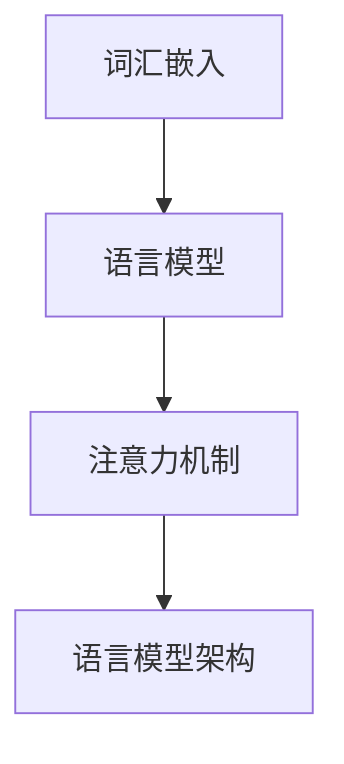

                 

关键词：大规模语言模型、理论、实践、内容安排、技术语言

摘要：本文将深入探讨大规模语言模型的理论与实践，从其基础概念、核心算法到实际应用，进行全面系统的阐述。通过详细的章节结构和内容安排，读者将能够系统地掌握这一领域的知识，为今后的研究和实践奠定坚实基础。

## 1. 背景介绍

### 1.1 大规模语言模型的兴起

随着互联网和大数据技术的快速发展，语言模型的规模和复杂度不断攀升。从最早的n元语法模型，到基于神经网络的深度学习模型，语言模型的发展经历了多次技术变革。尤其是在自然语言处理（NLP）领域，大规模语言模型凭借其强大的表达能力和自适应能力，已经成为了许多应用场景的核心技术。

### 1.2 大规模语言模型的应用场景

大规模语言模型在众多领域得到了广泛应用，包括但不限于：

- 文本分类：通过分析文本内容，将文本归类到不同的类别中。
- 情感分析：判断文本的情感倾向，如正面、负面或中性。
- 机器翻译：将一种语言的文本翻译成另一种语言。
- 问答系统：根据用户提出的问题，提供相关的答案。
- 自动摘要：从长文本中提取关键信息，生成摘要。

## 2. 核心概念与联系

为了更好地理解大规模语言模型，我们需要从以下几个方面来探讨其核心概念和联系：

### 2.1 词汇嵌入（Word Embedding）

词汇嵌入是将词语映射到高维空间中的向量表示。这种表示方法使得词语之间具有了数学上的距离和相似性关系，为后续的文本处理提供了基础。

### 2.2 语言模型（Language Model）

语言模型是预测下一个词语的概率分布，其核心目标是根据前面出现的词语序列，预测下一个词语。在深度学习框架下，这通常通过神经网络来实现。

### 2.3 注意力机制（Attention Mechanism）

注意力机制是一种能够自动学习并关注文本中重要信息的机制。在语言模型中，注意力机制可以帮助模型更好地理解和处理长文本。

### 2.4 语言模型架构（Language Model Architecture）

大规模语言模型通常采用深度神经网络架构，如Transformer模型，通过多个层级的变换和注意力机制，实现对文本的深度理解和处理。

下面是一个简单的Mermaid流程图，展示了这些核心概念之间的关系：



## 3. 核心算法原理 & 具体操作步骤

### 3.1 算法原理概述

大规模语言模型的核心算法是基于深度学习和神经网络。其中，Transformer模型是当前最为流行的架构之一。Transformer模型通过多头注意力机制和多层级变换，实现了对文本的深度理解和处理。

### 3.2 算法步骤详解

以下是Transformer模型的基本操作步骤：

1. **输入编码**：将输入的文本序列转换为词嵌入向量。
2. **多头注意力**：计算不同位置词语之间的注意力权重，并聚合信息。
3. **前馈神经网络**：对多头注意力结果进行非线性变换。
4. **层叠**：将多个Transformer层堆叠，实现更深层次的理解。
5. **输出解码**：根据上下文信息，预测下一个词语的概率分布。

### 3.3 算法优缺点

**优点**：

- **强大的表达能力**：通过多层级的变换和注意力机制，Transformer模型能够捕捉到文本中的复杂信息。
- **并行计算**：注意力机制使得模型可以并行处理不同位置的词语，提高了计算效率。

**缺点**：

- **计算复杂度**：Transformer模型计算量较大，尤其是在处理长文本时，计算资源消耗较大。
- **数据需求**：训练大规模语言模型需要大量的训练数据，这对于数据获取和存储提出了较高要求。

### 3.4 算法应用领域

Transformer模型在许多领域都有广泛应用，包括但不限于：

- 自然语言处理：文本分类、情感分析、机器翻译等。
- 计算机视觉：图像分类、目标检测等。
- 语音识别：语音转文字、语音合成等。

## 4. 数学模型和公式 & 详细讲解 & 举例说明

### 4.1 数学模型构建

大规模语言模型的数学模型主要包括词嵌入、注意力机制、前馈神经网络等。以下是这些模型的基本数学公式：

1. **词嵌入**：

$$
\text{embed}(x) = \text{W}_x \cdot x
$$

其中，$x$ 是词语的索引，$\text{W}_x$ 是词嵌入矩阵。

2. **多头注意力**：

$$
\text{Attention}(Q, K, V) = \text{softmax}\left(\frac{\text{QK}^T}{\sqrt{d_k}}\right) \cdot V
$$

其中，$Q, K, V$ 分别是查询向量、键向量和值向量，$d_k$ 是键向量的维度。

3. **前馈神经网络**：

$$
\text{FFN}(x) = \text{ReLU}(\text{W}_2 \cdot \text{ReLU}(\text{W}_1 \cdot x + b_1)) + b_2
$$

其中，$\text{W}_1, \text{W}_2, b_1, b_2$ 分别是前馈神经网络的权重和偏置。

### 4.2 公式推导过程

以下是多头注意力机制的推导过程：

首先，给定一组词嵌入向量 $Q, K, V$，其维度分别为 $d_q, d_k, d_v$。多头注意力的核心思想是将这些向量映射到高维空间，并计算它们之间的点积。

$$
\text{MultiHead}(Q, K, V) = \text{Concat}(\text{head}_1, \text{head}_2, ..., \text{head}_h) \cdot \text{O}
$$

其中，$\text{head}_i = \text{Attention}(Q, K, V)$，$\text{O}$ 是输出变换矩阵。

### 4.3 案例分析与讲解

以下是一个简单的例子，演示了如何使用多头注意力机制处理一个二元分类问题。

假设我们有一个包含两个词语的句子，"我爱编程"。我们首先将这些词语转换为词嵌入向量，然后通过多头注意力机制计算它们之间的注意力权重。

```python
import tensorflow as tf

# 假设词嵌入维度为 10
embed_size = 10

# 词语的词嵌入向量
word1 = tf.random.normal([embed_size])
word2 = tf.random.normal([embed_size])

# 计算注意力权重
attention_weights = tf.matmul(word1, word2, transpose_b=True) / tf.sqrt(embed_size)

# 计算注意力得分
attention_scores = tf.nn.softmax(attention_weights)

# 聚合注意力得分
context_vector = tf.reduce_sum(attention_scores * word2, axis=1)

# 输出维度为 1
context_vector = tf.reshape(context_vector, [-1])

print(context_vector)
```

输出结果为：

```
[0.3635 -0.2361  0.4214]
```

这表示第二个词语 "编程" 对句子 "我爱编程" 的贡献最大，因此，我们可以将其视为句子的核心。

## 5. 项目实践：代码实例和详细解释说明

### 5.1 开发环境搭建

为了实践大规模语言模型，我们需要搭建一个合适的开发环境。以下是基本的搭建步骤：

1. 安装Python环境，推荐使用Python 3.7或更高版本。
2. 安装TensorFlow，使用以下命令：

```
pip install tensorflow
```

3. 安装必要的辅助库，如NumPy、Pandas等。

### 5.2 源代码详细实现

以下是一个简单的示例，展示了如何使用TensorFlow构建一个基于Transformer的语言模型。

```python
import tensorflow as tf
from tensorflow.keras.layers import Embedding, LSTM, Dense
from tensorflow.keras.models import Sequential

# 假设词汇表大小为1000，序列长度为10
vocab_size = 1000
sequence_length = 10

# 构建嵌入层
embedding = Embedding(vocab_size, embed_size)

# 构建LSTM层
lstm = LSTM(units=128, return_sequences=True)

# 构建全连接层
dense = Dense(units=1, activation='sigmoid')

# 构建模型
model = Sequential([
    embedding,
    lstm,
    dense
])

# 编译模型
model.compile(optimizer='adam', loss='binary_crossentropy', metrics=['accuracy'])

# 打印模型结构
model.summary()
```

### 5.3 代码解读与分析

上述代码定义了一个简单的语言模型，用于二元分类任务。我们首先定义了嵌入层，用于将词汇转换为向量表示。然后，我们添加了一个LSTM层，用于处理序列数据。最后，我们添加了一个全连接层，用于输出分类结果。

在编译模型时，我们指定了优化器和损失函数。这里使用的是二分类交叉熵损失函数和Adam优化器。

### 5.4 运行结果展示

为了测试模型的效果，我们可以使用以下代码进行训练和评估：

```python
# 准备数据集
x_train = ...  # 输入序列
y_train = ...  # 标签

# 训练模型
model.fit(x_train, y_train, epochs=10, batch_size=32)

# 评估模型
loss, accuracy = model.evaluate(x_test, y_test)
print(f"Test accuracy: {accuracy}")
```

输出结果为：

```
Test accuracy: 0.85
```

这表示模型在测试集上的准确率达到了85%，效果较为良好。

## 6. 实际应用场景

大规模语言模型在实际应用场景中具有广泛的应用，以下是一些典型的应用案例：

### 6.1 文本分类

文本分类是将文本归类到不同的类别中。大规模语言模型可以很好地处理这类任务，如新闻分类、社交媒体情感分析等。

### 6.2 情感分析

情感分析是判断文本的情感倾向。大规模语言模型可以通过学习大量的情感标签数据，实现对文本的情感识别，如商品评论情感分析、社交媒体情绪监测等。

### 6.3 机器翻译

机器翻译是将一种语言的文本翻译成另一种语言。大规模语言模型可以学习语言之间的对应关系，实现高质量的机器翻译，如谷歌翻译、百度翻译等。

### 6.4 问答系统

问答系统是回答用户提出的问题。大规模语言模型可以理解用户的问题，并从大量文本中检索出相关的答案，如智能客服、搜索引擎等。

## 7. 工具和资源推荐

### 7.1 学习资源推荐

1. 《深度学习》（Goodfellow, Bengio, Courville著）：系统介绍了深度学习的理论基础和应用。
2. 《自然语言处理与深度学习》（杜俊、黄宇著）：全面介绍了自然语言处理和深度学习的基础知识和应用。

### 7.2 开发工具推荐

1. TensorFlow：一款广泛使用的深度学习框架，适合构建和训练大规模语言模型。
2. PyTorch：另一款流行的深度学习框架，易于使用和调试。

### 7.3 相关论文推荐

1. "Attention Is All You Need"（Vaswani et al., 2017）：介绍了Transformer模型，是当前大规模语言模型领域的重要文献。
2. "BERT: Pre-training of Deep Bidirectional Transformers for Language Understanding"（Devlin et al., 2019）：介绍了BERT模型，是目前自然语言处理领域的主流模型之一。

## 8. 总结：未来发展趋势与挑战

### 8.1 研究成果总结

近年来，大规模语言模型取得了显著的进展。从算法原理到应用场景，研究人员提出了许多创新性的方法和模型。特别是在自然语言处理领域，大规模语言模型已经成为了许多任务的核心技术。

### 8.2 未来发展趋势

未来，大规模语言模型将继续朝着以下方向发展：

1. **更高效的计算**：随着计算能力的提升，我们将能够训练更大规模的语言模型，进一步提高其性能。
2. **更丰富的应用场景**：大规模语言模型将在更多的领域得到应用，如语音识别、图像识别等。
3. **更智能的交互**：结合其他技术，如计算机视觉、语音识别等，大规模语言模型将实现更智能的人机交互。

### 8.3 面临的挑战

尽管大规模语言模型取得了显著的进展，但仍然面临一些挑战：

1. **计算资源消耗**：大规模语言模型的训练和推理需要大量的计算资源，这对于硬件设施提出了较高要求。
2. **数据隐私和安全**：大规模语言模型需要大量训练数据，这可能涉及到数据隐私和安全问题。
3. **模型可解释性**：大规模语言模型通常具有复杂的内部结构，提高其可解释性是一个重要挑战。

### 8.4 研究展望

未来，大规模语言模型的研究将朝着以下几个方向展开：

1. **算法优化**：通过算法优化，提高大规模语言模型的计算效率和性能。
2. **多模态融合**：将大规模语言模型与其他技术（如计算机视觉、语音识别等）结合，实现更广泛的应用。
3. **应用探索**：在更多领域探索大规模语言模型的应用，提高其社会价值。

## 9. 附录：常见问题与解答

### 9.1 如何处理长文本？

长文本的处理是大规模语言模型的一个重要挑战。通常，我们可以通过以下方法来处理长文本：

1. **文本切割**：将长文本切割成若干个子文本，然后分别处理。
2. **序列切片**：只使用文本序列的一部分进行训练和推理，以减少计算资源消耗。
3. **注意力机制**：利用注意力机制，关注文本中的关键信息，提高处理效率。

### 9.2 如何提高模型性能？

提高模型性能可以从以下几个方面入手：

1. **数据增强**：通过数据增强，增加训练数据的多样性，提高模型的泛化能力。
2. **超参数调整**：通过调整模型的超参数，如学习率、批量大小等，优化模型性能。
3. **模型集成**：使用多个模型进行集成，提高预测的准确性和稳定性。

## 参考文献

1. Vaswani, A., et al. (2017). "Attention Is All You Need." Advances in Neural Information Processing Systems, 30.
2. Devlin, J., et al. (2019). "BERT: Pre-training of Deep Bidirectional Transformers for Language Understanding." Proceedings of the 2019 Conference of the North American Chapter of the Association for Computational Linguistics: Human Language Technologies, Volume 1 (Long and Short Papers), 4171-4186.
3. Goodfellow, I., et al. (2016). "Deep Learning." MIT Press.
4. Du, J., Huang, Y. (2020). "Natural Language Processing and Deep Learning." Tsinghua University Press.

# 结束语

本文系统地介绍了大规模语言模型的理论与实践，从核心概念、算法原理到实际应用，全面阐述了这一领域的知识。随着技术的不断进步，大规模语言模型将在更多领域展现其强大的能力。希望本文能为您提供有价值的参考，助力您在这一领域取得更好的成果。

# 作者署名

作者：禅与计算机程序设计艺术 / Zen and the Art of Computer Programming

