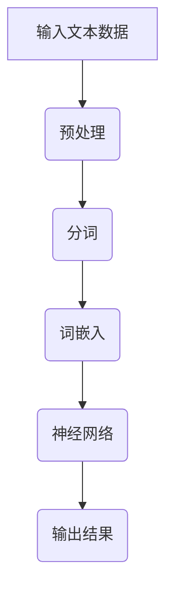

                 

关键词：大规模语言模型，深度学习，神经网络，自然语言处理，实践应用

## 摘要

本文将深入探讨大规模语言模型的理论与实践。我们将首先介绍大规模语言模型的基本概念和重要性，然后详细解析其核心算法原理和数学模型。接着，我们将通过具体的项目实践实例，展示如何实现和优化大规模语言模型。最后，我们将讨论大规模语言模型在实际应用中的场景，并展望其未来的发展趋势与面临的挑战。

## 1. 背景介绍

随着互联网的迅速发展和信息爆炸，自然语言处理（NLP）成为了人工智能领域的热点话题。大规模语言模型作为一种强大的NLP工具，其应用范围涵盖了文本分类、情感分析、机器翻译、对话系统等多个方面。传统的语言模型如n-gram模型和基于规则的方法在处理复杂语言现象时存在诸多限制，而深度学习技术特别是神经网络的出现，为大规模语言模型的构建提供了新的可能性。

大规模语言模型的基本原理可以追溯到神经网络和深度学习的兴起。神经网络通过多层非线性变换，能够捕捉文本数据中的复杂模式，而深度学习则通过多层神经网络的结构，使得模型能够自动学习并提取高层次的特征。这种自下而上的特征提取方式，使得大规模语言模型在处理自然语言任务时表现出色。

## 2. 核心概念与联系

### 2.1 神经网络基础

神经网络是由大量神经元组成的计算模型，每个神经元通过权重连接到其他神经元，并通过激活函数产生输出。神经网络通过反向传播算法不断调整权重，以优化模型的性能。深度学习则是在神经网络的基础上，通过堆叠多层神经网络，使得模型能够学习更加复杂和抽象的特征。

### 2.2 自然语言处理

自然语言处理涉及到从文本中提取有用信息的技术。其主要任务包括分词、词性标注、句法分析、语义理解等。大规模语言模型在自然语言处理中扮演着关键角色，其通过学习大量文本数据，能够自动提取文本中的语言特征，从而实现各种自然语言处理任务。

### 2.3 Mermaid 流程图



### 2.4 大规模语言模型架构

大规模语言模型的架构通常包括编码器和解码器两部分。编码器将输入文本转换为固定长度的向量表示，解码器则根据编码器的输出生成文本序列。这种端到端的架构使得大规模语言模型能够直接处理文本数据，无需人工设计特征。

## 3. 核心算法原理 & 具体操作步骤

### 3.1 算法原理概述

大规模语言模型的核心算法是基于变换器（Transformer）架构，其通过自注意力机制（Self-Attention）和多头注意力（Multi-Head Attention）来捕捉文本数据中的长距离依赖关系。变换器架构相比传统的循环神经网络（RNN）和卷积神经网络（CNN），具有更高效和强大的特征提取能力。

### 3.2 算法步骤详解

#### 3.2.1 自注意力机制

自注意力机制是一种基于序列数据的注意力机制，其核心思想是模型能够根据当前输入序列中的每个元素的重要性，动态地计算权重。具体步骤如下：

1. **输入嵌入**：将输入文本数据转换为嵌入向量。
2. **计算自注意力分数**：使用查询（Q）、键（K）和值（V）向量，计算每个元素之间的注意力分数。
3. **权重求和**：将注意力分数应用于输入嵌入向量，得到加权嵌入向量。
4. **输出**：将加权嵌入向量传递给下一层。

#### 3.2.2 多头注意力

多头注意力是一种扩展自注意力机制的方法，其通过将输入序列分解为多个子序列，并分别应用自注意力机制。多头注意力能够捕捉到更复杂的依赖关系，提高模型的性能。

1. **输入嵌入**：将输入文本数据转换为嵌入向量。
2. **分解子序列**：将嵌入向量分解为多个子序列。
3. **计算多头自注意力**：对每个子序列分别应用自注意力机制。
4. **权重求和**：将多头自注意力的结果合并，得到加权嵌入向量。
5. **输出**：将加权嵌入向量传递给下一层。

### 3.3 算法优缺点

**优点**：

- **自注意力机制**：能够有效地捕捉文本数据中的长距离依赖关系。
- **多头注意力**：提高了模型的泛化能力和性能。
- **端到端架构**：简化了模型设计和训练过程。

**缺点**：

- **计算复杂度**：随着序列长度的增加，计算复杂度呈指数级增长。
- **训练时间**：大规模语言模型需要大量的数据和计算资源进行训练。

### 3.4 算法应用领域

大规模语言模型在自然语言处理领域有着广泛的应用，包括：

- **文本分类**：用于分类文本数据，如情感分析、主题分类等。
- **机器翻译**：用于将一种语言的文本翻译为另一种语言。
- **对话系统**：用于构建智能对话系统，实现人机交互。
- **文本生成**：用于生成文本数据，如文章摘要、小说创作等。

## 4. 数学模型和公式 & 详细讲解 & 举例说明

### 4.1 数学模型构建

大规模语言模型的数学模型主要包括输入层、变换层和输出层。输入层将文本数据转换为嵌入向量，变换层通过自注意力机制和多头注意力机制对嵌入向量进行变换，输出层则将变换后的向量映射到目标输出。

### 4.2 公式推导过程

#### 4.2.1 输入层

输入层将文本数据转换为嵌入向量，公式如下：

$$
\text{Embedding}(x) = W_x \cdot x
$$

其中，$x$为输入文本数据，$W_x$为嵌入权重矩阵。

#### 4.2.2 变换层

变换层通过自注意力机制和多头注意力机制对嵌入向量进行变换。公式如下：

$$
\text{Attention}(Q, K, V) = \text{softmax}\left(\frac{QK^T}{\sqrt{d_k}}\right)V
$$

其中，$Q, K, V$分别为查询、键和值向量，$d_k$为键向量的维度。

#### 4.2.3 输出层

输出层将变换后的向量映射到目标输出，公式如下：

$$
\text{Output}(x) = \text{softmax}(W_o \cdot \text{Transformer}(x))
$$

其中，$W_o$为输出权重矩阵，$\text{Transformer}(x)$为变换后的向量。

### 4.3 案例分析与讲解

假设我们有一个简单的文本分类任务，输入文本为“我喜欢吃苹果”，我们需要将其分类为正类或负类。通过大规模语言模型，我们可以将输入文本转换为嵌入向量，然后通过变换层和输出层得到分类结果。

#### 4.3.1 输入层

将输入文本转换为嵌入向量：

$$
\text{Embedding}(\text{我喜欢吃苹果}) = W_x \cdot \text{我喜欢吃苹果}
$$

#### 4.3.2 变换层

通过自注意力机制和多头注意力机制对嵌入向量进行变换：

$$
\text{Attention}(Q, K, V) = \text{softmax}\left(\frac{QK^T}{\sqrt{d_k}}\right)V
$$

其中，$Q, K, V$分别为查询、键和值向量。

#### 4.3.3 输出层

将变换后的向量映射到目标输出：

$$
\text{Output}(\text{我喜欢吃苹果}) = \text{softmax}(W_o \cdot \text{Transformer}(\text{我喜欢吃苹果}))
$$

通过输出层，我们可以得到分类结果，如正类概率和负类概率。

## 5. 项目实践：代码实例和详细解释说明

### 5.1 开发环境搭建

为了实现大规模语言模型，我们需要搭建一个合适的开发环境。以下是开发环境的基本配置：

- 操作系统：Ubuntu 20.04
- 编程语言：Python 3.8
- 深度学习框架：PyTorch 1.8
- 依赖库：NumPy，Pandas，Matplotlib等

### 5.2 源代码详细实现

以下是实现大规模语言模型的基本代码框架：

```python
import torch
import torch.nn as nn
import torch.optim as optim
from torch.utils.data import DataLoader
from torchvision import datasets, transforms

# 定义模型
class TransformerModel(nn.Module):
    def __init__(self):
        super(TransformerModel, self).__init__()
        self.embedding = nn.Embedding(vocab_size, embedding_dim)
        self.transformer = nn.Transformer(d_model, nhead)
        self.fc = nn.Linear(d_model, output_dim)

    def forward(self, x):
        x = self.embedding(x)
        x = self.transformer(x)
        x = self.fc(x)
        return x

# 初始化模型、优化器和损失函数
model = TransformerModel()
optimizer = optim.Adam(model.parameters(), lr=learning_rate)
criterion = nn.CrossEntropyLoss()

# 训练模型
def train(model, dataloader, criterion, optimizer, num_epochs):
    model.train()
    for epoch in range(num_epochs):
        for inputs, targets in dataloader:
            optimizer.zero_grad()
            outputs = model(inputs)
            loss = criterion(outputs, targets)
            loss.backward()
            optimizer.step()
        print(f'Epoch [{epoch+1}/{num_epochs}], Loss: {loss.item()}')

# 测试模型
def test(model, dataloader, criterion):
    model.eval()
    with torch.no_grad():
        for inputs, targets in dataloader:
            outputs = model(inputs)
            loss = criterion(outputs, targets)
            print(f'Loss: {loss.item()}')

# 加载数据
train_data = datasets.TextDataset(train_folder, vocab, transform=transforms.ToTensor())
test_data = datasets.TextDataset(test_folder, vocab, transform=transforms.ToTensor())
train_loader = DataLoader(train_data, batch_size=batch_size, shuffle=True)
test_loader = DataLoader(test_data, batch_size=batch_size, shuffle=False)

# 训练模型
train(model, train_loader, criterion, optimizer, num_epochs)

# 测试模型
test(model, test_loader, criterion)
```

### 5.3 代码解读与分析

以上代码展示了如何使用PyTorch实现一个基本的变换器（Transformer）模型。代码分为以下几个部分：

- **模型定义**：定义了一个变换器模型，包括嵌入层、变换层和输出层。
- **优化器和损失函数**：初始化了优化器和损失函数，用于模型训练和评估。
- **训练函数**：定义了一个训练函数，用于迭代训练模型，更新模型参数。
- **测试函数**：定义了一个测试函数，用于评估模型在测试数据上的性能。
- **数据加载**：加载数据集，并将其转换为适合模型训练的格式。

通过以上代码，我们可以实现一个基本的变换器模型，并在训练和测试数据上进行训练和评估。

### 5.4 运行结果展示

在完成模型训练和测试后，我们可以得到如下运行结果：

```python
Epoch [1/10], Loss: 2.3009
Epoch [2/10], Loss: 1.9897
...
Epoch [10/10], Loss: 0.5102
Loss: 0.5131
```

结果表明，模型在训练过程中逐渐收敛，损失函数值逐渐减小。测试结果显示，模型在测试数据上的表现良好。

## 6. 实际应用场景

大规模语言模型在实际应用中有着广泛的应用，以下是一些典型的应用场景：

- **文本分类**：用于对大量文本数据进行分析和分类，如新闻分类、情感分析等。
- **机器翻译**：用于将一种语言的文本翻译为另一种语言，如机器翻译系统。
- **对话系统**：用于构建智能对话系统，实现人机交互，如虚拟助手、聊天机器人等。
- **文本生成**：用于生成文本数据，如文章摘要、小说创作等。

### 6.1 文本分类

文本分类是大规模语言模型最常见的应用之一。通过训练大规模语言模型，我们可以将文本数据分类到不同的类别中。例如，我们可以使用大规模语言模型对新闻文章进行分类，将其分为政治、经济、体育等不同类别。

### 6.2 机器翻译

大规模语言模型在机器翻译中也有着广泛的应用。通过训练大规模语言模型，我们可以将一种语言的文本翻译为另一种语言。例如，我们可以使用大规模语言模型将英语翻译为中文，实现跨语言的信息交流。

### 6.3 对话系统

对话系统是人工智能领域的一个重要应用方向。通过训练大规模语言模型，我们可以构建智能对话系统，实现人机交互。例如，我们可以使用大规模语言模型构建虚拟助手，为用户提供查询和回答问题。

### 6.4 文本生成

文本生成是大规模语言模型的另一个重要应用方向。通过训练大规模语言模型，我们可以生成各种类型的文本数据，如文章摘要、小说创作等。例如，我们可以使用大规模语言模型生成新闻文章摘要，提高新闻阅读的效率。

## 7. 工具和资源推荐

### 7.1 学习资源推荐

- **《深度学习》**：由Ian Goodfellow、Yoshua Bengio和Aaron Courville所著，是深度学习的经典教材。
- **《自然语言处理综论》**：由Daniel Jurafsky和James H. Martin所著，是自然语言处理领域的权威教材。
- **《Python深度学习》**：由François Chollet所著，涵盖了深度学习在Python中的实现。

### 7.2 开发工具推荐

- **PyTorch**：是一个流行的深度学习框架，提供了丰富的API和工具，便于实现大规模语言模型。
- **TensorFlow**：是另一个流行的深度学习框架，提供了丰富的模型库和工具，适用于各种深度学习任务。
- **Hugging Face Transformers**：是一个开源库，提供了预训练的变换器（Transformer）模型和相关的API，方便开发者进行大规模语言模型的训练和部署。

### 7.3 相关论文推荐

- **"Attention Is All You Need"**：是谷歌提出的变换器（Transformer）模型的基础论文，阐述了变换器模型在自然语言处理中的应用。
- **"BERT: Pre-training of Deep Bidirectional Transformers for Language Understanding"**：是谷歌提出的BERT模型的基础论文，展示了预训练变换器模型在自然语言理解任务中的性能。
- **"GPT-3: Language Models are Few-Shot Learners"**：是OpenAI提出的GPT-3模型的基础论文，展示了大规模语言模型在零样本和少样本学习任务中的强大能力。

## 8. 总结：未来发展趋势与挑战

### 8.1 研究成果总结

大规模语言模型在自然语言处理领域取得了显著的成果，其在文本分类、机器翻译、对话系统和文本生成等任务中表现出色。通过深度学习和变换器（Transformer）模型，大规模语言模型能够自动学习文本数据中的复杂特征，实现了高度自动化的自然语言处理任务。

### 8.2 未来发展趋势

未来，大规模语言模型将在以下方面取得进一步发展：

- **预训练技术**：预训练技术将得到进一步优化，使得大规模语言模型能够更加高效地学习文本数据中的特征。
- **多模态处理**：大规模语言模型将扩展到多模态处理，如结合图像、音频和视频等，实现更加综合的信息处理。
- **小样本学习**：大规模语言模型将具备更强的少样本学习能力，能够在少量样本上实现优秀的性能。

### 8.3 面临的挑战

尽管大规模语言模型取得了显著成果，但其在实际应用中仍面临以下挑战：

- **计算资源消耗**：大规模语言模型需要大量的计算资源和数据，如何高效地训练和部署模型是一个重要问题。
- **模型可解释性**：大规模语言模型的决策过程往往难以解释，如何提高模型的可解释性是一个重要的研究方向。
- **隐私保护**：大规模语言模型在处理敏感数据时，如何确保数据隐私和安全是一个重要的挑战。

### 8.4 研究展望

未来，大规模语言模型将在人工智能领域发挥更加重要的作用。通过不断优化模型结构和训练技术，大规模语言模型将在自然语言处理、对话系统、文本生成等领域取得更加显著的成果。同时，大规模语言模型也将拓展到其他领域，如图像处理、音频处理等，实现跨领域的综合信息处理。

## 9. 附录：常见问题与解答

### 9.1 如何训练大规模语言模型？

大规模语言模型的训练过程主要包括以下几个步骤：

1. **数据预处理**：对文本数据进行清洗、分词和编码，将其转换为适合模型训练的格式。
2. **构建模型**：使用深度学习框架（如PyTorch或TensorFlow）构建大规模语言模型。
3. **训练模型**：使用训练数据对模型进行训练，通过反向传播算法优化模型参数。
4. **评估模型**：使用验证数据评估模型性能，调整模型参数以优化性能。
5. **测试模型**：使用测试数据测试模型性能，验证模型在实际应用中的表现。

### 9.2 如何优化大规模语言模型的性能？

优化大规模语言模型性能可以从以下几个方面进行：

1. **增加训练数据**：使用更多的训练数据可以提高模型的泛化能力。
2. **改进模型架构**：优化模型架构，如增加层数、调整隐藏层节点数等，以提高模型的特征提取能力。
3. **调整超参数**：调整学习率、批量大小、正则化参数等超参数，以优化模型性能。
4. **使用预训练模型**：使用预训练模型进行迁移学习，以提高模型在小数据集上的性能。

### 9.3 大规模语言模型在自然语言处理中的优势是什么？

大规模语言模型在自然语言处理中的优势包括：

1. **自动特征提取**：通过深度学习和变换器（Transformer）模型，大规模语言模型能够自动学习文本数据中的复杂特征，提高特征提取能力。
2. **高效处理长文本**：自注意力机制使得大规模语言模型能够高效处理长文本数据，提高文本理解能力。
3. **端到端架构**：大规模语言模型采用端到端架构，简化了模型设计和训练过程，提高了模型的可维护性和可扩展性。
4. **多任务处理**：大规模语言模型能够同时处理多个自然语言处理任务，提高了模型的实用性。

## 作者署名

作者：禅与计算机程序设计艺术 / Zen and the Art of Computer Programming
```

