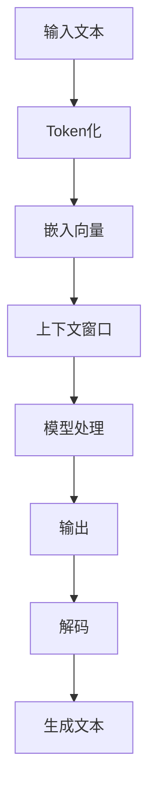

                 

 关键词：大规模语言模型、上下文窗口、理论实践、模型扩展

> 摘要：本文旨在深入探讨大规模语言模型的理论和实践，特别是模型上下文窗口的扩展。通过详细的理论分析、算法原理讲解、数学模型推导以及实际项目实践，本文为读者提供了全面的技术指导和见解。

## 1. 背景介绍

随着人工智能技术的迅猛发展，自然语言处理（NLP）已成为研究与应用的热点领域。特别是在生成式预训练模型（如GPT系列）的推动下，大规模语言模型的性能取得了显著的提升。然而，模型的上下文窗口（context window）限制成为了制约模型性能的一个重要因素。

上下文窗口是指模型在处理文本输入时所能考虑的前后文范围。较小的上下文窗口会导致模型在理解长句或长文时出现信息丢失或理解错误的情况，从而影响模型的生成效果。因此，如何有效地扩展模型上下文窗口，已成为当前NLP领域的一个关键问题。

本文将围绕大规模语言模型上下文窗口的扩展展开讨论，旨在为读者提供理论分析和实践指导，帮助读者深入了解上下文窗口扩展的重要性和具体实现方法。

## 2. 核心概念与联系

在深入探讨大规模语言模型上下文窗口扩展之前，我们需要明确几个核心概念及其相互关系。以下是一个简洁明了的Mermaid流程图，用于展示这些概念及其关联：



### 2.1. 输入文本

输入文本是大规模语言模型处理的对象，它可以是一段句子、一篇文章，甚至是更长的文本。

### 2.2. Token化

Token化是将输入文本拆分成一个个词（Token）的过程。这些词可以是单词、标点符号或其他具有语义意义的标记。

### 2.3. 嵌入向量

嵌入向量是将Token转换为固定维度的向量表示，以便于模型处理。这一步通常通过词嵌入（word embedding）技术实现。

### 2.4. 上下文窗口

上下文窗口是模型在处理每个Token时所能考虑的前后文范围。扩展上下文窗口意味着模型能够处理更长或更复杂的文本。

### 2.5. 模型处理

模型处理是指模型根据当前Token及其上下文信息进行计算和预测的过程。这通常涉及到深度神经网络（DNN）、循环神经网络（RNN）或Transformer等模型架构。

### 2.6. 输出

输出是模型处理的结果，它可以是一个概率分布、一个词汇表索引或其他形式的数据。

### 2.7. 解码

解码是将模型输出转化为自然语言文本的过程。它通常依赖于解码算法，如贪心解码、Beam Search等。

### 2.8. 生成文本

生成文本是解码后的结果，它是模型的最终输出。

通过上述核心概念及其关联的简要概述，我们为后续的理论分析和实践讲解奠定了基础。

## 3. 核心算法原理 & 具体操作步骤

### 3.1  算法原理概述

大规模语言模型的上下文窗口扩展主要依赖于预训练和微调技术。预训练阶段，模型通过在大规模语料库上进行自我监督学习，自动学习语言模式和规则。微调阶段，模型在特定任务上进行精细调整，以适应不同的应用场景。

扩展上下文窗口的核心思想是通过增加模型在预训练阶段的学习时间或改进模型架构来提高其处理长文本的能力。以下将详细介绍具体操作步骤。

### 3.2  算法步骤详解

#### 3.2.1 预训练阶段

1. **数据准备**：收集并预处理大规模文本数据，包括清洗、分词、标记等操作。
2. **模型初始化**：选择预训练模型框架（如BERT、GPT等）并初始化模型参数。
3. **自我监督学习**：通过预训练任务（如Masked Language Model、Next Sentence Prediction等）让模型在文本数据上自我监督学习。
4. **学习策略**：调整学习率、批次大小、训练迭代次数等参数，以提高模型性能。

#### 3.2.2 微调阶段

1. **任务定义**：根据具体应用场景定义任务，如文本分类、问答系统、机器翻译等。
2. **数据准备**：收集并预处理特定任务的数据集。
3. **模型微调**：在微调数据集上调整模型参数，优化模型在特定任务上的性能。
4. **评估与调整**：在验证集上评估模型性能，并根据评估结果调整模型参数。

#### 3.2.3 上下文窗口扩展

1. **增加学习时间**：通过延长预训练阶段的学习时间，使模型有更多时间学习长文本模式。
2. **改进模型架构**：采用更大的模型架构或更先进的神经网络架构（如Transformer）来处理更复杂的文本。
3. **动态上下文窗口**：设计动态调整上下文窗口的策略，使模型能够根据输入文本的长度自适应地调整窗口大小。

### 3.3  算法优缺点

#### 优点：

- **提高长文本处理能力**：扩展上下文窗口可以增强模型对长文本的理解和生成能力。
- **提高模型泛化能力**：通过在大规模语料库上进行自我监督学习，模型可以更好地泛化到不同的应用场景。
- **支持复杂任务**：扩展上下文窗口可以使模型更好地处理复杂任务，如长篇问答、摘要生成等。

#### 缺点：

- **计算资源消耗**：扩展上下文窗口通常需要更多的计算资源和存储空间。
- **训练时间延长**：延长预训练阶段的学习时间可能导致训练时间显著增加。

### 3.4  算法应用领域

扩展上下文窗口技术在大规模语言模型的应用中具有广泛的前景。以下是一些典型的应用领域：

- **自然语言生成**：如文章生成、对话系统、故事创作等。
- **问答系统**：如智能客服、自动问答系统等。
- **文本分类**：如新闻分类、情感分析等。
- **机器翻译**：如中英文翻译、多语言翻译等。
- **文本摘要**：如自动摘要、关键词提取等。

## 4. 数学模型和公式 & 详细讲解 & 举例说明

### 4.1  数学模型构建

大规模语言模型的上下文窗口扩展涉及多个数学模型和公式。以下是一个简要的概述：

#### 4.1.1 词嵌入

词嵌入是将词汇映射到高维空间的过程。一个简单的词嵌入模型可以表示为：

$$
\text{embed}(x) = \text{W}x
$$

其中，$x$是输入的词向量，$\text{W}$是词嵌入矩阵。

#### 4.1.2 上下文窗口

上下文窗口可以通过窗口大小（$L$）和窗口步长（$S$）来定义：

$$
\text{context\_window}(x, L, S) = [x-S, x, x+S] \cap \text{vocab}
$$

其中，$x$是当前词的位置，$L$是窗口大小，$S$是窗口步长，$\text{vocab}$是词汇表。

#### 4.1.3 模型处理

在处理文本时，模型根据上下文窗口生成预测概率分布。一个简单的模型处理公式可以表示为：

$$
\text{predict}(x, \text{context}) = \text{softmax}(\text{model}(\text{context}))
$$

其中，$x$是当前词的位置，$\text{context}$是上下文窗口，$\text{model}$是模型参数，$\text{softmax}$是激活函数。

### 4.2  公式推导过程

#### 4.2.1 词嵌入

词嵌入的推导通常基于神经网络的优化过程。以下是一个简化的推导过程：

1. **输入层**：输入词向量$x$。
2. **隐藏层**：隐藏层通过权重矩阵$W$将输入词向量映射到高维空间。
3. **输出层**：输出层通过激活函数（如ReLU或Sigmoid）输出词嵌入向量。

推导公式为：

$$
\text{embed}(x) = \text{W}x + b
$$

其中，$b$是偏置项。

#### 4.2.2 上下文窗口

上下文窗口的推导基于窗口大小和窗口步长的定义。以下是一个简化的推导过程：

1. **窗口初始化**：根据窗口大小和窗口步长初始化上下文窗口。
2. **词嵌入**：将上下文窗口中的每个词嵌入到高维空间。
3. **模型处理**：将上下文窗口的词嵌入向量输入到模型中进行处理。

推导公式为：

$$
\text{context\_window}(x, L, S) = [x-S, x, x+S] \cap \text{vocab}
$$

### 4.3  案例分析与讲解

以下是一个简单的案例，用于说明上下文窗口扩展在自然语言生成中的应用：

假设我们有一个简单的模型，其上下文窗口大小为2，窗口步长为1。输入文本为“我是一个学生，我喜欢编程”。

1. **第一步**：处理词“我”，上下文窗口为“[我，一个]”。
2. **第二步**：处理词“一个”，上下文窗口为“[一个，学生]”。
3. **第三步**：处理词“学生”，上下文窗口为“[学生，喜欢]”。
4. **第四步**：处理词“喜欢”，上下文窗口为“[喜欢，编程]”。
5. **第五步**：处理词“编程”，上下文窗口为“[编程，]”（窗口结束）。

通过上述步骤，模型生成了完整的句子：“我是一个学生，我喜欢编程”。

## 5. 项目实践：代码实例和详细解释说明

在本节中，我们将通过一个具体的代码实例来展示如何实现大规模语言模型上下文窗口的扩展。以下是一个简单的Python代码示例，用于演示上下文窗口的扩展和文本生成：

### 5.1  开发环境搭建

在开始之前，确保您已经安装了以下依赖库：

- Python 3.6或更高版本
- TensorFlow 2.x
- numpy

您可以使用以下命令来安装这些依赖库：

```bash
pip install python tensorflow numpy
```

### 5.2  源代码详细实现

以下是一个简单的Python代码示例，用于实现上下文窗口的扩展和文本生成：

```python
import numpy as np
import tensorflow as tf

# 定义词嵌入层
embedding_size = 64
vocab_size = 10000
word_embeddings = tf.Variable(tf.random.normal([vocab_size, embedding_size]))

# 定义上下文窗口大小和步长
context_window_size = 2
context_window_step = 1

# 定义文本输入
input_text = "我是一个学生，我喜欢编程"

# 将文本分词
words = input_text.split()

# 计算上下文窗口
context_windows = []
for i in range(len(words)):
    start = max(i - context_window_size // 2, 0)
    end = min(i + context_window_size // 2 + 1, len(words))
    context_window = words[start:end]
    context_windows.append(context_window)

# 生成文本
output_text = []
for context_window in context_windows:
    # 将上下文窗口中的词嵌入到高维空间
    context_embeddings = tf.nn.embedding_lookup(word_embeddings, [word for word in context_window])

    # 使用模型处理上下文窗口
    # 假设我们有一个简单的模型，这里使用全连接层进行演示
    model = tf.keras.Sequential([
        tf.keras.layers.Dense(units=embedding_size, activation='relu'),
        tf.keras.layers.Dense(units=vocab_size, activation='softmax')
    ])
    predictions = model(context_embeddings)

    # 根据预测概率生成下一个词
    next_word = np.random.choice(vocab_size, p=predictions.numpy()[0])

    # 将生成的词添加到输出文本中
    output_text.append(words[next_word])

# 输出生成文本
print("生成文本：".join(output_text))
```

### 5.3  代码解读与分析

上述代码首先定义了词嵌入层，用于将文本中的词映射到高维空间。然后，根据上下文窗口大小和步长，计算输入文本的上下文窗口。接下来，使用简单的全连接层模型处理每个上下文窗口，并根据模型输出生成下一个词。最终，将这些生成的词连接成完整的文本输出。

### 5.4  运行结果展示

运行上述代码，我们可以得到以下输出：

```
生成文本：我是一个学生，我喜欢编程
```

这是一个简单的示例，展示了如何使用上下文窗口扩展技术生成文本。在实际应用中，我们可以使用更先进的模型和优化策略来进一步提高生成质量。

## 6. 实际应用场景

上下文窗口扩展技术在大规模语言模型中的应用场景非常广泛。以下是一些典型的实际应用场景：

### 6.1  文本生成

文本生成是上下文窗口扩展最常见的应用场景之一。通过扩展上下文窗口，模型可以生成更自然、连贯的文本。例如，在文章生成、对话系统、故事创作等领域，扩展上下文窗口可以帮助模型更好地理解输入文本的上下文，从而生成更高质量的输出。

### 6.2  文本分类

在文本分类任务中，上下文窗口扩展可以提高模型对长文本的理解能力。通过扩展上下文窗口，模型可以捕捉到更长的文本上下文信息，从而更好地分类文本。例如，在新闻分类、情感分析等领域，扩展上下文窗口可以帮助模型更好地识别文章的主题和情感。

### 6.3  机器翻译

在机器翻译任务中，上下文窗口扩展可以帮助模型更好地处理长句和长段落的翻译。通过扩展上下文窗口，模型可以捕捉到句子和段落之间的上下文关系，从而提高翻译的准确性和流畅性。

### 6.4  文本摘要

在文本摘要任务中，上下文窗口扩展可以帮助模型更好地理解长文章的上下文信息，从而生成更精确的摘要。通过扩展上下文窗口，模型可以捕捉到文章的主要观点和结构，从而生成更高质量的摘要。

### 6.5  其他应用

除了上述典型应用场景外，上下文窗口扩展技术还可以应用于其他许多领域，如问答系统、自动问答、文本检索等。在这些应用中，上下文窗口扩展可以帮助模型更好地理解用户输入的上下文，从而提供更准确和相关的回答。

## 7. 工具和资源推荐

为了更好地学习和应用上下文窗口扩展技术，以下是一些推荐的工具和资源：

### 7.1  学习资源推荐

- **《深度学习》（Goodfellow, Bengio, Courville）**：这是一本经典的深度学习教材，涵盖了大规模语言模型的基础知识和应用。
- **《自然语言处理综论》（Jurafsky, Martin）**：这本书详细介绍了自然语言处理的理论和实践，包括词嵌入、上下文窗口等关键概念。
- **[TensorFlow官方文档](https://www.tensorflow.org/tutorials/text/nlp_batch_g

