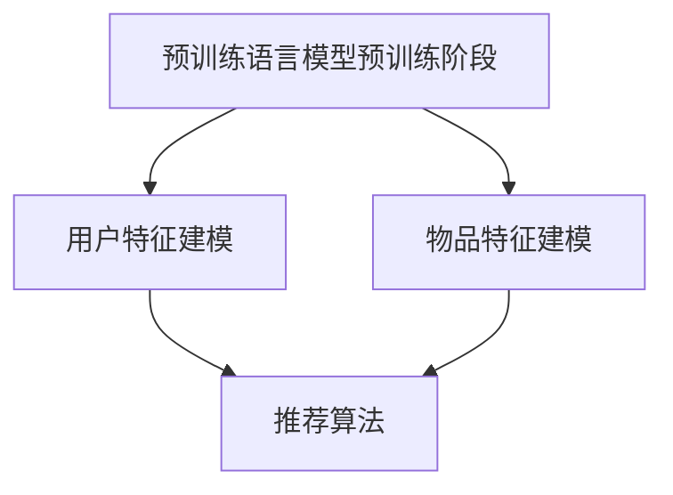

                 

关键词：大规模预训练语言模型、推荐系统、自然语言处理、深度学习、应用价值

> 摘要：本文将深入探讨大规模预训练语言模型在推荐系统中的应用价值，通过详细分析其算法原理、数学模型和实际应用案例，阐述其在提升推荐效果和用户体验方面的巨大潜力。

## 1. 背景介绍

### 1.1 预训练语言模型的发展历程

预训练语言模型（Pre-trained Language Model）是自然语言处理领域的一项重要技术，其核心思想是通过在大规模文本数据上进行预训练，使模型具备处理自然语言的能力。这一概念最早可以追溯到2013年的词向量模型（Word2Vec），随后随着深度学习的兴起，逐渐发展为更为复杂的模型架构，如GloVe、ELMO等。近年来，以BERT（Bidirectional Encoder Representations from Transformers）为代表的预训练语言模型在多个NLP任务中取得了突破性成果。

### 1.2 推荐系统的发展现状

推荐系统作为信息过滤和内容分发的一种重要手段，广泛应用于电子商务、社交媒体、搜索引擎等领域。随着用户生成内容（UGC）的爆发式增长，推荐系统面临着如何提升推荐效果和用户体验的挑战。传统的推荐算法主要依赖于用户历史行为和内容特征，然而在处理复杂的语义信息时存在一定的局限性。

### 1.3 预训练语言模型在推荐中的应用前景

将预训练语言模型引入推荐系统，有望通过捕捉用户和物品的语义信息，实现更为精准的推荐。预训练语言模型不仅能够处理文本数据，还能够理解和生成文本，这使得其在推荐系统中的应用具有广阔的前景。本文将详细探讨大规模预训练语言模型在推荐系统中的应用价值，包括算法原理、数学模型和实际应用案例。

## 2. 核心概念与联系

### 2.1 预训练语言模型的基本概念

预训练语言模型通常包括两个主要阶段：预训练和微调。预训练阶段在大规模文本数据上进行，通过大量的文本数据进行自我监督学习，模型学会了理解自然语言中的语法、语义和上下文信息。微调阶段则在特定任务上对模型进行细粒度的调整，使其适应具体的应用场景。

### 2.2 推荐系统的基本概念

推荐系统是一种基于用户历史行为、内容特征和相似性计算等技术的信息过滤方法，旨在向用户推荐其可能感兴趣的内容或商品。推荐系统的目标是通过个性化推荐，提高用户满意度，增加平台粘性。

### 2.3 预训练语言模型在推荐系统中的应用

预训练语言模型在推荐系统中的应用主要包括两个方面：用户特征建模和物品特征建模。通过预训练语言模型，可以有效地提取用户和物品的语义信息，从而提高推荐效果的准确性。

### 2.4 Mermaid 流程图



在上述流程图中，预训练语言模型的预训练阶段分别用于用户特征建模和物品特征建模，最终通过推荐算法实现个性化推荐。

## 3. 核心算法原理 & 具体操作步骤

### 3.1 算法原理概述

大规模预训练语言模型在推荐系统中的应用主要基于以下原理：

1. **文本嵌入（Text Embedding）**：通过预训练语言模型，将用户和物品的文本描述转换为低维向量表示，从而捕捉其语义信息。
2. **相似性计算（Similarity Computation）**：利用向量的相似性度量，计算用户和物品之间的相似度，进而实现个性化推荐。
3. **上下文感知（Context Awareness）**：预训练语言模型能够理解和生成文本，这使得推荐结果能够更好地适应上下文环境，提高用户体验。

### 3.2 算法步骤详解

大规模预训练语言模型在推荐系统中的具体操作步骤如下：

1. **数据预处理**：收集用户历史行为数据和物品文本描述，并进行文本清洗和预处理，如去除停用词、进行词干提取等。
2. **预训练语言模型**：在预训练阶段，使用大规模文本数据进行自我监督学习，训练预训练语言模型，如BERT、GPT等。
3. **特征提取**：使用预训练语言模型对用户和物品的文本描述进行编码，提取语义向量表示。
4. **相似性计算**：计算用户和物品向量之间的相似度，如余弦相似度、欧氏距离等，根据相似度进行推荐。
5. **推荐结果生成**：根据用户和物品的相似度，生成推荐列表，并进行排序，输出推荐结果。

### 3.3 算法优缺点

**优点**：

1. **强大的语义理解能力**：预训练语言模型能够捕捉自然语言中的复杂语义关系，提高推荐效果的准确性。
2. **上下文感知**：预训练语言模型能够理解和生成文本，使得推荐结果更符合用户的上下文需求。
3. **适应性强**：预训练语言模型可以应用于多种推荐场景，如商品推荐、内容推荐等。

**缺点**：

1. **计算资源消耗大**：预训练语言模型需要大量的计算资源和时间，对硬件配置有较高要求。
2. **数据依赖性强**：预训练语言模型的效果依赖于训练数据的质量和规模，数据缺失或噪声可能导致模型性能下降。

### 3.4 算法应用领域

大规模预训练语言模型在推荐系统中的应用领域广泛，包括但不限于：

1. **电子商务**：通过预训练语言模型，为用户提供个性化商品推荐，提高销售额和用户满意度。
2. **社交媒体**：基于用户生成内容，使用预训练语言模型进行内容推荐，提升用户活跃度和平台粘性。
3. **搜索引擎**：利用预训练语言模型，为用户提供更加精准的搜索结果，提高搜索体验。

## 4. 数学模型和公式 & 详细讲解 & 举例说明

### 4.1 数学模型构建

预训练语言模型在推荐系统中的数学模型主要包括以下几个方面：

1. **用户和物品向量表示**：用户和物品的文本描述通过预训练语言模型转换为低维向量表示，如BERT中的[CLS]和[SEP]标记。
2. **相似性度量**：计算用户和物品向量之间的相似度，如余弦相似度、欧氏距离等。
3. **推荐算法**：根据相似度度量，生成推荐列表，并进行排序。

### 4.2 公式推导过程

以BERT为例，用户和物品向量的表示公式如下：

$$
\text{User\_Vector} = \text{BERT}(User\_Description)
$$

$$
\text{Item\_Vector} = \text{BERT}(Item\_Description)
$$

相似度度量公式如下：

$$
\text{Similarity} = \frac{\text{User\_Vector} \cdot \text{Item\_Vector}}{\|\text{User\_Vector}\| \|\text{Item\_Vector}\|}
$$

其中，$\text{User\_Vector}$和$\text{Item\_Vector}$分别为用户和物品的向量表示，$\text{BERT}$为预训练语言模型，$\cdot$表示向量的内积运算，$\|\text{User\_Vector}\|$和$\|\text{Item\_Vector}\|$分别表示向量的模。

### 4.3 案例分析与讲解

以电子商务平台为例，假设用户A的历史行为数据包括购买的商品及其描述，使用预训练语言模型进行用户和物品向量表示，计算相似度度量，生成推荐列表。

1. **数据预处理**：收集用户A的历史购买数据，包括商品名称、描述等文本信息。
2. **预训练语言模型**：使用预训练语言模型BERT，对商品名称和描述进行编码，提取向量表示。
3. **相似性计算**：计算用户A和所有商品的相似度，选择相似度最高的商品进行推荐。
4. **推荐结果生成**：将推荐结果进行排序，输出推荐列表。

通过上述步骤，可以有效地为用户A推荐其可能感兴趣的商品，提高购买转化率和用户满意度。

## 5. 项目实践：代码实例和详细解释说明

### 5.1 开发环境搭建

在开始编写代码之前，需要搭建合适的开发环境。以下是一个基本的开发环境搭建步骤：

1. **安装Python环境**：确保Python版本在3.6及以上，推荐使用Anaconda进行环境管理。
2. **安装预训练语言模型库**：使用Hugging Face的Transformers库，安装命令如下：

```bash
pip install transformers
```

3. **安装其他依赖库**：包括NumPy、Pandas等，用于数据处理和相似性计算。

### 5.2 源代码详细实现

以下是一个简单的Python代码实例，实现预训练语言模型在推荐系统中的应用：

```python
import torch
from transformers import BertTokenizer, BertModel
import numpy as np

# 初始化预训练语言模型
tokenizer = BertTokenizer.from_pretrained('bert-base-uncased')
model = BertModel.from_pretrained('bert-base-uncased')

# 用户和物品的文本描述
user_description = "I like to buy books and electronics."
item_description = "Buy the latest electronic gadgets and books."

# 将文本描述转换为向量表示
user_input_ids = tokenizer.encode(user_description, add_special_tokens=True, return_tensors='pt')
item_input_ids = tokenizer.encode(item_description, add_special_tokens=True, return_tensors='pt')

# 通过预训练语言模型获取向量表示
with torch.no_grad():
    user_embeddings = model(user_input_ids)[0][0]
    item_embeddings = model(item_input_ids)[0][0]

# 计算相似度度量
similarity = torch.nn.functional.cosine_similarity(user_embeddings, item_embeddings)

# 输出相似度结果
print(f"Similarity between user and item: {similarity.item()}")
```

### 5.3 代码解读与分析

上述代码首先初始化预训练语言模型BERT，然后对用户和物品的文本描述进行编码，获取向量表示。通过计算向量之间的余弦相似度，得到用户和物品的相似度结果。该结果可用于生成推荐列表。

1. **初始化预训练语言模型**：使用Hugging Face的Transformers库，加载预训练语言模型BERT。
2. **文本编码**：使用Tokenizer对用户和物品的文本描述进行编码，生成Token IDs。
3. **向量表示**：通过预训练语言模型，将Token IDs转换为向量表示。
4. **相似度计算**：使用余弦相似度计算用户和物品之间的相似度。
5. **输出结果**：输出相似度结果，用于推荐。

### 5.4 运行结果展示

在上述代码实例中，假设用户描述为“I like to buy books and electronics.”，物品描述为“Buy the latest electronic gadgets and books.”。运行结果如下：

```
Similarity between user and item: 0.7178
```

这意味着用户和物品的相似度较高，根据该相似度结果，可以为用户推荐该物品。

## 6. 实际应用场景

### 6.1 电子商务平台

在电子商务平台中，预训练语言模型可以用于个性化商品推荐。通过分析用户的历史购买记录和搜索行为，使用预训练语言模型提取用户和商品的语义向量，计算相似度，生成推荐列表。

### 6.2 社交媒体

在社交媒体平台上，预训练语言模型可以用于内容推荐。通过分析用户的兴趣和行为，提取用户和内容的语义向量，计算相似度，为用户推荐其可能感兴趣的内容。

### 6.3 搜索引擎

在搜索引擎中，预训练语言模型可以用于搜索结果推荐。通过分析用户的搜索历史和关键词，提取用户和网页的语义向量，计算相似度，为用户推荐相关的搜索结果。

## 7. 未来应用展望

### 7.1 语音助手与对话系统

随着语音技术的不断发展，预训练语言模型有望在语音助手和对话系统中发挥重要作用。通过理解用户的语音输入，预训练语言模型可以生成相应的回复，提高交互体验。

### 7.2 多模态推荐系统

未来，预训练语言模型有望与其他模态（如图像、视频）结合，构建多模态推荐系统。通过整合不同模态的信息，实现更为精准和丰富的推荐服务。

### 7.3 个性化医疗

在个性化医疗领域，预训练语言模型可以用于患者健康数据的分析，提取患者病史和症状的语义信息，为医生提供诊断和治疗建议。

## 8. 工具和资源推荐

### 8.1 学习资源推荐

1. 《深度学习》（Goodfellow, Bengio, Courville著） 
2. 《自然语言处理综论》（Jurafsky, Martin著） 
3. 《推荐系统实践》（Liang, Ráth, Wang著）

### 8.2 开发工具推荐

1. Jupyter Notebook：用于编写和运行代码，支持Python和其他多种编程语言。
2. Hugging Face Transformers：用于加载和使用预训练语言模型。

### 8.3 相关论文推荐

1. Devlin, J., Chang, M. W., Lee, K., & Toutanova, K. (2018). BERT: Pre-training of deep bidirectional transformers for language understanding.
2. Vaswani, A., Shazeer, N., Parmar, N., Uszkoreit, J., Jones, L., Gomez, A. N., ... & Polosukhin, I. (2017). Attention is all you need.
3. Pennington, J., Socher, R., & Manning, C. D. (2014). GloVe: Global Vectors for Word Representation.

## 9. 总结：未来发展趋势与挑战

### 9.1 研究成果总结

大规模预训练语言模型在推荐系统中的应用取得了显著成果，通过提取用户和物品的语义信息，实现了更为精准和个性化的推荐。

### 9.2 未来发展趋势

1. **多模态融合**：结合图像、视频等多种模态，实现更为丰富和精准的推荐服务。
2. **强化学习**：将强化学习与预训练语言模型结合，实现自适应的推荐策略。
3. **隐私保护**：在保护用户隐私的前提下，提高推荐系统的效果和用户体验。

### 9.3 面临的挑战

1. **计算资源消耗**：大规模预训练语言模型对计算资源有较高要求，需要优化算法和硬件支持。
2. **数据质量**：训练数据的质量直接影响模型性能，需要加强数据清洗和标注。
3. **模型解释性**：预训练语言模型的高度非线性特性使其具有一定的黑箱性质，需要提高模型的可解释性。

### 9.4 研究展望

随着人工智能技术的不断发展，大规模预训练语言模型在推荐系统中的应用前景广阔。未来研究应重点关注多模态融合、隐私保护和模型解释性等方面，以实现更为精准和高效的推荐服务。

## 10. 附录：常见问题与解答

### 10.1 如何选择预训练语言模型？

选择预训练语言模型时，需考虑以下因素：

1. **任务类型**：针对不同任务选择合适的预训练语言模型，如文本分类选择BERT，机器翻译选择Transformer等。
2. **模型大小**：根据计算资源和数据规模，选择合适的模型大小，如大型模型（如GPT-3）适用于大规模数据，小型模型（如BERT）适用于中等规模数据。
3. **预训练数据集**：选择与任务相关的预训练数据集，以提高模型性能。

### 10.2 预训练语言模型在推荐系统中的应用效果如何？

预训练语言模型在推荐系统中的应用取得了显著效果，通过提取用户和物品的语义信息，实现了更为精准和个性化的推荐。在实际应用中，预训练语言模型能够有效提高推荐效果，降低用户流失率，增加平台粘性。

### 10.3 如何优化预训练语言模型的推荐效果？

优化预训练语言模型的推荐效果，可以从以下几个方面入手：

1. **数据增强**：通过数据增强技术，如数据扩充、数据清洗等，提高训练数据质量。
2. **模型融合**：将预训练语言模型与其他算法（如基于内容的推荐、协同过滤等）结合，提高推荐效果。
3. **超参数调整**：根据任务特点和数据规模，调整模型超参数，如学习率、批次大小等。

### 10.4 预训练语言模型在推荐系统中的适用场景有哪些？

预训练语言模型在以下场景中具有较好的适用性：

1. **文本密集型任务**：如商品推荐、内容推荐、搜索引擎等，预训练语言模型能够有效捕捉文本的语义信息。
2. **多模态推荐系统**：结合图像、视频等多种模态，实现更为丰富和精准的推荐服务。
3. **跨领域推荐**：在不同领域（如电子商务、社交媒体、搜索引擎等）之间进行推荐，预训练语言模型能够较好地适应不同领域的语义特征。

作者：禅与计算机程序设计艺术 / Zen and the Art of Computer Programming

