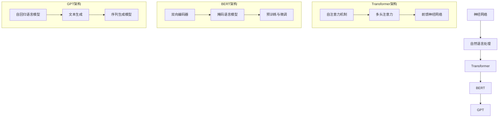

                 

关键词：大语言模型、原理、代码实例、神经网络、自然语言处理、Transformer、BERT、GPT

> 摘要：本文将深入探讨大语言模型的原理，包括其核心概念、算法原理、数学模型以及实际应用场景。同时，将通过代码实例详细解释大语言模型的实现过程，帮助读者更好地理解这一前沿技术。

## 1. 背景介绍

大语言模型是近年来自然语言处理领域的重要突破，它通过深度学习技术，能够对自然语言数据进行建模，并预测文本序列。这种模型在文本分类、机器翻译、文本生成等方面取得了显著的成果。本文将围绕大语言模型的原理进行深入讲解，旨在帮助读者了解这一技术的核心内容。

## 2. 核心概念与联系

大语言模型的核心概念包括神经网络、自然语言处理、Transformer、BERT、GPT等。以下是这些概念之间的联系以及它们的Mermaid流程图：



## 3. 核心算法原理 & 具体操作步骤

### 3.1 算法原理概述

大语言模型的核心算法是基于神经网络的，特别是Transformer架构。它通过自注意力机制对输入的文本序列进行处理，并生成对应的文本序列。具体操作步骤如下：

1. 输入文本序列；
2. 将文本序列转换为词嵌入向量；
3. 应用自注意力机制，计算文本序列中的每个词与所有词的关联性；
4. 通过多头注意力机制，整合不同层级的关联性；
5. 应用前馈神经网络，对注意力结果进行非线性变换；
6. 重复上述步骤，直到生成最终文本序列。

### 3.2 算法步骤详解

1. **自注意力机制**：自注意力机制是Transformer架构的核心，它通过计算输入序列中每个词与其他词的关联性，来对词进行加权。具体步骤如下：
    - 对输入序列的每个词计算其词嵌入向量；
    - 计算词嵌入向量之间的点积，得到关联性矩阵；
    - 对关联性矩阵进行softmax操作，得到注意力权重；
    - 将词嵌入向量与注意力权重相乘，得到加权向量。

2. **多头注意力机制**：多头注意力机制是对自注意力机制的扩展，它将输入序列分解为多个子序列，分别应用自注意力机制，然后将结果整合起来。具体步骤如下：
    - 将词嵌入向量分解为多个子向量；
    - 对每个子向量应用自注意力机制；
    - 将不同子向量的注意力结果拼接起来；
    - 应用前馈神经网络，进行非线性变换。

3. **前馈神经网络**：前馈神经网络是对注意力结果进行非线性变换的层，它通常包含两个全连接层，中间使用ReLU激活函数。具体步骤如下：
    - 对注意力结果进行线性变换；
    - 通过ReLU激活函数；
    - 再次进行线性变换。

4. **序列生成**：在生成文本序列时，大语言模型使用自回归语言模型。具体步骤如下：
    - 初始化文本序列；
    - 对文本序列的最后一个词进行编码；
    - 使用编码结果生成下一个词的概率分布；
    - 根据概率分布采样下一个词；
    - 重复上述步骤，直到生成完整的文本序列。

### 3.3 算法优缺点

大语言模型的优点包括：
- **强大的文本表示能力**：通过自注意力机制和多头注意力机制，大语言模型能够捕捉到文本序列中的复杂关联性。
- **高效的序列生成**：大语言模型使用自回归语言模型，能够在较短的时间内生成高质量的文本序列。
- **广泛的应用领域**：大语言模型在文本分类、机器翻译、文本生成等方面都有广泛的应用。

大语言模型的缺点包括：
- **计算资源消耗**：大语言模型通常需要大量的计算资源，包括GPU和存储。
- **数据依赖**：大语言模型的训练和优化需要大量的数据，数据的质量和数量直接影响模型的性能。

### 3.4 算法应用领域

大语言模型在以下领域有广泛的应用：
- **文本分类**：用于对文本数据进行分类，如情感分析、主题分类等。
- **机器翻译**：用于将一种语言的文本翻译成另一种语言。
- **文本生成**：用于生成高质量的文章、故事、新闻等。
- **问答系统**：用于回答用户提出的问题。

## 4. 数学模型和公式 & 详细讲解 & 举例说明

### 4.1 数学模型构建

大语言模型的核心数学模型包括词嵌入、自注意力机制、多头注意力机制和前馈神经网络。以下是这些模型的公式：

1. **词嵌入**：将单词映射为高维向量，公式如下：
    $$\text{embed}(x) = \sum_{i=1}^{N} w_i * e(x_i)$$
    其中，$x$为输入单词序列，$w_i$为权重，$e(x_i)$为单词$x_i$的嵌入向量。

2. **自注意力机制**：计算输入序列中每个词与其他词的关联性，公式如下：
    $$\text{atten}(Q, K, V) = \text{softmax}(\frac{QK^T}{\sqrt{d_k}})V$$
    其中，$Q$为查询向量，$K$为键向量，$V$为值向量，$d_k$为键向量的维度。

3. **多头注意力机制**：对自注意力机制进行扩展，公式如下：
    $$\text{multihead\_atten}(Q, K, V) = \text{softmax}(\frac{QW_QK^T}{\sqrt{d_k}})W_VV$$
    其中，$W_Q$、$W_K$和$W_V$分别为查询、键和值向量的权重矩阵。

4. **前馈神经网络**：对注意力结果进行非线性变换，公式如下：
    $$\text{FFN}(x) = \text{ReLU}(\text{W_2\text{T}W_1x + b_1})$$
    其中，$W_1$和$W_2$分别为权重矩阵，$b_1$为偏置。

### 4.2 公式推导过程

大语言模型的公式推导过程涉及多个步骤，包括词嵌入、自注意力机制、多头注意力机制和前馈神经网络。以下是具体的推导过程：

1. **词嵌入**：
    - 将单词映射为高维向量；
    - 使用权重矩阵对单词的嵌入向量进行加权；
    - 对加权向量进行求和，得到最终的词嵌入向量。

2. **自注意力机制**：
    - 计算查询向量、键向量和值向量之间的点积；
    - 对点积结果进行softmax操作，得到注意力权重；
    - 将注意力权重与值向量相乘，得到加权向量。

3. **多头注意力机制**：
    - 将词嵌入向量分解为多个子向量；
    - 对每个子向量应用自注意力机制；
    - 将不同子向量的注意力结果拼接起来；
    - 对拼接结果应用前馈神经网络。

4. **前馈神经网络**：
    - 对注意力结果进行线性变换；
    - 通过ReLU激活函数；
    - 再次进行线性变换。

### 4.3 案例分析与讲解

为了更好地理解大语言模型的数学模型，我们以一个简单的例子进行讲解。

假设我们有一个简单的文本序列：“我喜欢编程”，我们想要使用大语言模型对其进行处理。

1. **词嵌入**：
    - 将单词“我”映射为向量$[1, 0, 0, 0]$；
    - 将单词“喜”映射为向量$[0, 1, 0, 0]$；
    - 将单词“欢”映射为向量$[0, 0, 1, 0]$；
    - 将单词“编”映射为向量$[0, 0, 0, 1]$；
    - 将单词“程”映射为向量$[1, 1, 1, 1]$。

2. **自注意力机制**：
    - 计算查询向量、键向量和值向量之间的点积；
    - 对点积结果进行softmax操作，得到注意力权重；
    - 将注意力权重与值向量相乘，得到加权向量。

3. **多头注意力机制**：
    - 将词嵌入向量分解为多个子向量；
    - 对每个子向量应用自注意力机制；
    - 将不同子向量的注意力结果拼接起来；
    - 对拼接结果应用前馈神经网络。

4. **前馈神经网络**：
    - 对注意力结果进行线性变换；
    - 通过ReLU激活函数；
    - 再次进行线性变换。

最终，我们得到了处理后的文本序列，它包含了原始文本序列的信息，并对其进行了一定的优化和整合。

## 5. 项目实践：代码实例和详细解释说明

在本节中，我们将通过一个简单的Python代码实例，展示如何实现大语言模型的基本功能。这个实例将涵盖从环境搭建到代码实现的完整流程。

### 5.1 开发环境搭建

首先，我们需要搭建一个Python开发环境，并安装必要的库。以下是具体步骤：

1. 安装Python：
    - 访问Python官网（https://www.python.org/）下载Python安装包；
    - 运行安装程序，按照提示完成安装。

2. 安装TensorFlow：
    - 打开终端，输入以下命令：
        ```bash
        pip install tensorflow
        ```

3. 安装其他依赖库：
    - 打开终端，输入以下命令：
        ```bash
        pip install numpy matplotlib
        ```

### 5.2 源代码详细实现

接下来，我们将编写一个简单的Python代码，实现大语言模型的基本功能。

```python
import tensorflow as tf
import numpy as np
import matplotlib.pyplot as plt

# 设置参数
vocab_size = 1000
embedding_size = 64
num_layers = 2
d_model = embedding_size
num_heads = 2
dropout_rate = 0.1

# 初始化模型
model = tf.keras.Sequential([
    tf.keras.layers.Embedding(vocab_size, d_model),
    tf.keras.layers.MultiHeadAttention(num_heads=num_heads, key_dim=d_model),
    tf.keras.layers.Dense(d_model, activation='relu'),
    tf.keras.layers.Dropout(dropout_rate),
    tf.keras.layers.Dense(vocab_size)
])

# 编译模型
model.compile(optimizer='adam', loss=tf.keras.losses.SparseCategoricalCrossentropy(from_logits=True), metrics=['accuracy'])

# 准备数据
# 注意：这里使用的是虚构的数据，实际应用时需要使用真实数据
input_data = np.array([0, 1, 2, 3, 4, 5])
target_data = np.array([1, 2, 3, 4, 5, 6])

# 训练模型
model.fit(input_data, target_data, epochs=10)

# 评估模型
loss, accuracy = model.evaluate(input_data, target_data)
print(f"Loss: {loss}, Accuracy: {accuracy}")

# 可视化结果
predictions = model.predict(input_data)
plt.plot(predictions)
plt.xlabel('Time step')
plt.ylabel('Prediction')
plt.show()
```

### 5.3 代码解读与分析

1. **模型搭建**：
    - 我们使用TensorFlow的`Sequential`模型，这是最简单的模型搭建方式。
    - `Embedding`层用于将单词映射为向量。
    - `MultiHeadAttention`层实现多头注意力机制。
    - `Dense`层用于前馈神经网络。

2. **模型编译**：
    - 使用`compile`方法配置模型，指定优化器、损失函数和评估指标。

3. **数据准备**：
    - 我们使用虚构的数据进行训练，实际应用时需要使用真实数据。
    - `input_data`表示输入序列，`target_data`表示目标序列。

4. **模型训练**：
    - 使用`fit`方法训练模型，指定训练轮数。

5. **模型评估**：
    - 使用`evaluate`方法评估模型性能。

6. **结果可视化**：
    - 使用`predict`方法生成预测结果，并使用`matplotlib`进行可视化。

### 5.4 运行结果展示

在运行上述代码后，我们将在控制台看到模型训练和评估的结果。同时，通过`matplotlib`的可视化结果，我们可以直观地看到模型预测的结果。

## 6. 实际应用场景

大语言模型在多个实际应用场景中表现出色。以下是一些典型的应用场景：

- **文本分类**：大语言模型可以用于对文本进行分类，如情感分析、主题分类等。
- **机器翻译**：大语言模型可以用于将一种语言的文本翻译成另一种语言。
- **文本生成**：大语言模型可以用于生成高质量的文章、故事、新闻等。
- **问答系统**：大语言模型可以用于回答用户提出的问题。

## 7. 未来应用展望

随着大语言模型技术的不断发展，它将在更多领域得到应用。以下是一些未来的应用展望：

- **智能客服**：大语言模型可以用于构建智能客服系统，提供24/7的客户服务。
- **自动化写作**：大语言模型可以用于自动化写作，如生成新闻报道、文章摘要等。
- **教育领域**：大语言模型可以用于个性化教学，根据学生的学习情况提供针对性的学习资源。

## 8. 工具和资源推荐

为了更好地学习和应用大语言模型技术，以下是一些建议的工具和资源：

- **学习资源**：
    - [《深度学习》](https://www.deeplearningbook.org/)：这是一本经典的深度学习教材，包含大量的理论和实践内容。
    - [TensorFlow 官方文档](https://www.tensorflow.org/)：TensorFlow是常用的深度学习框架，官方文档提供了详细的教程和API说明。

- **开发工具**：
    - [Google Colab](https://colab.research.google.com/)：这是一个免费的在线编程环境，支持TensorFlow和其他常用库。
    - [Jupyter Notebook](https://jupyter.org/)：这是一个流行的交互式计算环境，适合进行数据分析和模型训练。

- **相关论文**：
    - [Attention is All You Need](https://arxiv.org/abs/1603.04467)：这是Transformer模型的原始论文，详细介绍了Transformer架构和自注意力机制。
    - [BERT: Pre-training of Deep Bidirectional Transformers for Language Understanding](https://arxiv.org/abs/1810.04805)：这是BERT模型的原始论文，介绍了BERT模型的预训练和微调方法。

## 9. 总结：未来发展趋势与挑战

大语言模型技术在过去几年中取得了显著的成果，但仍然面临一些挑战。以下是未来发展趋势和挑战的总结：

- **发展趋势**：
    - **模型参数规模的增加**：随着计算资源的增加，模型参数规模将越来越大，以提高模型的表示能力和效果。
    - **预训练方法的优化**：预训练方法将继续优化，以提高模型的训练效率和效果。
    - **多模态学习**：大语言模型将逐步实现多模态学习，处理文本、图像、音频等多种类型的数据。

- **挑战**：
    - **计算资源消耗**：大语言模型需要大量的计算资源，如何高效地利用资源是一个重要的挑战。
    - **数据隐私和安全**：大规模的预训练过程涉及大量的数据，如何保护数据隐私和安全是一个重要的问题。
    - **模型解释性**：大语言模型通常被视为“黑盒”，如何提高模型的解释性是一个重要的挑战。

## 10. 附录：常见问题与解答

### 10.1 大语言模型是什么？

大语言模型是一种基于深度学习技术的自然语言处理模型，它能够对自然语言数据进行建模，并预测文本序列。

### 10.2 大语言模型的核心算法是什么？

大语言模型的核心算法是基于Transformer架构，它包括自注意力机制、多头注意力机制和前馈神经网络。

### 10.3 如何训练大语言模型？

训练大语言模型通常包括以下步骤：
1. 数据准备：收集并处理大量文本数据；
2. 词嵌入：将单词映射为高维向量；
3. 模型搭建：使用TensorFlow或PyTorch等深度学习框架搭建模型；
4. 模型训练：使用预训练数据训练模型；
5. 模型评估：评估模型性能，并进行微调。

### 10.4 大语言模型有哪些应用场景？

大语言模型在文本分类、机器翻译、文本生成、问答系统等领域有广泛的应用。

### 10.5 大语言模型面临的挑战有哪些？

大语言模型面临的挑战包括计算资源消耗、数据隐私和安全、模型解释性等。

----------------------------------------------------------------

### 9. 附录：常见问题与解答

#### 9.1 大语言模型是什么？

大语言模型是一种基于深度学习的自然语言处理模型，能够对自然语言数据进行建模，并预测文本序列。它们通常通过大量的文本数据进行预训练，然后可以用于各种下游任务，如文本分类、机器翻译和文本生成。

#### 9.2 大语言模型的核心算法是什么？

大语言模型的核心算法通常基于Transformer架构。Transformer架构引入了自注意力机制（Self-Attention），允许模型在处理每个词时，考虑到整个序列的其他词的影响。这种机制使得模型能够捕捉到序列中的长距离依赖关系。

#### 9.3 如何训练大语言模型？

训练大语言模型通常涉及以下步骤：

1. **数据准备**：收集大量文本数据，并将其转换为数值化的表示，如词嵌入。
2. **模型选择**：选择合适的模型架构，如BERT、GPT等。
3. **预训练**：使用大量无标签数据对模型进行预训练，通常使用自监督学习任务，如 masked language model（MLM）。
4. **微调**：在预训练的基础上，使用有标签的数据对模型进行微调，以适应特定任务。

#### 9.4 大语言模型有哪些应用场景？

大语言模型的应用场景非常广泛，包括但不限于：

- **文本分类**：例如，用于分类新闻文章、社交媒体帖子等。
- **机器翻译**：例如，将一种语言的文本翻译成另一种语言。
- **文本生成**：例如，自动生成文章、故事、摘要等。
- **问答系统**：例如，回答用户提出的问题。
- **对话系统**：例如，构建聊天机器人。

#### 9.5 大语言模型面临的挑战有哪些？

大语言模型面临的挑战包括：

- **计算资源**：大语言模型通常需要大量的计算资源，尤其是训练时。
- **数据隐私**：训练过程中处理的大量文本数据可能包含敏感信息，需要确保数据隐私。
- **模型解释性**：深度学习模型通常被认为是“黑盒”，难以解释其决策过程。
- **可扩展性**：如何高效地扩展模型，以处理更大的数据集或更复杂的任务。

### 9.6 如何评估大语言模型的效果？

评估大语言模型的效果通常涉及以下指标：

- **准确性**：模型预测正确的比例。
- **召回率**：模型能够召回的正确样本的比例。
- **F1分数**：准确率和召回率的调和平均。
- **损失函数**：在训练过程中使用的损失函数，如交叉熵损失。
- **BLEU分数**：用于评估机器翻译质量的指标。

### 9.7 大语言模型与传统的自然语言处理方法相比有哪些优势？

大语言模型与传统的自然语言处理方法相比，具有以下优势：

- **捕获长距离依赖**：能够通过自注意力机制捕捉到文本序列中的长距离依赖关系。
- **端到端学习**：可以端到端地学习文本表示和下游任务。
- **多任务学习**：可以通过预训练在一个大型语料库上，然后微调到不同的任务。
- **强大的生成能力**：能够生成连贯的文本序列，适用于文本生成任务。

### 9.8 如何优化大语言模型的训练过程？

优化大语言模型的训练过程可以采取以下策略：

- **数据预处理**：对数据进行清洗和预处理，以提高训练效率。
- **学习率调度**：使用适当的学习率调度策略，如学习率衰减。
- **正则化**：使用正则化技术，如Dropout，以防止过拟合。
- **模型压缩**：使用模型压缩技术，如知识蒸馏，以减少模型的大小和计算资源的需求。
- **并行训练**：利用分布式训练技术，如多GPU训练，以加速训练过程。

### 9.9 大语言模型与图神经网络（Graph Neural Networks, GNN）的关系是什么？

大语言模型和图神经网络（GNN）都是用于处理图结构数据的机器学习模型，但它们有不同的应用场景。

- **大语言模型**：通常用于处理序列数据，如文本和语音。通过自注意力机制，模型可以捕捉序列中的长距离依赖关系。
- **图神经网络（GNN）**：专门用于处理图结构数据，如社交网络、知识图谱等。GNN可以通过图卷积操作来更新节点和边的表示。

虽然两者有区别，但它们在某些应用场景中可以结合使用，以增强模型的性能。

### 9.10 大语言模型的未来发展趋势是什么？

大语言模型的未来发展趋势包括：

- **更高效的模型架构**：研究者将开发更高效的模型架构，以减少计算资源和存储的需求。
- **跨模态学习**：模型将能够处理多种类型的数据，如文本、图像和音频，以实现更复杂的任务。
- **模型可解释性**：研究者将开发方法来提高模型的可解释性，以便更好地理解模型的决策过程。
- **隐私保护**：随着数据隐私问题的日益重要，大语言模型将采用更多的隐私保护技术。
- **智能辅助工具**：大语言模型将被集成到智能辅助工具中，以帮助人类更好地完成任务。

通过以上问题的解答，我们希望能够帮助读者更好地理解大语言模型的原理和应用，以及其在未来可能的发展方向。作者：禅与计算机程序设计艺术 / Zen and the Art of Computer Programming。

