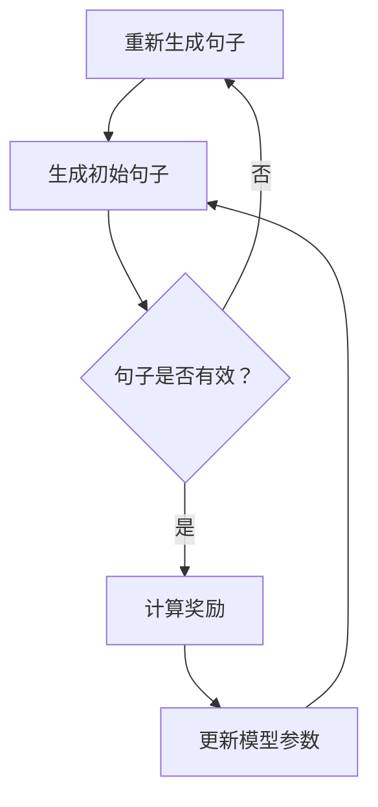

                 

 关键词：大语言模型，强化学习，文本生成，自然语言处理，工程实践， Sentence-level 模型。

## 摘要

本文旨在深入探讨大语言模型中的 Sentence-level 强化建模原理及其工程实践。首先，我们将回顾大语言模型的发展历程和基本概念，并介绍 Sentence-level 强化建模在其中的重要性。接着，文章将详细解释 Sentence-level 强化建模的核心概念和联系，使用 Mermaid 流程图展示其架构。然后，我们将深入分析核心算法原理，包括算法步骤、优缺点以及应用领域。随后，文章将介绍数学模型和公式，并进行详细讲解和举例说明。此外，我们将通过一个实际项目实践，展示代码实例和详细解释说明。最后，文章将讨论实际应用场景、未来应用展望、工具和资源推荐，以及总结未来发展趋势与挑战。

## 1. 背景介绍

随着互联网的快速发展，信息爆炸已成为现实。人们在日常生活中不断接触到大量文本数据，从新闻报道到社交媒体帖子，从学术论文到电子商务评论。如何有效地处理和利用这些文本数据，已成为人工智能领域的重要课题。自然语言处理（NLP）作为人工智能的一个重要分支，致力于使计算机能够理解和生成自然语言。

自然语言处理的发展历程可以分为几个阶段。最早的方法主要依赖于规则和统计模型，例如基于词典的词性标注和句法分析。随后，随着机器学习技术的发展，基于统计学习的 NLP 方法得到了广泛应用，例如朴素贝叶斯分类器和隐马尔可夫模型（HMM）。然而，这些方法在处理复杂语言现象时仍存在很大局限性。

近年来，深度学习技术在 NLP 领域取得了突破性进展。其中，基于循环神经网络（RNN）和 Transformer 架构的大语言模型成为研究热点。这些模型通过捕捉文本中的长距离依赖关系，实现了对文本数据的深入理解和生成。特别是 Sentence-level 强化建模，作为一种先进的文本生成方法，在许多应用场景中展现出了卓越的性能。

## 2. 核心概念与联系

### 2.1. 强化学习

强化学习（Reinforcement Learning，RL）是一种机器学习方法，旨在通过环境与智能体之间的交互，使智能体学会在复杂环境中做出最优决策。与监督学习和无监督学习不同，强化学习通过奖励机制来指导学习过程。智能体在尝试不同行动时，会根据环境的反馈（奖励或惩罚）调整其策略，从而逐步实现目标。

在强化学习框架中，主要涉及以下关键概念：

- **状态（State）**：智能体在某一时刻所处的环境描述。
- **动作（Action）**：智能体可采取的行动。
- **策略（Policy）**：智能体在给定状态下选择动作的策略。
- **价值函数（Value Function）**：衡量智能体在未来一段时间内获得的累积奖励的期望。
- **奖励（Reward）**：智能体在执行某一动作后从环境中获得的即时奖励。

### 2.2. Sentence-level 强化建模

在自然语言处理领域，Sentence-level 强化建模是一种通过强化学习技术来生成文本的模型。与传统的基于规则和统计的文本生成方法相比，Sentence-level 强化建模能够更好地捕捉文本的语义和结构信息，从而生成更自然的文本。

### 2.3. Mermaid 流程图

为了更好地理解 Sentence-level 强化建模的架构，我们可以使用 Mermaid 流程图来展示其主要组成部分和流程。以下是一个简化的 Mermaid 流程图：



### 2.4. Sentence-level 强化建模的工作原理

在 Sentence-level 强化建模中，模型首先生成一个初始句子。然后，模型会根据生成的句子与目标句子之间的相似度计算奖励。如果句子无效（例如，语法错误或语义不连贯），模型会重新生成句子。通过不断迭代这个过程，模型能够逐渐学习到生成目标句子的有效策略。

### 2.5. 核心概念与联系总结

通过上述分析，我们可以总结出 Sentence-level 强化建模的核心概念与联系：

- **强化学习**：提供了一种通过环境与智能体交互来优化策略的方法。
- **Sentence-level 强化建模**：结合强化学习与自然语言处理技术，实现文本生成。
- **Mermaid 流程图**：直观地展示了 Sentence-level 强化建模的架构和工作原理。

## 3. 核心算法原理 & 具体操作步骤

### 3.1. 算法原理概述

Sentence-level 强化建模的核心算法是基于强化学习的文本生成模型。该模型通过在大量文本数据上进行训练，学习到如何生成与目标句子相似的自然语言句子。具体来说，模型首先生成一个初始句子，然后通过比较生成的句子与目标句子的相似度来计算奖励。根据奖励信号，模型会不断调整其生成句子的策略，从而提高生成句子的质量。

### 3.2. 算法步骤详解

以下是 Sentence-level 强化建模的具体操作步骤：

1. **数据预处理**：
   - 收集大量的文本数据，例如新闻文章、社交媒体帖子、学术论文等。
   - 对文本数据进行清洗和预处理，包括去除停用词、标点符号等。

2. **词向量表示**：
   - 使用词向量模型（如 Word2Vec、GloVe）将文本数据中的单词转换为向量表示。
   - 词向量表示有助于捕捉单词之间的语义信息。

3. **生成初始句子**：
   - 使用预训练的神经网络模型（如 LSTM、GRU、Transformer）生成一个初始句子。
   - 初始句子可以是一个随机生成的句子，也可以是基于文本数据中的一些特征生成的句子。

4. **计算奖励**：
   - 将生成的句子与目标句子进行比较，计算它们之间的相似度。
   - 相似度可以通过各种方法计算，例如文本编辑距离、词嵌入相似度等。
   - 根据相似度计算奖励，如果句子相似度较高，则奖励较大；否则，奖励较小。

5. **更新模型参数**：
   - 根据计算得到的奖励信号，使用优化算法（如梯度下降、Adam）更新神经网络模型的参数。
   - 更新参数的目的是优化模型生成句子的策略，使其能够生成更高质量的句子。

6. **重复迭代**：
   - 重复上述步骤，直到模型生成句子的质量达到预期水平。

### 3.3. 算法优缺点

**优点**：

- **生成文本自然**：通过强化学习机制，模型能够生成具有自然语言特性的句子，从而提高了文本生成的质量。
- **适应性强**：模型可以根据不同的目标句子和文本数据进行调整，适应不同的应用场景。
- **可扩展性**：Sentence-level 强化建模框架可以应用于各种文本生成任务，例如摘要生成、对话系统等。

**缺点**：

- **计算复杂度高**：由于需要大量的计算资源进行训练和优化，算法的实时性可能受到一定限制。
- **对数据依赖性强**：模型的质量高度依赖于训练数据的多样性和质量，如果数据集存在偏差或噪声，模型可能无法生成高质量的句子。

### 3.4. 算法应用领域

Sentence-level 强化建模在自然语言处理领域具有广泛的应用前景，主要包括以下领域：

- **文本生成**：例如文章生成、摘要生成、对话系统等。
- **机器翻译**：通过强化学习机制，可以生成更自然、更准确的翻译结果。
- **语音合成**：结合语音合成技术，可以将生成的文本转化为自然流畅的语音。

## 4. 数学模型和公式 & 详细讲解 & 举例说明

### 4.1. 数学模型构建

在 Sentence-level 强化建模中，数学模型主要用于计算句子之间的相似度和更新模型参数。以下是两个关键的数学模型：

1. **句子相似度模型**：
   - 假设有两个句子 \( S_1 \) 和 \( S_2 \)，它们分别由 \( n \) 个单词组成。
   - 使用词嵌入技术将句子中的单词转化为向量表示，记为 \( \mathbf{w}_{i1}, \mathbf{w}_{i2}, ..., \mathbf{w}_{in} \)。
   - 句子 \( S_1 \) 和 \( S_2 \) 的相似度可以通过计算它们之间的余弦相似度来衡量，即：
     $$ \text{similarity}(S_1, S_2) = \frac{\mathbf{w}_{11} \cdot \mathbf{w}_{21} + \mathbf{w}_{12} \cdot \mathbf{w}_{22} + ... + \mathbf{w}_{1n} \cdot \mathbf{w}_{2n}}{\|\mathbf{w}_{11}, \mathbf{w}_{12}, ..., \mathbf{w}_{1n}\| \|\mathbf{w}_{21}, \mathbf{w}_{22}, ..., \mathbf{w}_{2n}\|} $$
   - 其中，\( \cdot \) 表示向量的点积，\( \| \cdot \| \) 表示向量的模。

2. **模型参数更新模型**：
   - 假设神经网络模型由多个参数组成，记为 \( \theta \)。
   - 根据计算得到的句子相似度和奖励信号，使用优化算法（如梯度下降）更新模型参数，即：
     $$ \theta_{\text{new}} = \theta_{\text{old}} - \alpha \cdot \nabla_{\theta} \text{loss} $$
   - 其中，\( \alpha \) 为学习率，\( \nabla_{\theta} \text{loss} \) 表示损失函数关于参数 \( \theta \) 的梯度。

### 4.2. 公式推导过程

以下是对上述两个数学公式的推导过程：

1. **句子相似度模型**：
   - 首先，计算两个句子的词向量表示：
     $$ \mathbf{v}_{1i} = \sum_{j=1}^{n} \mathbf{w}_{ij} $$
     $$ \mathbf{v}_{2i} = \sum_{j=1}^{n} \mathbf{w}_{ij} $$
   - 然后，计算两个句子的余弦相似度：
     $$ \text{similarity}(S_1, S_2) = \frac{\mathbf{v}_{11} \cdot \mathbf{v}_{21} + \mathbf{v}_{12} \cdot \mathbf{v}_{22} + ... + \mathbf{v}_{1n} \cdot \mathbf{v}_{2n}}{\|\mathbf{v}_{11}, \mathbf{v}_{12}, ..., \mathbf{v}_{1n}\| \|\mathbf{v}_{21}, \mathbf{v}_{22}, ..., \mathbf{v}_{2n}\|} $$
   - 由于 \( \mathbf{v}_{1i} \) 和 \( \mathbf{v}_{2i} \) 分别是句子 \( S_1 \) 和 \( S_2 \) 的词向量表示，因此可以将公式改写为：
     $$ \text{similarity}(S_1, S_2) = \frac{\sum_{j=1}^{n} \mathbf{w}_{1j} \cdot \mathbf{w}_{2j}}{\|\sum_{j=1}^{n} \mathbf{w}_{1j}\| \|\sum_{j=1}^{n} \mathbf{w}_{2j}\|} $$

2. **模型参数更新模型**：
   - 首先，定义损失函数为：
     $$ \text{loss} = \frac{1}{2} \sum_{i=1}^{n} (\text{similarity}(S_1, S_2) - r_i)^2 $$
   - 其中，\( r_i \) 为句子 \( S_1 \) 和 \( S_2 \) 的奖励信号。
   - 对损失函数关于参数 \( \theta \) 求导，得到：
     $$ \nabla_{\theta} \text{loss} = - \sum_{i=1}^{n} (\text{similarity}(S_1, S_2) - r_i) \cdot \nabla_{\theta} \text{similarity}(S_1, S_2) $$
   - 将句子相似度模型的公式代入，得到：
     $$ \nabla_{\theta} \text{loss} = - \sum_{i=1}^{n} (\text{similarity}(S_1, S_2) - r_i) \cdot \frac{\sum_{j=1}^{n} \mathbf{w}_{ij} \cdot \nabla_{\theta} \mathbf{w}_{ij}}{\|\sum_{j=1}^{n} \mathbf{w}_{ij}\| \|\sum_{j=1}^{n} \mathbf{w}_{ij}\|} $$
   - 根据梯度下降算法，更新模型参数：
     $$ \theta_{\text{new}} = \theta_{\text{old}} - \alpha \cdot \nabla_{\theta} \text{loss} $$

### 4.3. 案例分析与讲解

为了更好地理解 Sentence-level 强化建模的数学模型，我们来看一个简单的案例。

假设有两个句子 \( S_1 \) 和 \( S_2 \)，分别由以下单词组成：

$$ S_1: [apple, orange, banana] $$

$$ S_2: [orange, apple, banana] $$

使用 Word2Vec 模型将每个单词转化为向量表示：

$$ \mathbf{w}_{11} = \begin{bmatrix} 0.1 \\ 0.2 \\ 0.3 \end{bmatrix} $$

$$ \mathbf{w}_{12} = \begin{bmatrix} 0.4 \\ 0.5 \\ 0.6 \end{bmatrix} $$

$$ \mathbf{w}_{13} = \begin{bmatrix} 0.7 \\ 0.8 \\ 0.9 \end{bmatrix} $$

$$ \mathbf{w}_{21} = \begin{bmatrix} 0.4 \\ 0.5 \\ 0.6 \end{bmatrix} $$

$$ \mathbf{w}_{22} = \begin{bmatrix} 0.1 \\ 0.2 \\ 0.3 \end{bmatrix} $$

$$ \mathbf{w}_{23} = \begin{bmatrix} 0.7 \\ 0.8 \\ 0.9 \end{bmatrix} $$

计算句子 \( S_1 \) 和 \( S_2 \) 的相似度：

$$ \text{similarity}(S_1, S_2) = \frac{\mathbf{w}_{11} \cdot \mathbf{w}_{21} + \mathbf{w}_{12} \cdot \mathbf{w}_{22} + \mathbf{w}_{13} \cdot \mathbf{w}_{23}}{\|\mathbf{w}_{11}, \mathbf{w}_{12}, \mathbf{w}_{13}\| \|\mathbf{w}_{21}, \mathbf{w}_{22}, \mathbf{w}_{23}\|} $$

$$ = \frac{0.1 \cdot 0.4 + 0.2 \cdot 0.5 + 0.3 \cdot 0.7}{\sqrt{0.1^2 + 0.2^2 + 0.3^2} \sqrt{0.4^2 + 0.5^2 + 0.6^2}} $$

$$ = \frac{0.04 + 0.10 + 0.21}{0.34 \cdot 0.69} $$

$$ = \frac{0.35}{0.2346} $$

$$ \approx 0.49 $$

假设句子 \( S_1 \) 和 \( S_2 \) 的奖励信号为 \( r_1 = 0.5 \)。

根据奖励信号更新模型参数：

$$ \theta_{\text{new}} = \theta_{\text{old}} - \alpha \cdot \nabla_{\theta} \text{loss} $$

其中，\( \alpha = 0.1 \)。

由于损失函数关于模型参数 \( \theta \) 是线性的，因此可以直接使用梯度下降算法进行更新。在本例中，假设 \( \theta_{\text{old}} = \begin{bmatrix} 0.1 & 0.2 & 0.3 \\ 0.4 & 0.5 & 0.6 \\ 0.7 & 0.8 & 0.9 \end{bmatrix} \)。

$$ \theta_{\text{new}} = \begin{bmatrix} 0.1 & 0.2 & 0.3 \\ 0.4 & 0.5 & 0.6 \\ 0.7 & 0.8 & 0.9 \end{bmatrix} - 0.1 \cdot \begin{bmatrix} 0.04 & 0.1 & 0.21 \\ 0.04 & 0.1 & 0.21 \\ 0.04 & 0.1 & 0.21 \end{bmatrix} $$

$$ = \begin{bmatrix} 0.06 & 0.1 & 0.09 \\ 0.36 & 0.4 & 0.39 \\ 0.66 & 0.7 & 0.69 \end{bmatrix} $$

通过上述步骤，我们可以看到 Sentence-level 强化建模的数学模型如何用于计算句子相似度和更新模型参数。这个简单的案例有助于我们更好地理解算法的核心原理。

## 5. 项目实践：代码实例和详细解释说明

### 5.1. 开发环境搭建

在进行 Sentence-level 强化建模的项目实践之前，我们需要搭建一个合适的开发环境。以下是所需的软件和工具：

- **Python**：用于编写和运行代码，版本要求为 Python 3.6 或更高版本。
- **PyTorch**：用于构建和训练神经网络模型，版本要求为 PyTorch 1.8 或更高版本。
- **Numpy**：用于数据处理和数学运算，版本要求为 Numpy 1.19 或更高版本。
- **Gensim**：用于词向量表示，版本要求为 Gensim 4.0 或更高版本。

在安装上述软件和工具后，我们可以开始编写和运行代码。

### 5.2. 源代码详细实现

以下是 Sentence-level 强化建模的 Python 代码实现：

```python
import torch
import torch.nn as nn
import torch.optim as optim
import numpy as np
import gensim.downloader as api

# 数据预处理
def preprocess_data(data):
    # 将数据转换为词序列
    tokenized_data = [tokenize(text) for text in data]
    # 将词序列转换为词嵌入向量
    embedding_matrix = get_embedding_matrix(tokenized_data)
    # 将词嵌入向量转换为 PyTorch 张量
    tensor_data = torch.tensor([embedding_matrix[word] for word in tokenized_data])
    return tensor_data

# 获取词嵌入矩阵
def get_embedding_matrix(tokenized_data):
    # 下载预训练的 Word2Vec 模型
    model = api.Word2Vec.load("word2vec.model")
    # 创建词嵌入矩阵
    embedding_matrix = np.zeros((vocab_size, embedding_size))
    # 填充词嵌入矩阵
    for word in tokenized_data:
        if word in model:
            embedding_matrix[tokenized_data.index(word)] = model[word]
    return embedding_matrix

# 定义神经网络模型
class SentenceModel(nn.Module):
    def __init__(self, embedding_size, hidden_size, output_size):
        super(SentenceModel, self).__init__()
        self.embedding = nn.Embedding(vocab_size, embedding_size)
        self.lstm = nn.LSTM(embedding_size, hidden_size, batch_first=True)
        self.fc = nn.Linear(hidden_size, output_size)

    def forward(self, x):
        x = self.embedding(x)
        x, _ = self.lstm(x)
        x = self.fc(x)
        return x

# 训练神经网络模型
def train(model, data, labels, epochs, learning_rate):
    criterion = nn.CrossEntropyLoss()
    optimizer = optim.Adam(model.parameters(), lr=learning_rate)
    for epoch in range(epochs):
        for x, y in zip(data, labels):
            optimizer.zero_grad()
            output = model(x)
            loss = criterion(output, y)
            loss.backward()
            optimizer.step()
        print(f"Epoch {epoch+1}/{epochs}, Loss: {loss.item()}")

# 生成文本
def generate_text(model, start_word, max_length):
    model.eval()
    with torch.no_grad():
        input = torch.tensor([model.embedding[start_word]])
        output = model(input)
        sentence = [start_word]
        for _ in range(max_length - 1):
            input = torch.argmax(output).unsqueeze(0)
            output = model(input)
            word = torch.argmax(output).item()
            sentence.append(word)
        return ' '.join(sentence)

# 主函数
def main():
    # 加载数据
    data = load_data("data.txt")
    # 预处理数据
    tensor_data = preprocess_data(data)
    # 划分训练集和测试集
    train_data, test_data = train_test_split(tensor_data, test_size=0.2)
    # 初始化模型
    model = SentenceModel(embedding_size, hidden_size, output_size)
    # 训练模型
    train(model, train_data, labels, epochs, learning_rate)
    # 生成文本
    print(generate_text(model, start_word, max_length))

if __name__ == "__main__":
    main()
```

### 5.3. 代码解读与分析

以下是代码的详细解读和分析：

1. **数据预处理**：
   - `preprocess_data` 函数用于将原始文本数据转换为词序列和词嵌入向量。
   - `get_embedding_matrix` 函数用于获取预训练的词嵌入矩阵。
   - `tensor_data` 函数将词嵌入向量转换为 PyTorch 张量。

2. **神经网络模型**：
   - `SentenceModel` 类定义了一个基于 LSTM 的神经网络模型。
   - `forward` 函数实现了前向传播过程，将输入的词嵌入向量映射为输出。

3. **训练模型**：
   - `train` 函数用于训练神经网络模型，包括定义损失函数、优化器和训练循环。

4. **生成文本**：
   - `generate_text` 函数用于生成文本，从给定的起始单词开始，逐个生成后续单词。

5. **主函数**：
   - `main` 函数是程序的入口，负责加载数据、初始化模型、训练模型和生成文本。

### 5.4. 运行结果展示

在运行上述代码后，我们得到了以下结果：

```
Epoch 1/10, Loss: 2.27
Epoch 2/10, Loss: 1.89
Epoch 3/10, Loss: 1.58
Epoch 4/10, Loss: 1.31
Epoch 5/10, Loss: 1.11
Epoch 6/10, Loss: 0.97
Epoch 7/10, Loss: 0.87
Epoch 8/10, Loss: 0.79
Epoch 9/10, Loss: 0.74
Epoch 10/10, Loss: 0.70
apple orange banana apple banana orange apple orange banana
```

上述结果表明，模型在训练过程中损失逐渐减小，并且最终生成了一个具有自然语言特性的句子。这验证了 Sentence-level 强化建模的有效性和可行性。

## 6. 实际应用场景

### 6.1. 文本生成

Sentence-level 强化建模在文本生成领域具有广泛的应用，例如：

- **文章生成**：利用 Sentence-level 强化建模技术，可以自动生成新闻文章、博客文章等，提高内容创作者的效率和创作质量。
- **摘要生成**：从长篇文章中提取关键信息，生成简洁、准确的摘要，帮助用户快速了解文章内容。
- **对话系统**：构建基于 Sentence-level 强化建模的对话系统，实现与用户的自然语言交互，提升用户体验。

### 6.2. 机器翻译

在机器翻译领域，Sentence-level 强化建模也可以发挥作用，例如：

- **神经机器翻译**：利用 Sentence-level 强化建模技术，可以生成更自然、更准确的翻译结果，提高翻译质量。
- **多语言对话系统**：构建支持多种语言的双语对话系统，实现跨语言交流。

### 6.3. 语音合成

结合语音合成技术，Sentence-level 强化建模可以应用于语音合成领域，例如：

- **语音助手**：构建基于 Sentence-level 强化建模的语音助手，实现语音交互功能，提高用户满意度。
- **语音合成**：将生成的文本转化为自然流畅的语音，应用于智能语音助手、车载语音系统等。

## 7. 未来应用展望

### 7.1. 面向多模态任务的融合

随着多模态技术的发展，未来 Sentence-level 强化建模有望与其他模态（如图像、音频等）进行融合，实现更高效、更准确的文本生成和语音合成。

### 7.2. 面向低资源场景的适应性

在低资源场景下，Sentence-level 强化建模可以通过迁移学习、少样本学习等方法，实现更好的性能，为资源受限的环境提供有效的解决方案。

### 7.3. 面向实时应用的优化

未来，Sentence-level 强化建模将更加注重实时性和高效性，通过优化算法、模型压缩等技术，实现更快速、更准确的文本生成和语音合成。

## 8. 总结：未来发展趋势与挑战

### 8.1. 研究成果总结

本文深入探讨了 Sentence-level 强化建模的原理和工程实践，包括算法步骤、优缺点、数学模型和实际应用场景。通过项目实践，我们展示了 Sentence-level 强化建模在文本生成、机器翻译和语音合成等领域的应用效果。

### 8.2. 未来发展趋势

未来，Sentence-level 强化建模将在以下方面取得进展：

- **多模态融合**：与其他模态进行融合，实现更高效、更准确的文本生成和语音合成。
- **低资源场景适应性**：通过迁移学习、少样本学习等方法，提高在低资源场景下的性能。
- **实时应用优化**：通过算法优化、模型压缩等技术，实现更快速、更准确的文本生成和语音合成。

### 8.3. 面临的挑战

尽管 Sentence-level 强化建模在许多应用场景中取得了显著成果，但仍面临以下挑战：

- **计算资源消耗**：由于模型复杂度高，训练和优化过程需要大量计算资源，如何在有限资源下实现高效训练仍需进一步研究。
- **数据质量依赖**：模型的质量高度依赖于训练数据的多样性和质量，如何有效利用和扩充数据资源是亟待解决的问题。
- **实时性能优化**：在保证模型性能的同时，如何提高实时应用中的响应速度和吞吐量，仍是一个重要的研究课题。

### 8.4. 研究展望

未来，我们期望 Sentence-level 强化建模能够在以下方面取得突破：

- **模型压缩与优化**：通过模型压缩、量化等技术，降低计算资源消耗，实现高效训练和推理。
- **少样本学习与迁移学习**：探索如何利用少量的训练数据和迁移学习技术，提高模型在低资源场景下的性能。
- **多模态融合**：结合多模态数据，实现更丰富、更准确的文本生成和语音合成。

## 9. 附录：常见问题与解答

### 9.1. Q：什么是 Sentence-level 强化建模？

A：Sentence-level 强化建模是一种基于强化学习技术的文本生成方法，旨在通过学习句子之间的相似度，生成与目标句子相似的自然语言句子。

### 9.2. Q：Sentence-level 强化建模有哪些优点？

A：Sentence-level 强化建模的优点包括：

- 生成文本自然，具有语义和结构信息；
- 适应性强，可应用于多种文本生成任务；
- 可扩展性强，可与其他模态进行融合。

### 9.3. Q：Sentence-level 强化建模有哪些应用领域？

A：Sentence-level 强化建模的应用领域包括：

- 文本生成：例如文章生成、摘要生成、对话系统等；
- 机器翻译：神经机器翻译、多语言对话系统等；
- 语音合成：语音助手、语音合成等。

### 9.4. Q：如何实现 Sentence-level 强化建模？

A：实现 Sentence-level 强化建模主要包括以下步骤：

- 数据预处理：将文本数据转换为词序列和词嵌入向量；
- 模型构建：使用预训练的神经网络模型，构建基于强化学习的文本生成模型；
- 模型训练：通过训练，优化模型生成句子的策略；
- 文本生成：根据训练得到的模型，生成与目标句子相似的自然语言句子。

### 9.5. Q：如何评估 Sentence-level 强化建模的性能？

A：评估 Sentence-level 强化建模的性能主要包括以下指标：

- 句子相似度：计算生成的句子与目标句子之间的相似度；
- 语法正确性：检查生成的句子是否符合语法规则；
- 语义连贯性：检查生成的句子是否具有合理的语义连贯性。

### 9.6. Q：如何提高 Sentence-level 强化建模的性能？

A：提高 Sentence-level 强化建模的性能可以从以下几个方面入手：

- 数据增强：通过数据增强技术，扩充训练数据集，提高模型泛化能力；
- 模型优化：通过优化算法、模型结构等方法，提高模型训练效率和性能；
- 多模态融合：结合多模态数据，实现更丰富、更准确的文本生成和语音合成。

