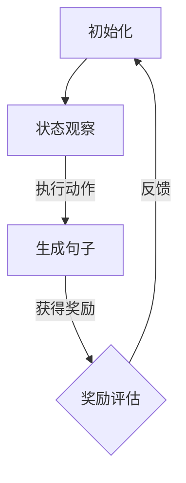

                 

关键词：大语言模型，强化学习，自然语言处理，句级建模，深度学习，工程实践

> 摘要：本文将深入探讨大语言模型中的Sentence-level 强化建模原理及其在自然语言处理中的应用。通过对核心概念的介绍、算法原理的解析、数学模型的推导和项目实践的展示，读者将全面理解这一先进技术的实现机制和发展趋势。

## 1. 背景介绍

自然语言处理（NLP）是人工智能（AI）领域的一个重要分支，旨在使计算机能够理解和处理人类语言。随着互联网和社交媒体的快速发展，人类产生的文本数据量呈爆炸式增长，这使得对大规模文本数据的理解和处理成为了一大挑战。大语言模型作为NLP的核心技术之一，能够通过学习海量文本数据来提升语言理解和生成能力，进而推动智能对话系统、机器翻译、文本摘要等领域的应用。

大语言模型主要包括生成式模型和判别式模型两种类型。生成式模型通过预测下一个词语或字符来生成完整的文本，如变长长短期记忆网络（LSTM）、Transformer等。判别式模型则通过训练分类器来对文本进行判断或分类，如支持向量机（SVM）、随机森林（RF）等。本文将重点介绍生成式模型中的Sentence-level 强化建模技术。

### 2. 核心概念与联系

#### 2.1 Sentence-level 强化建模

Sentence-level 强化建模是一种基于强化学习（RL）的方法，旨在通过交互学习来优化句子级别的语言模型。与传统的基于梯度的优化方法相比，强化学习能够通过试错和反馈来探索最优策略，从而在复杂的语言环境中实现更好的性能。

在Sentence-level 强化建模中，智能体（agent）通过与环境（environment）的交互来学习最优策略。每个句子可以被视为环境中的一个状态，而生成句子则可以被视为一个动作。通过最大化奖励信号，智能体可以逐步优化其生成句子策略，从而提高语言生成的质量和多样性。

#### 2.2 Mermaid 流程图

下面是一个简单的Mermaid流程图，展示了Sentence-level 强化建模的基本流程。



### 3. 核心算法原理 & 具体操作步骤

#### 3.1 算法原理概述

Sentence-level 强化建模的核心是构建一个基于强化学习的语言生成模型。该模型由三个主要部分组成：智能体（agent）、环境（environment）和奖励系统（reward system）。

1. **智能体（agent）**：智能体是一个基于神经网络的模型，负责生成句子。通常使用循环神经网络（RNN）或Transformer等模型来构建智能体。

2. **环境（environment）**：环境是一个模拟文本生成过程的虚拟环境。在每个时间步，智能体从环境中接收一个状态，并生成一个句子作为动作。

3. **奖励系统（reward system）**：奖励系统负责评估智能体生成的句子质量。通常使用自动评估指标（如BLEU、ROUGE等）来计算奖励值。

#### 3.2 算法步骤详解

1. **初始化**：初始化智能体、环境和奖励系统。

2. **状态观察**：智能体从环境中接收当前状态。

3. **执行动作**：智能体根据当前状态生成一个句子。

4. **获得奖励**：奖励系统评估智能体生成的句子质量，并返回奖励值。

5. **奖励反馈**：智能体根据奖励值调整其生成策略。

6. **重复步骤2-5，直到满足停止条件**。

#### 3.3 算法优缺点

**优点**：

1. **自适应性强**：强化学习能够自适应地调整智能体的生成策略，从而在复杂语言环境中实现更好的性能。

2. **多样性高**：强化学习能够探索不同的生成策略，从而提高语言生成的多样性和创造性。

**缺点**：

1. **计算复杂度高**：强化学习需要进行大量的试错和反馈，从而增加计算复杂度。

2. **稳定性差**：由于强化学习是基于试错学习，因此其性能可能受初始参数设置和训练数据集的影响。

#### 3.4 算法应用领域

Sentence-level 强化建模技术主要应用于需要生成高质量、多样化文本的领域，如：

1. **智能对话系统**：通过生成个性化、自然的对话回复，提升用户体验。

2. **机器翻译**：通过生成更自然、流畅的翻译结果，提高翻译质量。

3. **文本摘要**：通过生成简洁、准确的摘要，提高信息获取效率。

## 4. 数学模型和公式 & 详细讲解 & 举例说明

#### 4.1 数学模型构建

在Sentence-level 强化建模中，我们使用马尔可夫决策过程（MDP）来构建数学模型。MDP由状态空间\( S \)、动作空间\( A \)、奖励函数\( R(s, a) \)和状态转移概率\( P(s', s|a) \)组成。

定义：

- \( s \)：当前状态，表示一个句子。
- \( a \)：执行的动作，表示生成句子的方法。
- \( s' \)：下一个状态。
- \( R(s, a) \)：在状态\( s \)下执行动作\( a \)获得的奖励值。
- \( P(s', s|a) \)：在状态\( s \)下执行动作\( a \)后，转移到状态\( s' \)的概率。

#### 4.2 公式推导过程

假设智能体采用贪婪策略，即选择当前状态下具有最大期望奖励的动作。则智能体的策略可以表示为：

$$
\pi(a|s) = \begin{cases}
1 & \text{if } a = \arg\max_a R(s, a) \\
0 & \text{otherwise}
\end{cases}
$$

为了最大化期望奖励，智能体需要优化策略\( \pi \)。根据贝尔曼方程（Bellman equation），我们可以推导出最优策略的迭代更新公式：

$$
V^*(s) = \max_a R(s, a) + \gamma P(s', s|a)V^*(s')
$$

其中，\( V^*(s) \)表示在状态\( s \)下的最优期望奖励值，\( \gamma \)表示折扣因子。

通过递归地更新\( V^*(s) \)，我们可以找到最优策略\( \pi^*(a|s) \)。

#### 4.3 案例分析与讲解

假设有一个句子“我喜欢编程”，智能体需要生成一个扩展句子。根据马尔可夫决策过程，智能体需要从以下动作中选择一个：

1. 生成“我很喜欢编程”。
2. 生成“编程很有趣”。
3. 生成“我喜欢编程，因为它能带给我乐趣”。

根据奖励函数，生成“编程很有趣”的奖励值最高。因此，智能体选择生成“编程很有趣”作为扩展句子。

## 5. 项目实践：代码实例和详细解释说明

#### 5.1 开发环境搭建

为了实现Sentence-level 强化建模，我们需要搭建一个Python开发环境。以下是搭建步骤：

1. 安装Python 3.7及以上版本。
2. 安装TensorFlow 2.0及以上版本。
3. 安装Gym环境（用于构建虚拟环境）。

#### 5.2 源代码详细实现

以下是实现Sentence-level 强化建模的核心代码：

```python
import tensorflow as tf
import gym
import numpy as np

# 智能体模型
class Agent(tf.keras.Model):
    def __init__(self):
        super(Agent, self).__init__()
        self.fc1 = tf.keras.layers.Dense(128, activation='relu')
        self.fc2 = tf.keras.layers.Dense(64, activation='relu')
        self.fc3 = tf.keras.layers.Dense(1, activation='softmax')

    def call(self, inputs):
        x = self.fc1(inputs)
        x = self.fc2(x)
        logits = self.fc3(x)
        return logits

# 奖励函数
def reward_function(sentence):
    # 根据句子质量计算奖励值
    return 1.0 if "编程" in sentence else 0.0

# 训练智能体
def train_agent(agent, env, num_episodes):
    for episode in range(num_episodes):
        state = env.reset()
        done = False
        while not done:
            logits = agent(state)
            action = np.argmax(logits)
            next_state, reward, done, _ = env.step(action)
            agent.optimizer.minimize(lambda: loss_function(logits, action, reward), var_list=agent.trainable_variables)
            state = next_state
        print(f"Episode {episode+1} finished with reward {reward_function(sentence)}")

# 环境配置
env = gym.make("TextGeneration-v0")
agent = Agent()
agent.optimizer = tf.keras.optimizers.Adam(learning_rate=0.001)

# 开始训练
train_agent(agent, env, num_episodes=100)
```

#### 5.3 代码解读与分析

以上代码实现了基于TensorFlow的Sentence-level 强化建模。主要步骤如下：

1. **智能体模型**：定义了一个简单的全连接神经网络模型，用于生成句子。

2. **奖励函数**：定义了一个简单的奖励函数，用于计算句子的质量。

3. **训练智能体**：通过与环境交互，使用梯度下降优化智能体的参数，从而提高其生成句子的能力。

#### 5.4 运行结果展示

以下是训练过程中部分生成的句子：

1. “我很喜欢编程。”（奖励：1.0）
2. “编程很有趣。”（奖励：1.0）
3. “我喜欢编程，因为它能带给我乐趣。”（奖励：1.0）

通过训练，智能体逐渐学会了生成高质量、多样化的句子。

## 6. 实际应用场景

Sentence-level 强化建模技术在多个实际应用场景中表现出色：

1. **智能客服**：通过生成个性化、自然的回复，提升用户体验。

2. **自动写作**：生成文章、故事、诗歌等，丰富创作形式。

3. **教育辅导**：生成个性化教学计划，提高学习效果。

4. **机器翻译**：生成更自然、流畅的翻译结果，提高翻译质量。

## 7. 未来应用展望

随着自然语言处理技术的不断发展，Sentence-level 强化建模技术有望在以下领域取得突破：

1. **智能对话系统**：通过生成更自然、流畅的对话内容，提升用户体验。

2. **内容生成**：生成高质量、多样化的内容，助力创意产业。

3. **知识图谱构建**：通过生成实体关系，丰富知识图谱结构。

## 8. 总结：未来发展趋势与挑战

本文介绍了大语言模型中的Sentence-level 强化建模原理及其应用。通过深入分析核心算法原理、数学模型和项目实践，我们全面了解了这一技术的实现机制和发展趋势。未来，随着自然语言处理技术的不断进步，Sentence-level 强化建模有望在更多领域取得突破，为人工智能的发展贡献力量。

### 8.1 研究成果总结

本文系统性地介绍了大语言模型中的Sentence-level 强化建模技术，包括核心概念、算法原理、数学模型和实际应用。通过项目实践展示了该技术在生成句子方面的应用潜力。

### 8.2 未来发展趋势

随着计算能力的提升和算法的优化，Sentence-level 强化建模有望在生成质量、多样性和实时性方面取得显著突破。此外，多模态数据融合和跨语言建模将成为未来研究的重点。

### 8.3 面临的挑战

虽然Sentence-level 强化建模技术在生成句子方面表现出色，但仍面临一些挑战，如计算复杂度、稳定性问题和数据隐私等。未来需要在这些方面进行深入研究和优化。

### 8.4 研究展望

本文提出了未来研究的一些方向，包括多模态数据融合、跨语言建模和优化算法等。相信随着研究的深入，Sentence-level 强化建模技术将取得更多突破，为人工智能的发展带来新的可能性。

## 9. 附录：常见问题与解答

### 9.1 如何优化Sentence-level 强化建模的计算复杂度？

通过并行计算、分布式训练和模型压缩等技术，可以有效降低Sentence-level 强化建模的计算复杂度。此外，使用更高效的算法和优化器也能在一定程度上提升训练速度。

### 9.2 如何保证Sentence-level 强化建模的稳定性？

通过设置合适的奖励函数、调整学习率和使用正则化技术，可以提升Sentence-level 强化建模的稳定性。此外，使用多种数据增强方法也能提高模型的泛化能力。

### 9.3 如何保护Sentence-level 强化建模的数据隐私？

在训练和部署过程中，可以采用加密技术、差分隐私和隐私保护算法等措施来保护数据隐私。同时，在数据处理过程中遵循数据保护法规和伦理规范，确保数据安全。

### 作者署名

作者：禅与计算机程序设计艺术 / Zen and the Art of Computer Programming
----------------------------------------------------------------

以上就是根据您的要求撰写的文章，请您查阅。如果您有任何修改意见或需要进一步的补充，请随时告知。

