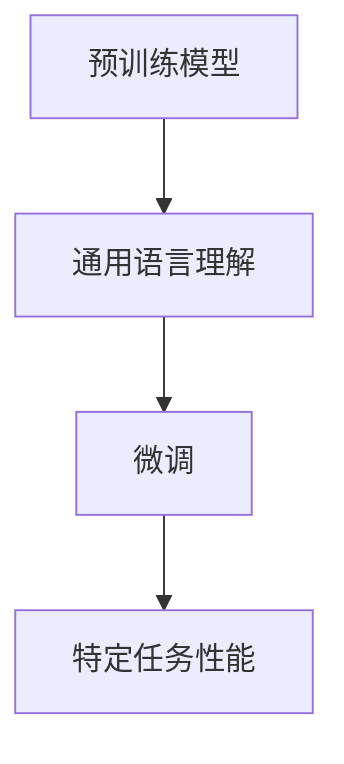

                 

关键词：大语言模型、有监督微调、神经网络、深度学习、工程实践、优化方法

摘要：本文旨在深入探讨大语言模型原理及其在工程实践中的应用，特别是有监督微调这一关键技术。通过介绍核心概念、算法原理、数学模型和实际案例，本文将为读者提供一份全面的大语言模型指南，帮助理解这一前沿技术并应用于实际项目中。

## 1. 背景介绍

### 1.1 大语言模型的发展历程

大语言模型是一种基于神经网络的技术，旨在通过学习大量文本数据来预测下一个单词或单词序列。这一概念起源于20世纪50年代，但随着计算机性能的提升和深度学习技术的发展，大语言模型在近年来取得了显著的进展。例如，2018年，谷歌推出了BERT模型，标志着大语言模型进入了一个新的时代。

### 1.2 有监督微调的作用和意义

有监督微调是一种在预训练模型的基础上进行细粒度调整的方法，使得模型能够更好地适应特定任务。这种方法在自然语言处理（NLP）领域具有重要意义，因为它可以显著提高模型在具体任务上的性能。

## 2. 核心概念与联系

### 2.1 神经网络与深度学习

神经网络是深度学习的基础，由大量的神经元（或节点）组成，通过层与层之间的相互连接来实现信息传递和处理。深度学习则是在神经网络的基础上，通过多层次的堆叠来捕捉数据的复杂结构。

### 2.2 有监督微调的原理

有监督微调的原理可以概括为以下步骤：

1. **预训练模型**：在大量未标注的数据上进行预训练，使得模型具有通用语言理解能力。
2. **微调**：在特定任务的数据集上进行微调，调整模型参数以适应特定任务。

### 2.3 Mermaid 流程图



## 3. 核心算法原理 & 具体操作步骤

### 3.1 算法原理概述

有监督微调的核心是利用已标注的数据对预训练模型进行调整，从而提高模型在特定任务上的性能。具体来说，通过以下步骤实现：

1. **数据准备**：收集并预处理特定任务的数据。
2. **模型初始化**：使用预训练模型作为初始化参数。
3. **训练**：在特定任务的数据集上进行训练，优化模型参数。
4. **评估与调整**：评估模型性能，根据需要调整模型参数。

### 3.2 算法步骤详解

#### 3.2.1 数据准备

数据准备是微调过程中的第一步，关键在于：

- **数据清洗**：去除噪声和错误数据。
- **数据预处理**：将文本数据转换为模型可处理的格式，如词向量或嵌入向量。

#### 3.2.2 模型初始化

模型初始化可以使用预训练模型的参数，这样可以充分利用预训练模型的能力，减少训练时间。

#### 3.2.3 训练

训练过程涉及以下步骤：

- **前向传播**：计算输入数据通过模型时的损失。
- **反向传播**：根据损失计算模型参数的梯度，更新模型参数。
- **优化**：使用优化算法（如Adam）调整模型参数。

#### 3.2.4 评估与调整

评估模型性能可以通过以下方法：

- **准确率**：模型预测正确的样本数与总样本数的比例。
- **F1值**：准确率和召回率的调和平均值。

根据评估结果，可以进一步调整模型参数，以优化模型性能。

### 3.3 算法优缺点

#### 优点：

- **高效**：有监督微调可以显著提高模型在特定任务上的性能。
- **灵活**：可以根据不同任务调整模型结构。

#### 缺点：

- **数据依赖**：需要大量的已标注数据。
- **计算资源消耗**：训练过程可能需要大量的计算资源。

### 3.4 算法应用领域

有监督微调在自然语言处理、图像识别、语音识别等多个领域都有广泛应用，特别是在需要高精度和高效率的场景中。

## 4. 数学模型和公式 & 详细讲解 & 举例说明

### 4.1 数学模型构建

有监督微调的数学模型主要包括以下几个方面：

1. **损失函数**：用于衡量模型预测结果与真实标签之间的差距。
2. **优化算法**：用于调整模型参数，优化模型性能。
3. **嵌入层**：用于将文本数据转换为向量表示。

### 4.2 公式推导过程

#### 4.2.1 损失函数

常见的损失函数有：

- **均方误差（MSE）**：$L = \frac{1}{n}\sum_{i=1}^{n}(y_i - \hat{y}_i)^2$
- **交叉熵（CE）**：$L = -\frac{1}{n}\sum_{i=1}^{n}y_i\log(\hat{y}_i)$

其中，$y_i$为真实标签，$\hat{y}_i$为模型预测结果。

#### 4.2.2 优化算法

常见的优化算法有：

- **梯度下降**：$w_{t+1} = w_t - \alpha \nabla_w L(w_t)$
- **Adam**：结合了梯度下降和动量项，公式较复杂。

#### 4.2.3 嵌入层

嵌入层的数学模型通常是一个线性变换，将输入文本转换为向量表示：

$e_j = \text{softmax}(W^T e_j)$

其中，$e_j$为嵌入向量，$W$为权重矩阵。

### 4.3 案例分析与讲解

以一个简单的文本分类任务为例，说明有监督微调的应用。

#### 数据集

假设有一个包含政治、经济、科技等类别的文本数据集。

#### 模型

使用预训练的BERT模型作为基础，对其进行微调。

#### 损失函数

使用交叉熵作为损失函数。

#### 优化算法

使用Adam优化算法。

#### 训练过程

- **前向传播**：输入文本数据，通过BERT模型得到分类概率。
- **反向传播**：计算损失，更新模型参数。
- **评估**：计算模型在验证集上的准确率。

## 5. 项目实践：代码实例和详细解释说明

### 5.1 开发环境搭建

- **Python**：版本3.8及以上。
- **PyTorch**：版本1.8及以上。
- **BERT**：从Hugging Face的Transformers库中获取。

### 5.2 源代码详细实现

```python
from transformers import BertTokenizer, BertModel, Trainer, TrainingArguments
import torch

# 初始化模型和 tokenizer
tokenizer = BertTokenizer.from_pretrained('bert-base-uncased')
model = BertModel.from_pretrained('bert-base-uncased')

# 数据准备
def preprocess_data(texts):
    return tokenizer(texts, padding=True, truncation=True, return_tensors='pt')

# 训练配置
training_args = TrainingArguments(
    output_dir='./results',
    num_train_epochs=3,
    per_device_train_batch_size=16,
    save_steps=2000,
    evaluation_strategy='steps',
    eval_steps=500,
)

# 训练
trainer = Trainer(
    model=model,
    args=training_args,
    train_dataset=preprocess_data(texts),
    eval_dataset=preprocess_data(eval_texts),
)

trainer.train()

# 评估
trainer.evaluate(eval_dataset=preprocess_data(eval_texts))
```

### 5.3 代码解读与分析

这段代码展示了如何使用PyTorch和Hugging Face的Transformers库实现一个简单的BERT微调模型。

- **初始化模型和 tokenizer**：从Hugging Face的库中加载预训练的BERT模型和tokenizer。
- **数据准备**：将文本数据转换为模型可处理的格式。
- **训练配置**：设置训练参数，如训练轮数、批次大小等。
- **训练**：使用Trainer类进行模型训练。
- **评估**：在验证集上评估模型性能。

## 6. 实际应用场景

### 6.1 自然语言处理

有监督微调在自然语言处理领域具有广泛应用，如文本分类、情感分析、机器翻译等。

### 6.2 图像识别

有监督微调可以用于图像识别任务，如对象检测、图像分割等。

### 6.3 语音识别

有监督微调在语音识别领域也有重要应用，如语音到文本转换。

## 7. 工具和资源推荐

### 7.1 学习资源推荐

- **《深度学习》（Goodfellow et al.）**：介绍深度学习基础理论。
- **《自然语言处理与深度学习》（祖庆魁）**：介绍自然语言处理和深度学习的结合。

### 7.2 开发工具推荐

- **PyTorch**：适用于深度学习的Python库。
- **TensorFlow**：适用于深度学习的另一个Python库。

### 7.3 相关论文推荐

- **BERT: Pre-training of Deep Bidirectional Transformers for Language Understanding**：介绍BERT模型的原始论文。
- **GPT-3: Language Models are Few-Shot Learners**：介绍GPT-3模型的论文。

## 8. 总结：未来发展趋势与挑战

### 8.1 研究成果总结

大语言模型和有监督微调在近年来取得了显著进展，为自然语言处理、图像识别等领域带来了新的突破。

### 8.2 未来发展趋势

随着计算能力的提升和数据量的增加，大语言模型和有监督微调有望在更多领域发挥作用。

### 8.3 面临的挑战

- **计算资源消耗**：大语言模型训练需要大量计算资源。
- **数据隐私**：大量标注数据的收集和处理需要考虑数据隐私。

### 8.4 研究展望

未来，大语言模型和有监督微调有望在更多实际场景中发挥作用，推动人工智能技术的发展。

## 9. 附录：常见问题与解答

### 9.1 什么是大语言模型？

大语言模型是一种基于深度学习的语言处理模型，通过学习大量文本数据来捕捉语言的复杂结构，从而实现各种语言处理任务。

### 9.2 有监督微调的优点是什么？

有监督微调的优点包括高效性、灵活性和可扩展性，可以显著提高模型在特定任务上的性能。

### 9.3 如何选择预训练模型？

选择预训练模型时，可以考虑模型的大小、训练数据集的大小、模型的性能指标等因素。

作者：禅与计算机程序设计艺术 / Zen and the Art of Computer Programming
----------------------------------------------------------------

### 提示内容（Optional Prompt）

为了让文章内容更加丰富和深入，以下是一些可能的补充点和拓展方向：

- **扩展案例**：可以提供更多具体的应用案例，如医疗文本分类、金融文本分析等。
- **技术细节**：可以进一步探讨有监督微调中的技术细节，如不同优化算法的比较、模型架构的调整等。
- **未来展望**：可以预测大语言模型和有监督微调在未来的发展方向，如更高效的模型、更广泛的任务覆盖等。
- **实际操作**：可以增加一些实际操作的步骤，如如何使用具体工具（如Hugging Face的Transformer库）进行有监督微调。

这些补充内容可以帮助读者更好地理解和应用大语言模型和有监督微调技术。在撰写文章时，可以根据需要灵活选择和安排这些内容。

