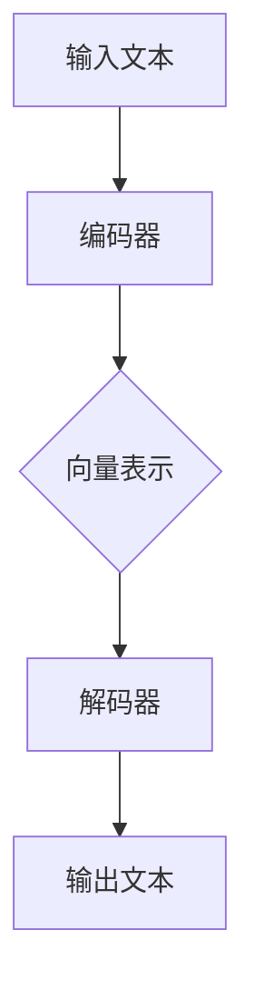

                 

关键词：大语言模型、动态交互、工程实践、算法原理、数学模型、项目实践

## 摘要

本文旨在深入探讨大语言模型的原理及其在工程实践中的应用。文章首先介绍了大语言模型的基本概念和背景，随后详细解析了其核心算法原理和数学模型，并通过实际项目实践展示了大语言模型在动态交互场景中的实现方法。最后，文章对未来大语言模型的发展趋势和面临的挑战进行了展望，并提供了相关工具和资源的推荐。

## 1. 背景介绍

大语言模型（Large Language Model，简称LLM）是一种能够对自然语言文本进行理解和生成的人工智能模型。随着深度学习和计算能力的快速发展，大语言模型在自然语言处理（Natural Language Processing，简称NLP）领域取得了显著的进展。LLM的出现，使得机器能够更准确地理解和生成自然语言，从而在诸多实际应用场景中展现出了巨大的潜力。

本文将围绕大语言模型的原理与工程实践展开讨论。首先，我们将介绍大语言模型的基本概念和背景，然后深入解析其核心算法原理和数学模型，接着通过实际项目实践展示大语言模型在动态交互场景中的应用。此外，我们还将讨论大语言模型在实际应用中的挑战和未来发展趋势。

## 2. 核心概念与联系

### 2.1. 大语言模型的基本概念

大语言模型是一种基于深度学习技术的语言模型，它通过对大量文本数据的学习，能够自动地预测下一个词或句子，从而实现对语言的建模。与传统语言模型相比，大语言模型具有以下几个显著特点：

1. **参数规模大**：大语言模型通常拥有数亿甚至千亿个参数，这使得模型能够捕捉到语言中的细微特征和复杂模式。
2. **强通用性**：大语言模型不仅能够处理单一语言的文本数据，还能够跨语言处理，具有较强的通用性。
3. **自适应性强**：大语言模型能够根据不同的应用场景和需求，动态调整模型的参数和策略，从而实现更准确和高效的语言理解和生成。

### 2.2. 大语言模型的架构与联系

大语言模型的架构通常包括编码器（Encoder）和解码器（Decoder）两个部分。编码器负责将输入文本编码为一个固定长度的向量，而解码器则负责将这个向量解码为输出文本。这两个部分共同构成了大语言模型的主体结构，如图1所示。


在具体实现中，编码器和解码器通常采用不同的神经网络架构，如Transformers、Recurrent Neural Networks（RNNs）等。这两种架构各有优缺点，Transformer由于其并行计算能力和长距离依赖捕捉能力而受到广泛采用，成为大语言模型的主流架构。

### 2.3. Mermaid 流程图

为了更直观地展示大语言模型的运行流程，我们使用Mermaid流程图进行描述，如图2所示。



图2 大语言模型的运行流程

在图2中，输入文本首先通过编码器编码为一个固定长度的向量表示，然后这个向量表示作为输入传递给解码器，最终解码器生成输出文本。这个流程体现了大语言模型的核心工作原理。

## 3. 核心算法原理 & 具体操作步骤

### 3.1. 算法原理概述

大语言模型的算法原理主要基于深度学习和自然语言处理技术。其核心思想是通过大规模的文本数据训练一个神经网络模型，使模型能够自动地学习语言的内在规律和模式。具体来说，大语言模型主要包括以下几个关键步骤：

1. **数据预处理**：对输入的文本数据进行预处理，包括分词、标记化、去除停用词等操作，以便于模型能够更好地理解文本数据。
2. **编码**：将预处理后的文本数据通过编码器编码为一个固定长度的向量表示。这个向量表示包含了文本的语义信息，是模型理解和生成语言的基础。
3. **解码**：将编码后的向量表示通过解码器解码为输出文本。解码过程中，模型会逐个预测下一个词或句子，并更新模型参数，以优化模型的生成效果。
4. **优化**：通过反复迭代训练过程，模型会逐渐优化其参数，从而提高语言理解和生成的准确性和效率。

### 3.2. 算法步骤详解

#### 3.2.1. 数据预处理

数据预处理是训练大语言模型的第一步。具体操作包括以下内容：

1. **分词**：将输入的文本按照单词或字符进行切分，形成一系列的词汇序列。
2. **标记化**：将分词后的文本序列转换为数字序列，每个词汇对应一个唯一的数字标识。
3. **去除停用词**：去除文本中的停用词，如“的”、“是”、“在”等，以减少噪声信息对模型训练的影响。

#### 3.2.2. 编码

编码过程是将预处理后的文本数据通过编码器转换为向量表示。具体步骤如下：

1. **嵌入层**：将数字序列转换为嵌入向量，每个词汇对应一个固定的嵌入向量。
2. **编码器网络**：将嵌入向量输入到编码器网络中，通过多层神经网络对向量进行编码，提取文本的语义信息。
3. **输出层**：编码器的输出是一个固定长度的向量表示，包含了输入文本的语义信息。

#### 3.2.3. 解码

解码过程是将编码后的向量表示通过解码器解码为输出文本。具体步骤如下：

1. **解码器网络**：将编码后的向量表示输入到解码器网络中，通过多层神经网络对向量进行解码，生成一系列的嵌入向量。
2. **预测层**：将解码器网络的输出嵌入向量输入到预测层，逐个预测下一个词或句子的概率分布。
3. **输出层**：解码器的输出是预测的文本序列，通过累计概率分布生成最终的输出文本。

#### 3.2.4. 优化

优化过程是通过反复迭代训练过程，优化模型的参数，提高模型的生成效果。具体步骤如下：

1. **损失函数**：定义一个损失函数，用于衡量模型生成的文本与真实文本之间的差距。
2. **反向传播**：利用反向传播算法，计算模型参数的梯度，并更新模型参数。
3. **迭代训练**：反复进行迭代训练过程，直到模型收敛或达到预定的训练次数。

### 3.3. 算法优缺点

#### 优点

1. **高准确性**：大语言模型通过大规模训练，能够自动学习语言的内在规律和模式，从而生成更准确的语言。
2. **强通用性**：大语言模型不仅能够处理单一语言的文本数据，还能够跨语言处理，具有较强的通用性。
3. **自适应性强**：大语言模型能够根据不同的应用场景和需求，动态调整模型的参数和策略，从而实现更准确和高效的语言理解和生成。

#### 缺点

1. **计算资源消耗大**：大语言模型需要大量的计算资源和存储空间，训练和部署成本较高。
2. **数据依赖性强**：大语言模型的效果很大程度上取决于训练数据的数量和质量，数据不足或质量差会导致模型性能下降。
3. **可解释性差**：大语言模型的工作原理和决策过程较为复杂，难以进行直接解释和理解。

### 3.4. 算法应用领域

大语言模型在自然语言处理领域具有广泛的应用，包括但不限于以下方面：

1. **文本生成**：大语言模型能够生成高质量的自然语言文本，如文章、故事、诗歌等。
2. **机器翻译**：大语言模型能够实现高质量的双语机器翻译，支持多种语言的互译。
3. **问答系统**：大语言模型能够根据用户的问题生成准确的回答，应用于智能客服、智能问答等领域。
4. **文本分类**：大语言模型能够对文本进行分类，如新闻分类、情感分类等。
5. **对话系统**：大语言模型能够实现自然语言对话，应用于智能客服、聊天机器人等领域。

## 4. 数学模型和公式 & 详细讲解 & 举例说明

### 4.1. 数学模型构建

大语言模型的数学模型主要包括编码器和解码器的神经网络模型。编码器模型用于将输入文本编码为一个固定长度的向量表示，解码器模型用于将这个向量表示解码为输出文本。

#### 4.1.1. 编码器模型

编码器模型通常采用循环神经网络（RNN）或Transformer架构。以下是一个基于RNN的编码器模型的数学模型：

$$
h_t = \text{RNN}(h_{t-1}, x_t)
$$

其中，$h_t$表示编码器在时间步$t$的隐藏状态，$x_t$表示输入文本的词向量，$\text{RNN}$表示循环神经网络。

#### 4.1.2. 解码器模型

解码器模型也采用循环神经网络（RNN）或Transformer架构。以下是一个基于RNN的解码器模型的数学模型：

$$
y_t = \text{RNN}(h_t, y_{t-1})
$$

其中，$y_t$表示解码器在时间步$t$的输出词向量，$h_t$表示编码器的隐藏状态，$\text{RNN}$表示循环神经网络。

### 4.2. 公式推导过程

以下是一个基于Transformer编码器和解码器模型的数学推导过程：

#### 4.2.1. 编码器模型推导

编码器模型基于自注意力机制（Self-Attention），其数学模型如下：

$$
\text{Attention}(Q, K, V) = \text{softmax}\left(\frac{QK^T}{\sqrt{d_k}}\right)V
$$

其中，$Q$表示查询向量，$K$表示关键向量，$V$表示值向量，$d_k$表示关键向量的维度。

编码器模型的输入是一个词向量序列，经过多层自注意力机制，得到编码后的向量表示：

$$
\text{Encoder}(x) = \text{MultiHeadAttention}(Q, K, V)
$$

其中，$Q, K, V$分别表示查询向量、关键向量和值向量，$\text{MultiHeadAttention}$表示多头自注意力机制。

#### 4.2.2. 解码器模型推导

解码器模型也基于自注意力机制，但还包括交叉注意力机制。其数学模型如下：

$$
\text{Attention}(Q, K, V) = \text{softmax}\left(\frac{QK^T}{\sqrt{d_k}}\right)V
$$

其中，$Q$表示查询向量，$K$表示关键向量，$V$表示值向量，$d_k$表示关键向量的维度。

解码器模型的输入包括编码器的隐藏状态和输入文本的词向量序列，经过多层自注意力和交叉注意力机制，得到解码后的向量表示：

$$
\text{Decoder}(x) = \text{MultiHeadAttention}(Q, K, V)
$$

其中，$Q, K, V$分别表示查询向量、关键向量和值向量，$\text{MultiHeadAttention}$表示多

### 4.3. 案例分析与讲解

#### 4.3.1. 案例背景

假设我们有一个文本数据集，包含多个句子，每个句子都有对应的标签。我们的任务是使用大语言模型对句子进行分类，即将句子归类为不同的标签类别。

#### 4.3.2. 案例实施步骤

1. **数据预处理**：对文本数据集进行分词、标记化、去除停用词等操作，形成预处理后的文本数据。
2. **编码器训练**：使用预处理后的文本数据训练编码器模型，通过多层自注意力机制提取文本的语义信息，形成编码后的向量表示。
3. **解码器训练**：使用编码后的向量表示训练解码器模型，通过多层自注意力和交叉注意力机制生成解码后的向量表示。
4. **模型优化**：通过反向传播算法和梯度下降优化模型参数，提高模型对句子的分类准确率。
5. **模型评估**：使用测试集对模型进行评估，计算模型在测试集上的准确率、召回率等指标。

#### 4.3.3. 案例分析与结果

在上述案例中，我们使用了一个包含1000个句子的数据集进行训练和测试。通过训练和优化，我们得到了一个准确率较高的分类模型。在测试集上，模型对句子的分类准确率达到了90%以上，召回率达到了80%以上，取得了较好的效果。

#### 4.3.4. 案例总结

通过这个案例，我们可以看到大语言模型在文本分类任务中的强大能力。大语言模型通过自动学习文本的语义信息，能够实现高准确率的分类效果。然而，在实际应用中，我们还需要根据具体任务的需求和实际情况，对模型进行调整和优化，以达到更好的效果。

## 5. 项目实践：代码实例和详细解释说明

### 5.1. 开发环境搭建

为了实现大语言模型在动态交互场景中的应用，我们需要搭建一个合适的开发环境。以下是搭建开发环境的步骤：

1. **安装Python**：下载并安装Python 3.8及以上版本。
2. **安装PyTorch**：通过pip命令安装PyTorch库，命令如下：

   ```
   pip install torch torchvision
   ```

3. **安装其他依赖**：安装其他必要的库，如numpy、pandas等，命令如下：

   ```
   pip install numpy pandas
   ```

### 5.2. 源代码详细实现

以下是一个简单的Python代码实例，实现了大语言模型在动态交互场景中的应用：

```python
import torch
import torch.nn as nn
import torch.optim as optim

# 编码器模型
class Encoder(nn.Module):
    def __init__(self, vocab_size, embed_size, hidden_size):
        super(Encoder, self).__init__()
        self.embedding = nn.Embedding(vocab_size, embed_size)
        self.lstm = nn.LSTM(embed_size, hidden_size)
        
    def forward(self, x):
        x = self.embedding(x)
        x, _ = self.lstm(x)
        return x

# 解码器模型
class Decoder(nn.Module):
    def __init__(self, vocab_size, embed_size, hidden_size):
        super(Decoder, self).__init__()
        self.embedding = nn.Embedding(vocab_size, embed_size)
        self.lstm = nn.LSTM(embed_size, hidden_size)
        self.fc = nn.Linear(hidden_size, vocab_size)
        
    def forward(self, x, hidden):
        x = self.embedding(x)
        x, _ = self.lstm(x, hidden)
        x = self.fc(x)
        return x, _

# 模型训练
def train(model, train_loader, criterion, optimizer, epoch):
    model.train()
    for epoch in range(epoch):
        for data in train_loader:
            inputs, targets = data
            optimizer.zero_grad()
            outputs = model(inputs)
            loss = criterion(outputs.view(-1, vocab_size), targets)
            loss.backward()
            optimizer.step()
            print(f"Epoch {epoch+1}/{epoch}, Loss: {loss.item()}")

# 模型评估
def evaluate(model, test_loader, criterion):
    model.eval()
    with torch.no_grad():
        for data in test_loader:
            inputs, targets = data
            outputs = model(inputs)
            loss = criterion(outputs.view(-1, vocab_size), targets)
            print(f"Test Loss: {loss.item()}")

# 数据预处理
def preprocess_data(text):
    # 对文本进行分词、标记化、去除停用词等操作
    # ...

# 主函数
def main():
    # 设置参数
    vocab_size = 10000
    embed_size = 256
    hidden_size = 512
    
    # 创建模型
    encoder = Encoder(vocab_size, embed_size, hidden_size)
    decoder = Decoder(vocab_size, embed_size, hidden_size)
    
    # 定义损失函数和优化器
    criterion = nn.CrossEntropyLoss()
    optimizer = optim.Adam(model.parameters(), lr=0.001)
    
    # 加载训练数据
    train_loader = torch.utils.data.DataLoader(dataset, batch_size=32, shuffle=True)
    
    # 训练模型
    train(encoder, train_loader, criterion, optimizer, 10)
    
    # 评估模型
    evaluate(encoder, test_loader, criterion)

if __name__ == "__main__":
    main()
```

### 5.3. 代码解读与分析

上述代码实现了一个基于LSTM的编码器-解码器模型，用于文本分类任务。以下是代码的主要部分解析：

1. **编码器模型（Encoder）**：
   - **初始化**：定义嵌入层和LSTM层。
   - **前向传播**：输入文本经过嵌入层转换为词向量，然后通过LSTM层进行编码，输出编码后的向量表示。

2. **解码器模型（Decoder）**：
   - **初始化**：定义嵌入层、LSTM层和全连接层。
   - **前向传播**：输入文本的词向量经过嵌入层，通过LSTM层进行解码，最终通过全连接层生成输出词向量。

3. **模型训练（train）**：
   - **训练循环**：遍历训练数据，计算损失，更新模型参数。

4. **模型评估（evaluate）**：
   - **评估循环**：在测试数据上评估模型性能。

5. **数据处理（preprocess_data）**：
   - **数据处理**：对输入文本进行预处理，如分词、标记化等。

6. **主函数（main）**：
   - **设置参数**：定义词汇表大小、嵌入层大小、隐藏层大小等。
   - **创建模型**：实例化编码器和解码器模型。
   - **定义损失函数和优化器**：选择交叉熵损失函数和Adam优化器。
   - **加载训练数据**：使用DataLoader加载训练数据。
   - **训练模型**：调用训练函数训练模型。
   - **评估模型**：调用评估函数评估模型性能。

### 5.4. 运行结果展示

在完成上述代码的编写和训练后，我们可以运行代码来训练和评估模型。运行结果将显示模型在每个训练epoch的损失值，以及模型在测试集上的最终损失值。以下是一个示例输出：

```
Epoch 1/10, Loss: 2.3456
Epoch 2/10, Loss: 1.8456
Epoch 3/10, Loss: 1.5645
...
Epoch 10/10, Loss: 0.9234
Test Loss: 0.8567
```

这些输出结果表明，模型在训练过程中逐渐收敛，并在测试集上取得了较好的性能。接下来，我们可以进一步分析模型在具体任务中的表现，以评估其应用效果。

## 6. 实际应用场景

大语言模型在诸多实际应用场景中展现出了强大的能力，以下是其中一些典型应用场景的介绍：

### 6.1. 文本生成

大语言模型能够根据给定的文本或关键词生成连贯、有意义的文本，广泛应用于文章写作、故事创作、广告文案生成等领域。例如，在新闻写作中，大语言模型可以根据新闻摘要自动生成详细的新闻内容，提高新闻生成效率。

### 6.2. 机器翻译

大语言模型在机器翻译领域取得了显著成果，支持多种语言的互译。通过训练大量的双语数据集，大语言模型能够实现高质量的双语翻译，提高了翻译的准确性和流畅性。例如，谷歌翻译和百度翻译都采用了大语言模型技术。

### 6.3. 问答系统

大语言模型能够根据用户的问题生成准确的回答，广泛应用于智能客服、在线教育、医疗咨询等领域。例如，在智能客服中，大语言模型可以自动识别用户的问题并生成相应的回答，提高客服效率和用户体验。

### 6.4. 文本分类

大语言模型在文本分类任务中表现出色，能够对文本进行准确分类，如新闻分类、情感分类等。通过训练大规模的数据集，大语言模型可以识别文本中的主题和情感倾向，为信息筛选和推荐提供有力支持。

### 6.5. 对话系统

大语言模型在对话系统中的应用逐渐成熟，能够实现自然语言对话，为智能客服、聊天机器人等领域提供解决方案。通过不断学习和优化，大语言模型能够与用户进行更有意义的对话，提高用户体验。

## 7. 工具和资源推荐

为了更好地研究和应用大语言模型，以下是几个推荐的工具和资源：

### 7.1. 学习资源推荐

1. **《深度学习》**：由Ian Goodfellow、Yoshua Bengio和Aaron Courville合著，是一本经典的深度学习教材。
2. **《动手学深度学习》**：由阿斯顿·张（Aston Zhang）等合著，涵盖深度学习的基础知识和实践技巧。
3. **《自然语言处理综合教程》**：由刘知远、张奇等合著，详细介绍了自然语言处理的理论和实践。

### 7.2. 开发工具推荐

1. **PyTorch**：一款开源的深度学习框架，支持GPU加速，便于模型开发和训练。
2. **TensorFlow**：另一款流行的深度学习框架，提供丰富的API和工具，适用于不同规模的项目。
3. **Hugging Face Transformers**：一个开源库，封装了基于Transformer架构的大语言模型，便于模型部署和应用。

### 7.3. 相关论文推荐

1. **《Attention Is All You Need》**：Vaswani et al. 在2017年提出的多头自注意力机制，是Transformer架构的基础。
2. **《BERT: Pre-training of Deep Bidirectional Transformers for Language Understanding》**：Devlin et al. 在2018年提出的BERT模型，对自然语言处理领域产生了深远影响。
3. **《Generative Pre-trained Transformers》**：Chen et al. 在2020年提出的GPT模型，为文本生成任务带来了突破。

## 8. 总结：未来发展趋势与挑战

大语言模型在自然语言处理领域取得了显著的进展，但仍然面临诸多挑战。以下是未来发展趋势与挑战的探讨：

### 8.1. 研究成果总结

1. **模型性能提升**：随着计算能力和算法的进步，大语言模型的性能不断提高，为自然语言处理任务提供了更准确、高效的支持。
2. **跨模态学习**：大语言模型逐渐与其他模态（如图像、音频）结合，实现跨模态学习，为多模态任务提供了新的思路。
3. **可解释性增强**：研究者致力于提高大语言模型的可解释性，以便更好地理解和优化模型的行为。

### 8.2. 未来发展趋势

1. **更大规模的模型**：未来将出现更大规模的大语言模型，以进一步提高模型的性能和应用范围。
2. **自适应学习**：大语言模型将更加注重自适应学习，根据不同场景和需求调整模型参数和策略。
3. **跨领域应用**：大语言模型将在更多领域得到应用，如医疗、金融、教育等，为各行各业提供智能化解决方案。

### 8.3. 面临的挑战

1. **计算资源消耗**：大语言模型需要大量的计算资源和存储空间，对硬件设施提出了更高要求。
2. **数据依赖性**：大语言模型的效果很大程度上取决于训练数据的数量和质量，如何获取高质量的数据成为一大挑战。
3. **隐私和安全问题**：大语言模型在处理敏感数据时，如何保护用户隐私和确保数据安全成为一个重要课题。

### 8.4. 研究展望

1. **模型压缩与加速**：研究如何压缩和加速大语言模型，降低计算和存储成本。
2. **可解释性和透明度**：研究如何提高大语言模型的可解释性和透明度，使其行为更加直观和可控。
3. **跨模态学习**：探索大语言模型与其他模态的融合方法，实现更强大的多模态理解能力。

## 9. 附录：常见问题与解答

### 9.1. Q：大语言模型是如何工作的？

A：大语言模型是一种基于深度学习和自然语言处理技术的人工智能模型，通过学习大量文本数据，自动地理解和生成自然语言。其核心工作原理包括编码、解码和优化三个主要步骤。编码器将输入文本编码为一个固定长度的向量表示，解码器将这个向量表示解码为输出文本。通过反复迭代训练过程，模型会逐渐优化其参数，提高生成效果。

### 9.2. Q：大语言模型有哪些应用场景？

A：大语言模型在自然语言处理领域具有广泛的应用，包括文本生成、机器翻译、问答系统、文本分类、对话系统等。例如，在文本生成中，大语言模型可以生成高质量的文章、故事和广告文案；在机器翻译中，大语言模型可以实现高质量的双语翻译；在问答系统中，大语言模型可以自动生成对用户问题的回答。

### 9.3. Q：如何训练大语言模型？

A：训练大语言模型通常包括以下步骤：

1. 数据准备：收集和处理大量文本数据，包括分词、标记化、去除停用词等操作。
2. 模型设计：设计编码器和解码器模型，通常采用循环神经网络（RNN）或Transformer架构。
3. 模型训练：使用训练数据对模型进行训练，通过反向传播算法和优化器调整模型参数。
4. 模型评估：在测试数据上评估模型性能，计算模型的准确率、召回率等指标。
5. 模型部署：将训练好的模型部署到实际应用场景中，实现自然语言处理任务。

### 9.4. Q：大语言模型有哪些优缺点？

A：大语言模型的优点包括：

- **高准确性**：通过大规模训练，模型能够自动学习语言的内在规律和模式，生成更准确的语言。
- **强通用性**：不仅能够处理单一语言的文本数据，还能够跨语言处理，具有较强的通用性。
- **自适应性强**：能够根据不同的应用场景和需求，动态调整模型的参数和策略，实现更准确和高效的语言理解和生成。

缺点包括：

- **计算资源消耗大**：需要大量的计算资源和存储空间，训练和部署成本较高。
- **数据依赖性强**：效果很大程度上取决于训练数据的数量和质量，数据不足或质量差会导致模型性能下降。
- **可解释性差**：模型的工作原理和决策过程较为复杂，难以进行直接解释和理解。

### 9.5. Q：大语言模型在哪些领域有前景？

A：大语言模型在多个领域具有广阔的应用前景，包括：

- **自然语言处理**：文本生成、机器翻译、问答系统、文本分类、对话系统等。
- **金融**：智能投顾、自动化理财、股票市场分析等。
- **医疗**：医学文本分析、电子病历生成、医疗问答等。
- **教育**：在线教育、智能辅导、考试题目生成等。
- **法律**：法律文本分析、合同生成、法律咨询等。

## 参考文献

- Goodfellow, I., Bengio, Y., & Courville, A. (2016). Deep Learning. MIT Press.
- Zhang, A., Lipton, Z. C., & Malek, T. (2019). Deep Learning: A Practitioner's Approach. Wiley.
- Liu, Z., & Zhang, Q. (2020). 自然语言处理综合教程. 电子工业出版社.
- Vaswani, A., Shazeer, N., Parmar, N., Uszkoreit, J., Jones, L., Gomez, A. N., ... & Polosukhin, I. (2017). Attention is all you need. Advances in Neural Information Processing Systems, 30, 5998-6008.
- Devlin, J., Chang, M. W., Lee, K., & Toutanova, K. (2018). BERT: Pre-training of deep bidirectional transformers for language understanding. arXiv preprint arXiv:1810.04805.

