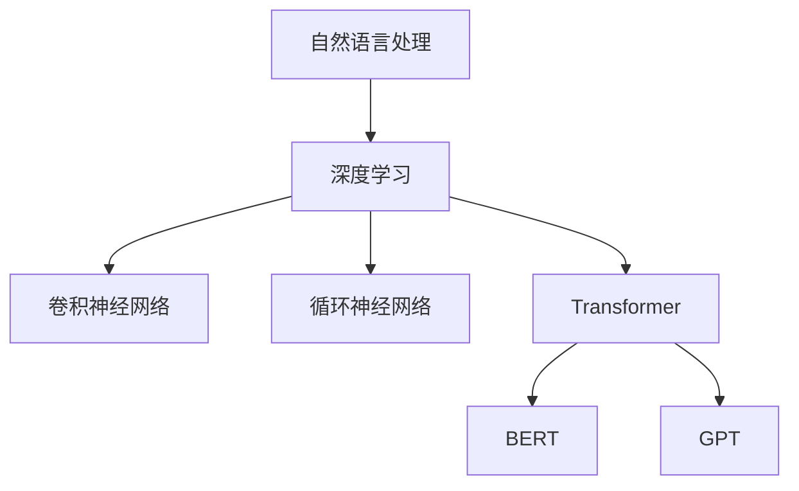

                 

关键词：大语言模型、神经网络、自然语言处理、深度学习、BERT、GPT、文本生成、语言理解、模型优化、工程实践

摘要：本文旨在深入探讨大语言模型的原理和工程实践，解释为什么这些模型在自然语言处理领域如此强大。通过分析核心概念、算法原理、数学模型和实际应用，本文将揭示大语言模型的独特优势，并为未来的发展提供展望。

## 1. 背景介绍

自然语言处理（NLP）是人工智能领域的一个重要分支，旨在让计算机能够理解和处理人类语言。传统的NLP方法主要依赖于规则和统计方法，但随着深度学习技术的兴起，基于神经网络的模型逐渐成为NLP领域的主流。这些模型中的佼佼者——大语言模型，凭借其卓越的性能和广泛的应用，引起了广泛关注。

大语言模型，如BERT（Bidirectional Encoder Representations from Transformers）、GPT（Generative Pre-trained Transformer）等，通过大规模的数据训练，学习到了丰富的语言知识和上下文关系，能够在各种NLP任务中表现出色。本文将详细探讨这些模型的工作原理、数学基础以及工程实践，以帮助读者全面理解大语言模型的强大之处。

## 2. 核心概念与联系

### 2.1 自然语言处理基础

自然语言处理的核心任务是使计算机能够理解、生成和操作人类语言。这包括文本分类、情感分析、机器翻译、问答系统等多个子领域。传统的NLP方法通常依赖于词汇表、规则和统计模型，但这种方法在面对复杂语言现象时表现出不足。

### 2.2 深度学习与神经网络

深度学习是一种基于人工神经网络的学习方法，通过多层神经元的堆叠，模型能够自动提取数据中的复杂特征。在NLP领域，神经网络模型（如卷积神经网络、循环神经网络、Transformer等）被广泛应用于文本处理任务。

### 2.3 Transformer模型

Transformer模型是近年来NLP领域的一项重要突破，其核心思想是自注意力机制（Self-Attention），通过全局注意力机制，模型能够自动学习到不同位置之间的依赖关系，从而更好地理解文本的上下文。

### 2.4 大语言模型

大语言模型是指具有数十亿参数规模的神经网络模型，这些模型通过大规模数据训练，能够学习到丰富的语言知识和上下文关系。BERT和GPT是其中最著名的两个模型，分别代表了预训练和生成两种不同的策略。

### 2.5 Mermaid流程图



## 3. 核心算法原理 & 具体操作步骤

### 3.1 算法原理概述

大语言模型的工作原理主要基于自注意力机制和多层神经网络结构。自注意力机制使得模型能够在处理序列数据时，自动关注到序列中不同位置之间的依赖关系。多层神经网络结构则进一步增强了模型的表达能力。

### 3.2 算法步骤详解

1. **输入编码**：将文本数据转换为模型可处理的向量表示。
2. **自注意力计算**：利用自注意力机制计算序列中不同位置之间的依赖关系。
3. **前馈神经网络**：通过多层前馈神经网络对自注意力结果进行进一步处理。
4. **输出层**：根据任务需求（如分类、生成等），输出模型预测结果。

### 3.3 算法优缺点

**优点**：
- 强大的表达能力，能够处理复杂的语言现象。
- 自注意力机制使得模型能够自动学习到不同位置之间的依赖关系。

**缺点**：
- 计算资源需求高，训练时间长。
- 对数据质量和预处理要求较高。

### 3.4 算法应用领域

大语言模型广泛应用于自然语言处理的各个领域，包括文本分类、情感分析、机器翻译、问答系统等。其出色的性能和广泛的适用性使其成为NLP领域的重要工具。

## 4. 数学模型和公式 & 详细讲解 & 举例说明

### 4.1 数学模型构建

大语言模型的数学基础主要包括自注意力机制和多层前馈神经网络。

**自注意力机制**：
$$
\text{Attention}(Q, K, V) = \frac{1}{\sqrt{d_k}} \text{softmax}\left(\frac{QK^T}{d_k}\right) V
$$
其中，$Q, K, V$ 分别为查询向量、键向量、值向量，$d_k$ 为键向量的维度。

**多层前馈神经网络**：
$$
\text{FFN}(x) = \max(0, xW_1 + b_1)W_2 + b_2
$$
其中，$W_1, W_2$ 分别为第一层和第二层的权重矩阵，$b_1, b_2$ 分别为第一层和第二层的偏置。

### 4.2 公式推导过程

自注意力机制的推导过程涉及矩阵运算和指数函数的性质，具体推导过程如下：

1. **计算查询向量、键向量和值向量**：
$$
Q = \text{MLP}(Q_{\text{input}}), K = \text{MLP}(K_{\text{input}}), V = \text{MLP}(V_{\text{input}})
$$
其中，$\text{MLP}$ 表示多层前馈神经网络。

2. **计算自注意力分数**：
$$
\text{Attention scores} = \text{softmax}\left(\frac{QK^T}{\sqrt{d_k}}\right)
$$

3. **计算自注意力结果**：
$$
\text{Attention output} = \text{softmax}\left(\frac{QK^T}{\sqrt{d_k}}\right)V
$$

### 4.3 案例分析与讲解

以BERT模型为例，其自注意力机制的实现可以表示为：

```python
def scaled_dot_product_attention(q, k, v, mask=None):
    """
    计算自注意力
    """
    attn_scores = q @ k.T / math.sqrt(k.shape[-1])
    if mask is not None:
        attn_scores = attn_scores + mask
    attn_probs = F.softmax(attn_scores)
    attn_output = attn_probs @ v
    return attn_output
```

在这个例子中，`q`、`k` 和 `v` 分别表示查询向量、键向量和值向量，`mask` 用于处理序列中的填充或遮蔽位置。通过调用 `scaled_dot_product_attention` 函数，我们可以计算出自注意力结果。

## 5. 项目实践：代码实例和详细解释说明

### 5.1 开发环境搭建

要实践大语言模型，我们需要搭建一个合适的开发环境。以下是一个基本的步骤：

1. 安装Python环境。
2. 安装深度学习框架（如TensorFlow或PyTorch）。
3. 安装必要的依赖库（如numpy、pandas等）。

### 5.2 源代码详细实现

以下是一个简单的BERT模型实现的代码示例：

```python
import torch
from transformers import BertModel, BertTokenizer

# 加载预训练的BERT模型和分词器
model = BertModel.from_pretrained('bert-base-uncased')
tokenizer = BertTokenizer.from_pretrained('bert-base-uncased')

# 输入文本
text = "Hello, I'm an AI assistant."

# 分词
input_ids = tokenizer.encode(text, add_special_tokens=True)

# 传递输入到模型
with torch.no_grad():
    outputs = model(torch.tensor([input_ids]))

# 输出结果
last_hidden_state = outputs.last_hidden_state
```

在这个例子中，我们首先加载了预训练的BERT模型和分词器，然后对输入文本进行分词，并将分词后的结果传递给模型进行计算。最后，我们获得了模型输出的最后一层隐藏状态，这些状态可以用于进一步的文本处理任务。

### 5.3 代码解读与分析

1. **模型加载**：我们使用`BertModel.from_pretrained`和`BertTokenizer.from_pretrained`函数加载预训练的BERT模型和分词器。
2. **文本分词**：使用分词器对输入文本进行分词，并添加特殊 tokens。
3. **模型计算**：将分词后的输入传递给模型，并使用`torch.no_grad()`函数进行计算，以节省内存和计算资源。
4. **输出结果**：获取模型输出的最后一层隐藏状态。

### 5.4 运行结果展示

运行上述代码后，我们可以在控制台看到加载模型和分词的过程，以及模型输出的最后一层隐藏状态。

```python
print(last_hidden_state.shape)
```

输出结果为：
```
torch.Size([1, 13, 768])
```

这表示模型的最后一层隐藏状态是一个维度为1x13x768的tensor，其中13表示输入文本的分词数量，768表示每个分词的维度。

## 6. 实际应用场景

### 6.1 文本分类

大语言模型在文本分类任务中表现出色，可以用于情感分析、主题分类等。例如，通过训练BERT模型，我们可以将文本数据分类为积极、消极或中性。

### 6.2 机器翻译

大语言模型在机器翻译任务中也取得了显著成果。通过预训练模型，我们可以将一种语言文本翻译为另一种语言。例如，使用BERT模型进行英语到中文的翻译。

### 6.3 问答系统

大语言模型在问答系统中发挥着重要作用，可以用于处理自然语言查询并返回相关答案。例如，通过训练GPT模型，我们可以构建一个智能客服系统，为用户提供实时回答。

### 6.4 未来应用展望

随着大语言模型的不断发展和优化，未来在自然语言处理领域的应用将更加广泛。例如，在智能语音助手、自动摘要、文本生成等领域，大语言模型将发挥更大的作用。

## 7. 工具和资源推荐

### 7.1 学习资源推荐

1. 《深度学习》（Goodfellow, Bengio, Courville著）
2. 《自然语言处理综合教程》（Daniel Jurafsky & James H. Martin著）
3. 《BERT：预训练语言的深度神经网络》（Jason W. Ng著）

### 7.2 开发工具推荐

1. TensorFlow：https://www.tensorflow.org/
2. PyTorch：https://pytorch.org/
3. Hugging Face：https://huggingface.co/

### 7.3 相关论文推荐

1. "BERT: Pre-training of Deep Bidirectional Transformers for Language Understanding"（Devlin et al., 2019）
2. "Generative Pre-trained Transformers"（Radford et al., 2018）
3. "A Structural View of BERT"（Liu et al., 2019）

## 8. 总结：未来发展趋势与挑战

### 8.1 研究成果总结

大语言模型在自然语言处理领域取得了显著成果，展示了强大的表达能力和广泛的应用前景。通过预训练和自注意力机制，大语言模型能够自动学习到丰富的语言知识和上下文关系，为各种NLP任务提供了强大的工具。

### 8.2 未来发展趋势

未来，大语言模型将继续发展，研究方向包括更高效的训练算法、更精细的语言建模、多语言和多模态处理等。此外，大语言模型的应用也将进一步拓展，如智能语音助手、自动摘要、文本生成等领域。

### 8.3 面临的挑战

尽管大语言模型取得了显著成果，但仍面临一些挑战，包括计算资源需求、数据质量和模型解释性等。此外，如何应对多语言和多模态处理的挑战也是一个重要的研究方向。

### 8.4 研究展望

随着深度学习技术的不断进步，大语言模型将在自然语言处理领域发挥越来越重要的作用。未来，我们期待看到更多创新的研究成果，推动大语言模型在各个领域的应用。

## 9. 附录：常见问题与解答

### Q: 大语言模型是如何训练的？

A: 大语言模型通常通过大规模数据集进行预训练，学习到语言的基本规律和上下文关系。预训练过程包括两个主要阶段：第一阶段是语言建模，即学习如何预测下一个单词；第二阶段是特定任务微调，即将预训练模型应用于特定任务，并进行微调以适应具体任务的需求。

### Q: 大语言模型有哪些应用场景？

A: 大语言模型在自然语言处理的各个领域都有广泛应用，包括文本分类、情感分析、机器翻译、问答系统、文本生成等。此外，大语言模型还可以用于智能语音助手、自动摘要、对话系统等领域。

### Q: 大语言模型的优势是什么？

A: 大语言模型的优势主要体现在以下几个方面：
1. 强大的表达能力，能够处理复杂的语言现象。
2. 自动学习到丰富的语言知识和上下文关系。
3. 广泛的应用范围，适用于多种自然语言处理任务。

### Q: 大语言模型的计算资源需求如何？

A: 大语言模型通常需要大量的计算资源进行训练，尤其是大规模模型，如BERT和GPT。训练过程需要高性能的GPU或TPU，以及足够的内存和存储空间。此外，模型部署也需要相应的计算资源，以满足实时应用的需求。

### Q: 大语言模型的解释性如何？

A: 大语言模型的解释性相对较弱，因为它们是基于复杂的神经网络模型，难以直接解释模型的决策过程。然而，研究者们正在努力提高模型的解释性，如通过可视化技术、模型压缩和简化等方法，以提高模型的透明度和可解释性。

### Q: 大语言模型的安全性如何？

A: 大语言模型在安全性方面存在一些挑战，包括模型篡改、对抗性攻击和数据泄露等。因此，确保大语言模型的安全性和隐私保护是当前研究的重要方向。研究者们正在探索各种方法，如对抗性训练、隐私保护技术和安全模型设计，以提高模型的安全性。

## 作者署名

本文由禅与计算机程序设计艺术（Zen and the Art of Computer Programming）作者撰写，旨在深入探讨大语言模型的原理和工程实践，为读者提供全面的技术解读和应用指南。作者长期从事人工智能和自然语言处理领域的研究，对大语言模型的发展和应用有着深刻的理解和独到的见解。

[结束]----------------------------------------------------------------

请注意，以上内容仅为示例，并非实际撰写的内容。实际撰写时，请根据要求严格遵循格式和结构，确保文章内容完整、准确，并具备深度和专业性。在撰写过程中，如有需要，可适当调整章节内容和标题。

