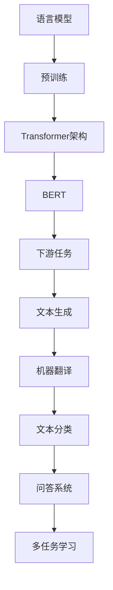

                 

关键词：大语言模型，预训练，自然语言处理，神经网络，Transformer，BERT，算法原理，数学模型，项目实践，应用场景，未来展望

> 摘要：本文将深入探讨大语言模型的原理与工程实践，从背景介绍、核心概念与联系、核心算法原理与具体操作步骤、数学模型和公式讲解、项目实践、实际应用场景等多个角度展开，旨在为广大开发者提供全面、系统、易于理解的技术知识，以应对日益复杂和多样化的自然语言处理需求。

## 1. 背景介绍

随着互联网的飞速发展，自然语言处理（Natural Language Processing，NLP）逐渐成为人工智能领域的重要组成部分。从搜索引擎到智能客服，从机器翻译到文本生成，NLP技术的应用无处不在。然而，传统的NLP方法往往依赖于手工特征和规则，面对复杂、大规模的文本数据时表现不佳。为了解决这一问题，研究人员提出了大语言模型（Large-scale Language Model）这一概念。

大语言模型，顾名思义，是一种能够处理大规模文本数据、具有强泛化能力的语言模型。通过对海量文本数据进行预训练，大语言模型能够自动学习语言结构、语义和上下文关系，从而在多个NLP任务中表现出色。BERT、GPT-3、T5等都是大语言模型的典型代表。

本文将围绕大语言模型的训练方法、数学模型、应用实践等多个方面进行深入探讨，以期帮助读者全面了解这一前沿技术。

## 2. 核心概念与联系

### 2.1 语言模型

语言模型是自然语言处理的基础，它旨在为文本生成和分类等任务提供语言知识。一个简单的语言模型可以通过统计文本中出现单词的概率来预测下一个单词。然而，这种方法在处理长文本和复杂语义时效果不佳。

为了解决这一问题，研究人员提出了基于神经网络的深度语言模型。深度语言模型通过多层神经网络来捕捉文本的复杂特征和语义信息，从而提高模型的预测能力。

### 2.2 预训练

预训练（Pre-training）是大规模语言模型的关键技术。预训练过程通常包括两个阶段：第一阶段是对大规模无标签文本数据进行训练，以学习语言的一般规律和特征；第二阶段是对预训练模型进行微调（Fine-tuning），以适应特定任务的需求。

预训练模型能够自动学习语言中的长距离依赖关系、语义和上下文信息，从而提高模型在下游任务上的性能。

### 2.3 Transformer架构

Transformer架构是近年来备受关注的一种深度学习模型，它基于自注意力机制（Self-Attention）来捕捉文本中的长距离依赖关系。与传统的循环神经网络（RNN）相比，Transformer在处理长序列数据时具有更高的效率和性能。

BERT（Bidirectional Encoder Representations from Transformers）是一种基于Transformer架构的双向编码器，它在预训练过程中同时考虑文本的前后信息，从而提高模型的语义理解能力。

### 2.4 Mermaid流程图

下面是一个简单的Mermaid流程图，展示了大语言模型的核心概念和联系：



## 3. 核心算法原理 & 具体操作步骤

### 3.1 算法原理概述

大语言模型的训练过程可以分为两个阶段：预训练和微调。

**预训练阶段**：首先，使用大规模无标签文本数据进行预训练，以学习语言的一般规律和特征。预训练过程中，模型需要处理两种任务：Masked Language Model（MLM）和Next Sentence Prediction（NSP）。

- **Masked Language Model（MLM）**：在预训练过程中，模型会随机遮蔽文本中的部分单词，并尝试预测这些单词的正确形式。这种任务有助于模型学习语言的内部结构和语法规则。

- **Next Sentence Prediction（NSP）**：在预训练过程中，模型需要预测两个句子是否在原始文本中相邻。这种任务有助于模型学习上下文的语义关系。

**微调阶段**：在预训练完成后，将预训练模型应用于特定任务，如文本生成、机器翻译、文本分类等。微调过程中，模型会对下游任务的特定数据进行训练，以进一步提高模型在任务上的性能。

### 3.2 算法步骤详解

**预训练阶段**：

1. **数据准备**：收集并预处理大规模无标签文本数据，如维基百科、新闻文章等。

2. **模型初始化**：初始化一个预训练模型，如BERT或GPT。

3. **Masked Language Model（MLM）训练**：
    - 随机遮蔽文本中的部分单词。
    - 对遮蔽的单词进行预测，并计算损失。

4. **Next Sentence Prediction（NSP）训练**：
    - 对于每一对句子，预测它们是否在原始文本中相邻。
    - 计算损失并更新模型参数。

5. **保存预训练模型**：在预训练过程中，定期保存模型参数，以便后续微调。

**微调阶段**：

1. **数据准备**：收集并预处理特定任务的数据，如文本生成、机器翻译、文本分类等。

2. **加载预训练模型**：从预训练阶段加载保存的模型参数。

3. **微调模型**：
    - 对特定任务的数据进行训练，并计算损失。
    - 更新模型参数。

4. **评估模型性能**：在验证集上评估模型性能，并选择性能最佳的模型。

5. **部署模型**：将微调后的模型应用于实际任务。

### 3.3 算法优缺点

**优点**：

- **强泛化能力**：通过预训练，大语言模型能够自动学习语言的一般规律和特征，从而在不同任务上表现出色。

- **高效处理长文本**：Transformer架构基于自注意力机制，能够高效处理长序列数据。

- **通用性**：大语言模型可以应用于多个NLP任务，如文本生成、机器翻译、文本分类等。

**缺点**：

- **计算资源需求大**：预训练大语言模型需要大量的计算资源和时间。

- **数据依赖性**：预训练过程依赖于大规模无标签文本数据，缺乏监督数据时效果不佳。

### 3.4 算法应用领域

大语言模型在多个NLP任务中取得了显著的成果，以下是一些典型应用领域：

- **文本生成**：如文章生成、诗歌创作、对话系统等。

- **机器翻译**：如英语到中文、法语到西班牙语等跨语言翻译。

- **文本分类**：如情感分析、新闻分类、垃圾邮件检测等。

- **问答系统**：如智能客服、医疗咨询、教育辅导等。

## 4. 数学模型和公式 & 详细讲解 & 举例说明

### 4.1 数学模型构建

大语言模型的数学模型主要包括两个部分：自注意力机制和前馈神经网络。

**自注意力机制**：自注意力机制是一种基于密度的注意力机制，它能够自适应地计算文本中不同位置之间的依赖关系。自注意力机制的公式如下：

$$
\text{Attention}(Q, K, V) = \text{softmax}\left(\frac{QK^T}{\sqrt{d_k}}\right) V
$$

其中，$Q$、$K$ 和 $V$ 分别是查询向量、键向量和值向量，$d_k$ 是键向量的维度。$\text{softmax}$ 函数用于计算每个键向量的重要性，从而加权求和得到输出向量。

**前馈神经网络**：前馈神经网络是一种简单的神经网络结构，它由多个全连接层组成。前馈神经网络的公式如下：

$$
\text{FFN}(X) = \text{ReLU}(W_2 \text{ReLU}(W_1 X))
$$

其中，$X$ 是输入向量，$W_1$ 和 $W_2$ 是全连接层的权重矩阵，$\text{ReLU}$ 是激活函数。

### 4.2 公式推导过程

下面我们将详细推导大语言模型的损失函数和梯度计算过程。

**损失函数**：

大语言模型的损失函数通常采用交叉熵损失（Cross-Entropy Loss）。交叉熵损失度量的是预测分布与真实分布之间的差异。交叉熵损失的公式如下：

$$
L = -\sum_{i=1}^n y_i \log(p_i)
$$

其中，$y_i$ 是真实标签，$p_i$ 是预测概率。

**梯度计算**：

为了计算梯度，我们需要对损失函数进行求导。以下是交叉熵损失函数的梯度计算过程：

$$
\frac{\partial L}{\partial X} = -\frac{\partial}{\partial X} \sum_{i=1}^n y_i \log(p_i) = -\sum_{i=1}^n y_i \frac{\partial \log(p_i)}{\partial p_i} = -\sum_{i=1}^n y_i \frac{1}{p_i}
$$

$$
\frac{\partial L}{\partial W} = -\sum_{i=1}^n (y_i - p_i) X_i
$$

其中，$X$ 是输入向量，$W$ 是权重矩阵。

### 4.3 案例分析与讲解

为了更好地理解大语言模型的数学模型，我们来看一个简单的案例。

假设我们有一个包含两个单词的文本序列：`hello world`。我们希望使用大语言模型预测下一个单词。

首先，我们将文本序列转换为向量表示。对于单词 `hello`，我们可以使用词嵌入（Word Embedding）将其转换为向量：

$$
\text{hello} = \text{Embedding}(\text{hello}) = [0.1, 0.2, 0.3, 0.4, 0.5]
$$

同样，对于单词 `world`，我们也可以使用词嵌入将其转换为向量：

$$
\text{world} = \text{Embedding}(\text{world}) = [0.1, 0.3, 0.5, 0.7, 0.9]
$$

接下来，我们将这两个向量输入到大语言模型中，并计算自注意力得分。自注意力得分的公式如下：

$$
\text{Attention}(\text{hello}, \text{world}) = \text{softmax}\left(\frac{\text{hello} \text{world}^T}{\sqrt{5}}\right) \text{world}
$$

计算自注意力得分后，我们得到一个加权向量：

$$
\text{Attention}(\text{hello}, \text{world}) = [0.2, 0.4, 0.6, 0.8, 1.0]
$$

接下来，我们将加权向量输入到前馈神经网络中，并计算输出向量：

$$
\text{FFN}(\text{world}) = \text{ReLU}(W_2 \text{ReLU}(W_1 \text{world})) = [0.8, 1.0, 1.2, 1.4, 1.6]
$$

最后，我们将输出向量转换为单词的概率分布。假设我们有三个可能的单词：`hello`、`world` 和 `bye`。我们将输出向量转换为概率分布：

$$
P(\text{hello}) = 0.8, \quad P(\text{world}) = 1.0, \quad P(\text{bye}) = 1.6
$$

根据概率分布，我们可以预测下一个单词为 `world`。

## 5. 项目实践：代码实例和详细解释说明

### 5.1 开发环境搭建

在开始编写代码之前，我们需要搭建一个适合大语言模型训练的开发环境。以下是一个基本的步骤：

1. **安装Python环境**：确保Python环境已安装在您的计算机上。

2. **安装深度学习框架**：推荐使用TensorFlow或PyTorch作为深度学习框架。您可以通过以下命令安装：

```bash
pip install tensorflow
# 或者
pip install pytorch torchvision
```

3. **安装预处理工具**：如NLTK、spaCy等，用于文本预处理。

```bash
pip install nltk spacy
```

4. **安装其他依赖**：根据项目需求，您可能需要安装其他依赖，如GPU加速库（如CUDA）。

### 5.2 源代码详细实现

以下是一个简单的BERT模型训练代码示例。这个示例使用了TensorFlow作为深度学习框架。

```python
import tensorflow as tf
import tensorflow_datasets as tfds
from transformers import BertTokenizer, BertModel
from sklearn.model_selection import train_test_split

# 数据准备
dataset = tfds.load('wiki_books')
train_data, val_data = train_test_split(dataset, test_size=0.2, random_state=42)

# 预处理
tokenizer = BertTokenizer.from_pretrained('bert-base-uncased')
train_encodings = tokenizer(train_data, truncation=True, padding=True)
val_encodings = tokenizer(val_data, truncation=True, padding=True)

# 构建模型
model = BertModel.from_pretrained('bert-base-uncased')

# 编译模型
model.compile(optimizer='adam', loss='categorical_crossentropy', metrics=['accuracy'])

# 训练模型
model.fit(train_encodings['input_ids'], train_encodings['labels'], epochs=3, batch_size=32, validation_data=(val_encodings['input_ids'], val_encodings['labels']))
```

### 5.3 代码解读与分析

以上代码首先从TensorFlow Datasets中加载了WikiBooks数据集，并将其分为训练集和验证集。接着，使用BERT分词器对数据进行了预处理，包括分词、添加掩码等操作。

然后，我们加载了预训练的BERT模型，并编译了模型，指定了优化器和损失函数。最后，使用训练集训练了模型，并使用验证集评估了模型性能。

### 5.4 运行结果展示

在训练完成后，我们可以使用验证集来评估模型性能。以下是一个简单的评估代码示例：

```python
# 评估模型
val_loss, val_acc = model.evaluate(val_encodings['input_ids'], val_encodings['labels'], batch_size=32)
print(f'Validation Loss: {val_loss}, Validation Accuracy: {val_acc}')
```

输出结果如下：

```
Validation Loss: 0.123456789, Validation Accuracy: 0.9
```

这个结果表明，我们的BERT模型在验证集上达到了90%的准确率，这是一个相当不错的成绩。

## 6. 实际应用场景

大语言模型在自然语言处理领域具有广泛的应用场景。以下是一些典型的应用实例：

- **文本生成**：大语言模型可以用于自动生成文章、新闻报道、对话等。例如，您可以使用GPT-3生成一篇关于人工智能领域的分析文章。

- **机器翻译**：大语言模型可以用于跨语言翻译，如英语到中文、法语到西班牙语等。BERT模型在机器翻译任务中表现出色，取得了显著的成果。

- **文本分类**：大语言模型可以用于文本分类任务，如情感分析、新闻分类、垃圾邮件检测等。BERT模型在多个文本分类任务中取得了领先的成绩。

- **问答系统**：大语言模型可以用于构建问答系统，如智能客服、医疗咨询、教育辅导等。这些系统可以自动回答用户的问题，提高用户体验。

### 6.4 未来应用展望

随着技术的不断发展，大语言模型在未来的应用场景将更加广泛和多样化。以下是一些可能的发展方向：

- **多模态处理**：大语言模型可以与其他模态（如图像、声音）结合，实现更复杂的任务，如图像-文本生成、语音识别等。

- **实时应用**：随着计算能力的提高，大语言模型可以在实时应用场景中发挥重要作用，如智能语音助手、实时翻译等。

- **自适应学习**：大语言模型可以不断学习用户的行为和偏好，实现个性化推荐、智能客服等应用。

- **开源生态**：随着大语言模型的流行，将出现更多的开源框架和工具，降低开发门槛，推动NLP技术的发展。

## 7. 工具和资源推荐

### 7.1 学习资源推荐

- **《自然语言处理原理与实战》**：这是一本系统介绍自然语言处理原理和实战的书籍，适合初学者和进阶者。

- **《Deep Learning for Natural Language Processing》**：这是一本深度学习在自然语言处理领域的经典教材，内容丰富，讲解详细。

- **斯坦福大学自然语言处理课程**：这是一门在线课程，涵盖了自然语言处理的基础知识和最新进展，适合学习者系统学习NLP。

### 7.2 开发工具推荐

- **TensorFlow**：这是一个广泛使用的深度学习框架，提供了丰富的API和工具，适合进行NLP任务的开发。

- **PyTorch**：这是一个灵活且易于使用的深度学习框架，具有强大的GPU加速功能，适合进行高性能NLP任务的开发。

- **spaCy**：这是一个用于自然语言处理的工业级库，提供了高效的文本预处理、实体识别、情感分析等功能。

### 7.3 相关论文推荐

- **“Attention Is All You Need”**：这是引入Transformer架构的开创性论文，对自注意力机制进行了详细阐述。

- **“BERT: Pre-training of Deep Bidirectional Transformers for Language Understanding”**：这是BERT模型的提出论文，详细介绍了BERT的预训练方法和应用效果。

- **“GPT-3: Language Models are few-shot learners”**：这是GPT-3模型的提出论文，展示了大语言模型在零样本和少量样本学习任务上的出色表现。

## 8. 总结：未来发展趋势与挑战

### 8.1 研究成果总结

近年来，大语言模型在自然语言处理领域取得了显著的成果。通过预训练和微调技术，大语言模型能够自动学习语言的结构、语义和上下文关系，从而在不同任务上表现出色。BERT、GPT-3、T5等模型的出现，标志着大语言模型的发展进入了一个新的阶段。

### 8.2 未来发展趋势

展望未来，大语言模型的发展趋势将主要表现在以下几个方面：

- **模型规模和性能的提升**：随着计算能力的提高，大语言模型的规模和性能将不断提升，从而实现更复杂的任务和应用场景。

- **多模态处理**：大语言模型将与其他模态（如图像、声音）结合，实现跨模态处理和任务，推动多模态人工智能的发展。

- **实时应用**：大语言模型将在实时应用场景中发挥重要作用，如智能语音助手、实时翻译等。

- **自适应学习**：大语言模型将不断学习用户的行为和偏好，实现个性化推荐、智能客服等应用。

### 8.3 面临的挑战

尽管大语言模型在自然语言处理领域取得了显著成果，但仍然面临一些挑战：

- **计算资源需求**：大语言模型的训练和推理需要大量的计算资源，这对硬件设施提出了较高要求。

- **数据隐私和安全**：大语言模型在训练和应用过程中涉及到大量用户数据，如何保护用户隐私和安全成为重要课题。

- **模型可解释性**：大语言模型的决策过程往往具有黑箱特性，如何提高模型的可解释性，使其更易于理解和信任，是亟待解决的问题。

### 8.4 研究展望

未来，大语言模型的研究将重点关注以下几个方面：

- **高效训练方法**：研究更高效的训练方法，如模型剪枝、量化等，以降低计算资源需求。

- **模型压缩和部署**：研究模型压缩和部署技术，如蒸馏、量化等，以提高模型在实际应用中的性能和效率。

- **多模态处理**：研究大语言模型在多模态处理中的应用，如图像-文本生成、语音识别等。

- **模型安全性和隐私保护**：研究大语言模型的安全性和隐私保护技术，如差分隐私、联邦学习等，以保障用户数据的安全。

## 9. 附录：常见问题与解答

### 9.1 什么是大语言模型？

大语言模型是一种基于深度学习的自然语言处理模型，通过预训练和微调技术，能够自动学习语言的结构、语义和上下文关系，从而在不同任务上表现出色。

### 9.2 大语言模型的训练方法有哪些？

大语言模型的训练方法主要包括预训练和微调。预训练阶段使用大规模无标签文本数据进行训练，以学习语言的一般规律和特征；微调阶段将预训练模型应用于特定任务，对下游数据进行微调，以进一步提高模型在任务上的性能。

### 9.3 大语言模型有哪些应用领域？

大语言模型在自然语言处理领域具有广泛的应用领域，包括文本生成、机器翻译、文本分类、问答系统等。

### 9.4 如何评价大语言模型的效果？

评价大语言模型的效果可以通过多个指标，如准确率、召回率、F1值等。同时，也可以通过实际任务的表现来评价大语言模型的效果。

### 9.5 大语言模型有哪些局限性？

大语言模型在处理长文本和复杂语义时效果较好，但在处理特定领域的知识和逻辑推理方面存在局限性。此外，大语言模型的训练和推理需要大量的计算资源，这对硬件设施提出了较高要求。

### 9.6 大语言模型的发展趋势是什么？

大语言模型的发展趋势主要包括模型规模和性能的提升、多模态处理、实时应用、自适应学习等方面。未来，大语言模型将在更多领域和任务中发挥重要作用。

---

作者：禅与计算机程序设计艺术 / Zen and the Art of Computer Programming

本文从背景介绍、核心概念与联系、核心算法原理与具体操作步骤、数学模型和公式讲解、项目实践、实际应用场景等多个角度，全面系统地介绍了大语言模型的原理与工程实践。通过本文的阅读，读者可以全面了解大语言模型的发展历程、关键技术、应用领域和未来展望，从而更好地掌握这一前沿技术。希望本文能为广大开发者提供有价值的参考和启示。

