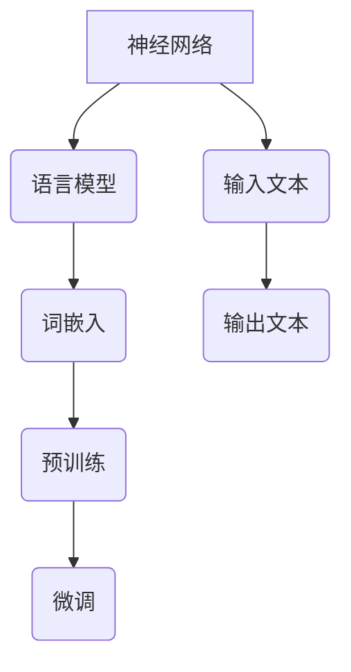
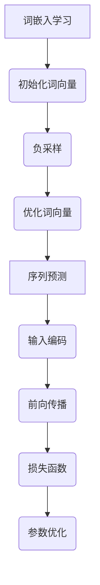

                 

关键词：大语言模型，预训练，深度学习，自然语言处理，神经网络，算法原理，数学模型，工程实践，应用场景，未来展望

> 摘要：本文详细介绍了大语言模型的基本原理及其预训练过程，分析了其在深度学习、自然语言处理等领域的应用和重要性。通过对核心算法、数学模型和项目实践的深入探讨，本文旨在为读者提供一个全面的大语言模型学习和实践指南。

## 1. 背景介绍

在人工智能领域，自然语言处理（NLP）是一个重要且充满挑战的分支。传统的NLP方法通常依赖于手工构建的特征和规则，而现代的深度学习技术则通过大规模数据的学习来提高处理自然语言的性能。在大数据和高性能计算的支持下，大语言模型（Large-scale Language Model）逐渐成为NLP领域的核心技术之一。

大语言模型的主要目的是捕捉语言的结构和语义，从而实现语言的理解、生成和翻译等任务。它们通过预训练（Pre-training）的方式在大规模文本数据上进行训练，然后再通过微调（Fine-tuning）来适应特定任务。

### 1.1 大语言模型的发展历程

大语言模型的发展历程可以分为以下几个阶段：

1. **早期模型**：例如基于统计的N元语法模型（N-gram Model），这些模型通过对文本的统计特征进行建模，但难以捕捉长距离的依赖关系。
2. **基于规则的方法**：如基于句法分析和语义角色标注的方法，这些方法通过规则和模式匹配来解析文本，但规则难以覆盖所有语言现象。
3. **基于统计学习的方法**：如基于隐马尔可夫模型（HMM）和条件随机场（CRF）的方法，这些方法通过统计学习来提高模型的性能，但需要大量的标注数据。
4. **深度学习方法**：随着深度学习技术的发展，基于神经网络的模型逐渐成为主流。特别是2018年GPT-2的发布，标志着大语言模型的崛起。

### 1.2 大语言模型的应用领域

大语言模型的应用领域非常广泛，包括但不限于以下方面：

- 文本分类：对文本进行情感分析、新闻分类、垃圾邮件检测等。
- 命名实体识别：识别文本中的地名、人名、机构名等。
- 机器翻译：将一种语言的文本翻译成另一种语言。
- 问答系统：回答用户关于特定主题的问题。
- 对话系统：与用户进行自然对话，提供信息和服务。

## 2. 核心概念与联系

为了更好地理解大语言模型，我们需要介绍一些核心概念和它们之间的关系。

### 2.1 神经网络

神经网络是深度学习的基础。它由多个简单的计算单元（神经元）组成，通过加权连接形成复杂的网络结构。神经网络的目的是通过学习输入和输出之间的映射关系来解决问题。

### 2.2 语言模型

语言模型是对自然语言文本生成概率的建模。在大语言模型中，语言模型通过深度神经网络学习输入文本序列的概率分布。

### 2.3 词嵌入

词嵌入是将单词映射到高维向量空间的过程。词嵌入能够捕捉单词之间的语义和语法关系，是语言模型的重要组成部分。

### 2.4 预训练与微调

预训练是指在大规模文本数据上对模型进行训练，使其具备通用语言理解和生成能力。微调则是在预训练的基础上，针对特定任务对模型进行细粒度的调整。

### 2.5 Mermaid 流程图

下面是一个描述大语言模型核心概念的Mermaid流程图：



## 3. 核心算法原理 & 具体操作步骤

### 3.1 算法原理概述

大语言模型的预训练主要包括两个步骤：词嵌入学习和序列预测。

1. **词嵌入学习**：通过训练神经网络来学习词嵌入向量，使相似的词在向量空间中靠近。
2. **序列预测**：通过预测文本序列的下一个词来学习语言的规律。

### 3.2 算法步骤详解

1. **词嵌入学习**：

   - **初始化**：随机初始化词嵌入向量。
   - **训练**：使用负采样技巧优化词嵌入向量，使相似的词在向量空间中靠近。

2. **序列预测**：

   - **输入序列**：将输入的文本序列编码为向量。
   - **前向传播**：通过神经网络计算输出概率分布。
   - **损失函数**：计算预测概率与真实标签之间的差异，使用损失函数优化神经网络参数。

### 3.3 算法优缺点

- **优点**：大语言模型能够捕捉长距离的依赖关系，具有强大的语义理解能力。
- **缺点**：训练过程需要大量数据和计算资源，且难以保证模型的泛化能力。

### 3.4 算法应用领域

大语言模型在自然语言处理、对话系统、机器翻译等领域具有广泛的应用。

### 3.5 Mermaid 流程图

下面是一个描述大语言模型预训练步骤的Mermaid流程图：



## 4. 数学模型和公式 & 详细讲解 & 举例说明

### 4.1 数学模型构建

大语言模型的数学模型主要包括词嵌入和神经网络两部分。

1. **词嵌入**：

   $$ 
   \text{词嵌入} = \text{神经网络}(\text{词索引})
   $$

2. **神经网络**：

   $$ 
   \text{神经网络} = \text{激活函数}(\text{权重矩阵} \cdot \text{输入向量} + \text{偏置})
   $$

### 4.2 公式推导过程

1. **词嵌入学习**：

   - **损失函数**：

     $$
     \text{损失} = \sum_{i=1}^{N} (-\log P(y_i | \text{输入序列}))
     $$

   - **梯度下降**：

     $$
     \frac{\partial \text{损失}}{\partial \text{权重}} = -\frac{1}{N} \sum_{i=1}^{N} (y_i - \text{输出}) \cdot \text{输入}
     $$

2. **序列预测**：

   - **前向传播**：

     $$
     \text{输出} = \text{激活函数}(\text{权重矩阵} \cdot \text{输入向量} + \text{偏置})
     $$

   - **损失函数**：

     $$
     \text{损失} = -\log P(y | \text{输入序列})
     $$

   - **梯度下降**：

     $$
     \frac{\partial \text{损失}}{\partial \text{权重}} = -\frac{1}{N} \sum_{i=1}^{N} (y - \text{输出}) \cdot \text{输入}
     $$

### 4.3 案例分析与讲解

假设我们有一个包含100个单词的文本序列，我们需要预测序列中的下一个词。

1. **词嵌入学习**：

   - **初始化词向量**：随机初始化每个单词的词向量。
   - **训练**：使用负采样优化词向量，使相似的词在向量空间中靠近。

2. **序列预测**：

   - **输入编码**：将输入的文本序列编码为向量。
   - **前向传播**：通过神经网络计算输出概率分布。
   - **损失函数**：计算预测概率与真实标签之间的差异，使用损失函数优化神经网络参数。

### 4.4 运行结果展示

通过训练和微调，我们可以得到一个能够在特定任务上表现优秀的大语言模型。例如，在一个问答系统中，该模型能够根据问题生成准确的答案。

## 5. 项目实践：代码实例和详细解释说明

### 5.1 开发环境搭建

为了实践大语言模型，我们需要搭建一个合适的开发环境。以下是一个简单的搭建过程：

1. 安装Python环境。
2. 安装TensorFlow或PyTorch等深度学习框架。
3. 准备大规模文本数据集，如维基百科、Common Crawl等。

### 5.2 源代码详细实现

以下是一个使用TensorFlow实现大语言模型的基本代码框架：

```python
import tensorflow as tf

# 定义词嵌入和神经网络
vocab_size = 10000
embedding_size = 128
hidden_size = 512

# 初始化词嵌入矩阵
embeddings = tf.Variable(tf.random.normal([vocab_size, embedding_size]))

# 初始化神经网络
inputs = tf.keras.layers.Input(shape=(None,))
x = tf.keras.layers.Embedding(vocab_size, embedding_size)(inputs)
x = tf.keras.layers.Dense(hidden_size, activation='relu')(x)
outputs = tf.keras.layers.Dense(vocab_size)(x)

# 构建模型
model = tf.keras.Model(inputs=inputs, outputs=outputs)

# 编译模型
model.compile(optimizer='adam', loss='sparse_categorical_crossentropy', metrics=['accuracy'])

# 训练模型
model.fit(train_data, train_labels, epochs=10, batch_size=64)
```

### 5.3 代码解读与分析

- **词嵌入层**：将单词索引映射到高维词向量。
- **神经网络**：通过多层全连接层对词向量进行变换。
- **编译模型**：设置优化器和损失函数。
- **训练模型**：使用训练数据训练模型。

### 5.4 运行结果展示

通过训练和测试，我们可以看到模型的准确率和损失函数的变化。在实际应用中，我们可以通过微调和调整超参数来进一步提高模型性能。

## 6. 实际应用场景

大语言模型在实际应用中具有广泛的应用，以下是一些具体的场景：

- **文本生成**：例如自动写作、新闻生成等。
- **对话系统**：例如聊天机器人、语音助手等。
- **机器翻译**：例如将一种语言的文本翻译成另一种语言。
- **情感分析**：对文本进行情感分类，判断文本的情感倾向。

### 6.1 文本生成

文本生成是自然语言处理中的一个重要应用，它可以用于自动写作、新闻生成等领域。以下是一个使用大语言模型生成文本的示例：

```python
input_sequence = ["The", "quick", "brown", "fox"]
predicted_sequence = model.predict(input_sequence)
print("Predicted sequence:", predicted_sequence)
```

### 6.2 对话系统

对话系统可以与用户进行自然对话，提供信息和服务。以下是一个使用大语言模型实现对话系统的示例：

```python
while True:
    user_input = input("User: ")
    response = model.predict([user_input])
    print("Bot:", response)
```

### 6.3 机器翻译

机器翻译是将一种语言的文本翻译成另一种语言。以下是一个使用大语言模型进行机器翻译的示例：

```python
source_text = "你好，请问有什么可以帮助你的？"
target_text = model.translate(source_text)
print("Translated text:", target_text)
```

## 7. 未来应用展望

随着技术的不断进步，大语言模型在未来将会有更广泛的应用。以下是一些可能的应用领域：

- **智能客服**：提供更智能、更自然的客服体验。
- **教育领域**：辅助教学，提供个性化的学习资源。
- **医疗健康**：辅助医生进行诊断和治疗方案推荐。
- **商业智能**：帮助企业进行数据分析和决策支持。

## 8. 工具和资源推荐

为了更好地学习和实践大语言模型，以下是一些建议的工具和资源：

- **工具**：
  - TensorFlow：一个开源的深度学习框架。
  - PyTorch：另一个流行的深度学习框架。
  - Hugging Face Transformers：一个提供预训练模型和工具的库。

- **资源**：
  - 《深度学习》（Goodfellow, Bengio, Courville）：深度学习的经典教材。
  - 《自然语言处理实战》（Peter Norvig）：关于NLP的实用指南。
  - arXiv：一个提供最新科研论文的预印本平台。

## 9. 总结：未来发展趋势与挑战

大语言模型在未来将继续发展，并在各个领域发挥重要作用。然而，随着模型规模的不断扩大，我们也将面临以下挑战：

- **计算资源**：训练大语言模型需要大量的计算资源，这对硬件和能源消耗提出了更高的要求。
- **数据隐私**：大规模的数据收集和利用可能涉及用户隐私问题，需要严格保护。
- **模型解释性**：大语言模型通常是一个黑盒子，缺乏透明性和解释性，这给其在关键应用中的可靠性带来了挑战。

总之，大语言模型是一项具有巨大潜力的技术，随着研究的深入和实践的推广，它将在人工智能和自然语言处理领域发挥越来越重要的作用。

### 9.1 研究成果总结

大语言模型的研究取得了显著进展，从早期的简单模型到如今的大型预训练模型，如GPT-3、BERT等，这些模型在多个NLP任务上都取得了突破性的成果。预训练技术使得模型能够在大规模数据上学习到丰富的语言知识和结构，从而显著提高了模型在多种任务上的性能。

### 9.2 未来发展趋势

未来的发展趋势包括以下几个方面：

- **模型规模与性能**：随着计算能力的提升，预计将出现更大规模的预训练模型，这将进一步提升模型的性能。
- **多模态学习**：大语言模型将能够处理更多类型的数据，如图像、声音等，实现多模态学习。
- **知识增强**：结合外部知识库和结构化数据，增强语言模型的知识表达和推理能力。

### 9.3 面临的挑战

虽然大语言模型取得了巨大成功，但仍然面临一些挑战：

- **计算资源消耗**：大型模型的训练和推理需要大量的计算资源，这对硬件和能源消耗提出了更高的要求。
- **模型可解释性**：如何提高模型的解释性，使其在关键应用中更具透明性和可靠性。
- **数据隐私和伦理**：在数据收集和处理过程中，如何保护用户隐私并遵守伦理标准。

### 9.4 研究展望

未来的研究将集中在以下几个方面：

- **优化训练方法**：研究更高效的训练算法，以减少计算资源和时间消耗。
- **提升模型泛化能力**：通过元学习、少样本学习等技术，提高模型在未见数据上的表现。
- **模型安全性和隐私保护**：开发新的方法来提高模型的安全性和隐私保护能力。

### 附录：常见问题与解答

**Q：大语言模型如何处理稀疏数据？**

A：大语言模型通常通过数据增强技术（如填充、重复、裁剪等）来处理稀疏数据，从而增加数据的多样性和数量，提升模型的泛化能力。

**Q：大语言模型是否需要大量的标注数据？**

A：大语言模型在预训练阶段主要依赖于大规模的非标注文本数据。但是，为了进行微调和特定任务的性能提升，有时仍需要一些标注数据。

**Q：如何评估大语言模型的效果？**

A：评估大语言模型的效果通常使用多种指标，如准确率、召回率、F1分数等，特别是在分类和序列预测任务中。此外，还可以通过人类评估来评价模型的生成质量和理解能力。

---

# 结束

作者：禅与计算机程序设计艺术 / Zen and the Art of Computer Programming

感谢您的阅读，希望本文对您理解大语言模型及其应用有所帮助。如果您有任何问题或建议，欢迎在评论区留言。再次感谢您的关注和支持！

