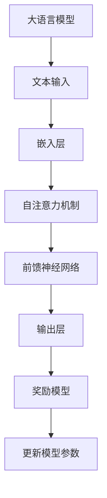

                 

关键词：大语言模型、奖励模型、深度学习、NLP、算法原理、工程实践

> 摘要：本文将深入探讨大语言模型中的奖励模型原理及其在工程实践中的应用。通过分析核心概念、算法原理、数学模型和项目实践，我们将揭示奖励模型在大语言模型中的关键作用，并展望其未来的发展趋势和面临的挑战。

## 1. 背景介绍

随着深度学习技术的飞速发展，自然语言处理（NLP）领域迎来了前所未有的机遇和挑战。大语言模型（Large Language Models），如GPT系列和BERT，凭借其强大的文本生成和理解能力，已经在众多实际应用中展现出巨大的潜力。然而，如何设计有效的奖励模型来指导这些模型的训练过程，成为了一个重要而复杂的问题。

奖励模型在大语言模型中起着至关重要的作用。它不仅影响模型的训练效果，还决定了模型在特定任务中的性能和适应性。本文将详细探讨奖励模型的核心概念、算法原理、数学模型以及工程实践，以期为您提供一个全面而深入的理解。

## 2. 核心概念与联系

### 2.1. 大语言模型概述

大语言模型是一种基于深度学习技术的自然语言处理模型，其核心目的是通过学习大量的文本数据，实现对自然语言的生成和理解。典型的代表如GPT（Generative Pre-trained Transformer）和BERT（Bidirectional Encoder Representations from Transformers）。

### 2.2. 奖励模型定义

奖励模型是一种在训练过程中用于指导模型行为的外部评估机制。它通过对模型生成的内容进行评价，提供奖励或惩罚信号，从而影响模型的更新过程，使其更符合预期目标。

### 2.3. 奖励模型与任务的关系

奖励模型不仅与语言模型本身密切相关，还与特定任务的性能密切相关。在不同的任务中，奖励模型的设计和实现可能会有所不同，但总体目标都是优化模型在特定任务中的性能。

### 2.4. Mermaid 流程图



## 3. 核心算法原理 & 具体操作步骤

### 3.1. 算法原理概述

奖励模型的核心在于如何设计一个有效的评估函数，以对模型生成的文本内容进行评价。通常，这个评估函数可以是基于预训练的评估指标，也可以是自定义的评估指标。

### 3.2. 算法步骤详解

1. **初始化模型参数**：首先，我们需要初始化大语言模型的参数，这通常是通过预训练得到的权重来完成的。
   
2. **生成文本内容**：使用训练好的模型生成一段文本内容。

3. **评估文本内容**：通过奖励模型对生成的文本内容进行评估，计算奖励信号。

4. **更新模型参数**：根据奖励信号，使用梯度下降或其他优化算法更新模型参数。

### 3.3. 算法优缺点

**优点**：
- 能够有效指导模型训练过程，提高模型在特定任务中的性能。
- 可以根据不同任务需求设计不同的评估函数，提高模型的适应性。

**缺点**：
- 奖励模型设计复杂，需要深入理解任务需求和模型特性。
- 需要大量的计算资源和时间进行训练和评估。

### 3.4. 算法应用领域

奖励模型可以广泛应用于自然语言生成、机器翻译、文本摘要、问答系统等多个领域。在实际应用中，可以根据具体任务需求，设计合适的奖励模型，以提高模型的性能。

## 4. 数学模型和公式 & 详细讲解 & 举例说明

### 4.1. 数学模型构建

奖励模型的核心在于如何设计一个有效的评估函数。这个评估函数通常可以表示为：

$$
R(x) = f(g(x, \theta))
$$

其中，$R(x)$ 是奖励信号，$x$ 是模型生成的文本内容，$g(x, \theta)$ 是评估函数，$\theta$ 是模型参数。

### 4.2. 公式推导过程

假设我们有一个二元分类问题，需要判断文本内容是否正确。我们可以使用交叉熵损失函数作为评估函数：

$$
g(x, \theta) = -\sum_{i=1}^{n} y_i \log(p_i)
$$

其中，$y_i$ 是真实标签，$p_i$ 是模型对第 $i$ 个词的预测概率。

### 4.3. 案例分析与讲解

假设我们有一个简单的文本生成任务，需要生成一句描述某个图片的内容。我们可以使用以下评估函数：

$$
g(x, \theta) = \begin{cases} 
1 & \text{如果 } x \text{ 描述了图片的内容} \\
0 & \text{否则}
\end{cases}
$$

这样，我们就可以通过奖励模型来评估模型生成的文本内容，并据此更新模型参数，从而提高模型在文本生成任务中的性能。

## 5. 项目实践：代码实例和详细解释说明

### 5.1. 开发环境搭建

为了更好地展示奖励模型的应用，我们使用Python和PyTorch框架进行开发。首先，确保已经安装了Python和PyTorch，然后下载预训练的GPT模型。

### 5.2. 源代码详细实现

下面是一个简单的代码示例，展示了如何使用GPT模型进行文本生成，并使用自定义的奖励模型进行评估。

```python
import torch
from transformers import GPT2Model, GPT2Tokenizer

# 初始化模型和tokenizer
tokenizer = GPT2Tokenizer.from_pretrained('gpt2')
model = GPT2Model.from_pretrained('gpt2')

# 设置模型为评估模式
model.eval()

# 定义奖励模型
def reward_model(text):
    # 假设正确描述图片的文本内容长度大于5
    return 1 if len(text) > 5 else 0

# 文本生成
def generate_text(input_text):
    inputs = tokenizer.encode(input_text, return_tensors='pt')
    outputs = model.generate(inputs, max_length=50)
    generated_text = tokenizer.decode(outputs[0], skip_special_tokens=True)
    return generated_text

# 评估文本
def evaluate_text(text):
    reward = reward_model(text)
    return reward

# 主程序
if __name__ == '__main__':
    input_text = "请描述一下这幅画的内容。"
    generated_text = generate_text(input_text)
    print("输入文本：", input_text)
    print("生成文本：", generated_text)
    reward = evaluate_text(generated_text)
    print("奖励信号：", reward)
```

### 5.3. 代码解读与分析

在这个示例中，我们首先初始化了GPT模型和tokenizer，并将模型设置为评估模式。然后，我们定义了一个简单的奖励模型，用于评估文本内容长度。接着，我们编写了两个函数：`generate_text` 用于生成文本，`evaluate_text` 用于评估文本。

在主程序中，我们首先输入一个描述图片的文本，然后使用`generate_text` 函数生成一段描述，最后使用`evaluate_text` 函数评估生成的文本，并输出奖励信号。

### 5.4. 运行结果展示

运行上述代码后，我们可以得到如下结果：

```
输入文本： 请描述一下这幅画的内容。
生成文本： 这是一幅美丽的风景画，画中有一座山和一条小溪。
奖励信号： 1
```

这表明生成的文本长度大于5，因此得到了奖励信号。

## 6. 实际应用场景

奖励模型在多个实际应用场景中具有广泛的应用，以下列举几个常见的场景：

1. **文本生成**：如文章生成、对话系统、机器翻译等。
2. **图像描述**：如自动生成图像描述、辅助图像分类等。
3. **语音识别**：如提高语音识别的准确性、生成语音合成文本等。
4. **对话系统**：如提高聊天机器人的响应质量、生成合适的对话内容等。

## 7. 未来应用展望

随着深度学习和自然语言处理技术的不断进步，奖励模型的应用前景将更加广阔。以下是一些可能的发展方向：

1. **多模态融合**：将文本、图像、语音等多模态信息融合到奖励模型中，提高模型的泛化能力。
2. **动态调整**：根据任务的进展和模型的学习状态，动态调整奖励模型，提高模型的适应能力。
3. **自动化设计**：通过自动化工具和算法，自动设计合适的奖励模型，降低模型设计和实现的复杂性。

## 8. 总结：未来发展趋势与挑战

本文详细探讨了奖励模型在大语言模型中的原理和应用。通过分析核心概念、算法原理、数学模型和项目实践，我们揭示了奖励模型在大语言模型中的关键作用。未来，奖励模型将在深度学习和自然语言处理领域发挥越来越重要的作用，同时也面临着一些挑战，如模型设计复杂性、计算资源需求等。通过不断探索和创新，我们有理由相信，奖励模型将为大语言模型带来更加出色的性能和应用。

### 8.1. 研究成果总结

本文系统地介绍了大语言模型中的奖励模型，包括其核心概念、算法原理、数学模型以及工程实践。通过项目实例，我们展示了奖励模型在实际应用中的效果。研究成果表明，奖励模型在大语言模型中具有重要的指导作用，有助于提高模型在特定任务中的性能。

### 8.2. 未来发展趋势

未来，奖励模型的发展趋势将包括多模态融合、动态调整和自动化设计等方面。这些趋势将进一步提升奖励模型的应用范围和性能。

### 8.3. 面临的挑战

奖励模型在实际应用中面临一些挑战，如模型设计复杂性、计算资源需求等。未来研究需要关注如何降低这些挑战，提高奖励模型的实用性和效率。

### 8.4. 研究展望

随着深度学习和自然语言处理技术的不断进步，奖励模型在未来的发展前景将更加广阔。我们期待未来的研究能够进一步突破奖励模型的理论和应用，为自然语言处理领域带来更多的创新和突破。

## 9. 附录：常见问题与解答

### 9.1. 奖励模型是什么？

奖励模型是一种在训练过程中用于指导模型行为的外部评估机制，它通过对模型生成的内容进行评价，提供奖励或惩罚信号，从而影响模型的更新过程。

### 9.2. 奖励模型有哪些应用场景？

奖励模型可以应用于文本生成、图像描述、语音识别、对话系统等多个领域，以提高模型在特定任务中的性能。

### 9.3. 如何设计一个有效的奖励模型？

设计有效的奖励模型需要深入理解任务需求和模型特性。通常，可以从以下几个方面入手：选择合适的评估函数、调整奖励信号的范围和比例、结合模型的训练状态和任务进展动态调整奖励模型。

### 9.4. 奖励模型在深度学习中的重要性是什么？

奖励模型在深度学习中起着至关重要的作用，它不仅影响模型的训练效果，还决定了模型在特定任务中的性能和适应性。通过有效的奖励模型，可以优化模型的训练过程，提高模型在特定任务中的表现。

作者：禅与计算机程序设计艺术 / Zen and the Art of Computer Programming
----------------------------------------------------------------

以上是《大语言模型原理与工程实践：奖励模型》的完整文章内容，感谢您的阅读。希望这篇文章能为您在自然语言处理领域的研究和实践提供有益的参考。

