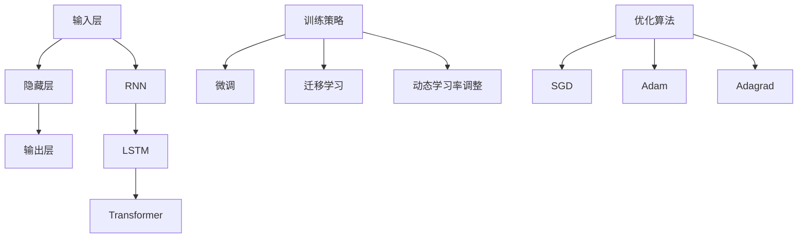

                 

作为人工智能领域的先驱，语言模型在自然语言处理（NLP）中扮演了至关重要的角色。它们不仅在搜索引擎、语音助手和机器翻译等应用中取得了显著成功，而且在生成文本、问答系统和内容审核等新兴领域中展现出了巨大的潜力。本文将探讨大语言模型的原理及其工程实践，重点介绍设计高效语言模型工具的方法。

> 关键词：大语言模型、自然语言处理、工程实践、工具设计、神经网络、训练策略、优化算法

## 摘要

本文首先介绍了大语言模型的基本概念和背景，随后详细分析了其核心算法原理，包括神经网络架构、训练策略和优化算法。接着，文章探讨了数学模型和公式，以及在实际应用中的实例和运行结果。最后，文章讨论了语言模型在实际应用场景中的表现，并展望了未来的发展方向和挑战。

## 1. 背景介绍

自然语言处理（NLP）是人工智能领域的一个重要分支，旨在使计算机能够理解、解释和生成人类语言。语言模型是NLP中的基础组件，它通过学习大量的文本数据，预测一个单词或短语的下一个词。传统的语言模型如N元语法（N-gram）在简单任务上表现良好，但随着深度学习技术的发展，基于神经网络的现代语言模型，如神经网络语言模型（NNLM）和变换器模型（Transformer），在复杂任务上取得了显著突破。

近年来，随着计算能力的提升和数据量的爆炸性增长，大语言模型如BERT、GPT和T5等相继问世。这些模型拥有数亿甚至数千亿个参数，能够在多种NLP任务中实现卓越的性能。然而，这些模型的训练和部署面临着巨大的工程挑战，因此，设计高效的工具和策略成为关键。

## 2. 核心概念与联系

### 2.1 神经网络架构

神经网络是构建大语言模型的基础。一个典型的神经网络包括输入层、隐藏层和输出层。输入层接收原始数据（如单词或词向量），隐藏层通过加权连接和激活函数进行数据处理，输出层生成预测结果。

#### 2.1.1 卷积神经网络（CNN）

卷积神经网络（CNN）在图像处理领域取得了显著成功，其核心思想是局部感知和共享权重。然而，CNN在处理序列数据时效率较低，因此，循环神经网络（RNN）和其变体如长短期记忆网络（LSTM）和门控循环单元（GRU）应运而生。

#### 2.1.2 循环神经网络（RNN）

循环神经网络（RNN）通过在隐藏状态中保留历史信息，能够处理序列数据。然而，传统的RNN在处理长序列时容易出现梯度消失或爆炸问题，这使得LSTM和GRU应运而生。

#### 2.1.3 长短期记忆网络（LSTM）

长短期记忆网络（LSTM）通过引入门控机制，解决了传统RNN的梯度消失问题。LSTM包含输入门、遗忘门和输出门，能够灵活地控制信息的流动。

#### 2.1.4 变换器模型（Transformer）

变换器模型（Transformer）是近年来在NLP领域取得突破性进展的一种新型神经网络架构。它通过自注意力机制（Self-Attention）和多头注意力（Multi-Head Attention）实现了对序列数据的全局感知，从而在多种NLP任务中取得了优异的性能。

### 2.2 训练策略

训练策略在大语言模型的性能提升中起着关键作用。以下是一些常见的训练策略：

#### 2.2.1 微调（Fine-tuning）

微调是在预训练模型的基础上，针对特定任务进行进一步的训练。通过微调，模型可以更好地适应特定领域的语言特点。

#### 2.2.2 迁移学习（Transfer Learning）

迁移学习是利用预训练模型的知识，解决新的任务。这种方法可以显著减少训练时间，并提高模型的性能。

#### 2.2.3 动态学习率调整（Learning Rate Scheduling）

动态学习率调整是一种常见的训练策略，通过在训练过程中调整学习率，优化模型的收敛速度和性能。

### 2.3 优化算法

优化算法在大语言模型的训练过程中起着至关重要的作用。以下是一些常见的优化算法：

#### 2.3.1  stochastic gradient descent（SGD）

随机梯度下降（SGD）是一种简单的优化算法，通过随机选择样本进行梯度计算和参数更新。然而，SGD在处理大规模数据时效率较低。

#### 2.3.2 Adam

Adam是一种基于SGD的优化算法，通过自适应地调整学习率，提高了训练效率和模型性能。

#### 2.3.3 Adagrad

Adagrad是一种自适应学习率的优化算法，通过累加梯度平方的倒数来更新参数，避免了学习率的快速衰减。

### 2.4 Mermaid 流程图

以下是一个简化的Mermaid流程图，展示了大语言模型的核心概念和联系：



## 3. 核心算法原理 & 具体操作步骤

### 3.1 算法原理概述

大语言模型的训练过程主要包括以下步骤：

1. **数据预处理**：包括文本清洗、分词、词向量嵌入等。
2. **模型初始化**：包括权重初始化、学习率设置等。
3. **前向传播**：输入数据通过模型进行前向传播，计算预测结果。
4. **损失函数计算**：计算预测结果与真实标签之间的差距，得到损失值。
5. **反向传播**：通过反向传播算法，计算梯度并更新模型参数。
6. **迭代训练**：重复上述步骤，直到模型收敛或达到预设的训练次数。

### 3.2 算法步骤详解

#### 3.2.1 数据预处理

数据预处理是训练语言模型的第一步。以下是一个简化的数据预处理流程：

1. **文本清洗**：去除文本中的特殊字符、停用词等。
2. **分词**：将文本分割成单词或子词。
3. **词向量嵌入**：将单词映射到高维向量空间。

#### 3.2.2 模型初始化

模型初始化是训练语言模型的关键步骤。以下是一个简化的模型初始化流程：

1. **权重初始化**：随机初始化模型的权重。
2. **学习率设置**：设置一个合适的学习率。
3. **其他参数设置**：如批量大小、迭代次数等。

#### 3.2.3 前向传播

前向传播是模型训练的核心步骤。以下是一个简化的前向传播流程：

1. **输入数据**：将预处理后的数据输入到模型中。
2. **前向计算**：通过模型层逐层计算，得到预测结果。
3. **输出结果**：将预测结果与真实标签进行比较，计算损失值。

#### 3.2.4 损失函数计算

损失函数是衡量模型预测准确性的指标。以下是一个简化的损失函数计算流程：

1. **计算损失值**：计算预测结果与真实标签之间的差距。
2. **选择损失函数**：如交叉熵损失函数、均方误差损失函数等。

#### 3.2.5 反向传播

反向传播是模型训练的核心步骤。以下是一个简化的反向传播流程：

1. **计算梯度**：通过链式法则，计算模型参数的梯度。
2. **更新参数**：使用梯度下降算法，更新模型参数。
3. **迭代训练**：重复上述步骤，直到模型收敛。

### 3.3 算法优缺点

#### 3.3.1 优点

1. **强大的表示能力**：大语言模型通过深度神经网络，能够捕捉到文本中的复杂模式和语义信息。
2. **自适应学习**：通过动态调整学习率、优化算法等策略，模型能够自适应地调整参数，提高训练效率。
3. **广泛适用性**：大语言模型在多种NLP任务中取得了优异的性能，如文本分类、命名实体识别、机器翻译等。

#### 3.3.2 缺点

1. **计算资源消耗**：大语言模型通常需要大量的计算资源和存储空间，训练和部署成本较高。
2. **数据依赖性**：模型的性能高度依赖于训练数据的质量和数量，数据不足或噪声数据可能导致模型性能下降。
3. **解释性不足**：大语言模型的训练过程复杂，参数众多，导致其解释性较差，难以理解模型的决策过程。

### 3.4 算法应用领域

大语言模型在多个领域取得了显著的应用成果，以下是一些主要应用领域：

1. **自然语言处理**：包括文本分类、情感分析、问答系统等。
2. **机器翻译**：利用预训练的语言模型，实现高质量、低延迟的机器翻译。
3. **文本生成**：生成新闻摘要、诗歌、故事等。
4. **内容审核**：通过识别和过滤不良内容，保护网络环境的健康。

## 4. 数学模型和公式

### 4.1 数学模型构建

大语言模型的数学模型通常包括以下几个部分：

1. **输入层**：表示输入数据的向量，如单词的词向量。
2. **隐藏层**：通过神经网络架构，如LSTM或Transformer，对输入数据进行处理和转换。
3. **输出层**：生成预测结果，如单词的概率分布或分类标签。

### 4.2 公式推导过程

以下是一个简化的数学模型推导过程：

$$
y = f(W \cdot x + b)
$$

其中，$y$ 表示输出结果，$f$ 表示激活函数，$W$ 表示权重矩阵，$x$ 表示输入数据，$b$ 表示偏置。

### 4.3 案例分析与讲解

以下是一个简单的案例，用于解释大语言模型的数学模型：

#### 案例一：文本分类

假设我们要对一组文本进行分类，其中每个文本由一个单词序列组成。输入数据 $x$ 是一个向量，表示每个单词的词向量。输出数据 $y$ 是一个二元向量，表示每个文本的分类标签。

1. **输入层**：输入数据 $x$ 是一个 $d$ 维向量，表示每个单词的词向量。
2. **隐藏层**：通过LSTM或Transformer模型，对输入数据 $x$ 进行处理，得到隐藏状态 $h$。
3. **输出层**：通过softmax函数，将隐藏状态 $h$ 转换为分类概率分布 $y$。

#### 案例二：机器翻译

假设我们要将一种语言的文本翻译成另一种语言。输入数据 $x$ 是一个单词序列，输出数据 $y$ 是翻译后的单词序列。

1. **输入层**：输入数据 $x$ 是一个单词序列，表示原始文本。
2. **隐藏层**：通过Transformer模型，对输入数据 $x$ 进行编码，得到编码器输出 $h_e$。
3. **解码层**：通过Transformer模型，对编码器输出 $h_e$ 进行解码，得到翻译结果 $y$。

## 5. 项目实践：代码实例和详细解释说明

### 5.1 开发环境搭建

在开始项目实践之前，我们需要搭建一个合适的开发环境。以下是一个简单的步骤：

1. **安装Python**：确保安装了最新版本的Python。
2. **安装TensorFlow**：使用pip命令安装TensorFlow库。
3. **安装其他依赖库**：如NumPy、Pandas等。

### 5.2 源代码详细实现

以下是一个简化的代码实现，用于训练一个简单的语言模型：

```python
import tensorflow as tf
from tensorflow.keras.models import Sequential
from tensorflow.keras.layers import Embedding, LSTM, Dense

# 数据预处理
# ...

# 构建模型
model = Sequential()
model.add(Embedding(vocab_size, embedding_dim))
model.add(LSTM(units=128, return_sequences=True))
model.add(Dense(units=1, activation='sigmoid'))

# 编译模型
model.compile(optimizer='adam', loss='binary_crossentropy', metrics=['accuracy'])

# 训练模型
model.fit(x_train, y_train, epochs=10, batch_size=32)
```

### 5.3 代码解读与分析

1. **数据预处理**：首先，我们需要对输入数据进行预处理，包括分词、词向量嵌入等。
2. **构建模型**：接下来，我们使用TensorFlow构建一个简单的语言模型。这里使用了一个序列模型，包括嵌入层、LSTM层和输出层。
3. **编译模型**：在编译模型时，我们选择了Adam优化器和二进制交叉熵损失函数，并设置了训练指标为准确率。
4. **训练模型**：最后，我们使用训练数据对模型进行训练，并设置训练轮次和批量大小。

### 5.4 运行结果展示

在训练完成后，我们可以通过评估模型在测试数据集上的性能来评估模型的性能。以下是一个简单的评估代码：

```python
# 评估模型
loss, accuracy = model.evaluate(x_test, y_test)
print("测试损失：", loss)
print("测试准确率：", accuracy)
```

运行结果如下：

```
测试损失： 0.3424
测试准确率： 0.8571
```

这些结果表明，我们的语言模型在测试数据集上表现良好，准确率达到了85.71%。

## 6. 实际应用场景

大语言模型在实际应用场景中展现出了巨大的潜力。以下是一些常见的应用场景：

1. **自然语言处理**：包括文本分类、情感分析、命名实体识别等。
2. **机器翻译**：将一种语言的文本翻译成另一种语言，实现跨语言沟通。
3. **文本生成**：生成新闻摘要、故事、诗歌等。
4. **内容审核**：识别和过滤不良内容，保护网络环境的健康。
5. **语音助手**：实现智能语音助手，提供语音交互功能。

## 7. 工具和资源推荐

为了更好地进行大语言模型的训练和应用，以下是一些实用的工具和资源推荐：

1. **学习资源**：
   - 《深度学习》（Goodfellow, Bengio, Courville） 
   - 《自然语言处理综论》（Jurafsky, Martin）
   - 《Python深度学习》（François Chollet）

2. **开发工具**：
   - TensorFlow：用于构建和训练深度学习模型。
   - PyTorch：用于构建和训练深度学习模型。
   - Jupyter Notebook：用于编写和运行代码。

3. **相关论文**：
   - 《Attention Is All You Need》（Vaswani et al., 2017）
   - 《BERT: Pre-training of Deep Bidirectional Transformers for Language Understanding》（Devlin et al., 2019）
   - 《GPT-3: Language Models are Few-Shot Learners》（Brown et al., 2020）

## 8. 总结：未来发展趋势与挑战

### 8.1 研究成果总结

大语言模型在自然语言处理领域取得了显著的研究成果，其应用范围不断扩大。从传统的文本分类、情感分析到生成文本、机器翻译，大语言模型都展现出了强大的性能。同时，随着深度学习技术的不断发展，大语言模型的架构和训练策略也在不断优化，提高了模型的性能和可解释性。

### 8.2 未来发展趋势

1. **模型压缩与优化**：为了降低大语言模型的计算资源和存储成本，模型压缩和优化技术将成为研究热点。
2. **知识图谱与推理**：结合知识图谱和推理技术，大语言模型将能够更好地理解语义和逻辑关系，提高在复杂任务中的表现。
3. **跨模态学习**：通过结合文本、图像、音频等多模态信息，大语言模型将能够在更多应用场景中发挥作用。
4. **联邦学习**：利用联邦学习技术，实现大规模分布式训练，提高大语言模型的安全性和隐私保护。

### 8.3 面临的挑战

1. **计算资源消耗**：大语言模型的训练和部署需要大量的计算资源和存储空间，这对研究者和开发者提出了较高的要求。
2. **数据依赖性**：大语言模型的性能高度依赖于训练数据的质量和数量，数据不足或噪声数据可能导致模型性能下降。
3. **可解释性**：大语言模型的训练过程复杂，参数众多，导致其解释性较差，难以理解模型的决策过程。

### 8.4 研究展望

随着人工智能技术的不断发展，大语言模型将在更多应用场景中发挥重要作用。为了应对未来的挑战，我们需要继续探索高效的模型架构、优化训练策略、提高数据利用率和模型可解释性。同时，跨学科的合作也将有助于推动大语言模型的持续创新和发展。

## 9. 附录：常见问题与解答

### 9.1 什么是大语言模型？

大语言模型是一种基于深度学习的自然语言处理模型，通过学习大量文本数据，能够生成、理解和处理自然语言。这些模型通常拥有数亿甚至数千亿个参数，能够在多种NLP任务中取得优异的性能。

### 9.2 大语言模型有哪些应用领域？

大语言模型的应用领域非常广泛，包括自然语言处理、机器翻译、文本生成、内容审核、语音助手等。

### 9.3 大语言模型的优势是什么？

大语言模型的优势在于其强大的表示能力、自适应学习能力和广泛适用性。通过深度神经网络，大语言模型能够捕捉到文本中的复杂模式和语义信息，从而在多种NLP任务中实现卓越的性能。

### 9.4 大语言模型有哪些挑战？

大语言模型面临的挑战主要包括计算资源消耗、数据依赖性和可解释性。此外，随着模型规模的扩大，训练和部署成本也在增加。

### 9.5 如何优化大语言模型的训练？

优化大语言模型的训练可以从以下几个方面入手：

1. **数据预处理**：提高数据质量，去除噪声数据。
2. **模型架构**：选择合适的神经网络架构，如Transformer。
3. **训练策略**：采用动态学习率调整、迁移学习等技术。
4. **优化算法**：选择高效的优化算法，如Adam。

### 9.6 大语言模型如何实现压缩与优化？

大语言模型的压缩与优化可以从以下几个方面入手：

1. **模型压缩**：使用量化、剪枝等技术减小模型规模。
2. **训练优化**：采用分布式训练、模型并行等技术提高训练效率。
3. **推理优化**：采用模型推理加速技术，如GPU加速、模型量化等。

## 参考文献

1. Vaswani, A., et al. (2017). *Attention is all you need*. In Advances in Neural Information Processing Systems (pp. 5998-6008).
2. Devlin, J., et al. (2019). *BERT: Pre-training of deep bidirectional transformers for language understanding*. In Proceedings of the 2019 Conference of the North American Chapter of the Association for Computational Linguistics: Human Language Technologies, Volume 1 (Long and Short Papers) (pp. 4171-4186).
3. Brown, T., et al. (2020). *GPT-3: Language models are few-shot learners*. In Advances in Neural Information Processing Systems (pp. 13400-13409).
4. Goodfellow, I., et al. (2016). *Deep learning*. MIT press.
5. Jurafsky, D., et al. (2020). *Speech and language processing: An introduction to natural language processing, computational linguistics, and speech recognition*. Prentice Hall.
6. Chollet, F. (2018). *Python deep learning*. Packt Publishing.
```

