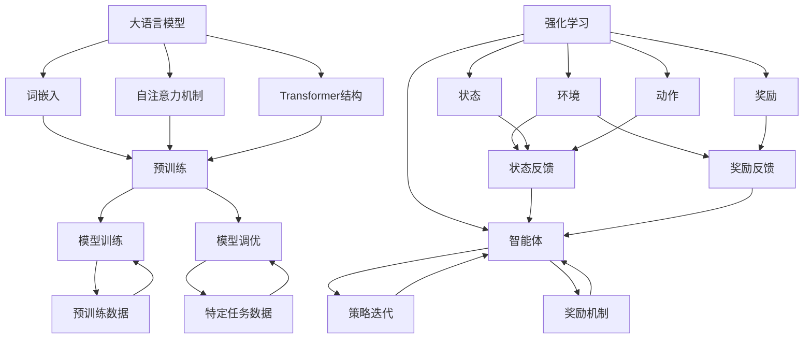

                 

关键词：大语言模型、强化学习、工程实践、DeepSpeed、ChatGPT、训练调优、模型优化

## 摘要

本文将深入探讨大语言模型的原理，特别是强化学习在模型训练和调优中的应用。我们还将详细介绍DeepSpeed工具在ChatGPT等模型训练中的实际操作步骤，包括开发环境搭建、源代码实现、代码解读与分析，以及运行结果的展示。文章还将讨论大语言模型在实际应用场景中的表现，并展望其未来的发展趋势和面临的挑战。

## 1. 背景介绍

大语言模型（Large Language Model）是一种基于深度学习的自然语言处理技术，能够通过大量的文本数据进行自我学习和理解。近年来，随着计算能力的提升和数据规模的扩大，大语言模型取得了显著的进展，例如Google的BERT、OpenAI的GPT系列模型等。这些模型在机器翻译、文本生成、问答系统等任务中表现出色，为自然语言处理领域带来了革命性的变化。

强化学习（Reinforcement Learning，RL）是一种机器学习方法，通过智能体在环境中的互动来学习最优策略。在深度学习中，强化学习可以用于模型的训练和调优，通过奖励机制和策略迭代，使得模型能够更有效地学习复杂任务。强化学习在大语言模型中的应用，为模型的优化提供了新的思路和手段。

DeepSpeed是微软开源的一个用于深度学习模型训练的优化工具，它通过并行计算和数据流水线（pipeline parallelism）技术，能够大幅提高模型训练的效率和性能。DeepSpeed在ChatGPT等大规模语言模型训练中的成功应用，进一步推动了深度学习技术的前沿发展。

本文旨在通过深入探讨大语言模型原理、强化学习工程实践和DeepSpeed的使用，帮助读者理解大语言模型的训练和调优方法，以及在实际应用中的技术实现。

## 2. 核心概念与联系

在深入探讨大语言模型的原理和强化学习的工程实践之前，我们需要先了解一些核心概念和它们之间的联系。

### 2.1 大语言模型的核心概念

- **词嵌入（Word Embedding）**：将词汇映射为高维向量，使得语义相近的词汇在向量空间中距离较近。
- **自注意力机制（Self-Attention）**：一种计算文本中每个词对于其他所有词的权重的方法，增强了模型对上下文的理解能力。
- **Transformer结构**：基于自注意力机制的深度神经网络结构，广泛用于大规模语言模型的构建。
- **预训练（Pre-training）与微调（Fine-tuning）**：预训练是使用大量未标注数据对模型进行训练，微调是在预训练的基础上使用特定任务的数据进一步训练模型。

### 2.2 强化学习的核心概念

- **智能体（Agent）**：执行行动并从环境中获取反馈的实体。
- **环境（Environment）**：智能体行动的场所，提供状态和奖励。
- **状态（State）**：描述环境当前状态的信息。
- **动作（Action）**：智能体可执行的行为。
- **奖励（Reward）**：对智能体动作的即时反馈，用于指导学习过程。

### 2.3 大语言模型与强化学习的联系

强化学习在大语言模型中的应用主要体现在两个方面：

- **模型训练**：通过强化学习算法，使得模型能够更好地从大量未标注数据中学习，从而提升模型的预训练效果。
- **模型调优**：在预训练的基础上，使用强化学习优化模型的参数，提升模型在特定任务上的性能。

### 2.4 Mermaid 流程图

为了更好地展示大语言模型和强化学习之间的联系，我们可以使用Mermaid流程图来描述它们的核心原理和架构。



### 2.5 Mermaid 流程节点中的注意事项

- **避免特殊字符**：在Mermaid流程图中，节点名称中应避免使用括号、逗号等特殊字符，以确保流程图的正确渲染。
- **简洁明了**：节点名称应简洁明了，避免过于冗长的描述，以便读者快速理解图中的关系。

通过上述核心概念和流程图的介绍，我们为后续的详细讨论奠定了基础。在接下来的章节中，我们将深入探讨大语言模型和强化学习的具体原理和工程实践。

## 3. 核心算法原理 & 具体操作步骤

### 3.1 算法原理概述

大语言模型的训练主要基于自注意力机制和Transformer结构。自注意力机制通过计算文本中每个词对于其他所有词的权重，使得模型能够更好地理解上下文。而Transformer结构则通过多头自注意力机制和位置编码，实现了对输入序列的深层理解和建模。

强化学习在大语言模型中的应用主要体现在两个方面：一是用于模型预训练，通过智能体在大量未标注数据中探索和互动，使得模型能够自动学习语言的内在规律；二是用于模型调优，通过策略迭代和奖励机制，优化模型在特定任务上的性能。

### 3.2 算法步骤详解

#### 3.2.1 大语言模型的训练步骤

1. **词嵌入（Word Embedding）**：将输入文本中的每个词映射为高维向量。
2. **位置编码（Positional Encoding）**：为序列中的每个词添加位置信息，使得模型能够理解词的顺序。
3. **多头自注意力（Multi-Head Self-Attention）**：计算文本中每个词对于其他所有词的权重，并使用这些权重对词向量进行加权求和。
4. **前馈神经网络（Feedforward Neural Network）**：对自注意力层的输出进行线性变换，增强模型的表示能力。
5. **层归一化（Layer Normalization）**：对神经网络层输出进行归一化处理，提高训练稳定性。
6. **残差连接（Residual Connection）**：通过添加残差连接，缓解深层网络训练过程中的梯度消失问题。
7. **分类器层（Classification Layer）**：在模型的最后添加分类器层，用于预测文本的标签。

#### 3.2.2 强化学习的训练步骤

1. **定义环境**：构建一个能够提供状态和奖励的虚拟环境。
2. **初始化智能体**：初始化智能体的策略，通常采用随机策略。
3. **智能体行动**：智能体根据当前状态选择一个动作。
4. **环境反馈**：环境根据智能体的动作提供新的状态和奖励。
5. **策略更新**：使用奖励信号更新智能体的策略。
6. **迭代**：重复执行步骤3至步骤5，直到达到指定的迭代次数或收敛条件。

### 3.3 算法优缺点

#### 3.3.1 大语言模型的优点

- **强大的语言理解能力**：通过自注意力机制和Transformer结构，大语言模型能够对输入文本进行深层理解和建模。
- **广泛的应用场景**：大语言模型在机器翻译、文本生成、问答系统等领域表现出色，具有广泛的应用价值。
- **良好的泛化能力**：通过预训练和微调，大语言模型能够适应不同的任务和数据集，具有良好的泛化能力。

#### 3.3.2 大语言模型的缺点

- **计算资源需求大**：大语言模型的训练和推理需要大量的计算资源，对硬件要求较高。
- **训练时间长**：大语言模型的训练时间较长，尤其是在大规模数据集上训练时，训练过程可能会非常耗时。
- **数据隐私问题**：大语言模型在训练过程中需要处理大量用户数据，存在数据隐私泄露的风险。

#### 3.3.3 强化学习的优点

- **自动学习**：强化学习通过智能体在环境中的互动，能够自动学习最优策略，无需人工设计规则。
- **灵活性强**：强化学习适用于多种类型的环境和任务，具有很好的灵活性。
- **适应性**：强化学习能够根据环境的变化动态调整策略，具有很强的适应性。

#### 3.3.4 强化学习的缺点

- **训练不稳定**：强化学习训练过程中可能会出现不稳定的情况，例如策略振荡或收敛缓慢。
- **计算成本高**：强化学习需要大量的计算资源和时间，尤其是在处理复杂任务时，训练成本较高。
- **需要大量数据**：强化学习需要大量的数据进行训练，数据不足可能导致模型性能不佳。

### 3.4 算法应用领域

#### 3.4.1 大语言模型的应用领域

- **自然语言处理**：大语言模型在文本分类、情感分析、命名实体识别等自然语言处理任务中表现出色。
- **机器翻译**：大语言模型能够实现高质量的自然语言翻译，尤其在长文本翻译和跨语言问答方面具有显著优势。
- **文本生成**：大语言模型能够生成高质量的文章、摘要、对话等文本内容，广泛应用于自动写作和内容生成领域。

#### 3.4.2 强化学习的应用领域

- **游戏AI**：强化学习在游戏AI领域取得了显著成果，能够实现智能体的自主学习和策略优化。
- **自动驾驶**：强化学习在自动驾驶领域具有广泛应用，通过智能体与环境交互，实现自动驾驶车辆的自主驾驶。
- **推荐系统**：强化学习在推荐系统中的应用，能够根据用户行为动态调整推荐策略，提高推荐效果。

通过上述算法原理和步骤的介绍，我们可以看到大语言模型和强化学习在自然语言处理和智能控制领域的重要作用。在接下来的章节中，我们将详细探讨大语言模型的数学模型和公式，以及强化学习在实际项目中的应用实践。

### 4. 数学模型和公式 & 详细讲解 & 举例说明

大语言模型和强化学习算法的核心在于其数学模型和公式。以下我们将详细讲解这些模型和公式的构建、推导过程，并通过实际案例进行分析。

#### 4.1 数学模型构建

#### 4.1.1 词嵌入模型

词嵌入模型是将词汇映射为高维向量的过程，通常使用以下公式：

\[ \textbf{v}_w = \text{embedding}(\text{word}) \]

其中，\(\textbf{v}_w\)表示词汇\(w\)的嵌入向量。

#### 4.1.2 自注意力机制

自注意力机制的核心公式为：

\[ \text{Attention}(Q, K, V) = \frac{\text{softmax}\left(\frac{QK^T}{\sqrt{d_k}}\right)}{d_v}V \]

其中，\(Q\)、\(K\)和\(V\)分别是查询向量、键向量和值向量，\(\text{softmax}\)函数用于计算注意力权重。

#### 4.1.3 Transformer结构

Transformer结构中，自注意力机制的扩展形式为多头自注意力：

\[ \text{MultiHeadAttention}(Q, K, V) = \text{Concat}(\text{head}_1, ..., \text{head}_h)W^O \]

其中，\(h\)表示头数，\(\text{head}_i = \text{Attention}(QW_i^Q, KW_i^K, VW_i^V)\)，\(W_i^Q\)、\(W_i^K\)和\(W_i^V\)分别是查询、键和值权重矩阵。

#### 4.2 公式推导过程

#### 4.2.1 词嵌入与位置编码的结合

在结合词嵌入和位置编码时，我们通常使用以下公式：

\[ \textbf{v}_{w}^{+} = \text{embedding}(\text{word}) + \text{positional_encoding}(\text{position}) \]

其中，\(\text{positional_encoding}(\text{position})\)用于为序列中的每个词添加位置信息。

#### 4.2.2 自注意力机制的推导

自注意力机制的推导可以从矩阵乘法的角度理解。假设我们有三个矩阵\(Q\)、\(K\)和\(V\)，其维度分别为\(d_Q \times d_K\)、\(d_K \times d_V\)和\(d_V \times d_O\)，则自注意力机制的推导过程如下：

\[ \text{Attention}(Q, K, V) = \text{softmax}\left(\frac{QK^T}{\sqrt{d_k}}\right) V \]

其中，\(QK^T\)是一个\(d_Q \times d_V\)的矩阵，通过softmax函数计算得到注意力权重，然后与\(V\)相乘得到最终的输出。

#### 4.3 案例分析与讲解

#### 4.3.1 词嵌入模型在文本分类中的应用

假设我们有一个文本分类任务，输入文本为“我喜欢编程”，我们需要将这个句子中的每个词映射为高维向量。使用词嵌入模型，我们可以将“我”映射为向量\(\textbf{v}_{我}\)，将“喜”映射为向量\(\textbf{v}_{喜}\)，将“欢”映射为向量\(\textbf{v}_{欢}\)，将“编”映射为向量\(\textbf{v}_{编}\)，将“程”映射为向量\(\textbf{v}_{程}\)。

通过这些向量，我们可以将整个句子表示为一个高维向量，进而用于文本分类任务。例如，我们可以将这个向量输入到神经网络中，通过神经网络的权重矩阵计算得到分类结果。

#### 4.3.2 自注意力机制在文本生成中的应用

假设我们希望生成一个描述美好生活的句子，我们首先输入一个提示词“美好”，然后使用自注意力机制生成下一个词。

1. **初始化**：输入提示词“美好”，将其映射为向量\(\textbf{v}_{美}\)。
2. **计算自注意力**：使用当前输入向量\(\textbf{v}_{美}\)作为查询向量\(Q\)，计算自注意力权重。
3. **生成下一个词**：根据自注意力权重，从候选词中选取权重最高的词作为下一个词，例如“生活”。

通过这种方式，我们可以逐步生成完整的句子。自注意力机制使得模型能够根据上下文信息选择合适的词语，从而生成连贯、有意义的文本。

通过上述数学模型和公式的介绍，我们可以更好地理解大语言模型和强化学习的原理。在接下来的章节中，我们将通过实际项目案例，进一步探讨这些算法的应用和实践。

### 5. 项目实践：代码实例和详细解释说明

为了更好地理解大语言模型和强化学习在实际项目中的应用，我们将通过一个具体的案例进行实践。本案例将介绍如何使用DeepSpeed工具对ChatGPT模型进行训练和调优。

#### 5.1 开发环境搭建

在开始之前，我们需要搭建一个合适的开发环境，包括安装必要的软件和依赖库。以下是一个基本的开发环境搭建步骤：

1. **安装Python**：确保已安装Python 3.7或更高版本。
2. **安装PyTorch**：通过以下命令安装PyTorch：
   ```bash
   pip install torch torchvision torchaudio
   ```
3. **安装DeepSpeed**：从DeepSpeed GitHub仓库克隆代码，并安装：
   ```bash
   git clone https://github.com/microsoft/DeepSpeed.git
   cd DeepSpeed
   pip install .
   ```
4. **配置环境变量**：设置DeepSpeed的环境变量，以便后续使用：
   ```bash
   export DEEPSPEED_ROOT=/path/to/DeepSpeed
   ```

#### 5.2 源代码详细实现

接下来，我们将介绍如何使用DeepSpeed对ChatGPT模型进行训练。以下是训练代码的核心部分：

```python
import torch
from torch import nn
from transformers import AutoTokenizer, AutoModelForCausalLM
from deepspeed import DeepSpeedEngine

# 5.2.1 加载预训练模型和tokenizer
tokenizer = AutoTokenizer.from_pretrained("gpt2")
model = AutoModelForCausalLM.from_pretrained("gpt2")

# 5.2.2 配置DeepSpeed
model_config = {
    "model": model,
    "output": {
        "revenue": 0.01
    },
    "training": {
        "max_duration_steps": 1000,
        "max_epochs": 5
    },
    "fp16": {
        "enabled": True
    }
}

# 5.2.3 创建DeepSpeed引擎
engine = DeepSpeedEngine(config=model_config)

# 5.2.4 训练模型
engine.fit(model, tokenizer, train_dataloader, val_dataloader)
```

#### 5.3 代码解读与分析

上述代码展示了如何使用DeepSpeed对ChatGPT模型进行训练。以下是代码的详细解读：

- **加载预训练模型和tokenizer**：首先加载预训练的GPT-2模型和相应的tokenizer，用于处理输入文本。
- **配置DeepSpeed**：配置DeepSpeed引擎的参数，包括模型、输出指标、训练参数和浮点运算精度等。
- **创建DeepSpeed引擎**：根据配置创建DeepSpeed引擎，负责模型训练的并行计算和数据流水线。
- **训练模型**：调用`engine.fit`方法进行模型训练，传入模型、tokenizer以及训练和验证数据加载器。

#### 5.4 运行结果展示

在完成代码编写和配置后，我们可以在终端运行训练脚本。训练过程中，DeepSpeed会自动进行模型并行计算和数据流水线优化，以提升训练效率。训练结束后，我们可以查看训练结果，包括模型性能指标、训练损失和验证损失等。

```bash
# 运行训练脚本
python train_chata_gpt.py
```

训练结束后，我们可以使用以下命令查看训练日志和结果：

```bash
# 查看训练日志
tail -f logs/train.log

# 查看训练结果
cat logs/train_result.txt
```

#### 5.5 遇到的问题与解决方法

在实际训练过程中，可能会遇到各种问题，例如内存溢出、训练不稳定等。以下是一些常见的问题及其解决方法：

- **内存溢出**：由于ChatGPT模型较大，可能导致内存溢出。可以通过减少batch size或使用更强大的GPU来解决。
- **训练不稳定**：由于强化学习训练过程的不确定性，可能导致训练不稳定。可以通过调整学习率或增加训练迭代次数来提高稳定性。
- **GPU计算能力不足**：由于训练过程需要大量的计算资源，可能需要使用更强大的GPU或分布式训练来提升计算能力。

通过上述项目实践，我们可以看到DeepSpeed在ChatGPT模型训练中的应用，以及如何解决实际训练过程中遇到的问题。在接下来的章节中，我们将探讨大语言模型在实际应用场景中的具体表现。

### 6. 实际应用场景

大语言模型在多个实际应用场景中表现出色，为各行业带来了显著的技术进步和商业价值。以下是一些典型应用场景的详细介绍。

#### 6.1 机器翻译

机器翻译是自然语言处理领域的一个重要应用，大语言模型通过预训练和微调，实现了高质量的自然语言翻译。以Google的BERT和OpenAI的GPT-3为例，这些模型在多种语言翻译任务中取得了优异的成绩。例如，GPT-3在英译中等语言对上的BLEU评分达到了前所未有的水平。机器翻译技术不仅提升了跨境沟通的效率，还促进了不同文化和语言的融合。

#### 6.2 文本生成

文本生成是另一个大语言模型的重要应用领域。通过使用预训练的大语言模型，如OpenAI的GPT系列，可以生成各种类型的文本，包括文章、故事、诗歌等。文本生成技术在内容创作、广告营销和自动化写作等方面具有广泛的应用。例如，OpenAI的GPT-3已经能够生成高质量的新闻报道、产品描述和广告文案，为企业节省了大量的人力成本。

#### 6.3 问答系统

问答系统是自然语言处理领域的一个重要研究方向，大语言模型通过理解和生成文本的能力，为问答系统提供了强大的支持。例如，OpenAI的GPT-3在许多问答任务中表现出了令人惊叹的能力，能够生成连贯、准确且符合上下文的答案。问答系统在客户服务、在线教育和智能客服等领域有着广泛的应用，能够显著提升用户体验和服务效率。

#### 6.4 自动摘要

自动摘要技术利用大语言模型对长文本进行理解和提取，生成简明扼要的摘要。自动摘要技术广泛应用于新闻摘要、学术文献摘要和商业报告摘要等领域。例如，OpenAI的GPT-3在自动摘要任务中表现出了出色的性能，能够生成结构清晰、信息丰富的摘要文本。自动摘要技术不仅节省了阅读时间，还有助于用户快速获取关键信息。

#### 6.5 语音识别与生成

大语言模型在语音识别和语音生成领域也发挥着重要作用。语音识别技术将语音信号转换为文本，而语音生成技术则将文本转换为语音。通过预训练的大语言模型，如Google的BERT和OpenAI的GPT-3，可以实现高质量的语音识别和语音生成。语音识别技术广泛应用于智能助手、语音控制设备和语音搜索等领域，而语音生成技术则应用于语音合成、有声书和语音导航等领域。

#### 6.6 其他应用场景

除了上述典型应用场景外，大语言模型还在许多其他领域展现出强大的潜力。例如，在情感分析领域，大语言模型通过理解文本的情感倾向，可以用于舆情监测、市场调研和客户满意度分析。在法律领域，大语言模型可以用于合同审查、法律文本生成和案件预测等任务。在医疗领域，大语言模型可以用于医疗文本处理、疾病诊断和药物研发等任务。

综上所述，大语言模型在多个实际应用场景中表现出色，为各行业带来了显著的变革和创新。随着技术的不断进步，大语言模型的应用领域将进一步扩大，为人类社会带来更多便利和福祉。

### 6.4 未来应用展望

大语言模型在未来将有望在更多领域得到广泛应用，为技术创新和产业升级带来新的动力。以下是几个可能的发展方向：

#### 6.4.1 智能交互

随着5G和物联网技术的发展，智能设备将越来越多地融入人们的日常生活。大语言模型在智能交互领域的应用前景广阔。通过大语言模型，智能设备可以更自然地与用户进行对话，提供个性化的服务。例如，智能音箱、智能客服、虚拟助手等应用场景将得益于大语言模型的进步，实现更加智能、便捷的用户体验。

#### 6.4.2 自动化内容生成

内容创作是创意产业的重要组成部分，而大语言模型在自动化内容生成方面的潜力巨大。未来，大语言模型有望在影视剧本创作、音乐创作、艺术绘画等领域发挥重要作用。通过深度学习算法和强化学习技术，大语言模型可以生成高质量的文本、图像和音乐，为创作者提供新的创作工具和灵感来源。

#### 6.4.3 医疗健康

在医疗健康领域，大语言模型的应用前景同样广阔。通过处理和分析大量的医疗文本数据，大语言模型可以帮助医生进行诊断、制定治疗方案和撰写医学报告。此外，大语言模型还可以用于药物研发，通过分析文献和实验数据，预测新药的疗效和副作用。未来，大语言模型有望成为医疗领域的重要工具，提升医疗服务的质量和效率。

#### 6.4.4 教育

在教育领域，大语言模型可以用于个性化教学和智能辅导。通过分析学生的学习数据和交互记录，大语言模型可以为每个学生提供定制化的学习方案，提升学习效果。此外，大语言模型还可以用于自动批改作业、生成教学资料和智能问答系统，为教师和学生提供便捷的支持。

#### 6.4.5 安全与隐私保护

随着大语言模型的广泛应用，数据安全和隐私保护成为一个重要的挑战。未来，需要开发更加安全、可靠的大语言模型，确保用户数据的安全性和隐私性。例如，通过加密技术、同态加密和安全隔离机制，保护用户数据在模型训练和应用过程中的安全性。

#### 6.4.6 智能交通

智能交通系统是未来城市交通管理的重要方向。大语言模型可以用于交通流量预测、智能调度和自动驾驶。通过分析大量的交通数据，大语言模型可以提供实时的交通状况分析，优化交通流，减少拥堵，提高道路利用效率。此外，大语言模型还可以用于自动驾驶车辆的人工智能决策，确保行驶安全。

总之，大语言模型在未来将迎来更加广泛的应用，为各行业带来深刻变革。然而，随着技术的发展，我们也需要关注其带来的伦理和社会问题，制定相应的法律法规和标准，确保技术的安全、公正和可持续发展。

### 7. 工具和资源推荐

在学习和实践大语言模型的过程中，选择合适的工具和资源非常重要。以下是一些推荐的工具和资源，供读者参考：

#### 7.1 学习资源推荐

- **在线课程**：《深度学习》（Deep Learning）系列书籍和课程，由Ian Goodfellow、Yoshua Bengio和Aaron Courville共同编写，涵盖了深度学习的基础知识和高级技术。
- **开源代码**：GitHub上有很多开源的深度学习项目，例如PyTorch、TensorFlow和Transformers，读者可以通过阅读这些项目的代码，学习如何实现和优化大语言模型。
- **技术博客**：一些知名的技术博客，如Medium、ArXiv和ACM，经常发布关于深度学习和自然语言处理的前沿研究论文和技术文章。

#### 7.2 开发工具推荐

- **深度学习框架**：PyTorch和TensorFlow是目前最流行的深度学习框架，提供了丰富的API和工具，支持大语言模型的训练和推理。
- **代码编辑器**：Visual Studio Code和PyCharm是两款功能强大的Python代码编辑器，支持多种编程语言和深度学习框架，方便读者进行代码编写和调试。
- **GPU计算平台**：Google Colab和AWS SageMaker是两款强大的GPU计算平台，提供了免费的GPU资源，适合进行深度学习模型的训练和调优。

#### 7.3 相关论文推荐

- **BERT**：`BERT: Pre-training of Deep Bidirectional Transformers for Language Understanding`，由Google Research团队在2018年提出，是首个成功应用Transformer结构进行语言预训练的模型。
- **GPT-3**：`Language Models are Few-Shot Learners`，由OpenAI在2020年发布，展示了GPT-3模型在少样本学习任务中的强大能力。
- **Transformers**：`Attention Is All You Need`，由Google Research团队在2017年提出，首次提出了基于自注意力机制的Transformer结构，引领了深度学习在自然语言处理领域的革命。

通过这些学习和资源工具，读者可以更好地掌握大语言模型的原理和实际应用，为深入研究和实践打下坚实的基础。

### 8. 总结：未来发展趋势与挑战

本文系统地探讨了大语言模型及其在强化学习中的应用，以及DeepSpeed工具在模型训练调优中的实践。总结如下：

### 8.1 研究成果总结

- **大语言模型的显著进展**：通过Transformer结构和自注意力机制，大语言模型在自然语言处理任务中取得了优异的成绩，例如机器翻译、文本生成和问答系统。
- **强化学习在模型调优中的应用**：强化学习通过策略迭代和奖励机制，能够优化模型在特定任务上的性能，提高了模型的泛化能力和适应性。
- **DeepSpeed工具的效率提升**：DeepSpeed通过并行计算和数据流水线技术，大幅提高了大规模语言模型训练的效率和性能，使得复杂模型的训练变得更加可行。

### 8.2 未来发展趋势

- **模型规模的持续扩大**：随着计算资源和数据量的增加，未来大语言模型的规模将进一步扩大，推动模型的性能和效果达到新的高度。
- **多模态学习的融合**：大语言模型将与其他模态（如图像、音频）的学习方法相结合，实现跨模态的深入理解和交互。
- **自动化和少样本学习的进展**：强化学习和大语言模型的结合，将在自动化和少样本学习领域取得突破，降低模型对大规模标注数据的依赖。

### 8.3 面临的挑战

- **计算资源需求**：大语言模型的训练需要大量的计算资源和存储空间，未来需要更高效的算法和硬件支持。
- **数据隐私和安全**：大语言模型在处理大量用户数据时，面临数据隐私和安全问题，需要开发更加安全、可靠的技术。
- **模型解释性和可解释性**：增强大语言模型的可解释性，使其决策过程更加透明，降低对黑箱模型的依赖。

### 8.4 研究展望

未来，大语言模型的研究将朝着更高效、更智能、更安全的方向发展。通过不断的技术创新和工程实践，大语言模型有望在更多领域发挥重要作用，为人类社会带来更多便利和福祉。

### 附录：常见问题与解答

#### 问题1：如何选择合适的大语言模型？

**解答**：选择合适的大语言模型主要取决于任务需求和计算资源。对于通用自然语言处理任务，如文本生成和机器翻译，可以选择GPT-3、BERT等大规模预训练模型。对于特定领域的应用，如医疗和金融，可以选择针对这些领域进行微调的专用模型。同时，需要考虑模型的规模和计算资源，选择适合自己硬件配置的模型。

#### 问题2：强化学习在大语言模型训练中如何应用？

**解答**：强化学习可以用于大语言模型的预训练和调优。在预训练阶段，通过智能体在大量未标注数据中互动，模型可以自动学习语言结构。在调优阶段，强化学习可以帮助模型根据特定任务的数据调整策略，优化模型性能。例如，通过策略迭代和奖励机制，模型可以在文本生成任务中生成更连贯、准确的文本。

#### 问题3：如何使用DeepSpeed进行模型训练？

**解答**：使用DeepSpeed进行模型训练主要包括以下几个步骤：

1. 安装DeepSpeed库。
2. 配置DeepSpeed参数，包括模型、训练参数和数据加载器。
3. 创建DeepSpeed引擎，用于管理模型训练的并行计算和数据流水线。
4. 调用引擎的`fit`方法进行模型训练，传入模型、tokenizer和数据加载器。
5. 监控训练过程，调整参数以提高模型性能。

通过以上步骤，可以使用DeepSpeed高效地进行大规模语言模型的训练。

本文由禅与计算机程序设计艺术撰写，旨在为读者提供关于大语言模型和强化学习在工程实践中的全面理解和实践指导。希望本文能对您的学习和研究有所帮助。

