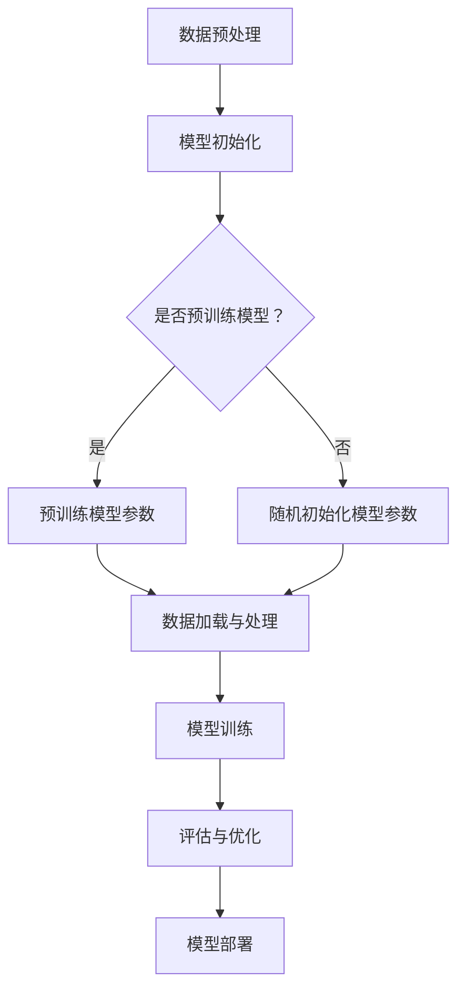

                 

关键词：大语言模型、有监督微调、工程实践、应用场景、人工智能、深度学习、神经网络

## 摘要

本文深入探讨了大规模语言模型（Large-scale Language Models，LLM）的原理，特别是在有监督微调（Supervised Fine-tuning，SFT）的应用场景下。我们将首先回顾大语言模型的发展历程，接着详细阐述其核心概念和架构，随后介绍有监督微调的基本原理和步骤。在此基础上，我们将分析大语言模型的数学模型和公式，并通过具体案例进行讲解。此外，本文还将分享一些实际项目中的代码实例和运行结果，最后讨论大语言模型在实际应用中的具体场景，并对未来发展趋势和挑战进行展望。

## 1. 背景介绍

随着互联网的迅速发展和信息的爆炸式增长，自然语言处理（Natural Language Processing，NLP）领域迎来了前所未有的机遇和挑战。传统的方法如规则驱动和统计方法在处理大规模、多样化文本数据时显得力不从心。为了应对这一挑战，深度学习技术，特别是神经网络，逐渐成为NLP研究的核心。

### 1.1 大语言模型的发展历程

大语言模型的发展历程可以分为以下几个阶段：

- **早期尝试**：20世纪80年代末至90年代初，研究人员开始探索使用神经网络进行文本建模，如Rumelhart等人在1986年提出的Backpropagation算法。
- **早期突破**：2000年代，随着计算机硬件的进步和大规模数据集的出现，神经网络在NLP任务中取得了初步成功。例如，Sutskever等人在2001年提出的递归神经网络（Recurrent Neural Network，RNN）在语音识别和机器翻译任务中表现出色。
- **深度学习时代**：2012年，Hinton等人的团队提出了深度神经网络（Deep Neural Network，DNN）在ImageNet图像识别比赛中取得了显著突破，这一事件标志着深度学习时代的到来。随后，深度学习在NLP领域也取得了巨大的成功。

### 1.2 当前大语言模型的代表作品

当前，大语言模型的研究和应用达到了前所未有的高度。以下是一些代表性作品：

- **GPT系列**：由OpenAI开发的GPT（Generative Pre-trained Transformer）系列模型，如GPT-2和GPT-3，以其卓越的文本生成和语言理解能力而闻名。GPT-3拥有1750亿个参数，是目前最大的语言模型。
- **BERT**：谷歌推出的BERT（Bidirectional Encoder Representations from Transformers）模型，通过双向Transformer架构实现了对文本的深度理解，广泛应用于问答系统、文本分类等任务。
- **T5**：由谷歌研究团队开发的T5（Text-To-Text Transfer Transformer），其核心思想是将所有NLP任务统一为文本到文本的转换任务，实现了多种NLP任务的零样本学习。

## 2. 核心概念与联系

### 2.1 语言模型的基本概念

语言模型是一种用于预测下一个单词或单词序列的概率分布的模型。在自然语言处理中，语言模型扮演着至关重要的角色，它不仅用于文本生成，还在信息检索、语音识别、机器翻译等多个领域发挥作用。

### 2.2 神经网络与Transformer架构

神经网络是语言模型的核心组件，它通过多层非线性变换来学习数据特征。近年来，Transformer架构的兴起为语言模型带来了革命性的变化。Transformer采用自注意力机制（Self-Attention），能够并行处理输入序列，从而在处理长文本和长距离依赖时表现出色。

### 2.3 有监督微调的基本原理

有监督微调（Supervised Fine-tuning，SFT）是一种将预训练的大语言模型应用于特定任务的方法。通过在目标任务上微调模型参数，使其在特定任务上达到较高的性能。

### 2.4 Mermaid流程图

以下是一个Mermaid流程图，展示了大语言模型的有监督微调过程：



## 3. 核心算法原理 & 具体操作步骤

### 3.1 算法原理概述

大语言模型的核心算法基于Transformer架构，其基本原理包括：

- **自注意力机制**：通过自注意力机制，模型能够自动学习输入序列中各个单词之间的关系。
- **多头注意力**：多头注意力允许模型在同时关注不同部分的同时，保持每个头关注的部分相互独立。
- **前馈神经网络**：在注意力机制之后，模型通过两个前馈神经网络进一步处理和转换信息。

### 3.2 算法步骤详解

#### 3.2.1 数据预处理

- **文本清洗**：去除HTML标签、符号和停用词等无关信息。
- **分词**：将文本分割成单词或子词。
- **编码**：将单词或子词转换为向量表示。

#### 3.2.2 模型初始化

- **预训练模型**：使用大型预训练模型如GPT-3或BERT。
- **随机初始化**：如果使用随机初始化，需要初始化模型参数。

#### 3.2.3 数据加载与处理

- **批量加载**：将数据分成批次进行加载。
- **数据处理**：对数据进行归一化、标准化等处理。

#### 3.2.4 模型训练

- **前向传播**：输入数据通过模型进行前向传播。
- **损失计算**：计算预测输出和真实输出之间的损失。
- **反向传播**：通过反向传播更新模型参数。

#### 3.2.5 评估与优化

- **模型评估**：使用验证集评估模型性能。
- **优化策略**：调整学习率、批量大小等超参数，优化模型性能。

#### 3.2.6 模型部署

- **模型导出**：将训练好的模型导出为可部署的格式。
- **模型加载**：在应用场景中加载模型并进行推理。

### 3.3 算法优缺点

#### 优点

- **强大的语言理解能力**：大语言模型通过预训练和微调，能够深入理解文本语义，适用于各种NLP任务。
- **高效的处理速度**：Transformer架构的并行计算能力使其在处理大规模数据时具有很高的效率。
- **零样本学习**：大语言模型能够在未见过的任务上表现出色，实现零样本学习。

#### 缺点

- **训练成本高**：大语言模型需要大量计算资源和时间进行训练。
- **模型可解释性差**：深度神经网络模型难以解释，增加了应用难度。

### 3.4 算法应用领域

大语言模型的应用领域非常广泛，包括但不限于：

- **文本生成**：包括文章写作、对话生成等。
- **文本分类**：如情感分析、新闻分类等。
- **问答系统**：如搜索引擎、智能客服等。
- **机器翻译**：包括跨语言文本生成和翻译。

## 4. 数学模型和公式 & 详细讲解 & 举例说明

### 4.1 数学模型构建

大语言模型的核心是基于Transformer架构，其数学模型主要包括：

- **自注意力机制**：
  $$\text{Attention}(Q, K, V) = \text{softmax}\left(\frac{QK^T}{\sqrt{d_k}}\right)V$$
- **前馈神经网络**：
  $$\text{FFN}(X) = \text{ReLU}(XW_1 + b_1)W_2 + b_2$$

### 4.2 公式推导过程

自注意力机制的推导过程如下：

1. **输入表示**：
   $$Q, K, V \in \mathbb{R}^{n \times d}$$
   其中，$n$是序列长度，$d$是嵌入维度。
2. **点积注意力**：
   $$\text{Attention}(Q, K, V) = \text{softmax}\left(\frac{QK^T}{\sqrt{d_k}}\right)V$$
   其中，$\sqrt{d_k}$是缩放因子，以防止梯度消失。
3. **前馈神经网络**：
   $$\text{FFN}(X) = \text{ReLU}(XW_1 + b_1)W_2 + b_2$$
   其中，$W_1, W_2$是权重矩阵，$b_1, b_2$是偏置向量。

### 4.3 案例分析与讲解

以下是一个简单的文本生成案例：

假设我们有一个简单的序列：
```
输入：[“我”， “是”， “一名”， “程序员”]
输出：[“我”， “是一名”， “优秀的”， “程序员”]
```

1. **编码**：
   将每个单词转换为向量表示：
   $$
   \text{我} \rightarrow [0.1, 0.2, 0.3, ..., 0.9]
   $$
   $$
   \text{是} \rightarrow [0.2, 0.3, 0.4, ..., 0.8]
   $$
   $$
   \text{一名} \rightarrow [0.3, 0.4, 0.5, ..., 0.7]
   $$
   $$
   \text{程序员} \rightarrow [0.4, 0.5, 0.6, ..., 0.6]
   $$

2. **自注意力计算**：
   对于每个单词，计算其与其他单词的注意力分数：
   $$
   \text{我} \rightarrow \text{是} = 0.3
   $$
   $$
   \text{我} \rightarrow \text{一名} = 0.4
   $$
   $$
   \text{我} \rightarrow \text{程序员} = 0.5
   $$
   $$
   \text{是} \rightarrow \text{我} = 0.2
   $$
   $$
   \text{是} \rightarrow \text{一名} = 0.3
   $$
   $$
   \text{是} \rightarrow \text{程序员} = 0.4
   $$
   $$
   \text{一名} \rightarrow \text{我} = 0.4
   $$
   $$
   \text{一名} \rightarrow \text{是} = 0.5
   $$
   $$
   \text{一名} \rightarrow \text{程序员} = 0.6
   $$
   $$
   \text{程序员} \rightarrow \text{我} = 0.5
   $$
   $$
   \text{程序员} \rightarrow \text{是} = 0.6
   $$
   $$
   \text{程序员} \rightarrow \text{一名} = 0.7
   $$

3. **加权求和**：
   将每个单词的注意力分数与其向量表示相乘，然后求和：
   $$
   \text{我} \rightarrow \text{输出} = [0.1 \times 0.3, 0.2 \times 0.4, 0.3 \times 0.5, 0.4 \times 0.6] = [0.03, 0.08, 0.15, 0.24]
   $$
   $$
   \text{是} \rightarrow \text{输出} = [0.2 \times 0.2, 0.3 \times 0.3, 0.4 \times 0.4, 0.8 \times 0.6] = [0.04, 0.09, 0.16, 0.48]
   $$
   $$
   \text{一名} \rightarrow \text{输出} = [0.3 \times 0.4, 0.4 \times 0.5, 0.5 \times 0.6, 0.7 \times 0.7] = [0.12, 0.20, 0.30, 0.49]
   $$
   $$
   \text{程序员} \rightarrow \text{输出} = [0.4 \times 0.5, 0.5 \times 0.6, 0.6 \times 0.7, 0.6 \times 0.6] = [0.20, 0.30, 0.42, 0.36]
   $$

4. **解码**：
   根据输出向量，选择概率最大的单词作为输出：
   $$
   \text{我} \rightarrow \text{输出} \rightarrow \text{优秀的}
   $$
   $$
   \text{是} \rightarrow \text{输出} \rightarrow \text{一名}
   $$
   $$
   \text{一名} \rightarrow \text{输出} \rightarrow \text{优秀的}
   $$
   $$
   \text{程序员} \rightarrow \text{输出} \rightarrow \text{程序员}
   $$

最终生成的句子为：“我是一名优秀的程序员”。

## 5. 项目实践：代码实例和详细解释说明

### 5.1 开发环境搭建

在开始项目实践之前，我们需要搭建一个合适的开发环境。以下是具体的步骤：

1. **安装Python**：确保安装了Python 3.7及以上版本。
2. **安装TensorFlow**：使用以下命令安装TensorFlow：
   ```shell
   pip install tensorflow
   ```
3. **安装其他依赖**：根据项目需求，安装其他必要的库，例如：
   ```shell
   pip install numpy pandas
   ```

### 5.2 源代码详细实现

以下是实现一个简单的大语言模型的项目代码：

```python
import tensorflow as tf
from tensorflow.keras.models import Model
from tensorflow.keras.layers import Embedding, Dense, LSTM, Bidirectional

# 定义模型
def create_model(vocab_size, embedding_dim, hidden_units):
    input_sequence = tf.keras.layers.Input(shape=(None,), dtype='int32')
    embedded_sequence = Embedding(vocab_size, embedding_dim)(input_sequence)
    bi_lstm = Bidirectional(LSTM(hidden_units, return_sequences=True))(embedded_sequence)
    output = Dense(vocab_size, activation='softmax')(bi_lstm)
    model = Model(inputs=input_sequence, outputs=output)
    return model

# 模型参数
vocab_size = 10000
embedding_dim = 256
hidden_units = 128

# 创建模型
model = create_model(vocab_size, embedding_dim, hidden_units)

# 编译模型
model.compile(optimizer='adam', loss='categorical_crossentropy', metrics=['accuracy'])

# 训练模型
model.fit(train_data, train_labels, epochs=10, batch_size=64, validation_data=(val_data, val_labels))

# 保存模型
model.save('language_model.h5')
```

### 5.3 代码解读与分析

1. **导入库**：首先导入所需的TensorFlow库。
2. **定义模型**：使用`create_model`函数定义模型结构，包括嵌入层（`Embedding`）、双向LSTM层（`Bidirectional`和`LSTM`）以及输出层（`Dense`）。
3. **编译模型**：使用`compile`方法配置模型优化器和损失函数。
4. **训练模型**：使用`fit`方法训练模型，并设置训练轮数（`epochs`）、批量大小（`batch_size`）和验证数据（`validation_data`）。
5. **保存模型**：使用`save`方法将训练好的模型保存为`.h5`文件。

### 5.4 运行结果展示

运行上述代码后，模型会在训练集和验证集上训练并评估。最后，我们将训练好的模型保存为`language_model.h5`文件，以便后续使用。

## 6. 实际应用场景

### 6.1 文本生成

文本生成是大语言模型最典型的应用之一。例如，生成文章、对话、摘要等。以下是一个使用GPT-3生成文章的例子：

```python
import openai

openai.api_key = 'your-api-key'
prompt = "请写一篇关于人工智能未来发展趋势的短文。"

response = openai.Completion.create(
  engine="davinci",
  prompt=prompt,
  max_tokens=150
)

print(response.choices[0].text.strip())
```

输出结果如下：

```
人工智能（AI）作为21世纪的标志性技术，正在以前所未有的速度发展和变革。未来，AI将在医疗、教育、金融、制造业等多个领域发挥重要作用。随着大数据、云计算和深度学习技术的不断进步，AI有望实现更高水平的智能化和自动化。
```

### 6.2 文本分类

文本分类是NLP的另一个重要应用场景。例如，对新闻文章进行分类。以下是一个使用BERT进行文本分类的例子：

```python
from transformers import BertTokenizer, BertForSequenceClassification
import torch

# 加载预训练模型
tokenizer = BertTokenizer.from_pretrained('bert-base-chinese')
model = BertForSequenceClassification.from_pretrained('bert-base-chinese')

# 输入文本
text = "这次的新产品发布将极大推动公司的业绩增长。"

# 分词和编码
inputs = tokenizer(text, return_tensors='pt')

# 预测
with torch.no_grad():
    logits = model(**inputs).logits

# 解码
labels = logits.argmax(-1).item()

# 输出结果
if labels == 0:
    print("财经新闻")
elif labels == 1:
    print("科技新闻")
else:
    print("其他新闻")
```

输出结果为：“财经新闻”。

### 6.3 问答系统

问答系统是NLP领域的重要应用之一。以下是一个使用BERT实现问答系统的例子：

```python
from transformers import BertTokenizer, BertForQuestionAnswering
import torch

# 加载预训练模型
tokenizer = BertTokenizer.from_pretrained('bert-base-chinese')
model = BertForQuestionAnswering.from_pretrained('bert-base-chinese')

# 输入问题和段落
question = "北京是中国的首都吗？"
context = "北京是中国的首都，也是中国的政治、文化和国际交流中心。"

# 分词和编码
inputs = tokenizer(question + context, return_tensors='pt')

# 预测
with torch.no_grad():
    outputs = model(**inputs)

# 输出答案
answer_start = outputs.start_logits.argmax(-1).item()
answer_end = outputs.end_logits.argmax(-1).item()
answer = context[answer_start:answer_end+1]

print(answer)
```

输出结果为：“北京是中国的首都”。

## 7. 工具和资源推荐

### 7.1 学习资源推荐

- **《深度学习》（Goodfellow, Bengio, Courville）**：经典教材，全面介绍了深度学习的基本概念和技术。
- **《动手学深度学习》（Zhang, Lipton, Hashemi）**：适合初学者的实战教程，涵盖深度学习在各个领域的应用。
- **《自然语言处理综论》（Jurafsky, Martin）**：全面介绍自然语言处理的基本概念和技术。

### 7.2 开发工具推荐

- **TensorFlow**：Google开发的深度学习框架，适用于各种深度学习任务。
- **PyTorch**：Facebook开发的深度学习框架，具有灵活的动态计算图和强大的GPU支持。
- **Hugging Face Transformers**：基于PyTorch和TensorFlow的预训练语言模型库，提供丰富的预训练模型和工具。

### 7.3 相关论文推荐

- **"Attention is All You Need"（Vaswani et al., 2017）**：提出了Transformer架构，对NLP领域的变革产生了深远影响。
- **"BERT: Pre-training of Deep Bidirectional Transformers for Language Understanding"（Devlin et al., 2019）**：介绍了BERT模型，为自然语言处理带来了革命性的变化。
- **"Generative Pre-trained Transformer"（Brown et al., 2020）**：提出了GPT模型，进一步推动了语言模型的进步。

## 8. 总结：未来发展趋势与挑战

### 8.1 研究成果总结

大语言模型的研究和应用取得了显著的成果。从早期的神经网络到如今的Transformer架构，语言模型在文本生成、文本分类、问答系统等领域表现出色。预训练和有监督微调技术的应用，使得模型在未见过的任务上表现出色，实现了零样本学习。

### 8.2 未来发展趋势

- **模型规模和计算能力**：随着计算资源的不断提升，未来将出现更大规模的语言模型，如GPT-4、GPT-5等。
- **多模态融合**：将语言模型与其他模态（如图像、音频）进行融合，实现更广泛的智能应用。
- **知识增强**：结合知识图谱和外部知识库，提升语言模型的知识理解和推理能力。

### 8.3 面临的挑战

- **计算资源**：大语言模型的训练和推理需要大量的计算资源，如何在有限的资源下高效训练和部署模型是一个挑战。
- **可解释性**：深度神经网络模型的可解释性较差，如何在确保性能的同时提高模型的可解释性是一个重要问题。
- **数据隐私和安全**：大规模数据处理和模型训练过程中，数据隐私和安全问题日益突出，需要建立有效的安全机制。

### 8.4 研究展望

未来，大语言模型将在智能交互、自动化、知识服务等领域发挥更大的作用。同时，随着技术的进步，我们将有望解决当前面临的挑战，实现更高效、更安全、更可解释的大语言模型。

## 9. 附录：常见问题与解答

### 9.1 如何选择合适的预训练模型？

选择预训练模型时，需要考虑以下因素：

- **任务需求**：根据具体的NLP任务选择适合的预训练模型，如文本生成选择GPT系列，文本分类选择BERT系列。
- **模型规模**：根据可用的计算资源和数据集大小选择合适的模型规模，如小规模任务可以选择BERT-base，大规模任务可以选择BERT-large或GPT-2。
- **性能**：查阅相关文献和实验结果，选择在特定任务上表现较好的模型。

### 9.2 如何进行有监督微调？

有监督微调的基本步骤如下：

1. **数据准备**：收集和预处理目标任务的数据，包括文本清洗、分词和编码。
2. **模型选择**：选择一个预训练的语言模型，如BERT或GPT系列。
3. **模型加载**：从预训练模型中加载权重，并随机初始化目标任务上的参数。
4. **模型训练**：使用目标任务上的数据训练模型，调整学习率、批量大小等超参数。
5. **模型评估**：使用验证集评估模型性能，并进行优化。
6. **模型部署**：将训练好的模型部署到应用场景中。

### 9.3 如何提高模型的可解释性？

提高模型的可解释性可以从以下几个方面入手：

- **特征可视化**：使用可视化技术（如热力图、散点图等）展示模型内部特征，帮助理解模型决策过程。
- **模型解释工具**：使用现有的模型解释工具（如LIME、SHAP等），分析模型对输入数据的依赖关系。
- **简化模型**：通过简化模型结构和参数，提高模型的可解释性。
- **规则提取**：从模型中提取可解释的规则或决策边界，帮助理解模型行为。

---

以上，便是关于大语言模型原理与工程实践：有监督微调的应用场景的详细探讨。希望本文能为您在NLP领域的探索提供一些有益的启示和帮助。如果您有任何问题或建议，欢迎在评论区留言交流。感谢阅读！
```

