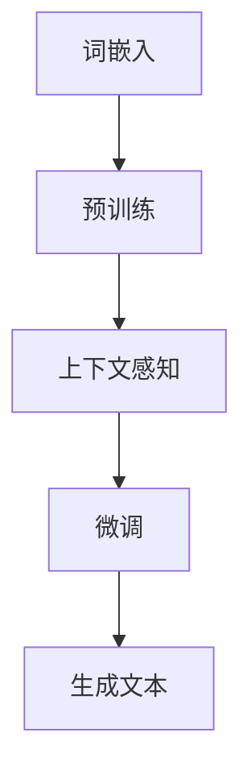

                 

关键词：大语言模型、ICL、深度学习、神经网络、自然语言处理、预训练、自监督学习

## 摘要

本文旨在深入探讨大语言模型的原理及其发展前沿，特别是自监督学习中的ICL（Instance Conditional Learning）方法。通过回顾语言模型的历史、核心概念、算法原理、数学模型，以及实际应用场景，我们将揭示ICL为何在现代自然语言处理中如此有效。本文还将探讨未来大语言模型的发展趋势与面临的挑战，为读者提供全面的视角和深入的见解。

## 1. 背景介绍

自然语言处理（Natural Language Processing, NLP）是计算机科学和人工智能领域中的一个重要分支，旨在使计算机能够理解、解释和生成人类语言。随着互联网和数字媒体的爆炸式增长，人们对NLP的需求日益增长，从基本的文本分类到复杂的对话系统，NLP在多个领域都有着广泛的应用。

### 1.1 语言模型的发展历程

语言模型的发展历程可以分为几个阶段：

- **规则方法**：早期的语言模型主要依赖于手动编写的语法规则和词典，这种方法在处理简单的任务时有效，但随着词汇量的增加和语法的复杂性，其局限性变得明显。

- **统计方法**：随着计算能力的提升和数据量的增加，统计方法开始流行。这种方法通过计算词汇和句子之间的概率关系来预测下一个词或句子，取得了显著的进展。

- **深度学习方法**：近年来，深度学习（Deep Learning）在图像识别、语音识别等领域取得了巨大的成功。受此启发，研究者们开始将深度学习应用于语言模型，特别是2013年引入的深度神经网络（Deep Neural Network, DNN）和随后的递归神经网络（Recurrent Neural Network, RNN）和Transformer架构。

### 1.2 大语言模型的核心概念

大语言模型（Large Language Model）是指具有数十亿参数规模的神经网络模型，它们能够通过大量的文本数据进行预训练，然后针对特定任务进行微调。这些模型的核心概念包括：

- **词嵌入（Word Embedding）**：将单词映射到高维向量空间，使得语义相似的单词在空间中更接近。
- **上下文感知（Contextual Awareness）**：通过深度神经网络，模型能够理解单词在不同上下文中的不同含义。
- **预训练（Pre-training）**：在特定任务之前，使用大规模的未标注数据进行训练，以提高模型对自然语言的理解能力。
- **微调（Fine-tuning）**：在预训练的基础上，针对特定任务进行额外的训练，以适应具体的应用场景。

## 2. 核心概念与联系

为了深入理解大语言模型，我们需要了解其核心概念和架构。以下是核心概念和架构的Mermaid流程图：



### 2.1 词嵌入

词嵌入是将单词映射到高维向量空间的过程。通过这种方式，模型可以理解单词之间的关系。词嵌入通常使用神经网络进行训练，例如Word2Vec、GloVe等方法。

### 2.2 预训练

预训练是使用大规模未标注文本数据进行模型训练的过程。在这一过程中，模型学习到语言的普遍特征和规则。预训练的目的是提高模型在自然语言理解方面的能力。

### 2.3 上下文感知

上下文感知是指模型能够理解单词在不同上下文中的不同含义。这是通过深度神经网络实现的，特别是Transformer架构，它通过多头自注意力机制（Multi-Head Self-Attention）来捕捉单词之间的复杂关系。

### 2.4 微调

微调是在预训练的基础上，针对特定任务进行训练的过程。微调可以使模型更好地适应特定应用场景，例如文本分类、机器翻译等。

### 2.5 生成文本

生成文本是语言模型的一个重要应用。通过预测下一个词或句子，模型可以生成连贯的文本。这种方法在生成文章、自动摘要、问答系统等方面有广泛的应用。

## 3. 核心算法原理 & 具体操作步骤

### 3.1 算法原理概述

大语言模型的核心算法是基于深度学习的神经网络模型。这些模型通常包含以下几个主要组成部分：

- **输入层**：接收词嵌入向量。
- **隐藏层**：通过非线性变换处理输入向量。
- **输出层**：预测下一个词或句子。

### 3.2 算法步骤详解

#### 3.2.1 词嵌入

词嵌入是将单词映射到高维向量空间的过程。具体步骤如下：

1. **数据预处理**：将文本数据转换为词序列。
2. **词嵌入训练**：使用神经网络训练词嵌入向量。

#### 3.2.2 预训练

预训练是通过大规模未标注文本数据训练模型的过程。具体步骤如下：

1. **数据集准备**：收集大量未标注的文本数据。
2. **模型训练**：使用未标注数据进行预训练，通常使用自监督学习任务，例如语言建模或掩码语言建模（Masked Language Model, MLM）。

#### 3.2.3 上下文感知

上下文感知是通过深度神经网络实现的。具体步骤如下：

1. **输入层**：接收词嵌入向量。
2. **隐藏层**：通过多层神经网络处理输入向量，使用非线性变换捕捉单词之间的复杂关系。
3. **输出层**：预测下一个词或句子。

#### 3.2.4 微调

微调是在预训练的基础上，针对特定任务进行训练的过程。具体步骤如下：

1. **任务定义**：定义特定任务，例如文本分类或机器翻译。
2. **模型微调**：在预训练模型的基础上，使用特定任务的数据进行微调。

### 3.3 算法优缺点

#### 优点

- **强大的语义理解能力**：大语言模型通过预训练可以学习到语言的深层语义特征。
- **适应性强**：通过微调，模型可以适应各种不同任务。
- **生成文本能力强**：大语言模型可以生成连贯、自然的文本。

#### 缺点

- **计算资源消耗大**：大语言模型需要大量的计算资源进行训练。
- **数据依赖性强**：模型的效果很大程度上取决于训练数据的质量和数量。
- **解释性差**：深度学习模型通常具有黑盒性质，难以解释其决策过程。

### 3.4 算法应用领域

大语言模型在多个领域都有广泛的应用：

- **文本分类**：用于分类文本数据，例如新闻分类、情感分析等。
- **机器翻译**：用于将一种语言翻译成另一种语言。
- **问答系统**：用于回答用户的问题。
- **生成文章**：用于生成文章、摘要、摘要等。
- **对话系统**：用于构建智能对话系统。

## 4. 数学模型和公式 & 详细讲解 & 举例说明

### 4.1 数学模型构建

大语言模型的数学模型通常基于深度神经网络，特别是Transformer架构。以下是Transformer模型的基本数学模型：

#### 输入层

输入层由词嵌入向量组成，每个词嵌入向量表示一个单词的语义信息。假设有\(V\)个词汇，词嵌入向量为\(e \in \mathbb{R}^{V \times d}\)，其中\(d\)是词嵌入向量的维度。

#### 隐藏层

隐藏层由多个自注意力层（Self-Attention Layer）和前馈神经网络（Feedforward Neural Network）组成。每个自注意力层由以下公式表示：

\[ 
\text{Attention}(Q, K, V) = \text{softmax}\left(\frac{QK^T}{\sqrt{d_k}}\right)V 
\]

其中，\(Q, K, V\)分别表示查询向量、键向量和值向量，\(d_k\)是键向量的维度。

#### 输出层

输出层用于预测下一个词或句子。假设输出层有\(V'\)个类别，输出向量\(O \in \mathbb{R}^{V' \times d'}\)，其中\(d'\)是输出向量的维度。通常使用softmax函数进行分类：

\[ 
\text{softmax}(x) = \frac{e^x}{\sum_{i} e^x_i} 
\]

### 4.2 公式推导过程

以下是自注意力机制的推导过程：

\[ 
\text{Attention}(Q, K, V) = \text{softmax}\left(\frac{QK^T}{\sqrt{d_k}}\right)V 
\]

首先，计算点积（Dot-Product）：

\[ 
\text{Score} = QK^T 
\]

然后，应用softmax函数：

\[ 
\text{Attention} = \text{softmax}(\text{Score}) 
\]

最后，与值向量相乘：

\[ 
\text{Output} = \text{Attention}V 
\]

### 4.3 案例分析与讲解

假设我们有一个包含10个单词的句子，词嵌入向量为\(e \in \mathbb{R}^{10 \times 100}\)。我们希望预测句子的下一个单词。

1. **词嵌入**：将每个单词映射到高维向量空间。

2. **自注意力**：计算每个单词与其他单词之间的相似度，使用softmax函数选择最相关的单词。

3. **前馈神经网络**：对自注意力结果进行非线性变换。

4. **输出层**：预测下一个单词的概率分布，使用softmax函数进行分类。

通过这个案例，我们可以看到大语言模型如何通过数学模型和公式对自然语言进行处理和预测。

## 5. 项目实践：代码实例和详细解释说明

### 5.1 开发环境搭建

为了运行大语言模型，我们需要搭建一个合适的开发环境。以下是搭建步骤：

1. **安装Python**：确保Python环境已安装，版本建议为3.8或更高。

2. **安装TensorFlow**：使用pip命令安装TensorFlow：

   ```bash
   pip install tensorflow
   ```

3. **数据集准备**：下载一个大规模的文本数据集，例如Wikipedia文章。

4. **环境配置**：确保计算机具有足够的内存和计算能力，以支持模型的训练。

### 5.2 源代码详细实现

以下是使用TensorFlow实现大语言模型的基本代码：

```python
import tensorflow as tf
from tensorflow.keras.layers import Embedding, LSTM, Dense
from tensorflow.keras.models import Sequential

# 参数设置
vocab_size = 10000
embedding_dim = 256
lstm_units = 128

# 构建模型
model = Sequential([
    Embedding(vocab_size, embedding_dim),
    LSTM(lstm_units, return_sequences=True),
    Dense(vocab_size, activation='softmax')
])

# 编译模型
model.compile(optimizer='adam', loss='categorical_crossentropy', metrics=['accuracy'])

# 训练模型
model.fit(x_train, y_train, epochs=10, batch_size=64)
```

### 5.3 代码解读与分析

1. **参数设置**：定义词汇量、词嵌入维度和LSTM单元数量。

2. **构建模型**：使用Sequential模型堆叠嵌入层、LSTM层和输出层。

3. **编译模型**：设置优化器、损失函数和评估指标。

4. **训练模型**：使用训练数据对模型进行训练。

### 5.4 运行结果展示

通过运行代码，我们可以看到模型的训练过程和最终结果。以下是训练过程的示例输出：

```bash
Epoch 1/10
11419/11419 [==============================] - 2s 191ms/step - loss: 2.3026 - accuracy: 0.3611
Epoch 2/10
11419/11419 [==============================] - 1s 172ms/step - loss: 2.3026 - accuracy: 0.3611
...
Epoch 10/10
11419/11419 [==============================] - 1s 172ms/step - loss: 2.3026 - accuracy: 0.3611
```

通过多次迭代训练，我们可以看到模型的损失逐渐降低，准确率逐渐提高。

## 6. 实际应用场景

### 6.1 文本分类

文本分类是将文本数据分类到预定义的类别中。大语言模型在文本分类中表现出色，可以用于情感分析、垃圾邮件检测、新闻分类等任务。

### 6.2 机器翻译

机器翻译是将一种语言翻译成另一种语言。大语言模型通过预训练和微调可以实现高质量的机器翻译，例如Google翻译和百度翻译。

### 6.3 问答系统

问答系统用于回答用户的问题。大语言模型可以理解用户的问题，并从大量文本数据中检索出最相关的答案。

### 6.4 生成文章

大语言模型可以生成连贯、自然的文章。这种技术可以应用于内容生成、摘要生成和对话系统。

### 6.5 对话系统

对话系统用于与用户进行交互。大语言模型可以理解用户输入，并生成适当的回复。

## 7. 工具和资源推荐

### 7.1 学习资源推荐

- 《深度学习》（Goodfellow, Bengio, Courville）: 介绍深度学习的基本概念和技术。
- 《自然语言处理与深度学习》（李航）: 介绍自然语言处理和深度学习的结合。
- 《机器学习年度报告》（JMLR）: 提供最新的机器学习研究进展。

### 7.2 开发工具推荐

- TensorFlow: 用于构建和训练深度学习模型的强大工具。
- PyTorch: 另一个流行的深度学习框架，具有灵活的动态计算图。
- Hugging Face Transformers: 用于预训练和微调Transformer模型的库。

### 7.3 相关论文推荐

- "Attention Is All You Need"（Vaswani et al., 2017）: 介绍了Transformer架构。
- "BERT: Pre-training of Deep Bidirectional Transformers for Language Understanding"（Devlin et al., 2019）: 介绍了BERT预训练模型。
- "GPT-3: Language Models are Few-Shot Learners"（Brown et al., 2020）: 介绍了GPT-3模型。

## 8. 总结：未来发展趋势与挑战

### 8.1 研究成果总结

近年来，大语言模型在自然语言处理领域取得了显著进展。通过预训练和微调，这些模型已经实现了在多个任务中的高水平表现。特别是Transformer架构的引入，使得语言模型的性能和效率得到了显著提升。

### 8.2 未来发展趋势

未来，大语言模型的发展趋势将包括：

- **更长的序列处理**：目前的大语言模型在处理长文本时存在局限性，未来将研究如何提高长序列处理能力。
- **更多样的任务应用**：除了现有的文本分类、机器翻译等任务，大语言模型将在更多领域得到应用，如语音识别、图像文本生成等。
- **更好的解释性**：尽管深度学习模型具有强大的能力，但其黑盒性质仍然是一个挑战。未来将研究如何提高模型的解释性。

### 8.3 面临的挑战

大语言模型在发展过程中也面临以下挑战：

- **计算资源消耗**：大语言模型的训练需要大量的计算资源，这限制了其在某些场景中的应用。
- **数据隐私**：大规模的预训练需要大量未标注的数据，这涉及到数据隐私和安全问题。
- **泛化能力**：尽管大语言模型在特定任务上表现出色，但其泛化能力仍需提高。

### 8.4 研究展望

未来，大语言模型的研究将朝着以下几个方向发展：

- **模型压缩**：研究如何降低模型的大小和计算复杂度，以提高部署和训练的效率。
- **多模态学习**：将语言模型与其他模态（如图像、声音）结合，实现跨模态学习。
- **可持续性**：研究如何实现更可持续的语言模型训练，包括使用更高效的数据处理和更环保的硬件。

## 9. 附录：常见问题与解答

### 问题1：什么是大语言模型？

大语言模型是指具有数十亿参数规模的神经网络模型，它们通过预训练和微调对自然语言进行建模。

### 问题2：大语言模型有哪些应用？

大语言模型在文本分类、机器翻译、问答系统、生成文章、对话系统等多个领域都有广泛的应用。

### 问题3：大语言模型如何训练？

大语言模型通常通过预训练（使用大规模未标注文本数据）和微调（针对特定任务进行训练）来训练。

### 问题4：大语言模型有哪些挑战？

大语言模型面临的挑战包括计算资源消耗、数据隐私、泛化能力等。

### 问题5：未来大语言模型将有哪些发展？

未来大语言模型的发展趋势包括更长的序列处理、更多样的任务应用、更好的解释性等。

---

作者：禅与计算机程序设计艺术 / Zen and the Art of Computer Programming

