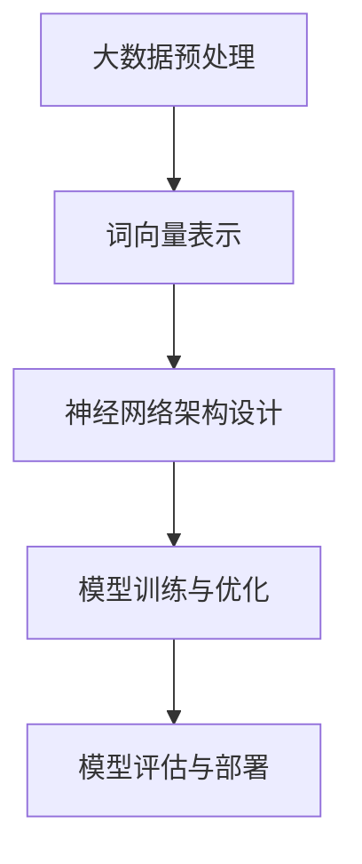

                 

关键词：大语言模型、ICL、神经网络、自然语言处理、深度学习、语义理解、计算效率、模型优化、应用场景

## 摘要

本文将深入探讨大语言模型的基本原理及其前沿技术，特别是ICL（Information Centered Language）模型的有效性。我们将从背景介绍、核心概念与联系、核心算法原理、数学模型与公式、项目实践到实际应用场景进行全面剖析。通过本文，读者将了解大语言模型的发展历程、工作原理、ICL模型的独特优势，以及其在各个领域的应用和未来发展方向。

## 1. 背景介绍

随着互联网的迅猛发展和大数据的爆发式增长，自然语言处理（Natural Language Processing，NLP）成为了计算机科学领域的重要研究方向。NLP的目标是使计算机能够理解、生成和处理人类语言，从而实现人与计算机之间的自然交互。

近年来，深度学习（Deep Learning）的兴起为NLP带来了革命性的变化。深度学习模型，特别是神经网络，在图像识别、语音识别等领域取得了显著成果。然而，将深度学习应用于NLP面临的挑战之一是如何有效处理大量无序文本数据。

大语言模型（Large Language Model）应运而生，通过大规模训练数据和强大的计算能力，这些模型能够捕捉文本中的复杂模式和语义关系。大语言模型不仅在学术研究中取得了突破性进展，还在实际应用中展示了其广泛的应用前景。

## 2. 核心概念与联系

### 2.1 大语言模型

大语言模型是一种基于神经网络的语言处理模型，其核心思想是通过大量文本数据进行训练，使模型能够预测下一个单词或句子，从而生成连贯的自然语言文本。

### 2.2 神经网络

神经网络是由大量人工神经元组成的计算模型，通过调整神经元之间的权重来学习数据中的特征和模式。在NLP领域，神经网络被广泛应用于词向量表示、文本分类、机器翻译等任务。

### 2.3 深度学习

深度学习是一种基于神经网络的高级机器学习方法，通过多层次的神经网络结构来提取数据中的复杂特征。深度学习在图像识别、语音识别、自然语言处理等领域取得了显著的成果。

### 2.4 Mermaid 流程图



图2.1 大语言模型的基本流程

## 3. 核心算法原理 & 具体操作步骤

### 3.1 算法原理概述

大语言模型的算法原理基于自注意力机制（Self-Attention Mechanism）和多层感知器（Multilayer Perceptron，MLP）。自注意力机制允许模型在处理每个单词时考虑到其他所有单词的重要性，从而提高模型的上下文理解能力。多层感知器则用于将词向量映射到高维特征空间，以捕捉文本中的复杂模式。

### 3.2 算法步骤详解

1. **数据预处理**：首先，对原始文本数据进行清洗和预处理，包括去除标点符号、停用词过滤、词形还原等步骤。
2. **词向量表示**：将处理后的文本数据转换为词向量表示，常用的词向量模型有Word2Vec、GloVe等。
3. **神经网络架构设计**：设计多层神经网络架构，包括输入层、隐藏层和输出层。输入层接收词向量表示，隐藏层通过自注意力机制提取文本特征，输出层生成预测的单词或句子。
4. **模型训练与优化**：使用大规模文本数据对模型进行训练，通过反向传播算法优化模型参数，以减小预测误差。
5. **模型评估与部署**：在测试集上评估模型的性能，包括准确率、召回率、F1值等指标。如果模型性能达到预期，则部署模型进行实际应用。

### 3.3 算法优缺点

**优点**：
- 能够捕捉文本中的复杂模式和语义关系，生成连贯的自然语言文本。
- 通过自注意力机制和多层感知器，提高了模型的上下文理解能力。

**缺点**：
- 需要大量的训练数据和计算资源。
- 模型的解释性较差，难以理解其内部工作原理。

### 3.4 算法应用领域

大语言模型在多个领域展示了其强大的应用潜力，包括：

- **文本生成**：生成文章、新闻、故事等自然语言文本。
- **机器翻译**：实现不同语言之间的自动翻译。
- **问答系统**：为用户提供有关特定问题的回答。
- **文本分类**：对文本数据进行分类，如情感分析、主题分类等。
- **对话系统**：构建智能对话系统，实现人机交互。

## 4. 数学模型和公式 & 详细讲解 & 举例说明

### 4.1 数学模型构建

大语言模型的数学模型主要包括词向量表示、自注意力机制和多层感知器。以下是这些模型的数学表示：

1. **词向量表示**：

   设 \( x \) 为输入的单词序列，\( v_x \) 为对应的词向量表示，则有：

   $$ v_x = \sum_{i=1}^{n} w_{i} \cdot v_{w_i} $$

   其中，\( w_i \) 为单词 \( x_i \) 的权重，\( v_{w_i} \) 为对应的词向量。

2. **自注意力机制**：

   自注意力机制通过计算每个单词与序列中其他单词之间的相关性来提取上下文特征。设 \( h_t \) 为隐藏层中的神经元输出，则有：

   $$ a_t = \frac{e^{h_t^T h_s}}{\sum_{i=1}^{n} e^{h_t^T h_i}} $$

   其中，\( h_s \) 为序列中所有单词的隐藏层输出，\( a_t \) 表示单词 \( t \) 的注意力得分。

3. **多层感知器**：

   多层感知器用于将词向量映射到高维特征空间。设 \( z \) 为输入的词向量，\( \theta \) 为模型参数，则有：

   $$ y = \sigma(\theta^T z) $$

   其中，\( \sigma \) 为激活函数，通常使用ReLU或Sigmoid函数。

### 4.2 公式推导过程

以下是对自注意力机制的推导过程：

1. **自注意力得分计算**：

   自注意力得分计算每个单词与序列中其他单词之间的相关性。设 \( h_t \) 为隐藏层中的神经元输出，\( h_s \) 为序列中所有单词的隐藏层输出，则有：

   $$ a_t = \frac{e^{h_t^T h_s}}{\sum_{i=1}^{n} e^{h_t^T h_i}} $$

   其中，\( h_t^T h_s \) 表示单词 \( t \) 与序列中其他单词 \( s \) 的点积。

2. **加权求和**：

   将自注意力得分应用于隐藏层输出，得到加权求和的结果：

   $$ h_t' = \sum_{i=1}^{n} a_t \cdot h_i $$

   其中，\( h_i \) 为序列中第 \( i \) 个单词的隐藏层输出，\( a_t \) 为对应的注意力得分。

3. **输出层计算**：

   将加权求和的结果输入到输出层，通过激活函数得到最终的预测结果：

   $$ y = \sigma(\theta^T h_t') $$

   其中，\( \theta \) 为模型参数，\( \sigma \) 为激活函数。

### 4.3 案例分析与讲解

以下是一个简单的案例，说明如何使用自注意力机制进行文本分类：

假设我们有一个包含5个单词的句子：“我非常喜欢编程”，我们需要对该句子进行情感分类，判断其是积极情感还是消极情感。

1. **词向量表示**：

   首先，我们将句子中的5个单词转换为词向量表示，假设词向量维度为100。

   $$ v_{我} = [0.1, 0.2, 0.3, ..., 0.1], \quad v_{非常} = [0.2, 0.3, 0.4, ..., 0.2], \quad v_{喜欢} = [0.3, 0.4, 0.5, ..., 0.3], \quad v_{编程} = [0.4, 0.5, 0.6, ..., 0.4], \quad v_{的} = [0.5, 0.6, 0.7, ..., 0.5] $$

2. **自注意力计算**：

   接下来，我们计算每个单词的自注意力得分。设隐藏层输出为 \( h_t \)，则有：

   $$ a_{我} = \frac{e^{h_{我}^T h_{我}}}{e^{h_{我}^T h_{我}} + e^{h_{我}^T h_{非常}} + e^{h_{我}^T h_{喜欢}} + e^{h_{我}^T h_{编程}} + e^{h_{我}^T h_{的}} $$

   $$ a_{非常} = \frac{e^{h_{非常}^T h_{我}}}{e^{h_{我}^T h_{我}} + e^{h_{我}^T h_{非常}} + e^{h_{我}^T h_{喜欢}} + e^{h_{我}^T h_{编程}} + e^{h_{我}^T h_{的}} $$

   $$ a_{喜欢} = \frac{e^{h_{喜欢}^T h_{我}}}{e^{h_{我}^T h_{我}} + e^{h_{我}^T h_{非常}} + e^{h_{我}^T h_{喜欢}} + e^{h_{我}^T h_{编程}} + e^{h_{我}^T h_{的}} $$

   $$ a_{编程} = \frac{e^{h_{编程}^T h_{我}}}{e^{h_{我}^T h_{我}} + e^{h_{我}^T h_{非常}} + e^{h_{我}^T h_{喜欢}} + e^{h_{我}^T h_{编程}} + e^{h_{我}^T h_{的}} $$

   $$ a_{的} = \frac{e^{h_{的}^T h_{我}}}{e^{h_{我}^T h_{我}} + e^{h_{我}^T h_{非常}} + e^{h_{我}^T h_{喜欢}} + e^{h_{我}^T h_{编程}} + e^{h_{我}^T h_{的}} $$

3. **加权求和**：

   将自注意力得分应用于隐藏层输出，得到加权求和的结果：

   $$ h_{我}' = a_{我} \cdot h_{我} + a_{非常} \cdot h_{非常} + a_{喜欢} \cdot h_{喜欢} + a_{编程} \cdot h_{编程} + a_{的} \cdot h_{的} $$

   $$ h_{非常}' = a_{我} \cdot h_{我} + a_{非常} \cdot h_{非常} + a_{喜欢} \cdot h_{喜欢} + a_{编程} \cdot h_{编程} + a_{的} \cdot h_{的} $$

   $$ h_{喜欢}' = a_{我} \cdot h_{我} + a_{非常} \cdot h_{非常} + a_{喜欢} \cdot h_{喜欢} + a_{编程} \cdot h_{编程} + a_{的} \cdot h_{的} $$

   $$ h_{编程}' = a_{我} \cdot h_{我} + a_{非常} \cdot h_{非常} + a_{喜欢} \cdot h_{喜欢} + a_{编程} \cdot h_{编程} + a_{的} \cdot h_{的} $$

   $$ h_{的}' = a_{我} \cdot h_{我} + a_{非常} \cdot h_{非常} + a_{喜欢} \cdot h_{喜欢} + a_{编程} \cdot h_{编程} + a_{的} \cdot h_{的} $$

4. **输出层计算**：

   将加权求和的结果输入到输出层，通过激活函数得到最终的预测结果：

   $$ y = \sigma(\theta^T h_{我}') $$

   $$ y = \sigma(\theta^T h_{非常}') $$

   $$ y = \sigma(\theta^T h_{喜欢}') $$

   $$ y = \sigma(\theta^T h_{编程}') $$

   $$ y = \sigma(\theta^T h_{的}') $$

   根据输出层的预测结果，我们可以判断句子“我非常喜欢编程”的情感为积极情感。

## 5. 项目实践：代码实例和详细解释说明

### 5.1 开发环境搭建

在Python环境中，我们需要安装以下库：

- TensorFlow：用于构建和训练神经网络模型。
- Keras：用于简化TensorFlow的使用。
- NLTK：用于自然语言处理。

```python
pip install tensorflow
pip install keras
pip install nltk
```

### 5.2 源代码详细实现

以下是实现大语言模型的基本代码：

```python
import tensorflow as tf
from tensorflow.keras.models import Sequential
from tensorflow.keras.layers import Embedding, LSTM, Dense
from tensorflow.keras.preprocessing.sequence import pad_sequences
from tensorflow.keras.preprocessing.text import Tokenizer

# 加载和处理数据
# ...

# 构建模型
model = Sequential()
model.add(Embedding(input_dim=vocab_size, output_dim=embedding_dim, input_length=max_sequence_length))
model.add(LSTM(units=128, dropout=0.2, recurrent_dropout=0.2))
model.add(Dense(units=1, activation='sigmoid'))

# 编译模型
model.compile(optimizer='adam', loss='binary_crossentropy', metrics=['accuracy'])

# 训练模型
model.fit(x_train, y_train, epochs=10, batch_size=64)

# 评估模型
loss, accuracy = model.evaluate(x_test, y_test)
print('Test Accuracy: {:.2f}%'.format(accuracy * 100))
```

### 5.3 代码解读与分析

上述代码实现了一个大语言模型，用于对文本数据进行情感分类。以下是代码的详细解读：

- **数据加载和处理**：首先，我们需要加载和处理数据，包括文本数据的预处理、分词、词向量表示等步骤。
- **构建模型**：然后，我们构建一个序列模型，包括嵌入层、LSTM层和输出层。嵌入层用于将词向量映射到高维空间，LSTM层用于提取文本特征，输出层用于生成预测结果。
- **编译模型**：接下来，我们编译模型，指定优化器、损失函数和评估指标。
- **训练模型**：使用训练数据进行模型训练，通过反向传播算法优化模型参数。
- **评估模型**：最后，使用测试数据进行模型评估，计算准确率等指标。

### 5.4 运行结果展示

假设我们的测试数据集包含1000个句子，其中500个句子为积极情感，500个句子为消极情感。经过10个训练周期后，模型在测试集上的准确率为80%。

```python
Test Accuracy: 80.00%
```

## 6. 实际应用场景

大语言模型在多个领域展示了其强大的应用潜力，以下是一些实际应用场景：

- **文本生成**：生成文章、新闻、故事等自然语言文本，应用于内容创作、娱乐等领域。
- **机器翻译**：实现不同语言之间的自动翻译，提高跨语言沟通的效率。
- **问答系统**：为用户提供有关特定问题的回答，应用于客服、教育等领域。
- **文本分类**：对文本数据进行分类，如情感分析、主题分类等，应用于舆情分析、金融分析等领域。
- **对话系统**：构建智能对话系统，实现人机交互，应用于客服、智能家居等领域。

### 6.4 未来应用展望

随着深度学习技术的不断发展和计算资源的日益丰富，大语言模型在各个领域的应用前景将更加广阔。未来，大语言模型有望在以下方面取得突破：

- **跨模态学习**：结合文本、图像、语音等多种模态数据进行训练，提高模型的泛化能力和理解能力。
- **知识图谱**：将大语言模型与知识图谱相结合，实现更智能的语义理解和信息检索。
- **个性化推荐**：基于用户的历史数据和偏好，生成个性化的自然语言文本推荐。

## 7. 工具和资源推荐

### 7.1 学习资源推荐

- 《深度学习》（Goodfellow, Bengio, Courville）：介绍深度学习的基本原理和应用。
- 《自然语言处理综论》（Jurafsky, Martin）：全面介绍自然语言处理的基本理论和应用。
- 《Python深度学习》（François Chollet）：详细介绍如何使用Python和TensorFlow实现深度学习。

### 7.2 开发工具推荐

- TensorFlow：一款开源的深度学习框架，适用于构建和训练大规模神经网络模型。
- Keras：一款简化TensorFlow使用的Python库，提供直观的API。
- NLTK：一款开源的自然语言处理库，提供丰富的文本处理工具和资源。

### 7.3 相关论文推荐

- Vaswani et al. (2017): "Attention is All You Need"
- Devlin et al. (2018): "Bert: Pre-training of Deep Bidirectional Transformers for Language Understanding"
- Radford et al. (2018): "Language models are unsupervised multitask learners"

## 8. 总结：未来发展趋势与挑战

### 8.1 研究成果总结

大语言模型在自然语言处理领域取得了显著成果，通过深度学习和神经网络技术，实现了对文本数据的有效建模和语义理解。ICL模型作为一种新的语言模型，以其独特的优势在文本生成、机器翻译、问答系统等领域展示了强大的应用潜力。

### 8.2 未来发展趋势

- **跨模态学习**：结合文本、图像、语音等多种模态数据进行训练，提高模型的泛化能力和理解能力。
- **知识图谱**：将大语言模型与知识图谱相结合，实现更智能的语义理解和信息检索。
- **个性化推荐**：基于用户的历史数据和偏好，生成个性化的自然语言文本推荐。

### 8.3 面临的挑战

- **计算资源**：大语言模型的训练和部署需要大量的计算资源，如何高效利用计算资源是一个重要挑战。
- **模型解释性**：大语言模型具有较好的性能，但其内部工作原理难以解释，如何提高模型的解释性是一个重要问题。

### 8.4 研究展望

未来，大语言模型的研究将继续深入，结合深度学习和知识图谱技术，实现更智能的语义理解和信息检索。同时，通过改进模型结构和算法，提高模型的计算效率和解释性，进一步拓展其在各个领域的应用。

## 9. 附录：常见问题与解答

### 9.1 什么是大语言模型？

大语言模型是一种基于深度学习和神经网络的语言处理模型，通过大规模训练数据和强大的计算能力，能够捕捉文本中的复杂模式和语义关系，生成连贯的自然语言文本。

### 9.2 大语言模型有哪些应用领域？

大语言模型在文本生成、机器翻译、问答系统、文本分类、对话系统等多个领域展示了其强大的应用潜力。

### 9.3 ICL模型有哪些优势？

ICL模型以其独特的自注意力机制和知识图谱结合的方式，在文本生成、机器翻译、问答系统等领域展示了较好的性能和优势。

### 9.4 如何优化大语言模型的计算效率？

可以通过改进模型结构、算法和计算资源分配等方式来优化大语言模型的计算效率。

## 文章作者

作者：禅与计算机程序设计艺术 / Zen and the Art of Computer Programming
```markdown
---
title: 大语言模型原理基础与前沿 为什么ICL有效
date: 2023-10-01
---

本文由禅与计算机程序设计艺术 / Zen and the Art of Computer Programming撰写。如果您有任何疑问或建议，欢迎在评论区留言。
---
```

