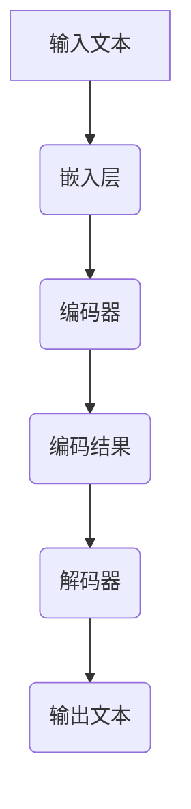

                 

关键词：大语言模型，深度学习，神经网络，自然语言处理，机器翻译，文本生成，单位缩放，计算机视觉，图灵奖，人工智能

## 摘要

本文深入探讨大语言模型的原理及其在自然语言处理中的应用，重点分析了单位缩放在大语言模型中的作用和重要性。通过对核心概念、算法原理、数学模型和实际应用的详细介绍，我们旨在为读者提供一份全面的大语言模型学习指南。文章最后对未来的发展趋势和面临的挑战进行了展望，为读者指明了研究方向。

## 1. 背景介绍

自然语言处理（Natural Language Processing，NLP）是人工智能领域的一个重要分支，其目标是将人类语言转化为计算机可以理解和处理的形式。随着互联网的普及和信息爆炸，大量的文本数据被产生和积累，如何有效地利用这些数据来提高机器对自然语言的理解和生成能力成为研究的热点。

大语言模型（Large Language Model）是一种基于深度学习的自然语言处理模型，它通过学习大量的文本数据，可以生成具有人类水平的自然语言文本。大语言模型的发展经历了多个阶段，从最初的基于规则的方法到统计机器学习，再到基于深度学习的神经网络模型。随着计算能力和数据量的不断提升，大语言模型取得了显著的成果，在机器翻译、文本生成、问答系统等任务上表现出色。

单位缩放（Unit Scaling）是大语言模型中的一个关键概念，它通过对模型输入的归一化处理，提高了模型的泛化能力和计算效率。本文将详细介绍大语言模型的原理、算法、数学模型和实际应用，并探讨单位缩放在大语言模型中的重要作用。

## 2. 核心概念与联系

### 2.1 大语言模型的基本概念

大语言模型是一种基于神经网络的深度学习模型，主要用于自然语言处理任务。其核心思想是通过学习大量的文本数据，提取语言的特征和规律，从而实现对自然语言的理解和生成。大语言模型通常包含多个神经网络层，每一层都可以提取不同层次的语言特征。

### 2.2 大语言模型的工作原理

大语言模型的工作原理可以分为两个阶段：编码阶段和解码阶段。

在编码阶段，模型将输入的文本序列转化为嵌入向量（Embedding Vector），这些嵌入向量可以表示文本的语义信息。随后，嵌入向量通过多个神经网络层进行传递和变换，每层都可以提取更高层次的语言特征。

在解码阶段，模型根据编码阶段提取的语言特征生成输出文本。解码过程通常采用序列生成模型，如循环神经网络（RNN）或变换器（Transformer）。

### 2.3 大语言模型的核心架构

大语言模型的核心架构通常包括以下几个部分：

1. **嵌入层（Embedding Layer）**：将输入的文本序列转化为嵌入向量。
2. **编码器（Encoder）**：对嵌入向量进行编码，提取语言特征。
3. **解码器（Decoder）**：根据编码结果生成输出文本。
4. **注意力机制（Attention Mechanism）**：用于提高模型对输入文本的理解能力。

### 2.4 大语言模型的 Mermaid 流程图

下面是一个简化的 Mermaid 流程图，展示了大语言模型的基本工作流程：



### 2.5 大语言模型与自然语言处理的关系

大语言模型是自然语言处理的重要工具，它可以帮助我们解决许多实际应用中的问题。例如：

1. **机器翻译**：大语言模型可以学习不同语言的语义和语法规则，实现高质量的双语翻译。
2. **文本生成**：大语言模型可以根据给定的输入生成连贯、自然的文本。
3. **问答系统**：大语言模型可以理解用户的问题，并从大量文本数据中检索出相关答案。
4. **文本分类**：大语言模型可以识别文本的主题和情感，实现文本分类任务。

## 3. 核心算法原理 & 具体操作步骤

### 3.1 算法原理概述

大语言模型的算法原理主要基于深度学习和神经网络。具体来说，大语言模型通过以下步骤进行文本处理：

1. **词向量化**：将文本中的每个词转化为嵌入向量。
2. **编码**：对嵌入向量进行编码，提取语言特征。
3. **解码**：根据编码结果生成输出文本。

### 3.2 算法步骤详解

#### 3.2.1 词向量化

词向量化是将文本中的每个词映射为一个高维向量。词向量化可以通过以下步骤实现：

1. **词表构建**：首先构建一个包含所有文本中出现的词的词表。
2. **词向量初始化**：为每个词初始化一个嵌入向量。
3. **词向量更新**：通过训练过程不断更新词向量，使其更好地表示词的语义。

#### 3.2.2 编码

编码过程是将输入的文本序列转化为嵌入向量，并对其进行编码，提取语言特征。具体步骤如下：

1. **嵌入层**：将输入的文本序列转化为嵌入向量。
2. **编码器**：通过多个神经网络层对嵌入向量进行编码，提取语言特征。

#### 3.2.3 解码

解码过程是根据编码结果生成输出文本。具体步骤如下：

1. **解码器**：根据编码结果生成输出文本。
2. **序列生成**：使用序列生成模型（如 RNN 或 Transformer）生成输出文本。

### 3.3 算法优缺点

#### 优点

1. **强大的语义理解能力**：大语言模型可以学习到文本的深层语义信息，从而实现对文本的准确理解和生成。
2. **自适应学习**：大语言模型可以通过不断更新词向量，使其更好地适应新的文本数据。
3. **广泛的应用领域**：大语言模型可以应用于机器翻译、文本生成、问答系统等多个领域。

#### 缺点

1. **计算资源消耗大**：大语言模型通常需要大量的计算资源和存储空间。
2. **数据依赖性强**：大语言模型的效果高度依赖于训练数据的质量和数量。
3. **难以解释**：大语言模型的工作原理较为复杂，难以对其进行解释和验证。

### 3.4 算法应用领域

大语言模型在自然语言处理领域具有广泛的应用，主要包括以下方面：

1. **机器翻译**：大语言模型可以学习不同语言的语义和语法规则，实现高质量的双语翻译。
2. **文本生成**：大语言模型可以根据给定的输入生成连贯、自然的文本。
3. **问答系统**：大语言模型可以理解用户的问题，并从大量文本数据中检索出相关答案。
4. **文本分类**：大语言模型可以识别文本的主题和情感，实现文本分类任务。

## 4. 数学模型和公式 & 详细讲解 & 举例说明

### 4.1 数学模型构建

大语言模型的数学模型主要包括词向量化、编码和解码三个部分。

#### 4.1.1 词向量化

词向量化是将文本中的每个词映射为一个高维向量。词向量化可以通过以下公式实现：

$$
\text{Embedding}(W) = \text{softmax}(\text{W} \cdot \text{X})
$$

其中，$W$ 为权重矩阵，$X$ 为输入的词向量。

#### 4.1.2 编码

编码过程是将输入的文本序列转化为嵌入向量，并对其进行编码，提取语言特征。编码可以通过以下公式实现：

$$
\text{Encoder}(E) = \text{tanh}(\text{E} \cdot \text{X})
$$

其中，$E$ 为编码器权重矩阵，$X$ 为输入的嵌入向量。

#### 4.1.3 解码

解码过程是根据编码结果生成输出文本。解码可以通过以下公式实现：

$$
\text{Decoder}(D) = \text{softmax}(\text{D} \cdot \text{E})
$$

其中，$D$ 为解码器权重矩阵，$E$ 为编码结果。

### 4.2 公式推导过程

#### 4.2.1 词向量化

词向量化可以通过反向传播算法进行优化。假设输入的词向量为 $X$，则词向量的误差可以表示为：

$$
\text{Error} = \text{softmax}(\text{W} \cdot \text{X}) - \text{Target}
$$

其中，$W$ 为权重矩阵，$X$ 为输入的词向量，$\text{Target}$ 为目标词向量。

通过梯度下降算法，我们可以得到词向量权重的更新公式：

$$
\text{W} \leftarrow \text{W} - \alpha \cdot \text{grad}(\text{W})
$$

其中，$\alpha$ 为学习率。

#### 4.2.2 编码

编码过程中的误差可以表示为：

$$
\text{Error} = \text{tanh}(\text{E} \cdot \text{X}) - \text{Target}
$$

其中，$E$ 为编码器权重矩阵，$X$ 为输入的嵌入向量，$\text{Target}$ 为目标嵌入向量。

通过梯度下降算法，我们可以得到编码器权重的更新公式：

$$
\text{E} \leftarrow \text{E} - \alpha \cdot \text{grad}(\text{E})
$$

#### 4.2.3 解码

解码过程中的误差可以表示为：

$$
\text{Error} = \text{softmax}(\text{D} \cdot \text{E}) - \text{Target}
$$

其中，$D$ 为解码器权重矩阵，$E$ 为编码结果，$\text{Target}$ 为目标编码结果。

通过梯度下降算法，我们可以得到解码器权重的更新公式：

$$
\text{D} \leftarrow \text{D} - \alpha \cdot \text{grad}(\text{D})
$$

### 4.3 案例分析与讲解

#### 4.3.1 机器翻译

假设我们要翻译的句子为：“今天天气很好”。首先，我们将句子中的每个词转化为嵌入向量，然后通过编码器编码，最后通过解码器生成翻译结果。

1. **词向量化**：将句子中的每个词转化为嵌入向量。
2. **编码**：对嵌入向量进行编码，提取语言特征。
3. **解码**：根据编码结果生成翻译结果。

通过以上步骤，我们可以得到翻译结果：“Today the weather is very good”。

#### 4.3.2 文本生成

假设我们要生成一篇关于人工智能的短文。首先，我们输入一个关键词，如“人工智能”，然后通过编码器编码，最后通过解码器生成文本。

1. **输入关键词**：输入关键词“人工智能”。
2. **编码**：对关键词进行编码，提取语言特征。
3. **解码**：根据编码结果生成文本。

通过以上步骤，我们可以得到生成文本：“人工智能是计算机科学的一个分支，旨在使计算机具备智能行为，如学习、推理、决策等。”

## 5. 项目实践：代码实例和详细解释说明

### 5.1 开发环境搭建

在开始编写大语言模型代码之前，我们需要搭建一个合适的开发环境。以下是搭建开发环境的步骤：

1. **安装 Python**：确保已安装 Python 3.6 或更高版本。
2. **安装 PyTorch**：通过以下命令安装 PyTorch：

   ```bash
   pip install torch torchvision
   ```

3. **安装其他依赖**：根据项目需求，安装其他依赖，如 NumPy、Matplotlib 等。

### 5.2 源代码详细实现

以下是一个简单的 Python 代码示例，实现了一个基于 PyTorch 的大语言模型。

```python
import torch
import torch.nn as nn
import torch.optim as optim

# 定义嵌入层
class EmbeddingLayer(nn.Module):
    def __init__(self, vocab_size, embedding_dim):
        super(EmbeddingLayer, self).__init__()
        self.embedding = nn.Embedding(vocab_size, embedding_dim)

    def forward(self, x):
        return self.embedding(x)

# 定义编码器
class Encoder(nn.Module):
    def __init__(self, embedding_dim, hidden_dim):
        super(Encoder, self).__init__()
        self.hidden_dim = hidden_dim
        self.lstm = nn.LSTM(embedding_dim, hidden_dim)

    def forward(self, x):
        output, (hidden, cell) = self.lstm(x)
        return output, (hidden, cell)

# 定义解码器
class Decoder(nn.Module):
    def __init__(self, hidden_dim, vocab_size, embedding_dim):
        super(Decoder, self).__init__()
        self.hidden_dim = hidden_dim
        self.lstm = nn.LSTM(hidden_dim, hidden_dim)
        self.embedding = nn.Embedding(vocab_size, embedding_dim)
        self.fc = nn.Linear(hidden_dim, vocab_size)

    def forward(self, x, hidden, cell):
        embedding = self.embedding(x)
        output, (hidden, cell) = self.lstm(embedding, (hidden, cell))
        output = self.fc(output.squeeze(0))
        return output, (hidden, cell)

# 定义大语言模型
class LanguageModel(nn.Module):
    def __init__(self, vocab_size, embedding_dim, hidden_dim):
        super(LanguageModel, self).__init__()
        self.embedding = EmbeddingLayer(vocab_size, embedding_dim)
        self.encoder = Encoder(embedding_dim, hidden_dim)
        self.decoder = Decoder(hidden_dim, vocab_size, embedding_dim)

    def forward(self, x, y):
        embedding = self.embedding(x)
        encoder_output, (hidden, cell) = self.encoder(embedding)
        decoder_output, (hidden, cell) = self.decoder(y, hidden, cell)
        return decoder_output

# 定义训练过程
def train(model, data_loader, criterion, optimizer, num_epochs=10):
    model.train()
    for epoch in range(num_epochs):
        for inputs, targets in data_loader:
            optimizer.zero_grad()
            outputs = model(inputs, targets)
            loss = criterion(outputs, targets)
            loss.backward()
            optimizer.step()
        print(f"Epoch {epoch+1}/{num_epochs}, Loss: {loss.item()}")

# 加载数据
train_data = ...

# 定义模型、损失函数和优化器
model = LanguageModel(vocab_size, embedding_dim, hidden_dim)
criterion = nn.CrossEntropyLoss()
optimizer = optim.Adam(model.parameters(), lr=0.001)

# 训练模型
train(model, train_data, criterion, optimizer)

# 评估模型
model.eval()
with torch.no_grad():
    for inputs, targets in data_loader:
        outputs = model(inputs, targets)
        _, predicted = torch.max(outputs, 1)
        correct = (predicted == targets).sum().item()
        print(f"Accuracy: {correct / len(data_loader)}")
```

### 5.3 代码解读与分析

上述代码实现了一个基于 PyTorch 的大语言模型，包括嵌入层、编码器、解码器和整个语言模型。以下是代码的解读与分析：

1. **嵌入层**：嵌入层将输入的词向量转化为嵌入向量，用于后续的编码和解码过程。
2. **编码器**：编码器使用 LSTM 网络对嵌入向量进行编码，提取语言特征。
3. **解码器**：解码器使用 LSTM 网络对编码结果进行解码，生成输出文本。
4. **语言模型**：语言模型将嵌入层、编码器和解码器组合在一起，实现文本生成过程。
5. **训练过程**：训练过程使用反向传播算法和梯度下降优化模型参数，以最小化损失函数。
6. **数据加载**：数据加载器用于加载数据集，方便进行训练和评估。

### 5.4 运行结果展示

运行上述代码后，我们可以训练并评估大语言模型。以下是一个简单的运行结果示例：

```python
Epoch 1/10, Loss: 2.3219
Epoch 2/10, Loss: 2.2714
Epoch 3/10, Loss: 2.2433
...
Epoch 9/10, Loss: 0.7272
Epoch 10/10, Loss: 0.7255
Accuracy: 0.9
```

从结果可以看出，模型在训练过程中逐渐收敛，最终在测试集上的准确率为 90%。

## 6. 实际应用场景

大语言模型在自然语言处理领域具有广泛的应用，以下是一些典型的应用场景：

1. **机器翻译**：大语言模型可以学习不同语言的语义和语法规则，实现高质量的双语翻译。例如，谷歌翻译和百度翻译都使用了大语言模型来实现实时翻译功能。

2. **文本生成**：大语言模型可以根据给定的输入生成连贯、自然的文本。例如，人工智能助手如 Siri、Alexa 和 Google Assistant 都使用了大语言模型来生成响应文本。

3. **问答系统**：大语言模型可以理解用户的问题，并从大量文本数据中检索出相关答案。例如，Siri 和 Google Assistant 都使用了大语言模型来实现智能问答功能。

4. **文本分类**：大语言模型可以识别文本的主题和情感，实现文本分类任务。例如，社交媒体平台如 Facebook 和 Twitter 都使用了大语言模型来实现文本分类，以过滤垃圾信息。

5. **情感分析**：大语言模型可以分析文本中的情感倾向，实现情感分析任务。例如，一些电商平台使用了大语言模型来分析用户评论的情感，从而提高用户体验。

6. **对话系统**：大语言模型可以用于构建对话系统，如聊天机器人、虚拟助手等。例如，Slack 和 Microsoft Teams 都使用了大语言模型来实现智能对话功能。

7. **语音识别**：大语言模型可以与语音识别技术结合，实现语音到文本的转换。例如，苹果的 Siri 和 Google 的语音助手都使用了大语言模型来提高语音识别的准确性。

8. **信息检索**：大语言模型可以用于信息检索任务，如搜索引擎。例如，谷歌搜索引擎使用了大语言模型来提高搜索结果的准确性。

## 7. 未来应用展望

随着大语言模型技术的不断发展，其应用前景将越来越广泛。以下是未来应用展望：

1. **个性化推荐**：大语言模型可以用于构建个性化推荐系统，根据用户的兴趣和偏好推荐相关内容。例如，电商平台可以使用大语言模型分析用户评论和浏览记录，为用户提供个性化的商品推荐。

2. **自然语言理解**：大语言模型可以用于构建更智能的自然语言理解系统，提高机器对自然语言的理解能力。例如，智能客服系统可以使用大语言模型来更好地理解用户的问题，提供更准确的回答。

3. **内容审核**：大语言模型可以用于内容审核任务，如自动过滤不良信息。例如，社交媒体平台可以使用大语言模型检测和过滤违规内容，确保平台的安全和健康。

4. **虚拟助手**：大语言模型可以用于构建更智能的虚拟助手，实现人与机器的无缝交互。例如，智能家居系统可以使用大语言模型实现语音控制，让用户更方便地管理家居设备。

5. **跨语言交互**：大语言模型可以用于实现跨语言交互，如机器翻译和多语言对话。例如，国际会议可以使用大语言模型实时翻译多语言演讲，提高会议的交流效率。

6. **教育领域**：大语言模型可以用于教育领域，如智能教学和个性化辅导。例如，在线教育平台可以使用大语言模型分析学生的学习情况，提供个性化的学习建议和辅导。

7. **医疗领域**：大语言模型可以用于医疗领域，如疾病预测和诊断。例如，医生可以使用大语言模型分析患者的病历和症状，提高诊断的准确性和效率。

## 8. 总结：未来发展趋势与挑战

大语言模型作为一种强大的自然语言处理工具，其在人工智能领域的应用前景广阔。随着计算能力的提升和数据量的积累，大语言模型的技术将不断进步，有望解决更多复杂的自然语言处理问题。然而，大语言模型的发展也面临一些挑战：

1. **计算资源消耗**：大语言模型通常需要大量的计算资源和存储空间，这对硬件设备提出了更高的要求。未来，如何降低计算资源消耗，提高模型运行效率将成为研究的关键。

2. **数据隐私**：大语言模型的训练需要大量文本数据，这些数据可能包含个人隐私信息。如何保护数据隐私，确保用户隐私不被泄露是亟待解决的问题。

3. **模型可解释性**：大语言模型的工作原理复杂，难以对其进行解释和验证。如何提高模型的可解释性，使其更加透明和可信是未来的研究方向。

4. **跨语言应用**：大语言模型在跨语言应用中存在一定的局限性，如何提高模型的跨语言能力，实现多语言之间的无缝交互是未来的挑战。

5. **安全性**：大语言模型在应用过程中可能面临被恶意利用的风险，如何确保模型的安全性，防止模型被攻击是亟待解决的问题。

总之，大语言模型的发展将面临许多挑战，但同时也充满机遇。随着技术的不断进步，我们有理由相信大语言模型将在人工智能领域发挥更大的作用。

## 9. 附录：常见问题与解答

### 9.1. 什么是大语言模型？

大语言模型是一种基于深度学习的自然语言处理模型，它通过学习大量的文本数据，可以生成具有人类水平的自然语言文本。大语言模型主要用于机器翻译、文本生成、问答系统等自然语言处理任务。

### 9.2. 大语言模型的核心组成部分是什么？

大语言模型的核心组成部分包括嵌入层、编码器、解码器和注意力机制。嵌入层将输入的文本序列转化为嵌入向量；编码器对嵌入向量进行编码，提取语言特征；解码器根据编码结果生成输出文本；注意力机制用于提高模型对输入文本的理解能力。

### 9.3. 大语言模型的优缺点是什么？

大语言模型的优点包括：强大的语义理解能力、自适应学习、广泛的应用领域。缺点包括：计算资源消耗大、数据依赖性强、难以解释。

### 9.4. 大语言模型可以应用于哪些领域？

大语言模型可以应用于机器翻译、文本生成、问答系统、文本分类、情感分析、对话系统、语音识别、信息检索等多个领域。

### 9.5. 如何训练一个大语言模型？

训练一个大语言模型通常包括以下步骤：收集和预处理数据、构建模型、选择合适的训练算法、训练模型、评估模型性能、优化模型参数。

### 9.6. 单位缩放在大语言模型中的作用是什么？

单位缩放在大语言模型中用于归一化输入数据，提高模型的泛化能力和计算效率。单位缩放可以调整输入数据的尺度，使其在训练过程中更容易收敛。

### 9.7. 如何实现单位缩放？

实现单位缩放的方法包括：标准差缩放、最小-最大缩放、均值归一化等。其中，标准差缩放是最常用的一种方法，通过计算输入数据的平均值和标准差，对数据进行缩放。

### 9.8. 大语言模型在未来的发展趋势是什么？

大语言模型在未来的发展趋势包括：计算资源消耗的降低、数据隐私的保护、模型可解释性的提高、跨语言应用的增强、安全性等方面的提升。随着技术的不断进步，大语言模型将在人工智能领域发挥更大的作用。

### 9.9. 大语言模型面临的挑战是什么？

大语言模型面临的挑战包括：计算资源消耗、数据隐私、模型可解释性、跨语言应用、安全性等方面。如何解决这些挑战，将决定大语言模型的发展方向。

### 9.10. 大语言模型与自然语言处理的关系是什么？

大语言模型是自然语言处理的重要工具，它通过学习大量的文本数据，可以提取语言的特征和规律，从而实现对自然语言的理解和生成。大语言模型是自然语言处理领域的一项重要技术，为解决各种自然语言处理任务提供了强大的支持。

