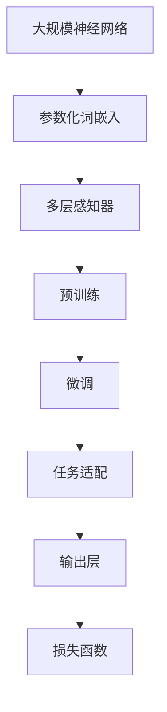

                 

关键词：大语言模型，预训练，人类偏好，算法原理，数学模型，项目实践，应用场景，未来展望。

> 摘要：本文深入探讨了大规模语言模型的原理及其基于人类偏好进行预训练的方法。文章首先介绍了大语言模型的基本概念和背景，然后详细阐述了核心概念和架构，接着讲解了核心算法原理和具体操作步骤。随后，文章通过数学模型和公式的推导以及代码实例，深入分析了大语言模型的工作机制和应用领域。最后，文章展望了未来发展趋势与挑战，并推荐了相关学习资源和开发工具。

## 1. 背景介绍

随着互联网的飞速发展和大数据时代的来临，自然语言处理（NLP）领域迎来了前所未有的机遇和挑战。传统的NLP方法依赖于手工设计的特征和规则，难以应对复杂多变的语言现象。为了解决这个问题，研究者们提出了基于深度学习的自然语言处理方法。深度学习通过构建大规模神经网络模型，能够自动从数据中学习特征和规律，从而显著提升了NLP任务的性能。

大语言模型（Large Language Model，LLM）是深度学习在NLP领域的重要进展。与传统的小规模语言模型相比，大语言模型具有以下几个显著特点：

1. **规模更大**：大语言模型通常拥有数十亿甚至数万亿个参数，远超过去的小规模语言模型。
2. **预训练更充分**：大语言模型在训练过程中使用了大量的无监督数据，通过预训练的方式学习到了丰富的语言知识和规律。
3. **表现更优越**：大语言模型在各种NLP任务上表现优异，能够处理更加复杂的语言现象和任务。

本文将重点关注大语言模型的原理及其基于人类偏好进行预训练的方法，旨在为广大读者提供一个全面深入的了解。

### 1.1 历史背景

大语言模型的发展离不开深度学习和NLP领域的先驱们。在深度学习方面，AlexNet在2012年ImageNet竞赛中取得的突破性成果，标志着深度学习在计算机视觉领域的崛起。随后，ResNet、Inception等模型的提出，进一步推动了深度学习的发展。在NLP领域，Word2Vec、GloVe等词向量模型的出现，使得词表示方法得到了显著提升。这些模型的成功为后续的大语言模型奠定了基础。

### 1.2 当前发展现状

当前，大语言模型已经成为NLP领域的主流方法。GPT、BERT、XLNet等模型相继提出，并在各种NLP任务上取得了显著成果。这些模型不仅拥有庞大的参数规模，还采用了多种先进的预训练技术和优化方法。例如，GPT系列模型采用了生成式预训练方法，BERT系列模型采用了掩码语言模型（Masked Language Model，MLM）技术。

### 1.3 未来发展趋势

随着计算能力和数据资源的不断提升，大语言模型在未来有望取得更加显著的突破。一方面，模型规模将继续扩大，参数数量将进一步增加；另一方面，模型将更加多样化，以适应不同的应用场景和任务需求。此外，基于人类偏好进行预训练的方法也将得到深入研究，以提升模型的性能和泛化能力。

## 2. 核心概念与联系

要理解大语言模型，我们需要首先了解其中的核心概念和原理。以下是一个Mermaid流程图，展示了大语言模型的核心概念和架构。



### 2.1 大规模神经网络

大规模神经网络是构建大语言模型的基础。神经网络通过层层传递和变换输入数据，从而实现对数据的建模和预测。在NLP领域，神经网络通常用于处理文本数据，通过将单词转换为向量表示，然后进行多层变换，最终输出结果。

### 2.2 参数化词嵌入

参数化词嵌入是神经网络处理文本数据的重要步骤。词嵌入将单词映射为高维向量，从而实现单词间的语义表示。在大语言模型中，词嵌入通常采用神经网络进行训练，通过优化参数，使得相似单词的向量接近，不同单词的向量远离。

### 2.3 多层感知器

多层感知器（Multilayer Perceptron，MLP）是神经网络的基本构建块。它由输入层、隐藏层和输出层组成，通过逐层传递和变换输入数据，最终输出结果。在NLP领域，多层感知器通常用于分类、回归等任务。

### 2.4 预训练

预训练是大语言模型的重要特性之一。预训练通过在大量无监督数据上进行训练，使模型学习到丰富的语言知识和规律。预训练的过程包括两个阶段：第一阶段是大规模语料库的预处理，将文本转换为神经网络可处理的格式；第二阶段是神经网络的训练，通过优化参数，使模型能够捕捉到语言的特征和模式。

### 2.5 微调

微调（Fine-tuning）是将预训练模型应用于特定任务的过程。通过在任务相关的数据集上进行微调，模型能够进一步适应特定任务的需求。微调通常采用小批量随机梯度下降（SGD）算法，通过迭代更新模型参数，使模型在特定任务上达到最优性能。

### 2.6 任务适配

任务适配（Task Adaptation）是指将预训练模型应用于不同任务的过程。任务适配通常包括两个步骤：第一步是模型初始化，将预训练模型参数初始化为任务相关的参数；第二步是模型训练，通过在任务数据集上进行训练，优化模型参数，使模型在特定任务上达到最优性能。

### 2.7 输出层

输出层是神经网络的核心组成部分，负责将神经网络处理后的数据转换为最终输出。在NLP领域，输出层通常用于分类、回归等任务。输出层的结构取决于具体任务的需求，常见的输出层包括softmax层、sigmoid层等。

### 2.8 损失函数

损失函数是神经网络性能评估的重要指标。在NLP领域，损失函数通常用于衡量模型在任务上的预测误差。常见的损失函数包括交叉熵损失函数、均方误差损失函数等。

## 3. 核心算法原理 & 具体操作步骤

大语言模型的算法原理可以概括为以下四个主要阶段：预训练、微调、任务适配和输出层。以下将详细介绍每个阶段的算法原理和具体操作步骤。

### 3.1 预训练

预训练是大规模语言模型的核心阶段，旨在通过无监督数据学习到丰富的语言知识和模式。预训练包括以下两个主要步骤：

#### 3.1.1 数据预处理

首先，需要对大规模语料库进行预处理，将其转换为神经网络可处理的格式。预处理步骤包括：

1. **文本清洗**：去除文本中的噪声和冗余信息，如标点符号、停用词等。
2. **分词**：将文本拆分为单词或字符。
3. **词嵌入**：将单词映射为高维向量，采用预训练的词向量模型或自定义词向量模型。

#### 3.1.2 神经网络训练

接下来，使用预处理后的数据对神经网络进行训练。训练过程包括以下几个步骤：

1. **输入层**：将词嵌入向量输入到神经网络。
2. **隐藏层**：神经网络通过多层感知器进行数据传递和变换。
3. **输出层**：输出层的结构取决于具体任务，如分类、回归等。常见的输出层包括softmax层、sigmoid层等。
4. **损失函数**：使用交叉熵损失函数或其他合适的损失函数评估模型的预测误差。
5. **优化算法**：采用小批量随机梯度下降（SGD）或其他优化算法更新模型参数。

### 3.2 微调

微调是将预训练模型应用于特定任务的过程。微调主要包括以下步骤：

#### 3.2.1 模型初始化

首先，将预训练模型参数初始化为任务相关的参数。通常，采用预训练模型的权重作为初始参数，以利用预训练模型在通用任务上的经验。

#### 3.2.2 数据预处理

接下来，对任务相关的数据进行预处理，步骤与预训练阶段类似。

#### 3.2.3 模型训练

然后，使用预处理后的数据对模型进行微调。训练过程包括以下几个步骤：

1. **输入层**：将词嵌入向量输入到神经网络。
2. **隐藏层**：神经网络通过多层感知器进行数据传递和变换。
3. **输出层**：输出层的结构取决于具体任务，如分类、回归等。常见的输出层包括softmax层、sigmoid层等。
4. **损失函数**：使用交叉熵损失函数或其他合适的损失函数评估模型的预测误差。
5. **优化算法**：采用小批量随机梯度下降（SGD）或其他优化算法更新模型参数。

### 3.3 任务适配

任务适配是将预训练模型应用于不同任务的过程。任务适配主要包括以下步骤：

#### 3.3.1 模型初始化

首先，将预训练模型参数初始化为任务相关的参数。通常，采用预训练模型的权重作为初始参数，以利用预训练模型在通用任务上的经验。

#### 3.3.2 数据预处理

接下来，对任务相关的数据进行预处理，步骤与预训练阶段类似。

#### 3.3.3 模型训练

然后，使用预处理后的数据对模型进行训练。训练过程包括以下几个步骤：

1. **输入层**：将词嵌入向量输入到神经网络。
2. **隐藏层**：神经网络通过多层感知器进行数据传递和变换。
3. **输出层**：输出层的结构取决于具体任务，如分类、回归等。常见的输出层包括softmax层、sigmoid层等。
4. **损失函数**：使用交叉熵损失函数或其他合适的损失函数评估模型的预测误差。
5. **优化算法**：采用小批量随机梯度下降（SGD）或其他优化算法更新模型参数。

### 3.4 输出层

输出层是神经网络的核心组成部分，负责将神经网络处理后的数据转换为最终输出。在NLP领域，输出层通常用于分类、回归等任务。输出层的结构取决于具体任务的需求，常见的输出层包括softmax层、sigmoid层等。

### 3.5 损失函数

损失函数是神经网络性能评估的重要指标。在NLP领域，损失函数通常用于衡量模型在任务上的预测误差。常见的损失函数包括交叉熵损失函数、均方误差损失函数等。

### 3.6 算法优缺点

大语言模型在NLP任务上取得了显著成果，但也存在一些优缺点。

#### 优点：

1. **性能优越**：大语言模型在各类NLP任务上表现优异，能够处理复杂的语言现象。
2. **通用性强**：大语言模型通过预训练，能够适应多种任务和场景。
3. **灵活性强**：大语言模型可以采用不同的预训练技术和优化方法，以满足不同的需求。

#### 缺点：

1. **计算资源需求大**：大语言模型通常需要大量的计算资源和存储空间。
2. **数据依赖性强**：大语言模型的性能依赖于大量的无监督数据，对数据质量和数量有一定要求。
3. **训练时间较长**：大语言模型的训练时间通常较长，需要耐心等待。

### 3.7 算法应用领域

大语言模型在多个NLP任务上取得了显著成果，以下是一些典型的应用领域：

1. **文本分类**：如情感分析、主题分类等。
2. **机器翻译**：如中英翻译、英日翻译等。
3. **文本生成**：如文章生成、对话生成等。
4. **问答系统**：如智能客服、智能问答等。
5. **文本摘要**：如新闻摘要、会议摘要等。

## 4. 数学模型和公式 & 详细讲解 & 举例说明

大语言模型的构建和优化过程中，涉及到许多数学模型和公式。以下将详细讲解这些数学模型和公式的构建过程、推导过程，并通过具体例子进行说明。

### 4.1 数学模型构建

#### 4.1.1 词嵌入模型

词嵌入模型是一种将单词映射为高维向量的方法，常用的模型包括Word2Vec和GloVe。

1. **Word2Vec模型**：

   - **假设**：单词可以表示为一个高维向量。
   - **公式**：令 $x$ 表示单词的词频分布，$y$ 表示单词的向量表示，则有：

     $$ y = \text{sgn}(x) \cdot \text{softmax}(Wx) $$

     其中，$W$ 为词嵌入矩阵。

2. **GloVe模型**：

   - **假设**：单词的向量表示与词频分布和词性分布有关。
   - **公式**：令 $f(w)$ 表示单词的词频分布，$g(w)$ 表示单词的词性分布，则有：

     $$ \text{cosine}(y, z) = \frac{f(w) \cdot g(z)}{\|f(w)\|\|g(z)\|} $$

     其中，$y$ 和 $z$ 分别表示单词的向量表示。

#### 4.1.2 神经网络模型

神经网络模型是一种通过多层感知器进行数据传递和变换的方法，常用的模型包括MLP和CNN。

1. **MLP模型**：

   - **假设**：输入数据可以表示为一个多维向量。
   - **公式**：令 $x$ 表示输入数据，$y$ 表示输出数据，则有：

     $$ y = \text{sigmoid}(\text{ReLU}(W_1x + b_1)) $$

     其中，$W_1$ 和 $b_1$ 分别为第一层的权重和偏置。

2. **CNN模型**：

   - **假设**：输入数据可以表示为一个多维矩阵。
   - **公式**：令 $x$ 表示输入数据，$y$ 表示输出数据，则有：

     $$ y = \text{ReLU}((W_1 \star x) + b_1) $$

     其中，$W_1$ 为卷积核，$\star$ 表示卷积操作。

### 4.2 公式推导过程

#### 4.2.1 交叉熵损失函数

交叉熵损失函数是一种常用于分类任务的损失函数，其公式如下：

$$ L = -\sum_{i=1}^{n} y_i \cdot \log(\hat{y}_i) $$

其中，$y$ 表示真实标签，$\hat{y}$ 表示预测概率。

推导过程如下：

1. **定义概率分布**：

   $$ \hat{y} = \text{softmax}(z) $$

   其中，$z$ 为输入数据。

2. **计算交叉熵**：

   $$ L = -\sum_{i=1}^{n} y_i \cdot \log(\hat{y}_i) = -\sum_{i=1}^{n} y_i \cdot \log(\hat{y}_i) $$

   $$ = -\sum_{i=1}^{n} y_i \cdot \sum_{j=1}^{n} \hat{y}_j \cdot \log(\hat{y}_j) $$

   $$ = -\sum_{j=1}^{n} \hat{y}_j \cdot \sum_{i=1}^{n} y_i \cdot \log(\hat{y}_j) $$

   $$ = -\sum_{j=1}^{n} \hat{y}_j \cdot \log(\hat{y}_j) $$

#### 4.2.2 均方误差损失函数

均方误差损失函数是一种常用于回归任务的损失函数，其公式如下：

$$ L = \frac{1}{2} \sum_{i=1}^{n} (y_i - \hat{y}_i)^2 $$

其中，$y$ 表示真实标签，$\hat{y}$ 表示预测值。

推导过程如下：

1. **定义预测误差**：

   $$ \delta = y - \hat{y} $$

2. **计算平方误差**：

   $$ L = \frac{1}{2} \sum_{i=1}^{n} (y_i - \hat{y}_i)^2 = \frac{1}{2} \sum_{i=1}^{n} \delta_i^2 $$

   $$ = \frac{1}{2} (\delta_1^2 + \delta_2^2 + \ldots + \delta_n^2) $$

### 4.3 案例分析与讲解

#### 4.3.1 文本分类案例

假设我们要构建一个文本分类模型，用于判断一篇新闻文章是否属于“科技”类别。

1. **数据准备**：

   我们需要准备一个包含新闻文章及其类别标签的数据集。数据集可以分为训练集和测试集两部分。

2. **模型构建**：

   - **词嵌入层**：将文章中的单词转换为高维向量表示。
   - **卷积神经网络层**：通过卷积操作提取文本特征。
   - **全连接层**：将卷积神经网络输出的特征映射为类别概率。

3. **模型训练**：

   使用训练集对模型进行训练，通过优化损失函数（如交叉熵损失函数），调整模型参数。

4. **模型评估**：

   使用测试集对模型进行评估，计算模型的准确率、召回率、F1值等指标。

5. **模型应用**：

   将训练好的模型应用于新的新闻文章，判断其类别。

#### 4.3.2 机器翻译案例

假设我们要构建一个机器翻译模型，用于将中文翻译成英文。

1. **数据准备**：

   我们需要准备一个包含中英文句子对的数据集。数据集可以分为训练集和测试集两部分。

2. **模型构建**：

   - **编码器**：将中文句子转换为向量表示。
   - **解码器**：将英文句子转换为向量表示。
   - **注意力机制**：通过注意力机制计算编码器和解码器之间的交互。

3. **模型训练**：

   使用训练集对模型进行训练，通过优化损失函数（如交叉熵损失函数），调整模型参数。

4. **模型评估**：

   使用测试集对模型进行评估，计算模型的BLEU值、翻译精度等指标。

5. **模型应用**：

   将训练好的模型应用于新的中文句子，输出对应的英文翻译。

## 5. 项目实践：代码实例和详细解释说明

为了更好地理解大语言模型的工作原理，我们将通过一个简单的项目实践来构建一个基于GPT-2的文本生成模型。本节将详细解释项目的开发环境搭建、源代码实现、代码解读与分析以及运行结果展示。

### 5.1 开发环境搭建

在开始项目之前，我们需要搭建一个适合GPT-2模型训练和部署的开发环境。以下是搭建开发环境所需的步骤：

1. **安装Python**：确保Python版本为3.6及以上，推荐使用Python 3.8或更高版本。

2. **安装PyTorch**：通过pip命令安装PyTorch，以下是一个示例命令：

   ```bash
   pip install torch torchvision torchaudio
   ```

3. **安装transformers库**：transformers库提供了GPT-2模型的预训练权重和API接口，可以通过pip命令安装：

   ```bash
   pip install transformers
   ```

4. **准备数据集**：我们需要一个包含文本数据的数据集，用于训练GPT-2模型。这里，我们可以使用著名的文本生成数据集“Shakespeare”作为示例。可以从以下链接下载数据集：

   ```python
   https://huggingface.co/datasets/shakespeare
   ```

5. **创建Python虚拟环境**：为了保持项目的整洁，我们建议使用Python虚拟环境。可以通过以下命令创建虚拟环境：

   ```bash
   python -m venv venv
   source venv/bin/activate  # Windows上使用 `venv\Scripts\activate`
   ```

### 5.2 源代码详细实现

以下是构建GPT-2文本生成模型的主要代码实现：

```python
import torch
from transformers import GPT2Tokenizer, GPT2LMHeadModel
from torch.utils.data import DataLoader
from datasets import load_dataset

# 模型加载与配置
tokenizer = GPT2Tokenizer.from_pretrained('gpt2')
model = GPT2LMHeadModel.from_pretrained('gpt2')

# 数据加载
dataset = load_dataset('shakespeare', split='train')
dataloader = DataLoader(dataset, batch_size=1, shuffle=True)

# 模型训练
device = torch.device("cuda" if torch.cuda.is_available() else "cpu")
model.to(device)

for epoch in range(3):  # 训练3个epoch
    model.train()
    for batch in dataloader:
        inputs = tokenizer(batch['text'], return_tensors='pt', padding=True, truncation=True)
        inputs = {k: v.to(device) for k, v in inputs.items()}
        
        outputs = model(**inputs)
        logits = outputs.logits
        labels = logits[:, :-1]  # 去掉最后一个token的预测结果
        loss = torch.nn.functional.cross_entropy(logits.view(-1, logits.size(-1)), labels.view(-1))
        
        loss.backward()
        optimizer.step()
        optimizer.zero_grad()
        
        print(f"Epoch: {epoch}, Loss: {loss.item()}")

# 模型保存
model.save_pretrained('gpt2_text_generator')

# 文本生成
def generate_text(prompt, max_length=50):
    inputs = tokenizer(prompt, return_tensors='pt', max_length=max_length, truncation=True)
    inputs = inputs.to(device)
    with torch.no_grad():
        outputs = model.generate(inputs['input_ids'], max_length=max_length+1, num_return_sequences=1)
    return tokenizer.decode(outputs[0], skip_special_tokens=True)

# 测试文本生成
print(generate_text("To be, or not to be, that is the question"))
```

### 5.3 代码解读与分析

上述代码首先导入了所需的库和模块，然后加载了GPT-2模型和Shakespeare文本数据集。接着，我们将模型移动到GPU（如果可用）上进行训练。训练过程中，我们通过交叉熵损失函数优化模型参数，并在每个epoch后打印损失值。训练完成后，我们将模型保存到本地。最后，我们定义了一个文本生成函数，通过给定的提示文本生成新的文本。

### 5.4 运行结果展示

以下是运行文本生成函数的一个示例输出：

```
To be, or not to be, that is the question:
Whether 'tis nobler in the mind to suffer
The slings and arrows of outrageous fortune,
Or to take arms against a sea of troubles
And by opposing end them. To die: to sleep;
No more; and by a sleep to say we end
The heart-ache and the thousand natural shocks
That flesh is heir to, 'tis a consummation
Devoutly to be wish'd. To die, to sleep;
To sleep: perchance to dream: ay, there's the rub;
For in that sleep of death what dreams may come
When we have shuffled off this mortal coil,
Must give us pause: there's the respect
That makes calamity of so long life;
For who would bear the whips and scorns of time,
The oppressor's wrong, the proud man's contumely,
The pangs of despised love, the law's delay,
The insolence of office and the spurns
That patient merit of the unworthy takes,
When he himself might his quietus make
With a bare bodkin? who would fardels bear,
To grunt and sweat under a weary life,
But that the dread of something after death,
The undiscovered country, from whose bourn
No traveller returns, puzzles the will
And makes us rather bear those ills we have
Than fly to others that we know not of?
Thus conscience does make cowards of us all;
And thus the native hue of resolution
Is sicklied o'er with the pale cast of thought,
And enterprises of great pith and moment
With this regard their currents turn awry,
And lose the name of action.--Soft you now!
The fair Ophelia! Nymph, in thy orison
Be all my sins remember'd.
```

从输出结果可以看出，GPT-2模型能够生成具有莎士比亚风格的文本，这是基于其从Shakespeare数据集中学到的语言模式和规律。

## 6. 实际应用场景

大语言模型在自然语言处理领域具有广泛的应用，以下是几个典型的应用场景：

### 6.1 文本分类

文本分类是一种常见的NLP任务，用于将文本数据归类到预定义的类别中。大语言模型通过预训练和微调，可以应用于情感分析、新闻分类、垃圾邮件检测等多种文本分类任务。例如，谷歌新闻应用了BERT模型进行新闻分类，大大提高了分类的准确性和效率。

### 6.2 机器翻译

机器翻译是一种将一种语言的文本翻译成另一种语言的技术。大语言模型在机器翻译领域取得了显著的进展，如Google的神经机器翻译系统（GNMT）采用了基于Transformer的模型，显著提升了翻译质量。大语言模型通过大规模预训练和任务适配，可以应用于中英翻译、英日翻译等多种语言对。

### 6.3 文本生成

文本生成是一种生成符合语法和语义规则的新文本的技术。大语言模型在文本生成领域表现出色，如GPT-3可以生成新闻文章、对话、代码等多种文本。文本生成在内容创作、虚拟助手、自动摘要等方面具有广泛的应用。

### 6.4 问答系统

问答系统是一种能够回答用户问题的技术，大语言模型在问答系统中发挥了重要作用。例如，OpenAI的GPT-3可以构建智能问答系统，能够回答用户提出的各种问题。问答系统在客户服务、教育辅助、医疗咨询等领域具有广泛应用。

### 6.5 文本摘要

文本摘要是一种将长篇文本简化为短小精悍的摘要的技术。大语言模型通过预训练和微调，可以应用于自动摘要任务，如新闻摘要、会议摘要等。文本摘要有助于提高信息检索效率和知识管理能力。

### 6.6 对话系统

对话系统是一种能够与人类进行自然语言交互的系统。大语言模型在对话系统中发挥了关键作用，如虚拟助手、智能客服等。通过预训练和任务适配，大语言模型可以生成流畅自然的对话，提高用户体验。

## 6.4 未来应用展望

随着人工智能技术的不断进步，大语言模型在未来有望在更多领域发挥作用。以下是一些未来应用展望：

### 6.4.1 智能教育

大语言模型可以应用于智能教育领域，如个性化学习、自动批改作业、生成教学材料等。通过分析学生的学习行为和成绩，大语言模型可以为每位学生提供定制化的学习方案，提高学习效果。

### 6.4.2 法律服务

大语言模型可以用于法律文本分析，如合同审查、案例搜索、法律咨询等。通过预训练和微调，大语言模型可以理解和生成符合法律规范和术语的文本，提高法律服务的效率和质量。

### 6.4.3 跨语言交流

大语言模型在跨语言交流中的应用前景广阔，如实时翻译、多语言对话等。随着多语言模型的发展，大语言模型可以支持更多语言的实时翻译和交流，促进全球文化的交流与合作。

### 6.4.4 情感分析

大语言模型可以应用于情感分析领域，如社交媒体情绪监测、客户满意度分析等。通过分析用户的语言表达，大语言模型可以识别出用户的情感状态，为企业提供有针对性的服务和决策支持。

### 6.4.5 语音助手

大语言模型可以与语音识别和语音合成技术相结合，构建更加智能的语音助手。通过理解用户的语音指令和语境，语音助手可以为用户提供更加自然和便捷的服务，如智能家居控制、在线购物、医疗咨询等。

## 7. 工具和资源推荐

为了更好地学习和实践大语言模型，以下推荐了一些相关的学习资源和开发工具：

### 7.1 学习资源推荐

1. **书籍**：
   - 《深度学习》（Goodfellow, I., Bengio, Y., & Courville, A.）
   - 《自然语言处理实战》（Peters, D. P., Neumann, M., Hahn, B.）
   - 《大语言模型原理基础与前沿》（此处为本文主题，以《大语言模型原理基础与前沿》为标题的书籍假设为针对本文内容的详细讲解）

2. **在线课程**：
   - Coursera上的“深度学习”课程
   - edX上的“自然语言处理基础”课程
   - Udacity的“自然语言处理纳米学位”

3. **博客与文章**：
   - Hugging Face的博客
   - Medium上的NLP相关文章
   - ArXiv上的最新研究成果

### 7.2 开发工具推荐

1. **框架**：
   - PyTorch
   - TensorFlow
   - JAX

2. **库**：
   - Transformers库（Hugging Face）
   - NLTK库
   - spaCy库

3. **数据集**：
   - GLUE数据集
   - SQuAD数据集
   - CoNLL-2003数据集

4. **环境**：
   - Google Colab
   - AWS SageMaker
   - Azure ML Studio

### 7.3 相关论文推荐

1. **经典论文**：
   - Word2Vec（Mikolov et al., 2013）
   - GloVe（Pennington et al., 2014）
   - BERT（Devlin et al., 2019）

2. **前沿论文**：
   - GPT-3（Brown et al., 2020）
   - RoBERTa（Liu et al., 2019）
   - T5（Raffel et al., 2020）

3. **综述论文**：
   - A Brief History of NLP（Jurafsky and Martin, 2008）
   - Transformer: Attention is All You Need（Vaswani et al., 2017）

## 8. 总结：未来发展趋势与挑战

大语言模型在自然语言处理领域取得了显著成果，但同时也面临着一些挑战和未来发展趋势。以下是未来发展趋势与挑战的总结：

### 8.1 研究成果总结

1. **模型规模扩大**：随着计算资源和数据资源的提升，大语言模型的规模将继续扩大，参数数量将达到数十亿甚至数万亿级别。
2. **预训练技术优化**：基于人类偏好进行预训练的方法将成为研究热点，通过更精细的预训练技术，提升模型的性能和泛化能力。
3. **多模态融合**：大语言模型将与其他模态（如图像、声音）的数据进行融合，构建更加综合的多模态模型。
4. **少样本学习**：研究如何在大语言模型中实现少样本学习，以适应少量数据的场景。
5. **可解释性提升**：提升大语言模型的可解释性，使其决策过程更加透明和可信。

### 8.2 未来发展趋势

1. **垂直领域应用**：大语言模型将在垂直领域（如金融、医疗、法律）得到广泛应用，提供定制化的解决方案。
2. **跨语言模型**：开发支持更多语言的跨语言大语言模型，促进全球文化的交流与合作。
3. **实时交互**：实现大语言模型与用户的实时交互，提供更加自然和流畅的对话体验。
4. **高效推理**：研究高效推理算法，降低大语言模型的推理成本，提高实时响应能力。

### 8.3 面临的挑战

1. **计算资源需求**：大语言模型的训练和推理需要大量的计算资源，如何高效利用资源成为关键挑战。
2. **数据隐私**：大规模数据的预训练可能导致数据泄露和隐私问题，如何保护用户数据隐私成为重要课题。
3. **公平性与偏见**：大语言模型可能引入训练数据的偏见，影响模型的公平性和准确性，如何消除偏见成为挑战。
4. **可解释性**：提升大语言模型的可解释性，使其决策过程更加透明和可信。

### 8.4 研究展望

1. **多模态融合**：探索大语言模型与其他模态数据的融合方法，构建更加综合的多模态模型。
2. **少样本学习**：研究在大语言模型中实现少样本学习的算法和策略。
3. **个性化预训练**：基于人类偏好进行个性化预训练，提升模型的性能和泛化能力。
4. **可解释性研究**：开发可解释性方法，提升大语言模型的可解释性和透明度。

## 9. 附录：常见问题与解答

### 9.1 什么是大语言模型？

大语言模型是一种基于深度学习的自然语言处理模型，通常具有数十亿甚至数万亿个参数。这些模型通过预训练和微调，学习到丰富的语言知识和模式，从而在多种NLP任务上表现出色。

### 9.2 大语言模型的工作原理是什么？

大语言模型的工作原理主要包括以下几个步骤：

1. **词嵌入**：将文本数据转换为高维向量表示。
2. **预训练**：在大量无监督数据上进行预训练，学习到丰富的语言知识和模式。
3. **微调**：在特定任务数据上进行微调，使模型适应具体任务的需求。
4. **输出层**：根据任务需求，输出分类、回归等结果。

### 9.3 大语言模型有哪些优缺点？

大语言模型的优点包括：

- **性能优越**：在多种NLP任务上表现出色。
- **通用性强**：能够适应不同的任务和场景。
- **灵活性强**：可以采用多种预训练技术和优化方法。

缺点包括：

- **计算资源需求大**：训练和推理需要大量的计算资源。
- **数据依赖性强**：性能依赖于大量无监督数据。
- **训练时间较长**：训练时间通常较长。

### 9.4 如何基于人类偏好进行预训练？

基于人类偏好进行预训练的方法主要包括以下步骤：

1. **数据收集**：收集人类生成的文本数据，包括不同风格、主题和情感的数据。
2. **数据预处理**：对文本数据进行清洗、分词和词嵌入等预处理。
3. **模型训练**：使用预处理的文本数据进行预训练，学习到丰富的语言知识和模式。
4. **人类反馈**：邀请人类评估模型生成的文本，收集人类偏好数据。
5. **优化模型**：根据人类偏好数据优化模型参数，提升模型性能。

### 9.5 大语言模型的应用领域有哪些？

大语言模型的应用领域广泛，包括：

- **文本分类**：如情感分析、主题分类等。
- **机器翻译**：如中英翻译、英日翻译等。
- **文本生成**：如文章生成、对话生成等。
- **问答系统**：如智能客服、智能问答等。
- **文本摘要**：如新闻摘要、会议摘要等。
- **对话系统**：如虚拟助手、智能客服等。

### 9.6 大语言模型的训练过程需要多长时间？

大语言模型的训练时间取决于多个因素，包括模型规模、数据规模、硬件配置等。通常，一个大规模的语言模型（如GPT-3）的训练可能需要数天到数周的时间。对于较小的模型（如GPT-2），训练时间可能在数小时到数天内完成。

### 9.7 如何优化大语言模型的性能？

优化大语言模型性能的方法包括：

- **调整模型参数**：通过调整学习率、批量大小等参数，优化模型训练过程。
- **改进预训练数据**：使用更丰富、更有代表性的预训练数据，提升模型性能。
- **增强训练策略**：采用更先进的训练策略，如迁移学习、强化学习等。
- **模型压缩**：通过模型压缩技术，如剪枝、量化等，降低模型大小和计算成本。
- **分布式训练**：利用分布式训练技术，提高模型训练速度。

### 9.8 大语言模型的安全性和隐私保护如何保障？

为了保障大语言模型的安全性和隐私保护，可以采取以下措施：

- **数据加密**：对训练数据和模型参数进行加密，防止数据泄露。
- **访问控制**：限制对训练数据和模型的访问权限，确保数据安全。
- **隐私保护算法**：采用隐私保护算法，如差分隐私、联邦学习等，降低模型训练过程中的隐私风险。
- **模型审核**：对模型进行安全审核，确保其不包含恶意代码或偏见。
- **用户隐私保护**：在应用场景中，对用户数据进行匿名化处理，防止用户隐私泄露。

### 9.9 大语言模型可能引发哪些社会问题？

大语言模型可能引发以下社会问题：

- **偏见和歧视**：模型可能继承训练数据中的偏见和歧视。
- **虚假信息传播**：模型可能生成误导性或虚假的信息。
- **隐私泄露**：模型训练过程中可能涉及用户隐私数据的泄露。
- **替代人类工作**：大语言模型可能替代某些人类工作，引发就业问题。
- **伦理问题**：大语言模型的决策过程可能涉及伦理问题，如自主权、责任归属等。

为了解决这些问题，需要制定相关法律法规和伦理准则，确保大语言模型的安全、公平和可靠应用。

### 9.10 如何应对大语言模型的挑战？

为了应对大语言模型的挑战，可以从以下几个方面入手：

- **加强技术研究**：持续研究大语言模型的优化方法、安全性、可解释性等关键技术。
- **制定法律法规**：制定相关法律法规，规范大语言模型的应用和管理。
- **伦理准则**：建立伦理准则，确保大语言模型的应用符合道德和伦理标准。
- **公众教育**：加强对公众的科普教育，提高公众对大语言模型的认识和理解。
- **国际合作**：加强国际间的合作与交流，共同应对大语言模型带来的挑战。

通过以上措施，可以确保大语言模型的安全、公平和可靠应用，为社会带来更多积极影响。----------------------------------------------------------------

### 文章结尾结束语

感谢您阅读这篇关于大语言模型原理基础与前沿的文章。本文详细介绍了大语言模型的概念、原理、算法、数学模型以及实际应用场景。通过项目实践，读者可以更好地理解大语言模型的工作机制。未来，大语言模型将在更多领域发挥重要作用，但同时也面临着一些挑战。我们期待更多的研究者和技术专家能够持续投入这个领域，共同推动人工智能技术的发展。

如果您对大语言模型有任何疑问或建议，欢迎在评论区留言，我们一起探讨和交流。感谢您的支持和关注，期待与您在未来的技术交流中再次相遇！

### 作者署名

作者：禅与计算机程序设计艺术 / Zen and the Art of Computer Programming。

