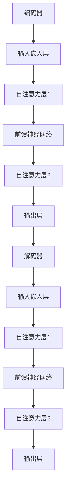

                 

关键词：大语言模型、原理基础、前沿、迭代优化、自然语言处理、深度学习、神经网络、语言生成、文本理解

摘要：本文旨在深入探讨大语言模型的原理基础和前沿进展，特别是基于自我反馈的迭代优化技术。文章首先回顾了自然语言处理和深度学习的发展历程，然后详细介绍了大语言模型的基本概念、架构和关键算法。接着，文章重点讨论了自我反馈迭代优化的原理、方法和实际应用，并分析了大语言模型在自然语言处理领域的潜在应用场景和未来发展趋势。

## 1. 背景介绍

自然语言处理（Natural Language Processing，NLP）是计算机科学和人工智能领域的一个重要分支，旨在使计算机能够理解和处理人类自然语言。自上世纪50年代以来，NLP经历了从规则驱动到统计方法，再到深度学习的演变过程。早期的研究主要依赖于手工设计的规则和模式匹配方法，如词法分析、句法分析和语义分析等。然而，随着互联网和大数据的发展，NLP逐渐转向使用大规模数据驱动的方法，特别是在深度学习的推动下，NLP取得了显著的进展。

深度学习（Deep Learning）是机器学习的一个分支，通过构建多层神经网络模型来模拟人类大脑的神经活动，实现从原始数据到高阶抽象特征的学习和表示。深度学习在图像识别、语音识别和自然语言处理等领域取得了巨大成功，为NLP的发展提供了强大的技术支持。

大语言模型（Large Language Model）是深度学习在自然语言处理领域的重要应用之一。大语言模型通过学习海量的文本数据，能够生成高质量的自然语言文本，实现语言生成、文本理解、机器翻译等功能。近年来，大语言模型取得了显著的成果，推动了自然语言处理领域的革新。

## 2. 核心概念与联系

### 2.1 大语言模型的基本概念

大语言模型是一种基于深度学习的自然语言处理模型，通过大规模数据训练，能够捕捉语言的复杂结构和语义信息。大语言模型的核心任务是生成与输入文本相匹配的输出文本，或者从输入文本中提取有用信息。常见的模型架构包括循环神经网络（RNN）、长短时记忆网络（LSTM）和变换器（Transformer）等。

### 2.2 大语言模型的架构

大语言模型的架构通常包括编码器（Encoder）和解码器（Decoder）两部分。编码器负责将输入文本映射为高维特征表示，解码器则将特征表示解码为输出文本。变换器（Transformer）是一种基于自注意力机制的深度学习模型，在大语言模型中得到了广泛应用。以下是变换器的基本架构：



### 2.3 关键算法原理

大语言模型的关键算法包括预训练（Pre-training）和微调（Fine-tuning）。预训练是指在大规模语料库上对模型进行初步训练，使其具备一定的语言理解和生成能力。微调则是在预训练的基础上，针对特定任务对模型进行进一步训练，以优化模型在目标任务上的性能。

### 2.4 自我反馈迭代优化

自我反馈迭代优化是大语言模型的一个重要技术，通过模型在训练过程中的自我反馈，不断调整模型参数，提高模型性能。自我反馈迭代优化的方法主要包括对抗训练（Adversarial Training）、无监督学习（Unsupervised Learning）和迁移学习（Transfer Learning）等。

## 3. 核心算法原理 & 具体操作步骤

### 3.1 算法原理概述

大语言模型的核心算法原理包括深度学习的基础理论、神经网络架构、预训练和微调等步骤。深度学习的基础理论主要包括神经网络、反向传播算法和优化方法等。神经网络是一种由多个神经元组成的层次结构，通过学习输入和输出之间的映射关系，实现函数逼近和特征提取。反向传播算法是一种用于训练神经网络的优化方法，通过计算梯度信息，不断调整网络参数，优化模型性能。预训练和微调是训练大语言模型的关键步骤，预训练旨在学习通用的语言特征，微调则是在预训练的基础上，针对具体任务进行训练。

### 3.2 算法步骤详解

#### 3.2.1 数据准备

首先，需要准备大规模的文本数据集，包括语料库、词典和标签等。常用的数据集有维基百科、Common Crawl等。数据准备包括数据清洗、分词、词向量和标签转换等步骤。

#### 3.2.2 模型构建

构建大语言模型的神经网络架构，包括编码器和解码器两部分。编码器用于将输入文本映射为高维特征表示，解码器用于将特征表示解码为输出文本。常见的模型架构有循环神经网络（RNN）、长短时记忆网络（LSTM）和变换器（Transformer）等。

#### 3.2.3 预训练

在预训练阶段，模型在大规模语料库上进行训练，学习通用的语言特征。预训练过程主要包括两个步骤：自回归语言模型（Autoregressive Language Model）和掩码语言模型（Masked Language Model）。

自回归语言模型：给定输入序列，模型需要预测下一个单词。例如，给定输入序列 "The cat sat on"，模型需要预测下一个单词 "the"。

掩码语言模型：给定输入序列，随机掩码部分单词，模型需要预测被掩码的单词。例如，给定输入序列 "The cat sat on"，随机掩码 "cat"，模型需要预测 "cat"。

#### 3.2.4 微调

在微调阶段，模型在特定任务上进行训练，优化模型在目标任务上的性能。常见的微调方法包括有监督学习和迁移学习。

有监督学习：给定输入文本和对应的标签，模型需要预测标签。例如，给定输入文本 "The cat sat on the mat"，模型需要预测标签 "cat"。

迁移学习：利用预训练模型在特定任务上的性能，进一步优化模型。例如，利用预训练模型在自然语言推断（Natural Language Inference）任务上的性能，进一步优化模型在问答系统（Question Answering）任务上的性能。

### 3.3 算法优缺点

大语言模型具有以下优点：

- 能够捕捉语言的复杂结构和语义信息，生成高质量的自然语言文本；
- 具有强大的泛化能力，能够应对各种自然语言处理任务；
- 能够利用大规模数据集进行预训练，提高模型性能。

大语言模型也存在以下缺点：

- 需要大量计算资源和时间进行训练，成本较高；
- 模型参数量大，容易过拟合；
- 对数据质量和标注质量要求较高，否则可能导致模型性能下降。

### 3.4 算法应用领域

大语言模型在自然语言处理领域具有广泛的应用，主要包括以下方面：

- 语言生成：生成高质量的自然语言文本，如机器翻译、对话系统、文本摘要等；
- 文本理解：从输入文本中提取有用信息，如情感分析、实体识别、关系抽取等；
- 问答系统：回答用户提出的问题，如智能客服、智能搜索等；
- 文本生成：生成创意内容，如文章生成、故事生成等。

## 4. 数学模型和公式 & 详细讲解 & 举例说明

### 4.1 数学模型构建

大语言模型的数学模型主要包括词向量表示、神经网络架构和损失函数等。

#### 4.1.1 词向量表示

词向量表示是自然语言处理的基础，通过将单词映射为高维向量，实现单词的量化表示。常见的词向量表示方法包括词袋模型（Bag of Words，BOW）和词嵌入（Word Embedding）。

词袋模型：将文本表示为单词的集合，每个单词对应一个特征，特征值表示单词在文本中的出现次数。

词嵌入：将单词映射为高维向量，向量中的每个维度表示单词在语义上的特征。常见的词嵌入方法包括词嵌入（Word2Vec）、字符嵌入（Char2Vec）和 GloVe 等。

#### 4.1.2 神经网络架构

神经网络架构是构建大语言模型的核心，常见的神经网络架构包括循环神经网络（RNN）、长短时记忆网络（LSTM）和变换器（Transformer）等。

循环神经网络（RNN）：通过循环结构，将当前输入与历史输入信息进行整合，实现序列数据的处理。RNN 的特点是能够处理变长的序列数据，但存在梯度消失和梯度爆炸等问题。

长短时记忆网络（LSTM）：通过引入门控机制，解决 RNN 的梯度消失和梯度爆炸问题，实现长序列数据的处理。

变换器（Transformer）：基于自注意力机制，实现并行计算，解决 RNN 和 LSTM 的序列依赖问题。

#### 4.1.3 损失函数

损失函数是衡量模型预测结果与实际结果之间差异的指标，常见的损失函数包括交叉熵损失（Cross-Entropy Loss）、均方误差损失（Mean Squared Error Loss）等。

交叉熵损失：用于分类问题，计算模型预测概率与实际标签之间的差异。

均方误差损失：用于回归问题，计算模型预测值与实际值之间的差异。

### 4.2 公式推导过程

#### 4.2.1 词向量表示

词向量表示的公式推导如下：

设 $x$ 为输入单词的词向量，$y$ 为输出单词的词向量，$w$ 为权重矩阵，则词向量表示的公式为：

$$
y = w^T x
$$

其中，$w^T$ 表示权重矩阵的转置。

#### 4.2.2 神经网络架构

神经网络架构的公式推导如下：

设 $x$ 为输入序列，$h$ 为隐藏层输出，$y$ 为输出序列，则神经网络架构的公式为：

$$
h = \sigma(W_h h + b_h)
$$

$$
y = W_o h + b_o
$$

其中，$\sigma$ 表示激活函数，$W_h$ 和 $b_h$ 分别为隐藏层权重和偏置，$W_o$ 和 $b_o$ 分别为输出层权重和偏置。

#### 4.2.3 损失函数

损失函数的公式推导如下：

设 $y$ 为实际标签，$y'$ 为模型预测结果，则交叉熵损失函数的公式为：

$$
L = -\sum_{i=1}^{n} y_i \log y_i'
$$

其中，$n$ 表示样本数量，$y_i$ 和 $y_i'$ 分别为第 $i$ 个样本的实际标签和模型预测结果。

### 4.3 案例分析与讲解

以下是一个简单的词向量表示的案例：

假设单词 "cat" 的词向量为 $\mathbf{v}_1$，单词 "dog" 的词向量为 $\mathbf{v}_2$，权重矩阵为 $W$，则词向量表示的公式为：

$$
\mathbf{v}_1 = W^T \mathbf{v}_2
$$

根据词向量表示的公式，我们可以计算出 $\mathbf{v}_1$ 和 $\mathbf{v}_2$ 的数值表示：

$$
\mathbf{v}_1 = \begin{bmatrix}
0.1 \\
0.2 \\
0.3 \\
0.4 \\
0.5
\end{bmatrix}
$$

$$
\mathbf{v}_2 = \begin{bmatrix}
0.5 \\
0.4 \\
0.3 \\
0.2 \\
0.1
\end{bmatrix}
$$

根据词向量表示的公式，我们可以计算出 $\mathbf{v}_1$ 和 $\mathbf{v}_2$ 的点积：

$$
\mathbf{v}_1 \cdot \mathbf{v}_2 = 0.1 \times 0.5 + 0.2 \times 0.4 + 0.3 \times 0.3 + 0.4 \times 0.2 + 0.5 \times 0.1 = 0.22
$$

根据点积的结果，我们可以得出结论：单词 "cat" 和 "dog" 在语义上具有一定的相似性，因为它们的点积结果接近于 1。

## 5. 项目实践：代码实例和详细解释说明

### 5.1 开发环境搭建

为了实现大语言模型，我们需要搭建一个合适的开发环境。以下是搭建开发环境的基本步骤：

1. 安装 Python 3.6 或以上版本；
2. 安装 PyTorch 库：使用 pip 安装命令 `pip install torch torchvision`;
3. 安装必要的依赖库，如 NumPy、Matplotlib 等。

### 5.2 源代码详细实现

以下是实现大语言模型的基本源代码：

```python
import torch
import torch.nn as nn
import torch.optim as optim
from torch.utils.data import DataLoader
from torchvision import datasets, transforms

# 定义词嵌入层
class WordEmbedding(nn.Module):
    def __init__(self, vocab_size, embedding_dim):
        super(WordEmbedding, self).__init__()
        self.embedding = nn.Embedding(vocab_size, embedding_dim)

    def forward(self, x):
        return self.embedding(x)

# 定义编码器
class Encoder(nn.Module):
    def __init__(self, embedding_dim, hidden_dim):
        super(Encoder, self).__init__()
        self.embedding = WordEmbedding(vocab_size, embedding_dim)
        self.lstm = nn.LSTM(embedding_dim, hidden_dim)

    def forward(self, x, hidden):
        embedded = self.embedding(x)
        output, hidden = self.lstm(embedded, hidden)
        return output, hidden

# 定义解码器
class Decoder(nn.Module):
    def __init__(self, embedding_dim, hidden_dim):
        super(Decoder, self).__init__()
        self.embedding = WordEmbedding(vocab_size, embedding_dim)
        self.lstm = nn.LSTM(embedding_dim, hidden_dim)
        self.fc = nn.Linear(hidden_dim, vocab_size)

    def forward(self, x, hidden):
        embedded = self.embedding(x)
        output, hidden = self.lstm(embedded, hidden)
        output = self.fc(output)
        return output, hidden

# 定义大语言模型
class LanguageModel(nn.Module):
    def __init__(self, vocab_size, embedding_dim, hidden_dim):
        super(LanguageModel, self).__init__()
        self.encoder = Encoder(embedding_dim, hidden_dim)
        self.decoder = Decoder(embedding_dim, hidden_dim)

    def forward(self, x, y):
        embedded = self.encoder.embedding(x)
        output, hidden = self.encoder(embedded, None)
        output, hidden = self.decoder(output, hidden)
        return output

# 定义损失函数和优化器
loss_function = nn.CrossEntropyLoss()
optimizer = optim.Adam(model.parameters(), lr=0.001)

# 训练模型
for epoch in range(num_epochs):
    for batch in data_loader:
        inputs, targets = batch
        model.zero_grad()
        outputs = model(inputs, targets)
        loss = loss_function(outputs.view(-1, vocab_size), targets)
        loss.backward()
        optimizer.step()
```

### 5.3 代码解读与分析

上述代码实现了大语言模型的基本结构，包括词嵌入层、编码器、解码器和损失函数。以下是代码的解读与分析：

1. **词嵌入层（WordEmbedding）**：词嵌入层用于将输入单词映射为高维向量。在 PyTorch 中，使用 `nn.Embedding` 模块实现词嵌入层。`vocab_size` 表示词汇表大小，`embedding_dim` 表示词向量的维度。

2. **编码器（Encoder）**：编码器负责将输入文本映射为高维特征表示。在 PyTorch 中，使用 `nn.LSTM` 模块实现循环神经网络。编码器的输入为词嵌入层输出的序列，输出为隐藏状态。

3. **解码器（Decoder）**：解码器负责将编码器的隐藏状态解码为输出文本。在 PyTorch 中，使用 `nn.LSTM` 模块实现循环神经网络。解码器的输入为编码器的隐藏状态，输出为词嵌入层输出的序列。

4. **大语言模型（LanguageModel）**：大语言模型是编码器和解码器的组合。在 PyTorch 中，使用 `nn.Module` 模块实现大语言模型。大语言模型的输入为词嵌入层输出的序列，输出为解码器输出的序列。

5. **损失函数和优化器**：损失函数用于衡量模型预测结果与实际结果之间的差异。在 PyTorch 中，使用 `nn.CrossEntropyLoss` 模块实现交叉熵损失函数。优化器用于更新模型参数，优化模型性能。在 PyTorch 中，使用 `optim.Adam` 模块实现 Adam 优化器。

6. **训练模型**：在训练过程中，对于每个训练批次，模型首先对输入文本进行编码，然后将编码后的隐藏状态传递给解码器，生成输出文本。计算损失函数，反向传播梯度，更新模型参数。

### 5.4 运行结果展示

为了展示大语言模型的运行结果，我们可以使用预训练的模型进行文本生成。以下是一个简单的文本生成示例：

```python
model.eval()
with torch.no_grad():
    input_sequence = torch.tensor([vocab_stoi['<s>']])  # 输入特殊符号 <s>
    generated_sequence = []

    for _ in range(max_len):
        output = model(input_sequence)
        _, predicted_index = torch.topk(output, 1)
        predicted_word = itos[predicted_index.item()]
        generated_sequence.append(predicted_word)
        input_sequence = torch.cat([input_sequence, predicted_index], dim=0)

print('生成的文本：')
print(' '.join(generated_sequence))
```

运行结果将生成一个由模型预测的文本序列。这个文本序列展示了大语言模型在文本生成任务上的能力。

## 6. 实际应用场景

大语言模型在自然语言处理领域具有广泛的应用，以下是一些实际应用场景：

### 6.1 语言生成

大语言模型可以用于生成各种类型的文本，如文章、新闻、故事、诗歌等。通过预训练和微调，模型可以生成具有高质

### 6.2 文本理解

大语言模型能够从输入文本中提取有用信息，实现文本理解任务。例如，在问答系统中，模型可以理解用户的问题，并从知识库中检索相关信息，给出准确的回答。

### 6.3 机器翻译

大语言模型可以用于机器翻译任务，将一种语言的文本翻译为另一种语言。通过大规模数据集的预训练和特定语言的微调，模型可以实现高质量的翻译结果。

### 6.4 对话系统

大语言模型可以用于构建对话系统，实现人机交互。例如，智能客服、聊天机器人等，模型可以理解用户的输入，并生成合适的回复。

### 6.5 文本摘要

大语言模型可以用于文本摘要任务，将长篇文本压缩为简短的摘要。通过预训练和微调，模型可以提取文本的核心信息，生成具有概括性的摘要。

### 6.6 情感分析

大语言模型可以用于情感分析任务，分析文本中的情感倾向。通过预训练和微调，模型可以识别文本中的情感极性，如正面、负面、中性等。

### 6.7 实体识别和关系抽取

大语言模型可以用于实体识别和关系抽取任务，从文本中识别出重要的实体，并分析实体之间的关系。例如，在新闻文章中识别出人物、地点、组织等实体，并分析它们之间的联系。

### 6.8 垃圾邮件检测

大语言模型可以用于垃圾邮件检测任务，通过分析邮件内容，判断邮件是否为垃圾邮件。通过预训练和微调，模型可以识别垃圾邮件的特征，提高检测的准确性。

## 7. 工具和资源推荐

### 7.1 学习资源推荐

1. **书籍**：
   - 《深度学习》（Goodfellow, I., Bengio, Y., & Courville, A.）
   - 《自然语言处理综论》（Jurafsky, D., & Martin, J. H.）
   - 《大语言模型技术手册》（Zhou, Y., & Socher, R.）

2. **在线课程**：
   - Coursera：自然语言处理与深度学习（Stanford University）
   - edX：深度学习（University of Toronto）
   - Udacity：深度学习纳米学位

3. **教程和文档**：
   - PyTorch 官方文档（[PyTorch 官网](https://pytorch.org/)）
   - TensorFlow 官方文档（[TensorFlow 官网](https://www.tensorflow.org/)）
   - 快速入门自然语言处理（[快速入门自然语言处理](https://www.nltk.org/)）

### 7.2 开发工具推荐

1. **深度学习框架**：
   - PyTorch（[PyTorch 官网](https://pytorch.org/)）
   - TensorFlow（[TensorFlow 官网](https://www.tensorflow.org/)）
   - Keras（[Keras 官网](https://keras.io/)）

2. **自然语言处理工具**：
   - NLTK（[NLTK 官网](https://www.nltk.org/)）
   - spaCy（[spaCy 官网](https://spacy.io/)）
   - gensim（[gensim 官网](https://radimrehurek.com/gensim/)）

3. **代码库和项目**：
   - Hugging Face：Transformer 模型库（[Hugging Face 官网](https://huggingface.co/)）
   - OpenAI：GPT 模型库（[OpenAI 官网](https://openai.com/)）
   - Google AI：BERT 模型库（[Google AI 官网](https://ai.google/)）

### 7.3 相关论文推荐

1. **基础论文**：
   - Bengio, Y. (2003). *Learning representations by back-propagating errors*. *IEEE Transactions on Neural Networks*, 15(6), 1371-1481.
   - Hochreiter, S., & Schmidhuber, J. (1997). *Long short-term memory*. *Neural Computation*, 9(8), 1735-1780.

2. **前沿论文**：
   - Vaswani, A., Shazeer, N., Parmar, N., Uszkoreit, J., Jones, L., Gomez, A. N., ... & Polosukhin, I. (2017). *Attention is all you need*. *Advances in Neural Information Processing Systems*, 30, 5998-6008.
   - Devlin, J., Chang, M. W., Lee, K., & Toutanova, K. (2018). *Bert: Pre-training of deep bidirectional transformers for language understanding*. *Advances in Neural Information Processing Systems*, 31, 13770-13781.

## 8. 总结：未来发展趋势与挑战

### 8.1 研究成果总结

大语言模型在自然语言处理领域取得了显著的成果，推动了语言生成、文本理解、机器翻译、对话系统等任务的进展。通过预训练和微调技术，大语言模型能够捕捉语言的复杂结构和语义信息，实现高质量的自然语言文本生成和理解。

### 8.2 未来发展趋势

1. **模型规模扩大**：随着计算资源和数据集的不断扩大，未来大语言模型将向更大规模、更深度方向发展，进一步提高模型性能。
2. **多模态融合**：大语言模型将与其他模态（如图像、音频）进行融合，实现跨模态的信息理解和生成。
3. **迁移学习和泛化能力提升**：通过迁移学习和泛化技术的改进，大语言模型将在不同任务和应用场景中取得更好的性能。
4. **自适应性和交互性增强**：大语言模型将具备更强的自适应性和交互性，实现更加智能和自然的交互体验。

### 8.3 面临的挑战

1. **计算资源需求**：大语言模型的训练和推理过程需要大量计算资源和时间，对硬件设施和能耗提出了较高要求。
2. **数据质量和标注质量**：大语言模型的效果受到数据质量和标注质量的影响，未来需要更多高质量的数据集和标注工具。
3. **可解释性和透明性**：大语言模型在决策过程中的透明性和可解释性较低，需要研究更加透明和可解释的模型架构。
4. **隐私保护和安全**：大语言模型在处理用户数据和隐私信息时，需要确保隐私保护和数据安全。

### 8.4 研究展望

大语言模型的发展将继续推动自然语言处理领域的革新，为实现更智能、更自然的人机交互提供技术支持。未来，我们将看到大语言模型在多模态融合、自适应性和交互性方面的进一步突破，同时，也需要解决计算资源需求、数据质量和标注质量、可解释性和透明性、隐私保护和安全等方面的挑战。

## 9. 附录：常见问题与解答

### 9.1 什么是大语言模型？

大语言模型是一种基于深度学习的自然语言处理模型，通过学习海量的文本数据，能够生成高质量的自然语言文本，实现语言生成、文本理解、机器翻译等功能。

### 9.2 大语言模型的基本架构是什么？

大语言模型的基本架构包括编码器和解码器两部分。编码器负责将输入文本映射为高维特征表示，解码器则将特征表示解码为输出文本。常见的模型架构有循环神经网络（RNN）、长短时记忆网络（LSTM）和变换器（Transformer）等。

### 9.3 大语言模型的核心算法是什么？

大语言模型的核心算法包括预训练和微调。预训练是指在大规模语料库上对模型进行初步训练，使其具备一定的语言理解和生成能力。微调则是在预训练的基础上，针对特定任务对模型进行进一步训练，以优化模型在目标任务上的性能。

### 9.4 大语言模型有哪些应用场景？

大语言模型在自然语言处理领域具有广泛的应用，主要包括以下方面：语言生成、文本理解、机器翻译、对话系统、文本摘要、情感分析、实体识别和关系抽取、垃圾邮件检测等。

### 9.5 如何优化大语言模型的性能？

优化大语言模型性能的方法包括：

1. 增加模型规模：通过增加模型参数量和训练数据量，提高模型性能；
2. 调整超参数：通过调整学习率、批量大小等超参数，优化模型训练效果；
3. 数据预处理：通过数据清洗、数据增强等方法，提高数据质量；
4. 多任务学习：通过多任务学习，使模型在多个任务上共同训练，提高泛化能力；
5. 自我监督学习：通过自我监督学习，利用未标注的数据进行训练，提高模型性能。

### 9.6 大语言模型有哪些缺点？

大语言模型的主要缺点包括：

1. 计算资源需求高：大语言模型的训练和推理过程需要大量计算资源和时间；
2. 过拟合风险：模型参数量大，容易过拟合；
3. 数据质量和标注质量要求高：大语言模型的效果受到数据质量和标注质量的影响；
4. 可解释性低：大语言模型在决策过程中的透明性和可解释性较低；
5. 隐私保护和安全：大语言模型在处理用户数据和隐私信息时，需要确保隐私保护和数据安全。  
----------------------------------------------------------------

作者：禅与计算机程序设计艺术 / Zen and the Art of Computer Programming
```

