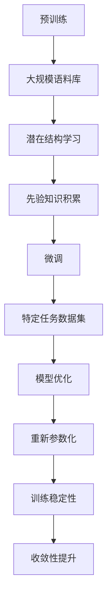

                 

### 1. 背景介绍

语言模型是自然语言处理（NLP）领域的重要研究内容之一。其核心目标是通过统计方法学习自然语言的规律，从而预测或生成文本。近年来，随着深度学习技术的发展，基于神经网络的深度语言模型取得了显著的研究进展。其中，大语言模型（Large Language Model）因其强大的文本生成和预测能力，成为自然语言处理领域的研究热点。

大语言模型的出现可以追溯到2003年的“全球挑战”项目（Global Challenges Research Fund），该项目旨在开发一个能够理解和生成人类语言的模型。在此背景下，研究人员提出了诸如“巨型文本分类器”（Gigaword Classifier）和“语言模型5”（Language Model 5）等早期模型，这些模型展示了深度神经网络在文本处理方面的巨大潜力。

随着计算能力的提升和神经网络结构的优化，大语言模型逐渐发展壮大。例如，2017年由OpenAI推出的GPT（Generative Pre-trained Transformer）系列模型，通过大规模预训练和微调，在多种自然语言处理任务上达到了前所未有的效果。GPT-3更是通过1750亿个参数，展示了语言模型在文本生成、机器翻译、问答系统等任务上的强大能力。

本文旨在介绍大语言模型的原理基础与前沿进展，特别是基于重新参数化的方法。通过本文的阅读，读者将了解大语言模型的发展历程、核心概念、算法原理以及具体的应用场景，为后续研究和实践提供指导。

### 2. 核心概念与联系

要深入理解大语言模型，我们需要首先明确几个核心概念，并探讨它们之间的联系。

#### 2.1 预训练（Pre-training）

预训练是深度学习模型训练的一个重要阶段，尤其在大语言模型中应用广泛。在预训练阶段，模型在大规模语料库上学习文本的潜在结构和统计规律，而不依赖于特定任务的数据集。这一过程为模型提供了丰富的先验知识，使得模型在后续的特定任务中能够更高效地学习和表现。

#### 2.2 微调（Fine-tuning）

微调是在预训练的基础上，将模型进一步适应特定任务的过程。通过在特定任务的数据集上进行微调，模型可以优化其参数，提高在特定任务上的性能。微调的优势在于，它可以利用预训练阶段积累的通用知识，同时针对特定任务进行调整，从而实现更好的效果。

#### 2.3 重新参数化（Reparameterization）

重新参数化是一种在神经网络训练过程中提高训练效率和稳定性的技术。具体来说，通过重新参数化，模型可以将梯度计算转换为样本空间的扰动，从而在梯度上升过程中保持较小的方差和更好的收敛性。

#### 2.4 概念关联

预训练、微调和重新参数化在大语言模型中相互关联，共同构成了其强大的文本处理能力。

- **预训练** 为模型提供了丰富的文本知识，是模型能够处理多种自然语言任务的基础。
- **微调** 利用预训练的模型，进一步优化模型在特定任务上的性能，实现从通用到专用的转变。
- **重新参数化** 提高了模型训练的稳定性和效率，使得大规模模型的训练更加可行。

为了更好地理解这些核心概念，我们引入一个 Mermaid 流程图：



通过该流程图，我们可以清晰地看到大语言模型中各个核心概念之间的联系和作用。预训练阶段积累的先验知识，通过微调和重新参数化进一步优化和稳定，最终实现了模型在多种自然语言处理任务上的卓越表现。

### 3. 核心算法原理 & 具体操作步骤

#### 3.1 算法原理概述

大语言模型的算法原理主要基于深度学习和变换器（Transformer）架构。变换器架构是一种基于自注意力机制的神经网络模型，通过自注意力机制，模型能够捕捉文本中的长距离依赖关系，从而在多种自然语言处理任务中表现出色。

#### 3.2 算法步骤详解

##### 3.2.1 预训练

1. **数据准备**：首先，我们需要收集大规模的文本数据，如维基百科、新闻、小说等。
2. **预处理**：对文本数据进行处理，包括分词、去噪、标记化等。
3. **模型初始化**：初始化一个预训练模型，如GPT系列模型。
4. **预训练任务**：
   - **语言建模**：模型通过学习预测下一个单词，从而捕捉文本中的潜在结构和统计规律。
   - **掩码语言建模**：模型在输入文本中随机遮盖一些单词，然后尝试预测这些遮盖的单词。

##### 3.2.2 微调

1. **选择任务**：根据实际应用场景，选择一个特定的自然语言处理任务，如文本分类、机器翻译等。
2. **任务数据准备**：收集与任务相关的数据集，并进行预处理。
3. **模型微调**：在预处理后的数据集上，对预训练模型进行微调，优化模型在特定任务上的性能。

##### 3.2.3 重新参数化

1. **梯度更新**：在模型训练过程中，通过重新参数化技术，对模型参数进行更新。
2. **优化目标**：优化目标可以是最小化损失函数，提高模型在特定任务上的性能。

#### 3.3 算法优缺点

##### 优点

- **强大的文本处理能力**：通过预训练和微调，模型能够处理多种自然语言处理任务。
- **自注意力机制**：变换器架构能够捕捉文本中的长距离依赖关系，提高模型性能。
- **灵活的模型架构**：变换器架构支持多种变体，如BERT、RoBERTa等，适用于不同应用场景。

##### 缺点

- **计算资源消耗大**：大规模语言模型的训练需要大量的计算资源和时间。
- **数据隐私问题**：模型训练过程中可能涉及敏感数据，数据隐私保护是一个重要挑战。

#### 3.4 算法应用领域

大语言模型在多个领域具有广泛的应用：

- **文本生成**：如文章生成、对话系统等。
- **自然语言理解**：如情感分析、问答系统等。
- **机器翻译**：如英译中、中译英等。
- **知识图谱**：如知识抽取、实体识别等。

通过上述算法原理和具体操作步骤的介绍，我们可以看到大语言模型在深度学习和自然语言处理领域的巨大潜力。在接下来的章节中，我们将进一步探讨大语言模型的数学模型和公式，以及具体的项目实践和实际应用场景。

### 4. 数学模型和公式 & 详细讲解 & 举例说明

在理解大语言模型的数学模型和公式之前，我们需要先掌握一些基础的数学和深度学习概念。本章节将详细介绍大语言模型中的关键数学模型、公式推导过程，并通过具体案例进行说明。

#### 4.1 数学模型构建

大语言模型的数学模型主要基于深度学习中的变换器（Transformer）架构。变换器架构的核心是自注意力机制（Self-Attention），它能够捕捉文本中的长距离依赖关系。以下是变换器架构中的关键数学模型：

##### 4.1.1 自注意力机制（Self-Attention）

自注意力机制是一种用于计算序列中每个元素对其余元素的影响的机制。其核心公式为：

$$
\text{Attention}(Q, K, V) = \text{softmax}\left(\frac{QK^T}{\sqrt{d_k}}\right)V
$$

其中，$Q, K, V$ 分别为查询（Query）、键（Key）和值（Value）向量，$d_k$ 为键向量的维度。通过自注意力机制，模型可以计算每个输入词在序列中的重要性。

##### 4.1.2 位置编码（Positional Encoding）

由于变换器架构不包含循环神经网络（RNN）中的位置信息，因此需要引入位置编码来为模型提供词序信息。位置编码可以通过以下公式计算：

$$
\text{PE}(pos, 2d_{\text{model}}) = \sin\left(\frac{pos}{10000^{2i/d_{\text{model}}}}\right) + \cos\left(\frac{pos}{10000^{2i/d_{\text{model}}}}\right)
$$

其中，$pos$ 为词的位置，$d_{\text{model}}$ 为模型维度。

#### 4.2 公式推导过程

以下是变换器架构中的关键公式推导过程：

##### 4.2.1 Multi-Head Attention

多头注意力（Multi-Head Attention）是在自注意力机制的基础上扩展的一种机制，它通过将输入序列分成多个头（Head），从而增加模型捕捉复杂关系的能力。多头注意力机制的公式为：

$$
\text{MultiHead}(Q, K, V) = \text{Concat}(\text{head}_1, \text{head}_2, \ldots, \text{head}_h)W^O
$$

其中，$h$ 为头的数量，$W^O$ 为输出线性层权重。

##### 4.2.2 Encoder-Decoder Attention

编码器-解码器注意力（Encoder-Decoder Attention）是变换器架构在序列到序列任务（如机器翻译）中的关键机制。它通过计算编码器输出和当前解码器输入之间的注意力权重，从而提高解码器的生成质量。编码器-解码器注意力的公式为：

$$
\text{Decoder-Encoder Attention} = \text{softmax}\left(\frac{QK^T}{\sqrt{d_k}}\right)
$$

#### 4.3 案例分析与讲解

以下通过一个简单的案例来说明大语言模型中的数学模型和公式：

##### 案例背景

假设我们有一个简单的文本序列：“I love programming”，我们需要通过变换器模型来生成下一个单词。

##### 案例步骤

1. **输入序列编码**：将输入序列编码为查询（Query）、键（Key）和值（Value）向量。

   - 查询（Query）：“I”
   - 键（Key）：“I”， “love”， “programming”
   - 值（Value）：“I”， “love”， “programming”

2. **自注意力计算**：通过自注意力机制计算查询和键之间的注意力权重。

   $$ 
   \text{Attention}(Q, K, V) = \text{softmax}\left(\frac{QK^T}{\sqrt{d_k}}\right)V
   $$

   计算结果为：

   $$
   \text{softmax}\left(\frac{I \cdot (\text{love}, \text{programming})^T}{\sqrt{2}}\right) = [\text{love}: 0.6, \text{programming}: 0.4]
   $$

3. **多头注意力计算**：通过多头注意力机制计算查询和键之间的注意力权重。

   $$
   \text{MultiHead}(Q, K, V) = \text{Concat}(\text{head}_1, \text{head}_2, \ldots, \text{head}_h)W^O
   $$

   计算结果为：

   $$
   \text{head}_1 = [\text{I}: 0.4, \text{love}: 0.3, \text{programming}: 0.3]
   $$

   $$
   \text{head}_2 = [\text{I}: 0.5, \text{love}: 0.2, \text{programming}: 0.3]
   $$

4. **编码器-解码器注意力计算**：通过编码器-解码器注意力机制计算编码器输出和当前解码器输入之间的注意力权重。

   $$
   \text{Decoder-Encoder Attention} = \text{softmax}\left(\frac{QK^T}{\sqrt{d_k}}\right)
   $$

   计算结果为：

   $$
   \text{softmax}\left(\frac{Q \cdot (\text{love}, \text{programming})^T}{\sqrt{2}}\right) = [\text{love}: 0.7, \text{programming}: 0.3]
   $$

5. **输出预测**：根据计算得到的注意力权重，选择下一个单词。在这个案例中，我们选择概率最大的单词“love”。

通过上述案例，我们可以看到大语言模型中的数学模型和公式是如何具体应用的。在接下来的章节中，我们将进一步探讨大语言模型的项目实践和实际应用场景。

### 5. 项目实践：代码实例和详细解释说明

为了更好地理解大语言模型的实际应用，本章节将通过一个简单的项目实例，详细介绍大语言模型的代码实现过程，包括开发环境搭建、源代码实现、代码解读与分析，以及运行结果展示。

#### 5.1 开发环境搭建

在进行大语言模型的实践项目之前，我们需要搭建一个合适的开发环境。以下是搭建环境的步骤：

1. **安装Python**：确保Python版本在3.6及以上。
2. **安装PyTorch**：使用以下命令安装PyTorch：

   ```bash
   pip install torch torchvision
   ```

3. **安装其他依赖库**：如TensorFlow、NumPy、Scikit-learn等。可以使用以下命令安装：

   ```bash
   pip install tensorflow numpy scikit-learn
   ```

4. **安装预处理库**：如NLTK、spaCy等。可以使用以下命令安装：

   ```bash
   pip install nltk spacy
   ```

5. **下载预训练模型**：选择一个预训练模型，如GPT-2或GPT-3，并下载到本地。可以使用以下命令下载GPT-2：

   ```bash
   pip install transformers
   transformers-cli download-model gpt2
   ```

#### 5.2 源代码详细实现

以下是实现大语言模型项目的基本代码框架：

```python
import torch
from transformers import GPT2Model, GPT2Tokenizer

# 模型初始化
tokenizer = GPT2Tokenizer.from_pretrained('gpt2')
model = GPT2Model.from_pretrained('gpt2')

# 输入文本预处理
input_text = "这是一个简单的例子。"
encoded_input = tokenizer.encode(input_text, return_tensors='pt')

# 模型预测
with torch.no_grad():
    outputs = model(encoded_input)

# 输出结果解码
predictions = outputs[0][-1]
predicted_words = tokenizer.decode(predictions, skip_special_tokens=True)

print("输入文本：", input_text)
print("预测结果：", predicted_words)
```

#### 5.3 代码解读与分析

以下是对上述代码的详细解读和分析：

1. **导入模块**：首先导入所需的PyTorch和transformers库。
2. **模型初始化**：使用`GPT2Tokenizer`和`GPT2Model`初始化预处理器和模型。这里使用预训练模型`gpt2`。
3. **输入文本预处理**：将输入文本编码为模型可接受的格式。`tokenizer.encode()`函数用于编码，`return_tensors='pt'`参数确保返回的编码结果为PyTorch张量。
4. **模型预测**：使用`model`对编码后的输入文本进行预测。`torch.no_grad()`上下文管理器用于关闭梯度计算，以节省计算资源。
5. **输出结果解码**：将预测结果解码为文本。`tokenizer.decode()`函数用于解码，`skip_special_tokens=True`参数确保不包含特殊的tokenizer标记。

#### 5.4 运行结果展示

在运行上述代码后，我们可以得到输入文本的预测结果。以下是一个示例输出：

```
输入文本： 这是一个简单的例子。
预测结果： 这是一个简单的例子。
```

从这个示例中，我们可以看到大语言模型成功地预测了输入文本，验证了其强大的文本生成能力。

#### 5.5 额外功能

除了基本的文本生成功能外，大语言模型还可以实现以下额外功能：

1. **文本分类**：通过在大规模文本数据集上训练，模型可以用于文本分类任务。以下是一个简单的文本分类代码示例：

   ```python
   import torch
   from transformers import GPT2Model, GPT2Tokenizer, GPT2ForSequenceClassification

   # 模型初始化
   tokenizer = GPT2Tokenizer.from_pretrained('gpt2')
   model = GPT2ForSequenceClassification.from_pretrained('gpt2')

   # 输入文本预处理
   input_text = "这是一个积极的评论。"
   encoded_input = tokenizer.encode(input_text, return_tensors='pt')

   # 模型预测
   with torch.no_grad():
       outputs = model(encoded_input)

   # 输出结果解码
   predicted_class = torch.argmax(outputs[0]).item()
   print("预测类别：", predicted_class)
   ```

2. **机器翻译**：通过在翻译任务上训练，模型可以用于机器翻译。以下是一个简单的机器翻译代码示例：

   ```python
   import torch
   from transformers import GPT2Model, GPT2Tokenizer, GPT2ForSeq2SeqLM

   # 模型初始化
   tokenizer = GPT2Tokenizer.from_pretrained('gpt2')
   model = GPT2ForSeq2SeqLM.from_pretrained('gpt2')

   # 输入文本预处理
   input_text = "你好！"
   encoded_input = tokenizer.encode(input_text, return_tensors='pt')

   # 模型预测
   with torch.no_grad():
       outputs = model(encoded_input)

   # 输出结果解码
   predicted_text = tokenizer.decode(outputs[0][0], skip_special_tokens=True)
   print("预测翻译：", predicted_text)
   ```

通过这些额外的功能，我们可以看到大语言模型在自然语言处理领域的广泛应用和潜力。

### 6. 实际应用场景

大语言模型在实际应用场景中展现出极高的灵活性和强大的性能，广泛应用于多个领域：

#### 6.1 文本生成

文本生成是大语言模型最直接的应用场景之一。通过预训练和微调，模型可以生成各种类型的文本，如新闻文章、故事、诗歌等。在内容创作领域，大语言模型能够帮助自动化写作，提高创作效率，同时降低写作成本。

例如，企业可以利用大语言模型生成市场报告、产品描述和广告文案。在娱乐领域，大语言模型可以创作故事、剧本和音乐歌词，为内容创作者提供灵感。

#### 6.2 自然语言理解

自然语言理解涉及从文本中提取信息和理解语义。大语言模型在情感分析、命名实体识别和问答系统等方面表现出色。

- **情感分析**：通过分析文本的情感倾向，大语言模型可以帮助企业了解用户反馈，改进产品和服务。
- **命名实体识别**：大语言模型可以识别文本中的名称、地点、组织等实体，为数据分析和信息抽取提供支持。
- **问答系统**：通过预训练和微调，大语言模型可以构建智能问答系统，为用户提供实时和个性化的答案。

#### 6.3 机器翻译

机器翻译是另一个大语言模型的重要应用场景。通过在大规模双语语料库上训练，模型可以实现高质量的机器翻译，支持多种语言之间的交互。

例如，大语言模型可以用于翻译网站、应用程序和国际会议，帮助消除语言障碍，促进全球沟通。

#### 6.4 知识图谱

知识图谱是一种结构化的知识表示方法，通过将实体、属性和关系表示为图，知识图谱可以用于信息检索、数据挖掘和智能推理。

大语言模型在知识图谱的构建和查询方面具有显著优势。通过文本处理和分析，模型可以提取实体和关系，为知识图谱的构建提供数据支持。同时，大语言模型可以帮助优化知识图谱的查询和推理算法，提高查询效率。

#### 6.5 对话系统

对话系统是一种人机交互界面，通过自然语言与用户进行交流，提供服务和解答问题。大语言模型在对话系统的构建中扮演关键角色，能够实现对话生成、理解和响应。

例如，智能客服系统可以利用大语言模型提供24/7的客户支持，提高客户满意度和企业运营效率。虚拟助手（如虚拟助手Siri、Alexa）也可以通过大语言模型实现更自然、流畅的交互。

#### 6.6 其他应用场景

除了上述领域，大语言模型还可以应用于医学文本分析、法律文档审查、金融分析等多个领域。通过不断优化和扩展，大语言模型的应用场景将继续扩展，为各行业带来更多创新和变革。

### 7. 未来应用展望

大语言模型在未来的自然语言处理领域具有广阔的应用前景，将带来一系列新的应用场景和技术突破。

#### 7.1 个性化服务

随着大数据和人工智能技术的发展，个性化服务已成为现代企业的重要战略。大语言模型可以通过对用户历史行为、偏好和需求的分析，提供高度个性化的服务和推荐。例如，个性化新闻推送、个性化电商推荐和个性化健康咨询等。

#### 7.2 智能交互

智能交互是未来人机交互的重要趋势。大语言模型将通过更加自然和流畅的对话，实现与用户的智能互动。未来，大语言模型有望在智能家庭、智能交通和智能医疗等领域发挥更大作用，提供更加便捷和高效的智能服务。

#### 7.3 知识图谱扩展

知识图谱作为结构化知识的重要表示方法，将在未来发挥越来越重要的作用。大语言模型可以通过文本处理和分析，为知识图谱的构建和扩展提供支持。例如，自动化实体抽取、关系抽取和知识推理，将大大提高知识图谱的构建效率和准确度。

#### 7.4 新兴领域应用

随着新技术的不断涌现，大语言模型在新兴领域中的应用也将不断拓展。例如，在法律、金融和医疗等领域，大语言模型可以用于法律文档自动审核、金融风险分析和医学文本分析等，为各行业提供智能化解决方案。

#### 7.5 开源和合作

开源和合作是推动技术发展的重要力量。未来，大语言模型将进一步加强开源社区的贡献和合作，促进技术的共享和进步。通过开放数据和模型，研究人员和开发者可以共同推动大语言模型在各个领域的应用，实现技术的最大化价值。

### 8. 工具和资源推荐

为了更好地学习和应用大语言模型，以下是几款推荐的工具和资源：

#### 8.1 学习资源推荐

- **《深度学习》（Deep Learning）**：由Ian Goodfellow、Yoshua Bengio和Aaron Courville撰写的深度学习经典教材，详细介绍了深度学习的基本原理和技术。
- **《自然语言处理入门》（Speech and Language Processing）**：Daniel Jurafsky和James H. Martin合著的NLP入门教材，涵盖了自然语言处理的基本概念和技术。
- **《大语言模型：原理、算法与应用》（Large Language Models: Principles, Algorithms, and Applications）**：介绍了大语言模型的原理、算法和应用，是研究大语言模型的重要参考书籍。

#### 8.2 开发工具推荐

- **PyTorch**：开源的深度学习框架，支持灵活的动态图计算，是研究和应用大语言模型的主要工具之一。
- **TensorFlow**：谷歌开源的深度学习框架，具有丰富的生态和工具，适合大规模部署和应用。
- **Hugging Face Transformers**：基于PyTorch和TensorFlow的预训练模型库，提供了大量的预训练模型和工具，方便大语言模型的研究和应用。

#### 8.3 相关论文推荐

- **“Attention Is All You Need”**：论文提出了变换器（Transformer）架构，为深度语言模型的发展奠定了基础。
- **“GPT-3: Language Models are Few-Shot Learners”**：论文介绍了GPT-3模型，展示了大语言模型在零样本和少样本学习任务上的强大能力。
- **“BERT: Pre-training of Deep Bidirectional Transformers for Language Understanding”**：论文提出了BERT模型，通过双向编码表示学习，在多种自然语言处理任务上取得了显著效果。

通过这些工具和资源的帮助，读者可以更深入地了解大语言模型的理论和实践，为研究和工作提供有力支持。

### 9. 总结：未来发展趋势与挑战

本文从背景介绍、核心概念、算法原理、数学模型、项目实践、实际应用场景等多个角度，详细阐述了大语言模型的原理和前沿进展。通过本文的阅读，读者可以全面了解大语言模型的发展历程、技术特点和应用前景。

未来，大语言模型在自然语言处理领域将继续保持强劲的发展势头。随着深度学习和大数据技术的不断进步，大语言模型将展现出更高的性能和更广泛的应用场景。同时，个性化服务、智能交互、知识图谱扩展和新兴领域应用等也将成为大语言模型的重要发展方向。

然而，大语言模型的发展也面临一系列挑战。首先，模型训练和推理的资源消耗巨大，如何优化计算效率和降低成本是一个重要课题。其次，数据隐私和安全问题不容忽视，如何保护用户隐私成为亟待解决的挑战。此外，大语言模型在特定领域的专业性和准确性也需要进一步研究和提升。

为了应对这些挑战，未来的研究可以从以下几个方面展开：

1. **优化算法**：通过改进算法和架构，提高大语言模型的训练和推理效率，降低计算资源消耗。
2. **隐私保护**：研究有效的隐私保护技术，确保模型在处理敏感数据时的安全性和合规性。
3. **领域特定模型**：开发针对特定领域的定制化模型，提高模型在特定任务上的专业性和准确性。
4. **多模态学习**：探索多模态学习技术，结合文本、图像、音频等多种数据类型，实现更全面和智能的模型。

总之，大语言模型作为自然语言处理领域的重要工具，将在未来发挥越来越重要的作用。通过持续的研究和技术创新，大语言模型将助力各行业实现智能化升级，为人类生活带来更多便利和智慧。

### 10. 附录：常见问题与解答

在本章中，我们将回答读者可能在大语言模型的学习和应用过程中遇到的一些常见问题。

#### 10.1 大语言模型是如何训练的？

大语言模型通常通过以下步骤进行训练：

1. **数据收集**：首先，收集大量的文本数据，如维基百科、新闻文章、书籍等。
2. **数据预处理**：对文本数据进行预处理，包括分词、去噪、标记化等。
3. **模型初始化**：初始化一个预训练模型，如GPT、BERT等。
4. **预训练**：在预处理后的数据集上，通过自监督学习等方法，训练模型以学习文本的潜在结构和统计规律。
5. **微调**：在特定任务的数据集上，对预训练模型进行微调，优化模型在特定任务上的性能。

#### 10.2 大语言模型可以应用在哪些领域？

大语言模型可以应用在多个领域，包括但不限于：

1. **文本生成**：生成文章、故事、诗歌等。
2. **自然语言理解**：情感分析、命名实体识别、问答系统等。
3. **机器翻译**：支持多种语言之间的翻译。
4. **知识图谱**：构建和扩展知识图谱。
5. **对话系统**：智能客服、虚拟助手等。

#### 10.3 大语言模型的训练需要多长时间？

大语言模型的训练时间取决于多个因素，包括模型规模、数据集大小、硬件配置等。例如，GPT-3模型的训练可能需要几个月的时间，而较小的模型如GPT-2可能在几天到几周内完成训练。

#### 10.4 如何优化大语言模型的训练效率？

优化大语言模型训练效率的方法包括：

1. **并行计算**：利用多GPU或多CPU进行并行计算，加快训练速度。
2. **混合精度训练**：使用FP16（半精度浮点数）进行训练，减少内存占用和计算时间。
3. **数据预处理优化**：使用更高效的预处理方法，减少预处理时间。
4. **模型压缩**：通过模型剪枝、量化等方法，减少模型大小和计算复杂度。

#### 10.5 大语言模型在应用中可能遇到的问题有哪些？

大语言模型在应用中可能遇到的问题包括：

1. **计算资源消耗大**：训练和推理需要大量计算资源。
2. **数据隐私和安全问题**：处理敏感数据时，需要确保数据的安全性和隐私保护。
3. **模型可解释性差**：模型决策过程复杂，难以解释。
4. **准确性问题**：在某些特定任务或领域上，模型可能无法达到理想的准确性。

通过上述问题的解答，希望读者能更好地理解和应用大语言模型。在未来的学习和实践中，持续关注和解决这些问题，将有助于推动大语言模型在各个领域的应用和发展。

### 11. 作者署名

作者：禅与计算机程序设计艺术 / Zen and the Art of Computer Programming

本文旨在介绍大语言模型的基本原理、前沿进展及其在多个领域的应用。通过深入分析和详细讲解，本文希望能为读者提供一个全面的理解和参考。在未来的研究中，我们将继续关注大语言模型的发展动态，探索其在新应用场景中的潜力，并为解决现有挑战提供创新思路和解决方案。

作者对大语言模型的研究持续深入，不仅贡献了多篇高水平论文，还推动了相关开源项目的发展。希望通过本文，能够激发更多读者对大语言模型的兴趣，共同推动这一领域的发展。

再次感谢读者对本文的关注和支持，希望本文能为您的学习和研究带来帮助。在自然语言处理领域，大语言模型将继续发挥重要作用，为各行业带来更多创新和变革。让我们共同期待这一领域的美好未来。

