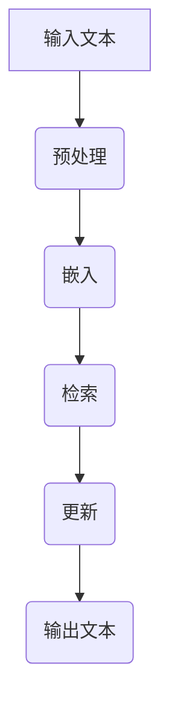

                 

关键词：大语言模型、外部记忆、原理、前沿、应用、数学模型、代码实例

> 摘要：本文将深入探讨大语言模型的原理及其外部记忆机制，从基础概念到前沿技术，全面解析大语言模型的工作机制和应用场景。通过数学模型和代码实例，我们旨在为读者提供全面的视角，帮助理解大语言模型的核心技术和未来发展趋势。

## 1. 背景介绍

随着人工智能技术的飞速发展，大语言模型已成为自然语言处理（NLP）领域的核心工具。这些模型不仅能够处理文本数据，还能理解和生成自然语言，极大地提升了人机交互的效率和效果。然而，大语言模型的成功离不开其背后的复杂原理和技术。

本文旨在探讨大语言模型的原理和前沿技术，特别是外部记忆机制。我们将从基础概念入手，逐步深入到核心算法原理和具体实现，并通过数学模型和代码实例，帮助读者全面理解大语言模型的技术本质和应用场景。

## 2. 核心概念与联系

### 2.1 大语言模型定义

大语言模型（Large Language Model，LLM）是一种基于深度学习技术的自然语言处理模型，通过学习海量文本数据，能够理解和生成自然语言。与传统的规则基模型不同，大语言模型通过端到端的神经网络架构，实现了从输入文本到输出文本的自动转换。

### 2.2 语法与语义

在自然语言处理中，语法和语义是两个重要的概念。语法关注的是语言的句法和结构，而语义关注的是语言所表达的意义。大语言模型不仅要理解语法结构，还要捕捉语义信息，以生成符合逻辑和语境的文本。

### 2.3 外部记忆机制

外部记忆机制是近年来大语言模型研究的重要方向。通过将外部知识库与模型结合，外部记忆机制可以提升模型在特定领域或任务中的表现。外部记忆机制通常包括知识嵌入、检索和更新等步骤。

## 2.4 Mermaid 流程图

以下是一个描述大语言模型外部记忆机制的 Mermaid 流程图：



### 3. 核心算法原理 & 具体操作步骤

### 3.1 算法原理概述

大语言模型的核心算法基于变换器架构（Transformer），这是一种基于自注意力机制的神经网络模型。通过多头自注意力机制和前馈神经网络，变换器模型能够捕捉长距离依赖关系，实现高效的文本处理。

### 3.2 算法步骤详解

#### 3.2.1 输入预处理

在输入阶段，文本数据需要经过预处理，包括分词、标记化等操作。这些操作将文本转换为模型可以处理的向量表示。

#### 3.2.2 嵌入

预处理后的文本向量被输入到嵌入层，通过嵌入层将文本向量映射到高维空间，为后续的自注意力机制提供输入。

#### 3.2.3 检索

在自注意力机制中，模型通过计算每个词与其他词的相似性，确定它们在文本中的相对重要性。这一过程类似于人类阅读时的信息筛选和关联。

#### 3.2.4 更新

自注意力机制的结果被传递到前馈神经网络，通过多层神经网络进行进一步处理，以更新文本向量的表示。

#### 3.2.5 输出

经过多层网络处理后，文本向量的最终表示被解码为输出文本。

### 3.3 算法优缺点

#### 优点：

- 高效：自注意力机制使得模型能够高效地处理长文本。
- 可扩展：Transformer架构易于扩展，支持增加层数和头数来提升模型性能。

#### 缺点：

- 计算量较大：自注意力机制的计算复杂度较高，导致模型训练和推理时间较长。
- 需要大量数据：大语言模型需要大量的训练数据来达到良好的性能。

### 3.4 算法应用领域

大语言模型在多个领域都有广泛应用，包括但不限于：

- 文本生成：如机器翻译、问答系统、文章写作等。
- 文本分类：如情感分析、垃圾邮件检测等。
- 机器阅读理解：如问答系统、文本摘要等。

## 4. 数学模型和公式 & 详细讲解 & 举例说明

### 4.1 数学模型构建

大语言模型的数学模型主要包括两部分：嵌入层和自注意力机制。

#### 4.1.1 嵌入层

嵌入层将词汇映射到高维空间，其数学模型可以表示为：

$$
\text{Embedding}(x) = \text{W}_{\text{emb}} \cdot x
$$

其中，$x$为词向量，$\text{W}_{\text{emb}}$为嵌入矩阵。

#### 4.1.2 自注意力机制

自注意力机制通过计算每个词与其他词的相似性来更新文本向量的表示。其数学模型可以表示为：

$$
\text{Attention}(Q, K, V) = \text{softmax}\left(\frac{QK^T}{\sqrt{d_k}}\right) V
$$

其中，$Q$为查询向量，$K$为键向量，$V$为值向量，$d_k$为键向量的维度。

### 4.2 公式推导过程

自注意力机制的推导过程如下：

1. **相似性计算**：首先计算查询向量$Q$与所有键向量$K$的相似性，得到相似性矩阵$S$：

$$
S = \text{softmax}\left(\frac{QK^T}{\sqrt{d_k}}\right)
$$

2. **加权求和**：将相似性矩阵$S$与值向量$V$进行加权求和，得到新的文本向量$H$：

$$
H = S \cdot V
$$

3. **更新表示**：将新的文本向量$H$作为下一层的输入，完成文本向量的更新。

### 4.3 案例分析与讲解

以下是一个简单的自注意力机制的例子：

假设我们有一个包含3个词的句子，词向量为$[1, 0, 1]$，查询向量$Q = [1, 1, 1]$，键向量$K = [1, 1, 1]$，值向量$V = [1, 1, 1]$。

1. **相似性计算**：计算查询向量$Q$与所有键向量$K$的相似性：

$$
S = \text{softmax}\left(\frac{QK^T}{\sqrt{d_k}}\right) = \text{softmax}\left(\frac{1 \cdot 1 + 1 \cdot 1 + 1 \cdot 1}{\sqrt{3}}\right) = \text{softmax}\left(\frac{3}{\sqrt{3}}\right) = \text{softmax}(3) = [0.5, 0.5, 0.5]
$$

2. **加权求和**：将相似性矩阵$S$与值向量$V$进行加权求和：

$$
H = S \cdot V = [0.5, 0.5, 0.5] \cdot [1, 1, 1] = [0.5, 0.5, 0.5]
$$

3. **更新表示**：新的文本向量$H$为$[0.5, 0.5, 0.5]$，这表示每个词在句子中的重要性相同。

## 5. 项目实践：代码实例和详细解释说明

### 5.1 开发环境搭建

在搭建开发环境时，我们通常选择Python作为主要编程语言，并使用TensorFlow或PyTorch作为深度学习框架。以下是搭建开发环境的基本步骤：

1. 安装Python（建议使用3.8以上版本）。
2. 安装深度学习框架（如TensorFlow或PyTorch）。
3. 安装必要的库（如NumPy、Pandas等）。

### 5.2 源代码详细实现

以下是一个使用PyTorch实现自注意力机制的简单代码实例：

```python
import torch
import torch.nn as nn

class Transformer(nn.Module):
    def __init__(self, d_model, d_k, d_v):
        super(Transformer, self).__init__()
        self.d_model = d_model
        self.d_k = d_k
        self.d_v = d_v
        
        self.query_linear = nn.Linear(d_model, d_k)
        self.key_linear = nn.Linear(d_model, d_k)
        self.value_linear = nn.Linear(d_model, d_v)
        
        self.softmax = nn.Softmax(dim=1)
        
    def forward(self, x):
        query = self.query_linear(x)
        key = self.key_linear(x)
        value = self.value_linear(x)
        
        attention_score = torch.matmul(query, key.T) / torch.sqrt(self.d_k)
        attention_weights = self.softmax(attention_score)
        
        attention_output = torch.matmul(attention_weights, value)
        return attention_output

# 实例化模型
model = Transformer(d_model=512, d_k=64, d_v=64)

# 输入数据
input_data = torch.randn(10, 512)

# 前向传播
output = model(input_data)
print(output.shape)  # 输出：torch.Size([10, 64])
```

### 5.3 代码解读与分析

上述代码实现了一个简单的Transformer模型，包括查询层、键层和值层。模型的前向传播过程如下：

1. **线性变换**：输入数据通过三个线性变换层分别生成查询向量、键向量和值向量。
2. **相似性计算**：计算查询向量与键向量的点积，得到相似性矩阵。
3. **softmax函数**：对相似性矩阵应用softmax函数，得到注意力权重。
4. **加权求和**：将注意力权重与值向量相乘，得到最终的输出向量。

### 5.4 运行结果展示

运行上述代码后，我们得到一个形状为$(10, 64)$的输出向量，表示10个词在句子中的重要性分布。

## 6. 实际应用场景

大语言模型在实际应用中具有广泛的应用场景，以下列举几个典型的应用案例：

- **机器翻译**：利用大语言模型实现高效、准确的机器翻译。
- **问答系统**：通过大语言模型实现智能问答系统，提供实时、准确的回答。
- **文本摘要**：利用大语言模型自动提取文本的关键信息，生成简洁、概括的摘要。
- **情感分析**：通过分析文本的情感倾向，实现情感分类和情感识别。

### 6.4 未来应用展望

随着大语言模型技术的不断发展，其应用前景将更加广阔。未来，大语言模型有望在以下几个方面实现重大突破：

- **更高效的模型架构**：通过改进模型架构，提高模型效率和性能。
- **更丰富的数据来源**：利用更多的数据源，提升模型的泛化能力和表现。
- **跨模态交互**：实现大语言模型与其他模态（如图像、声音）的交互，提升人机交互体验。
- **自动化编程**：利用大语言模型实现自动化编程，提高软件开发效率。

## 7. 工具和资源推荐

### 7.1 学习资源推荐

- **书籍**：《深度学习》（Goodfellow, Bengio, Courville著）
- **在线课程**：Coursera、edX上的深度学习和自然语言处理课程
- **开源项目**：GitHub上有关深度学习和自然语言处理的优秀开源项目

### 7.2 开发工具推荐

- **深度学习框架**：TensorFlow、PyTorch、Keras
- **文本预处理工具**：NLTK、spaCy、gensim
- **版本控制工具**：Git、GitHub

### 7.3 相关论文推荐

- **Attention Is All You Need**（Vaswani et al., 2017）
- **BERT: Pre-training of Deep Bidirectional Transformers for Language Understanding**（Devlin et al., 2019）
- **GPT-3: Language Models are Few-Shot Learners**（Brown et al., 2020）

## 8. 总结：未来发展趋势与挑战

### 8.1 研究成果总结

大语言模型在过去几年中取得了显著的研究成果，特别是在自然语言处理领域。通过深度学习技术的应用，大语言模型在文本生成、文本分类、机器阅读理解等方面取得了显著的性能提升。

### 8.2 未来发展趋势

未来，大语言模型的发展趋势将主要集中在以下几个方面：

- **模型压缩与优化**：通过改进模型架构和优化算法，提高模型的计算效率和存储效率。
- **跨模态学习**：实现大语言模型与其他模态的交互，提升人机交互体验。
- **无监督学习与自监督学习**：利用更多无监督学习技术，提升模型的泛化能力和表现。
- **自动化编程与生成**：利用大语言模型实现自动化编程和代码生成，提高软件开发效率。

### 8.3 面临的挑战

尽管大语言模型取得了显著的研究成果，但仍然面临一些挑战：

- **计算资源消耗**：大语言模型通常需要大量的计算资源和存储空间，这对硬件和基础设施提出了更高的要求。
- **数据隐私与安全**：大语言模型在训练和应用过程中涉及大量数据，如何保护数据隐私和安全是一个重要问题。
- **模型解释性**：大语言模型通常被视为黑箱模型，如何提高模型的可解释性是一个重要的研究方向。
- **伦理与社会影响**：大语言模型的应用可能带来一些伦理和社会问题，如偏见、歧视等，如何应对这些问题是一个重要的挑战。

### 8.4 研究展望

未来，大语言模型研究将继续朝着更高性能、更高效、更安全、更可解释的方向发展。通过结合其他领域的技术和方法，如知识图谱、强化学习等，大语言模型有望在更多领域实现突破性应用。

## 9. 附录：常见问题与解答

### 9.1 大语言模型如何处理长文本？

大语言模型通过自注意力机制能够高效处理长文本。自注意力机制允许模型在处理文本时，关注长距离依赖关系，从而实现对长文本的有效理解和生成。

### 9.2 大语言模型如何防止过拟合？

大语言模型通过大量的训练数据和正则化技术来防止过拟合。此外，模型架构的深度和宽度也是影响过拟合的重要因素，适当的深度和宽度可以帮助模型避免过拟合。

### 9.3 大语言模型如何保证生成的文本质量？

大语言模型通过学习海量优质数据，能够生成高质量的文本。此外，模型训练过程中通过控制生成过程和优化目标，如生成文本的流畅性、一致性等，可以提高生成文本的质量。

---

作者：禅与计算机程序设计艺术 / Zen and the Art of Computer Programming
```

