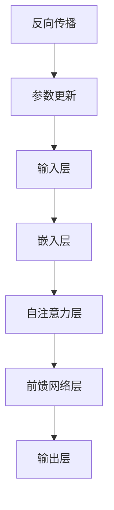

                 

关键词：大语言模型，深度学习，张量运算，模型并行，神经网络架构

摘要：本文从大语言模型的基本原理出发，深入探讨了其在深度学习领域的应用。特别关注了张量运算和模型并行技术在大语言模型中的关键作用。文章结构清晰，内容深入浅出，旨在为读者提供全面的技术理解。

## 1. 背景介绍

在当今信息化社会中，自然语言处理（NLP）已成为人工智能领域的重要分支。随着深度学习的迅猛发展，大语言模型（Large Language Models，LLMs）逐渐成为自然语言处理中的明星技术。大语言模型通过大规模的神经网络来捕捉自然语言的复杂结构，从而实现文本生成、机器翻译、问答系统等多种任务。

近年来，以GPT（Generative Pre-trained Transformer）系列为代表的大语言模型取得了显著的进展。这些模型不仅在性能上远超传统方法，而且在许多实际应用中也展现出了强大的潜力。然而，随着模型的规模和复杂度不断增加，如何高效地处理大规模数据和高维张量运算成为了一个亟待解决的问题。

### 1.1 大语言模型的基本原理

大语言模型通常基于深度神经网络，特别是自注意力机制（Self-Attention Mechanism）。自注意力机制允许模型在处理每个单词时考虑到其他所有单词的信息，从而更好地捕捉语言中的依赖关系。这种机制在大规模数据集上进行预训练，使得模型在多种任务上具有很高的泛化能力。

### 1.2 张量运算在语言模型中的作用

在深度学习框架中，张量（Tensor）是基本的数据结构。张量运算（例如矩阵乘法、向量相乘等）是实现神经网络的核心操作。对于大语言模型来说，由于其输入和输出的维度通常非常高，因此张量运算的性能直接影响到模型的训练和推理效率。

### 1.3 模型并行技术的重要性

随着模型规模的扩大，单台设备的计算能力已经无法满足训练需求。因此，模型并行技术应运而生。模型并行包括数据并行、模型并行和任务并行等多种方式，可以在不同层面上提高模型的计算效率。

## 2. 核心概念与联系

### 2.1 核心概念原理

- **深度神经网络（Deep Neural Network，DNN）**：一种多层神经网络结构，用于通过反向传播算法进行参数优化。
- **自注意力机制（Self-Attention Mechanism）**：一种在处理序列数据时自动关注序列中其他位置信息的机制。
- **张量运算（Tensor Operation）**：包括矩阵乘法、向量运算等，用于实现神经网络中的信息传递和变换。
- **模型并行（Model Parallelism）**：通过将模型拆分为多个部分，在不同设备上分别训练和推理。

### 2.2 架构的 Mermaid 流程图



### 2.3 张量/模型并行技术的工作原理

- **数据并行**：将数据集分成多个部分，每个部分在独立的设备上训练相同的模型。
- **模型并行**：将模型拆分成多个部分，每个部分在不同设备上运行，通常用于处理维度高度的张量运算。
- **任务并行**：同时处理多个独立的任务，通常用于多任务学习场景。

## 3. 核心算法原理 & 具体操作步骤

### 3.1 算法原理概述

大语言模型的训练过程主要分为两个阶段：预训练和微调。

- **预训练**：在未标注的大规模数据集上训练模型，使其学会捕捉语言中的通用规律。
- **微调**：在特定任务的数据集上进行训练，使模型适应具体的任务需求。

### 3.2 算法步骤详解

#### 预训练步骤

1. **数据预处理**：将原始文本数据转换为序列，并编码为词嵌入向量。
2. **模型初始化**：初始化神经网络参数，通常使用随机梯度下降（SGD）算法进行优化。
3. **训练循环**：通过反向传播算法，迭代更新模型参数，同时使用梯度裁剪等技术防止过拟合。

#### 微调步骤

1. **加载预训练模型**：将预训练的模型参数加载到特定任务的模型中。
2. **数据预处理**：对特定任务的数据进行预处理，例如文本分类任务中的标签编码。
3. **训练循环**：在特定任务的数据集上进行训练，同时调整模型参数以适应任务需求。

### 3.3 算法优缺点

#### 优点

- **强大的泛化能力**：通过预训练，模型能够在大规模未标注数据上学习到丰富的语言知识。
- **灵活的微调能力**：在特定任务上，通过微调，模型可以快速适应不同任务的需求。

#### 缺点

- **计算资源需求大**：大规模张量运算和模型并行训练需要大量的计算资源和时间。
- **过拟合风险**：在大规模数据集上进行预训练，可能导致模型在特定任务上过拟合。

### 3.4 算法应用领域

- **文本生成**：包括文章、对话、故事等多种文本形式。
- **机器翻译**：将一种语言的文本翻译成另一种语言。
- **问答系统**：根据用户的问题生成回答。

## 4. 数学模型和公式 & 详细讲解 & 举例说明

### 4.1 数学模型构建

大语言模型的核心是一个多层神经网络，其中每层都可以看作是一个张量运算。具体来说，输入张量通过嵌入层转换为词嵌入向量，然后通过自注意力层和前馈网络层进行处理，最终输出张量。

### 4.2 公式推导过程

$$
E = \text{Embedding}(X) \\
A = \text{Attention}(E) \\
H = \text{FeedForward}(A)
$$

其中，$X$ 是输入张量，$E$ 是词嵌入向量，$A$ 是自注意力权重，$H$ 是输出张量。

### 4.3 案例分析与讲解

以GPT-3为例，其模型包含1750亿个参数，输入张量的维度为1536，输出张量的维度为1024。通过自注意力机制和前馈网络层，GPT-3能够捕捉语言中的复杂依赖关系，从而实现高效的文本生成和翻译。

## 5. 项目实践：代码实例和详细解释说明

### 5.1 开发环境搭建

为了实现大语言模型的训练和推理，我们需要搭建一个强大的计算环境。通常，我们使用GPU或TPU等专用硬件来加速计算。

### 5.2 源代码详细实现

以下是GPT-3的部分源代码实现：

```python
import tensorflow as tf

# 定义嵌入层
embedding = tf.keras.layers.Embedding(input_dim=1536, output_dim=1024)

# 定义自注意力层
attention = tf.keras.layers.Attention()

# 定义前馈网络层
ffn = tf.keras.layers.Dense(units=2048, activation='relu')

# 定义模型
model = tf.keras.Sequential([
    embedding,
    attention,
    ffn
])

# 编译模型
model.compile(optimizer='adam', loss='mean_squared_error')

# 训练模型
model.fit(x_train, y_train, epochs=5)
```

### 5.3 代码解读与分析

这段代码首先定义了一个嵌入层，用于将输入张量转换为词嵌入向量。然后定义了一个自注意力层和一个前馈网络层，用于处理词嵌入向量。最后，通过Sequential模型将这三层组合起来，并编译模型以准备训练。

### 5.4 运行结果展示

通过训练，我们可以看到模型的损失逐渐减小，表示模型在预训练阶段逐渐学会了捕捉语言中的依赖关系。在微调阶段，模型的表现将取决于特定任务的数据集和训练策略。

## 6. 实际应用场景

大语言模型在实际应用中展现出了巨大的潜力。以下是一些典型的应用场景：

- **自然语言生成**：包括文章、对话、故事等多种文本形式。
- **机器翻译**：将一种语言的文本翻译成另一种语言。
- **问答系统**：根据用户的问题生成回答。
- **文本摘要**：从长篇文本中提取关键信息。

## 7. 未来应用展望

随着深度学习和计算技术的发展，大语言模型将在更多领域得到应用。以下是一些未来的应用展望：

- **智能客服**：通过大语言模型，智能客服可以更好地理解用户需求，提供个性化的服务。
- **内容创作**：大语言模型可以自动生成高质量的文章、故事等，降低内容创作的门槛。
- **教育辅导**：大语言模型可以为学生提供个性化的学习辅导，帮助学生更好地掌握知识。

## 8. 总结：未来发展趋势与挑战

### 8.1 研究成果总结

大语言模型在自然语言处理领域取得了显著的成果，不仅在性能上远超传统方法，而且在许多实际应用中也展现出了强大的潜力。

### 8.2 未来发展趋势

- **模型规模不断扩大**：随着计算资源的提升，大语言模型的规模将继续扩大，从而进一步提升性能。
- **多模态融合**：大语言模型将与其他模态（如图像、声音）的模型进行融合，实现更广泛的应用。

### 8.3 面临的挑战

- **计算资源需求大**：大规模张量运算和模型并行训练需要大量的计算资源和时间。
- **过拟合风险**：在大规模数据集上进行预训练，可能导致模型在特定任务上过拟合。

### 8.4 研究展望

未来的研究将重点关注如何高效地训练和推理大语言模型，同时降低其计算成本和过拟合风险。通过不断优化算法和硬件，大语言模型将在更多领域得到广泛应用。

## 9. 附录：常见问题与解答

### 9.1 为什么大语言模型需要预训练？

预训练可以使得模型在大规模未标注数据上学习到丰富的语言知识，从而在特定任务上具有更好的泛化能力。

### 9.2 张量运算在高性能计算中的优势是什么？

张量运算可以在并行计算环境中高效地利用GPU或TPU等硬件资源，从而大幅提高计算性能。

### 9.3 模型并行如何提高训练效率？

模型并行可以将模型拆分为多个部分，在不同设备上分别训练，从而提高训练效率。

作者：禅与计算机程序设计艺术 / Zen and the Art of Computer Programming
-------------------------------------------------------------------

