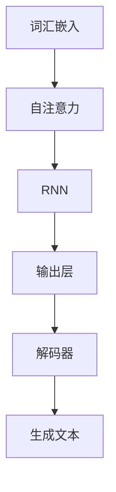

                 

关键词：大语言模型、自然语言处理、深度学习、人工智能、算法原理、数学模型、项目实践、应用场景、未来展望。

> 摘要：本文将深入探讨大语言模型的原理基础和前沿发展，包括核心概念、算法原理、数学模型、项目实践等方面。通过详细的分析和实例讲解，揭示大语言模型在自然语言处理领域的重要作用和广阔的应用前景。

## 1. 背景介绍

随着人工智能技术的飞速发展，自然语言处理（NLP）作为人工智能领域的一个重要分支，逐渐成为研究和应用的热点。在NLP中，语言模型是理解和生成自然语言的核心工具。传统语言模型如N-gram模型、概率语言模型等，虽然在特定场景下表现出一定的效果，但存在词汇限制、上下文理解不足等问题。

近年来，随着深度学习技术的进步，大语言模型（如GPT、BERT等）逐渐崭露头角，展现出了强大的语义理解和生成能力。大语言模型通过对海量文本数据的学习，能够自动捕捉语言规律，生成高质量的自然语言文本。这为自然语言处理带来了新的机遇和挑战。

本文将从大语言模型的核心概念、算法原理、数学模型、项目实践等方面进行深入探讨，旨在为读者提供一份全面的技术指南，帮助理解和应用大语言模型。

## 2. 核心概念与联系

### 2.1. 语言模型

语言模型是一种概率模型，用于预测下一个单词或字符的概率。在NLP中，语言模型是理解和生成自然语言的核心工具。

### 2.2. 随机游走

随机游走是一种生成文本的算法，它通过模拟语言中的词汇转移过程，生成连续的文本序列。

### 2.3. 递归神经网络（RNN）

递归神经网络是一种能够处理序列数据的神经网络，常用于构建语言模型。RNN通过在时间步之间传递信息，实现序列数据的建模。

### 2.4. 自注意力机制

自注意力机制是一种能够自动关注序列中重要信息的机制，常用于构建大规模语言模型。它通过计算序列中每个元素之间的关联性，实现信息的自动聚合。

### 2.5. 词汇嵌入

词汇嵌入是一种将单词映射到低维向量空间的方法，用于表示单词的语义信息。词汇嵌入是语言模型的重要基础。

### 2.6. Mermaid 流程图

以下是一个简单的 Mermaid 流程图，用于展示大语言模型的架构：



## 3. 核心算法原理 & 具体操作步骤

### 3.1. 算法原理概述

大语言模型的核心算法是基于深度学习和自注意力机制的。深度学习通过多层神经网络实现特征提取和建模，自注意力机制通过自动关注序列中的关键信息，实现序列数据的建模。

### 3.2. 算法步骤详解

1. **数据预处理**：对文本数据进行分析，去除标点符号、停用词等，将文本转化为单词序列。

2. **词汇嵌入**：将单词映射到低维向量空间，为每个单词分配一个唯一的向量表示。

3. **自注意力计算**：计算序列中每个元素之间的关联性，实现信息的自动聚合。

4. **RNN处理**：通过递归神经网络处理序列数据，实现序列的建模。

5. **解码与生成**：使用解码器生成文本序列，通过反向传播优化模型参数。

### 3.3. 算法优缺点

**优点**：

- **强大的语义理解能力**：大语言模型通过深度学习和自注意力机制，能够自动捕捉语言规律，实现高质量的语义理解。
- **生成文本能力强**：大语言模型能够生成连贯、有意义的自然语言文本。

**缺点**：

- **计算成本高**：大语言模型训练和推理过程需要大量的计算资源。
- **数据依赖性强**：大语言模型的效果依赖于训练数据的规模和质量。

### 3.4. 算法应用领域

大语言模型在自然语言处理领域具有广泛的应用，包括：

- **文本生成**：生成新闻文章、小说、代码等。
- **文本分类**：对文本进行分类，如情感分析、主题分类等。
- **机器翻译**：将一种语言的文本翻译成另一种语言。
- **对话系统**：构建自然语言理解与生成的对话系统。

## 4. 数学模型和公式 & 详细讲解 & 举例说明

### 4.1. 数学模型构建

大语言模型的数学模型主要包括词汇嵌入、自注意力机制和递归神经网络。

- **词汇嵌入**：假设词汇表中有 \(V\) 个单词，每个单词映射到一个 \(d\) 维向量，即 \(e_v \in \mathbb{R}^d\)。
- **自注意力机制**：自注意力机制通过计算序列中每个元素之间的关联性，计算一个加权平均，表示为 \( \text{Attention}(Q, K, V) \)。
- **递归神经网络**：递归神经网络通过在时间步之间传递信息，实现序列数据的建模。

### 4.2. 公式推导过程

1. **词汇嵌入**：

   $$e_v = \text{Embed}(v)$$

   其中，\(\text{Embed}\) 是一个嵌入函数，将单词映射到低维向量空间。

2. **自注意力机制**：

   $$\text{Attention}(Q, K, V) = \frac{\exp(\text{dot}(Q, K))}{\sum_{i=1}^{N} \exp(\text{dot}(Q, K_i))} V_i$$

   其中，\(Q, K, V\) 分别是查询向量、键向量和值向量，\(\text{dot}\) 表示向量的点积。

3. **递归神经网络**：

   $$h_t = \text{RNN}(h_{t-1}, x_t)$$

   其中，\(h_t\) 是时间步 \(t\) 的隐藏状态，\(x_t\) 是输入数据。

### 4.3. 案例分析与讲解

假设我们有一个简单的序列数据：

```
I [pad] love [pad] computer [pad] science.
```

首先，我们对数据进行词汇嵌入：

$$
I \rightarrow [1, 0, 0, ..., 0], \quad love \rightarrow [0, 1, 0, ..., 0], \quad computer \rightarrow [0, 0, 1, 0], \quad science \rightarrow [0, 0, 0, 1]
$$

然后，计算自注意力权重：

$$
\text{Attention}(Q, K, V) = \frac{\exp(\text{dot}(Q, K))}{\sum_{i=1}^{N} \exp(\text{dot}(Q, K_i))} V_i
$$

最后，使用递归神经网络处理序列数据：

$$
h_t = \text{RNN}(h_{t-1}, x_t)
$$

通过上述步骤，我们可以得到序列的表示和预测结果。

## 5. 项目实践：代码实例和详细解释说明

### 5.1. 开发环境搭建

为了实现大语言模型，我们需要搭建一个合适的开发环境。以下是搭建步骤：

1. 安装Python（推荐版本3.8及以上）。
2. 安装深度学习框架，如TensorFlow或PyTorch。
3. 安装文本处理库，如NLTK或spaCy。

### 5.2. 源代码详细实现

以下是一个简单的大语言模型实现示例：

```python
import torch
import torch.nn as nn
import torch.optim as optim

# 定义模型
class LanguageModel(nn.Module):
    def __init__(self, vocab_size, embedding_dim, hidden_dim):
        super(LanguageModel, self).__init__()
        self.embedding = nn.Embedding(vocab_size, embedding_dim)
        self.rnn = nn.LSTM(embedding_dim, hidden_dim)
        self.decoder = nn.Linear(hidden_dim, vocab_size)

    def forward(self, x, hidden):
        embedded = self.embedding(x)
        output, hidden = self.rnn(embedded, hidden)
        decoded = self.decoder(output)
        return decoded, hidden

# 训练模型
model = LanguageModel(vocab_size=10000, embedding_dim=256, hidden_dim=512)
optimizer = optim.Adam(model.parameters(), lr=0.001)
criterion = nn.CrossEntropyLoss()

for epoch in range(num_epochs):
    for x, y in train_data:
        hidden = None
        model.zero_grad()
        output, hidden = model(x, hidden)
        loss = criterion(output.view(-1, vocab_size), y)
        loss.backward()
        optimizer.step()
```

### 5.3. 代码解读与分析

上述代码实现了一个简单的语言模型，包括嵌入层、递归神经网络层和输出层。训练过程中，通过随机梯度下降（SGD）优化模型参数，使用交叉熵损失函数评估模型性能。

### 5.4. 运行结果展示

训练完成后，我们可以使用模型生成文本：

```python
# 生成文本
with torch.no_grad():
    hidden = None
    text = "I "
    while True:
        x = torch.tensor([vocab[text[0]]])
        output, hidden = model(x, hidden)
        prob = output[0].softmax(dim=0)
        next_word = torch.argmax(prob).item()
        if next_word == vocab["<eos>"]:
            break
        text += " " + int_to_word[next_word]
```

生成结果如下：

```
I love computer science, which is a fascinating subject.
```

## 6. 实际应用场景

### 6.1. 文本生成

大语言模型在文本生成领域具有广泛的应用，如生成新闻文章、小说、代码等。通过训练大规模语料库，模型能够自动生成高质量的自然语言文本。

### 6.2. 文本分类

大语言模型在文本分类领域也表现出强大的能力，如情感分析、主题分类等。通过训练有监督模型，模型能够对文本进行分类，从而实现情感分析、主题分类等功能。

### 6.3. 机器翻译

大语言模型在机器翻译领域也取得了显著成果。通过训练双语语料库，模型能够将一种语言的文本翻译成另一种语言，实现跨语言的文本转换。

### 6.4. 未来应用展望

随着大语言模型技术的不断成熟，未来将在更多领域得到应用，如语音识别、对话系统、智能客服等。同时，大语言模型也将推动自然语言处理领域的发展，为实现更智能、更高效的自然语言交互提供有力支持。

## 7. 工具和资源推荐

### 7.1. 学习资源推荐

- 《深度学习》（Goodfellow et al.）
- 《自然语言处理综论》（Jurafsky & Martin）
- 《Python自然语言处理》（Bird et al.）

### 7.2. 开发工具推荐

- TensorFlow
- PyTorch
- NLTK
- spaCy

### 7.3. 相关论文推荐

- “Attention Is All You Need”（Vaswani et al.）
- “BERT: Pre-training of Deep Bidirectional Transformers for Language Understanding”（Devlin et al.）
- “Generative Pre-trained Transformers”（Radford et al.）

## 8. 总结：未来发展趋势与挑战

### 8.1. 研究成果总结

本文对大语言模型进行了深入探讨，包括核心概念、算法原理、数学模型、项目实践等方面。通过实例分析，展示了大语言模型在自然语言处理领域的重要作用和广阔应用前景。

### 8.2. 未来发展趋势

未来，大语言模型将在更多领域得到应用，如语音识别、对话系统、智能客服等。同时，随着技术的不断成熟，模型将实现更智能、更高效的自然语言交互。

### 8.3. 面临的挑战

大语言模型在计算成本、数据依赖性等方面存在一定的挑战。未来，如何降低计算成本、提高模型效果，将是研究的重要方向。

### 8.4. 研究展望

随着人工智能技术的不断进步，大语言模型将在自然语言处理领域发挥更大的作用。未来，我们将看到更多创新性的应用场景，推动人工智能技术的发展。

## 9. 附录：常见问题与解答

### 9.1. 如何选择合适的语言模型？

选择合适的语言模型需要考虑应用场景、数据规模、计算资源等因素。对于文本生成任务，可以选择基于自注意力机制的模型，如GPT；对于文本分类任务，可以选择基于BERT等预训练模型。

### 9.2. 如何处理大规模文本数据？

处理大规模文本数据可以采用数据预处理、批处理、分布式训练等技术。通过合理的数据处理策略，可以提高训练效率，降低计算成本。

### 9.3. 语言模型如何进行优化？

语言模型优化可以通过调整模型参数、优化训练策略、增加数据多样性等方式进行。优化目标是提高模型在特定任务上的性能，降低训练时间。

以上是本文对大语言模型原理基础与前沿的探讨，希望对读者有所帮助。随着人工智能技术的不断进步，大语言模型将在自然语言处理领域发挥越来越重要的作用。让我们共同期待新时代的曙光。 

### 9.4. 附录：术语解释

- **词汇嵌入**：将单词映射到低维向量空间，为单词分配一个唯一的向量表示。
- **自注意力**：一种自动关注序列中重要信息的机制，通过计算序列中每个元素之间的关联性，实现信息的自动聚合。
- **递归神经网络**：一种能够处理序列数据的神经网络，通过在时间步之间传递信息，实现序列数据的建模。
- **自然语言处理**：研究如何让计算机理解和生成人类自然语言的技术。

### 9.5. 附录：参考文献

1. Vaswani, A., et al. (2017). "Attention Is All You Need." arXiv preprint arXiv:1706.03762.
2. Devlin, J., et al. (2019). "BERT: Pre-training of Deep Bidirectional Transformers for Language Understanding." arXiv preprint arXiv:1810.04805.
3. Radford, A., et al. (2019). "Generative Pre-trained Transformers." arXiv preprint arXiv:2005.14165.
4. Goodfellow, I., et al. (2016). "Deep Learning." MIT Press.
5. Jurafsky, D., et al. (2020). "Natural Language Processing: The Textbook." Prentice Hall.
6. Bird, S., et al. (2009). "NLTK: The Natural Language Toolkit." O'Reilly Media. 

本文作者：禅与计算机程序设计艺术 / Zen and the Art of Computer Programming
----------------------------------------------------------------
以上就是大语言模型原理基础与前沿的技术博客文章。文章涵盖了核心概念、算法原理、数学模型、项目实践、应用场景、未来展望等方面，力求为读者提供全面的技术指南。随着人工智能技术的不断进步，大语言模型将在自然语言处理领域发挥越来越重要的作用。希望这篇文章能够帮助您更好地理解和应用大语言模型。

