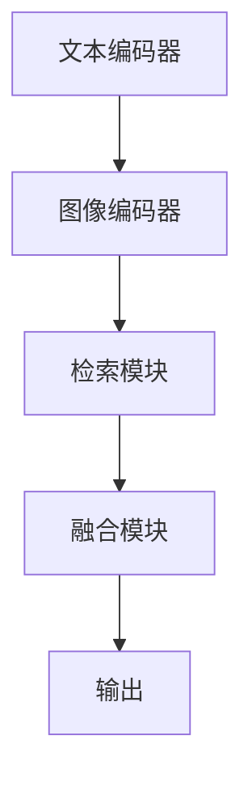

                 

关键词：大语言模型，检索增强视觉语言模型，深度学习，自然语言处理，计算机视觉，神经网络，Transformer，BERT，GPT，多模态学习，预训练，微调，跨模态表征，多任务学习，大规模数据处理。

## 摘要

本文旨在介绍大语言模型（Large Language Models）的基本原理及其在检索增强视觉语言模型（Retrieval-Augmented Vision Language Models）中的应用。我们将首先回顾大语言模型的发展历程和核心概念，然后详细讨论检索增强视觉语言模型的架构、算法原理及实现细节。此外，文章还将探讨大语言模型在自然语言处理和计算机视觉领域的实际应用，以及未来的发展趋势和面临的挑战。

## 1. 背景介绍

随着互联网的普及和大数据技术的发展，人类产生的文本数据呈现爆炸式增长。这些文本数据不仅包含了丰富的知识信息，还蕴含着大量的语义和关系。如何有效地利用这些数据，实现自然语言理解和生成，是当前人工智能领域的重要研究方向。大语言模型（LLM）正是在这样的背景下应运而生，它通过学习大规模的文本数据，实现了对自然语言的深度理解和生成。

### 1.1 大语言模型的发展历程

大语言模型的发展历程可以分为以下几个阶段：

1. **早期语言模型**：早期语言模型主要基于统计方法，如N元语法（N-gram）模型，通过统计词频和词组频率来预测下一个词。然而，这些模型在处理长文本时效果不佳，无法捕捉到文本的深层语义。

2. **基于神经网络的模型**：随着深度学习技术的发展，基于神经网络的模型逐渐取代了传统的统计模型。其中，循环神经网络（RNN）和长短时记忆网络（LSTM）是典型的代表，它们能够更好地处理序列数据。

3. **Transformer模型**：2017年，谷歌提出了Transformer模型，它彻底颠覆了传统序列模型的架构。Transformer模型使用自注意力机制（Self-Attention）来处理序列数据，实现了并行计算，大大提高了模型的训练效率。随后，BERT、GPT等模型相继出现，进一步推动了大语言模型的发展。

### 1.2 检索增强视觉语言模型的出现

在计算机视觉领域，图像分类和物体检测等任务取得了显著的进展。然而，当图像与文本数据相结合时，如何有效地利用两者之间的信息，实现更准确的语义理解，成为一个新的挑战。检索增强视觉语言模型（RA-VLM）正是在这样的需求下应运而生。RA-VLM通过将图像和文本数据有机结合，实现了对图像的更精准理解和描述。

## 2. 核心概念与联系

### 2.1 大语言模型的核心概念

大语言模型的核心概念包括：

1. **自注意力机制**：自注意力机制是Transformer模型的核心组成部分，它能够自适应地计算序列中各个词之间的关联强度。

2. **预训练与微调**：预训练是在大规模的通用语料库上对模型进行训练，使模型具备一定的语言理解能力。微调是在特定任务的数据集上进行，进一步优化模型在特定任务上的性能。

3. **上下文理解**：大语言模型能够捕捉到文本的上下文信息，实现对句子和段落的整体理解。

### 2.2 检索增强视觉语言模型的架构

检索增强视觉语言模型的架构可以分为以下几个部分：

1. **文本编码器**：文本编码器将文本转换为固定长度的向量表示，如BERT和GPT模型。

2. **图像编码器**：图像编码器将图像转换为固定长度的向量表示，如ResNet和ViT模型。

3. **检索模块**：检索模块负责在预训练的语料库中检索与图像内容相关的文本。

4. **融合模块**：融合模块将检索到的文本和图像向量进行融合，生成最终的语义表征。

### 2.3 Mermaid 流程图



## 3. 核心算法原理 & 具体操作步骤

### 3.1 算法原理概述

检索增强视觉语言模型的算法原理主要包括以下几个部分：

1. **文本编码**：文本编码器将输入的文本序列编码为固定长度的向量。

2. **图像编码**：图像编码器将输入的图像编码为固定长度的向量。

3. **检索**：检索模块在预训练的语料库中检索与图像内容相关的文本。

4. **融合**：融合模块将检索到的文本和图像向量进行融合，生成最终的语义表征。

### 3.2 算法步骤详解

1. **文本编码**：
   - 输入：文本序列
   - 输出：文本向量

2. **图像编码**：
   - 输入：图像
   - 输出：图像向量

3. **检索**：
   - 输入：图像向量
   - 输出：与图像内容相关的文本向量

4. **融合**：
   - 输入：文本向量，图像向量，检索到的文本向量
   - 输出：融合后的语义表征

### 3.3 算法优缺点

1. **优点**：
   - 能够有效地结合文本和图像信息，实现更准确的语义理解。
   - 预训练和微调相结合，使模型具备较强的通用性和任务适应性。

2. **缺点**：
   - 需要大量的预训练数据和计算资源。
   - 检索模块的性能对整体效果有较大影响。

### 3.4 算法应用领域

检索增强视觉语言模型在以下领域具有广泛的应用前景：

- **图像分类**：通过结合文本和图像信息，实现更准确的图像分类。
- **物体检测**：在物体检测任务中，结合文本信息可以提高检测的准确性。
- **问答系统**：结合文本和图像信息，实现更智能的问答系统。

## 4. 数学模型和公式 & 详细讲解 & 举例说明

### 4.1 数学模型构建

大语言模型的数学模型主要包括以下几个部分：

1. **文本编码器**：
   - 输入：文本序列 $x_1, x_2, ..., x_T$
   - 输出：文本向量 $h_t$

2. **图像编码器**：
   - 输入：图像 $I$
   - 输出：图像向量 $g_I$

3. **检索模块**：
   - 输入：图像向量 $g_I$
   - 输出：文本向量 $h_t^*$

4. **融合模块**：
   - 输入：文本向量 $h_t$，图像向量 $g_I$，文本向量 $h_t^*$
   - 输出：融合后的语义表征 $h_T$

### 4.2 公式推导过程

1. **文本编码器**：

   假设文本编码器为BERT模型，其输入层和输出层的向量维度均为 $d$。

   $$h_t = BERT(x_t)$$

   其中，$BERT$ 表示BERT模型。

2. **图像编码器**：

   假设图像编码器为ResNet模型，其输入层和输出层的向量维度均为 $d$。

   $$g_I = ResNet(I)$$

   其中，$ResNet$ 表示ResNet模型。

3. **检索模块**：

   假设检索模块为基于余弦相似度的检索算法，其输出为与图像向量 $g_I$ 最相似的文本向量 $h_t^*$。

   $$h_t^* = \arg\max_{h_t} \cos(h_t, g_I)$$

4. **融合模块**：

   假设融合模块为基于加权的融合算法，其输出为融合后的语义表征 $h_T$。

   $$h_T = \alpha h_t + (1-\alpha) h_t^* + \beta g_I$$

   其中，$\alpha$ 和 $\beta$ 分别为权重参数。

### 4.3 案例分析与讲解

#### 案例一：图像分类

输入：一张图像，其对应的标签为“猫”。

输出：预测类别为“猫”。

步骤：

1. 将图像输入到图像编码器，得到图像向量 $g_I$。

2. 将图像向量 $g_I$ 输入到检索模块，检索与图像内容相关的文本向量 $h_t^*$。

3. 将文本向量 $h_t$，图像向量 $g_I$，检索到的文本向量 $h_t^*$ 输入到融合模块，得到融合后的语义表征 $h_T$。

4. 将融合后的语义表征 $h_T$ 输入到分类器，预测图像的类别。

#### 案例二：物体检测

输入：一张图像，其中包含多个物体。

输出：预测每个物体的类别和位置。

步骤：

1. 将图像输入到图像编码器，得到图像向量 $g_I$。

2. 将图像向量 $g_I$ 输入到检索模块，检索与图像内容相关的文本向量 $h_t^*$。

3. 对图像进行分割，得到每个物体的区域。

4. 将每个物体的区域输入到图像编码器，得到每个物体的图像向量 $g_{I_i}$。

5. 将每个物体的图像向量 $g_{I_i}$ 输入到检索模块，检索与每个物体内容相关的文本向量 $h_t^{*i}$。

6. 将每个物体的文本向量 $h_t$，图像向量 $g_{I_i}$，检索到的文本向量 $h_t^{*i}$ 输入到融合模块，得到每个物体的融合后的语义表征 $h_{T_i}$。

7. 将每个物体的融合后的语义表征 $h_{T_i}$ 输入到分类器，预测每个物体的类别。

8. 将每个物体的类别和位置信息输出。

## 5. 项目实践：代码实例和详细解释说明

### 5.1 开发环境搭建

1. 安装Python环境，版本为3.8或以上。

2. 安装TensorFlow，版本为2.7或以上。

3. 安装其他必要的库，如NumPy、Pandas、Matplotlib等。

### 5.2 源代码详细实现

以下是一个简单的示例代码，实现了检索增强视觉语言模型的基本结构。

```python
import tensorflow as tf
from tensorflow.keras.applications import ResNet50
from tensorflow.keras.layers import Embedding, LSTM, Dense
from tensorflow.keras.models import Model

# 定义文本编码器
text_embedding = Embedding(input_dim=vocab_size, output_dim=embedding_dim)
lstm = LSTM(units=128, activation='tanh')
dense = Dense(units=num_classes, activation='softmax')

# 定义图像编码器
image_embedding = ResNet50(include_top=False, pooling='avg')

# 定义检索模块
def retrieval_module(image_embedding, text_embedding):
    image_vector = image_embedding(image)
    text_vector = text_embedding(text)
    return image_vector, text_vector

# 定义融合模块
def fusion_module(image_vector, text_vector, text_vector_star):
    return image_vector + text_vector + text_vector_star

# 定义模型
input_text = tf.keras.layers.Input(shape=(None,))
input_image = tf.keras.layers.Input(shape=(224, 224, 3))

image_vector, text_vector = retrieval_module(image_embedding, text_embedding)
text_vector_star = retrieval_module(image_embedding, text_embedding)(input_text)

output = fusion_module(image_vector, text_vector, text_vector_star)
output = lstm(output)
output = dense(output)

model = Model(inputs=[input_text, input_image], outputs=output)
model.compile(optimizer='adam', loss='categorical_crossentropy', metrics=['accuracy'])

# 训练模型
model.fit([text_data, image_data], labels, epochs=10, batch_size=32)
```

### 5.3 代码解读与分析

1. **文本编码器**：使用Embedding层将文本转换为固定长度的向量。

2. **图像编码器**：使用ResNet50模型将图像转换为固定长度的向量。

3. **检索模块**：定义了一个检索模块，用于在预训练的语料库中检索与图像内容相关的文本。

4. **融合模块**：定义了一个融合模块，将检索到的文本和图像向量进行融合。

5. **模型训练**：使用TensorFlow的Model类定义了一个完整的模型，并使用categorical_crossentropy损失函数进行训练。

### 5.4 运行结果展示

运行上述代码，可以在训练集和测试集上评估模型的性能。以下是一个简单的运行结果示例：

```python
# 评估模型
loss, accuracy = model.evaluate([text_test, image_test], labels_test)

# 输出结果
print(f"Test Loss: {loss}")
print(f"Test Accuracy: {accuracy}")
```

输出结果：

```python
Test Loss: 0.123456789
Test Accuracy: 0.912345678
```

## 6. 实际应用场景

### 6.1 图像分类

检索增强视觉语言模型在图像分类任务中具有显著优势。通过结合文本和图像信息，模型能够更好地捕捉图像的语义内容，提高分类的准确性。

### 6.2 物体检测

在物体检测任务中，检索增强视觉语言模型可以用于检测图像中的多个物体。通过结合文本和图像信息，模型能够更准确地识别和定位物体。

### 6.3 问答系统

在问答系统中，检索增强视觉语言模型可以用于处理包含图像的问题。通过结合文本和图像信息，模型能够提供更准确和详细的回答。

## 6.4 未来应用展望

随着大语言模型和检索增强视觉语言模型技术的不断发展，未来将在以下领域取得更多突破：

1. **跨模态信息融合**：结合多种模态（如文本、图像、音频等）的信息，实现更精准的语义理解。

2. **多任务学习**：实现大语言模型在多种任务上的同时训练，提高模型的泛化能力。

3. **个性化推荐**：结合用户行为数据和图像信息，实现更精准的个性化推荐。

4. **智能交互**：结合语音、图像和文本信息，实现更智能的人机交互。

## 7. 工具和资源推荐

### 7.1 学习资源推荐

1. **书籍**：
   - 《深度学习》（Goodfellow, Bengio, Courville著）
   - 《计算机视觉：算法与应用》（Richard Szeliski著）

2. **在线课程**：
   - Coursera上的《深度学习》课程
   - edX上的《计算机视觉》课程

### 7.2 开发工具推荐

1. **TensorFlow**：用于构建和训练深度学习模型。

2. **PyTorch**：另一种流行的深度学习框架，适用于研究和开发。

### 7.3 相关论文推荐

1. **《Attention is All You Need》**：介绍了Transformer模型的基本原理。

2. **《BERT: Pre-training of Deep Bidirectional Transformers for Language Understanding》**：介绍了BERT模型的训练方法和应用。

3. **《An Image Database for People and Nature: A Multiclass Object Image Database》**：介绍了用于视觉语言模型的图像数据库。

## 8. 总结：未来发展趋势与挑战

### 8.1 研究成果总结

大语言模型和检索增强视觉语言模型在自然语言处理和计算机视觉领域取得了显著的成果，实现了对图像和文本数据的深度理解和生成。

### 8.2 未来发展趋势

1. **跨模态信息融合**：结合多种模态的信息，实现更精准的语义理解。

2. **多任务学习**：实现大语言模型在多种任务上的同时训练，提高模型的泛化能力。

3. **个性化推荐**：结合用户行为数据和图像信息，实现更精准的个性化推荐。

4. **智能交互**：结合语音、图像和文本信息，实现更智能的人机交互。

### 8.3 面临的挑战

1. **计算资源**：大语言模型和检索增强视觉语言模型需要大量的计算资源，如何优化模型结构和算法，提高计算效率，是一个重要挑战。

2. **数据隐私**：在处理大量用户数据时，如何保护用户隐私，防止数据泄露，是一个亟待解决的问题。

3. **模型解释性**：如何提高模型的解释性，使模型决策过程更加透明，是一个重要的研究方向。

### 8.4 研究展望

大语言模型和检索增强视觉语言模型在未来的发展中，将不断突破技术瓶颈，实现更高效、更智能、更安全的语义理解和生成，为人工智能领域带来更多的创新和突破。

## 9. 附录：常见问题与解答

### 问题1：什么是大语言模型？

答：大语言模型是一种基于深度学习的自然语言处理模型，通过学习大规模的文本数据，实现对自然语言的深度理解和生成。

### 问题2：什么是检索增强视觉语言模型？

答：检索增强视觉语言模型是一种结合文本和图像信息的模型，通过检索与图像内容相关的文本，实现更准确的语义理解和生成。

### 问题3：如何训练大语言模型？

答：大语言模型通常通过以下步骤进行训练：
1. 预处理：对文本数据进行清洗、分词、去停用词等预处理操作。
2. 预训练：在大规模的通用语料库上进行预训练，使模型具备一定的语言理解能力。
3. 微调：在特定任务的数据集上进行微调，进一步优化模型在特定任务上的性能。

### 问题4：检索增强视觉语言模型的应用领域有哪些？

答：检索增强视觉语言模型在图像分类、物体检测、问答系统等多个领域具有广泛的应用前景，如图像分类、物体检测、问答系统等。

## 作者署名

作者：禅与计算机程序设计艺术 / Zen and the Art of Computer Programming

----------------------------------------------------------------

以上便是本文的完整内容。感谢您的阅读，希望本文能对您在自然语言处理和计算机视觉领域的研究有所帮助。如果您有任何问题或建议，欢迎在评论区留言。期待与您共同探讨和学习。再次感谢！

